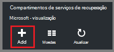
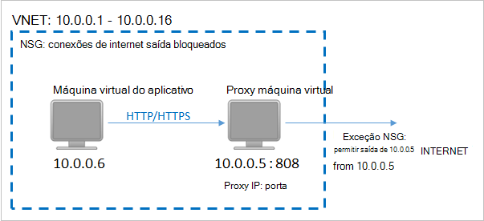
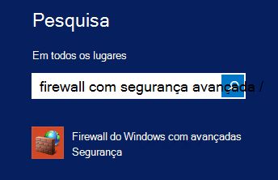
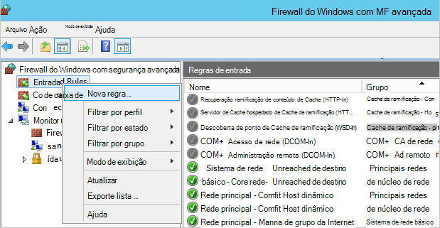

<properties
    pageTitle="Preparando seu ambiente para fazer backup de máquinas de virtuais implantados Gerenciador de recursos | Microsoft Azure"
    description="Certificar-se de que seu ambiente está preparado para fazer backup de máquinas virtuais no Azure"
    services="backup"
    documentationCenter=""
    authors="markgalioto"
    manager="cfreeman"
    editor=""
    keywords="backups; fazer backup;"/>

<tags
    ms.service="backup"
    ms.workload="storage-backup-recovery"
    ms.tgt_pltfrm="na"
    ms.devlang="na"
    ms.topic="article"
    ms.date="08/21/2016"
    ms.author="trinadhk; jimpark; markgal;"/>


# <a name="prepare-your-environment-to-back-up-resource-manager-deployed-virtual-machines"></a>Preparar o ambiente para fazer backup de máquinas de virtuais implantados Gerenciador de recursos

> [AZURE.SELECTOR]
- [Modelo do Gerenciador de recursos](backup-azure-arm-vms-prepare.md)
- [Modelo clássico](backup-azure-vms-prepare.md)

Este artigo fornece as etapas para preparar seu ambiente para fazer backup de uma gerente de recursos implantados virtuais de máquina. As etapas mostradas procedimentos a usam o portal do Azure.  

O serviço de Backup do Azure tem dois tipos de compartimentos (backup compartimentos e compartimentos de serviços de recuperação) para proteger suas VMs. Um backup cofre protege VMs implantadas usando o modelo de implantação do clássico. Um cofre de serviços de recuperação protege **VMs tanto implantado clássico ou implantado Gerenciador de recursos** . Você deve usar um cofre de serviços de recuperação de proteger uma máquina virtual implantado Gerenciador de recursos.

>[AZURE.NOTE] Azure tem dois modelos de implantação para criar e trabalhar com recursos: [Gerenciador de recursos e clássico](../resource-manager-deployment-model.md). Consulte [preparar seu ambiente backup Azure máquinas virtuais](backup-azure-vms-prepare.md) para obter detalhes sobre como trabalhar com o modelo de implantação de clássico VMs.

Antes de proteger ou fazer backup de uma gerente de recursos implantados virtuais de máquina, verifique se que existem estes pré-requisitos:

- Criar um cofre de serviços de recuperação (ou identificar um cofre de serviços de recuperação existente) *no mesmo local que sua máquina virtual*.
- Selecione um cenário, definir a política de backup e definir itens para proteger.
- Verifique a instalação do agente de máquina virtual na máquina virtual.
- Verifique a conectividade de rede

Se você souber que essas condições já existem no seu ambiente, em seguida, vá para [fazer backup de seu artigo de VMs](backup-azure-vms.md). Se você precisar configurar ou verificar, qualquer um desses pré-requisitos, este artigo orienta você pelas etapas para preparar esse pré-requisito.


## <a name="limitations-when-backing-up-and-restoring-a-vm"></a>Limitações ao fazer backup e restaurar uma máquina virtual

Antes de preparar seu ambiente, por favor, compreenda as limitações.

- Fazer backup de máquinas virtuais com mais de 16 discos de dados não é suportada.
- Não há suporte para fazer backup de máquinas virtuais com um endereço IP reservado e nenhum ponto de extremidade definido.
- Não há suporte para o backup de máquinas virtuais de Linux com extensão Docker. 
- Dados de backup não incluem unidades de rede montado anexadas à máquina virtual. 
- Não há suporte para a substituição de uma máquina virtual existente durante a restauração. Se você tentar restaurar a máquina virtual quando a máquina virtual existe, a operação de restauração falhará.
- Não há suporte para a região entre backup e restauração.
- Você pode fazer backup de máquinas virtuais em todas as regiões públicas do Azure (consulte a [lista de verificação](https://azure.microsoft.com/regions/#services) de regiões com suporte). Se a região que você está procurando não tiver suporte hoje, ela não aparecerá na lista suspensa durante a criação de cofre.
- Você pode fazer backup máquinas virtuais apenas para versões selecione sistema operacional:
  - **Linux**: Backup Azure dá suporte a [uma lista de distribuições que contam com a aprovação por Azure](../virtual-machines/virtual-machines-linux-endorsed-distros.md) exceto Core SO Linux.  Outras distribuições trazer-Your-proprietário-Linux também podem funcionar, desde que o agente de máquina virtual está disponível na máquina virtual e suporte para Python existe.
  - **Windows Server**: versões mais antigas do que o Windows Server 2008 R2 não são suportadas.
- Restaurar um controlador de domínio (DC) máquina virtual que faz parte de uma configuração de multi-DC só é suportado através do PowerShell. Leia mais sobre como [restaurar um controlador de domínio multi-DC](backup-azure-restore-vms.md#restoring-domain-controller-vms).
- Restaurar máquinas virtuais que ter as seguintes configurações de rede especial só é suportado através do PowerShell. VMs criadas usando o fluxo de trabalho de restauração na interface de usuário não terá essas configurações de rede após a conclusão da operação de restauração. Para saber mais, consulte [Restaurando VMs com configurações de rede especial](backup-azure-restore-vms.md#restoring-vms-with-special-netwrok-configurations).
  - Máquinas virtuais em configuração de Balanceador de carga (interna e externa)
  - Máquinas virtuais com vários endereços IP reservados
  - Máquinas virtuais com vários adaptadores de rede

## <a name="create-a-recovery-services-vault-for-a-vm"></a>Criar um cofre de serviços de recuperação de uma máquina virtual

Um cofre de serviços de recuperação é uma entidade que armazena os backups e pontos de recuperação que foram criados ao longo do tempo. O Cofre de serviços de recuperação também contém as políticas de backup associadas as máquinas virtuais protegidas.

Para criar um cofre de serviços de recuperação:

1. Entrar no [portal do Azure](https://portal.azure.com/).

2. No menu Hub, clique em **Procurar** e na lista de recursos, digite **Os serviços de recuperação**. Conforme você começa a digitar, filtre a lista com base na sua entrada. Clique em **Serviços de recuperação cofre**.

     <br/>

    Na lista de serviços de recuperação compartimentos é exibida.

3. No menu **compartimentos de serviços de recuperação** , clique em **Adicionar**.

    

    A lâmina de Cofre de serviços de recuperação é aberta, solicitando que você forneça um **nome**, **assinatura**, **grupo de recursos**e **local**.

    

4. Para **nome**, digite um nome amigável para identificar o cofre. O nome deve ser exclusivo para a assinatura do Azure. Digite um nome que contenha entre 2 e 50 caracteres. Ele deve começar com uma letra e pode conter apenas letras, números e hifens.

5. Clique na **assinatura** para ver a lista de assinaturas disponíveis. Se você não tiver certeza de qual assinatura usar, use o padrão (ou sugeridos) assinatura. Haverá várias opções somente se sua conta organizacional está associada a várias assinaturas Azure.

6. Clique em **grupo de recursos** para ver a lista de grupos de recursos disponíveis, ou clique em **novo** para criar um novo grupo de recursos. Para obter informações completas sobre grupos de recursos, consulte [Visão geral do Gerenciador de recursos do Azure](../azure-resource-manager/resource-group-overview.md)

7. Clique em **local** para selecionar a região geográfica para o cofre. O cofre **deve** estar na mesma região como máquinas virtuais que você deseja proteger.

    >[AZURE.IMPORTANT] Se você não tiver certeza do local em que sua máquina virtual existe, feche a caixa de diálogo de criação de cofre e vá para a lista de máquinas virtuais no portal. Se você tiver máquinas virtuais em várias regiões, você precisará criar um cofre de serviços de recuperação em cada região. Crie o cofre no primeiro local antes de ir para o próximo local. Não é necessário para especificar contas de armazenamento para armazenar os dados de backup – o Cofre de serviços de recuperação e o serviço de Backup do Azure lidar com isso automaticamente.

8. Clique em **criar**. Pode levar alguns instantes para o Cofre de serviços de recuperação a ser criado. Monitore as notificações de status na área superior direita no portal. Depois que seu cofre é criado, ele aparece na lista de serviços de recuperação compartimentos.

    

    Agora que você criou seu cofre, Aprenda a configurar a replicação de armazenamento.

## <a name="set-storage-replication"></a>Replicação de armazenamento de conjunto

A opção de replicação de armazenamento permite que você escolha entre armazenamento geográfica redundante e localmente redundantes. Por padrão, seu cofre tem armazenamento redundante de localização geográfica. Deixe a opção definida como armazenamento geográfica redundante se esta for sua principal de backup. Escolha armazenamento localmente redundante se quiser que uma opção mais barata que não é bastante tão durável. Leia mais sobre [geográfica redundante](../storage/storage-redundancy.md#geo-redundant-storage) e opções de armazenamento [localmente redundantes](../storage/storage-redundancy.md#locally-redundant-storage) na [Visão geral de replicação de armazenamento do Azure](../storage/storage-redundancy.md).

Para editar a configuração de replicação de armazenamento:

1. Selecione seu cofre para abrir o painel Cofre e a lâmina de configurações. Se a lâmina **configurações** não abrir, clique em **todas as configurações** no painel Cofre.

2. Na lâmina **configurações** , clique em **Infraestrutura de Backup** > **Configuração de Backup** para abrir a lâmina de **Configuração de Backup** . Na lâmina **Configuração de Backup** , escolha a opção de replicação de armazenamento para seu cofre.

    

    Depois de escolher a opção de armazenamento de seu cofre, você está pronto para associar a máquina virtual do cofre. Para começar a associação, você deve descobrir e registrar as máquinas virtuais Azure.


## <a name="select-a-backup-goal-set-policy-and-define-items-to-protect"></a>Selecione uma meta de backup, definir a política e definir itens proteger

Antes de registrar uma máquina virtual com um cofre, execute o processo de detecção para garantir que quaisquer novas máquinas virtuais que foram adicionadas à assinatura serão identificadas. As consultas de processo do Azure para a lista de máquinas virtuais na assinatura, juntamente com informações adicionais, como o nome do serviço de nuvem e a região. No portal do Azure, o cenário se refere ao qual você vai colocar em Cofre de serviços de recuperação. Política é o cronograma de frequência e quando os pontos de recuperação são feitos. Política também inclui o intervalo de retenção para os pontos de recuperação.

1. Se você já tiver um aberto de Cofre de serviços de recuperação, vá para a etapa 2. Se você não tem um serviços de recuperação cofre aberto, mas no portal do Azure, no menu Hub, clique em **Procurar**.

  - Na lista de recursos, digite **Os serviços de recuperação**.
  - Conforme você começa a digitar, filtre a lista com base na sua entrada. Quando você vir **compartimentos de serviços de recuperação**, clique nele.

     <br/>

    Na lista de serviços de recuperação compartimentos é exibida.
  - Na lista de serviços de recuperação compartimentos, selecione um cofre.

    No painel Cofre selecionado é aberta.

    

2. No menu de painel Cofre clique em **Backup** para abrir a lâmina de Backup.

    

    Quando a lâmina é aberta, o serviço de Backup procura qualquer novas VMs na assinatura.

    

3. Na lâmina Backup, clique em **objetivo de Backup** para abrir a lâmina meta de Backup.

    

4. Na lâmina meta Backup, definir **onde está a carga de trabalho em execução** no Azure e **o que fazer que você deseja fazer backup** Máquina Virtual, e então clique em **Okey**.

    A lâmina meta de Backup fecha e abre a lâmina de política de Backup.

    

5. Na lâmina política Backup, selecione a política de backup que você deseja aplicar ao Cofre e clique em **Okey**.

    

    Os detalhes da política padrão são listados na seção detalhes. Se você quiser criar uma nova política, selecione **Criar novo** do menu suspenso. No menu suspenso também oferece uma opção para alternar a hora quando o instantâneo é feito, a 7 PM. Para obter instruções sobre como definir uma política de backup, consulte [definindo uma política de backup](backup-azure-vms-first-look-arm.md#defining-a-backup-policy). Quando você clicar **Okey**, a política de backup está associada com o cofre.

    Em seguida, escolha as VMs para associar o cofre.

6. Escolha as máquinas virtuais para associar à política especificada e clique em **Selecionar**.

    

    Se você não vir a máquina virtual desejada, verifique se ele existe no mesmo local Azure como o Cofre de serviços de recuperação.

7. Agora que você definiu todas as configurações para o cofre, na lâmina Backup clique em **Habilitar Backup** na parte inferior da página. Esse procedimento implanta a política para o cofre e VMs.

    

A próxima fase de preparação está instalando o agente de máquina virtual ou garantir que o agente de máquina virtual está instalado.


## <a name="install-the-vm-agent-on-the-virtual-machine"></a>Instalar o agente de máquina virtual na máquina virtual

O agente de máquina virtual do Azure deve ser instalado na máquina virtual Azure para a extensão de Backup trabalhar. Se sua máquina virtual foi criado da Galeria Azure, em seguida, o agente de máquina virtual já está presente na máquina virtual. Esta informação é fornecida para as situações nas quais é *não* usar uma máquina virtual criada da Galeria Azure - por exemplo que você migrada uma máquina virtual de um data center local. Nesse caso, o agente de máquina virtual precisa estar instalado para proteger a máquina virtual.

Saiba mais sobre o [Agente de máquina virtual](https://go.microsoft.com/fwLink/?LinkID=390493&clcid=0x409) e [como instalar o agente de máquina virtual](../virtual-machines/virtual-machines-windows-classic-manage-extensions.md).

Se você tiver problemas ao fazer backup a máquina virtual do Azure, verifique se o agente de máquina virtual do Azure está instalado corretamente na máquina virtual (consulte a tabela abaixo). Se você criou uma máquina virtual personalizada, [Verifique se a caixa de seleção **instalar o agente de máquina virtual** está selecionada](../virtual-machines/virtual-machines-windows-classic-agents-and-extensions.md) antes da máquina virtual está provisionado.

A tabela a seguir fornece informações adicionais sobre o agente de máquina virtual do Windows e VMs Linux.

| **Operação** | **Windows** | **Linux** |
| --- | --- | --- |
| Instalando o agente de máquina virtual | <li>Baixe e instale o [agente MSI](http://go.microsoft.com/fwlink/?LinkID=394789&clcid=0x409). Você precisará privilégios de administrador para concluir a instalação. <li>[Atualizar a propriedade de máquina virtual](http://blogs.msdn.com/b/mast/archive/2014/04/08/install-the-vm-agent-on-an-existing-azure-vm.aspx) para indicar que o agente está instalado. | <li> Instale a versão mais recente [Linux agente](https://github.com/Azure/WALinuxAgent) do GitHub. Você precisará privilégios de administrador para concluir a instalação. <li> [Atualizar a propriedade de máquina virtual](http://blogs.msdn.com/b/mast/archive/2014/04/08/install-the-vm-agent-on-an-existing-azure-vm.aspx) para indicar que o agente está instalado. |
| Atualizando o agente de máquina virtual | Atualizar o agente de máquina virtual é tão simple quanto reinstalar os [binários do agente de máquina virtual](http://go.microsoft.com/fwlink/?LinkID=394789&clcid=0x409). <br>Certifique-se de que nenhuma operação de backup está em execução enquanto o agente de máquina virtual está sendo atualizado. | Siga as instruções sobre como [atualizar o agente de máquina virtual Linux ](../virtual-machines-linux-update-agent.md). <br>Certifique-se de que nenhuma operação de backup está em execução enquanto o agente de máquina virtual está sendo atualizado. |
| Validando a instalação do agente de máquina virtual | <li>Navegue até a pasta *C:\WindowsAzure\Packages* na máquina virtual do Azure. <li>Você deve encontrar o arquivo de WaAppAgent.exe presente.<li> Clique com botão direito no arquivo, vá para **Propriedades**e selecione a guia **detalhes** . O campo de versão do produto deve ser 2.6.1198.718 ou superior. | N/D |


### <a name="backup-extension"></a>Extensão de backup

Quando o agente de máquina virtual estiver instalado na máquina virtual, o serviço de Backup do Azure instala a extensão de backup para o agente de máquina virtual. O serviço de Backup do Azure diretamente atualizações e patches a extensão de backup.

A extensão de backup é instalada pelo serviço de Backup, estando ou não a máquina virtual está em execução. Uma máquina virtual em execução fornece as maiores chances de marcar um ponto de recuperação consistente com aplicativos. No entanto, o serviço de Backup do Azure continua backup a máquina virtual, mesmo se ele está desativado e a extensão não pôde ser instalada. Isso é conhecido como Offline máquina virtual. Nesse caso, o ponto de recuperação será *falha consistente*.


## <a name="network-connectivity"></a>Conectividade de rede

Para gerenciar os instantâneos de máquina virtual, a extensão de backup precisa ter conectividade com os endereços IP públicos Azure. Sem a direita conectividade com a Internet, tempo limite de solicitações de HTTP da máquina virtual e a operação de backup falhará. Se sua implantação possui restrições de acesso no lugar (por meio de um grupo de segurança da rede (NSG), por exemplo), escolha uma destas opções para fornecer um caminho claro para tráfego de backup:

- [Intervalos de IP do data center Azure branca](http://www.microsoft.com/en-us/download/details.aspx?id=41653) - consulte o artigo para obter instruções sobre como à branca os endereços IP.
- Implante um servidor de proxy HTTP para rotear o tráfego.

Ao decidir qual opção usar, as compensações estão entre capacidade de gerenciamento, controle granular e custo.

|Opção|Vantagens|Desvantagens|
|------|----------|-------------|
|Intervalos de IP whitelists| Não há custos adicionais.<br><br>Para abrir o acesso em um NSG, use o cmdlet <i>Set-AzureNetworkSecurityRule</i> . | Complexa para gerenciar como os afetados intervalos IP alteram ao longo do tempo.<br><br>Fornece acesso a todo do Azure e não apenas armazenamento.|
|Proxy HTTP| Controle granular no proxy sobre as URLs de armazenamento permitido.<br>Único ponto de acesso à Internet em VMs.<br>Não sujeito às alterações de endereço IP do Azure.| Custos adicionais para executar uma máquina virtual com o software de proxy.|

### <a name="whitelist-the-azure-datacenter-ip-ranges"></a>Intervalos de IP do data center Azure branca

À branca os intervalos de IP do data center Azure, consulte o [site Azure](http://www.microsoft.com/en-us/download/details.aspx?id=41653) para obter detalhes sobre os intervalos de IP e instruções.

### <a name="using-an-http-proxy-for-vm-backups"></a>Usando um proxy HTTP para backups de máquina virtual
Ao fazer backup de uma máquina virtual, a extensão de backup na VM envia os comandos de gerenciamento de instantâneo ao armazenamento do Azure usando uma API de HTTPS. Rotear o tráfego de backup extensão através do proxy HTTP, pois é o único componente configurado para acesso à Internet pública.

>[AZURE.NOTE] Não há nenhuma recomendação para o software de proxy que deve ser usado. Certifique-se de que você escolha um proxy que seja compatível com as etapas de configuração abaixo.

A imagem de exemplo abaixo mostra as etapas de configuração de três necessário usar um proxy HTTP:

- Máquina virtual do aplicativo rotear todo o tráfego HTTP vinculado para a Internet pública por meio de máquina virtual do Proxy.
- Proxy máquina virtual permite que o tráfego de entrada do VMs da rede virtual.
- O grupo de segurança de rede (NSG) denominada NSF-bloqueio precisa de um segurança regra permitindo Internet tráfego de saída de máquina virtual do Proxy.



Para usar um proxy HTTP para comunicar-se à Internet pública, siga estas etapas:

#### <a name="step-1-configure-outgoing-network-connections"></a>Etapa 1. Configurar conexões de rede de saída

###### <a name="for-windows-machines"></a>Para máquinas do Windows
Isso irá configurar configuração do servidor proxy para a conta do sistema Local.

1. Baixar [PsExec](https://technet.microsoft.com/sysinternals/bb897553)
2. Execute o seguinte comando de prompt elevado,

     ```
     psexec -i -s "c:\Program Files\Internet Explorer\iexplore.exe"
     ```
     Ele será aberto a janela do internet explorer.
3. Vá para Ferramentas -> Opções da Internet -> conexões -> configurações da LAN.
4. Verifique as configurações de proxy de conta do sistema. Definir Proxy IP e porta.
5. Feche o Internet Explorer.

Isso irá configurar uma configuração de proxy de máquina e será usado qualquer tráfego de saída HTTP/HTTPS.

Se você tiver um servidor proxy de configuração em uma conta de usuário atual (não uma conta do sistema Local), use o seguinte script aplicá-las ao SYSTEMACCOUNT:

```
   $obj = Get-ItemProperty -Path Registry::”HKEY_CURRENT_USER\Software\Microsoft\Windows\CurrentVersion\Internet Settings\Connections"
   Set-ItemProperty -Path Registry::”HKEY_USERS\S-1-5-18\Software\Microsoft\Windows\CurrentVersion\Internet Settings\Connections" -Name DefaultConnectionSettings -Value $obj.DefaultConnectionSettings
   Set-ItemProperty -Path Registry::”HKEY_USERS\S-1-5-18\Software\Microsoft\Windows\CurrentVersion\Internet Settings\Connections" -Name SavedLegacySettings -Value $obj.SavedLegacySettings
   $obj = Get-ItemProperty -Path Registry::”HKEY_CURRENT_USER\Software\Microsoft\Windows\CurrentVersion\Internet Settings"
   Set-ItemProperty -Path Registry::”HKEY_USERS\S-1-5-18\Software\Microsoft\Windows\CurrentVersion\Internet Settings" -Name ProxyEnable -Value $obj.ProxyEnable
   Set-ItemProperty -Path Registry::”HKEY_USERS\S-1-5-18\Software\Microsoft\Windows\CurrentVersion\Internet Settings" -Name Proxyserver -Value $obj.Proxyserver
```

>[AZURE.NOTE] Se você observar "(407) autenticação de Proxy necessária" no log de servidor proxy, verifique sua autenticação está configurado corretamente.

######<a name="for-linux-machines"></a>Para máquinas Linux

Adicione a seguinte linha para o ```/etc/environment``` arquivo:

```
http_proxy=http://<proxy IP>:<proxy port>
```

Adicione as seguintes linhas para a ```/etc/waagent.conf``` arquivo:

```
HttpProxy.Host=<proxy IP>
HttpProxy.Port=<proxy port>
```

#### <a name="step-2-allow-incoming-connections-on-the-proxy-server"></a>Etapa 2. Permitir conexões de entrada no servidor proxy:

1. No servidor proxy, abra o Firewall do Windows. A maneira mais fácil para acessar o firewall é pesquisar pelo Firewall do Windows com segurança avançada.

    

2. Na caixa de diálogo Firewall do Windows, clique com botão direito **Regras de entrada** e clique em **Nova regra...**.

    

3. No **Assistente de nova entrada regra**, escolha a opção **personalizado** para o **Tipo de regra** e clique em **Avançar**.
4. Na página Selecionar o **programa**, escolha **Todos os programas** e clique em **Avançar**.

5. Na página **protocolo e portas** , insira as seguintes informações e clique em **Avançar**:

    

    - para o *tipo de protocolo* escolha *TCP*
    - para *porta Local* escolha *Portas específicas*, no campo abaixo especificar a ```<Proxy Port>``` que foi configurado.
    - para *porta remota* , selecione *Todas as portas*

    Para o restante do assistente, clique em totalmente até o final e dê um nome para esta regra.

#### <a name="step-3-add-an-exception-rule-to-the-nsg"></a>Etapa 3. Adicione uma regra de exceção para o NSG:

Em um prompt de comando do PowerShell do Azure, digite o seguinte comando:

O comando a seguir adiciona uma exceção para o NSG. Essa exceção permite tráfego TCP de qualquer porta no 10.0.0.5 qualquer endereço da Internet na porta 80 (HTTP) ou 443 (HTTPS). Se você solicitar uma porta específica da Internet pública, certifique-se de adicionar porta para o ```-DestinationPortRange``` também.

```
Get-AzureNetworkSecurityGroup -Name "NSG-lockdown" |
Set-AzureNetworkSecurityRule -Name "allow-proxy " -Action Allow -Protocol TCP -Type Outbound -Priority 200 -SourceAddressPrefix "10.0.0.5/32" -SourcePortRange "*" -DestinationAddressPrefix Internet -DestinationPortRange "80-443"
```


*Estas etapas usam nomes específicos e valores para este exemplo. Use os nomes e valores para sua implantação ao inserir, ou para recortar e colar detalhes para seu código.*


Agora que você sabe que você tiver conectividade de rede, você está pronto para fazer backup de sua máquina virtual. Consulte [fazer backup de VMs implantado Gerenciador de recursos](backup-azure-arm-vms.md).

## <a name="questions"></a>Dúvidas?
Se você tiver dúvidas ou se houver algum recurso que você gostaria de ver incluídos, [envie-nos comentários](http://aka.ms/azurebackup_feedback).

## <a name="next-steps"></a>Próximas etapas
Agora que você preparar o ambiente para fazer backup de sua máquina virtual, sua próxima etapa lógica é criar um backup. O artigo planejamento fornece informações mais detalhadas sobre como fazer backup VMs.

- [Fazer backup de máquinas virtuais](backup-azure-vms.md)
- [Planejar sua infraestrutura de backup de máquina virtual](backup-azure-vms-introduction.md)
- [Gerenciar backups de máquina virtual](backup-azure-manage-vms.md)
