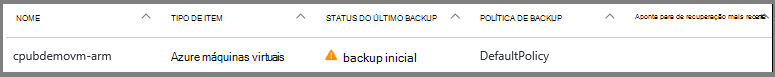
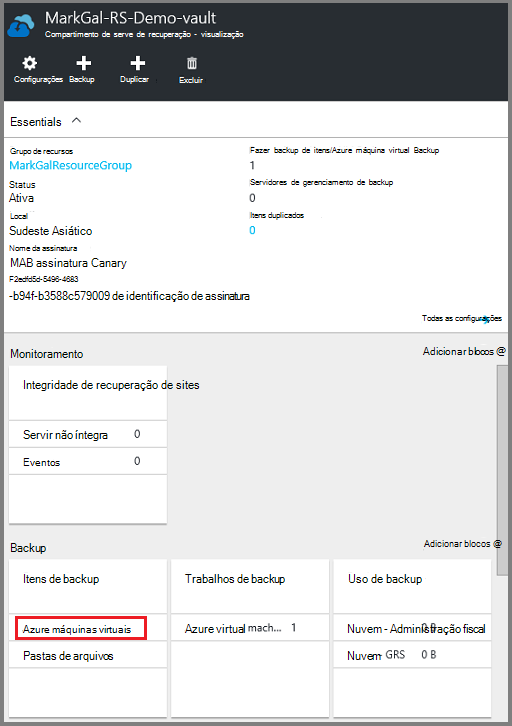
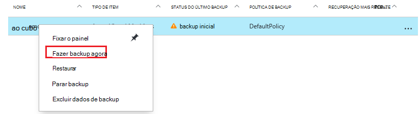
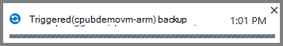
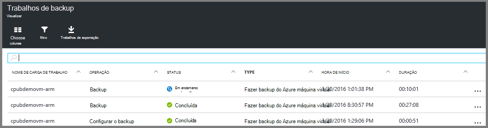

<properties
    pageTitle="Fazer backup de VMs Azure a um cofre de serviços de recuperação | Microsoft Azure"
    description="Descubra, registrar e fazer backup Azure máquinas virtuais em um cofre de serviços de recuperação com esses procedimentos para backup Azure máquina virtual."
    services="backup"
    documentationCenter=""
    authors="markgalioto"
    manager="cfreeman"
    editor=""
    keywords="backup de máquina virtual; fazer backup de máquina virtual; backup e recuperação de desastres; fazer backup de máquina virtual do braço"/>

<tags
    ms.service="backup"
    ms.workload="storage-backup-recovery"
    ms.tgt_pltfrm="na"
    ms.devlang="na"
    ms.topic="article"
    ms.date="07/29/2016"
    ms.author="trinadhk; jimpark; markgal;"/>

# Faça backup do Azure VMs em um cofre de serviços de recuperação

> [AZURE.SELECTOR]
- [Fazer backup de VMs Cofre de serviços de recuperação](backup-azure-arm-vms.md)
- [Fazer backup de VMs Cofre de Backup](backup-azure-vms.md)

Este artigo fornece o procedimento para backup Azure VMs (Gerenciador de recursos implantados e implantado clássico) para um cofre de serviços de recuperação. A maioria do trabalho de backup de VMs entra em preparação. Antes de fazer backup ou proteger uma máquina virtual, você deve concluir os [pré-requisitos](backup-azure-arm-vms-prepare.md) para preparar seu ambiente para proteger suas VMs. Quando tiver concluído os pré-requisitos, você pode iniciar o operação de instantâneos da sua máquina virtual de backup.

>[AZURE.NOTE] Azure tem dois modelos de implantação para criar e trabalhar com recursos: [Gerenciador de recursos e clássico](../resource-manager-deployment-model.md). Você pode proteger VMs implantado Gerenciador de recursos e VMs clássico com compartimentos de serviços de recuperação. Consulte [fazer backup Azure máquinas virtuais](backup-azure-vms.md) para obter detalhes sobre como trabalhar com o modelo de implantação de clássico VMs.

Para obter informações adicionais, consulte os artigos sobre o [planejamento de sua infraestrutura de backup de máquina virtual no Azure](backup-azure-vms-introduction.md) e [Azure máquinas virtuais](https://azure.microsoft.com/documentation/services/virtual-machines/).

## Acionar o trabalho de backup

Fazer backup política associada com o Cofre de serviços de recuperação, define a frequência e quando a operação de backup é executado. Por padrão, o primeiro backup agendado é o backup inicial. Até que o backup inicial ocorra, o Status do último Backup na lâmina **Trabalhos de Backup** mostra como **aviso (backup inicial pendentes)**.

A menos que o backup inicial conclusão comece muito em breve, é recomendável que você executar o **backup agora**. O procedimento a seguir inicia no painel do cofre. Esse procedimento serve para executar o trabalho de backup inicial depois de terminar todos os pré-requisitos. Se o trabalho de backup inicial já foi executado, este procedimento não está disponível. A política de backup associada determina o próximo trabalho de backup.  

Para executar o trabalho de backup inicial:

1. No painel Cofre no bloco **Backup** , clique em **máquinas virtuais do Azure**.  
    

    Abre a lâmina de **Itens de Backup** .

2. Na lâmina **Itens de Backup** , o cofre que você deseja fazer backup de atalho e clique em **Backup agora**.

    

    O trabalho de Backup é disparado.  

    

3. Para ver que o backup inicial foi concluída, no painel Cofre no bloco **Trabalhos de Backup** , clique em **Azure máquinas virtuais**.

    

    Abre a lâmina de trabalhos de Backup.

4. Na lâmina **trabalhos de Backup** , você pode ver o status de todos os trabalhos.

    

    >[AZURE.NOTE] Como parte da operação de backup, o serviço do Azure Backup emite um comando para a extensão de backup em cada máquina virtual liberar todas as gravações e tirar um instantâneo consistente.

    Quando o trabalho de backup for concluído, o status é *concluído*.

## Solucionando problemas de erros
Se você enfrentar problemas durante a cópia backup sua máquina virtual, consulte o [artigo de solução de problemas de máquina virtual](backup-azure-vms-troubleshoot.md) para obter ajuda.

## Próximas etapas

Agora que você protegeu sua máquina virtual, confira os seguintes artigos para gerenciamento adicional tarefas que você pode fazer com suas VMs e como restaurar VMs.

- [Gerenciar e monitorar suas máquinas virtuais](backup-azure-manage-vms.md)
- [Restaurar máquinas virtuais](backup-azure-arm-restore-vms.md)
