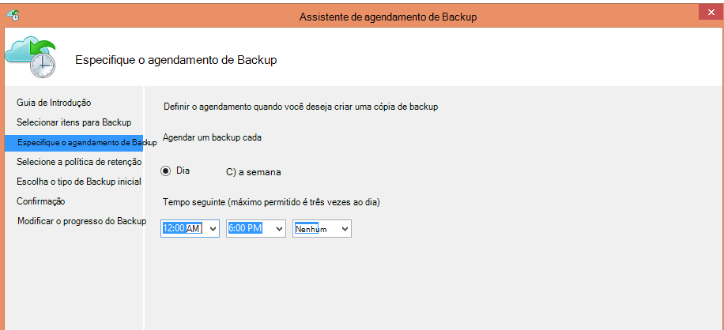
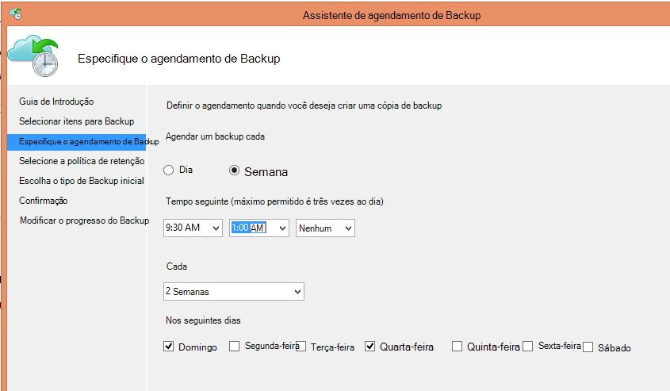
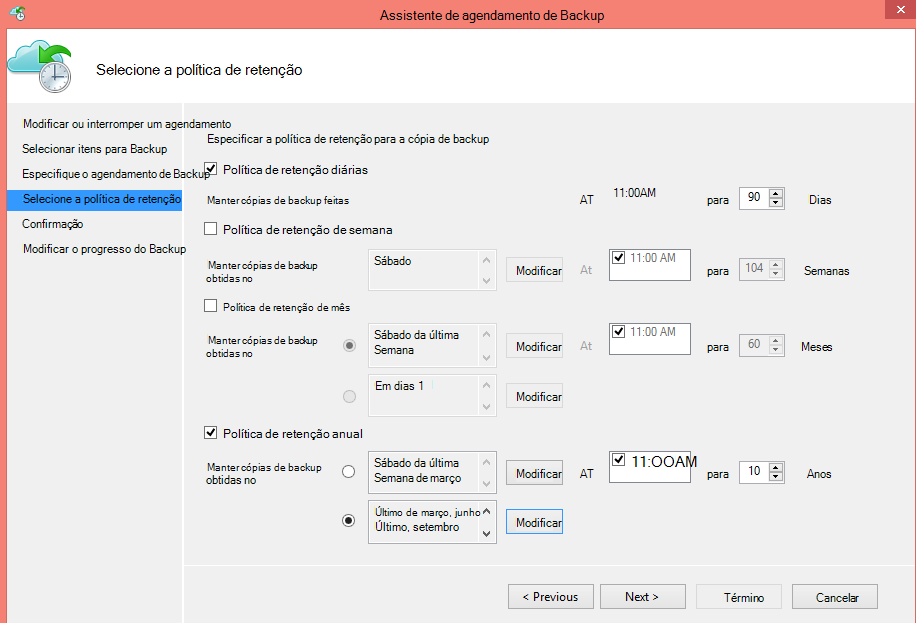
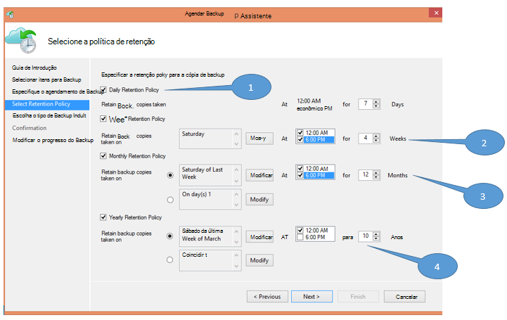
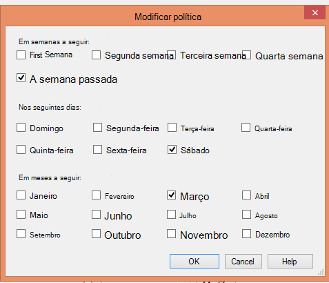

<properties
   pageTitle="Usar o Backup do Azure para substituir sua infraestrutura de fita | Microsoft Azure"
   description="Saiba como Backup do Azure fornece semântica de fita semelhante que permite fazer backup e restaurar dados no Azure"
   services="backup"
   documentationCenter=""
   authors="trinadhk"
   manager="vijayts"
   editor=""/>
<tags
   ms.service="backup"
   ms.devlang="na"
   ms.topic="article"
   ms.tgt_pltfrm="na"
   ms.workload="storage-backup-recovery"
   ms.date="09/27/2016"
   ms.author="jimpark;trinadhk;markgal"/>

# Usar o Backup do Azure para substituir sua infraestrutura de fita

Clientes de Backup e Gerenciador de proteção de dados do System Center Azure podem:

- Fazer backup de dados em agendas que melhor atender às necessidades organizacionais.
- Manter os dados de backup por períodos mais longos
- Verifique o Azure precisa de uma parte da sua retenção de longo prazo (em vez de fita).

Este artigo explica como os clientes podem habilitar backup e políticas de retenção. Aos clientes que usam fitas seu longo-prazo retenção de endereços agora precisam ter uma alternativa viável e poderosa com a disponibilidade desse recurso. O recurso é habilitado na versão mais recente do Backup Azure (que está disponível [aqui](http://aka.ms/azurebackup_agent)). Os clientes do System Center DPM devem atualizar, pelo menos, DPM 2012 R2 UR5 antes de usar DPM com o serviço de Backup do Azure.

## O que é o cronograma de Backup?
O agendamento de backup indica a frequência da operação de backup. Por exemplo, as configurações na tela a seguir indicam que são realizados backups diariamente às 6 pm e à meia-noite.

Os clientes também podem agendar um backup semanal. Por exemplo, as configurações na tela a seguir indicam que são realizados backups cada domingo alternativo & quarta-feira em 9:30 AM e 1:00 AM.

## Qual é a política de retenção?
A política de retenção Especifica a duração para a qual o backup deve ser armazenado. Em vez de apenas especificando uma "política simples" para todos os pontos de backup, os clientes podem especificar diferentes políticas de retenção com base em quando o backup é feito. Por exemplo, o ponto de backup tirado diariamente, que serve como um ponto de recuperação operacional, é preservado por 90 dias. O ponto de backup feito no final de cada trimestre para fins de auditoria é preservado por uma duração mais longa.

O número total de "pontos de retenção" especificado nesta política é 90 (diários pontos) + 40 (uma em cada trimestre por 10 anos) = 130.

## Exemplo – juntando ambos

1. **Política de retenção diária**: Backups feitos diariamente são armazenados por sete dias.
2. **Política de retenção semanal**: Backups realizados diariamente meia-noite e às 18H sábado são preservados para quatro semanas
3. **Política de retenção mensal**: Backups feitos em meia-noite e às 18h no último sábado de cada mês são preservados por 12 meses
4. **Política de retenção anual**: Backups feitos à meia-noite do último sábado de cada março são preservados por 10 anos

O número total de "pontos de retenção" (pontos da qual um cliente pode restaurar dados) no diagrama anterior é calculado da seguinte maneira:

- dois pontos por dia para sete dias = 14 pontos de recuperação
- dois pontos por semana para quatro semanas = 8 pontos de recuperação
- dois pontos por mês para 12 meses = 24 pontos de recuperação
- um ponto por ano por recuperação de 10 anos = 10 pontos

O número total de pontos de recuperação é 56.

> [AZURE.NOTE] Backup Azure não tem uma restrição no número de pontos de recuperação.

## Configuração avançada
Clicando em **Modificar** na tela anterior, os clientes têm mais flexibilidade na especificação de agendamentos de retenção.

## Próximas etapas
Para obter mais informações sobre o Backup do Azure, consulte:

- [Introdução ao Azure Backup](backup-introduction-to-azure-backup.md)
- [Tente Backup Azure](backup-try-azure-backup-in-10-mins.md)
