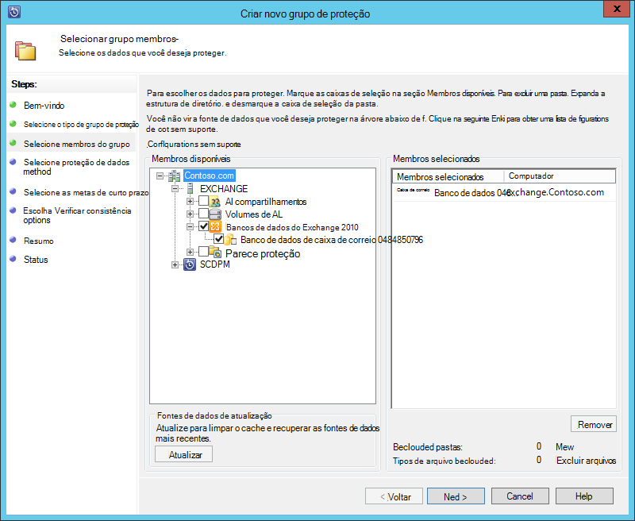

<properties
    pageTitle="Fazer backup de um servidor Exchange para Backup Azure com System Center 2012 R2 DPM | Microsoft Azure"
    description="Saiba como fazer backup de um servidor do Exchange para Backup Azure usando o System Center 2012 R2 DPM"
    services="backup"
    documentationCenter=""
    authors="MaanasSaran"
    manager="NKolli1"
    editor=""/>

<tags
    ms.service="backup"
    ms.workload="storage-backup-recovery"
    ms.tgt_pltfrm="na"
    ms.devlang="na"
    ms.topic="article"
    ms.date="08/15/2016"
    ms.author="anuragm;jimpark;delhan;trinadhk;markgal"/>

# Fazer backup de um servidor do Exchange para Backup Azure com System Center 2012 R2 DPM
Este artigo descreve como configurar um servidor do System Center 2012 R2 dados Protection Manager (DPM) para fazer backup de um Microsoft Exchange server para fazer Backup do Azure.  

## Atualizações
Para registrar com êxito o servidor DPM com Backup do Azure, você deve instalar o update rollup mais recente do System Center 2012 R2 DPM e a versão mais recente do agente de Backup do Azure. Obter o pacote cumulativo mais recente do [Catálogo da Microsoft](http://catalog.update.microsoft.com/v7/site/Search.aspx?q=System%20Center%202012%20R2%20Data%20protection%20manager).

>[AZURE.NOTE] Para os exemplos deste artigo, versão 2.0.8719.0 do agente de Backup do Azure está instalada e cumulativo de atualizações 6 está instalado no System Center 2012 R2 DPM.

## Pré-requisitos
Antes de continuar, certifique-se de que todos os [pré-requisitos](backup-azure-dpm-introduction.md#prerequisites) para usar o Microsoft Azure Backup proteger cargas de trabalho foram atendidos. Esses pré-requisitos incluem o seguinte:

- Um backup cofre no site do Azure foi criado.
- Credenciais do agente e cofre baixou para o servidor DPM.
- O agente é instalado no servidor DPM.
- As credenciais do cofre foram usadas para registrar o servidor DPM.
- Se você estiver protegendo Exchange 2016, atualize para DPM 2012 R2 UR9 ou posterior

## Agente de proteção de DPM  
Para instalar o agente de proteção do DPM no servidor Exchange, siga estas etapas:

1. Certifique-se de que os firewalls configurados corretamente. Consulte [configurar exceções de firewall para o agente](https://technet.microsoft.com/library/Hh758204.aspx).

2. Instalar o agente do Exchange Server, clicando em **Gerenciamento > agentes > instalar** no DPM Administrator Console. Para obter etapas detalhadas, consulte [instalar o agente de proteção do DPM](https://technet.microsoft.com/library/hh758186.aspx?f=255&MSPPError=-2147217396) .

## Criar um grupo de proteção para o Exchange server

1. No DPM Administrator Console, clique em **proteção**e, em seguida, clique em **novo** na faixa de ferramenta para abrir o Assistente de **Criar novo grupo de proteção** .

2. Na tela **Bem-vindo** do assistente, clique em **Avançar**.

3. Na tela **Selecionar tipo de grupo de proteção** , selecione **servidores** e clique em **Avançar**.

4. Selecione o banco de dados de servidor do Exchange que você deseja proteger e clique em **Avançar**.

    >[AZURE.NOTE] Se você estiver protegendo Exchange 2013, verifique os [pré-requisitos do Exchange 2013](https://technet.microsoft.com/library/dn751029.aspx).

    No exemplo a seguir, o banco de dados do Exchange 2010 está selecionado.

    

5. Selecione o método de proteção de dados.

    Nome do grupo de proteção e selecione ambas as opções a seguintes:

    - Desejo usando o disco de proteção de curto prazo.
    - Desejo proteção on-line.

6. Clique em **Avançar**.

7. Selecione a opção de **Executar Eseutil para verificar a integridade dos dados** , se você quiser verificar a integridade dos bancos de dados do Exchange Server.

    Após selecionar esta opção, a consistência do backup verificação será executada no servidor DPM para evitar o tráfego de i/o que é gerado por executar o comando **eseutil** no servidor Exchange.

    >[AZURE.NOTE]Para usar esta opção, você deve copiar os arquivos ESE e Eseutil.exe ao diretório C:\Program Files\Microsoft System Center 2012 R2\DPM\DPM\bin no servidor DPM. Caso contrário, o erro a seguir é acionado:  
    

8. Clique em **Avançar**.

9. Selecione o banco de dados para **Cópia de Backup**e clique em **Avançar**.

    >[AZURE.NOTE] Se você não selecionar "Backup completo" para pelo menos uma cópia de Dag mão de um banco de dados, logs não serão truncados.

10. Configurar as metas para **backup de curto prazo**e clique em **Avançar**.

11. Examine o espaço disponível em disco e clique em **Avançar**.

12. Selecione a hora em que o servidor DPM irá criar a replicação inicial e, em seguida, clique em **Avançar**.

13. Selecione as opções de verificação de consistência e clique em **Avançar**.

14. Escolha o banco de dados que você deseja fazer backup no Azure e clique em **Avançar**. Por exemplo:

    

15. Defina a programação para **Backup do Azure**e clique em **Avançar**. Por exemplo:

    

    >[AZURE.NOTE] Observe os pontos de recuperação on-line são baseados em express completo pontos de recuperação. Portanto, você deve agendar o ponto de recuperação online após o tempo especificado para express completo de ponto de recuperação.

16. Configurar a política de retenção para **Backup do Azure**e clique em **Avançar**.

17. Escolha uma opção de replicação on-line e clique em **Avançar**.

    Se você tiver um banco de dados grande, ele pode levar muito tempo para o backup inicial seja criado pela rede. Para evitar esse problema, você pode criar um backup offline.  

    

18. Confirme as configurações e, em seguida, clique em **Criar grupo**.

19. Clique em **Fechar**.

## Recuperar o banco de dados do Exchange

1. Para recuperar um banco de dados do Exchange, clique em **recuperação** no Console de administrador do DPM.

2. Localize o banco de dados do Exchange que você deseja recuperar.

3. Selecione um ponto de recuperação on-line da lista suspensa de *tempo de recuperação* .

4. Clique em **recuperar** para iniciar o **Assistente de recuperação**.

Pontos de recuperação on-line, há cinco tipos de recuperação:

- **Recuperar no local original do Exchange Server:** Os dados serão recuperados ao servidor do Exchange original.
- **Recuperar para outro banco de dados em um servidor Exchange:** Os dados serão recuperados para outro banco de dados em outro servidor Exchange.
- **Recuperar um banco de dados de recuperação:** Os dados serão recuperados a um banco de dados de recuperação do Exchange (RDB).
- **Cópia para uma pasta de rede:** Os dados serão recuperados para uma pasta de rede.
- **Cópia para fita:** Se você tiver uma biblioteca de fita ou uma unidade de fita autônoma anexado e configurado no servidor DPM, o ponto de recuperação será copiado para uma fita gratuita.

    

## Próximas etapas

- [Perguntas frequentes sobre Backup Azure](backup-azure-backup-faq.md)
