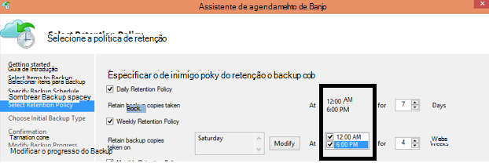

<properties
   pageTitle="Perguntas frequentes sobre Backup Azure | Microsoft Azure"
   description="Respostas para perguntas frequentes sobre o serviço de backup, agente de backup, backup e retenção, recuperação, segurança e outras perguntas comuns sobre backup e recuperação de desastres."
   services="backup"
   documentationCenter=""
   authors="markgalioto"
   manager="jwhit"
   editor=""
   keywords="backup e recuperação de desastres; serviço de backup"/>

<tags
   ms.service="backup"
   ms.workload="storage-backup-recovery"
     ms.tgt_pltfrm="na"
     ms.devlang="na"
     ms.topic="get-started-article"
     ms.date="10/21/2016"
     ms.author="trinadhk; giridham; arunak; markgal; jimpark;"/>

# <a name="azure-backup-service--faq"></a>Serviço de Backup Azure-perguntas Frequentes


Este artigo é uma lista de perguntas frequentes (e as respectivas respostas) sobre o serviço de Backup do Azure. Nossa comunidade respostas rapidamente, e se uma pergunta é solicitada com frequência, podemos adicioná-lo deste artigo. Normalmente, as respostas para perguntas fornecem referência ou informações de suporte. Você pode fazer perguntas sobre o Backup do Azure na seção Disqus neste artigo ou um artigo relacionado. Você também pode postar perguntas sobre o serviço de Backup do Azure no [Fórum de discussão](https://social.msdn.microsoft.com/forums/azure/home?forum=windowsazureonlinebackup).


## <a name="what-is-the-list-of-supported-operating-systems-from-which-i-can-back-up-to-azure-using-azure-backup-br"></a>O que é a lista de sistemas operacionais compatíveis do qual eu pode fazer backup em Azure usando o Backup do Azure? <br/>
Backup do Azure suporta a seguinte lista de sistemas operacionais para backup da pasta de arquivo, usando o servidor de Backup do Azure e SCDPM de backup de aplicativos.

| Sistema Operacional        | Plataforma           | SKU  |
| :------------- |-------------| :-----|
| Windows 8 e SPs mais recentes      | 64 bits | Enterprise, Pro |
| Windows 7 e SPs mais recentes      | 64 bits | Ultimate, Enterprise, Professional, Home Premium, Home Basic, Starter |
| Windows 8.1 e SPs mais recentes | 64 bits      |    Enterprise, Pro |
| Windows 10      | 64 bits | Enterprise, Pro, Home |
|Windows Server 2012 R2 e SPs mais recentes| 64 bits| Padrão, data center, Foundation|
|Windows Server 2012 e SPs mais recentes|    64 bits| Padrão de data center, Foundation,|
|Windows Storage Server 2012 R2 e SPs mais recentes  |64 bits|    Padrão, grupo de trabalho|
|Armazenamento do Windows Server 2012 e SPs mais recentes |64 bits |Padrão, grupo de trabalho
|Windows Server 2012 R2 e SPs mais recentes  |64 bits|    Essenciais|
|Windows Server 2008 R2 SP1 |64 bits|    Standard, Enterprise, data center, Foundation|
|Windows Server 2008 SP2    |64 bits|    Standard, Enterprise, data center, Foundation|

Para backup de máquina virtual do Azure,

- **Linux**: Backup Azure dá suporte a [uma lista de distribuições que contam com a aprovação por Azure](../virtual-machines/virtual-machines-linux-endorsed-distros.md) exceto Core SO Linux.  Outras distribuições trazer-Your-proprietário-Linux também podem funcionar, desde que o agente de máquina virtual está disponível na máquina virtual e suporte para Python existe.
- **Windows Server**: versões mais antigas do que o Windows Server 2008 R2 não são suportadas.

## <a name="where-can-i-download-the-latest-azure-backup-agent-br"></a>Onde é possível baixar o agente de Backup do Azure mais recente? <br/>
Você pode baixar o versão mais recente agent para fazer backup de Windows Server, System Center DPM ou cliente do Windows, [aqui](http://aka.ms/azurebackup_agent). Se você quiser fazer backup de uma máquina virtual, use o agente de máquina virtual (que instala automaticamente a extensão de PRI). O agente de máquina virtual já está presente em máquinas virtuais criadas da Galeria Azure.

## <a name="which-version-of-scdpm-server-is-supported-br"></a>Qual versão do servidor de SCDPM é suportada? <br/>
Recomendamos que você instale o agente de Backup do Azure [mais recente](http://aka.ms/azurebackup_agent) em cumulativo mais recente do SCDPM (UR11 a partir de agosto de 2016)

## <a name="when-configuring-the-azure-backup-agent-i-am-prompted-to-enter-the-vault-credentials-do-vault-credentials-expire"></a>Ao configurar o agente de Backup do Azure, sou solicitado a inserir as credenciais do cofre. Credenciais do cofre expirar?
Sim, as credenciais do cofre expirarem após 48 horas. Se o arquivo expirar, faça logon no portal do Azure e baixar os arquivos de credenciais do Cofre de seu cofre.

## <a name="is-there-any-limit-on-the-number-of-vaults-that-can-be-created-in-each-azure-subscription-br"></a>Existe algum limite no número de compartimentos que podem ser criados em cada assinatura Azure? <br/>
Sim. A partir de setembro de 2016, você pode criar 25 compartimentos backup por assinatura. Você pode criar até 25 compartimentos de serviços de recuperação por cada região com suporte do Azure backup por assinatura. Se você precisar de mais compartimentos, crie uma nova assinatura.

## <a name="are-there-any-limits-on-the-number-of-serversmachines-that-can-be-registered-against-each-vault-br"></a>Existem quaisquer limites no número de servidores/máquinas que pode ser registrado em relação a cada compartimento? <br/>
Sim, você pode registrar até 50 máquinas por cofre. Para máquinas virtuais de Azure IaaS, o limite é 200 VMs por cofre. Se você precisar registrar mais máquinas, crie um novo cofre.

## <a name="how-do-i-register-my-server-to-another-datacenterbr"></a>Como registrar o meu servidor para outra análise?<br/>
Dados de backup são enviados ao data center do cofre à qual ele está registrado. A maneira mais fácil de alterar data center é desinstalar o agente e reinstalar o agente e registrar para um novo cofre que pertence ao data center desejado.

## <a name="what-happens-if-i-rename-a-windows-server-that-is-backing-up-data-to-azurebr"></a>O que acontece se eu renomear um servidor Windows que está fazendo backup de dados no Azure?<br/>
Quando você renomeia um servidor, todos os backups configurados no momento estão interrompidos.
Você precisa registrar o novo nome do servidor com o Cofre de Backup. Quando você cria um novo registro, a operação de backup primeira é um backup completo e não um backup incremental. Se você precisar recuperar dados anteriormente foi feito ao Cofre com o nome de servidor antigo, você pode recuperar esses dados usando a opção de [**outro servidor**](backup-azure-restore-windows-server.md#recover-to-an-alternate-machine) no assistente **Recuperar dados** .

## <a name="what-types-of-drives-can-i-backup-files-and-folders-from-br"></a>Que tipos de unidades posso fazer backup de arquivos e pastas do? <br/>
O seguinte conjunto de unidades/volumes não consegue acessar o backup:

- Mídia removível: A unidade deve informar como fixo a ser usado como uma fonte de item de backup.
- Volumes de somente leitura: O volume deve ser gravável para o serviço de cópia de sombra de volume (VSS) a função.
- Volumes off-line: O volume deve estar online para VSS à função.
- Compartilhamento de rede: O volume deve ser local para o servidor de backup usando o backup on-line.
- BitLocker volumes protegidos: O volume deve ser desbloqueado antes que o backup possa ocorrer.
- Identificação do sistema de arquivos: NTFS é o único sistema de arquivos com suporte para esta versão do serviço backup online.

## <a name="what-file-and-folder-types-can-i-back-up-from-my-serverbr"></a>Que tipos de arquivo e pasta posso pode fazer backup do meu servidor?<br/>
Há suporte para os seguintes tipos:

- Criptografado
- Compactado
- Esparso
- Compactado + esparso
- Links de disco rígido: Não suportados, ignorado
- Ponto de nova análise: Não suportados, ignorado
- Criptografados + compactado: Não suportados, ignorado
- Criptografada + esparso: Não suportados, ignorado
- Fluxo compactado: Não suportados, ignorado
- Fluxo esparso: Não suportados, ignorado

## <a name="whats-the-minimum-size-requirement-for-the-cache-folder-br"></a>O que é o requisito de tamanho mínimo para a pasta cache? <br/>
O tamanho da pasta cache determina a quantidade de dados que você está fazendo backup. A pasta cache deve ser 5% do espaço necessário para o armazenamento de dados.

## <a name="if-my-organization-has-one-vault-how-can-i-isolate-one-servers-data-from-another-server-when-restoring-databr"></a>Se minha organização tem um compartimento, como pode para isolar dados de um servidor de outro servidor quando restaurando dados?<br/>
Todos os servidores que são registrados para o mesmo compartimento podem recuperar os dados de backup por outros servidores *que usam a mesma senha*. Se você tiver servidores cujos dados de backup que você deseja isolar de outros servidores em sua organização, use uma senha designada para os servidores. Por exemplo, servidores de recursos humanos podem usar uma senha de criptografia, accounting servidores outro e servidores de armazenamento um terceiro.

## <a name="can-i-migrate-my-backup-data-or-vault-between-subscriptions-br"></a>Posso "migrar" Meus dados de backup ou cofre entre assinaturas? <br/>
Não. O cofre é criado em um nível de assinatura e não pode ser reatribuído para outra assinatura depois que ela é criada.

## <a name="does-the-azure-backup-agent-work-on-a-server-that-uses-windows-server-2012-deduplication-br"></a>O agente de Backup do Azure funciona em um servidor que usa o Windows Server 2012 duplicação? <br/>
Sim. O serviço agente converte os dados de eliminação aos dados normais quando ele prepara a operação de backup. Ele então otimiza os dados de backup, criptografa os dados e envia os dados criptografados para o serviço de backup online.

## <a name="if-i-cancel-a-backup-job-once-it-has-started-is-the-transferred-backup-data-deleted-br"></a>Se eu cancelar um trabalho de backup depois que for iniciado, os dados de backup transferidos são excluídos? <br/>
Não. O cofre backup armazena os dados de backup que tinham transferidos para cima até o ponto do cancelamento. Backup Azure usa um mecanismo de ponto de verificação ocasionalmente adicionar pontos de verificação para os dados de backup durante o backup. Porque há pontos de verificação dos dados de backup, o processo de backup próxima pode validar a integridade dos arquivos. O próximo backup disparado seria incremental sobre os dados que tiveram backup anteriormente. Um backup incremental fornece melhor utilização de largura de banda, para que você não precisa transferir os mesmos dados repetidamente.

No caso de backup de máquina virtual do Azure, depois que o trabalho será cancelado, dados transferidos serão ignorados e backup clara transfere dados incrementais do trabalho de backup anteriormente bem-sucedido.

## <a name="why-am-i-seeing-the-warning-azure-backups-have-not-been-configured-for-this-server-even-though-i-had-scheduled-regular-backups-previously-br"></a>Por que estou vendo o aviso "Azure Backups não foram configurados para este servidor" Embora eu tinha agendado backups regulares anteriormente? <br/>
Este aviso ocorre quando as configurações de agendamento de backup armazenadas no servidor local não são iguais as configurações armazenadas no cofre de backup. Quando o servidor ou as configurações foram recuperadas para um bom estado conhecido, os agendamentos de backup podem perder a sincronização. Se você receber esse aviso, [reconfigurar a política de backup](backup-azure-manage-windows-server.md) e, em seguida, **Executar fazer agora o backup** para sincronizar novamente o servidor local com o Azure.

## <a name="what-firewall-rules-should-be-configured-for-azure-backup-br"></a>Quais firewall regras devem ser configuradas para Backup Azure? <br/>
Para perfeita proteção de dados em-local-para-Azure e carga de trabalho-para-Azure, é recomendável que você permita o firewall para se comunicar com os seguintes URLs:

- www.msftncsi.com
- \*. Microsoft.com
- \*. WindowsAzure.com
- \*. microsoftonline.com
- \*. no windows.net

##<a name="can-i-install-the-azure-backup-agent-on-an-azure-vm-already-backed-by-the-azure-backup-service-using-the-vm-extension-br"></a>Posso instalar o agente de Backup do Azure em uma VM Azure já foi feito pelo serviço Backup Azure usando a extensão de máquina virtual? <br/>
Absolutamente. Azure Backup fornece backup em nível de máquina virtual para VMs Azure usando a extensão de máquina virtual. Você pode instalar o agente de Backup do Azure em um sistema operacional Windows de convidado para proteger arquivos e pastas em que sistema operacional de convidado.

## <a name="can-i-install-the-azure-backup-agent-on-an-azure-vm-to-back-up-files-and-folders-present-on-temporary-storage-provided-by-the-azure-vm-br"></a>Posso instalar o agente de Backup do Azure em uma VM do Azure para fazer backup de arquivos e pastas presentes no armazenamento temporário fornecido pela máquina virtual do Azure? <br/>
Você pode instalar o agente de Backup do Azure no sistema operacional Windows de convidado e fazer backup de arquivos e pastas para armazenamento temporário. No entanto, observe que backups falharem depois de dados de armazenamento temporário são apagados check-out. Além disso, se os dados de armazenamento temporário foi excluídos, você só poderá restaurar ao armazenamento não-voláteis.

## <a name="i-have-installed-azure-backup-agent-to-protect-my-files-and-folders-can-i-now-install-scdpm-to-work-with-azure-backup-agent-to-protect-on-premises-applicationvm-workloads-to-azure-br"></a>Instalei o agente de Backup do Azure para proteger meus arquivos e pastas. É possível instalar agora SCDPM para trabalhar com o agente de Backup do Azure para proteger cargas de trabalho de aplicativo/máquina virtual de locais no Azure? <br/>
Para usar o Backup do Azure com SCDPM, é aconselhável instalar SCDPM primeiro e, em seguida, apenas para instalar o agente de Backup do Azure. Isso garante a integração perfeita do agente de Backup do Azure com SCDPM e permite Protegendo arquivos/pastas, cargas de trabalho de aplicativos e VMs no Azure, diretamente no console de gerenciamento de SCDPM. Instalando SCDPM depois de instalar o Backup do Azure agente para fins mencionados acima não é recomendamos ou compatíveis.

## <a name="what-is-the-length-of-file-path-that-can-be-specified-as-part-of-azure-backup-policy-using-azure-backup-agent-br"></a>O que é o comprimento do caminho do arquivo que pode ser especificado como parte da política de Backup do Azure usando o agente de Backup do Azure? <br/>  
Agente de Backup Azure depende NTFS. A [especificação de comprimento de caminho de arquivo é limitada pelo API do Windows](https://msdn.microsoft.com/library/aa365247.aspx#fully_qualified_vs._relative_paths). No caso de backup dos arquivos com comprimento de caminho de arquivo maior que aquelas especificado pelo API do Windows, clientes podem optar por fazer backup da pasta pai ou a unidade de disco de arquivos de backup.  

## <a name="what-characters-are-allowed-in-file-path-of-azure-backup-policy-using-azure-backup-agent-br"></a>Quais caracteres são permitidos no caminho de arquivo de política de Backup do Azure usando o agente de Backup do Azure? <br>  
 Agente de Backup Azure depende NTFS. Ele permite [NTFS suporte caracteres](https://msdn.microsoft.com/library/aa365247.aspx#naming_conventions) como parte da especificação de arquivo.  

## <a name="can-i-use-azure-backup-server-to-create-a-bare-metal-recovery-bmr-backup-for-a-physical-server-br"></a>Pode usar o servidor de Backup do Azure para criar um backup de recuperação de Metal vazio (BMR) para um servidor físico? <br/>
Sim.

## <a name="can-i-configure-the-backup-service-to-send-mail-if-a-backup-job-fails-br"></a>Pode configurar o serviço de Backup para enviar email se um trabalho de backup falhar? <br/>
Sim, o serviço de Backup tem vários alertas baseados em eventos que podem ser usadas com um script do PowerShell. Para obter uma descrição completa, consulte [notificações de alerta](backup-azure-manage-vms.md#alert-notifications)

## <a name="is-there-a-limit-on-the-size-of-each-data-source-being-backed-up-br"></a>Existe um limite no tamanho de cada fonte de dados está sendo feito o backup? <br/>
Embora no nível do cofre sem limite na quantidade de dados que você pode fazer backup, Azure Backup impor uma restrição (para todos os fins práticos, esses limites são muito altos) no tamanho máximo de fonte de dados. A partir de agosto de 2015, a fonte de dados de tamanho máximo para os sistemas operacionais compatíveis é:

|S.No | Sistema Operacional |  Tamanho máximo de fonte de dados |
| :-------------: |:-------------| :-----|
|1| Windows Server 2012 ou acima| 54400 GB|
|2| Windows 8 ou superior| 54400 GB|
|3| Windows Server 2008, Windows Server 2008 R2 | 1700 GB|
|4| Windows 7 | 1700 GB|

A tabela a seguir explica como cada tamanho de fonte de dados é determinado.

|   Fonte de dados  |   Detalhes |
| :-------------: |:-------------|
|Volume |A quantidade de dados que está sendo feito o backup de volume único de um computador cliente ou servidor|
|Máquina virtual Hyper-V | Soma dos dados de todos os VHDs da máquina virtual sendo feito backup|
|Banco de dados do Microsoft SQL Server | Tamanho de tamanho de banco de dados SQL único backup |
|Microsoft SharePoint |Soma os bancos de dados de conteúdo e configuração em um farm do SharePoint está sendo feito backup|
|Microsoft Exchange |Soma de todos os bancos de dados do Exchange em um servidor do Exchange está sendo feito backup|
|Estado do BMR/sistema |Cada cópia individual do sistema ou BMR estado da máquina sendo feito backup|

## <a name="are-there-limits-on-the-number-of-times-a-backup-job-can-be-scheduled-per-daybr"></a>Há limites no número de vezes que um trabalho de backup pode ser agendado por dia?<br/>
Sim, você pode executar o trabalhos de backup no Windows Server ou cliente Windows até três vezes por dia. Você pode executar tarefas de backup em System Center DPM até duas vezes por dia. Você pode executar um trabalho de backup para VMs IaaS uma vez por dia.

## <a name="is-there-a-difference-between-the-scheduling-policy-for-dpm-and-windows-server-ie-on-windows-server-without-dpm-br"></a>Existe uma diferença entre a política de agendamento de DPM e Windows Server (ou seja, Windows Server sem DPM)? <br/>
Sim. Usando o DPM, você pode especificar agendas diárias, semanais, mensais e anuais. Windows Server (sem DPM) permite que você especifique somente agendas diárias e semanais.

## <a name="is-there-a-difference-between-the-retention-policy-for-dpm-and-windows-serverclient-ie-on-windows-server-without-dpmbr"></a>Existe uma diferença entre a política de retenção para DPM e servidor/cliente do Windows (ou seja, no Windows Server sem DPM)?<br/>
Não, os dois DPM e Windows Server/cliente diariamente, têm políticas de retenção semanal, mensal e anual.

## <a name="can-i-configure-my-retention-policies-selectively--ie-configure-weekly-and-daily-but-not-yearly-and-monthlybr"></a>Posso configurar meu retenção políticas seletivamente – ou seja, configurar semanalmente e diariamente, mas não anual e mensais?<br/>
Sim, a estrutura de retenção de Backup do Azure permite que você tenha flexibilidade completa na definição de política de retenção de acordo com as suas necessidades.

## <a name="can-i-schedule-a-backup-at-6pm-and-specify-retention-policies-at-a-different-timebr"></a>É possível "Agendar um backup" em 6 pm e especifique "políticas de retenção" em um horário diferente?<br/>
Não. Políticas de retenção só podem ser aplicadas em pontos de backup. Na imagem a seguir, a política de retenção é especificada para backups feitos em 12 am e pm de 6. <br/>


<br/>

## <a name="is-an-incremental-copy-transferred-for-the-retention-policies-scheduled-br"></a>Uma cópia incremental é transferida para as políticas de retenção agendadas? <br/>
Não, a cópia incremental é enviada com base no período de tempo mencionado na página do agendamento de backup. Os pontos que podem ser retidos são determinados com base na política de retenção.

## <a name="if-a-backup-is-retained-for-a-long-duration-does-it-take-more-time-to-recover-an-older-data-point-br"></a>Se um backup é mantido por um longo tempo, demora mais tempo para recuperar um ponto de dados mais antigo? <br/>
 Não – o tempo para recuperar o mais antigo ou o ponto mais recente é o mesmo. Cada ponto de recuperação se comporta como um ponto completo.

## <a name="if-each-recovery-point-is-like-a-full-point-does-it-impact-the-total-billable-backup-storagebr"></a>Se cada ponto de recuperação é como um ponto completo, ele afeta o armazenamento total de backup faturável?<br/>
Produtos de ponto de retenção a longo prazo típico armazenam dados de backup como pontos completos. O total de pontos são armazenamento *ineficaz* mas mais fácil e rápido para restaurar. Cópias incrementais são armazenamento *eficiente* mas exija a restauração de uma cadeia de dados, que afetam o tempo de recuperação. Arquitetura de armazenamento do Windows Azure Backup oferece o melhor das duas soluções ideal armazenando dados para restaura rápida e os custos de armazenamento baixa decorridos. Essa abordagem de armazenamento de dados garante que a largura de banda de entrada e saída é usada com eficiência. A quantidade de armazenamento de dados e o tempo necessário para recuperar os dados, é mantido em um mínimo. Saiba mais sobre como salvar [backups incrementais](https://azure.microsoft.com/blog/microsoft-azure-backup-save-on-long-term-storage/) são eficientes.

## <a name="is-there-a-limit-on-the-number-of-recovery-points-that-can-be-createdbr"></a>Existe um limite no número de pontos de recuperação que podem ser criados?<br/>
Não. Eliminadas limites em pontos de recuperação. Você pode criar quantos pontos de recuperação conforme desejado.

## <a name="why-is-the-amount-of-data-transferred-in-backup-not-equal-to-the-amount-of-data-i-backed-upbr"></a>Por que a quantidade de dados é transferida em backup não é igual à quantidade de dados para backup?<br/>
 Todos os dados cujo backup são feitos do Azure Backup Agent ou SCDPM ou de servidor de Backup do Azure, é compactado e criptografado antes de serem transferidos. Após a compactação e criptografia é aplicada, os dados no cofre de backup são 30 a 40% menor.

## <a name="is-there-a-way-to-adjust-the-amount-of-bandwidth-used-by-the-backup-servicebr"></a>Existe uma maneira de ajustar a quantidade de largura de banda usada pelo serviço de Backup?<br/>
 Sim, use a opção de **Alterar as propriedades** no agente de Backup para ajustar a largura de banda. Ajuste a quantidade de largura de banda e as horas quando você usa esse largura de banda. Consulte [A otimização de rede](../backup-configure-vault.md#enable-network-throttling), para obter mais informações.

## <a name="my-internet-bandwidth-is-limited-for-the-amount-of-data-i-need-to-back-up-is-there-a-way-i-can-move-data-to-a-certain-location-with-a-large-network-pipe-and-push-that-data-into-azure-br"></a>Meu largura de banda de internet é limitada para a quantidade de dados que preciso fazer backup. Existe uma maneira para pode mover dados para um determinado local com uma rede grande conduza e esses dados por push para o Azure? <br/>
Você pode fazer backup de dados no Azure através do processo de backup online padrão ou você pode usar o serviço de importação/exportação do Azure para transferir dados para blob storage no Azure. Não há nenhum maneiras adicionais de obter data backup no armazenamento do Azure. Para obter informações sobre como usar o serviço de importação/exportação do Azure com Backup do Azure, consulte o artigo de [fluxo de trabalho de Backup Offline](backup-azure-backup-import-export.md) .

## <a name="how-many-recoveries-can-i-perform-on-the-data-that-is-backed-up-to-azurebr"></a>Recuperação quantos pode realizar nos dados cujo backup são feitos no Azure?<br/>
Não há nenhum limite no número de recuperação de Backup do Azure.

## <a name="do-i-have-to-pay-for-the-egress-traffic-from-azure-data-center-during-recoveriesbr"></a>Tenho pagar para o tráfego de saída do Centro de dados do Azure durante a recuperação?<br/>
 Não. Sua recuperação é gratuitas e não cobrado para o tráfego de saída.

## <a name="is-the-data-sent-to-azure-encrypted-br"></a>Os dados são enviados para o Azure criptografado? <br/>
Sim. Os dados são criptografados na máquina cliente/servidor/SCDPM local usando AES256 e os dados são enviados por um link HTTPS seguro.

## <a name="is-the-backup-data-on-azure-encrypted-as-wellbr"></a>É os dados de backup no Azure criptografado também?<br/>
 Sim. Os dados enviados no Azure permanecerão criptografados (no restante). Microsoft não descriptografar os dados de backup a qualquer momento. Para backup de máquina virtual do Azure, Azure Backup depende de criptografia da máquina virtual isto é, se sua máquina virtual está criptografado usando criptografia de disco do Azure ou alguma outra tecnologia de criptografia, Backup do Azure usa que a criptografia para proteger seus dados.

## <a name="what-is-the-minimum-length-of-encryption-key-used-to-encrypt-backup-data-br"></a>O que é o tamanho mínimo de chave de criptografia usada para criptografar dados de backup? <br/>
 A chave de criptografia deve ter pelo menos 16 caracteres.

## <a name="what-happens-if-i-misplace-the-encryption-key-can-i-recover-the-data-or-can-microsoft-recover-the-data-br"></a>O que acontece se eu esquecer onde deixou a chave de criptografia? Posso recuperar os dados (ou) pode Microsoft recuperar os dados? <br/>
A chave usada para criptografar os dados de backup está presente apenas em instalações dos clientes. A Microsoft não mantém uma cópia no Azure e não tem nenhum acesso à chave. Se o cliente misplaces a chave, a Microsoft não poderá recuperar os dados de backup.

## <a name="how-do-i-change-the-cache-location-specified-for-the-azure-backup-agentbr"></a>Como posso alterar o local do cache especificado para o agente de Backup do Azure?<br/>
 Percorra sequencialmente a lista com marcadores abaixo para alterar o local do cache.
- Pare o mecanismo de Backup, executando o seguinte comando em um prompt de comando:

  ```PS C:\> Net stop obengine```

- Não mova os arquivos. Em vez disso, copie a pasta de espaço de cache para uma unidade diferente com espaço suficiente. O espaço de cache original pode ser removido após confirmar que os backups estão trabalhando com o novo espaço de cache.

- Atualize as seguintes entradas de registro com o caminho para a nova pasta de espaço de cache.<br/>

|Caminho do registro | Chave do registro | Valor |
| ------ | ------- | ------|
| `HKEY_LOCAL_MACHINE\SOFTWARE\Microsoft\Windows Azure Backup\Config` | ScratchLocation | *Novo local de pasta de cache* |
| `HKEY_LOCAL_MACHINE\SOFTWARE\Microsoft\Windows Azure Backup\Config\CloudBackupProvider` | ScratchLocation | *Novo local de pasta de cache* |

- Reinicie o mecanismo de Backup, executando o seguinte comando em um prompt de comando:

  ```PS C:\> Net start obengine```

  Após a criação de backup foi concluída com êxito no novo local cache, você pode remover a pasta cache original.

## <a name="where-can-i-put-the-cache-folder-for-the-azure-backup-agent-to-work-as-expectedbr"></a>Onde posso colocar a pasta de cache para o agente de Backup do Azure funcione como esperado?<br/>
Locais a seguir para a pasta de cache não são recomendados:

- Compartilhamento ou mídia removível de rede: A pasta de cache deve ser local no servidor que precisa de backup usando o backup on-line. Locais de rede ou mídia removível como unidades USB não é suportada.
- Volumes offline: A pasta de cache deve estar online para backup esperado com o agente de Backup do Azure.

## <a name="are-there-any-attributes-of-the-cache-folder-that-are-not-supportedbr"></a>Existem quaisquer atributos da pasta cache que não são suportados?<br/>
 Não há suporte para os seguintes atributos ou suas combinações para a pasta de cache:

- Criptografado
- Duplicação
- Compactado
- Esparso
- Ponto de nova análise

É recomendável que a pasta de cache nem os metadados VHD tem os atributos acima para funcionamento esperados do agente de Backup do Azure.
