<properties
   pageTitle="Azure Backup - backup Offline ou propagação inicial usando o serviço de importação/exportação do Azure | Microsoft Azure"
   description="Saiba como o Backup do Azure permite que você envie dados fora da rede usando o serviço de importação/exportação do Azure. Este artigo explica a propagação offline dos dados de backup iniciais usando o serviço do Azure importar exportar."
   services="backup"
   documentationCenter=""
   authors="saurabhsensharma"
   manager="shivamg"
   editor=""/>
<tags
   ms.service="backup"
   ms.devlang="na"
   ms.topic="article"
   ms.tgt_pltfrm="na"
   ms.workload="storage-backup-recovery"
   ms.date="08/16/2016"
   ms.author="jimpark;saurabhsensharma;nkolli;trinadhk"/>

# Fluxo de trabalho de backup offline no Backup do Azure
Backup Azure tem várias eficiência interna que economizar custos de rede e armazenamento durante backups completos iniciais dos dados no Azure. Iniciais backups completos normalmente transferem grandes quantidades de dados e exigem mais largura de banda quando comparadas a backups subsequentes que somente os deltas/incrementais de transferência. Backup Azure compacta os backups iniciais. Durante o processo de propagação offline, Azure Backup pode usar discos para carregar os iniciais backup dados compactados offline no Azure.  

O processo de propagação offline do Azure Backup integra-se com o [serviço de importação/exportação do Azure](../storage/storage-import-export-service.md) que permite transferir dados para o Azure usando discos. Se você tiver terabytes (TB) iniciais dos dados de backup que precisa ser transferidos em uma rede de alta latência e baixa largura de banda, você pode usar o fluxo de trabalho offline propagação para enviar a cópia de backup inicial em uma ou mais unidades de disco rígido para um data center Azure. Este artigo fornece uma visão geral das etapas que concluir este fluxo de trabalho.

## Visão geral

Com o recurso offline propagação de Backup do Azure e Azure importação/exportação, é simple carregar os dados offline no Azure usando discos. Em vez de transferir a cópia completa inicial pela rede, os dados de backup são gravados para um *local de teste*. Concluída a cópia local temporário usando a ferramenta de importação/exportação do Azure, estes dados são gravados em uma ou mais unidades SATA, dependendo da quantidade de dados. Essas unidades são eventualmente entregues ao data center Azure mais próximo.

[Agosto 2016 atualizar do Azure Backup (e posterior)](http://go.microsoft.com/fwlink/?LinkID=229525) inclui a *ferramenta de preparação do disco do Azure*, chamado AzureOfflineBackupDiskPrep, que:

   - Ajuda você a preparar as unidades para importação do Azure usando a ferramenta de importação/exportação do Azure.
   - Cria automaticamente um trabalho de importação do Azure para o serviço de importação/exportação do Azure no [portal clássico Azure](https://manage.windowsazure.com) ao invés de criar a mesma manualmente com versões mais antigas do Azure Backup.

Após o carregamento dos dados de backup no Azure, Azure Backup copia os dados de backup ao Cofre de backup e os backups incrementais são agendados.

  > [AZURE.NOTE] Para usar a ferramenta de preparação do disco do Azure, certifique-se de que você instalou a atualização de 2016 de agosto de Backup do Azure (ou posterior) e executar todas as etapas do fluxo de trabalho com ele. Se você estiver usando uma versão anterior do Backup do Azure, você pode preparar a unidade usando a ferramenta de importação/exportação do Azure conforme detalhado nas seções posteriores deste artigo.

## Pré-requisitos

- [Familiarize-se com o fluxo de trabalho do Azure importar/exportar](../storage/storage-import-export-service.md).
- Antes de iniciar o fluxo de trabalho, verifique o seguinte:
    - Um cofre Azure Backup foi criado.
    - Credenciais do cofre foram baixadas.
    - O agente de Backup do Azure foi instalado no Windows Server/Windows cliente ou servidor de Gerenciador de proteção de dados do System Center e o computador está registrado com o Cofre de Backup do Azure.
- [Baixar as configurações de arquivo Azure publicar](https://manage.windowsazure.com/publishsettings) no computador do qual você planejar fazer backup de seus dados.
- Prepare um local de transferência, que pode ser um compartilhamento de rede ou unidade adicional no computador. Local temporário é armazenamento temporário e é usado temporariamente durante este fluxo de trabalho. Certifique-se de que o local temporário tem espaço em disco suficiente para manter sua cópia inicial. Por exemplo, se você estiver tentando fazer backup de um servidor de arquivos de 500 GB, certifique-se de que a área de transferência é pelo menos 500 GB. (Um valor menor é usado devido a compactação).
- Certifique-se de que você está usando uma unidade com suporte. Unidades de disco rígido apenas 3,5 SATA II/III são suportadas para uso com o serviço de importação/exportação. Unidades de disco rígido maiores que 8 TB não são suportadas. Você pode anexar um disco SATA II/III externamente a maioria dos computadores usando um adaptador SATA II/III USB. Verifique a documentação de importação/exportação do Azure para o último conjunto de unidades que o serviço oferece suporte.
- Habilite o BitLocker no computador em que o gravador de unidade SATA está conectado.
- [Baixar a ferramenta de importação/exportação do Azure](http://go.microsoft.com/fwlink/?LinkID=301900&clcid=0x409) para o computador para que o SATA unidade gravador está conectado. Esta etapa não é necessária se você tiver baixado e instalado a atualização de 2016 de agosto de Backup do Azure (ou posterior).

## Fluxo de trabalho
As informações nesta seção ajudam você a concluir o fluxo de trabalho de backup offline para que seus dados podem ser entregues em um data center Azure e carregados para o armazenamento do Azure. Se você tiver dúvidas sobre o serviço de importação ou qualquer aspecto do processo, consulte a documentação de [Visão geral do serviço de importação](../storage/storage-import-export-service.md) mencionada anteriormente.

### Iniciar backup offline

1. Quando você agenda um backup, você verá a tela a seguir (no Windows Server, cliente Windows ou Gerenciador de proteção de dados do System Center).

    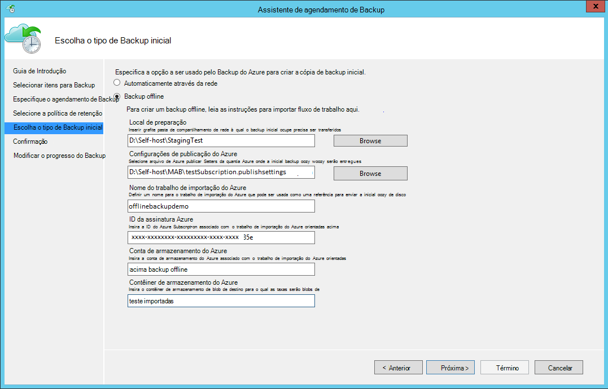

    Aqui está a tela correspondente no System Center Data Protection Manager:  
    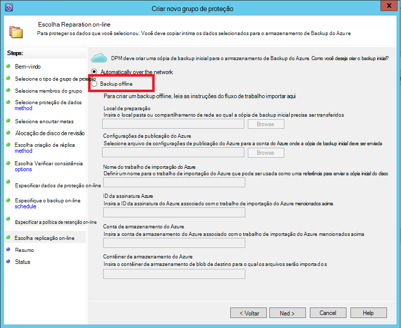

    A descrição das entradas é da seguinte maneira:

    - **Local de preparação**: O local de armazenamento temporário ao qual a cópia de backup inicial é escrita. Isso pode ser em um computador local ou um compartilhamento de rede. Se o computador de cópia e origem forem diferentes, é recomendável que você especifique o caminho completo da rede do local temporário.
    - **O nome de trabalho de importação do Azure**: O nome exclusivo pelo qual importar Azure Backup do Azure e serviço de controlar a transferência de dados enviados no discos no Azure.
    - **Configurações de publicação do Azure**: um arquivo XML que contém informações sobre seu perfil de assinatura. Ele também contém credenciais seguras que estão associadas a sua assinatura. Você pode [baixar o arquivo](https://manage.windowsazure.com/publishsettings). Forneça o caminho local para o arquivo de configurações de publicação.
    - **ID da assinatura do Azure**: O Azure ID da assinatura para a assinatura onde você planeja iniciar o trabalho de importação do Azure. Se você tiver várias assinaturas Azure, use a ID da assinatura que você deseja associar o trabalho de importação.
    - **Conta de armazenamento do Azure**: A conta de armazenamento do tipo clássico na assinatura do Azure fornecida que será associada com o trabalho de importação do Azure.
    - **Contêiner de armazenamento do Azure**: O nome do blob de armazenamento de destino na conta de armazenamento do Azure onde os dados dessa tarefa são importados.

    > [AZURE.NOTE] Se você registrou seu servidor para um cofre de serviços de recuperação do Azure a partir do [portal do Azure](https://portal.azure.com) para backups e não uma assinatura de provedor de solução da nuvem (CSP), você pode criar uma conta de armazenamento do tipo clássico do portal do Azure e usá-lo para o fluxo de trabalho de backup offline.

    Salve todas essas informações porque você precisar digitá-la novamente nas próximas etapas. Somente o *teste local* é necessário se você usou a ferramenta de preparação do disco do Azure para preparar os discos.    

2. Concluir o fluxo de trabalho e selecione **Fazer agora o backup** no console de gerenciamento do Azure Backup para iniciar a cópia de backup offline. O backup inicial é gravado para a área temporária como parte desta etapa.

    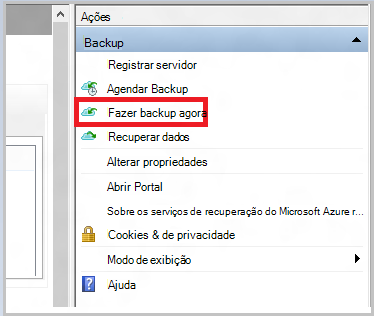

    Para concluir o fluxo de trabalho correspondente no System Center Data Protection Manager, clique com botão direito no **Grupo de proteção**e, em seguida, escolha a opção **de ponto de recuperação de criar** . Você, em seguida, escolha a opção de **Proteção on-line** .

    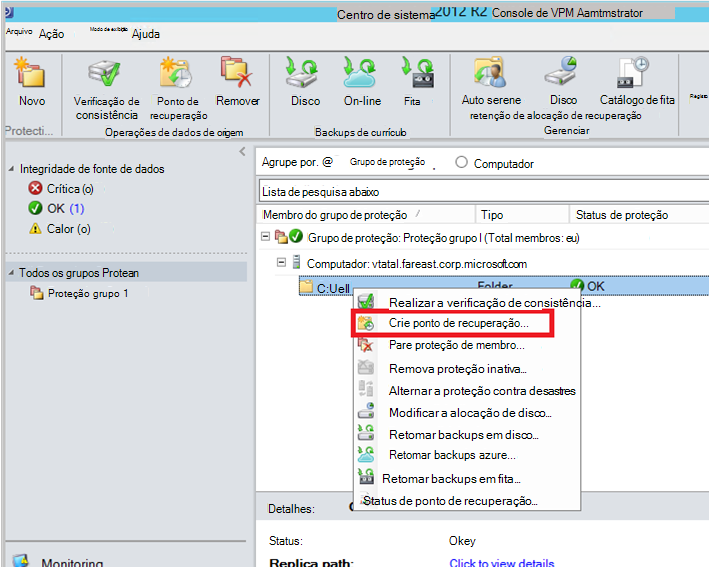

    Após concluir a operação, o local de preparação está pronto para ser usado para preparação do disco.

    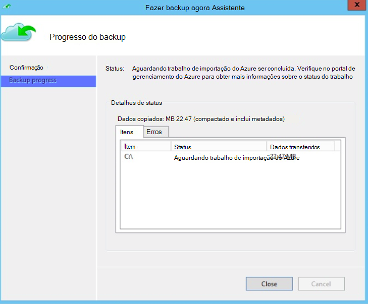

### Preparar uma unidade SATA e criar um trabalho de importação do Azure usando a ferramenta de preparação do disco do Azure
A ferramenta de preparação do Azure disco está disponível no diretório de instalação do agente de serviços de recuperação (atualização de agosto de 2016 e posterior) no seguinte caminho.

   *\Microsoft* *Azure* *Recuperação* *Serviços* * Agent\Utils\*

1. Vá para o diretório e copie o diretório **AzureOfflineBackupDiskPrep** para um computador de cópia no qual as unidades a ser preparado são montadas. Verifique o seguinte em relação ao computador de cópia:

      - O computador de cópia pode acessar o local de teste do fluxo de trabalho offline propagação usando o mesmo caminho de rede que foi fornecido no fluxo de trabalho **Iniciar backup offline** .

      - BitLocker está habilitado no computador.

      - O computador pode acessar o portal do Azure.

      Se necessário, o computador de cópia pode ser o mesmo que o computador de origem.

2. Abra um prompt de comando no computador cópia com o diretório da ferramenta de preparação do disco do Azure como a pasta atual e execute o seguinte comando:

      S: *.\AzureOfflineBackupDiskPrep.exe* <*Caminho do local de teste*> [p: <*caminho para PublishSettingsFile*>]

| Parâmetro | Descrição
|-------------|-------------|
|s: <*Caminho do local de teste*> | Entrada obrigatória que é usada para fornecer o caminho para o local de teste que você inseriu no fluxo de trabalho **Iniciar backup offline** . |
|p: <*caminho para PublishSettingsFile*> | Entrada opcional que é usada para fornecer o caminho para o arquivo de **Configurações de publicação do Azure** que você inseriu no fluxo de trabalho **Iniciar backup offline** . |

> [AZURE.NOTE] O &lt;caminho para PublishSettingFile&gt; valor é obrigatório quando o computador de cópia e fonte são diferentes.

Quando você executa o comando, a ferramenta solicita a seleção do trabalho de importação do Azure que corresponde às unidades que precisam ser preparados. Se apenas um trabalho de importação simples está associado com a localização de preparação fornecida, você verá uma tela como a seguir.

   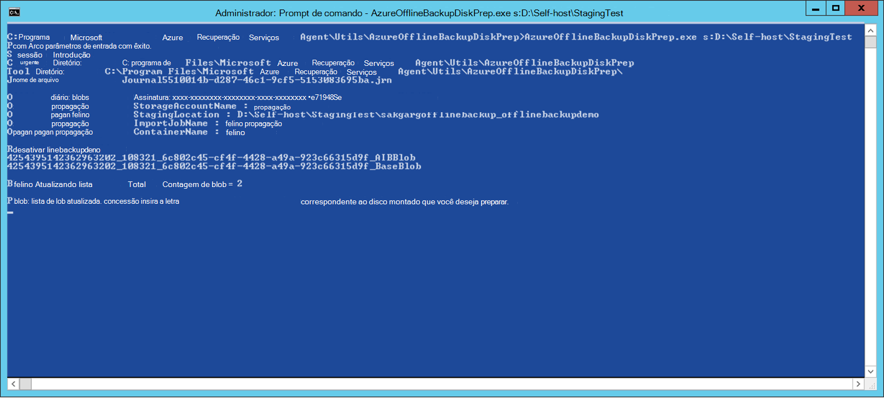  
3. Digite a letra da unidade sem os dois-pontos à direita para o disco montado desejado para se preparar para transferir para Azure. Fornece confirmação para a formatação da unidade quando solicitado.

A ferramenta então começa preparar o disco com os dados de backup. Talvez você precise anexar discos adicionais quando solicitado pela ferramenta caso o disco fornecido não tem espaço suficiente para os dados de backup.  

No final da execução bem-sucedida da ferramenta, um ou mais discos que você forneceu estão preparados para remessa no Azure. Além disso, um trabalho de importação com o nome fornecido durante o fluxo de trabalho **Iniciar backup offline** é criado no portal do clássico Azure. Por fim, a ferramenta exibe o endereço de entrega ao Azure Data Center onde os discos precisam ser enviado e o link para localizar o trabalho de importação no portal de clássico do Azure.

   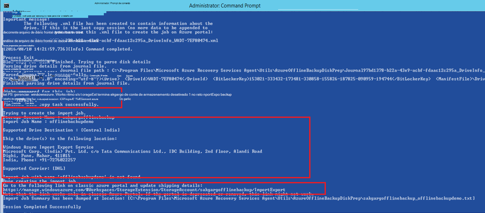 
4. Enviar os discos que a ferramenta fornecida no endereço e manter o número de controle para referência futura. 
5. Ao acessar o link que a ferramenta exibida, você verá a conta de armazenamento do Azure que você especificou no fluxo de trabalho **Iniciar backup offline** . Aqui você pode ver o trabalho de importação recém-criado na guia **Importação/exportação** da conta de armazenamento.

   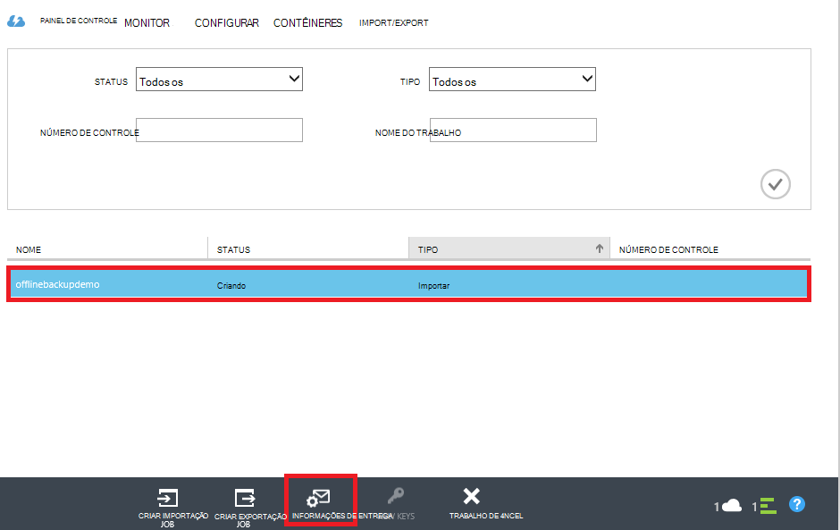 
6. Clique em **Informações de entrega** na parte inferior da página para atualizar os detalhes do contato, conforme mostrado na tela a seguir. A Microsoft usa essas informações para enviar seus discos para você depois que o trabalho de importação for concluído.

   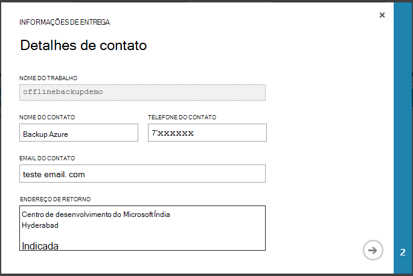 
7. Insira os detalhes de remessa na próxima tela. Fornece os detalhes de **Operadora de entrega** e **Número de controle** que correspondem aos discos que é fornecida ao data center Azure.

   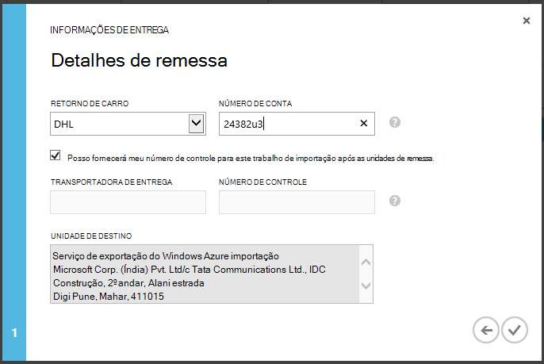 

### Concluir o fluxo de trabalho
Após concluir o trabalho de importação, dados de backup iniciais estão disponíveis em sua conta de armazenamento. Em seguida, o agente de serviços de recuperação copia o conteúdo dos dados dessa conta para o Cofre de Backup ou os serviços de recuperação cofre, o que for aplicável. No próximo horário de backup agendado, o agente de Backup do Azure executa o backup incremental sobre a cópia de backup inicial.

> [AZURE.NOTE] As seções a seguir se aplicam aos usuários de versões anteriores do Azure Backup que não têm acesso à ferramenta Preparação do disco do Azure.

### Preparar uma unidade SATA

1. Baixe a [Ferramenta de importação/exportação do Microsoft Azure](http://go.microsoft.com/fwlink/?linkid=301900&clcid=0x409) para o computador de cópia. Certifique-se de que o local de preparação é acessível a partir do computador no qual você planeja executar o próximo conjunto de comandos. Se necessário, o computador de cópia pode ser o mesmo que o computador de origem.

2. Descompacte o arquivo WAImportExport.zip. Execute a ferramenta de WAImportExport que formata a unidade, grava os dados de backup a unidade e criptografa. Antes de executar o comando a seguir, certifique-se de que o BitLocker é habilitado no computador.  

    *.\WAImportExport.exe PrepImport /j: <* JournalFile*> .jrn /id: <*SessionId*> /sk: <*StorageAccountKey*> /BlobType:**PageBlob* * /t: <*TargetDriveLetter*>/Formatar / criptografar /srcdir: <*local de teste*> /dstdir: <*DestinationBlobVirtualDirectory*>/*

    > [AZURE.NOTE] Se você tiver instalado a atualização de 2016 de agosto de Backup do Azure (ou posterior), verifique se o local de teste que você inseriu é a mesma que na tela **Fazer agora o backup** e contém arquivos AIB e Blob de Base.

| Parâmetro | Descrição
|-------------|-------------|
| /j: <*JournalFile*>| O caminho para o arquivo de diário. Cada unidade deve ter exatamente um arquivo de diário. O arquivo de diário não deve estar na unidade de destino. A extensão de arquivo de diário é .jrn e é criada como parte de executar este comando.|
|/ID: <*identificação de sessão*> | A identificação da sessão identifica uma sessão de cópia. Ele é usado para garantir a recuperação precisa de uma sessão de cópia interrompida. Arquivos que são copiados em uma sessão de cópia são armazenados em um diretório chamado após a identificação da sessão na unidade de destino.|
| /SK: <*StorageAccountKey*> | A chave de conta para a conta de armazenamento para o qual os dados serão importados. A chave precisa ser o mesmo como foi inserido durante a criação de grupo de política/proteção de backup.|
| / BlobType | O tipo de blob. Este fluxo de trabalho é bem sucedida apenas se **PageBlob** for especificada. Isso não é a opção padrão e deve ser mencionado neste comando. |
|/t: <*TargetDriveLetter*> | A letra da unidade sem os dois-pontos à direita do disco rígido destino para a sessão de cópia atual.|
|/Format | A opção para formatar a unidade. Especificar esse parâmetro quando a unidade precisa ser formatado; Caso contrário, omita-lo. Antes da ferramenta formata a unidade, ele solicita uma confirmação do console. Para suprimir a confirmação, especifique o parâmetro /silentmode.|
|/ criptografar | A opção para criptografar a unidade. Especifica esse parâmetro quando a unidade ainda não foram criptografada com BitLocker e precisa ser criptografada pela ferramenta. Se a unidade já foi criptografada com BitLocker, omitir esse parâmetro, especifique o parâmetro /bk e fornecer a chave de BitLocker existente. Se você especifica o parâmetro /format, você também deve especificar a / criptografar parâmetro. |
|/srcdir: <*SourceDirectory*> | O diretório de origem que contém os arquivos sejam copiados para a unidade de destino. Certifique-se de que o nome do diretório especificado tem um caminho completo em vez de relativa.|
|/dstdir: <*DestinationBlobVirtualDirectory*> | O caminho para o diretório virtual de destino na sua conta de armazenamento do Azure. Certifique-se de usar nomes de contêiner válido quando você especifica os diretórios virtuais de destino ou blobs. Tenha em mente que os nomes de contêiner devem ser minúsculos.  Esse nome contêiner deve ser aquele que você inseriu durante a criação de grupo de política/proteção de backup.|

  > [AZURE.NOTE] Um arquivo do diário é criado na pasta WAImportExport que captura as informações inteiras do fluxo de trabalho. Você precisa esse arquivo quando você cria um trabalho de importação no portal do Azure.

  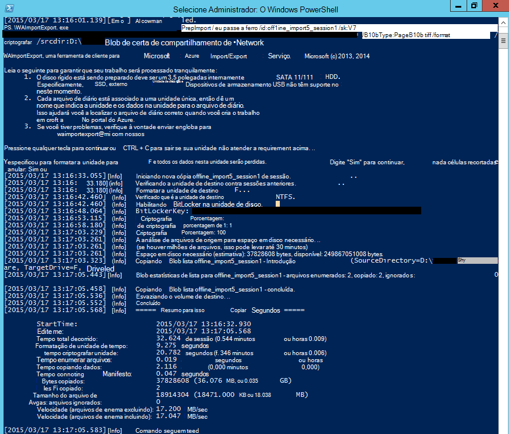

### Criar um trabalho de importação no portal do Azure
1. Vá para sua conta de armazenamento do [Azure portal clássico](https://manage.windowsazure.com/), clique em **Importar/exportar**e, em seguida, **Criar trabalho de importação** , no painel de tarefas.

    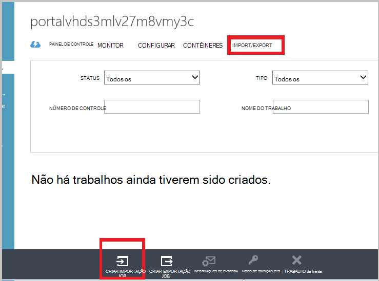

2. Na etapa 1 do assistente, indicam que você tenha preparado sua unidade e que você tem o arquivo de diário de unidade disponível.
3. Na etapa 2 do assistente, forneça as informações de contato para a pessoa responsável por esse trabalho de importação.
4. Na etapa 3, carregue os arquivos de diário de unidade que você obteve na seção anterior.
5. Na etapa 4, insira um nome descritivo para o trabalho de importação que você inseriu durante a criação de grupo de política/proteção de backup. O nome que você insere pode conter apenas letras minúsculas, números, hifens e sublinhados, deve começar com uma letra e não pode conter espaços. O nome que você escolher é usado para controlar seus trabalhos enquanto estiverem em andamento e depois que eles forem concluídos.
6. Em seguida, selecione sua região de data center na lista. A região do data center indica a data center e o endereço para o qual você deve enviar seu pacote.

    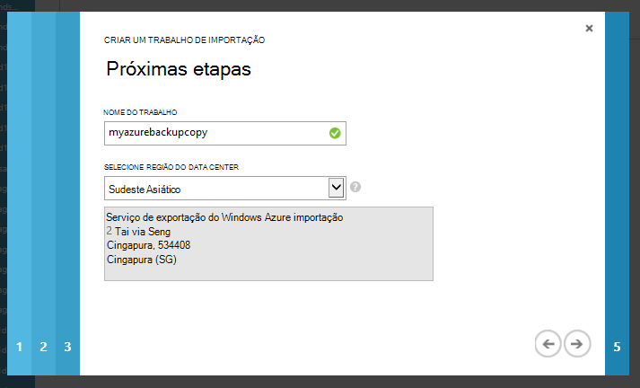

7. Na etapa 5, selecione sua operadora de retorno da lista e digite o número da sua conta de transportadora. A Microsoft usa esta conta para enviar as unidades de volta para você após a importação de conclusão do trabalho.

8. Entregar o disco e insira o número de acompanhamento para acompanhar o status da remessa. Depois que o disco chega no data center, ele é copiado para a conta de armazenamento e o status é atualizado.

    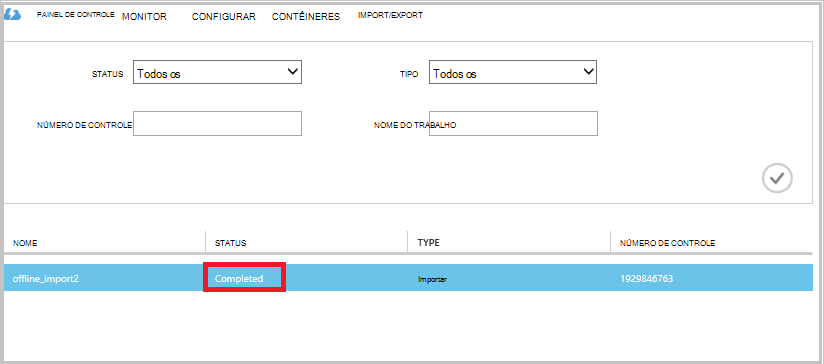

### Concluir o fluxo de trabalho
Depois que os dados de backup iniciais estiverem disponíveis em sua conta de armazenamento, o agente de serviços de recuperação do Microsoft Azure copia o conteúdo dos dados dessa conta para o Cofre de Backup ou Cofre de serviços de recuperação, conforme aplicável. Na próxima programação backup hora, o agente de Backup do Azure executa o backup incremental sobre a cópia de backup inicial.

## Próximas etapas
- Para dúvidas sobre o fluxo de trabalho de importação/exportação do Azure, consulte [usar o serviço de importação/exportação do Microsoft Azure para transferir dados para o armazenamento de Blob](../storage/storage-import-export-service.md).
- Consulte a seção de backup off-line do Azure Backup [perguntas Frequentes](backup-azure-backup-faq.md) para dúvidas sobre o fluxo de trabalho.
