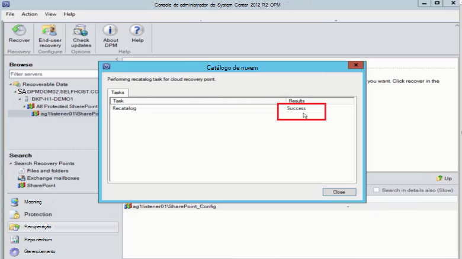

<properties
    pageTitle="Proteção de servidor DPM/Azure Backup de um farm do SharePoint no Azure | Microsoft Azure"
    description="Este artigo fornece uma visão geral de proteção do servidor DPM/Azure Backup de um farm do SharePoint para o Azure"
    services="backup"
    documentationCenter=""
    authors="adigan"
    manager="Nkolli1"
    editor=""/>

<tags
    ms.service="backup"
    ms.workload="storage-backup-recovery"
    ms.tgt_pltfrm="na"
    ms.devlang="na"
    ms.topic="article"
    ms.date="09/29/2016"
    ms.author="adigan;giridham;jimpark;trinadhk;markgal"/>

# Fazer backup de um farm do SharePoint para o Azure
Fazer backup de um farm do SharePoint ao Microsoft Azure usando o System Center Data Protection Manager (DPM) da mesma maneira que você fizer backup de outras fontes de dados. Backup Azure fornece flexibilidade para o agendamento de backup para criar diário, semanal, mensal ou anual backup aponta e oferece opções de política de retenção para vários pontos de backup. DPM fornece a capacidade para armazenar cópias de disco local para rápida objetivos de tempo de recuperação (RTO) e armazenar cópias no Azure para retenção econômica de longo prazo.

## SharePoint versões compatíveis e relacionados cenários de proteção
Azure Backup para DPM oferece suporte para os seguintes cenários:

| Carga de trabalho | Versão | Implantação do SharePoint | Tipo de implantação do DPM | DPM - System Center 2012 R2 | Proteção e recuperação |
| -------- | ------- | --------------------- | ------------------- | --------------------------- | ----------------------- |
| SharePoint | SharePoint 2013, o SharePoint 2010, SharePoint 2007, SharePoint 3.0 | SharePoint implantado como um servidor físico ou máquina virtual Hyper-V/VMware   --------------   Sempre ativado SQL | Máquina de virtual de Hyper-V física de servidor ou local | Backup oferece suporte para o Azure de 5 de Rollup de atualização | Proteger as opções de recuperação de Farm do SharePoint: farm de recuperação, o banco de dados e o arquivo ou item de lista de pontos de recuperação de disco.  Recuperação de banco de dados e o farm de pontos de recuperação Azure. |

## Antes de começar
Há algumas coisas que você precisa confirmar antes de você fazer backup de um farm do SharePoint no Azure.

### Pré-requisitos
Antes de continuar, certifique-se de que você atingiu todos os [pré-requisitos para usar o Microsoft Azure Backup](backup-azure-dpm-introduction.md#prerequisites) para proteger as cargas de trabalho. Algumas tarefas de pré-requisitos incluem: criar um backup cofre, baixar credenciais de cofre, instalar o agente de Backup do Azure e registrar o servidor de Backup do DPM/Azure com o cofre.

### Agente DPM
O DPM agent deve ser instalado no servidor que está executando o SharePoint, os servidores que executam o SQL Server e todos os outros servidores que fazem parte de farm do SharePoint. Para obter mais informações sobre como configurar o agente de proteção, consulte [Agente de proteção de instalação](https://technet.microsoft.com/library/hh758034(v=sc.12).aspx).  A única exceção é que você instale o agente apenas em um único front-end (WFE) servidor web. DPM necessidades o agente em um servidor WFE apenas para servir como ponto de entrada para proteção.

### Farm do SharePoint
Para todos os itens de 10 milhões no farm, deve haver pelo menos 2 GB de espaço no volume onde a pasta DPM está localizada. Este espaço é necessário para geração de catálogo. Para DPM recuperar itens específicos (conjuntos de sites, sites, listas, bibliotecas de documentos, pastas, documentos individuais e itens de lista), geração de catálogo cria uma lista de URLs que estão contidas em cada banco de dados de conteúdo. Você pode exibir a lista de URLs no painel recuperáveis item na área de tarefas de **recuperação** do DPM Administrator Console.

### SQL Server
DPM é executado como uma conta do sistema local. Para fazer backup de bancos de dados do SQL Server, o DPM precisa privilégios de administrador do sistema dessa conta para o servidor que executa o SQL Server. Defina o sistema/Autoridade NT como *administrador do sistema* no servidor que está executando o SQL Server antes que você faça backup.

Se o farm do SharePoint tiver bancos de dados do SQL Server que estão configurados com aliases do SQL Server, instale os componentes de cliente do SQL Server no servidor Web front-end que DPM irá proteger.

### O SharePoint Server
Enquanto o desempenho depende de vários fatores como o tamanho do farm do SharePoint, como orientação geral um servidor DPM pode proteger um farm do SharePoint de 25 TB.

### DPM cumulativo 5
Para começar a proteção de um farm do SharePoint para o Azure, você precisa instalar cumulativo DPM 5 ou posterior. O pacote cumulativo de atualizações 5 fornece a capacidade de proteger um farm do SharePoint no Azure se o farm é configurado usando SQL AlwaysOn.
Para obter mais informações, consulte o blog post que apresenta [DPM Update Rollup 5]( http://blogs.technet.com/b/dpm/archive/2015/02/11/update-rollup-5-for-system-center-2012-r2-data-protection-manager-is-now-available.aspx)

### O que não é suportado
- DPM que protege um farm do SharePoint não proteger índices de pesquisa ou bancos de dados de serviço de aplicativo. Você precisará configurar a proteção desses bancos de dados separadamente.
- DPM não oferece backup de bancos de dados do SQL Server do SharePoint que são hospedados em compartilhamentos de arquivos de dimensionamento de servidor (SOFS).

## Configurar a proteção do SharePoint
Antes de poder usar o DPM para proteger o SharePoint, você deve configurar o gravador de VSS do SharePoint serviço (WSS gravador) usando **ConfigureSharePoint.exe**.

Você pode encontrar **ConfigureSharePoint.exe** na pasta \bin [caminho de instalação do DPM] no servidor web front-end. Essa ferramenta oferece o agente de proteção com as credenciais para o farm do SharePoint. Você executá-lo em um único servidor WFE. Se você tiver vários servidores WFE, selecione apenas quando você configura um grupo de proteção.

### Para configurar o serviço de gravador de VSS do SharePoint
1. No servidor WFE, em um prompt de comando, vá para \bin\ [local de instalação do DPM]
2. Insira ConfigureSharePoint - EnableSharePointProtection.
3. Insira as credenciais de administrador do farm. Essa conta deve ser um membro do grupo administrador local no servidor WFE. Se o administrador do farm não local administrador conceder as seguintes permissões no servidor WFE:
  - Conceda o controle total do grupo WSS_Admin_WPG à pasta DPM (% programa Files%\Microsoft Data Protection Manager\DPM).
  - Conceda acesso de leitura de grupo WSS_Admin_WPG à chave do registro de DPM (HKEY_LOCAL_MACHINE\SOFTWARE\Microsoft\Microsoft Gerenciador de proteção de dados).

>[AZURE.NOTE] Você precisará executar novamente ConfigureSharePoint.exe sempre que houver uma alteração nas credenciais de administrador do farm do SharePoint.

## Fazer backup de um farm do SharePoint usando o DPM
Após ter configurado DPM e o farm do SharePoint, como explicado anteriormente, o SharePoint pode ser protegido pelo DPM.

### Proteger um farm do SharePoint
1. Na guia **proteção** do Console do administrador do DPM, clique em **novo**.
    

2. Na página **Selecionar o tipo de grupo de proteção** do assistente **Criar novo grupo de proteção** , selecione **servidores**e clique em **Avançar**.

    

3. Na tela **Selecionar membros de grupo** , marque a caixa de seleção para o SharePoint server que você deseja proteger e clique em **Avançar**.

    

    >[AZURE.NOTE] Com o agente DPM instalado, você pode ver o servidor no assistente. DPM também mostra sua estrutura. Porque você executou ConfigureSharePoint.exe, DPM se comunica com o serviço do SharePoint VSS Writer e seus bancos de dados do SQL Server correspondentes e reconhece a estrutura de farm do SharePoint, os bancos de dados de conteúdo associados e todos os itens correspondentes.

4. Na página **Selecionar o método de proteção de dados** , insira o nome do **Grupo de proteção**e selecione seu preferencial *métodos de proteção*. Clique em **Avançar**.

    

    >[AZURE.NOTE] O método de proteção de disco ajuda a atender aos objetivos de tempo de recuperação curtos. Azure é um destino de proteção de longo prazo, econômico comparado às fitas. Para obter mais informações, consulte [Usar Azure Backup para substituir sua infraestrutura de fita](https://azure.microsoft.com/documentation/articles/backup-azure-backup-cloud-as-tape/)

5. Na página **Especificar Short-Term metas** , selecione seu preferencial **intervalo de retenção** e identificar quando você quiser backups ocorra.

    

    >[AZURE.NOTE] Como recuperação com mais frequência é necessária para dados que é menos de cinco dias, podemos selecionado um intervalo de retenção de cinco dias no disco e verificado que o backup acontece durante o horário de não-produção, para esse exemplo.

6. Examine o espaço de disco do pool de armazenamento alocado para o grupo de proteção e então clique em **Avançar**.

7. Para cada grupo de proteção, o DPM aloca espaço em disco para armazenar e gerenciar réplicas. Neste ponto, DPM deve criar uma cópia dos dados selecionados. Selecione como e quando você deseja da réplica criada e clique em **Avançar**.

    

    >[AZURE.NOTE] Para certificar-se de que o tráfego de rede não é afetado, selecione uma hora fora do horário de produção.

8. DPM garante a integridade dos dados, executando verificações de consistência na réplica. Há duas opções disponíveis. Você pode definir uma agenda para executar verificações de consistência ou DPM pode executar verificações de consistência automaticamente na réplica sempre que ele se torne inconsistente. Selecione a sua opção preferida e clique em **Avançar**.

    

9. Na página **Especificar Online de proteção de dados** , selecione o farm do SharePoint que você deseja proteger e, em seguida, clique em **Avançar**.

    

10. Na página **Especificar agenda de Backup Online** , selecione seu cronograma preferencial e clique em **Avançar**.

    

    >[AZURE.NOTE] DPM fornece um máximo de dois backups diários ao Azure em momentos diferentes. Backup Azure também pode controlar a quantidade de largura de banda WAN que pode ser usada para backups no pico e pico usando a [Otimização de rede de Backup do Azure](https://azure.microsoft.com/en-in/documentation/articles/backup-configure-vault/#enable-network-throttling).

11. Dependendo do agendamento de backup que você selecionou, na página **Especificar a política de retenção on-line** , selecione a política de retenção para pontos de backup diárias, semanais, mensais e anuais.

    

    >[AZURE.NOTE] DPM usa um esquema de retenção de vovô-pai-filho em que uma política de retenção diferente pode ser escolhida para pontos de backup diferentes.

12. Semelhante ao disco, uma réplica de ponto de referência inicial precisa ser criada no Azure. Selecione a sua opção preferida para criar uma cópia de backup inicial no Azure e clique em **Avançar**.

    

13. Examine as configurações selecionadas na página de **Resumo** e, em seguida, clique em **Criar grupo**. Depois que o grupo de proteção tiver sido criado, você verá uma mensagem de sucesso.

    

## Restaurar um item do SharePoint de disco usando o DPM
No exemplo a seguir, o *item do SharePoint recuperando* tenha sido excluído acidentalmente e precisa ser recuperadas.

1. Abra o **DPM Administrator Console**. Todos os farms do SharePoint que são protegidos pelo DPM são mostrados na guia **proteção** .

    

2. Para começar a recuperar o item, selecione a guia de **recuperação** .

    

3. Você pode pesquisar SharePoint *item do SharePoint recuperando* usando uma pesquisa baseada em curinga dentro de um intervalo de ponto de recuperação.

    

4. Selecione o ponto de recuperação apropriada nos resultados da pesquisa, clique com botão direito no item e selecione **recuperar**.

5. Você também pode navegar pelos vários pontos de recuperação e selecionar um banco de dados ou item para recuperar. Selecione **Data > tempo de recuperação**e selecione o correto **banco de dados > farm do SharePoint > ponto de recuperação > Item**.

    

6. Clique com botão direito no item e selecione **recuperar** para abrir o **Assistente de recuperação**. Clique em **Avançar**.

    

7. Selecione o tipo de recuperação que você deseja executar e clique em **Avançar**.

    

    >[AZURE.NOTE] A seleção de **recuperar para original** no exemplo recupera o item ao site do SharePoint original.

8. Selecione o **Processo de recuperação** que você deseja usar.
    - Selecione **recuperar sem usar um farm de recuperação** se o farm do SharePoint não foi alterado e é a mesma que o ponto de recuperação que está sendo restaurado.
    - Selecione **recuperar usando um farm de recuperação** se o farm do SharePoint foram alteradas desde o ponto de recuperação foi criado.

    

9. Forneça um local de instância do SQL Server preparação para recuperar o banco de dados temporariamente e forneça um teste compartilhamento de arquivo no servidor DPM e no servidor que está executando o SharePoint para recuperar o item.

    

    DPM anexa o banco de dados de conteúdo que está hospedando o item do SharePoint a instância do SQL Server temporário. O banco de dados de conteúdo, o servidor DPM recupera o item e a coloca no local do arquivo temporário no servidor DPM. O item recuperado que está no local de preparação do servidor DPM agora precisa ser exportados para o local de preparação no farm do SharePoint.

    

10. Selecione **especificar opções de recuperação**e aplicar configurações de segurança para o farm do SharePoint ou aplicar as configurações de segurança do ponto de recuperação. Clique em **Avançar**.

    

    >[AZURE.NOTE] Você pode optar por controlar o uso de largura de banda de rede. Isso minimiza o impacto no servidor de produção durante o horário de produção.

11. Examine as informações de resumo e clique em **recuperar** para começar a recuperação do arquivo.

    

12. Agora, selecione a guia **Monitoring** no **DPM Administrator Console** para exibir o **Status** da recuperação.

    

    >[AZURE.NOTE] O arquivo agora é restaurado. Você pode atualizar o site do SharePoint para verificar o arquivo restaurado.

## Restaurar um banco de dados do SharePoint do Azure usando DPM

1. Para recuperar um banco de dados de conteúdo do SharePoint, navegue por vários pontos de recuperação (conforme mostrado anteriormente) e selecione o ponto de recuperação que você deseja restaurar.

    

2. Clique duas vezes o ponto de recuperação do SharePoint para mostrar as informações de catálogo do SharePoint disponíveis.

    > [AZURE.NOTE] Porque o farm do SharePoint está protegido para retenção de longo prazo no Azure, nenhuma informação de catálogo (metadados) está disponível no servidor DPM. Como resultado, sempre que um banco de dados no momento da conteúdo do SharePoint precisa ser recuperadas, você precisa farm do SharePoint de catálogo novamente.

3. Clique em **catálogo novamente**.

    

    A janela de status **Nuvem recatalogar** abre.

    

    Após catálogos, o status é alterado para *Success*. Clique em **Fechar**.

    

4. Clique no objeto do SharePoint mostrado na guia DPM **recuperação** para obter a estrutura do banco de dados de conteúdo. Clique com botão direito no item e, em seguida, clique em **recuperar**.

    

5. Neste ponto, siga as [etapas de recuperação neste artigo](#restore-a-sharepoint-item-from-disk-using-dpm) para recuperar um banco de dados de conteúdo do SharePoint do disco.

## Perguntas frequentes
P: quais versões do DPM oferece suporte 2014 do SQL Server e SQL 2012 (SP2)? 
R: DPM 2012 R2 com atualização cumulativa 4 suporta ambos.

P: posso recuperar um item do SharePoint no local original se SharePoint é configurado usando SQL AlwaysOn (com proteção em disco)? 
R: Sim, o item pode ser recuperado ao site do SharePoint original.

P: posso recuperar um banco de dados do SharePoint no local original se SharePoint é configurado usando SQL AlwaysOn? 
R: como bancos de dados do SharePoint são configurados no SQL AlwaysOn, eles não podem ser modificados, a menos que o grupo de disponibilidade é removido. Como resultado, o DPM não pode restaurar um banco de dados para o local original. Você pode recuperar um banco de dados do SQL Server para outra instância do SQL Server.

## Próximas etapas
- Saiba mais sobre proteção do DPM do SharePoint - consulte [Série de vídeo - DPM proteção do SharePoint](http://channel9.msdn.com/Series/Azure-Backup/Microsoft-SCDPM-Protection-of-SharePoint-1-of-2-How-to-create-a-SharePoint-Protection-Group)
- Examine as [notas de versão do System Center 2012 - Gerenciador de proteção de dados](https://technet.microsoft.com/library/jj860415.aspx)
- Revise [as notas de versão do Gerenciador de proteção de dados no System Center 2012 SP1](https://technet.microsoft.com/library/jj860394.aspx)
