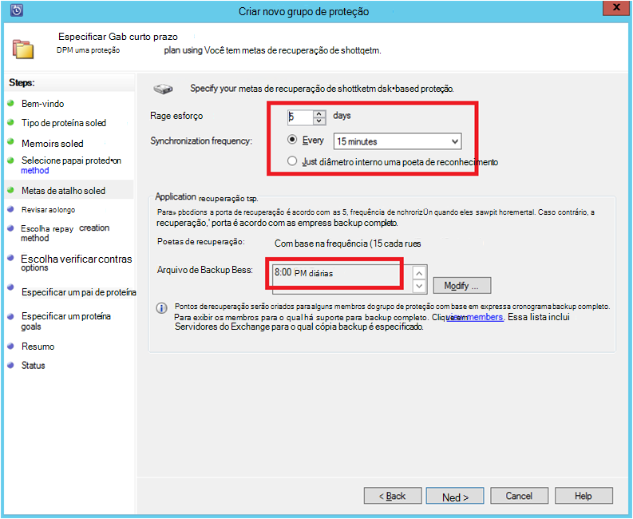

<properties
    pageTitle="Azure Backup para cargas de trabalho do SQL Server usando o DPM | Microsoft Azure"
    description="Uma introdução ao fazer backup de bancos de dados do SQL Server usando o serviço de Backup do Azure"
    services="backup"
    documentationCenter=""
    authors="adigan"
    manager="Nkolli1"
    editor=""/>

<tags
    ms.service="backup"
    ms.workload="storage-backup-recovery"
    ms.tgt_pltfrm="na"
    ms.devlang="na"
    ms.topic="article"
    ms.date="09/27/2016"
    ms.author="adigan;giridham; jimpark;markgal;trinadhk"/>

# Azure Backup para cargas de trabalho do SQL Server usando o DPM

Este artigo orienta as etapas de configuração para backup de bancos de dados do SQL Server usando o Backup do Azure.

Para fazer backup de bancos de dados do SQL Server para o Azure, é necessário uma conta do Azure. Se você não tiver uma conta, você pode criar uma conta de avaliação gratuita em apenas alguns minutos. Para obter detalhes, consulte [Avaliação gratuita do Azure](https://azure.microsoft.com/pricing/free-trial/).

O gerenciamento de backup do banco de dados do SQL Server Azure e recuperação do Azure envolve três etapas:

1. Crie uma política de backup para proteger bancos de dados do SQL Server para o Azure.
2. Crie cópias de backup sob demanda para o Azure.
3. Recupere o banco de dados do Azure.

## Antes de começar
Antes de começar, certifique-se de que todos os [pré-requisitos](../backup-azure-dpm-introduction.md#prerequisites) para usar o Microsoft Azure Backup proteger cargas de trabalho foram atendidos. Os pré-requisitos abrangem tarefas como: criar um backup cofre, baixando cofre credenciais, instalando o agente de Backup do Azure e registrar o servidor com o cofre.

## Criar uma política de backup para proteger bancos de dados do SQL Server para o Azure

1. No servidor DPM, clique no espaço de trabalho de **proteção** .

2. Na faixa de ferramentas, clique em **novo** para criar um novo grupo de proteção.

    

3. DPM mostra a tela de iniciar com a orientação sobre como criar um **Grupo de proteção**. Clique em **Avançar**.

4. Selecione **servidores**.

    

5. Expanda a máquina do SQL Server onde os bancos de dados de backup estão presentes. DPM mostra várias fontes de dados que podem ser feito o backup do servidor. Expanda a **Todos os compartilhamentos de SQL** e selecione os bancos de dados (neste caso selecionamos ReportServer$ MSDPM2012 e ReportServer$ MSDPM2012TempDB) para backup. Clique em **Avançar**.

    

6. Forneça um nome para o grupo de proteção e selecione a caixa de seleção **desejo proteção on-line** .

    

7. Na tela **Especificar Short-Term metas** , inclua as entradas necessárias para criar pontos de backup em disco.

    Aqui, vemos que o **intervalo de retenção** está definido como *5 dias*, **frequência de sincronização** é definida para uma vez a cada *15 minutos* que é a frequência na qual o backup é feito. **Backup completo Express** está definido como *8:00 p. m*.

    

    >[AZURE.NOTE] Em 8:00 PM (de acordo com a entrada de tela) um ponto de backup é criado diariamente transferindo os dados que foi modificados de ponto de backup de 8:00 PM do dia anterior. Esse processo é chamado **Express Backup completo**. Enquanto a transação logs são sincronizados a cada 15 minutos, se houver necessidade de recuperar o banco de dados às 9:00 – o ponto é criado repetindo os logs da última express ponto backup completo (8 pm nesse caso).

8. Clique em **Avançar**

    DPM mostra o espaço de armazenamento total disponível e a utilização de espaço de disco possíveis.

    

    Por padrão, o DPM cria um volume por fonte de dados (banco de dados do SQL Server) que é usado para a cópia de backup inicial. Usando essa abordagem, o Gerenciador de disco lógico (LDM) limites de proteção do DPM a fontes de dados de 300 (bancos de dados do SQL Server). Para contornar essa limitação, selecione o **conjunto localizar dados no Pool de armazenamento do DPM**, opção. Se você usar esta opção, o DPM usa um único volume de várias fontes de dados, que permite DPM para proteger até 2.000 bancos de dados do SQL.

    Se **aumentar automaticamente os volumes** opção for selecionada, o DPM pode conta para o maior volume de backup à medida que os dados de produção crescem. Se a opção **aumentar automaticamente os volumes** não estiver selecionada, o DPM limita o armazenamento de backup usado para as fontes de dados no grupo de proteção.

9. Os administradores recebem a opção de transferência este backup inicial manualmente (fora da rede) para evitar congestionamento de largura de banda ou através da rede. Eles também podem configurar a hora em que a transferência inicial pode acontecer. Clique em **Avançar**.

    

    A cópia de backup inicial requer transferência da fonte de dados inteiro (banco de dados do SQL Server) do servidor de produção (máquina do SQL Server) para o servidor DPM. Esses dados podem ser grandes e transferir os dados pela rede poderia exceder a largura de banda. Por esse motivo, os administradores podem escolher para transferir o backup inicial: **manualmente** (usando mídia removível) para evitar congestionamento de largura de banda, ou **automaticamente através da rede** (em um horário especificado).

    Depois que o backup inicial for concluído, o restante dos backups são backups incrementais a cópia de backup inicial. Backups incrementais tendem a ser pequenas e facilmente são transferidos pela rede.

10. Escolha quando desejar que a verificação de consistência para executar e clique em **Avançar**.

    

    O DPM pode realizar uma consistência seleção para verificar a integridade do ponto de backup. Calcula a soma de verificação do arquivo de backup no servidor de produção (máquina do SQL Server neste cenário) e os dados de backup para esse arquivo no DPM. No caso de um conflito, ele será considerado que o arquivo de backup no DPM está corrompido. DPM rectifies os dados de backup enviando os blocos correspondente a incompatibilidade de soma de verificação. Como a verificação de consistência é uma operação de desempenho intenso, os administradores têm a opção de agendar a verificação de consistência ou executá-lo automaticamente.

11. Para especificar proteção on-line das fontes de dados, selecione os bancos de dados a serem protegidas no Azure e clique em **Avançar**.

    

12. Os administradores podem escolher agendas de backup e políticas de retenção que atender às suas políticas de organização.

    

    Neste exemplo, são realizados backups uma vez por dia em 12:00 PM e 8 PM (parte inferior da tela)

    >[AZURE.NOTE] É uma prática recomendada ter alguns pontos de recuperação de curto prazo em disco, recuperação rápida. Esses pontos de recuperação são usados para "recuperação operacional". Azure serve como um local de boa externo com SLAs mais altos e garantia de disponibilidade.

    **Prática recomendada**: Certifique-se de que o Azure Backups são agendados após a conclusão de backups em disco local usando o DPM. Isso permite que o backup mais recente do disco sejam copiados para Azure.

13. Escolha o cronograma de política de retenção. Os detalhes sobre como funciona a política de retenção são fornecidos no [Uso do Azure Backup para substituir o seu artigo de infraestrutura de fita](backup-azure-backup-cloud-as-tape.md).

    

    Neste exemplo:

    - Backups são feitos uma vez por dia às 12:00 PM e 8 PM (parte inferior da tela) e são mantidos por 180 dias.
    - O backup no sábado às 12:00 são mantidos por semanas 104
    - O backup no último sábado às 12:00 são mantidos para 60 meses
    - O backup no último sábado de março às 12:00 são mantidos por 10 anos

14. Clique em **Avançar** e selecione a opção apropriada para transferir a cópia de backup inicial para o Azure. Você pode escolher **automaticamente pela rede** ou **Backup Offline**.

    - **Automaticamente pela rede** transfere os dados de backup para Azure conforme o agendamento escolhido para backup.
    - Como funciona o **Backup Offline** é explicado no [fluxo de trabalho de Backup Offline no Azure Backup](backup-azure-backup-import-export.md).

    Escolha o mecanismo de transferência relevantes para enviar a cópia de backup inicial no Azure e clique em **Avançar**.

15. Depois que você examine os detalhes de política na tela **Summary** , clique no botão **Criar grupo** para concluir o fluxo de trabalho. Você pode clicar no botão **Fechar** e monitorar o progresso do trabalho no espaço de trabalho de monitoramento.

    

## Sob demanda backup de um banco de dados do SQL Server
Enquanto as etapas anteriores criado uma política de backup, um "ponto de recuperação" é criado somente quando o primeiro backup ocorre. Em vez de esperar o Agendador para surgirá, as etapas abaixo disparadores a criação de uma recuperação apontam manualmente.

1. Aguarde até que o status do grupo de proteção mostra **Okey** para o banco de dados antes de criar o ponto de recuperação.

    

2. Clique com botão direito no banco de dados e selecione o **Ponto de recuperação de criar**.

    

3. Escolha **Proteção on-line** no menu suspenso e clique em **Okey**. Isso inicia a criação de um ponto de recuperação no Azure.

    

4. Você pode exibir o andamento do trabalho no espaço de trabalho de **monitoramento** onde você encontrará uma em andamento trabalho como o mostrado na figura a próxima.

    

## Recuperar um banco de dados do SQL Server do Azure
As etapas a seguir são necessárias para recuperar uma entidade protegida (banco de dados do SQL Server) do Azure.

1. Abra o Console de gerenciamento do servidor DPM. Navegue até o espaço de trabalho de **recuperação** onde você pode ver os servidores de backup pelo DPM. Procure o banco de dados necessário (em ReportServer neste caso $MSDPM2012). Selecione um tempo de **recuperação do** que termina com **Online**.

    

2. Clique com botão direito no nome do banco de dados e clique em **recuperar**.

    

3. DPM mostra os detalhes do ponto de recuperação. Clique em **Avançar**. Para substituir o banco de dados, selecione o tipo de recuperação **recuperar a instância original do SQL Server**. Clique em **Avançar**.

    

    Neste exemplo, DPM permite a recuperação do banco de dados para outra instância do SQL Server ou em uma pasta de rede autônomo.

4. Na tela **Opções de recuperação especificar** , você pode selecionar as opções de recuperação como a otimização do uso da largura de banda de rede para reduzir a largura de banda usada pela recuperação. Clique em **Avançar**.

5. Na tela **Resumo** , você vê todas as configurações de recuperação fornecidas até o momento. Clique em **recuperar**.

    O status de recuperação mostra o banco de dados que está sendo recuperado. Você pode clicar em **Fechar** para fechar o assistente e exibir o andamento do espaço de trabalho de **monitoramento** .

    

    Após a recuperação ser concluída, o banco de dados restaurado é consistente do aplicativo.

### Próximas etapas:

• [Azure FAQ de Backup](backup-azure-backup-faq.md)
