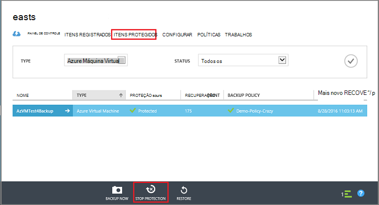

<properties
   pageTitle="Excluir um cofre Azure Backup | Microsoft Azure"
   description="Como excluir um cofre de Backup do Azure. Por que não é possível excluir um backup Cofre de solução de problemas. "
   services="service-name"
   documentationCenter="dev-center-name"
   authors="markgalioto"
   manager="cfreeman"
   editor=""/>

<tags
   ms.service="backup"
   ms.devlang="na"
   ms.topic="article"
   ms.tgt_pltfrm="na"
   ms.workload="storage-backup-recovery"
   ms.date="08/29/2016"
   ms.author="markgal;trinadhk"/>

# Excluir um cofre de Backup do Azure

O serviço de Backup do Azure tem dois tipos de compartimentos - Cofre de Backup e o Cofre de serviços de recuperação. O Cofre de Backup veio primeiro. Em seguida, o Cofre de serviços de recuperação veio ao longo de até as implantações expandido do Gerenciador de recursos de suporte. Devido os recursos expandidos e as dependências de informações que devem ser armazenadas no cofre, excluir um cofre de serviços de recuperação pode parecer mais difícil do deve ser.

|**Tipo de implantação**|**Portal**|**Nome do cofre**|
|--------------|----------|---------|
|Clássico|Clássico|Compartimento de backup|
|Gerenciador de recursos|Azure|Compartimento de serviços de recuperação|

> [AZURE.NOTE] Compartimentos de backup não podem proteger implantado Gerenciador de recursos de soluções. No entanto, você pode usar um cofre de serviços de recuperação para proteger os servidores de modo clássico implantados e VMs.  

Neste artigo, usamos o termo, cofre, para se referir ao formulário genérico do cofre Backup ou Cofre de serviços de recuperação. Usamos o nome formal, Cofre de Backup ou Cofre de serviços de recuperação, quando for necessário distinguir entre os compartimentos.

## Excluindo um cofre de serviços de recuperação

Excluir um cofre de serviços de recuperação é um processo de uma etapa - *fornecido que cofre não contém todos os recursos*. Antes de excluir um cofre de serviços de recuperação, você deve remover ou excluir todos os recursos no cofre. Se você tentar excluir um cofre que contém recursos, receberá uma mensagem de erro como a imagem a seguir.

  

Até que você tenha desmarcado os recursos do cofre, clicando em **Repetir** produz o mesmo erro. Se você está parada nessa mensagem de erro, clique em **Cancelar** e siga as etapas abaixo para excluir os recursos no cofre de serviços de recuperação.

### Removendo os itens de um cofre protegendo uma máquina virtual

Se você já tiver o Cofre de serviços de recuperação aberta, vá para a segunda etapa.

1.  Abra o portal do Azure e no painel, abra o cofre que você deseja excluir.

    Se você não tiver o Cofre de serviços de recuperação fixado no painel, no menu Hub, clique em **Mais serviços** e na lista de recursos, digite **Os serviços de recuperação**. Conforme você começa a digitar, os filtros de lista com base na sua entrada. Clique em **compartimentos de serviços de recuperação**.

      

    Na lista de serviços de recuperação compartimentos é exibida. Na lista, selecione o cofre que você deseja excluir.

    

2. No modo de exibição do cofre, examine o painel **Essentials** . Para excluir um cofre, não podem ser quaisquer itens protegidos. Se você vir um número diferente de zero, em **Itens de Backup** ou **servidores de gerenciamento de Backup**, você deve remover esses itens antes de excluir o cofre.

    

    VMs arquivos/pastas são consideradas itens de Backup e estão listadas na área de **Backup de itens** do painel Essentials. Um servidor DPM está listado na área de **Servidor de gerenciamento de Backup** do painel Essentials. **Itens duplicados** pertencem para o serviço de recuperação de Site do Azure.

3. Para começar a remover os itens protegidos do cofre, localize os itens no cofre. No painel Cofre clique em **configurações**e, em seguida, clique em **itens de Backup** para abrir essa lâmina.

    

    A lâmina de **Itens de Backup** tem listas separadas, com base no tipo de Item: máquinas virtuais do Azure ou pastas de arquivos (ver imagem). Lista de tipo de Item padrão mostrada é máquinas virtuais do Azure. Para exibir a lista de itens de pastas de arquivos no cofre, selecione **Pastas de arquivo** no menu suspenso.

4. Antes de excluir um item do cofre protegendo uma máquina virtual, você deve interromper o trabalho de backup do item e excluir os dados de ponto de recuperação. Para cada item no cofre, siga estas etapas:

    a. Na lâmina **Itens de Backup** , clique com botão direito no item e, no menu de contexto, selecione **Parar backup**.

    

    Abre a lâmina parar Backup.

    b. Na lâmina **Parar Backup** , no menu **Escolha uma opção** , selecione **Excluir dados de Backup** > digite o nome do item > e clique em **Parar backup**.

      Digite o nome do item para confirmar que você deseja excluí-lo. No botão **Parar Backup** não será ativado até que você verifique o item para parar. Se você não vir a caixa de diálogo digitar o nome do item em backup, você escolheu a opção de **Manter dados de Backup** .

    

      Opcionalmente, você pode fornecer um motivo por que você está excluindo os dados e adicionar comentários. Depois de clicar em **Parar Backup**, permitir que o trabalho de exclusão ser concluída antes de tentar excluir o cofre. Para verificar que o trabalho concluído, verificar as mensagens do Azure .  
   Quando o trabalho for concluído, você receberá uma mensagem informando o processo de backup foi interrompido e os dados de backup foi excluídos para aquele item.

    c. Após a exclusão de um item na lista, no menu de **Itens de Backup** , clique em **Atualizar** para ver os itens restantes no cofre.

      

      Quando não houver nenhum item na lista, role até o painel **Essentials** na lâmina cofre Backup. Não deve haver qualquer **itens de Backup**, **servidores de gerenciamento de Backup**ou **replicado itens** listados. Se itens ainda aparecerem no cofre, retorne para a etapa três acima e escolha uma lista de tipo de item diferente.  

5. Quando não houver nenhuma mais itens na barra de ferramentas cofre, clique em **Excluir**.

    

6. Quando solicitado a confirmar que você deseja excluir o cofre, clique em **Sim**.

    O cofre é excluído e o portal retorna ao menu de serviço de **novo** .

## O que acontece se eu interrompido o processo de backup, mas mantidos os dados?

Se você parou o processo de backup, mas acidentalmente *mantidos* os dados, você deve excluir os dados de backup antes de excluir o cofre. Para excluir os dados de backup:

1. Na lâmina **Itens de Backup** , clique com botão direito no item e, no menu de contexto, clique em **Excluir dados de backup**.

    

    Abre a lâmina de **Excluir dados de Backup** .

2. Na lâmina **Excluir dados de Backup** , digite o nome do item e clique em **Excluir**.

    

    Quando você tiver excluído os dados, vá para a etapa 4c, acima e continuar com o processo.

## Excluir um cofre usado para proteger um servidor DPM

Antes de excluir um cofre usado para proteger um servidor DPM, você deve desmarcar quaisquer pontos de recuperação que foram criados e, em seguida, cancelar o registro do servidor do cofre.

Para excluir os dados associados a um grupo de proteção:

1. No Console de administrador do DPM, clique em **proteção**, selecione um grupo de proteção, selecione o membro do grupo de proteção e na faixa de ferramentas, clique em **Remover**. Você deve selecionar o membro para o botão **Remover** apareça na faixa de ferramenta. No exemplo, o membro é **dummyvm9**. Se houver vários membros no grupo de proteção, mantenha pressionada a tecla Ctrl para selecionar vários membros.

    

    Abre a caixa de diálogo **Parar proteção** .

2. Na caixa de diálogo **Parar proteção** , selecione **Excluir dados protegidos**e clique em **Parar proteção**.

    

    Você não deseja manter dados protegidos porque você precisa desmarcar o cofre para excluí-la. Dependendo de quantos recuperação pontos e a quantidade de dados estiver no grupo de proteção, ele pode levar alguns segundos para alguns minutos para excluir os dados. A caixa de diálogo **Parar proteção** mostra o status quando o trabalho concluído.

    

3. Continue esse processo para todos os membros em todos os grupos de proteção.

    Você deve remover dados protegidos e os grupos de proteção.

4. Após excluir todos os membros do grupo de proteção, alterne para o portal do Azure. Abra o painel Cofre e verifique se que existem **Itens de Backup**, **servidores de gerenciamento de Backup**ou **replicado itens**. Na barra de ferramentas do cofre, clique em **Excluir**.

    

    Se houver servidores de gerenciamento de Backup registrados ao cofre, você não poderá excluir o cofre, mesmo se não houver nenhum dado no cofre. Se você pensava você tinha excluído os servidores de gerenciamento de Backup associados cofre, mas ainda existem servidores mostrando no painel **Essentials** , consulte [Localizar os servidores de gerenciamento de Backup registrados ao Cofre](backup-azure-delete-vault.md#find-the-backup-management-servers-registered-to-the-vault).

5. Quando solicitado a confirmar que você deseja excluir o cofre, clique em **Sim**.

    O cofre é excluído e o portal retorna ao menu de serviço de **novo** .

## Excluir um cofre usado para proteger um servidor de produção

Antes de excluir um cofre usado para proteger um servidor de produção, você deve excluir ou cancelar o registro do servidor do cofre.

Para excluir o servidor de produção associado cofre:

1. No portal do Azure, abra o painel Cofre e clique em **configurações** > **Infraestrutura de Backup** > **Servidores de produção**.

    

    A lâmina de **Servidores de produção** abre e lista todos os servidores de produção no cofre.

    

2. Na lâmina **Servidores de produção** , clique com botão direito no servidor e clique em **Excluir**.

    

    A lâmina **Excluir** é aberta.

    

3. Na lâmina **Excluir** , confirme o nome do servidor para excluir e clique em **Excluir**. Corretamente, você deve digitar o nome do servidor para ativar o botão **Excluir** .

    Depois que o cofre foi excluído, você receberá uma mensagem informando que o cofre foi excluído. Após excluir todos os servidores no cofre, role de volta para o painel de Essentials no painel Cofre.

4. No painel Cofre, verifique se que existem **Itens de Backup**, **servidores de gerenciamento de Backup**ou **itens de replicado**. Na barra de ferramentas do cofre, clique em **Excluir**.

5. Quando solicitado a confirmar que você deseja excluir o cofre, clique em **Sim**.

    O cofre é excluído e o portal retorna ao menu de serviço de **novo** .

## Excluir um cofre de Backup

As instruções a seguir são para excluir um cofre de Backup no portal do clássico. Um cofre de Backup e serviços de recuperação cofre são as mesmas: antes de você pode excluir o cofre, exclua os itens e os dados mantidos.

1. Abra o portal do clássico.

2. Na lista de compartimentos de backup, selecione o cofre que você deseja excluir.

    

    No painel Cofre será aberta. Examine o número de servidores Windows e/ou Azure máquinas virtuais associada ao cofre. Além disso, examine o armazenamento total consumido no Azure. Você precisará parar todos os trabalhos de backup e excluir os dados existentes antes de excluir o cofre.

3. Clique na guia **Itens protegido** e, em seguida, clique em **Parar proteção**

    

    A caixa de diálogo **Parar proteção de 'seu cofre'** aparece.

4. Na caixa de diálogo **Parar proteção de 'seu cofre'** , marque **Excluir dados associados de backup** e clique em .  
   Opcionalmente, você pode escolher um motivo para parar proteção e forneça um comentário.

    

    Após excluir os itens no cofre, o cofre estará vazio.

    

5. Na lista de guias, clique em **Itens registrados**. Para cada item registrado no cofre, selecione o item e clique em **Cancelar registro**.

    

6. Na lista de guias, clique em **Painel de controle** para abrir essa guia. Verifique se não existem servidores registrados ou Azure máquinas virtuais protegidas na nuvem. Além disso, verifique se que não há nenhum dado em armazenamento. Clique em **Excluir** para excluir o cofre.

    

    A tela de confirmação Excluir Backup cofre abre. Selecione uma opção por que você está excluindo o cofre e clique em .  

    

    O cofre é excluído e retornar ao painel de portal clássico.

### Localizar os servidores de gerenciamento de Backup registrados ao Cofre

Se você tiver vários servidores registrados para um cofre, pode ser difícil se lembrá-las. Para ver os servidores registrados ao Cofre e excluí-las:

1. Abra o painel Cofre.

2. No painel **Essentials** , clique em **configurações** para abrir essa lâmina.

    

3. Na **lâmina de configurações**, clique em **Infraestrutura de Backup**.

4. Na lâmina **Infraestrutura de Backup** , clique em **Servidores de gerenciamento de Backup**. Abre a lâmina de servidores de gerenciamento de Backup.

    

5. Para excluir um servidor na lista, clique com botão direito no nome do servidor e clique em **Excluir**.
    A lâmina **Excluir** é aberta.

6. Na lâmina **Excluir** , forneça o nome do servidor. Se for um nome longo, você pode copiar e colá-lo na lista de servidores de gerenciamento de Backup. Clique em **Excluir**.  
