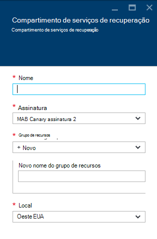
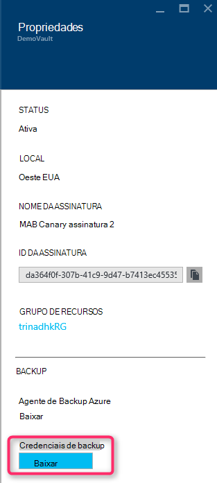

<properties
    pageTitle="Introdução ao backup do Azure DPM | Microsoft Azure"
    description="Uma introdução ao backup dos servidores DPM usando o serviço de Backup do Azure"
    services="backup"
    documentationCenter=""
    authors="Nkolli1"
    manager="shreeshd"
    editor=""
    keywords="System Center Data Protection Manager, Gerenciador de proteção de dados, backup de dpm"/>

<tags
    ms.service="backup"
    ms.workload="storage-backup-recovery"
    ms.tgt_pltfrm="na"
    ms.devlang="na"
    ms.topic="article"
    ms.date="08/08/2016"
    ms.author="trinadhk;giridham;jimpark;markgal;adigan"/>

# Preparando para fazer backup de cargas de trabalho para o Azure com o DPM

> [AZURE.SELECTOR]
- [Servidor de Backup Azure](backup-azure-microsoft-azure-backup.md)
- [SCDPM](backup-azure-dpm-introduction.md)
- [Servidor de Backup Azure (clássico)](backup-azure-microsoft-azure-backup-classic.md)
- [SCDPM (clássico)](backup-azure-dpm-introduction-classic.md)

Este artigo fornece uma introdução ao uso do Microsoft Azure Backup para proteger seus servidores de System Center Data Protection Manager (DPM) e cargas de trabalho. Lendo-lo, você vai compreender:

- Como funciona o backup de servidor DPM do Azure
- Os pré-requisitos para obter uma experiência de backup suave
- Os erros típicos encontrados e como lidar com eles
- Cenários com suporte

> [AZURE.NOTE] Azure tem dois modelos de implantação para criar e trabalhar com recursos: [Gerenciador de recursos e clássico](../resource-manager-deployment-model.md). Este artigo fornece as informações e procedimentos para restaurar VMs implantadas usando o modelo do Gerenciador de recursos.

System Center DPM backup dos dados de arquivos e aplicativos. Dados de backup ao DPM podem ser armazenados em fita, em disco, ou o backup Azure com Backup do Microsoft Azure. DPM interage com o Azure Backup da seguinte maneira:

- **DPM implantado como física servidor ou local máquina virtual** — DPM se for implantado como um servidor físico ou uma máquina virtual de Hyper-V de locais que você pode fazer backup de dados para um cofre de serviços de recuperação além de disco e fita backup.
- **DPM implantado como uma máquina virtual Azure** — do System Center 2012 R2 com atualização 3, DPM pode ser implantado como uma máquina virtual Azure. Se o DPM é implantado como uma máquina virtual Azure que você pode fazer backup de dados para discos Azure anexados à máquina virtual DPM Azure ou você pode descarregar o armazenamento de dados, fazendo-o até um cofre de serviços de recuperação.

## Por que fazer backup do DPM no Azure?

Os benefícios de negócios do uso de Backup do Azure para fazer backup de servidores DPM incluem:

- Para implantação do DPM local, você pode usar o Azure como uma alternativa para implantação de longo prazo em fita.
- Para implantações de DPM no Azure, Azure Backup permite transferir o armazenamento do Azure disco, permitindo que você dimensionar armazenando dados mais antigos no cofre de serviços de recuperação e novos dados no disco.

## Pré-requisitos
Prepare o Backup do Azure para fazer backup de dados do DPM da seguinte maneira:

1. **Criar um cofre de serviços de recuperação** — criar um cofre no portal do Azure.
2. **Credenciais para download cofre** — baixar as credenciais que você usa para registrar o servidor DPM ao Cofre de serviços de recuperação.
3. **Instalar o agente de Backup do Azure** — de Backup Azure, instalar o agente em cada servidor DPM.
4. **Registrar o servidor** — registrar o servidor DPM ao Cofre de serviços de recuperação.

### 1. Crie um cofre de serviços de recuperação
Para criar um cofre de serviços de recuperação:

1. Entrar no [portal do Azure](https://portal.azure.com/).

2. No menu Hub, clique em **Procurar** e na lista de recursos, digite **Os serviços de recuperação**. Conforme você começa a digitar, filtre a lista com base na sua entrada. Clique em **Serviços de recuperação cofre**.

    

    Na lista de serviços de recuperação compartimentos é exibida.

3. No menu **compartimentos de serviços de recuperação** , clique em **Adicionar**.

    

    A lâmina de Cofre de serviços de recuperação é aberta, solicitando que você forneça um **nome**, **assinatura**, **grupo de recursos**e **local**.

    

4. Para **nome**, digite um nome amigável para identificar o cofre. O nome deve ser exclusivo para a assinatura do Azure. Digite um nome que contenha entre 2 e 50 caracteres. Ele deve começar com uma letra e pode conter apenas letras, números e hifens.

5. Clique na **assinatura** para ver a lista de assinaturas disponíveis. Se você não tiver certeza de qual assinatura usar, use o padrão (ou sugeridos) assinatura. Haverá várias opções somente se sua conta organizacional está associada a várias assinaturas Azure.

6. Clique em **grupo de recursos** para ver a lista de grupos de recursos disponíveis, ou clique em **novo** para criar um novo grupo de recursos. Para obter informações completas sobre grupos de recursos, consulte [Visão geral do Gerenciador de recursos do Azure](../azure-resource-manager/resource-group-overview.md)

7. Clique em **local** para selecionar a região geográfica para o cofre.

8. Clique em **criar**. Pode levar alguns instantes para o Cofre de serviços de recuperação a ser criado. Monitore as notificações de status na área superior direita no portal.
Depois que seu cofre é criado, ele abre no portal.

### Replicação de armazenamento de conjunto

A opção de replicação de armazenamento permite que você escolha entre armazenamento geográfica redundante e localmente redundantes. Por padrão, seu cofre tem armazenamento redundante de localização geográfica. Deixe a opção definida como armazenamento geográfica redundante se esta for sua principal de backup. Escolha armazenamento localmente redundante se quiser que uma opção mais barata que não é bastante tão durável. Leia mais sobre [geográfica redundante](../storage/storage-redundancy.md#geo-redundant-storage) e opções de armazenamento [localmente redundantes](../storage/storage-redundancy.md#locally-redundant-storage) na [Visão geral de replicação de armazenamento do Azure](../storage/storage-redundancy.md).

Para editar a configuração de replicação de armazenamento:

1. Selecione seu cofre para abrir o painel Cofre e a lâmina de configurações. Se a lâmina **configurações** não abrir, clique em **todas as configurações** no painel Cofre.

2. Na lâmina **configurações** , clique em **Infraestrutura de Backup** > **Configuração de Backup** para abrir a lâmina de **Configuração de Backup** . Na lâmina **Configuração de Backup** , escolha a opção de replicação de armazenamento para seu cofre.

    

    Depois de escolher a opção de armazenamento de seu cofre, você está pronto para associar a máquina virtual do cofre. Para começar a associação, você deve descobrir e registrar as máquinas virtuais Azure.

### 2. baixar credenciais de cofre

O arquivo de credenciais do cofre é um certificado gerado pelo portal para cada compartimento backup. O portal carrega a chave pública para o serviço de controle de acesso (ACS). A chave privada do certificado é disponibilizada para o usuário como parte do fluxo de trabalho que é fornecido como uma entrada do fluxo de trabalho de registro de máquina. Isso autentica a máquina para enviar dados de backup para um cofre identificado no serviço do Azure Backup.

A credencial cofre é usada somente durante o fluxo de trabalho de registro. É responsabilidade do usuário para garantir que o arquivo de credenciais do Cofre não seja comprometido. Se ela estiver em mãos de qualquer usuário autorizado, o arquivo de credenciais do cofre pode ser usado para registrar outras máquinas contra o mesmo cofre. No entanto, como os dados de backup são criptografados usando uma senha que pertence ao cliente, dados de backup existentes não podem ser comprometidos. Para atenuar esse problema, cofre credenciais são definidas para expirar em 48hrs. Você pode baixar as credenciais do cofre um serviços de recuperação qualquer número de vezes – mas apenas o arquivo mais recente da credencial cofre é aplicável durante o fluxo de trabalho de registro.

O arquivo de credencial cofre é baixado por meio de um canal seguro do portal do Azure. O serviço de Backup do Azure não tem conhecimento da chave privada do certificado e a chave privada não é mantida no portal do ou o serviço. Use as etapas a seguir para baixar o arquivo de credencial do cofre para um computador local.

1. Entrar no [portal do Azure](https://portal.azure.com/).

2. Abrir Cofre de serviços de recuperação ao qual à qual você deseja registrar DPM máquina.

3. Blade configurações abre por padrão. Se ela estiver fechada, clique em **configurações** , em Painel de controle do cofre para abrir a lâmina de configurações. Em lâmina de configurações, clique em **Propriedades**.

    

4. Na página de propriedades, clique em **Download** sob **Credenciais de Backup**. O portal gera o arquivo de credencial cofre, que é disponibilizado para download.

    

O portal gerará uma credencial de cofre usando uma combinação do nome do cofre e a data atual. Clique em **Salvar** para baixar as credenciais do cofre para a pasta de downloads da conta local, ou selecione Salvar como no menu Salvar para especificar um local para as credenciais do cofre. Levará para cima em um minuto para o arquivo a ser gerado.

### Observação
- Certifique-se de que o arquivo de credenciais do cofre é salvo em um local que pode ser acessado do seu computador. Se ele estiver armazenado em um compartilhamento de arquivo/SMB, verifique as permissões de acesso.
- O arquivo de credenciais do cofre é usado somente durante o fluxo de trabalho de registro.
- O arquivo de credenciais do cofre expira após 48hrs e pode ser baixado a partir do portal.

### 3. Instale o agente de Backup

Depois de criar o Cofre de Backup do Azure, um agente deve ser instalado em cada uma das suas máquinas do Windows (Windows Server, cliente Windows, Gerenciador de proteção de dados do System Center server ou máquina de servidor de Backup do Azure) que permite fazer backup de dados e aplicativos para o Azure.

1. Abrir Cofre de serviços de recuperação ao qual à qual você deseja registrar DPM máquina.

2. Blade configurações abre por padrão. Se ela estiver fechada, clique em **configurações** para abrir a lâmina de configurações. Em lâmina de configurações, clique em **Propriedades**.

    

3. Na página Configurações, clique em **Baixar** em **Agente de Backup do Azure**.

    

   Depois que o agente é baixado, clique duas vezes MARSAgentInstaller.exe para iniciar a instalação do agente de Backup do Azure. Escolha a pasta de instalação e a pasta de rascunho necessários para o agente. O local do cache especificado deve ter espaço livre, que é pelo menos 5% dos dados de backup.

4.  Se você usar um servidor proxy para se conectar à internet, na tela de **configuração de Proxy** , insira os detalhes do servidor de proxy. Se você usar um proxy autenticado, insira os detalhes de nome e senha de usuário nesta tela.

5.  O agente de Backup do Azure instala o .NET Framework 4,5 e Windows PowerShell (se ainda não estiver disponível) para concluir a instalação.

6.  Quando o agente estiver instalado, **Fechar** a janela.

    

7. Para **registrar o servidor DPM** ao cofre, na guia **gerenciamento** , clique em **Online**. Em seguida, selecione **registrar**. Ele será aberto o Assistente de configuração registrar.

8. Se você usar um servidor proxy para se conectar à internet, na tela de **configuração de Proxy** , insira os detalhes do servidor de proxy. Se você usar um proxy autenticado, insira os detalhes de nome e senha de usuário nesta tela.

    

9. Na tela de credenciais do cofre, navegue até e selecione o arquivo de credenciais do cofre que foi baixado anteriormente.

    

    O arquivo de credenciais do cofre só é válido para 48 horas (depois de baixado do portal). Se você encontrar qualquer erro na tela (por exemplo, "cofre credenciais de arquivo fornecido expirou"), login para o portal do Azure e as credenciais do cofre novamente o arquivo de download.

    Certifique-se de que o arquivo de credenciais do cofre está disponível em um local que pode ser acessado pelo aplicativo de instalação. Se você encontrar erros relacionados de acesso, copie o arquivo de credenciais do cofre para um local temporário nesta máquina e repita a operação.

    Se você encontrar um erro de credencial Cofre inválido (por exemplo, "Cofre inválido credenciais fornecidas") o arquivo está corrompido ou não tiver as credenciais mais recentes associado com o serviço de recuperação. Repita a operação após fazer o download de um novo arquivo de credencial do cofre a partir do portal. Esse erro geralmente é visto se o usuário clicar na opção de **credencial de Cofre de Download** no portal do Azure, sucessivamente rápida. Nesse caso, somente o segundo arquivo de credencial de cofre é válido.

10. Para controlar o uso da largura de banda de rede durante o trabalho e as horas de trabalho não, na tela de **Configuração de otimização** , você pode definir os limites de uso de largura de banda e definir o trabalho e não-trabalho de horas.

    

11. Na tela de **Configuração de pasta de recuperação** , procure a pasta onde os arquivos baixados do Azure vai ser transferido temporariamente.

    

12. Na tela de **configuração de criptografia** , você pode gerar uma senha ou fornecer uma senha (mínimo de 16 caracteres). Lembre-se de salvar a senha em um local seguro.

    

    > [AZURE.WARNING] Se a senha é perdida ou esquecida; Microsoft não pode ajudar na recuperação de dados de backup. O usuário final possui a senha de criptografia e a Microsoft não tem visibilidade a senha usada pelo usuário final. Salve o arquivo em um local seguro, como ele é necessário durante uma operação de recuperação.

13. Quando você clicar no botão **registrar** , máquina é registrada com êxito para o compartimento e agora você está pronto para iniciar o backup do Microsoft Azure.

14. Ao usar o Gerenciador de proteção de dados, você pode modificar as configurações especificadas durante o fluxo de trabalho de registro clicando na opção de **Configurar** selecionando **Online** sob a guia de **gerenciamento** .

## Requisitos (e limitações)

- DPM pode ser executados como um servidor físico ou uma máquina virtual do Hyper-V instalado no System Center 2012 SP1 ou System Center 2012 R2. Ele também pode estar executando como uma máquina virtual Azure em execução no System Center 2012 R2 pelo menos DPM 2012 R2 cumulativo de atualizações 3 ou um computador de virtual do Windows no VMWare em execução no System Center 2012 R2 pelo menos 5 de Rollup de atualização.
- Se você estiver executando o DPM com System Center 2012 SP1 você deve instalar atualização rolo 2 para System Center Data Protection Manager SP1. Isso é necessário antes de instalar o agente de Backup do Azure.
- O servidor DPM deve ter o Windows PowerShell e .net Framework 4,5 instalado.
- DPM pode fazer backup maioria das cargas de trabalho de Backup do Azure. Para obter uma lista completa do que tem suporte consulte o Backup do Azure suporte itens abaixo.
- Dados armazenados em Backup Azure não podem ser recuperados com a opção "Copiar para fita".
- Você precisará de uma conta do Azure com o recurso de Backup do Azure habilitado. Se você não tiver uma conta, você pode criar uma conta de avaliação gratuita em apenas alguns minutos. Leia sobre [preços do Azure Backup](https://azure.microsoft.com/pricing/details/backup/).
- Usando o Backup do Azure requer o agente de Backup do Azure ser instalado nos servidores que você deseja fazer backup. Cada servidor deve ter pelo menos 5% do tamanho dos dados que está sendo feitos backup, disponível como armazenamento gratuito no local. Por exemplo, fazer backup de 100 GB de dados requer um mínimo de 5 GB de espaço livre no local de rascunho.
- Dados serão armazenados no armazenamento cofre Azure. Não há nenhum limite para a quantidade de dados que você pode voltar até um Backup do Azure cofre, mas o tamanho de uma fonte de dados (por exemplo uma máquina virtual ou um banco de dados) não deve exceder 54400 GB.

Esses tipos de arquivo são suportados para até o Azure:

- Criptografado (somente backups completos)
- Compactado (backups incrementais suportados)
- Dispersos (backups incrementais suportados)
- Compactados e esparsos (tratadas como dispersos)

E eles não têm suportados:

- Servidores nos sistemas de arquivo diferencia maiusculas de minúsculas não têm suporte.
- Links de disco rígido (ignorado)
- Nova análise pontos (ignorado)
- Criptografados e compactados (ignorado)
- Criptografados e esparsos (ignorados)
- Fluxo compactado
- Fluxo esparso

>[AZURE.NOTE] No System Center 2012 DPM com SP1 em diante, você pode fazer backup de cargas de trabalho protegidas pelo DPM no Azure usando o Backup do Microsoft Azure.
