<properties
    pageTitle="Gerenciar e monitorar o Azure máquina virtual backups | Microsoft Azure"
    description="Saiba como gerenciar e monitorar um backups Azure máquina virtual"
    services="backup"
    documentationCenter=""
    authors="trinadhk"
    manager="shreeshd"
    editor=""/>

<tags
    ms.service="backup"
    ms.workload="storage-backup-recovery"
    ms.tgt_pltfrm="na"
    ms.devlang="na"
    ms.topic="article"
    ms.date="08/31/2016"
    ms.author="trinadhk; jimpark; markgal;"/>

# <a name="manage-and-monitor-azure-virtual-machine-backups"></a>Gerenciar e monitorar o Azure máquina virtual backups

> [AZURE.SELECTOR]
- [Gerenciar backups de máquina virtual do Azure](backup-azure-manage-vms.md)
- [Gerenciar backups de máquina virtual clássico](backup-azure-manage-vms-classic.md)

Este artigo fornece informações sobre gerenciamento comum e tarefas de monitoramento para máquinas virtuais de modelo clássico protegidas no Azure.  

>[AZURE.NOTE] Azure tem dois modelos de implantação para criar e trabalhar com recursos: [Gerenciador de recursos e clássico](../resource-manager-deployment-model.md). Consulte [preparar seu ambiente backup Azure máquinas virtuais](backup-azure-vms-prepare.md) para obter detalhes sobre como trabalhar com o modelo de implantação de clássico VMs.

## <a name="manage-protected-virtual-machines"></a>Gerenciar protegidas máquinas virtuais

Gerenciar protegido máquinas virtuais:

1. Para exibir e gerenciar configurações de backup para uma máquina virtual clique na guia **Itens protegidos** .

2. Clique no nome de um item protegido para ver a guia **Detalhes do Backup** , que mostra informações sobre o último backup.

    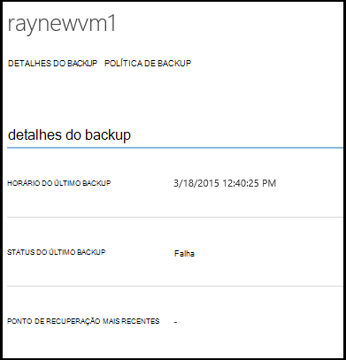

3. Para exibir e gerenciar política de backup configurações para uma máquina virtual clique na guia **políticas** .

    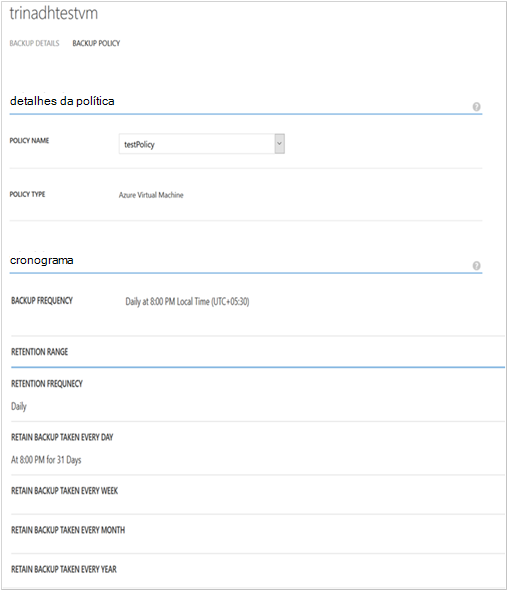

    A guia **Políticas de Backup** mostra a política existente. Você pode modificar conforme necessário. Se você precisa criar uma nova política clique em **criar** na página **políticas** . Observe que, se você quiser remover uma política de ele não deve ter qualquer máquinas virtuais associadas a ele.

    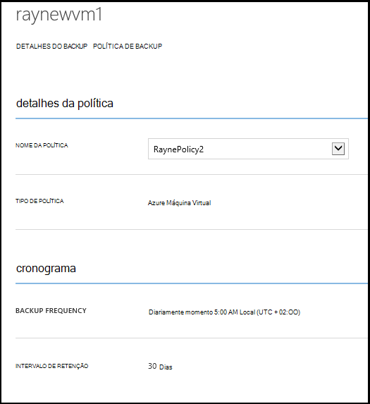

4. Você pode obter mais informações sobre ações ou status para uma máquina virtual na página de **trabalhos** . Clique em um trabalho na lista para obter mais detalhes ou filtrar trabalhos para uma máquina virtual específica.

    

## <a name="on-demand-backup-of-a-virtual-machine"></a>Backup por demanda de uma máquina virtual
Você pode levar uma sob demanda backup de uma máquina virtual depois que ela estiver configurada para proteção. Se o backup inicial está pendente para a máquina virtual, sob demanda backup criará uma cópia completa da máquina virtual no Azure cofre backup. Se primeiro backup for concluído, sob demanda backup será somente as alterações de envio do backup anterior para backup Azure cofre ou seja, ele é sempre incremental.

>[AZURE.NOTE] Intervalo de retenção de um backup sob demanda está definido como o valor de retenção especificado para retenção diária na política de backup correspondente para a máquina virtual.  

Para fazer backup de uma máquina virtual uma sob demanda:

1. Navegue até a página de **Itens protegido** selecione **Azure Virtual Machine** como **tipo** (se ainda não estiver selecionada) e clique no botão **Selecionar** .

    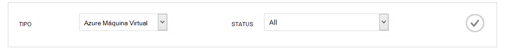

2. Selecione a máquina virtual no qual você deseja tirar uma sob demanda backup e clique no botão **Backup agora** na parte inferior da página.

    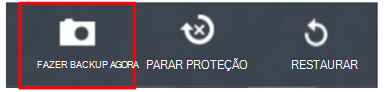

    Isso criará um trabalho de backup na máquina virtual selecionada. Intervalo de retenção de ponto de recuperação criado por meio deste trabalho será o mesmo que o especificado na política associada com a máquina virtual.

    

    >[AZURE.NOTE] Para exibir a política associada com uma máquina virtual, fazer busca detalhada em máquina virtual na página **Itens protegidos** e vá para a guia Diretiva de backup.

3. Depois que o trabalho é criado, você pode clicar no botão **Exibir trabalho** na barra de sistema para ver o trabalho correspondente na página de trabalhos.

    

4. Após a conclusão bem-sucedida do trabalho, um ponto de recuperação será criado que você pode usar para restaurar a máquina virtual. Isso também será incrementado o valor de coluna do ponto de recuperação por 1 na página de **Itens protegidos** .

## <a name="stop-protecting-virtual-machines"></a>Parar proteção de máquinas virtuais
Você pode optar por parar os backups futuros de uma máquina virtual com as seguintes opções:

- Reter dados de backup associados a máquina virtual no cofre Backup do Azure
- Excluir dados de backup associados máquina virtual

Se você tiver selecionado para reter dados de backup associados a máquina virtual, você pode usar os dados de backup para restaurar a máquina virtual. Para preços detalhes de tais máquinas virtuais, clique [aqui](https://azure.microsoft.com/pricing/details/backup/).

Para parar proteção para uma máquina virtual:

1. Navegue até a página de **Itens protegidos** e selecione **Azure máquina virtual** como o tipo de filtro (se ainda não estiver selecionada) e clique no botão **Selecionar** .

    

2. Selecione a máquina virtual e clique em **Parar proteção** na parte inferior da página.

    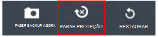

3. Por padrão, Azure Backup não exclui os dados de backup associados a máquina virtual.

    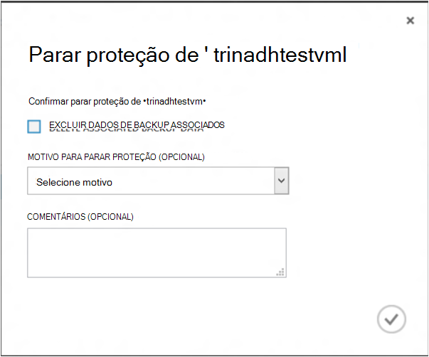

    Se você quiser excluir dados de backup, marque a caixa de seleção.

    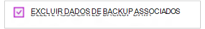

    Selecione um motivo para parar o backup. Enquanto isso é opcional, fornecer um motivo ajudará Backup do Azure para trabalhar no comentário e priorizar os cenários de cliente.

4. Clique no botão **Enviar** para enviar o trabalho **Parar proteção** . Clique em **Exibir trabalho** para ver o trabalho na página **trabalhos** correspondente.

    

    Se você não tiver selecionado a opção **Excluir dados de backup associados** durante **Parar proteção** assistente, em seguida, postar a conclusão do trabalho, o status de proteção muda para **Proteção interrompido**. Os dados permanecem com Backup Azure até que seja explicitamente excluída. Você sempre pode excluir os dados selecionando a máquina virtual na página **Itens protegidos** e clicando em **Excluir**.

    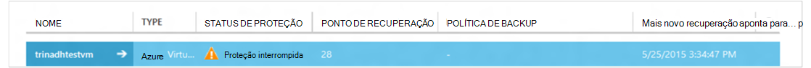

    Se você tiver selecionado a opção **Excluir dados de backup associados** , a máquina virtual não será parte da página **Itens protegidos** .

## <a name="re-protect-virtual-machine"></a>Proteger novamente Máquina Virtual
Se você não tiver selecionado a opção **Excluir dados de backup associados** em **Parar proteção**, você pode proteger novamente a máquina virtual seguindo as etapas semelhantes a backup registradas máquinas virtuais. Depois de protegida, esta máquina virtual terá mantidos antes de proteção de dados de backup e pontos de recuperação criadas após novamente protege.

Após proteger novamente, o status de proteção da máquina virtual será alterado para **protegido** se houver pontos de recuperação antes de **Parar proteção**.

  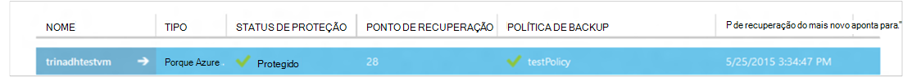

>[AZURE.NOTE] Quando protegendo novamente a máquina virtual, você pode escolher uma política diferente do que a política com a qual máquina virtual foi protegida inicialmente.

## <a name="unregister-virtual-machines"></a>Cancelar o registro máquinas virtuais

Se você quiser remover máquina virtual do Cofre de backup:

1. Clique no botão **Cancelar registro** na parte inferior da página.

    

    Uma notificação do sistema aparecerá na parte inferior da tela solicitando confirmação. Clique em **Sim** para continuar.

    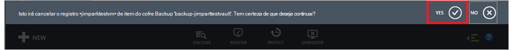

## <a name="delete-backup-data"></a>Excluir dados de Backup
Você pode excluir os dados de backup associados a uma máquina virtual, ou:

- Durante o trabalho de proteção de parada
- Após a proteção uma parada de trabalho é concluído em uma máquina virtual

Para excluir os dados de backup em uma máquina virtual, que está no estado *Interrompido proteção* postam conclusão bem-sucedida de um trabalho de **Backup parar** :

1. Navegue até a página de **Itens protegidos** e selecione **máquina de Virtual do Azure** como *tipo* e clique no botão **Selecionar** .

    

2. Selecione a máquina virtual. A máquina virtual será em estado de **Proteção interrompido** .

    

3. Clique no botão **Excluir** na parte inferior da página.

    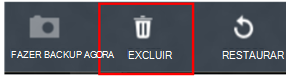

4. No Assistente de **Excluir dados de backup** , selecione um motivo para a exclusão de dados de backup (altamente recomendados) e clique em **Enviar**.

    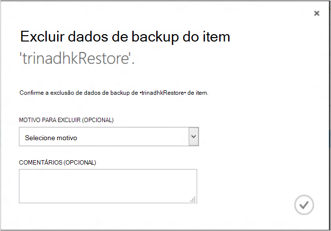

5. Isso criará um trabalho para excluir dados de backup da máquina virtual selecionada. Clique em **Exibir trabalho** para ver o trabalho correspondente na página de trabalhos.

    

    Depois que o trabalho é concluído, a entrada correspondente na máquina virtual será removida da página **protegido itens** .

## <a name="dashboard"></a>Painel de controle
Na página do **painel** , você pode examinar informações sobre Azure máquinas virtuais, armazenamento e trabalhos associados a elas nas últimas 24 horas. Você pode exibir o status de backup e quaisquer erros de backup associados.

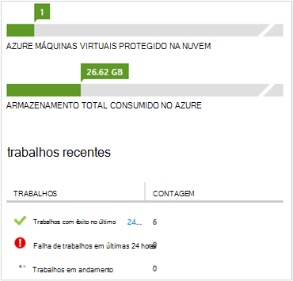

>[AZURE.NOTE] Os valores no painel são atualizados uma vez a cada 24 horas.

## <a name="auditing-operations"></a>Operações de auditoria
Backup Azure fornece revisão dos "operação logs de" das operações de backup disparada pelo cliente tornando mais fácil ver exatamente quais operações de gerenciamento foram executadas em Cofre de backup. Logs de operações habilitar post-mortem excelente e suporte para operações de backup de auditoria.

As seguintes operações são registradas em logs de operação:

- Registrar
- Cancelar o registro
- Configurar a proteção
- Backup (ambos agendados, além de backup de sob demanda por meio de BackupNow)
- Restaurar
- Parar proteção
- Excluir dados de backup
- Adicionar política
- Excluir diretiva
- Política de atualização
- Cancelar trabalho

Para exibir logs de operação correspondente a um backup cofre:

1. Navegue até **Serviços de gerenciamento** no portal do Azure e, em seguida, clique na guia **Logs de operação** .

    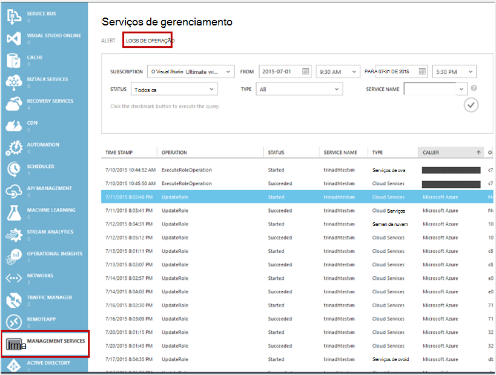

2. Em filtros, selecione **Backup** como *tipo* e especifique o nome do cofre backup em *nome do serviço* e clique em **Enviar**.

    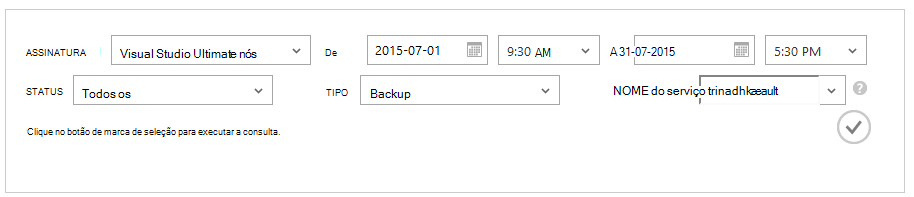

3. Em logs de operações, selecione qualquer operação e clique em **detalhes** para ver detalhes correspondente a uma operação.

    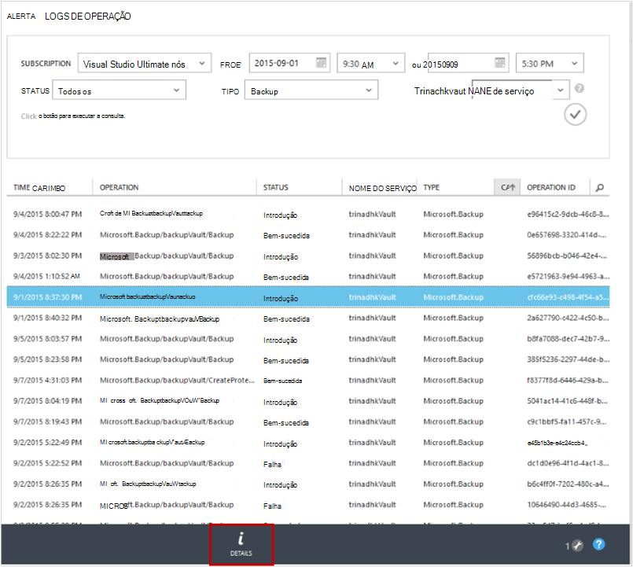

    O **Assistente detalhes** contém informações sobre a operação disparada, trabalho Id, em que esta operação for disparada, recursos e iniciar o tempo da operação.

    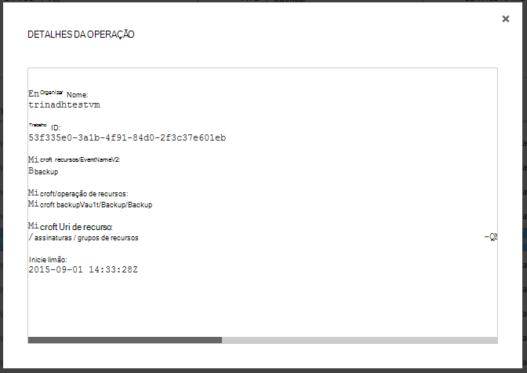

## <a name="alert-notifications"></a>Notificações de alerta
Você pode obter notificações de alerta personalizadas para os trabalhos no portal. Isso é feito definindo regras de alerta baseada no PowerShell em eventos de logs operacionais. Recomendamos o uso *PowerShell versão 1.3.0 ou superior*.

Para definir uma notificação personalizada para o alerta para falhas de backup, um comando de exemplo será parecida com:

```
PS C:\> $actionEmail = New-AzureRmAlertRuleEmail -CustomEmail contoso@microsoft.com
PS C:\> Add-AzureRmLogAlertRule -Name backupFailedAlert -Location "East US" -ResourceGroup RecoveryServices-DP2RCXUGWS3MLJF4LKPI3A3OMJ2DI4SRJK6HIJH22HFIHZVVELRQ-East-US -OperationName Microsoft.Backup/backupVault/Backup -Status Failed -TargetResourceId /subscriptions/86eeac34-eth9a-4de3-84db-7a27d121967e/resourceGroups/RecoveryServices-DP2RCXUGWS3MLJF4LKPI3A3OMJ2DI4SRJK6HIJH22HFIHZVVELRQ-East-US/providers/microsoft.backupbvtd2/BackupVault/trinadhVault -Actions $actionEmail
```

**Identificação de recurso**: você pode obter isso de pop-up Logs de operações, conforme descrito acima seção. ResourceUri na janela pop-up de detalhes de uma operação é a identificação de recurso deve ser fornecido para esse cmdlet.

**OperationName**: esta será do formato "Microsoft.Backup/backupvault/<EventName>" onde EventName um registro, cancela o registro, ConfigureProtection, fazer Backup, restaurar, StopProtection, DeleteBackupData, CreateProtectionPolicy, DeleteProtectionPolicy, UpdateProtectionPolicy

**Status**: suporte para valores são-iniciado, de êxito e falha.

**ResourceGroup**: ResourceGroup do recurso no qual operação seja acionada. Você pode obter isso de valor de identificação de recurso. Valor entre campos */resourceGroups/* e */providers/* no valor ResourceId é o valor para ResourceGroup.

**Nome**: nome da regra de alerta.

**CustomEmail**: especificar o endereço de email personalizado ao qual você deseja enviar a notificação de alerta

**SendToServiceOwners**: esta opção envia uma notificação de alerta para todos os administradores e colaboradores da assinatura. Pode ser usado em cmdlet **New-AzureRmAlertRuleEmail**

### <a name="limitations-on-alerts"></a>Limitações de alertas
Alertas baseados em eventos estão sujeitos às seguintes limitações:

1. Alertas são disparadas em todas as máquinas virtuais no cofre de backup. Você não pode personalizá-lo para receber alertas de um conjunto específico de máquinas virtuais em um backup cofre.
2. Este recurso está no modo de visualização. [Saiba Mais](../monitoring-and-diagnostics/insights-powershell-samples.md#create-alert-rules)
3. Você receberá alertas do "alerts-noreply@mail.windowsazure.com". Atualmente, você não pode modificar o remetente de email.

## <a name="next-steps"></a>Próximas etapas

- [Restaurar VMs Azure](backup-azure-restore-vms.md)
