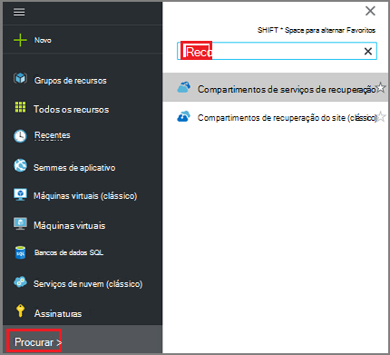
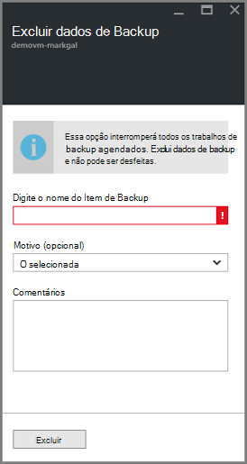

<properties
    pageTitle="Gerenciar backups implantado Gerenciador de recursos de máquina virtual | Microsoft Azure"
    description="Saiba como gerenciar e monitorar backups implantado Gerenciador de recursos de máquina virtual"
    services="backup"
    documentationCenter=""
    authors="trinadhk"
    manager="shreeshd"
    editor=""/>

<tags
    ms.service="backup"
    ms.workload="storage-backup-recovery"
    ms.tgt_pltfrm="na"
    ms.devlang="na"
    ms.topic="article"
    ms.date="08/11/2016"
    ms.author="jimpark; markgal; trinadhk"/>

# Gerenciar backups Azure máquina virtual

> [AZURE.SELECTOR]
- [Gerenciar backups de máquina virtual do Azure](backup-azure-manage-vms.md)
- [Gerenciar backups de máquina virtual clássico](backup-azure-manage-vms-classic.md)

Este artigo fornece orientação sobre gerenciamento de backups de máquina virtual e explica as informações de backup alertas disponíveis no painel de portal. As orientações neste artigo se aplica ao uso VMs com compartimentos de serviços de recuperação. Este artigo não aborda a criação de máquinas virtuais, nem-explicam como proteger máquinas virtuais. Para uma introdução sobre como proteger o Gerenciador de recursos do Azure implantado VMs no Azure com um cofre de serviços de recuperação, consulte [primeiro ver: fazer backup de VMs a um cofre de serviços de recuperação](backup-azure-vms-first-look-arm.md).

## Gerenciar compartimentos e máquinas virtuais protegidas

No portal do Azure, o painel de Cofre de serviços de recuperação fornece acesso às informações sobre o cofre, incluindo:

- o instantâneo de backup mais recente, que também é o ponto de restauração mais recente < br\>
- a política de backup < br\>
- tamanho de todos os instantâneos backup total < br\>
- número de máquinas virtuais que são protegidas com o Cofre < br\>

Muitas tarefas de gerenciamento com um backup de máquina virtual começam com abrindo o cofre no painel de controle. No entanto, porque compartimentos podem ser usados para proteger vários itens (ou várias VMs) para exibir detalhes sobre uma máquina virtual específica, abra o painel de item do cofre. O procedimento a seguir mostra como abrir o *Painel de controle do cofre* e vá para o *Painel de item do cofre*. Existem "dicas" em ambos os procedimentos que destacam como adicionar o cofre e cofre item ao painel Azure usando o Pin para comando de painel. Fixar no dashboard é uma maneira de criar um atalho para o cofre ou o item. Você também pode executar comandos comuns de um atalho.

>[AZURE.TIP] Se você tiver vários painéis e lâminas abrir, use o seletor de escuro-azul na parte inferior da janela para o slide no painel Azure trocadas.

### Abra um cofre de serviços de recuperação no painel de controle:

1. Entrar no [portal do Azure](https://portal.azure.com/).

2. No menu Hub, clique em **Procurar** e na lista de recursos, digite **Os serviços de recuperação**. Conforme você começa a digitar, os filtros de lista com base na sua entrada. Clique em **Serviços de recuperação cofre**.

      

    A lista de serviços de recuperação compartimentos são exibidos.

      

    >[AZURE.TIP] Se você fixar um cofre ao painel Azure, que cofre é acessível imediatamente quando você abrir o portal do Azure. Para fixar um cofre ao painel, na lista de cofre, o Cofre de atalho e, em seguida, selecione **Fixar no painel de controle**.

3. Na lista de compartimentos, selecione o cofre para abrir seu painel. Quando você seleciona o cofre, no painel de compartimento e o blade de **configurações de** abrem. Na imagem a seguir, no painel de **Contoso-cofre** é realçado.

    

### Abrir um painel de item de compartimento

No procedimento anterior é aberto no painel do cofre. Para abrir o painel de item do cofre:

1. No painel Cofre, no bloco **Itens de Backup** , clique em **máquinas virtuais do Azure**.

    

    A lâmina de **Itens de Backup** lista o último trabalho de backup para cada item. Neste exemplo, há uma máquina virtual, demovm-markgal, protegida por cofre.  

    

    >[AZURE.TIP] Para facilidade de acesso, você pode fixar um item de compartimento ao painel Azure. Para fixar um item de cofre, na lista de itens cofre, clique com botão direito no item e selecione **Fixar no painel de controle**.

2. Na lâmina **Itens de Backup** , clique no item para abrir o painel de item do cofre.

    

    No painel de item de compartimento e blade suas **configurações de** abrir.

    

    No painel de item de cofre, você pode realizar várias tarefas de gerenciamento de chaves, tais como:

    - alterar políticas ou criar uma nova política de backup < br\>
    - Exibir pontos de restauração e ver seu estado de consistência < br\>
    - backup por demanda de uma máquina virtual < br\>
    - Parar proteção de máquinas virtuais < br\>
    - retomar a proteção de uma máquina virtual < br\>
    - Excluir um dados de backup (ou o ponto de recuperação) < br\>
    - [restaurar um backup (ou o ponto de recuperação)](./backup-azure-arm-restore-vms.md#restore-a-recovery-point) < br\>

Para os procedimentos a seguir, o ponto de partida é o painel de item do cofre.

## Gerenciar políticas de backup

1. No [Painel de controle do cofre item](backup-azure-manage-vms.md#open-a-vault-item-dashboard), clique em **Todas as configurações** para abrir a lâmina de **configurações** .

    

2. Na lâmina **configurações** , clique em **política de Backup** para abrir essa lâmina.

    Na lâmina, os detalhes de intervalo de frequência e retenção de backup são mostrados.

    

3. No menu de **Escolha Política de backup** :
    - Para alterar políticas, selecione uma política diferente e clique em **Salvar**. A nova política é aplicada imediatamente ao cofre. < br\>
    - Para criar uma política, selecione **Criar novo**.

    

    Para obter instruções sobre como criar uma política de backup, consulte [definindo uma política de backup](backup-azure-manage-vms.md#defining-a-backup-policy).

[AZURE.INCLUDE [backup-create-backup-policy-for-vm](../../includes/backup-create-backup-policy-for-vm.md)]

## Backup por demanda de uma máquina virtual
Você pode levar uma sob demanda backup de uma máquina virtual depois que ela estiver configurada para proteção. Se o backup inicial está pendente, o backup por demanda cria uma cópia completa da máquina virtual no cofre de serviços de recuperação. Se o backup inicial for concluído, um backup sob demanda somente enviará alterações do instantâneo anterior, ao Cofre de serviços de recuperação. Isto é, backups subsequentes são sempre incrementais.

>[AZURE.NOTE] O intervalo de retenção para um backup sob demanda é o valor de retenção especificado para o ponto de backup diário na política. Se nenhum ponto de backup diário estiver selecionado, o ponto de backup semanal é usado.

Disparar um backup sob demanda de uma máquina virtual:

- No [Painel de controle do cofre item](backup-azure-manage-vms.md#open-a-vault-item-dashboard), clique em **Backup agora**.

    

    O portal garante que você deseja iniciar um trabalho de backup sob demanda. Clique em **Sim** para iniciar o trabalho de backup.

    

    O trabalho de backup cria um ponto de recuperação. O intervalo de retenção de ponto de recuperação é o mesmo intervalo de retenção especificado na política associada com a máquina virtual. Para controlar o andamento do trabalho, no painel Cofre, clique no bloco de **Trabalhos de Backup** .  

## Parar proteção de máquinas virtuais
Se você optar por parar a proteção de uma máquina virtual, você será solicitado se deseja manter os pontos de recuperação. Há duas maneiras de parar proteção de máquinas virtuais:
- interromper todos os trabalhos de backup futuros e excluir todos os pontos de recuperação, ou
- parar todos os trabalhos de backup futuros, mas deixe os pontos de recuperação  

Há um custo associado deixando os pontos de recuperação no armazenamento. No entanto, o benefício de deixando os pontos de recuperação é que você pode restaurar a máquina virtual mais tarde, se desejar. Para obter informações sobre o custo deixando os pontos de recuperação, consulte os [detalhes de preços](https://azure.microsoft.com/pricing/details/backup/). Se você optar por excluir todos os pontos de recuperação, é possível restaurar a máquina virtual.

Para parar proteção para uma máquina virtual:

1. No [Painel de controle do cofre item](backup-azure-manage-vms.md#open-a-vault-item-dashboard), clique em **Parar backup**.

    

    Abre a lâmina parar Backup.

    

2. Na lâmina **Parar Backup** , escolha se deseja manter ou excluir os dados de backup. Caixa de informações fornece detalhes sobre sua escolha.

    

3. Se você optar por manter os dados de backup, vá para a etapa 4. Se você optar por excluir dados de backup, confirme que você deseja interromper os trabalhos de backup e excluir os pontos de recuperação - digite o nome do item.

    

    Se você não tiver certeza do nome do item, passe o mouse sobre o ponto de exclamação para exibir o nome. Além disso, o nome do item é em **Backup parar** na parte superior da lâmina.

4. Opcionalmente, fornece um **motivo** ou um **comentário**.

5. Para interromper o trabalho de backup para o item atual, clique em  

    Uma mensagem de notificação informa que os trabalhos de backup interromperam.

    

## Proteção de uma máquina virtual de currículo
Se a opção de **Manter dados de Backup** foi escolhida quando proteção para a máquina virtual parou, é possível continuar a proteção. Se a opção **Excluir dados de Backup** foi escolhida, proteção para a máquina virtual não pode continuar.

Para continuar a proteção para a máquina virtual

1. No [Painel de controle do cofre item](backup-azure-manage-vms.md#open-a-vault-item-dashboard), clique em **continuar backup**.

    

    Abre a lâmina de política de Backup.

    >[AZURE.NOTE] Quando protegendo novamente a máquina virtual, você pode escolher uma política diferente do que a política com a qual máquina virtual foi protegida inicialmente.

2. Siga as etapas em [políticas de alteração ou criar uma nova política de backup](backup-azure-manage-vms.md#change-policies-or-create-a-new-backup-policy), para atribuir a diretiva da máquina virtual.

    Depois que a política de backup é aplicada na máquina virtual, verá a seguinte mensagem.

    

## Excluir dados de Backup
Você pode excluir os dados de backup associados a uma máquina virtual durante o trabalho **Parar backup** ou a qualquer momento após o backup do trabalho concluído. Pode ser até vantajoso aguardar dias ou semanas antes de excluir os pontos de recuperação. Ao contrário de restaurando pontos de recuperação, ao excluir dados de backup, você não pode escolher pontos de recuperação específicas para excluir. Se você optar por excluir seus dados de backup, você pode excluir todos os pontos de recuperação associados ao item.

O procedimento a seguir pressupõe o trabalho de Backup da máquina virtual foi interrompido ou desabilitado. Depois que o trabalho de Backup estiver desabilitado, as opções de **backup de currículo** e **Excluir backup** estão disponíveis no painel de item cofre.

Para excluir dados de backup em uma máquina virtual com o *Backup desativado*:

1. No [Painel de controle do cofre item](backup-azure-manage-vms.md#open-a-vault-item-dashboard), clique em **Excluir backup**.

    

    Abre a lâmina de **Excluir dados de Backup** .

    

2. Digite o nome do item para confirmar que você deseja excluir os pontos de recuperação.

    

    Se você não tiver certeza do nome do item, passe o mouse sobre o ponto de exclamação para exibir o nome. Além disso, o nome do item é em **Excluir dados de Backup** na parte superior da lâmina.

3. Opcionalmente, fornece um **motivo** ou um **comentário**.

4. Para excluir os dados de backup para o item atual, clique em  

    Uma mensagem de notificação informa que os dados de backup foi excluídos.

## Próximas etapas

Para obter informações sobre como recriar uma máquina virtual de um ponto de recuperação, confira [Restaurar VMs do Azure](backup-azure-restore-vms.md). Se precisar de informações sobre como proteger suas máquinas virtuais, consulte [primeiro ver: fazer backup de VMs a um cofre de serviços de recuperação](backup-azure-vms-first-look-arm.md). Para obter informações sobre eventos de monitoramento, consulte [alertas de Monitor backups Azure máquina virtual](backup-azure-monitor-vms.md).
