<properties
    pageTitle="Gerenciar servidores Azure usando o modelo clássico de implantação e compartimentos de Backup do Azure | Microsoft Azure"
    description="Use este tutorial para saber como gerenciar compartimentos de Backup do Azure e servidores."
    services="backup"
    documentationCenter=""
    authors="markgalioto"
    manager="jwhit"
    editor="tysonn"/>

<tags
    ms.service="backup"
    ms.workload="storage-backup-recovery"
    ms.tgt_pltfrm="na"
    ms.devlang="na"
    ms.topic="article"
    ms.date="09/27/2016"
    ms.author="jimpark;markgal"/>

# Gerenciar servidores usando o modelo clássico de implantação e compartimentos de Backup do Azure

> [AZURE.SELECTOR]
- [Gerenciador de recursos](backup-azure-manage-windows-server.md)
- [Clássico](backup-azure-manage-windows-server-classic.md)

Neste artigo, você encontrará uma visão geral das tarefas de gerenciamento de backup disponíveis por meio do portal de clássico do Azure e o agente de Backup do Microsoft Azure.

[AZURE.INCLUDE [learn-about-deployment-models](../../includes/learn-about-deployment-models-classic-include.md)]Modelo de implantação do Gerenciador de recursos.

## Tarefas de gerenciamento de portal
1. Entre [Portal de gerenciamento](https://manage.windowsazure.com).

2. Clique em **Serviços de recuperação**, clique no nome do cofre backup para exibir a página de início rápido.

    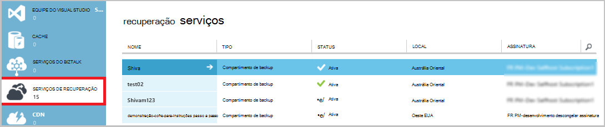

Selecionando as opções na parte superior da página de início rápido, você pode ver as tarefas de gerenciamento disponíveis.

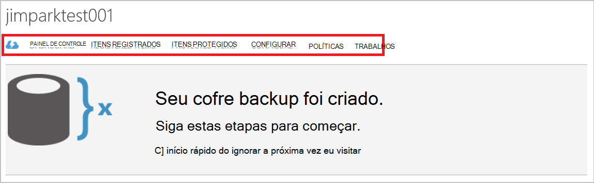

### Painel de controle
Selecione **Painel de controle** para ver a visão geral de uso para o servidor. Inclui a **Visão geral de uso** :

- O número de servidores Windows registrado na nuvem
- O número de Azure máquinas virtuais protegido na nuvem
- O armazenamento total consumido no Azure
- O status de trabalhos recentes

Na parte inferior do painel, você pode executar as seguintes tarefas:

- **Gerenciar certificado** - se um certificado foi usado para registrar o servidor, em seguida, use essa opção para atualizar o certificado. Se você estiver usando credenciais de cofre, não use **Gerenciar certificado**.
- **Excluir** - exclui o Cofre de backup atual. Se já não estiver sendo usado um cofre backup, você poderá excluí-lo para liberar espaço de armazenamento. **Excluir** é ativado somente depois que todos os servidores registrados forem excluídos do cofre.

## Itens registrados
Selecione **Itens registrados** para exibir os nomes dos servidores que são registrados para este cofre.

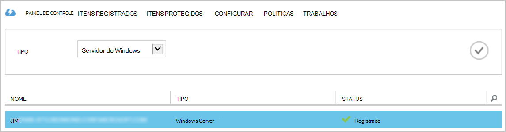

Os padrões de filtro de **tipo** de máquina Virtual do Azure. Para exibir os nomes dos servidores que são registrados para este cofre, selecione **Windows server** no menu suspenso.

A partir daqui, você pode executar as seguintes tarefas:

- **Permitir Re-registro** - quando essa opção está selecionada para um servidor você pode usar o **Assistente de registro** no agente do Microsoft Azure Backup local para registrar o servidor com o backup cofre uma segunda vez. Talvez você precise registrar novamente devido a um erro no certificado ou se um servidor tinha recriado.
- **Excluir** - exclui um servidor do Cofre de backup. Todos os dados armazenados associados ao servidor é excluído imediatamente.

    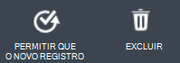

## Itens protegidos
Selecione **Itens protegido** para exibir os itens que tem sido feito o backup dos servidores.

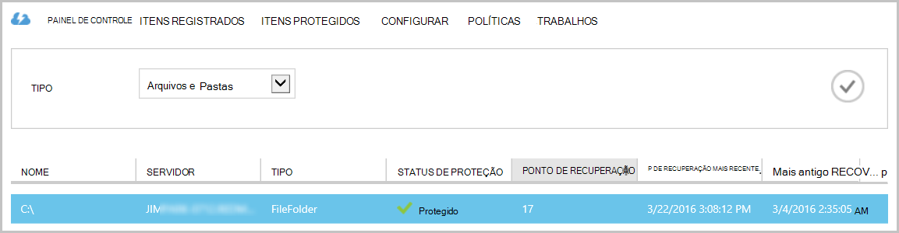

## Configurar

Na guia **Configurar** , você pode selecionar a opção de redundância de armazenamento apropriado. O melhor horário para selecionar a opção de redundância de armazenamento é certo depois de criar um cofre e antes de qualquer máquinas são registradas para ele.

>[AZURE.WARNING] Depois que um item tiver sido registrado ao cofre, a opção de redundância de armazenamento está bloqueada e não pode ser modificada.

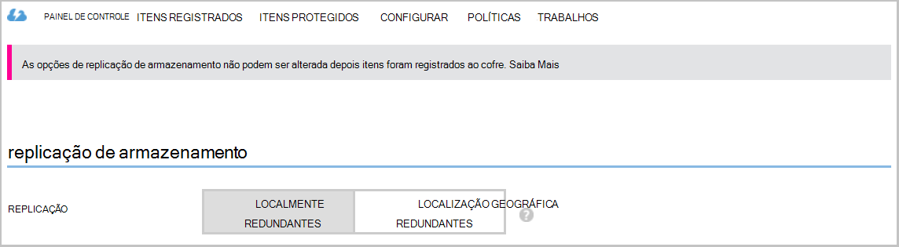

Consulte este artigo para obter mais informações sobre [redundância de armazenamento](../storage/storage-redundancy.md).

## Tarefas do agente de Backup do Microsoft Azure

### Console

Abra o **agente de Backup do Microsoft Azure** (você pode encontrá-lo, pesquisando sua máquina *Microsoft Azure Backup*).

Você pode executar as seguintes tarefas de gerenciamento das **ações** disponíveis na parte direita do console do agente de backup:

- Registrar servidor
- Agendar Backup
- Fazer backup agora
- Alterar propriedades

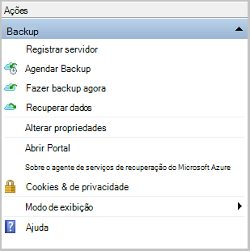

>[AZURE.NOTE] Para **Recuperar dados**, consulte [restaurar os arquivos em um Windows server ou máquina de cliente do Windows](backup-azure-restore-windows-server.md).

### Modificar um backup existente

1. No agente do Microsoft Azure Backup, clique em **Agendar Backup**.

    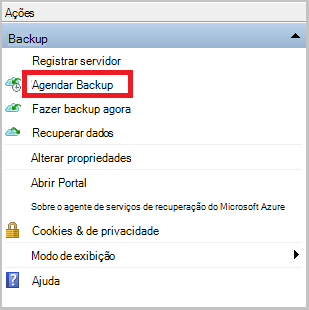

2. No **Assistente de agendamento de Backup** , deixe a opção de **fazer alterações para itens de backup ou horas** selecionada e clique em **Avançar**.

    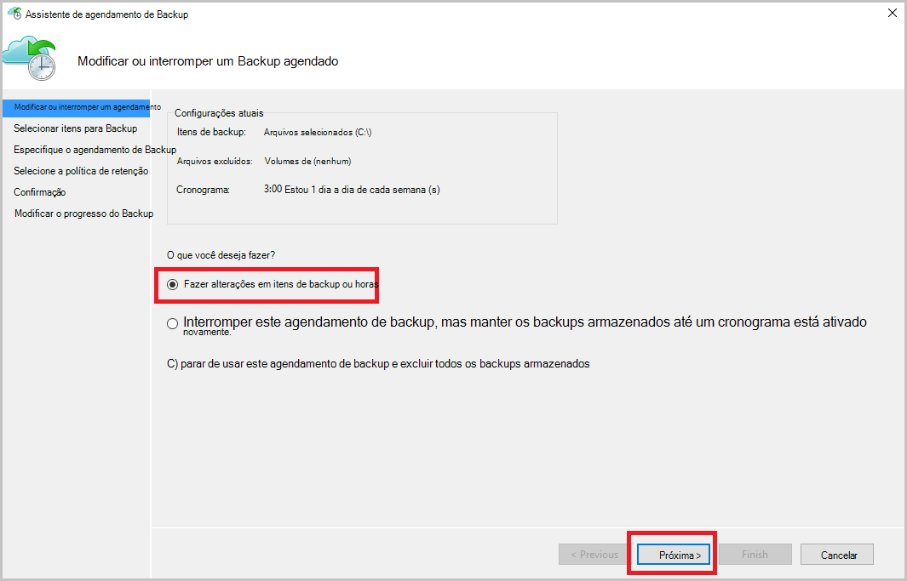

3. Se você quiser adicionar ou alterar itens, na tela **Selecionar itens para Backup** , clique em **Adicionar itens**.

    Você também pode definir **Configurações de exclusão** desta página do assistente. Se você deseja excluir arquivos ou tipos de arquivo Leia o procedimento para adicionar [configurações de exclusão](#exclusion-settings).

4. Selecione os arquivos e pastas que você deseja fazer backup e clique em **Okey**.

    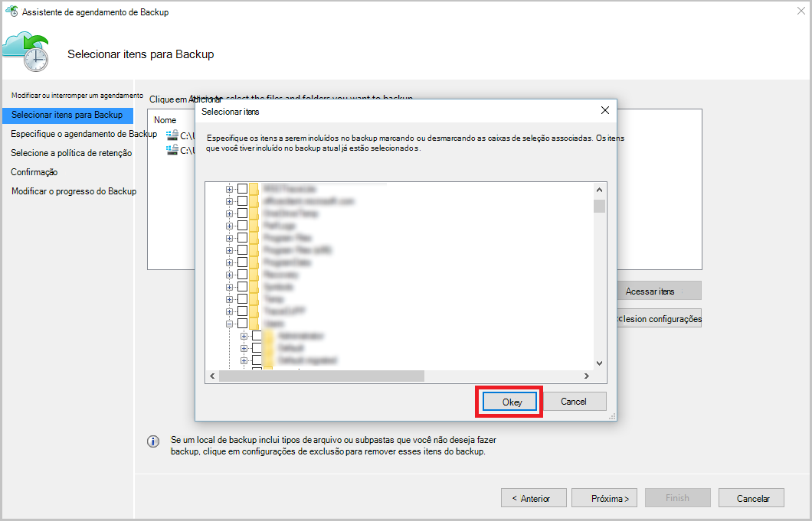

5. Especifique o **agendamento de backup** e clique em **Avançar**.

    Você pode programar backups semanais ou diária (no máximo 3 vezes por dia).

    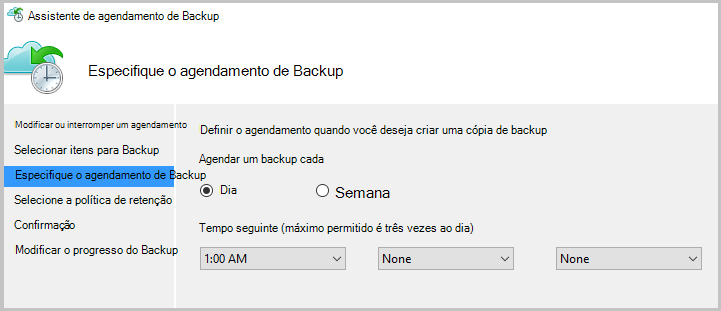

    >[AZURE.NOTE] Especifica o agendamento de backup é explicado em detalhes neste [artigo](backup-azure-backup-cloud-as-tape.md).

6. Selecione a **Política de retenção** para a cópia de backup e clique em **Avançar**.

    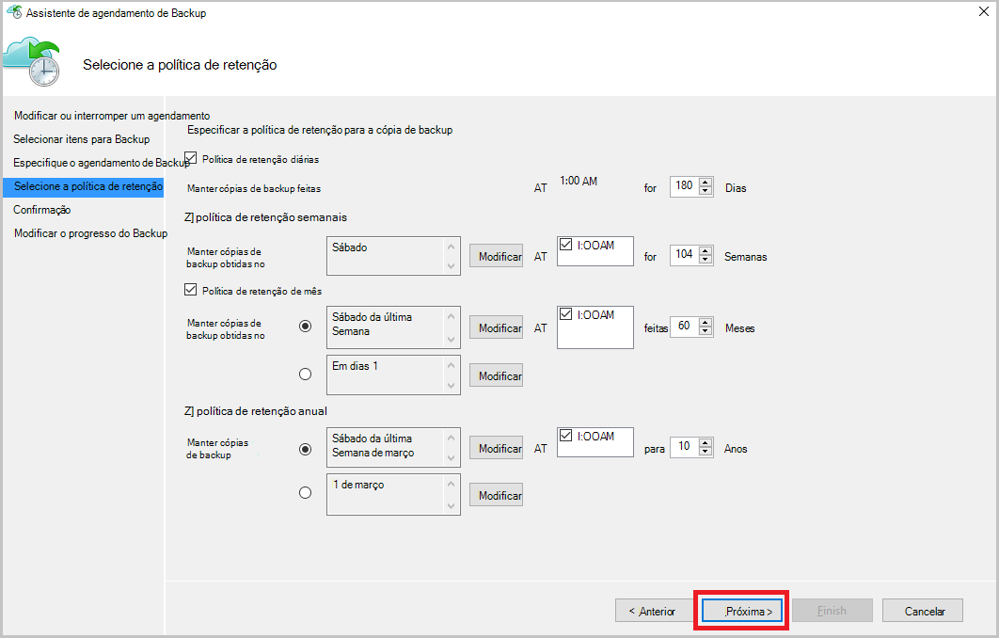

7. Na tela de **confirmação** , examine as informações e clique em **Concluir**.

8. Depois que o assistente terminar de criar a **agenda de backup**, clique em **Fechar**.

    Depois de modificar a proteção, você pode confirmar que backups são disparo corretamente indo para a guia **trabalhos** e confirmando que as alterações sejam refletidas no trabalhos de backup.

### Habilitar a otimização de rede  
O agente de Backup do Azure fornece uma guia Throttling que permite que você controle como a largura de banda de rede é usada durante a transferência de dados. Este controle pode ser útil se você precisar fazer backup de dados durante horas de trabalho, mas não quiser que o processo de backup interfira com outro tráfego de internet. Transferência de otimização de dados aplica para fazer backup e restaurar atividades.  

Para habilitar a otimização:

1. O **agente de Backup**, clique em **Alterar propriedades**.

2. Selecione a caixa de seleção **Habilitar o uso de largura de banda de internet a otimização para operações de backup** .

    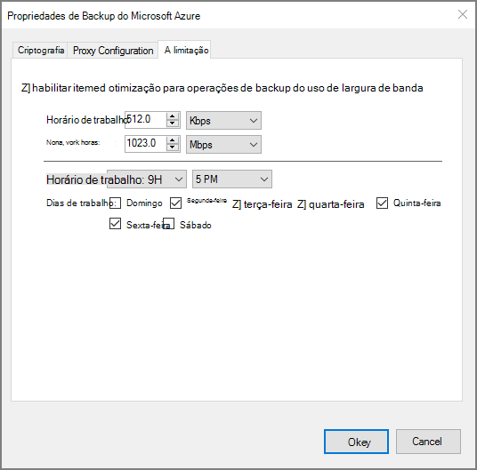

3. Depois que você habilitou a otimização, especifique a largura de banda permitida para transferir dados de backup durante o **horário de trabalho** e **horário de trabalho não**.

    Os valores de largura de banda iniciem em 512 quilobytes por segundo (Kbps) e podem ir até 1023 megabytes por segundo (). Você pode também designar o início e término para o **horário de trabalho**e quais dias da semana são considerados trabalho dias. O horário fora as horas de trabalho designados é considerado como horas de trabalho não.

4. Clique em **Okey**.

## Configurações de exclusão

1. Abra o **agente de Backup do Microsoft Azure** (você pode encontrá-lo, pesquisando sua máquina *Microsoft Azure Backup*).

    

2. No agente do Microsoft Azure Backup, clique em **Agendar Backup**.

    

3. No Assistente de agendamento Backup deixe a opção de **fazer alterações para itens de backup ou horas** selecionada e clique em **Avançar**.

    

4. Clique em **configurações de exclusões**.

    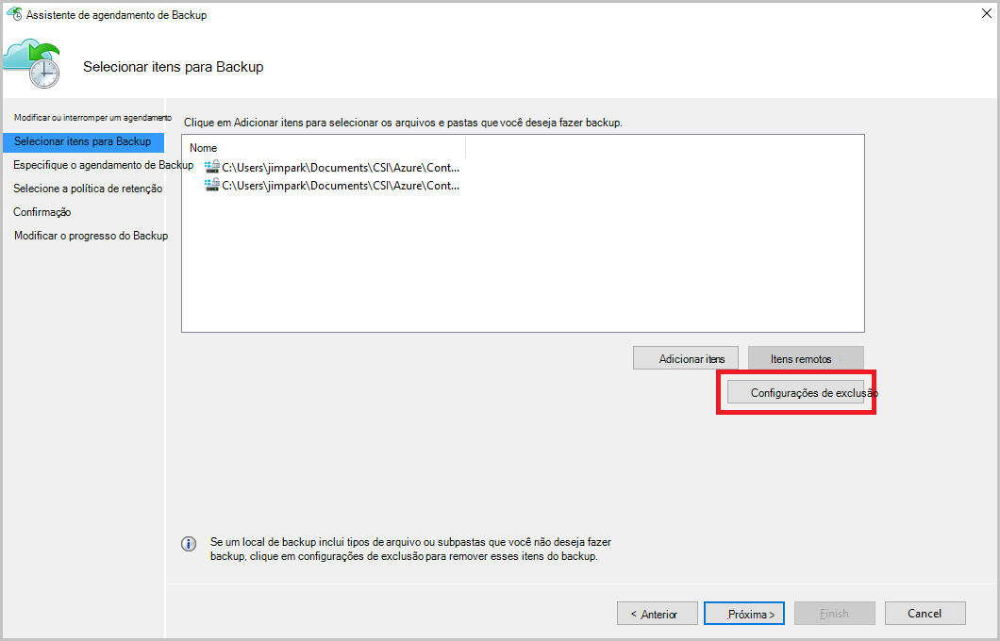

5. Clique em **Adicionar exclusão**.

    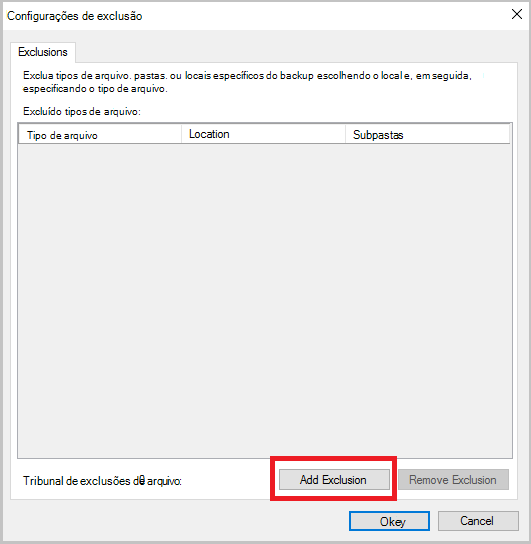

6. Selecione o local e, em seguida, clique em **Okey**.

    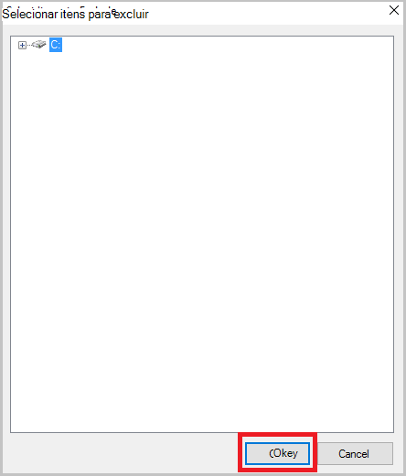

7. Adicione a extensão de arquivo no campo **Tipo de arquivo** .

    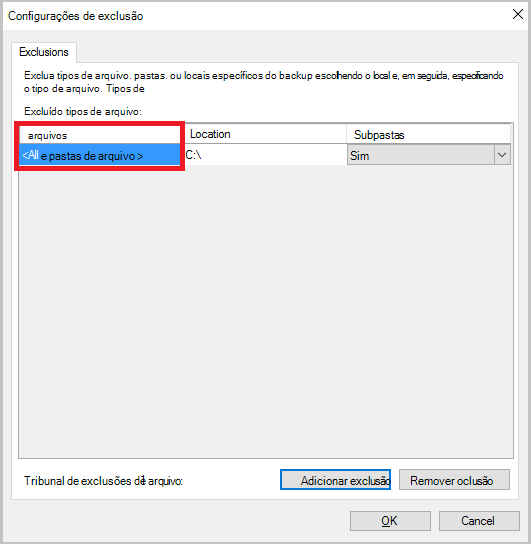

    Adicionando uma extensão de MP3

    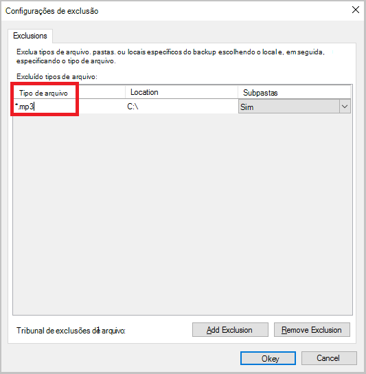

    Para adicionar outra extensão, clique em **Adicionar exclusão** e digite outro extensão de tipo de arquivo (adicionando uma extensão. JPEG).

    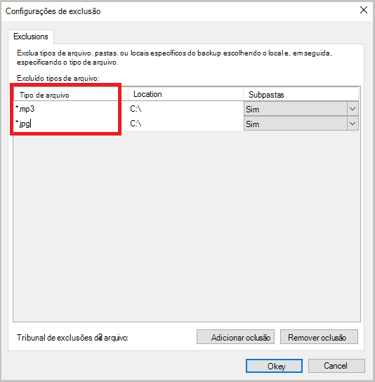

8. Quando você tiver adicionado todas as extensões, clique em **Okey**.

9. Continue no Assistente de Backup de cronograma clicando em **Avançar** até a **página de confirmação**, clique em **Concluir**.

    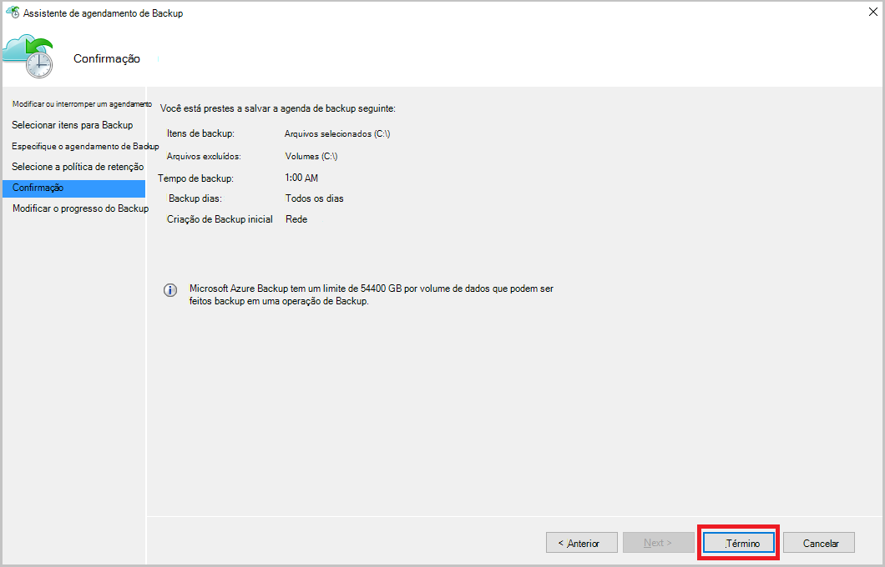

## Próximas etapas
- [Restaurar o cliente Windows Server ou Windows do Azure](backup-azure-restore-windows-server.md)
- Para saber mais sobre o Backup do Azure, consulte [Visão geral de Backup do Azure](backup-introduction-to-azure-backup.md)
- Visite o [Fórum de Backup Azure](http://go.microsoft.com/fwlink/p/?LinkId=290933)
