<properties
    pageTitle="Gerenciar servidores e compartimentos de serviços de recuperação Azure | Microsoft Azure"
    description="Use este tutorial para saber como gerenciar servidores e compartimentos de serviços de recuperação Azure."
    services="backup"
    documentationCenter=""
    authors="markgalioto"
    manager="cfreeman"
    editor="tysonn"/>

<tags
    ms.service="backup"
    ms.workload="storage-backup-recovery"
    ms.tgt_pltfrm="na"
    ms.devlang="na"
    ms.topic="article"
    ms.date="10/19/2016"
    ms.author="jimpark; markgal"/>


# <a name="monitor-and-manage-azure-recovery-services-vaults-and-servers-for-windows-machines"></a>Monitorar e gerenciar compartimentos de serviços de recuperação Azure e servidores para máquinas do Windows

> [AZURE.SELECTOR]
- [Gerenciador de recursos](backup-azure-manage-windows-server.md)
- [Clássico](backup-azure-manage-windows-server-classic.md)

Neste artigo, você encontrará uma visão geral das tarefas de gerenciamento de backup disponíveis por meio do portal do Azure e o agente de Backup do Microsoft Azure.

[AZURE.INCLUDE [learn-about-deployment-models](../../includes/learn-about-deployment-models-rm-include.md)]modelo de implantação clássico.

## <a name="management-portal-tasks"></a>Tarefas de gerenciamento de portal

### <a name="access-your-recovery-services-vaults"></a>Acessar seu compartimentos de serviços de recuperação

1. Entrar no [Portal do Azure](https://portal.azure.com/) usando sua assinatura do Azure.

2. No menu Hub, clique em **Procurar** e na lista de recursos, digite **Os serviços de recuperação**. Conforme você começa a digitar, filtre a lista com base na sua entrada. Clique em **compartimentos de serviços de recuperação**.

    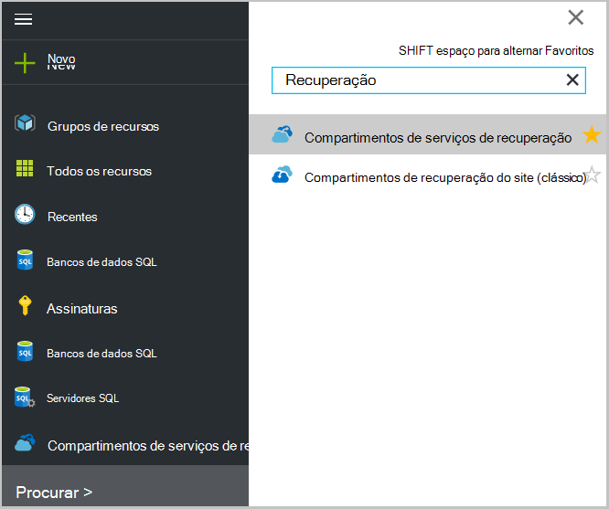 <br/>

2. Selecione o nome do cofre que você deseja exibir na lista para abrir a lâmina de dashboard de Cofre de serviços de recuperação.

    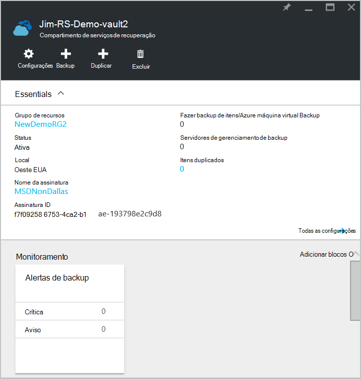 <br/>

## <a name="monitor-jobs-and-alerts"></a>Trabalhos de monitor e alertas
Você monitorar trabalhos e alertas no painel do Cofre de serviços de recuperação, onde você pode ver:

- Detalhes de alertas de backup
- Arquivos e pastas, bem como Azure máquinas virtuais protegidas na nuvem
- Armazenamento total consumido no Azure
- Status do trabalho de backup

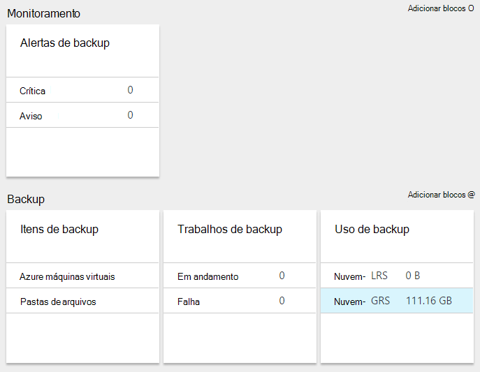

Clicar as informações em cada uma dessas peças abrirá a lâmina associada onde você gerenciar tarefas relacionadas.

Na parte superior do painel:

- Configurações fornece acesso a tarefas de backup disponíveis.
- Backup - ajuda você fizer backup novos arquivos e pastas (ou Azure VMs) ao Cofre de serviços de recuperação.
- Excluir - se já não estiver sendo usado um cofre de serviços de recuperação, você poderá excluí-lo para liberar espaço de armazenamento. Excluir é ativado somente depois que todos os servidores protegidos forem excluídos do cofre.

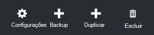
## <a name="alerts-for-backups-using-azure-backup-agent"></a>Alertas para backups usando Azure agente de backup:
| Nível de alerta  | Alertas enviados |
| ------------- | ------------- |
| Crítica | Falha de backup, falha de recuperação  |
| Aviso  | Backup concluído com avisos (quando menos de cem arquivos sem backup devido a problemas de corrupção e mais de um milhão de arquivos com êxito backup)  |
| Informativo  | Nenhum  |
## <a name="manage-backup-alerts"></a>Gerenciar alertas de Backup
Clique no bloco de **Alertas de Backup** para abrir a lâmina de **Alertas de Backup** e gerenciar alertas.

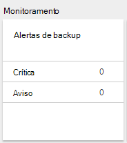

O bloco de alertas de Backup mostra o número de:

- alertas críticos não resolvidas no últimas 24 horas
- alertas de aviso não resolvidas no últimas 24 horas

Clicar em cada um desses links leva você para a lâmina de **Alertas de Backup** com um modo de exibição filtrado destes alertas (avisos ou críticos).

Da lâmina alertas de Backup, você:

- Escolha as informações apropriadas para incluir com seus alertas.

    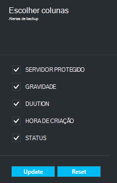

- Filtre alertas tempos de gravidade, status e inicial/final.

    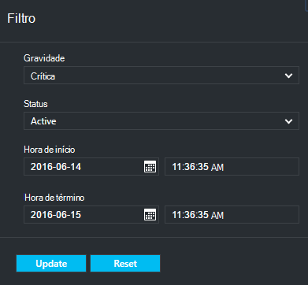

- Configurar notificações de gravidade, frequência e destinatários, bem como ativar ou desativar alertas.

    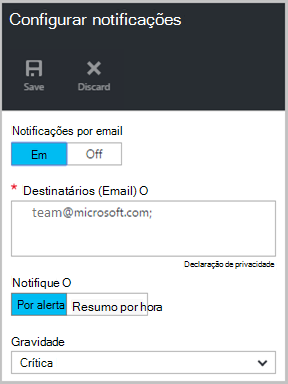

Se **Por alerta** é selecionado como a frequência de **notificação** ocorre sem agrupamento ou redução de emails. Cada alerta resulta em 1 notificação. Essa é a configuração padrão e o email de resolução também é enviado imediatamente.

Se **Por hora resumo** está selecionado como o email de um de frequência de **notificação** será enviado para o usuário informando que há não resolvidas novos alertas geradas na última hora. Um email de resolução é enviado no final da hora.

Alertas podem ser enviados para os níveis de gravidade a seguir:

- crítica
- Aviso
- informações

Você inativa alerta com o botão **inativa** na lâmina de detalhes de trabalho. Quando você clica em inativa, você pode fornecer anotações de resolução.

Escolha as colunas que você deseja que apareça como parte do alerta com o botão **Escolher colunas** .

>[AZURE.NOTE] Da lâmina **configurações** , você gerencia alertas de backup selecionando **monitoramento e relatórios > alertas e eventos > alertas de Backup** e, em seguida, clicando em **Filtrar** ou **Configurar notificações**.

## <a name="manage-backup-items"></a>Gerenciar os itens de Backup
Gerenciando backups locais agora está disponível no portal de gerenciamento. Na seção de Backup do painel, o bloco de **Itens de Backup** mostra o número de itens de backup protegido ao cofre.

Clique em **Pastas de arquivos** no bloco itens de Backup.

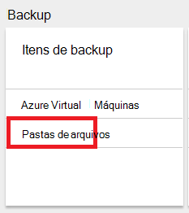

A lâmina de itens de Backup é aberta com o filtro definido para a pasta de arquivo onde você pode ver cada item listado de backup específico.

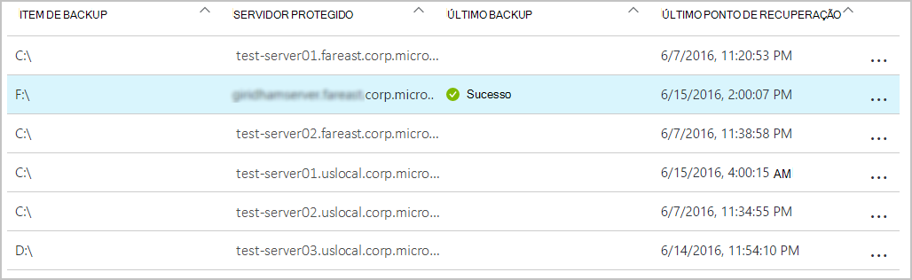

Se você selecionar um item de backup específico na lista, você pode ver os detalhes essenciais para esse item.

>[AZURE.NOTE] Da lâmina **configurações** , você gerencia arquivos e pastas selecionando **protegido itens > itens de Backup** e, em seguida, selecionando **Pastas de arquivo** no menu suspenso.

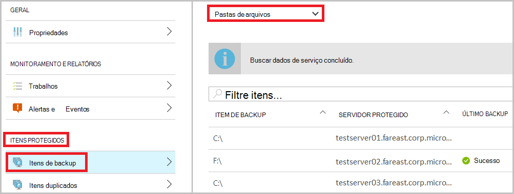

## <a name="manage-backup-jobs"></a>Gerenciar trabalhos de Backup
Os trabalhos de backup para ambos os locais (quando o servidor local está fazendo backup no Azure) e backups Azure ficam visíveis no painel de controle.

Na seção de Backup do painel, o bloco de trabalho de Backup mostra o número de trabalhos:

- em andamento
- Falha em últimas 24 horas.

Para gerenciar os trabalhos de backup, clique no bloco de **Trabalhos de Backup** , que abre a lâmina de trabalhos de Backup.

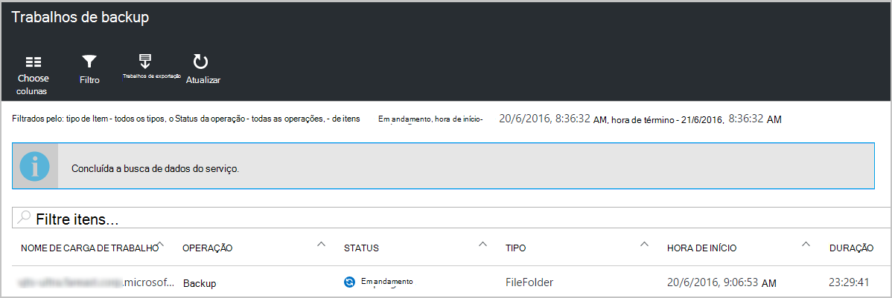

Modificar as informações disponíveis na lâmina trabalhos de Backup com o botão **Escolher colunas** na parte superior da página.

Use o botão de **filtro** para selecionar entre arquivos e pastas e backup do Azure máquina virtual.

Se você não vir o backup de arquivos e pastas, clique em botão de **filtro** na parte superior da página e selecione os **arquivos e pastas** no menu tipo de Item.

>[AZURE.NOTE] Da lâmina **configurações** , você gerencia trabalhos de backup selecionando **monitoramento e relatórios > trabalhos > trabalhos de Backup** e, em seguida, selecionando **Pastas de arquivo** no menu suspenso.

## <a name="monitor-backup-usage"></a>Monitore o uso de Backup
Na seção de Backup do painel, o bloco de uso de Backup mostram o armazenamento consumido no Azure. Uso de armazenamento é fornecido para:
- Uso de armazenamento LRS de nuvem associado com o cofre
- Uso de armazenamento do GRS nuvem associado com o cofre

## <a name="production-servers"></a>Servidores de produção
Para gerenciar seus servidores de produção, clique em **configurações**. Em gerenciar, clique em **infraestrutura de Backup > servidores de produção**.

As listas de blade de servidores de produção de todos os servidores de produção disponíveis. Clique em um servidor na lista para abrir os detalhes do servidor.

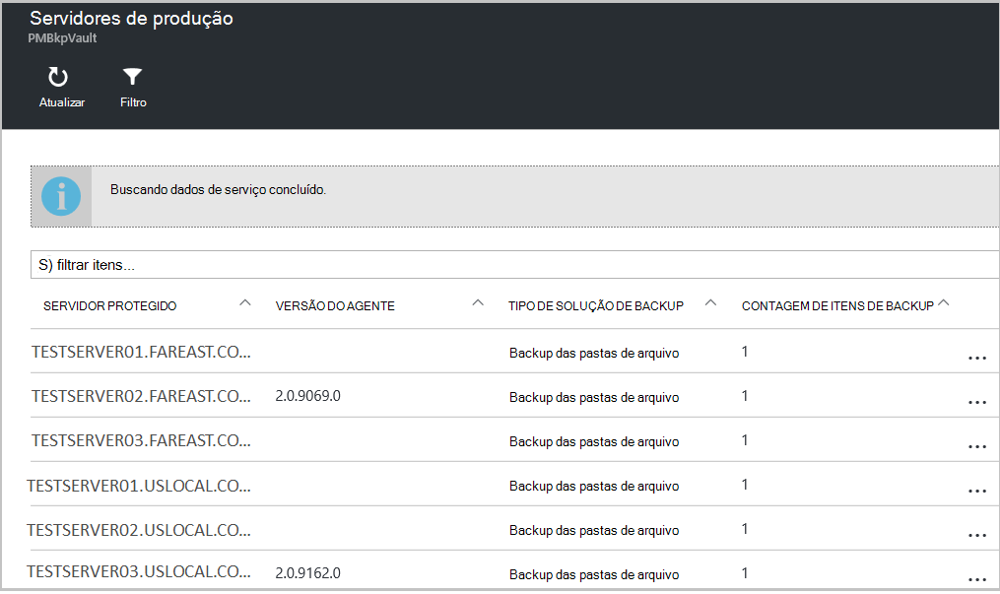

## <a name="microsoft-azure-backup-agent-tasks"></a>Tarefas do agente de Backup do Microsoft Azure

## <a name="open-the-backup-agent"></a>Abra o agente de backup

Abra o **agente de Backup do Microsoft Azure** (para encontrá-lo, pesquisando sua máquina *Microsoft Azure Backup*).

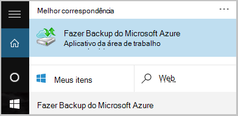

Das **ações** disponíveis na parte direita do console do agente de backup que você executar as seguintes tarefas de gerenciamento:

- Registrar servidor
- Agendar Backup
- Fazer backup agora
- Alterar propriedades

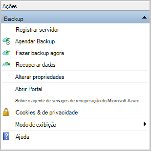

>[AZURE.NOTE] Para **Recuperar dados**, consulte [restaurar os arquivos em um Windows server ou máquina de cliente do Windows](backup-azure-restore-windows-server.md).

## <a name="modify-an-existing-backup"></a>Modificar um backup existente

1. No agente do Microsoft Azure Backup, clique em **Agendar Backup**.

    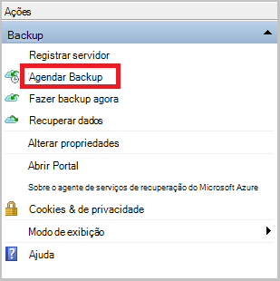

2. No **Assistente de agendamento de Backup** , deixe a opção de **fazer alterações para itens de backup ou horas** selecionada e clique em **Avançar**.

    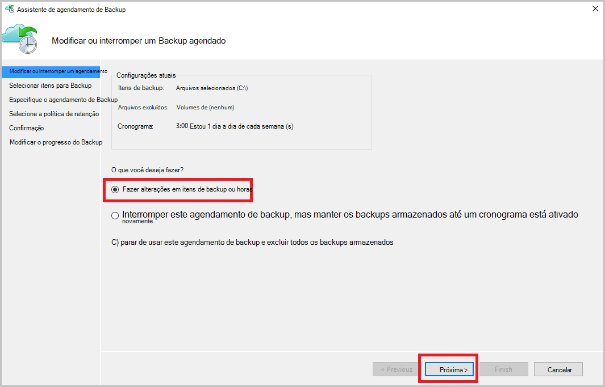

3. Se você quiser adicionar ou alterar itens, na tela **Selecionar itens para Backup** , clique em **Adicionar itens**.

    Você também pode definir **Configurações de exclusão** desta página do assistente. Se você deseja excluir arquivos ou tipos de arquivo Leia o procedimento para adicionar [configurações de exclusão](#exclusion-settings).

4. Selecione os arquivos e pastas que você deseja fazer backup e clique em **Okey**.

    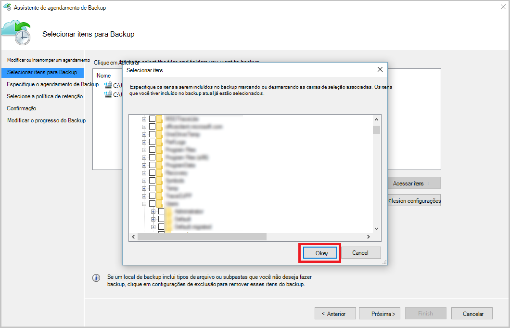

5. Especifique o **agendamento de backup** e clique em **Avançar**.

    Você pode programar backups semanais ou diária (no máximo 3 vezes por dia).

    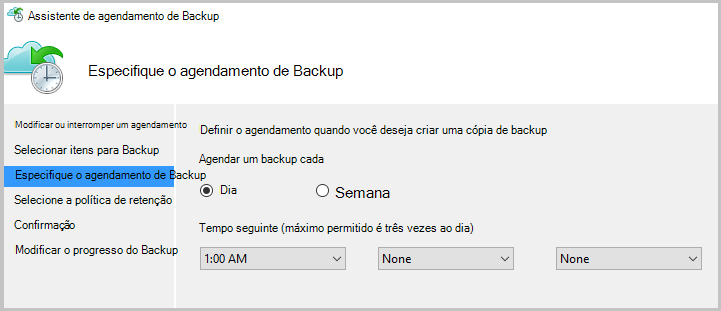

    >[AZURE.NOTE] Especifica o agendamento de backup é explicado em detalhes neste [artigo](backup-azure-backup-cloud-as-tape.md).

6. Selecione a **Política de retenção** para a cópia de backup e clique em **Avançar**.

    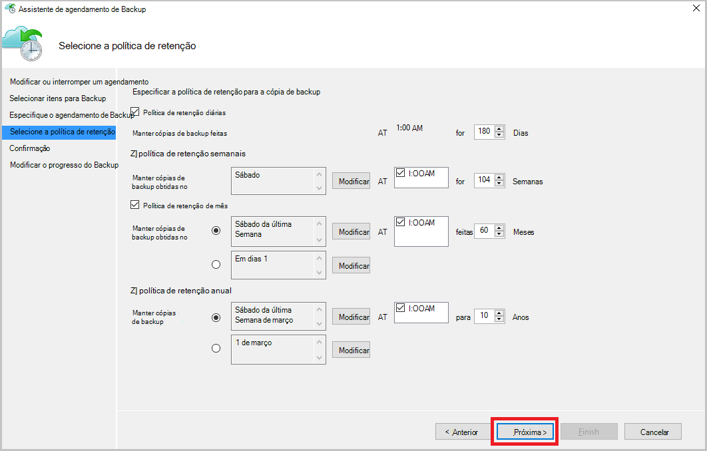

7. Na tela de **confirmação** , examine as informações e clique em **Concluir**.

8. Depois que o assistente terminar de criar a **agenda de backup**, clique em **Fechar**.

    Depois de modificar a proteção, você pode confirmar que backups são disparo corretamente indo para a guia **trabalhos** e confirmando que as alterações sejam refletidas no trabalhos de backup.

## <a name="enable-network-throttling"></a>Habilitar a otimização de rede  
O agente de Backup do Azure fornece uma guia Throttling que permite que você controle como a largura de banda de rede é usada durante a transferência de dados. Este controle pode ser útil se você precisar fazer backup de dados durante horas de trabalho, mas não quiser que o processo de backup interfira com outro tráfego de internet. Transferência de otimização de dados aplica para fazer backup e restaurar atividades.  

Para habilitar a otimização:

1. O **agente de Backup**, clique em **Alterar propriedades**.

2. Sobre **a otimização de guia, selecione **habilite otimização para operações de backup * * do uso de largura de banda de internet.

    

    Depois que você habilitou a otimização, especifique a largura de banda permitida para transferir dados de backup durante o **horário de trabalho** e **horário de trabalho não**.

    Os valores de largura de banda iniciem em 512 quilobytes por segundo (Kbps) e podem ir até 1023 megabytes por segundo (). Você pode também designar o início e término para o **horário de trabalho**e quais dias da semana são considerados trabalho dias. O horário fora as horas de trabalho designados é considerado como horas de trabalho não.

3. Clique em **Okey**.

## <a name="manage-exclusion-settings"></a>Gerenciar as configurações de exclusão

1. Abra o **agente de Backup do Microsoft Azure** (você pode encontrá-lo, pesquisando sua máquina *Microsoft Azure Backup*).

    

2. No agente do Microsoft Azure Backup, clique em **Agendar Backup**.

    

3. No Assistente de agendamento Backup deixe a opção de **fazer alterações para itens de backup ou horas** selecionada e clique em **Avançar**.

    

4. Clique em **configurações de exclusões**.

    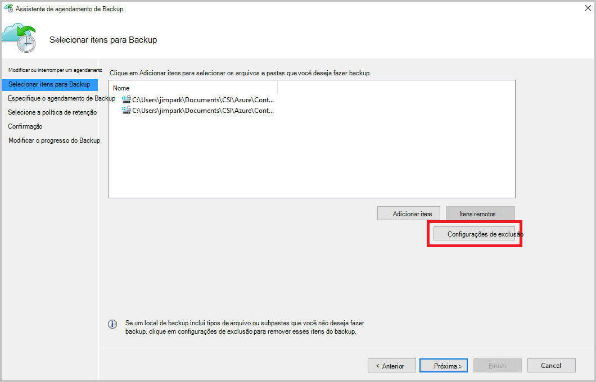

5. Clique em **Adicionar exclusão**.

    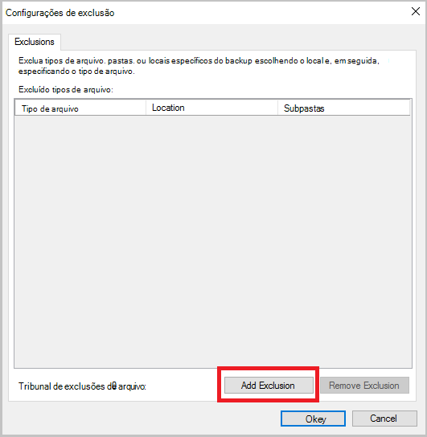

6. Selecione o local e, em seguida, clique em **Okey**.

    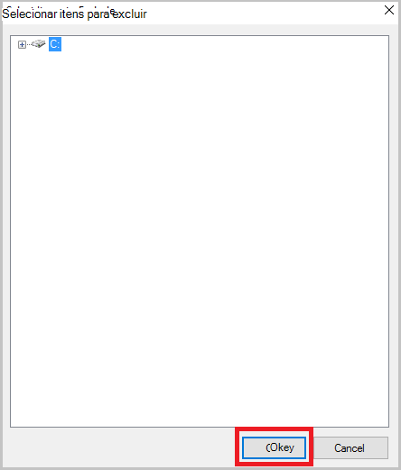

7. Adicione a extensão de arquivo no campo **Tipo de arquivo** .

    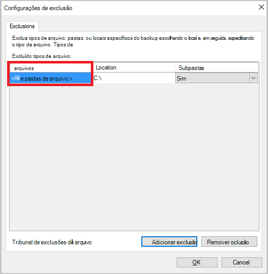

    Adicionando uma extensão de MP3

    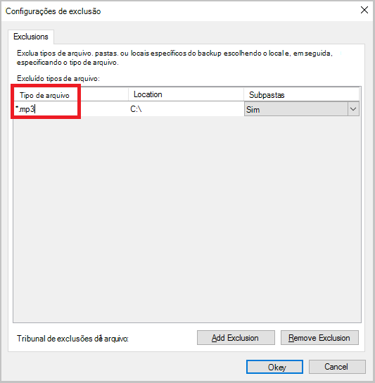

    Para adicionar outra extensão, clique em **Adicionar exclusão** e digite outro extensão de tipo de arquivo (adicionando uma extensão. JPEG).

    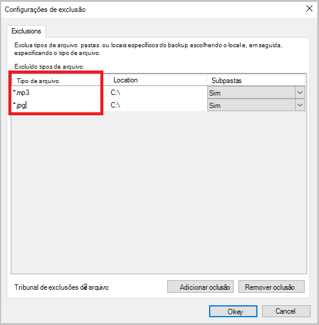

8. Quando você tiver adicionado todas as extensões, clique em **Okey**.

9. Continue no Assistente de Backup de cronograma clicando em **Avançar** até a **página de confirmação**, clique em **Concluir**.

    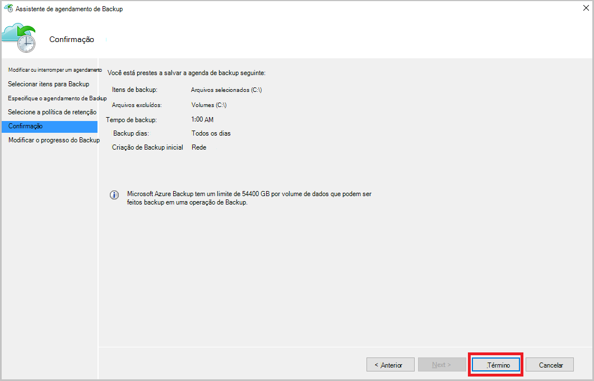

## <a name="frequently-asked-questions"></a>Perguntas frequentes
**T1. O status de trabalho de backup mostra como concluída no agente de backup Azure, por que não obter refletidos imediatamente no portal?**

A1. Lá é em atraso máximo de 15 minutos entre o status do trabalho de backup refletido no Azure agente de backup e o portal do Azure.

**Q.2 quando um trabalho de backup falha, quanto tempo leva para elevar um alerta?**

. 2 um alerta é gerado dentro de 20 min da falha de backup do Azure.

**T3. Há um caso onde um email não será enviado se notificações estiverem configuradas?**

A3. Abaixo são os casos, quando a notificação não será enviada para reduzir o ruído de alerta:

   - Se as notificações estiverem configuradas por hora e um alerta é gerado e resolvido na hora
   - Trabalho será cancelado.
   - Trabalho de backup segundo falha porque o trabalho de backup original está em andamento.

## <a name="troubleshooting-monitoring-issues"></a>Solucionando problemas de monitoramento

**Problema:** Trabalhos e/ou alertas do agente de Backup do Azure não aparecem no portal.

**Etapas de solução de problemas:** O processo, ```OBRecoveryServicesManagementAgent```, envia os dados de trabalho e de alerta para o serviço de Backup do Azure. Ocasionalmente esse processo pode ficar presas ou desligamento.

1. Para verificar o processo não está sendo executado, abra o **Gerenciador de tarefas** e verifique se o ```OBRecoveryServicesManagementAgent``` processo está sendo executado.

2. Supondo que o processo não está sendo executado, abra o **Painel de controle** e navegue pela lista de serviços. Iniciar ou reiniciar o **Agente de gerenciamento de serviços de recuperação do Microsoft Azure**.

    Para obter mais informações, procure os logs em:<br/>
`<AzureBackup_agent_install_folder>\Microsoft Azure Recovery Services Agent\Temp\GatewayProvider*`. Por exemplo:<br/> `C:\Program Files\Microsoft Azure Recovery Services Agent\Temp\GatewayProvider0.errlog`.

## <a name="next-steps"></a>Próximas etapas
- [Restaurar o cliente Windows Server ou Windows do Azure](backup-azure-restore-windows-server.md)
- Para saber mais sobre o Backup do Azure, consulte [Visão geral de Backup do Azure](backup-introduction-to-azure-backup.md)
- Visite o [Fórum de Backup Azure](http://go.microsoft.com/fwlink/p/?LinkId=290933)
