<properties
  pageTitle="Preparando seu ambiente para fazer backup de cargas de trabalho usando o servidor de Backup do Azure | Microsoft Azure"
  description="Certificar-se de que seu ambiente esteja adequadamente preparado para fazer backup de cargas de trabalho usando o servidor de Backup do Azure"
  services="backup"
  documentationCenter=""
  authors="pvrk"
  manager="shivamg"
  editor=""
  keywords="servidor de backup Azure; compartimento de backup"/>

<tags
  ms.service="backup"
  ms.workload="storage-backup-recovery"
  ms.tgt_pltfrm="na"
  ms.devlang="na"
  ms.topic="article"
  ms.date="08/22/2016"
  ms.author="jimpark;trinadhk;pullabhk; markgal"/>

# <a name="preparing-to-back-up-workloads-using-azure-backup-server"></a>Preparando para fazer backup de cargas de trabalho usando o servidor de Backup do Azure

> [AZURE.SELECTOR]
- [Servidor de Backup Azure](backup-azure-microsoft-azure-backup.md)
- [SCDPM](backup-azure-dpm-introduction.md)
- [Servidor de Backup Azure (clássico)](backup-azure-microsoft-azure-backup-classic.md)
- [SCDPM (clássico)](backup-azure-dpm-introduction-classic.md)


Este artigo é sobre como preparar seu ambiente para fazer backup de cargas de trabalho usando o servidor de Backup do Azure. Com o servidor de Backup do Azure, você pode proteger cargas de trabalho de aplicativos como VMs Hyper-V, o Microsoft SQL Server, o SharePoint Server, o Microsoft Exchange e clientes do Windows em um único console.

>[AZURE.WARNING] Servidor de Backup Azure herda a funcionalidade de Data Protection Manager (DPM) para backup de carga de trabalho. Você encontrará ponteiros a documentação do DPM para alguns desses recursos. No entanto Azure Backup Server não fornecem proteção em fita ou integrar com o System Center.

## <a name="1-windows-server-machine"></a>1. máquina Windows Server


A primeira etapa para colocar o servidor de Backup do Azure em funcionamento é ter um computador Windows Server.

| Local | Requisitos mínimos | Instruções adicionais |
| -------- | -------------------- | ----------------------- |
| Azure | Azure máquina virtual de IaaS<br><br>A2 Padrão: 2 cores, 3,5 GB de RAM | Você pode começar com uma imagem da Galeria simples do Centro de dados do Windows Server 2012 R2. [Protegendo IaaS cargas de trabalho usando o servidor de Backup do Azure (DPM)](https://technet.microsoft.com/library/jj852163.aspx) tem muitos nuances. Certifique-se de que você leia o artigo completamente antes de implantar a máquina. |
| Local | Máquina virtual do Hyper-V,<br> Máquina virtual VMWare,<br> ou um host físico<br><br>cores de 2 e 4GB de RAM | Você pode elimine o armazenamento DPM usando o Windows Server duplicação. Saiba mais sobre como [DPM e duplicação](https://technet.microsoft.com/library/dn891438.aspx) funcionam juntos quando implantado em VMs Hyper-V. |

> [AZURE.NOTE] É recomendável que o servidor de Backup do Azure ser instalado em um computador com Windows Server 2012 R2 data center. Muitos dos pré-requisitos estão cobertos automaticamente com a versão mais recente do sistema operacional Windows.

Se você planeja associar este servidor a um domínio em algum momento, é recomendável que a atividade ingressando em domínio ser concluída antes da instalação do servidor de Backup do Azure. Movendo uma máquina de servidor de Backup do Azure existente para um novo domínio após implantação *não têm suporte*.

## <a name="2-backup-vault"></a>2. backup cofre


Se você enviar dados de backup no Azure ou mantê-lo localmente, o software precisa estar conectado ao Azure. Para ser mais específico, máquina do servidor de Backup do Azure precisa ser registrado com um backup cofre.

Para criar um backup cofre:

1. Entre [Portal de gerenciamento](http://manage.windowsazure.com/).

2. Clique em **novo** > **Serviços de dados** > **Serviços de recuperação** > **Backup cofre** > **criação rápida**. Se você tiver várias assinaturas associadas à sua conta organizacional, escolha a assinatura correta para associar o backup cofre.

3. Em **nome**, digite um nome amigável para identificar o cofre. Isso deve ser exclusivo para cada assinatura.

4. Na **região**, selecione a região geográfica para o cofre. Normalmente, região do cofre será separada com base em restrições de latência de rede ou Soberania de dados.

    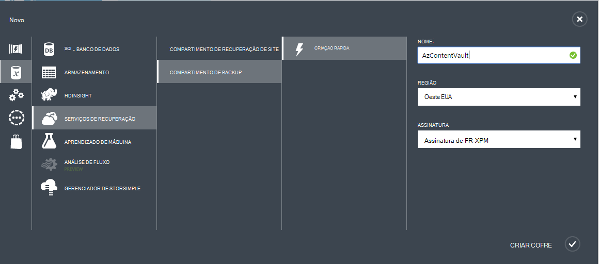

5. Clique em **criar cofre**. Pode levar alguns instantes para o Cofre de backup a ser criado. Monitore as notificações de status na parte inferior do portal.

    

6. Uma mensagem confirma que o cofre foi criado com êxito e ele será listado na página serviços de recuperação como ativo.
    

  > [AZURE.IMPORTANT] Certifique-se de que a opção de redundância de armazenamento apropriado é escolhida logo após o cofre foi criado. Leia mais sobre [geográfica redundantes](../storage/storage-redundancy.md#geo-redundant-storage) e opções [localmente redundantes](../storage/storage-redundancy.md#locally-redundant-storage) neste [Visão geral](../storage/storage-redundancy.md).


## <a name="3-software-package"></a>3. pacote de software


### <a name="downloading-the-software-package"></a>Baixar o pacote de software

Semelhante ao Cofre credenciais, você pode baixar Microsoft Azure Backup para cargas de trabalho de aplicativo na **Página de início rápido** do Cofre de backup.

1. Clique **para cargas de trabalho do aplicativo (disco para a nuvem)**. Você será levado para a página do Centro de Download de onde o pacote de software pode ser baixado.

    

2. Clique em **Baixar**.

    

3. Selecione todos os arquivos e clique em **Avançar**. Baixar todos os arquivos provenientes da página de download do Microsoft Azure Backup e coloque todos os arquivos na mesma pasta.
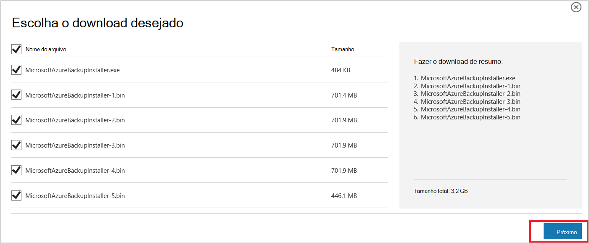

    Como o tamanho do download de todos os arquivos juntos é > 3G, em um 10Mbps Baixe o link pode levar até 60 minutos para download para concluir.


### <a name="extracting-the-software-package"></a>Extrair o pacote de software

Depois de baixar todos os arquivos, clique em **MicrosoftAzureBackupInstaller.exe**. Isso iniciará o **Assistente de configuração de Backup do Microsoft Azure** para extrair os arquivos de instalação para um local especificado por você. Continue no assistente e clique no botão **extrair** para começar o processo de extração.

> [AZURE.WARNING] Pelo menos 4GB de espaço livre é necessário para extrair os arquivos de instalação.


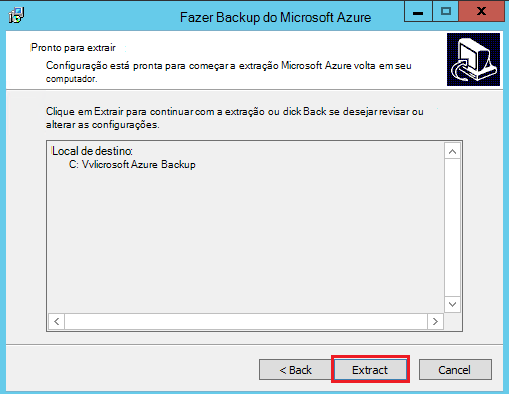

Após a extração do processo concluído, marque a caixa para iniciar o recentemente extraído *setup.exe* para começar a instalação do servidor de Backup do Microsoft Azure e clique no botão **Concluir** .

### <a name="installing-the-software-package"></a>Instalando o pacote de software

1. Clique em **Microsoft Azure Backup** para iniciar o Assistente de configuração.

    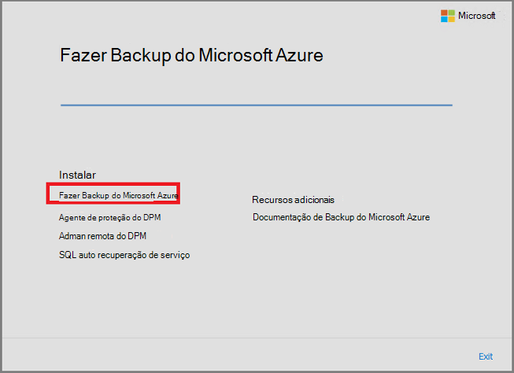

2. Na tela de boas-vindas, clique no botão **Avançar** . Isso leva você à seção *Verificações de pré-requisito* . Nessa tela, clique no botão **Verificar** para determinar se os pré-requisitos de hardware e software de servidor de Backup do Azure foram atendidos. Se todos os pré-requisitos estão foram atendidas com êxito, você verá uma mensagem indicando que o computador atende aos requisitos. Clique no botão **Avançar** .

    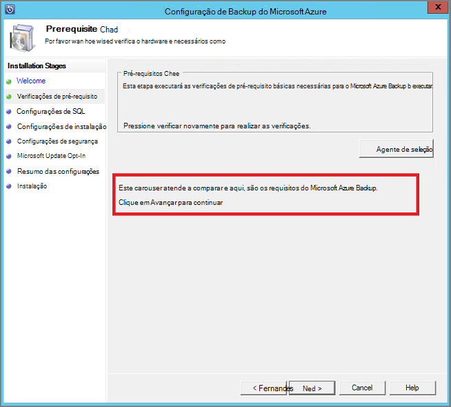

3. Servidor de Backup do Microsoft Azure requer SQL Server Standard e o pacote de instalação do servidor de Backup do Azure vem em conjunto com os binários do SQL Server apropriados necessários. Ao iniciar uma nova instalação de servidor de Backup do Azure, você deve escolha a opção **Instalar nova instância do SQL Server com esta instalação** e clique no botão **Verificar e instalar** . Depois que os pré-requisitos estão instalados com êxito, clique em **Avançar**.

    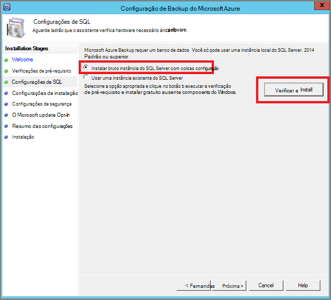

    Se ocorrer uma falha com uma recomendação de reiniciar o computador, fazê-lo e clique em **Verificar novamente**.

    > [AZURE.NOTE] Servidor do Azure Backup não funcionará com uma instância do SQL Server remota. A instância está sendo usada pelo servidor de Backup do Azure precisa ser local.

4. Forneça um local para a instalação dos arquivos de servidor de Backup do Microsoft Azure e clique em **Avançar**.

    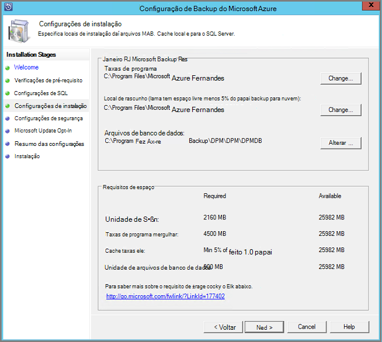

    O local de rascunho é um requisito de volta para cima até o Azure. Certifique-se de que o local de rascunho é pelo menos 5% dos dados planejados para backup na nuvem. Para proteção de disco, discos separados precisam ser configuradas após a conclusão da instalação. Para obter mais informações sobre pools de armazenamento, consulte [configurar pools de armazenamento e armazenamento de disco](https://technet.microsoft.com/library/hh758075.aspx).

5. Forneça uma senha forte para as contas de usuário local restritas e clique em **Avançar**.

    

6. Selecione se deseja usar o *Microsoft Update* para verificar se há atualizações e clique em **Avançar**.

    >[AZURE.NOTE] Recomendamos que você está tendo o Windows Update redirecionar para Microsoft Update, que oferece segurança e atualizações importantes para Windows e outros produtos, como servidor de Backup do Microsoft Azure.

    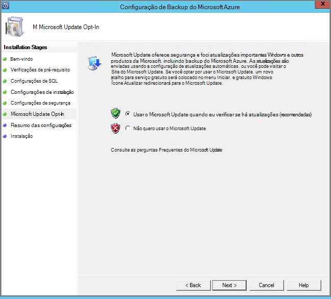

7. Examine o *Resumo de configurações* e clique em **instalar**.

    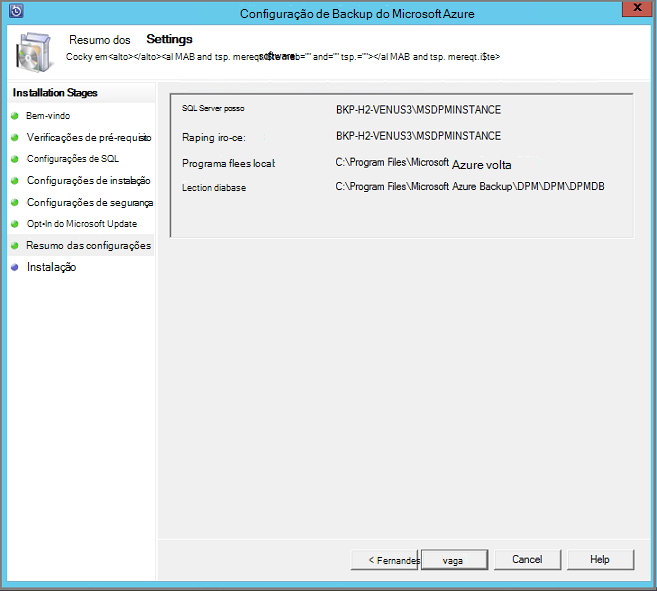

8. A instalação acontece em fases. Na primeira fase o agente de serviços de recuperação do Microsoft Azure está instalado no servidor. O assistente também verifica conectividade com a Internet. Se a conectividade com a Internet estiver disponível pode continuar a instalação, caso contrário, você precisará fornecer detalhes de proxy para conectar à Internet.

    A próxima etapa é configurar o agente de serviços de recuperação do Microsoft Azure. Como parte da configuração, você precisará fornecer que estiver as credenciais do cofre para registrar a máquina ao Cofre de backup. Você também irá fornecer uma senha para criptografar/descriptografar os dados enviados entre Azure e seu local. Automaticamente, você pode gerar uma senha ou fornecer sua própria senha mínima de 16 caracteres. Continue com o assistente até o agente foi configurado.

    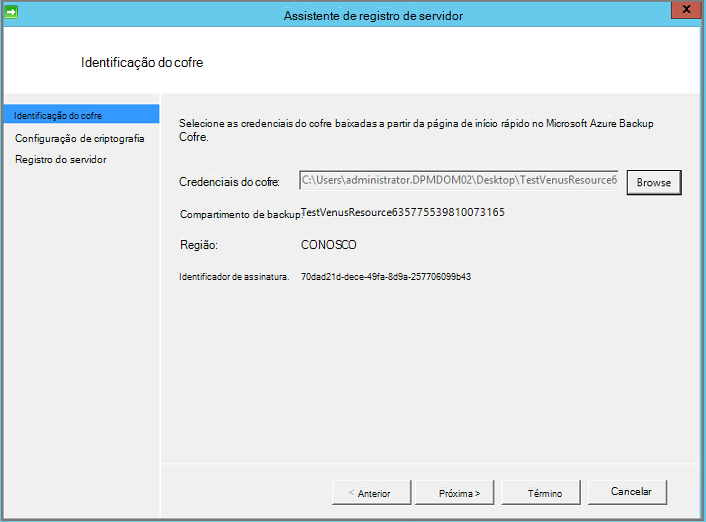

9. Depois de registro do servidor Microsoft Azure Backup concluído com êxito, o Assistente de configuração geral passa para a instalação e configuração do SQL Server e os componentes do servidor de Backup do Azure. Uma vez concluída a instalação do componente do SQL Server, os componentes de servidor de Backup do Azure estão instalados.

    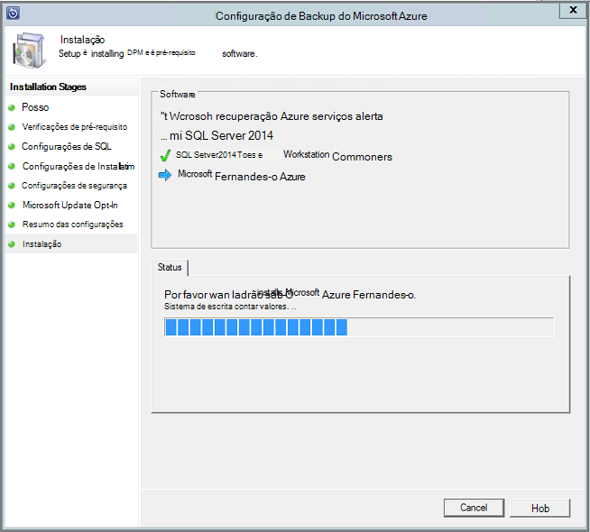


Quando a etapa de instalação estiver concluída, ícones de área de trabalho do produto terá sido criados também. Basta clicar duas vezes no ícone para iniciar o produto.

### <a name="add-backup-storage"></a>Adicionar armazenamento de backup

A primeira cópia de backup é mantida no armazenamento conectado à máquina do servidor de Backup do Azure. Para obter mais informações sobre a adição de discos, consulte [configurar pools de armazenamento e armazenamento de disco](https://technet.microsoft.com/library/hh758075.aspx).

> [AZURE.NOTE] Você precisa adicionar armazenamento de backup, mesmo se você planeja enviar dados para o Azure. Na arquitetura atual do servidor de Backup do Azure, o Backup do Azure cofre contém a *segunda* cópia dos dados enquanto o armazenamento local contém a cópia de backup primeira (e obrigatória).  

## <a name="4-network-connectivity"></a>4. conectividade de rede


Servidor do Azure Backup requerem conectividade com o serviço de Backup do Azure para o produto trabalhar com êxito. Para validar se o computador possui a conectividade com o Azure, use o ```Get-DPMCloudConnection``` commandlet no console do PowerShell do Azure Backup Server. Se a saída do commandlet for verdadeiro, então conectividade existe, else há nenhuma conectividade.

Ao mesmo tempo, a assinatura do Azure precisa estar em um estado de integridade. Para descobrir o estado da sua assinatura e gerenciá-lo, faça logon [portal de assinatura]( https://account.windowsazure.com/Subscriptions).

Quando você souber o estado da conectividade Azure e da assinatura do Azure, você pode usar a tabela a seguir para descobrir o impacto sobre a funcionalidade de backup e restauração oferecida.

| Estado de conectividade | Assinatura do Azure | Backup em Azure| Backup em disco | Restaurar a partir do Azure | Restaurar a partir de disco |
| -------- | ------- | --------------------- | ------------------- | --------------------------- | ----------------------- |
| Conectado | Ativa | Permitido | Permitido | Permitido | Permitido |
| Conectado | Expirado | Interrompido | Interrompido | Permitido | Permitido |
| Conectado | Desprovisionada | Interrompido | Interrompido | Pontos de recuperação parou e Azure excluídos | Interrompido |
| Perda de conectividade > 15 dias | Ativa | Interrompido | Interrompido | Permitido | Permitido |
| Perda de conectividade > 15 dias | Expirado | Interrompido | Interrompido | Permitido | Permitido |
| Perda de conectividade > 15 dias | Desprovisionada | Interrompido | Interrompido |  Pontos de recuperação parou e Azure excluídos | Interrompido |

### <a name="recovering-from-loss-of-connectivity"></a>Recuperando contra perda de conectividade
Se você tiver um firewall ou um proxy que está impedindo o acesso ao Azure, é necessário branca os seguintes endereços de domínio no perfil de firewall/proxy:

- www.msftncsi.com
- \*. Microsoft.com
- \*. WindowsAzure.com
- \*. microsoftonline.com
- \*. no windows.net

Depois que a conectividade com o Azure foi restaurada à máquina do servidor de Backup do Azure as operações que podem ser realizadas são determinadas pelo estado de assinatura Azure. A tabela acima tem detalhes sobre as operações permitidas depois de máquina "conectar".

### <a name="handling-subscription-states"></a>Manipulando estados de assinatura

É possível tomar uma assinatura do Azure do estado *expirado* ou *Deprovisioned* para o estado *ativo* . No entanto isso tem algumas implicações sobre o comportamento de produto, enquanto o estado não estiver *ativa*:

- Uma assinatura de *Deprovisioned* perde funcionalidade para o período que ela será desprovisionada. Sobre como ativar *ativa*, a funcionalidade do produto de backup/restauração é reativada. Os dados de backup no disco local também podem ser recuperados se ele foi mantido com um período de retenção suficientemente grande. No entanto, os dados de backup no Azure são perdidos depois que a assinatura entra no estado *Deprovisioned* .
- Uma assinatura de *expirado* somente perde funcionalidade para até que ele foi feito *ativo* novamente. Qualquer backups agendados para o período que a assinatura foi *expirado* não executará.


## <a name="troubleshooting"></a>Solução de problemas

Se o servidor de Backup do Microsoft Azure falhar com erros durante a fase de instalação (ou backup ou restaurar), consulte este [documento de códigos de erro](https://support.microsoft.com/kb/3041338) para obter mais informações.
Você também pode consultar a [que Azure Backup relacionados perguntas frequentes](backup-azure-backup-faq.md)


## <a name="next-steps"></a>Próximas etapas

Você pode obter informações detalhadas sobre como [preparar o ambiente para DPM](https://technet.microsoft.com/library/hh758176.aspx) no site da Microsoft TechNet. Ele também contém informações sobre as configurações suportadas no qual servidor de Backup do Azure podem ser implantado e usado.

Você pode usar estes artigos para obter uma compreensão mais profunda de proteção de carga de trabalho usando o servidor de Backup do Microsoft Azure.

- [Backup do SQL Server](backup-azure-backup-sql.md)
- [Backup do SharePoint server](backup-azure-backup-sharepoint.md)
- [Backup de servidor alternativo](backup-azure-alternate-dpm-server.md)
