<properties
  pageTitle="Preparando seu ambiente para fazer backup de cargas de trabalho usando o servidor de Backup do Azure | Microsoft Azure"
  description="Prepare o ambiente para usar o servidor de Backup do Azure proteger ou fazer backup cargas de trabalho."
  services="backup"
  documentationCenter=""
  authors="PVRK"
  manager="shivamg"
  editor=""
  keywords="servidor de backup Azure; proteger cargas de trabalho; fazer backup de cargas de trabalho"/>

<tags
  ms.service="backup"
  ms.workload="storage-backup-recovery"
  ms.tgt_pltfrm="na"
  ms.devlang="na"
  ms.topic="article"
  ms.date="09/27/2016"
  ms.author="jimpark;trinadhk;pullabhk;markgal"/>

# <a name="preparing-to-back-up-workloads-using-azure-backup-server"></a>Preparando para fazer backup de cargas de trabalho usando o servidor de Backup do Azure

> [AZURE.SELECTOR]
- [Servidor de Backup Azure](backup-azure-microsoft-azure-backup.md)
- [SCDPM](backup-azure-dpm-introduction.md)
- [Servidor de Backup Azure (clássico)](backup-azure-microsoft-azure-backup-classic.md)
- [SCDPM (clássico)](backup-azure-dpm-introduction-classic.md)

Este artigo explica como preparar o ambiente para fazer backup de cargas de trabalho usando o servidor de Backup do Azure. Com o servidor de Backup do Azure, você pode proteger cargas de trabalho de aplicativos como VMs Hyper-V, o Microsoft SQL Server, o SharePoint Server, o Microsoft Exchange e clientes do Windows em um único console. Você também pode proteger informações como uma cargas de trabalho do servidor (IaaS) como VMs no Azure.

> [AZURE.NOTE] Azure tem dois modelos de implantação para criar e trabalhar com recursos: [Gerenciador de recursos e clássico](../resource-manager-deployment-model.md). Este artigo fornece as informações e procedimentos para restaurar VMs implantadas usando o modelo do Gerenciador de recursos.

Servidor de Backup Azure herda a muitas das funcionalidades backup carga do Data Protection Manager (DPM). Este artigo se refere a documentação do DPM para explicar algumas das funcionalidades compartilhada. Apesar do Azure Backup Server compartilha muita a mesma funcionalidade que DPM. Servidor de Backup Azure não fazer backup em fita, nem integrar com o System Center.

## <a name="1-choose-an-installation-platform"></a>1. Escolha uma plataforma de instalação

A primeira etapa para colocar o servidor de Backup do Azure em funcionamento é configurar um servidor do Windows. Seu servidor pode estar no Azure ou local.

### <a name="using-a-server-in-azure"></a>Usando um servidor do Azure

Ao escolher um servidor executando o servidor de Backup do Azure, é recomendável que iniciar com uma imagem da Galeria do Centro de dados do Windows Server 2012 R2. O artigo [criar sua primeira máquina de virtual do Windows no portal do Azure](..\virtual-machines\virtual-machines-windows-hero-tutorial.md), fornece um tutorial de Introdução com o computador virtual recomendado no Azure, mesmo se você nunca usou o Azure antes. Os requisitos mínimos recomendados para o servidor virtual de máquina devem ser: A2 padrão com 2 cores e 3,5 GB de RAM.

Proteger cargas de trabalho com o servidor de Backup do Azure tem muitos nuances. O artigo, [Instale o DPM como uma máquina virtual Azure](https://technet.microsoft.com/library/jj852163.aspx), ajuda a explicar essas nuances. Leia este artigo completamente antes de implantar a máquina.

### <a name="using-an-on-premises-server"></a>Usar um servidor local

Se não desejar executar o servidor base no Azure, você pode executar o servidor em uma máquina virtual Hyper-V, uma VM VMware ou um host físico. Os requisitos mínimos recomendados para o hardware do servidor são cores de 2 e 4 GB de RAM. Os sistemas operacionais suportados estão listados na tabela a seguir.

| Sistema Operacional        | Plataforma           | SKU  |
| :------------- |-------------| :-----|
|Windows Server 2012 R2 e SPs mais recentes| 64 bits| Padrão, data center, Foundation|
|Windows Server 2012 e SPs mais recentes|    64 bits| Padrão de data center, Foundation,|
|Windows Storage Server 2012 R2 e SPs mais recentes  |64 bits|    Padrão, grupo de trabalho|
|Armazenamento do Windows Server 2012 e SPs mais recentes |64 bits |Padrão, grupo de trabalho|


Você pode elimine o armazenamento DPM usando o Windows Server duplicação. Saiba mais sobre como [DPM e duplicação](https://technet.microsoft.com/library/dn891438.aspx) funcionam juntos quando implantado em VMs Hyper-V.

> [AZURE.NOTE]  Você não pode instalar o servidor de Backup do Azure em um computador executando como um controlador de domínio.

Você deve associar o servidor de Backup do Azure para um domínio. Se você pretende mover o servidor para um domínio diferente, é recomendável que você ingressar o servidor para o novo domínio antes de instalar o servidor de Backup do Azure. Movendo uma máquina de servidor de Backup do Azure existente para um novo domínio após implantação *não têm suporte*.

## <a name="2-recovery-services-vault"></a>2. compartimento de serviços de recuperação

Se você enviar dados de backup no Azure ou mantê-lo localmente, o software precisa estar conectado ao Azure. Para ser mais específico, máquina do servidor de Backup do Azure precisa ser registrado com um cofre de serviços de recuperação.

Para criar um cofre de serviços de recuperação:

1. Entrar no [portal do Azure](https://portal.azure.com/).

2. No menu Hub, clique em **Procurar** e na lista de recursos, digite **Os serviços de recuperação**. Conforme você começa a digitar, filtre a lista com base na sua entrada. Clique em **Serviços de recuperação cofre**.

    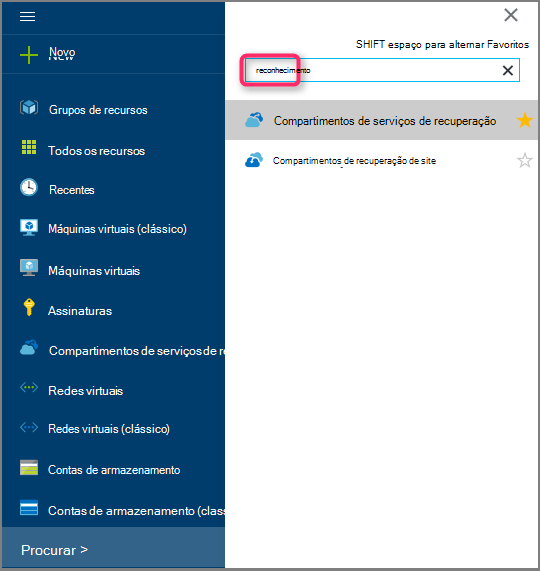 <br/>

    Na lista de serviços de recuperação compartimentos é exibida.

3. No menu **compartimentos de serviços de recuperação** , clique em **Adicionar**.

    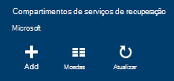

    A lâmina de Cofre de serviços de recuperação é aberta, solicitando que você forneça um **nome**, **assinatura**, **grupo de recursos**e **local**.

    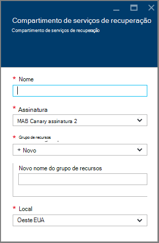

4. Para **nome**, digite um nome amigável para identificar o cofre. O nome deve ser exclusivo para a assinatura do Azure. Digite um nome que contenha entre 2 e 50 caracteres. Ele deve começar com uma letra e pode conter apenas letras, números e hifens.

5. Clique na **assinatura** para ver a lista de assinaturas disponíveis. Se você não tiver certeza de qual assinatura usar, use o padrão (ou sugeridos) assinatura. Haverá várias opções somente se sua conta organizacional está associada a várias assinaturas Azure.

6. Clique em **grupo de recursos** para ver a lista de grupos de recursos disponíveis, ou clique em **novo** para criar um novo grupo de recursos. Para obter informações completas sobre grupos de recursos, consulte [Visão geral do Gerenciador de recursos do Azure](../azure-resource-manager/resource-group-overview.md)

7. Clique em **local** para selecionar a região geográfica para o cofre.

8. Clique em **criar**. Pode levar alguns instantes para o Cofre de serviços de recuperação a ser criado. Monitore as notificações de status na área superior direita no portal.
Depois que seu cofre é criado, ele abre no portal.

### <a name="set-storage-replication"></a>Replicação de armazenamento de conjunto

A opção de replicação de armazenamento permite que você escolha entre armazenamento geográfica redundante e localmente redundantes. Por padrão, seu cofre tem armazenamento redundante de localização geográfica. Deixe a opção definida como armazenamento geográfica redundante se esta for sua principal de backup. Escolha armazenamento localmente redundante se quiser que uma opção mais barata que não é bastante tão durável. Leia mais sobre [geográfica redundante](../storage/storage-redundancy.md#geo-redundant-storage) e opções de armazenamento [localmente redundantes](../storage/storage-redundancy.md#locally-redundant-storage) na [Visão geral de replicação de armazenamento do Azure](../storage/storage-redundancy.md).

Para editar a configuração de replicação de armazenamento:

1. Selecione seu cofre para abrir o painel Cofre e a lâmina de configurações. Se a lâmina **configurações** não abrir, clique em **todas as configurações** no painel Cofre.

2. Na lâmina **configurações** , clique em **Infraestrutura de Backup** > **Configuração de Backup** para abrir a lâmina de **Configuração de Backup** . Na lâmina **Configuração de Backup** , escolha a opção de replicação de armazenamento para seu cofre.

    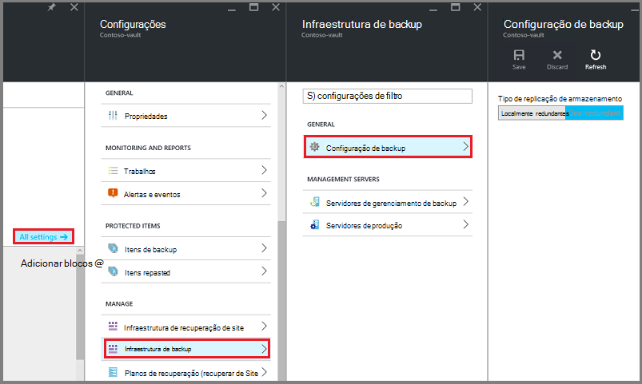

    Depois de escolher a opção de armazenamento de seu cofre, você está pronto para associar a máquina virtual do cofre. Para começar a associação, você deve descobrir e registrar as máquinas virtuais Azure.

## <a name="3-software-package"></a>3. pacote de software

### <a name="downloading-the-software-package"></a>Baixar o pacote de software
1. Entrar no [portal do Azure](https://portal.azure.com/).

2. Se você já tiver um aberto de Cofre de serviços de recuperação, vá para a etapa 3. Se você não tem um serviços de recuperação cofre aberto, mas no portal do Azure, no menu Hub, clique em **Procurar**.

    - Na lista de recursos, digite **Os serviços de recuperação**.
    - Conforme você começa a digitar, filtre a lista com base na sua entrada. Quando você vir **compartimentos de serviços de recuperação**, clique nele.

    

    Na lista de serviços de recuperação compartimentos é exibida.

    - Na lista de serviços de recuperação compartimentos, selecione um cofre.

    No painel Cofre selecionado é aberta.

    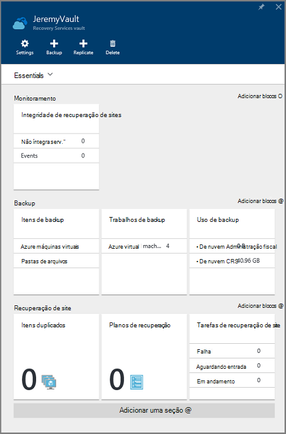

3. Blade configurações abre por padrão. Se ela estiver fechada, clique em **configurações** para abrir a lâmina de configurações.

    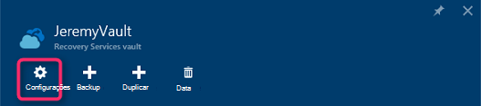

4. Clique em **Backup** no **Guia de Introdução** para abrir o Assistente de Introdução.

    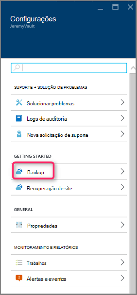

5. Em Introdução que se abre, a tela de metas de Backup será selecionado automaticamente.
    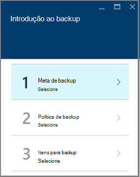

    Na seção **metas de Backup** , selecione o *local* *onde está a carga de trabalho em execução*.

    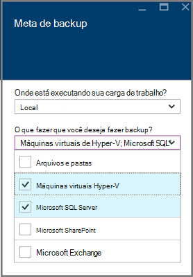

6. Selecione as cargas de trabalho que você deseja proteger usando o servidor de Backup do Azure em *quais cargas de trabalho que você deseja proteger* e clique em **Okey**.

    > [AZURE.NOTE] Se você estiver planejando proteger apenas arquivos e pastas, é recomendável usar o agente de Backup do Azure. Se você estiver planejando proteger mais cargas de trabalho que apenas arquivos e pastas ou no futuro se você estiver planejando expandir as necessidades de proteção, selecione todas as cargas de trabalho.

    Isso alterará o Assistente de Introdução para preparar infraestrutura protegendo cargas de trabalho do local para o Azure.

    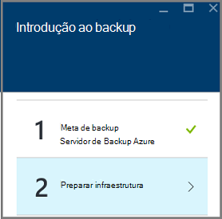

7. Na lâmina **Preparar infraestrutura** que é aberta, clique nos links de **Download** para instalar o servidor de Backup do Azure e credenciais de Cofre de Download. Você pode usar as credenciais do cofre durante o registro de servidor de Backup do Azure para o compartimento de serviços de recuperação. Os links levam você para o Centro de Download onde o pacote de software pode ser baixado.

    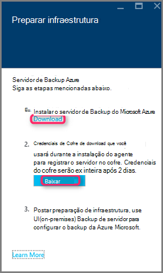

8. Selecione todos os arquivos e clique em **Avançar**. Baixar todos os arquivos provenientes da página de download do Microsoft Azure Backup e coloque todos os arquivos na mesma pasta.

    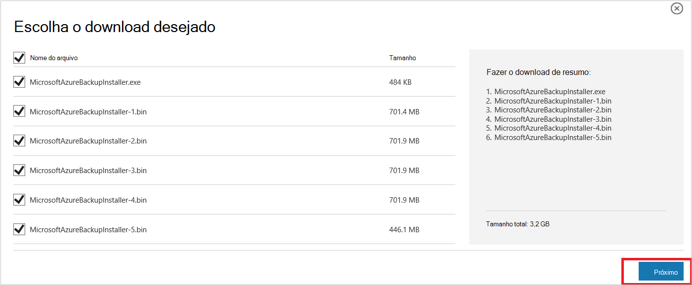

    Como o tamanho do download de todos os arquivos juntos é > 3G, em um 10Mbps Baixe o link pode levar até 60 minutos para download para concluir.


### <a name="extracting-the-software-package"></a>Extrair o pacote de software

Depois de baixar todos os arquivos, clique em **MicrosoftAzureBackupInstaller.exe**. Isso iniciará o **Assistente de configuração de Backup do Microsoft Azure** para extrair os arquivos de instalação para um local especificado por você. Continue no assistente e clique no botão **extrair** para começar o processo de extração.

> [AZURE.WARNING] Pelo menos 4GB de espaço livre é necessário para extrair os arquivos de instalação.


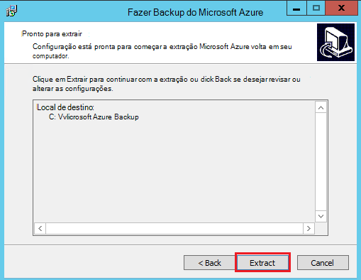

Após a extração do processo concluído, marque a caixa para iniciar o recentemente extraído *setup.exe* para começar a instalação do servidor de Backup do Microsoft Azure e clique no botão **Concluir** .

### <a name="installing-the-software-package"></a>Instalando o pacote de software

1. Clique em **Microsoft Azure Backup** para iniciar o Assistente de configuração.

    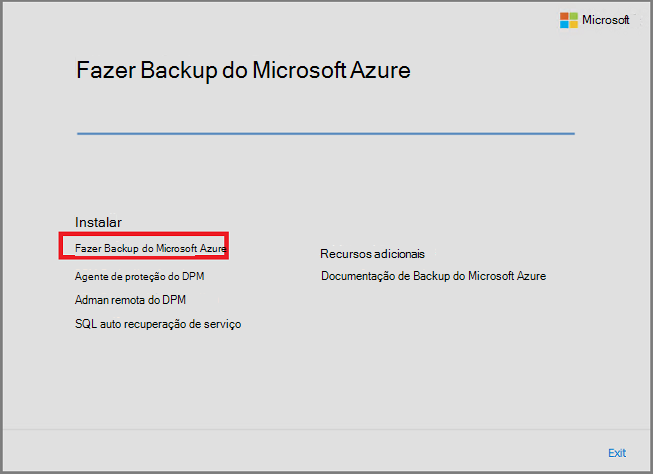

2. Na tela de boas-vindas, clique no botão **Avançar** . Isso leva você à seção *Verificações de pré-requisito* . Nessa tela, clique no botão **Verificar** para determinar se os pré-requisitos de hardware e software de servidor de Backup do Azure foram atendidos. Se todos os pré-requisitos estão foram atendidas com êxito, você verá uma mensagem indicando que o computador atende aos requisitos. Clique no botão **Avançar** .

    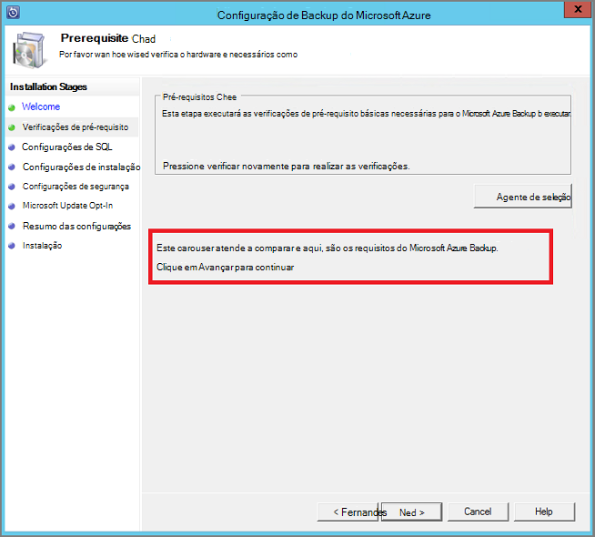

3. Servidor de Backup do Microsoft Azure requer SQL Server Standard e o pacote de instalação do servidor de Backup do Azure vem em conjunto com os binários do SQL Server apropriados necessários. Ao iniciar uma nova instalação de servidor de Backup do Azure, você deve escolha a opção **Instalar nova instância do SQL Server com esta instalação** e clique no botão **Verificar e instalar** . Depois que os pré-requisitos estão instalados com êxito, clique em **Avançar**.

    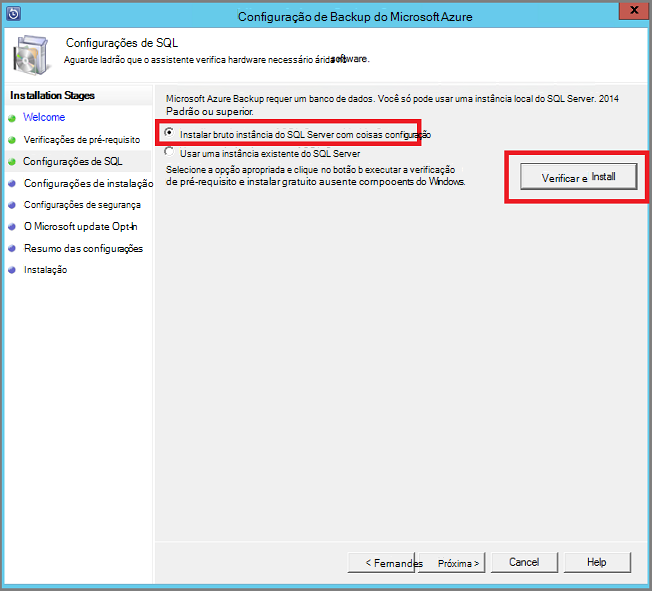

    Se ocorrer uma falha com uma recomendação de reiniciar o computador, fazê-lo e clique em **Verificar novamente**.

    > [AZURE.NOTE] Servidor do Azure Backup não funcionará com uma instância do SQL Server remota. A instância está sendo usada pelo servidor de Backup do Azure precisa ser local.

4. Forneça um local para a instalação dos arquivos de servidor de Backup do Microsoft Azure e clique em **Avançar**.

    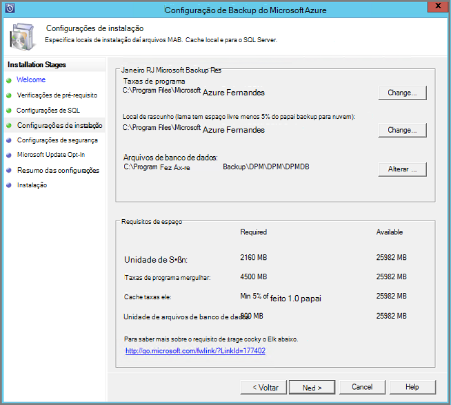

    O local de rascunho é um requisito de volta para cima até o Azure. Certifique-se de que o local de rascunho é pelo menos 5% dos dados planejados para backup na nuvem. Para proteção de disco, discos separados precisam ser configuradas após a conclusão da instalação. Para obter mais informações sobre pools de armazenamento, consulte [configurar pools de armazenamento e armazenamento de disco](https://technet.microsoft.com/library/hh758075.aspx).

5. Forneça uma senha forte para as contas de usuário local restritas e clique em **Avançar**.

    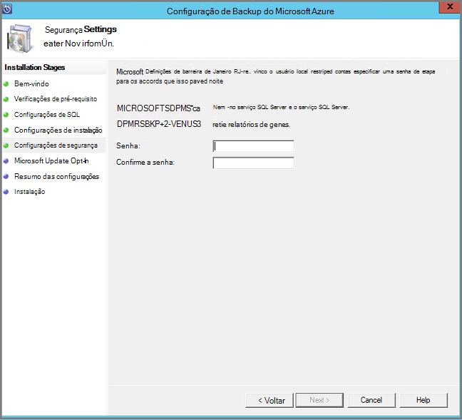

6. Selecione se deseja usar o *Microsoft Update* para verificar se há atualizações e clique em **Avançar**.

    >[AZURE.NOTE] Recomendamos que você está tendo o Windows Update redirecionar para Microsoft Update, que oferece segurança e atualizações importantes para Windows e outros produtos, como servidor de Backup do Microsoft Azure.

    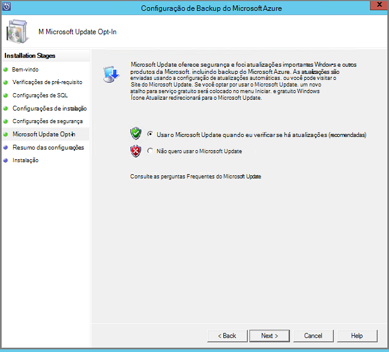

7. Examine o *Resumo de configurações* e clique em **instalar**.

    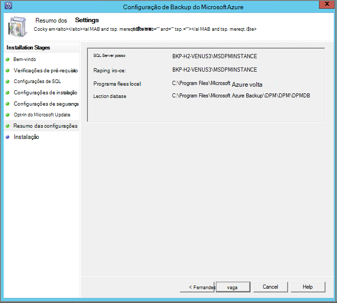

8. A instalação acontece em fases. Na primeira fase o agente de serviços de recuperação do Microsoft Azure está instalado no servidor. O assistente também verifica conectividade com a Internet. Se a conectividade com a Internet estiver disponível pode continuar a instalação, caso contrário, você precisará fornecer detalhes de proxy para conectar à Internet.

    A próxima etapa é configurar o agente de serviços de recuperação do Microsoft Azure. Como parte da configuração, você precisará fornecer suas credenciais do cofre para registrar a máquina ao Cofre de serviços de recuperação. Você também irá fornecer uma senha para criptografar/descriptografar os dados enviados entre Azure e seu local. Automaticamente, você pode gerar uma senha ou fornecer sua própria senha mínima de 16 caracteres. Continue com o assistente até o agente foi configurado.

    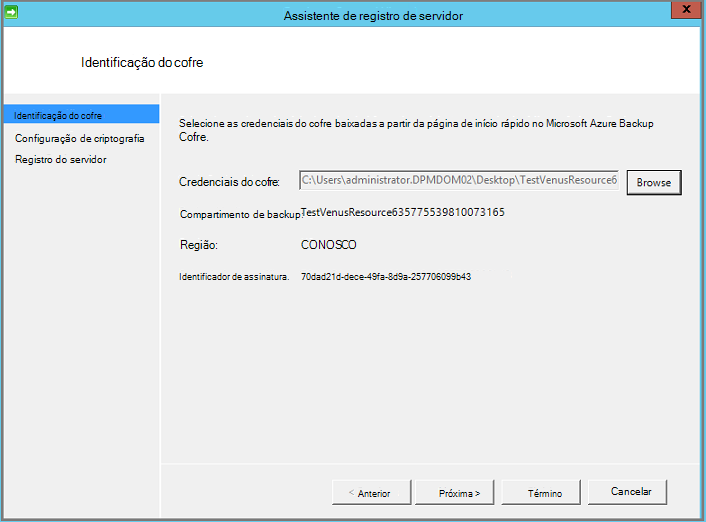

9. Depois de registro do servidor Microsoft Azure Backup concluído com êxito, o Assistente de configuração geral passa para a instalação e configuração do SQL Server e os componentes do servidor de Backup do Azure. Uma vez concluída a instalação do componente do SQL Server, os componentes de servidor de Backup do Azure estão instalados.

    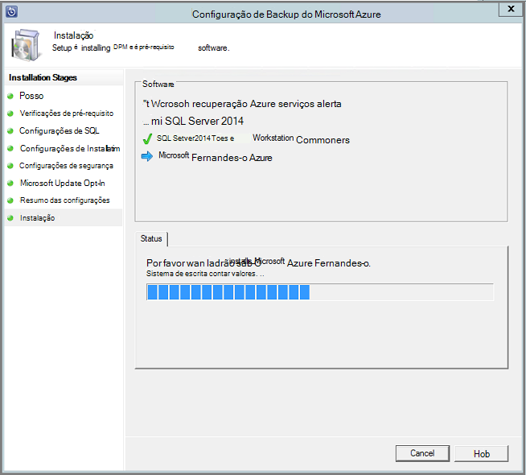


Quando a etapa de instalação estiver concluída, ícones de área de trabalho do produto terá sido criados também. Basta clicar duas vezes no ícone para iniciar o produto.

### <a name="add-backup-storage"></a>Adicionar armazenamento de backup

A primeira cópia de backup é mantida no armazenamento conectado à máquina do servidor de Backup do Azure. Para obter mais informações sobre a adição de discos, consulte [configurar pools de armazenamento e armazenamento de disco](https://technet.microsoft.com/library/hh758075.aspx).

> [AZURE.NOTE] Você precisa adicionar armazenamento de backup, mesmo se você planeja enviar dados para o Azure. Na arquitetura atual do servidor de Backup do Azure, o Backup do Azure cofre contém a *segunda* cópia dos dados enquanto o armazenamento local contém a cópia de backup primeira (e obrigatória).

## <a name="4-network-connectivity"></a>4. conectividade de rede

Servidor do Azure Backup requerem conectividade com o serviço de Backup do Azure para o produto trabalhar com êxito. Para validar se o computador possui a conectividade com o Azure, use o ```Get-DPMCloudConnection``` cmdlet no console do PowerShell de servidor de Backup do Azure. Se a saída do cmdlet for verdadeiro, então conectividade existe, else há nenhuma conectividade.

Ao mesmo tempo, a assinatura do Azure precisa estar em um estado de integridade. Para descobrir o estado da sua assinatura e gerenciá-lo, faça logon [portal de assinatura]( https://account.windowsazure.com/Subscriptions).

Quando você souber o estado da conectividade Azure e da assinatura do Azure, você pode usar a tabela a seguir para descobrir o impacto sobre a funcionalidade de backup e restauração oferecida.

| Estado de conectividade | Assinatura do Azure | Backup em Azure| Backup em disco | Restaurar a partir do Azure | Restaurar a partir de disco |
| -------- | ------- | --------------------- | ------------------- | --------------------------- | ----------------------- |
| Conectado | Ativa | Permitido | Permitido | Permitido | Permitido |
| Conectado | Expirado | Interrompido | Interrompido | Permitido | Permitido |
| Conectado | Desprovisionada | Interrompido | Interrompido | Pontos de recuperação parou e Azure excluídos | Interrompido |
| Perda de conectividade > 15 dias | Ativa | Interrompido | Interrompido | Permitido | Permitido |
| Perda de conectividade > 15 dias | Expirado | Interrompido | Interrompido | Permitido | Permitido |
| Perda de conectividade > 15 dias | Desprovisionada | Interrompido | Interrompido |  Pontos de recuperação parou e Azure excluídos | Interrompido |

### <a name="recovering-from-loss-of-connectivity"></a>Recuperando contra perda de conectividade
Se você tiver um firewall ou um proxy que está impedindo o acesso ao Azure, é necessário branca os seguintes endereços de domínio no perfil de firewall/proxy:

- www.msftncsi.com
- \*. Microsoft.com
- \*. WindowsAzure.com
- \*. microsoftonline.com
- \*. no windows.net

Depois que a conectividade com o Azure foi restaurada à máquina do servidor de Backup do Azure as operações que podem ser realizadas são determinadas pelo estado de assinatura Azure. A tabela acima tem detalhes sobre as operações permitidas depois de máquina "conectar".

### <a name="handling-subscription-states"></a>Manipulando estados de assinatura

É possível tomar uma assinatura do Azure do estado *expirado* ou *Deprovisioned* para o estado *ativo* . No entanto isso tem algumas implicações sobre o comportamento de produto, enquanto o estado não estiver *ativa*:

- Uma assinatura de *Deprovisioned* perde funcionalidade para o período que ela será desprovisionada. Sobre como ativar *ativa*, a funcionalidade do produto de backup/restauração é reativada. Os dados de backup no disco local também podem ser recuperados se ele foi mantido com um período de retenção suficientemente grande. No entanto, os dados de backup no Azure são perdidos depois que a assinatura entra no estado *Deprovisioned* .
- Uma assinatura de *expirado* somente perde funcionalidade para até que ele foi feito *ativo* novamente. Qualquer backups agendados para o período que a assinatura foi *expirado* não executará.


## <a name="troubleshooting"></a>Solução de problemas

Se o servidor de Backup do Microsoft Azure falhar com erros durante a fase de instalação (ou backup ou restaurar), consulte este [documento de códigos de erro](https://support.microsoft.com/kb/3041338) para obter mais informações.
Você também pode consultar a [que Azure Backup relacionados perguntas frequentes](backup-azure-backup-faq.md)


## <a name="next-steps"></a>Próximas etapas

Você pode obter informações detalhadas sobre como [preparar o ambiente para DPM](https://technet.microsoft.com/library/hh758176.aspx) no site da Microsoft TechNet. Ele também contém informações sobre as configurações suportadas no qual servidor de Backup do Azure podem ser implantado e usado.

Você pode usar estes artigos para obter uma compreensão mais profunda de proteção de carga de trabalho usando o servidor de Backup do Microsoft Azure.

- [Backup do SQL Server](backup-azure-backup-sql.md)
- [Backup do SharePoint server](backup-azure-backup-sharepoint.md)
- [Backup de servidor alternativo](backup-azure-alternate-dpm-server.md)
