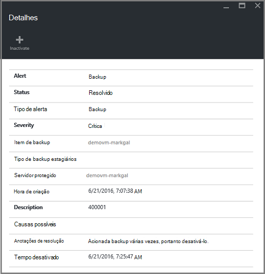
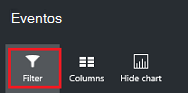

<properties
   pageTitle="Backups do Gerenciador de recursos de monitor implantado virtual machine | Microsoft Azure"
   description="Monitorar eventos e alertas de backups do Gerenciador de recursos implantados virtual machine. Envie email com base em alertas."
   services="backup"
   documentationCenter="dev-center-name"
   authors="markgalioto"
   manager="cfreeman"
   editor=""/>

<tags
ms.service="backup"
ms.workload="storage-backup-recovery"
ms.tgt_pltfrm="na"
ms.devlang="na"
ms.topic="article"
ms.date="08/25/2016"
ms.author="trinadhk; giridham;"/>

# <a name="monitor-alerts-for-azure-virtual-machine-backups"></a>Monitorar alertas Azure máquina virtual backups

Alertas são respostas do serviço que um limite de evento foi atendido ou foi ultrapassado. Saber quando iniciar de problemas pode ser fundamental para manter os custos de negócios para baixo. Alertas geralmente não ocorrem em um cronograma e, portanto, é útil saber assim que possível após a ocorram de alertas. Por exemplo, quando um trabalho de backup ou restauração falha, ocorre um alerta dentro de cinco minutos da falha. No painel Cofre, o bloco de alertas de Backup exibe eventos crítico e nível de aviso. Nas configurações de alertas de Backup, você pode exibir todos os eventos. Mas o que fazer se ocorrer um alerta quando você estiver trabalhando em uma questão separada? Se você não souber quando acontece o alerta, pode ser uma inconveniência secundária ou ele foi comprometida dados. Para garantir que as pessoas corretas estiverem cientes de um alerta - quando ela ocorre, configure o serviço para enviar notificações de alerta por email. Para obter detalhes sobre como configurar notificações por email, consulte [Configurar notificações](backup-azure-monitor-vms.md#configure-notifications).

## <a name="how-do-i-find-information-about-the-alerts"></a>Como posso encontrar informações sobre os alertas?

Para exibir informações sobre o evento que gerou um alerta, você deve abrir a lâmina de alertas de Backup. Há duas maneiras para abrir a lâmina de alertas de Backup: seja dos alertas de Backup lado a lado no painel Cofre ou da lâmina alertas e eventos.

Para abrir a lâmina de alertas de Backup de bloco de alertas de Backup:

- No bloco **Alertas de Backup** no painel Cofre, clique em **críticas** ou **Aviso** para exibir os eventos operacionais para esse nível de gravidade.

    


Para abrir a lâmina de alertas de Backup da lâmina alertas e eventos:

1. No painel Cofre, clique em **Todas as configurações**. 

2. Na lâmina **configurações** , clique em **alertas e eventos**. 

3. Na lâmina **alertas e eventos** , clique em **Alertas de Backup**. 

    A lâmina de **Alertas de Backup** abre e exibe os alertas filtrados.

    

4. Para exibir informações detalhadas sobre um determinado alerta, na lista de eventos, clique no alerta para abrir seu blade de **detalhes** .

    

    Para personalizar os atributos exibidos na lista, consulte [Exibir atributos de evento adicionais](backup-azure-monitor-vms.md#view-additional-event-attributes)

## <a name="configure-notifications"></a>Configurar notificações

 Você pode configurar o serviço para enviar notificações de email para os alertas que ocorreu pela última hora ou quando ocorrem determinados tipos de eventos.

Para configurar notificações de email para alertas

1. No menu alertas de Backup, clique em **Configurar notificações**

    

    Abre a lâmina de notificações de configurar.

    

2. Na lâmina configurar notificações, para notificações de Email, clique **em**.

    Os destinatários e gravidade diálogos tem uma estrela ao lado deles porque essas informações são necessárias. Fornecer pelo menos um endereço de email e, em seguida, selecione pelo menos um gravidade.

3. Na caixa de diálogo **destinatários (Email)** , digite os endereços de email para quem recebe as notificações. Use o formato: username@domainname.com. Separe vários endereços de email com um ponto e vírgula (;).

4. Na área de **notificação** , escolha **Por alerta** para enviar notificação quando ocorrer o alerta especificado ou **Resumo por hora** para enviar um resumo de última hora.

5. Na caixa de diálogo **gravidade** , escolha um ou mais níveis que você deseja disparar notificação por email.

6. Clique em **Salvar**.
### <a name="what-alert-types-are-available-for-azure-iaas-vm-backup"></a>Que tipos de alerta estão disponíveis para backup de máquina virtual do Azure IaaS?
| Nível de alerta  | Alertas enviados |
| ------------- | ------------- |
| Crítica | Falha de backup, falha de recuperação  |
| Aviso  | Nenhum |
| Informativo  | Nenhum  |

### <a name="are-there-situations-where-email-isnt-sent-even-if-notifications-are-configured"></a>Há casos onde o email não é enviado mesmo se notificações são configuradas?

Há situações em que um alerta não for enviado, embora as notificações foram configuradas corretamente. O email de situações a seguir não serão enviadas notificações para evitar o ruído de alerta:

- Se as notificações são configuradas para resumo por hora e um alerta é gerado e resolvido na hora.
- O trabalho será cancelado.
- Um trabalho de backup é disparado e, em seguida, falha e outro trabalho de backup está em andamento.
- Inicia um trabalho de backup agendado para uma máquina virtual habilitados no Gerenciador de recursos, mas a máquina virtual não existe mais.

## <a name="customize-your-view-of-events"></a>Personalizar a exibição de eventos

A configuração de **logs de auditoria** vem com um conjunto de filtros e colunas mostrando informações de evento operacional predefinido. Você pode personalizar o modo de exibição para que quando a lâmina de **eventos** abre, ele mostra as informações desejadas.

1. No [Painel de controle do cofre](./backup-azure-manage-vms.md#open-a-recovery-services-vault-in-the-dashboard), procure e clique em **Logs de auditoria** para abrir a lâmina de **eventos** .

    

    A lâmina de **eventos** abre os eventos operacionais filtrados apenas para o cofre atual.

    

    A lâmina mostra a lista de crítica, erro, aviso e informativos eventos que ocorreram na semana passada. O período de tempo é um valor padrão definido no **filtro**. A lâmina de **eventos** também mostra um gráfico de barras acompanhar quando o evento ocorreu. Se você não quiser ver o gráfico de barras, no menu **eventos** , clique em **Ocultar gráfico** para alternar fora do gráfico. O modo padrão de eventos mostra informações de operação, nível, Status, recursos e tempo. Para obter informações sobre expor os atributos de evento adicionais, consulte a seção [expandindo informações do evento](backup-azure-monitor-vms.md#view-additional-event-attributes).

2. Para obter informações adicionais sobre um evento operacional, na coluna da **operação** , clique em um evento operacional para abrir seu blade. A lâmina contém informações detalhadas sobre os eventos. Eventos são agrupados por sua ID de correlação e uma lista dos eventos que ocorreram do período.

    

3. Para exibir informações detalhadas sobre um evento particular, na lista de eventos, clique no evento para abrir seu blade de **detalhes** .

    

    As informações de nível de eventos são tão detalhadas como obtém as informações. Se você prefere vendo essa quantidade informações sobre cada evento e gostaria de adicionar essa quantidade detalhes lâmina **eventos** , consulte a seção [expandindo informações do evento](backup-azure-monitor-vms.md#view-additional-event-attributes).


## <a name="customize-the-event-filter"></a>Personalizar o filtro de evento
Use o **filtro** para ajustar ou escolher as informações que aparecem em uma lâmina particular. Para filtrar as informações do evento:

1. No [Painel de controle do cofre](./backup-azure-manage-vms.md#open-a-recovery-services-vault-in-the-dashboard), procure e clique em **Logs de auditoria** para abrir a lâmina de **eventos** .

    

    A lâmina de **eventos** abre os eventos operacionais filtrados apenas para o cofre atual.

    

2. No menu de **eventos** , clique em **filtro** para abrir essa lâmina.

    

3. Na lâmina **filtro** , ajuste os filtros de **nível**, **período de tempo**e **chamador** . Os outros filtros não estão disponíveis depois que foram definidas para fornecer as informações atuais para o Cofre de serviços de recuperação.

    

    Você pode especificar o **nível** de evento: crítica, erro, aviso ou informativo. Você pode escolher qualquer combinação de níveis de evento, mas você deve ter pelo menos um nível selecionado. Ative ou desativar a opção o nível. O filtro de **período de tempo** permite que você especifique o período de tempo para capturar eventos. Se você usar um intervalo de tempo personalizado, você pode definir as horas de início e término.

4. Quando você estiver pronto para os logs de operações usando o filtro de consulta, clique em **Atualizar**. Os resultados exibidos na lâmina **eventos** .

    


### <a name="view-additional-event-attributes"></a>Exibir atributos de evento adicionais
Usando o botão de **colunas** , você pode habilitar atributos de evento adicionais para aparecer na lista na lâmina **eventos** . A lista padrão de eventos exibe informações de operação, nível, Status, recursos e tempo. Para habilitar atributos adicionais:

1. Na lâmina **eventos** , clique em **colunas**.

    

    Abre a lâmina **Escolher colunas** .

    

2. Para selecionar o atributo, clique na caixa de seleção. Ativa e desativa a caixa de seleção de atributo.

3. Clique em **Redefinir** para redefinir a lista de atributos na lâmina **eventos** . Após adicionar ou remover atributos da lista, use **Redefinir** para exibir a nova lista de atributos de evento.

4. Clique em **Atualizar** para atualizar os dados dos atributos de evento. A tabela a seguir fornece informações sobre cada atributo.

| Nome da coluna      |Descrição|
| -----------------|-----------|
| Operação|O nome da operação|
| Nível|O nível da operação, valores podem ser: informativo, aviso, erro ou crítica|
|Status|Estado descritivo da operação|
|Recurso|URL que identifica o recurso; também conhecido como a identificação do recurso|
|Tempo|Tempo, medido da hora atual, quando o evento ocorreu|
|Chamador|Quem ou o que chamado ou disparou o evento; pode ser o sistema ou um usuário|
|Carimbo de hora|A hora em que o evento foi acionado|
|Grupo de recursos|O grupo de recursos associados|
|Tipo de recurso|O tipo de recurso interno usado pelo Gerenciador de recursos|
|ID da assinatura|A ID da assinatura associada|
|Categoria|Categoria do evento|
|ID de correlação|Identificação comum para eventos relacionados|


## <a name="use-powershell-to-customize-alerts"></a>Usar o PowerShell para personalizar alertas
Você pode obter notificações de alerta personalizadas para os trabalhos no portal. Para acessar esses trabalhos, defina regras de alerta baseada no PowerShell nos eventos logs operacionais. Use *PowerShell versão 1.3.0 ou posterior*.

Para definir uma notificação personalizada para o alerta para falhas de backup, use um comando como o script a seguir:

```
PS C:\> $actionEmail = New-AzureRmAlertRuleEmail -CustomEmail contoso@microsoft.com
PS C:\> Add-AzureRmLogAlertRule -Name backupFailedAlert -Location "East US" -ResourceGroup RecoveryServices-DP2RCXUGWS3MLJF4LKPI3A3OMJ2DI4SRJK6HIJH22HFIHZVVELRQ-East-US -OperationName Microsoft.Backup/RecoveryServicesVault/Backup -Status Failed -TargetResourceId /subscriptions/86eeac34-eth9a-4de3-84db-7a27d121967e/resourceGroups/RecoveryServices-DP2RCXUGWS3MLJF4LKPI3A3OMJ2DI4SRJK6HIJH22HFIHZVVELRQ-East-US/providers/microsoft.backupbvtd2/RecoveryServicesVault/trinadhVault -Actions $actionEmail
```

**Identificação de recurso** : você pode obter identificação de recurso dos logs de auditoria. A identificação de recurso é uma URL fornecida na coluna recursos dos logs de operação.

**OperationName** : OperationName está no formato "Microsoft.RecoveryServices/recoveryServicesVault/*EventName*" onde *EventName* pode ser:<br/>
- Registrar <br/>
- Cancelar o registro <br/>
- ConfigureProtection <br/>
- Backup <br/>
- Restaurar <br/>
- StopProtection <br/>
- DeleteBackupData <br/>
- CreateProtectionPolicy <br/>
- DeleteProtectionPolicy <br/>
- UpdateProtectionPolicy <br/>

**Status** : valores suportados são iniciado, êxito ou falha.

**ResourceGroup** : Este é o grupo de recursos ao qual o recurso pertence. Você pode adicionar a coluna de grupo de recursos para os logs gerados. Grupo de recursos é um dos tipos de informações de evento disponíveis.

**Nome** : nome da regra de alerta.

**CustomEmail** : especificar o endereço de email personalizado ao qual você deseja enviar uma notificação de alerta

**SendToServiceOwners** : esta opção envia notificações de alerta para todos os administradores e colaboradores da assinatura. Pode ser usado em cmdlet **New-AzureRmAlertRuleEmail**

### <a name="limitations-on-alerts"></a>Limitações de alertas
Alertas baseados em eventos estão sujeitas as seguintes limitações:

1. Alertas são disparadas em todas as máquinas virtuais no cofre de serviços de recuperação. Você não poderá personalizar o alerta para um subconjunto de máquinas virtuais em um cofre de serviços de recuperação.
2. Este recurso está no modo de visualização. [Saiba Mais](../monitoring-and-diagnostics/insights-powershell-samples.md#create-alert-rules)
3. Alertas são enviados do "alerts-noreply@mail.windowsazure.com". Atualmente, você não pode modificar o remetente de email.


## <a name="next-steps"></a>Próximas etapas

Logs de eventos habilitar post-mortem excelente e suporte para operações de backup de auditoria. As seguintes operações são registradas:

- Registrar
- Cancelar o registro
- Configurar a proteção
- Backup (ambos agendados, além de backup por demanda)
- Restaurar
- Parar proteção
- Excluir dados de backup
- Adicionar política
- Excluir diretiva
- Política de atualização
- Cancelar trabalho

Para obter uma explicação ampla de eventos, operações e logs de auditoria entre os serviços do Azure, consulte o artigo, [Exibir eventos e logs de auditoria](../monitoring-and-diagnostics/insights-debugging-with-events.md).

Para obter informações sobre como recriar uma máquina virtual de um ponto de recuperação, confira [Restaurar VMs do Azure](backup-azure-restore-vms.md). Se precisar de informações sobre como proteger suas máquinas virtuais, consulte [primeiro ver: fazer backup de VMs a um cofre de serviços de recuperação](backup-azure-vms-first-look-arm.md). Saiba mais sobre as tarefas de gerenciamento backups de máquina virtual no artigo, [backups de máquina virtual do Azure gerenciar](backup-azure-manage-vms.md).
