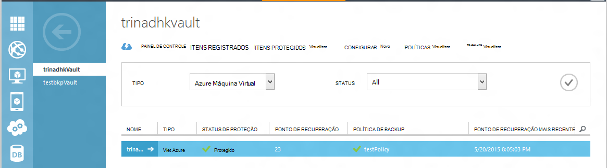
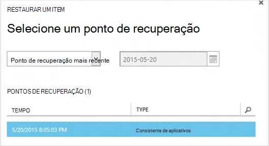
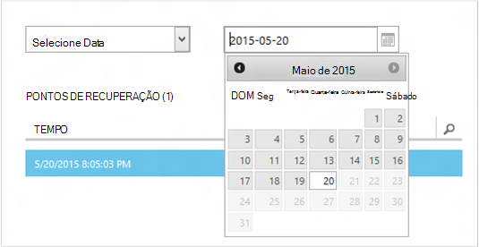
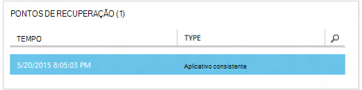
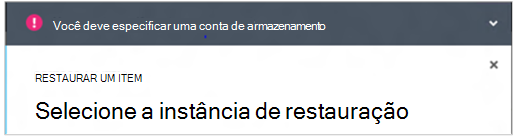
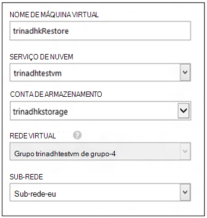
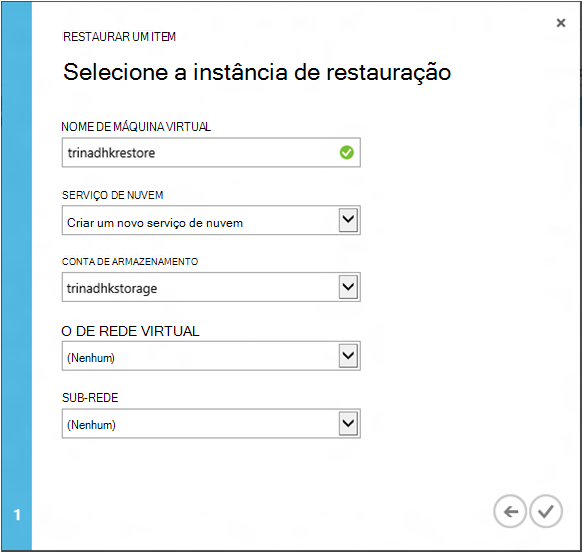
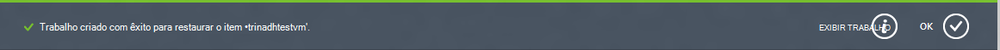
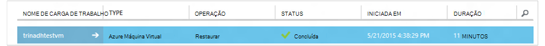

<properties
    pageTitle="Restaurar um máquinas virtuais de backup | Microsoft Azure"
    description="Saiba como restaurar uma máquina virtual Azure a partir de um ponto de recuperação"
    services="backup"
    documentationCenter=""
    authors="trinadhk"
    manager="shreeshd"
    editor=""
    keywords="Restaurar backup; como restaurar; ponto de recuperação;"/>

<tags
    ms.service="backup"
    ms.workload="storage-backup-recovery"
    ms.tgt_pltfrm="na"
    ms.devlang="na"
    ms.topic="article"
    ms.date="08/02/2016"
    ms.author="trinadhk; jimpark;"/>

# Restaurar máquinas virtuais no Azure

> [AZURE.SELECTOR]
- [Restaurar VMs no portal do Azure](backup-azure-arm-restore-vms.md)
- [Restaurar VMs no portal de clássico](backup-azure-restore-vms.md)

Restaure uma máquina virtual para uma nova VM dos backups armazenados em um cofre backup Azure com as seguintes etapas.

## Restaurar o fluxo de trabalho

### 1. Escolha um item para restaurar

1. Navegue até a guia **Itens protegidos** e selecione a máquina virtual que você deseja restaurar para uma nova VM.

    

    A coluna de **Ponto de recuperação** na página **Itens protegido** informará o número de pontos de recuperação para uma máquina virtual. A coluna de **Ponto de recuperação do mais novo** informa a hora do backup mais recente do qual uma máquina virtual podem ser restaurada.

2. Clique em **Restaurar** para abrir o assistente **restaurar um Item** .

    

### 2. Escolha um ponto de recuperação

1. Na tela **Selecionar um ponto de recuperação** , você pode restaurar do ponto de recuperação mais recente ou de um ponto anterior no tempo. A opção padrão selecionada quando o assistente é aberto é o *Ponto de recuperação do mais novo*.

    

2. Para escolher um ponto anterior no tempo, escolha a opção de **Selecionar data** na lista suspensa e selecione uma data no controle de calendário, clicando no **ícone de calendário**. No controle, todas as datas que têm pontos de recuperação são preenchidas com um tom de cinza claro em são selecionáveis pelo usuário.

    

    Depois de clicar em uma data no controle de calendário, a recuperação pontos disponíveis em que data será mostrada na tabela de pontos de recuperação abaixo. A coluna de **hora** indica a hora em que o instantâneo foi criado. A coluna **tipo** exibe a [consistência](https://azure.microsoft.com/documentation/articles/backup-azure-vms/#consistency-of-recovery-points) do ponto de recuperação. Cabeçalho da tabela mostra o número de pontos de recuperação disponíveis nesse dia entre parênteses.

    

3. Selecione o ponto de recuperação da tabela de **Pontos de recuperação** e clique na seta próximo para ir para a próxima tela.

### 3. Especifique um local de destino

1. Na tela **Selecione Restaurar instância** especifique detalhes de onde restaurar a máquina virtual.

  - Especifique o nome de máquina virtual: em um serviço de nuvem determinado, o nome de máquina virtual deve ser exclusivo. Não oferecemos suporte excesso escrevendo máquina virtual existente. 
  - Selecione um serviço de nuvem para a máquina virtual: isso é obrigatório para a criação de uma máquina virtual. Você pode optar por usar um serviço de nuvem existente ou criar um novo serviço de nuvem.

        Whatever cloud service name is picked should be globally unique. Typically, the cloud service name gets associated with a public-facing URL in the form of [cloudservice].cloudapp.net. Azure will not allow you to create a new cloud service if the name has already been used. If you choose to create select create a new cloud service, it will be given the same name as the virtual machine – in which case the VM name picked should be unique enough to be applied to the associated cloud service.

        We only display cloud services and virtual networks that are not associated with any affinity groups in the restore instance details. [Learn More](../virtual-network/virtual-networks-migrate-to-regional-vnet.md).

2. Selecione uma conta de armazenamento para a máquina virtual: isso é obrigatório para criar a máquina virtual. Você pode selecionar as contas de armazenamento existentes na mesma região como o Cofre de Backup do Azure. Não oferecemos suporte a contas de armazenamento que são redundante ou do tipo de armazenamento de Premium de zona.

    Se não houver nenhuma contas de armazenamento com configuração compatível, crie uma conta de armazenamento de configuração suportada antes de iniciar a operação de restauração.

    

3. Selecione uma rede Virtual: A rede virtual (VNET) para a máquina virtual deve ser selecionada no momento da criação a máquina virtual. A restauração UI mostra todas as VNETs dentro esta assinatura que podem ser usadas. Não é obrigatório para selecionar um VNET para a máquina virtual restaurada – você será capaz de se conectar à máquina virtual restaurada pela internet mesmo se o VNET não será aplicada.

    Se o serviço de nuvem selecionado está associado uma rede virtual, você não pode alterar a rede virtual.

    

4. Selecione uma sub-rede: caso a VNET tem sub-redes, por padrão a primeira sub-rede será selecionada. Escolha a sub-rede de sua escolha entre as opções de menu suspenso. Para obter detalhes de sub-rede, vá para a extensão de redes na [home page do portal](https://manage.windowsazure.com/), vá para **Redes virtuais** e selecione a rede virtual e fazer busca detalhada em Configurar para ver detalhes de sub-rede.

    

5. Clique no ícone de **Enviar** no Assistente para enviar os detalhes e criar um trabalho de restauração.

## Controlar a operação de restauração
Depois de todas as informações para o Assistente de restauração de entrada e enviá-lo Azure Backup tentará criar um trabalho para controlar a operação de restauração.

Se a criação de trabalho for bem-sucedido, você verá uma notificação do sistema indicando que o trabalho é criado. Você pode obter mais detalhes, clicando no botão **Exibir trabalho** que o levarão a guia **trabalhos** .

Quando a operação de restauração for concluída, ele será marcado como concluídos na guia **trabalhos** .

Após restaurar a máquina virtual, você talvez precise instalar novamente as extensões existente na máquina virtual original e [modificar os pontos de extremidade](../virtual-machines/virtual-machines-windows-classic-setup-endpoints.md) da máquina virtual no portal do Azure.

## Etapas de pós-restauração
Se você estiver usando uma distribuição de Linux com base em nuvem-inicialização como Ubuntu, por razões de segurança, senha será bloqueada postar restauração. Use a extensão de VMAccess na VM restaurado para [Redefinir a senha](../virtual-machines/virtual-machines-linux-classic-reset-access.md). É recomendável usar teclas SSH essas distribuições para evitar a redefinição de senha postagem restauração. 

## Backup para VMs restauradas
Se você tiver restaurado máquina virtual ao serviço de nuvem mesmo com o mesmo nome conforme originalmente backup máquina virtual, backup continuará a restauração de postagem de máquina virtual. Se você tiver restaurado máquina virtual para um serviço de nuvem diferente ou especificar um nome diferente para máquina virtual restaurado, isso será tratado como uma nova VM e você precisa fazer backup de configuração para máquina virtual restaurado.

## Restaurando uma máquina virtual durante Azure desastre do data center
Backup Azure permite restaurando backup VMs para o Centro de dados pares caso dados primários centralizar onde VMs estiver executando experiências desastres e você configurou Cofre de Backup para ser redundante de localização geográfica. Durante esses cenários, você precisa selecionar uma conta de armazenamento que está presente em pares de data center e resto do processo de restauração permanece o mesmo. Backup Azure usa o serviço de computação de par geográfica para criar a máquina virtual restaurada. 

## Restaurando VMs de controlador de domínio
Backup de máquinas virtuais de controlador de domínio (DC) é um cenário compatível com o Backup do Azure. No entanto alguns deve ter cuidado durante o processo de restauração. A experiência de restauração é muito diferente para VMs de controlador de domínio em uma configuração de único-DC versus VMs em uma configuração de multi-DC.

### Único DC
A máquina virtual pode ser restaurada (como qualquer outra máquina virtual) a partir do Azure portal ou usando o PowerShell.

### Vários controladores de domínio
Quando você tem um ambiente de multi-DC, controladores de domínio tem sua própria maneira de manter os dados em sincronia. Quando um ponto de backup mais antigo for restaurado *sem as precauções adequadas*, o processo de reversão do USN pode causar um grande em um ambiente de multi-DC. A maneira correta de recuperar uma máquina de virtual é inicializá-lo no modo DSRM.

O desafio surge porque modo DSRM não está presente no Azure. Portanto para restaurar uma máquina de virtual, você não pode usar o portal do Azure. A única suportada restauração mecanismo é restauração baseado em disco usando o PowerShell.

>[AZURE.WARNING] Para VMs do controlador de domínio em um ambiente de multi-DC, não use o portal do Azure para restauração! Há suporte para a restauração somente do PowerShell com base

Leia mais sobre o [problema de reversão do USN](https://technet.microsoft.com/library/dd363553) e as estratégias sugeridas para corrigi-lo.

## Restaurando VMs com configurações de rede especial
Backup Azure oferece suporte a backup para acompanhar as configurações de rede especial de máquinas virtuais.

- VMs em balanceador de carga (interna e externa)
- VMs com vários IPs reservadas
- VMs com várias placas de rede

Essas configurações determinam seguindo considerações ao restaurá-los.

>[AZURE.TIP] Use o fluxo de restauração do PowerShell com base para recriar a configuração de rede especiais de VMs postagem restauração.

### Restaurando dados da interface do usuário:
Durante a restauração de interface do usuário, **Escolha sempre um novo serviço de nuvem**. Observe que, desde que portal leva apenas obrigatório parâmetros durante a restauração fluxo, VMs restaurados usando a interface do usuário perderá a configuração de rede especial que eles possuem. Em outras palavras, restauração VMs será normais VMs sem configuração de Balanceador de carga ou vários NIC ou vários IP reservado.

### Restaurando do PowerShell:
PowerShell tem a capacidade de apenas os restaure máquina virtual de backup e não criar a máquina virtual. Isso é útil ao restaurar máquinas virtuais que exigem mentined de configurações de rede especiais acima.

Para recriar totalmente os discos restaurando de postagem de máquina virtual, siga estas etapas:

1. Restaure do cofre backup usando o [PowerShell Backup do Azure](../backup-azure-vms-classic-automation.md#restore-an-azure-vm)

2. Criar a configuração de máquina virtual necessária para o balanceador de carga / vários IP reservado NIC/múltiplo usando os cmdlets do PowerShell e use-os para criar a máquina virtual do desejado configuração.
    - Criar máquina virtual no serviço de nuvem com [balanceador de carga interno](https://azure.microsoft.com/documentation/articles/load-balancer-internal-getstarted/)
    - Criar máquina virtual para se conectar ao [Internet opostas balanceador de carga] (https://azure.microsoft.com/en-us/documentation/articles/load-balancer-internet-getstarted/)
    - Criar máquina virtual com [várias placas de rede](https://azure.microsoft.com/documentation/articles/virtual-networks-multiple-nics/)
    - Criar máquina virtual com [vários IPs reservados](https://azure.microsoft.com/documentation/articles/virtual-networks-reserved-public-ip/)

## Próximas etapas
- [Solucionando problemas de erros](backup-azure-vms-troubleshoot.md#restore)
- [Gerenciar máquinas virtuais](backup-azure-manage-vms.md)
