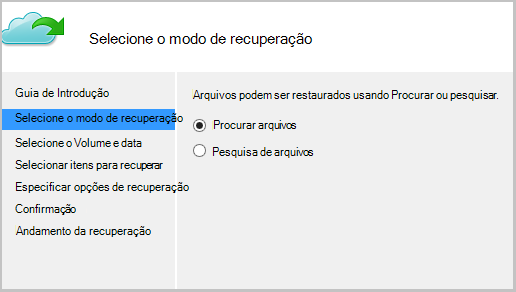
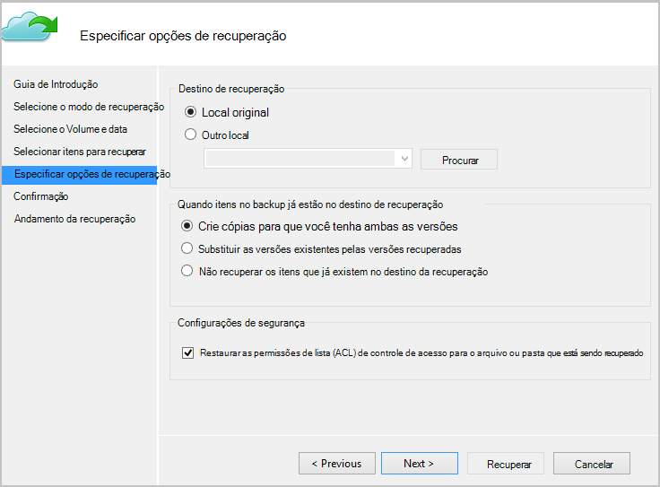

<properties
   pageTitle="Restaurar dados para um cliente do Windows ou o Windows Server do Azure usando o modelo clássico de implantação | Microsoft Azure"
   description="Saiba como restaurar a partir de um cliente do Windows ou o Windows Server."
   services="backup"
   documentationCenter=""
   authors="saurabhsensharma"
   manager="shivamg"
   editor=""/>

<tags
   ms.service="backup"
   ms.workload="storage-backup-recovery"
     ms.tgt_pltfrm="na"
     ms.devlang="na"
     ms.topic="article"
     ms.date="08/02/2016"
     ms.author="trinadhk; jimpark; markgal;"/>

# Restaurar arquivos em um Windows server ou máquina de cliente do Windows usando o modelo clássico de implantação

> [AZURE.SELECTOR]
- [Portal clássico](backup-azure-restore-windows-server-classic.md)
- [Portal do Azure](backup-azure-restore-windows-server.md)

Este artigo aborda as etapas necessárias para executar dois tipos de operações de restauração:

- Restaure dados à mesma máquina do qual os backups foram feitos.
- Restaure dados para qualquer outro computador.

Em ambos os casos, os dados são recuperados do cofre Backup do Azure.

[AZURE.INCLUDE [learn-about-deployment-models](../../includes/learn-about-deployment-models-classic-include.md)]

## Recuperar dados à mesma máquina
Se você acidentalmente excluído um arquivo e deseja restaurá-lo à mesma máquina (do qual o backup é feito), as etapas a seguir o ajudará a recuperar os dados.

1. Abra o **Backup do Microsoft Azure** snap-in.
2. Clique em **Recuperar dados** para iniciar o fluxo de trabalho.

    

3. Selecione o * *este servidor (*yourmachinename*) * * opção para restaurar o backup arquivo na mesma máquina.

    

4. Escolha para **Procurar arquivos** ou **Procurar arquivos**.

    Deixe a opção padrão se você pretende restaurar um ou mais arquivos cujo caminho é conhecido. Se você não tiver certeza sobre a estrutura da pasta, mas gostaria de pesquisar um arquivo, escolha a opção de **pesquisa de arquivos** . Para fins desta seção, podemos continuará com a opção padrão.

    

5. Selecione o volume do qual você deseja restaurar o arquivo.

    Você pode restaurar de qualquer ponto no tempo. Datas que aparecem em **negrito** no controle de calendário indicam a disponibilidade de um ponto de restauração. Depois de uma data é selecionada, com base em seu agendamento de backup (e o sucesso de uma operação de backup), você pode selecionar um ponto no tempo na lista suspensa de **tempo** para baixo.

    

6. Selecione os itens para recuperar. Você pode seleção múltipla pastas/arquivos que deseja restaurar.

    

7. Especifique os parâmetros de recuperação.

    

  - Você tem uma opção de restauração no local original (no qual o arquivo/pasta será sobrescrito) ou em outro local na mesma máquina.
  - Se o arquivo/pasta que você deseja restaurar existir no local de destino, você pode criar cópias (duas versões do mesmo arquivo), substituir os arquivos no local de destino ou ignorar a recuperação dos arquivos que existe no destino.
  - É altamente recomendável que você deixe a opção de padrão de restaurar as ACLs em arquivos que estão sendo recuperados.

8. Depois que essas entradas são fornecidas, clique em **Avançar**. O fluxo de trabalho de recuperação, que restaura os arquivos para esta máquina, começará.

## Recuperar a uma máquina alternativa
Se o servidor inteiro for perdido, você ainda poderá recuperar dados de Backup do Azure para uma máquina diferente. As etapas a seguir ilustram o fluxo de trabalho.  

Inclui a terminologia usada nestas etapas:

- *Máquina de origem* – máquina original do que o backup foi feito e que está disponível no momento.
- *Máquina de destino* – o computador para o qual os dados serão recuperados.
- *Compartimento de amostra* – cofre o Backup à qual a *máquina de origem* e *destino de máquina* são registradas.  

> [AZURE.NOTE] Backups tirados de uma máquina não podem ser restaurados em um computador que esteja executando uma versão anterior do sistema operacional. Por exemplo, se são realizados backups de uma máquina do Windows 7, ele poderá ser restaurado em um Windows 8 ou acima de máquina. No entanto, as exibições visuais não verdadeiras.

1. Abra o **Backup do Microsoft Azure** snap-in na *máquina de destino*.
2. Certifique-se de que a *máquina de destino* e *máquina de origem* são registrados para o mesmo compartimento de backup.
3. Clique em **Recuperar dados** para iniciar o fluxo de trabalho.

    

4. Selecione **outro servidor**

    

5. Forneça o arquivo de credencial do cofre que corresponde ao *cofre de amostra*. Se o arquivo de credencial cofre é inválido (ou expirado) Baixe um novo arquivo de credencial do cofre do *cofre de amostra* no portal de clássico do Azure. Depois que o arquivo de credencial cofre for fornecido, o backup cofre contra o arquivo de credencial cofre é exibido.

6. Selecione a *máquina de origem* na lista de máquinas exibidas.

    

7. Selecione a opção **Procurar arquivos** ou **Procurar arquivos** . Para fins desta seção, usaremos a opção de **pesquisa de arquivos** .

    

8. Selecione o volume e a data na próxima tela. Procure o nome de arquivo/pasta que você deseja restaurar.

    

9. Selecione o local onde os arquivos precisam ser restaurados.

    

10. Fornece a senha de criptografia fornecidas durante o registro de *máquina de origem* *cofre de amostra*.

    

11. Depois que a entrada é fornecida, clique em **recuperar**, que aciona a restauração de backup dos arquivos para o destino fornecido.

## Próximas etapas
- [Perguntas frequentes sobre Backup Azure](backup-azure-backup-faq.md)
- Visite o [Fórum de Backup Azure](http://go.microsoft.com/fwlink/p/?LinkId=290933).

## Saiba Mais
- [Visão geral de Backup Azure](http://go.microsoft.com/fwlink/p/?LinkId=222425)
- [Backup máquinas virtuais Azure](backup-azure-vms-introduction.md)
- [Backup cargas de trabalho Microsoft](backup-azure-dpm-introduction.md)
