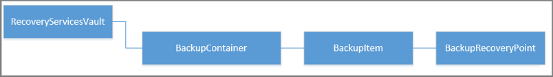

<properties
   pageTitle="Implantar e gerenciar backups para VMs implantado Gerenciador de recursos usando o PowerShell | Microsoft Azure"
   description="Usar o PowerShell para implantar e gerenciar backups no Azure para VMs implantado Gerenciador de recursos"
   services="backup"
   documentationCenter=""
   authors="markgalioto"
   manager="cfreeman"
   editor=""/>

<tags
   ms.service="backup"
   ms.devlang="na"
   ms.topic="article"
   ms.tgt_pltfrm="na"
   ms.workload="storage-backup-recovery"
   ms.date="08/03/2016"
   ms.author="markgal; trinadhk"/>

# <a name="deploy-and-manage-backups-for-resource-manager-deployed-vms-using-powershell"></a>Implantar e gerenciar backups para VMs implantado Gerenciador de recursos usando o PowerShell

> [AZURE.SELECTOR]
- [Gerenciador de recursos](backup-azure-vms-automation.md)
- [Clássico](backup-azure-vms-classic-automation.md)

Este artigo mostra como usar cmdlets do PowerShell do Azure para fazer backup e recuperar uma Azure virtuais de máquina de um cofre de serviços de recuperação. Um cofre de serviços de recuperação é um recurso do Gerenciador de recursos do Azure e é usado para proteger dados e ativos nos serviços do Azure Backup e recuperação de Site do Azure. Você pode usar um cofre de serviços de recuperação de proteger VMs implantado Gerenciador de serviços do Azure, bem como VMs implantadas Gerenciador de recursos do Azure.

>[AZURE.NOTE] Azure tem dois modelos de implantação para criar e trabalhar com recursos: [Gerenciador de recursos e clássico](../resource-manager-deployment-model.md). Este artigo é para uso com VMs criadas usando o modelo do Gerenciador de recursos.

Este artigo o orienta usando o PowerShell para proteger uma máquina virtual e restaurar dados de um ponto de recuperação.

## <a name="concepts"></a>Conceitos

Se você não estiver familiarizado com o serviço de Backup do Azure, para uma visão geral do serviço, confira [o que é o Backup do Azure?](backup-introduction-to-azure-backup.md) Antes de começar, certifique-se de que você está abordando as Noções básicas sobre os pré-requisitos necessários para trabalhar com o Backup do Azure e as limitações da solução backup máquina virtual atual.

Para poder usar o PowerShell eficaz, é necessário entender a hierarquia de objetos e de onde começar.


Para exibir a referência de cmdlet do AzureRmRecoveryServicesBackup PowerShell, consulte o [Azure Backup - Cmdlets de serviços de recuperação](https://msdn.microsoft.com/library/mt723320.aspx) na biblioteca do Azure.
Para exibir a referência de cmdlet do AzureRmRecoveryServicesVault PowerShell, consulte os [Cmdlets de serviço de recuperação do Azure](https://msdn.microsoft.com/library/mt643905.aspx).


## <a name="setup-and-registration"></a>Instalação e registro

Para começar:

1. [Baixar a versão mais recente do PowerShell](https://github.com/Azure/azure-powershell/releases) (a versão mínima necessária é: 1.4.0)

2. Localize cmdlets do PowerShell de Backup do Azure disponível digitando o seguinte comando:

```
PS C:\> Get-Command *azurermrecoveryservices*

CommandType     Name                                               Version    Source
-----------     ----                                               -------    ------
Cmdlet          Backup-AzureRmRecoveryServicesBackupItem           1.4.0      AzureRM.RecoveryServices.Backup
Cmdlet          Disable-AzureRmRecoveryServicesBackupProtection    1.4.0      AzureRM.RecoveryServices.Backup
Cmdlet          Enable-AzureRmRecoveryServicesBackupProtection     1.4.0      AzureRM.RecoveryServices.Backup
Cmdlet          Get-AzureRmRecoveryServicesBackupContainer         1.4.0      AzureRM.RecoveryServices.Backup
Cmdlet          Get-AzureRmRecoveryServicesBackupItem              1.4.0      AzureRM.RecoveryServices.Backup
Cmdlet          Get-AzureRmRecoveryServicesBackupJob               1.4.0      AzureRM.RecoveryServices.Backup
Cmdlet          Get-AzureRmRecoveryServicesBackupJobDetails        1.4.0      AzureRM.RecoveryServices.Backup
Cmdlet          Get-AzureRmRecoveryServicesBackupManagementServer  1.4.0      AzureRM.RecoveryServices.Backup
Cmdlet          Get-AzureRmRecoveryServicesBackupProperties        1.4.0      AzureRM.RecoveryServices
Cmdlet          Get-AzureRmRecoveryServicesBackupProtectionPolicy  1.4.0      AzureRM.RecoveryServices.Backup
Cmdlet          Get-AzureRMRecoveryServicesBackupRecoveryPoint     1.4.0      AzureRM.RecoveryServices.Backup
Cmdlet          Get-AzureRmRecoveryServicesBackupRetentionPolic... 1.4.0      AzureRM.RecoveryServices.Backup
Cmdlet          Get-AzureRmRecoveryServicesBackupSchedulePolicy... 1.4.0      AzureRM.RecoveryServices.Backup
Cmdlet          Get-AzureRmRecoveryServicesVault                   1.4.0      AzureRM.RecoveryServices
Cmdlet          Get-AzureRmRecoveryServicesVaultSettingsFile       1.4.0      AzureRM.RecoveryServices
Cmdlet          New-AzureRmRecoveryServicesBackupProtectionPolicy  1.4.0      AzureRM.RecoveryServices.Backup
Cmdlet          New-AzureRmRecoveryServicesVault                   1.4.0      AzureRM.RecoveryServices
Cmdlet          Remove-AzureRmRecoveryServicesProtectionPolicy     1.4.0      AzureRM.RecoveryServices.Backup
Cmdlet          Remove-AzureRmRecoveryServicesVault                1.4.0      AzureRM.RecoveryServices
Cmdlet          Restore-AzureRMRecoveryServicesBackupItem          1.4.0      AzureRM.RecoveryServices.Backup
Cmdlet          Set-AzureRmRecoveryServicesBackupProperties        1.4.0      AzureRM.RecoveryServices
Cmdlet          Set-AzureRmRecoveryServicesBackupProtectionPolicy  1.4.0      AzureRM.RecoveryServices.Backup
Cmdlet          Set-AzureRmRecoveryServicesVaultContext            1.4.0      AzureRM.RecoveryServices
Cmdlet          Stop-AzureRmRecoveryServicesBackupJob              1.4.0      AzureRM.RecoveryServices.Backup
Cmdlet          Unregister-AzureRmRecoveryServicesBackupContainer  1.4.0      AzureRM.RecoveryServices.Backup
Cmdlet          Unregister-AzureRmRecoveryServicesBackupManagem... 1.4.0      AzureRM.RecoveryServices.Backup
Cmdlet          Wait-AzureRmRecoveryServicesBackupJob              1.4.0      AzureRM.RecoveryServices.Backup
```


As seguintes tarefas podem ser automatizadas com o PowerShell:

- Criar um cofre de serviços de recuperação
- Fazer backup ou proteger VMs do Azure
- Disparar um trabalho de backup
- Monitorar um trabalho de backup
- Restaurar uma máquina virtual Azure

## <a name="create-a-recovery-services-vault"></a>Criar um cofre de serviços de recuperação

As etapas a seguir levá-lo durante a criação de um cofre de serviços de recuperação. Um cofre de serviços de recuperação é diferente de um cofre de Backup.

1. Se você estiver usando o Backup do Azure pela primeira vez, você deve usar o cmdlet do **[Registro AzureRMResourceProvider](https://msdn.microsoft.com/library/mt679020.aspx)** para registrar o provedor de serviço de recuperação do Azure com sua assinatura.

    ```
    PS C:\> Register-AzureRmResourceProvider -ProviderNamespace "Microsoft.RecoveryServices"
    ```

2. O Cofre de serviços de recuperação é um recurso do Gerenciador de recursos, então você precisa colocá-lo dentro de um grupo de recursos. Você pode usar um grupo de recursos existente ou crie um novo grupo de recursos com o cmdlet **[New-AzureRmResourceGroup](https://msdn.microsoft.com/library/mt678985.aspx)** . Ao criar um novo grupo de recursos, especifique o nome e local para o grupo de recursos.  

    ```
    PS C:\> New-AzureRmResourceGroup –Name "test-rg" –Location "West US"
    ```

3. Use o cmdlet **[New-AzureRmRecoveryServicesVault](https://msdn.microsoft.com/library/mt643910.aspx)** para criar o novo cofre. Certifique-se de especificar o mesmo local para o cofre como foi usado para o grupo de recursos.

    ```
    PS C:\> New-AzureRmRecoveryServicesVault -Name "testvault" -ResourceGroupName " test-rg" -Location "West US"
    ```

4. Especificar o tipo de redundância de armazenamento para usar; Você pode usar o [Armazenamento localmente redundantes (LRS)](../storage/storage-redundancy.md#locally-redundant-storage) ou [Geográfica redundantes armazenamento (GRS)](../storage/storage-redundancy.md#geo-redundant-storage). O exemplo a seguir mostra que a opção - BackupStorageRedundancy testVault é definida como GeoRedundant.

    ```
    PS C:\> $vault1 = Get-AzureRmRecoveryServicesVault –Name "testVault"
    PS C:\> Set-AzureRmRecoveryServicesBackupProperties  -Vault $vault1 -BackupStorageRedundancy GeoRedundant
    ```

    > [AZURE.TIP] Muitos cmdlets do Backup do Azure exigem o objeto de Cofre de serviços de recuperação como uma entrada. Por isso, é conveniente para armazenar o objeto de Cofre de serviços de recuperação de Backup em uma variável.

## <a name="view-the-vaults-in-a-subscription"></a>Exibir os compartimentos em uma assinatura
Use **[Get-AzureRmRecoveryServicesVault](https://msdn.microsoft.com/library/mt643907.aspx)** para exibir a lista de todos os compartimentos na assinatura atual. Você pode usar este comando para verificar se um novo cofre foi criado, ou para ver quais compartimentos estão disponíveis na assinatura.

Execute o comando Get-AzureRmRecoveryServicesVault, e todos os compartimentos na assinatura estão listados.

```
PS C:\> Get-AzureRmRecoveryServicesVault
Name              : Contoso-vault
ID                : /subscriptions/1234
Type              : Microsoft.RecoveryServices/vaults
Location          : WestUS
ResourceGroupName : Contoso-docs-rg
SubscriptionId    : 1234-567f-8910-abc
Properties        : Microsoft.Azure.Commands.RecoveryServices.ARSVaultProperties
```


## <a name="backup-azure-vms"></a>Backup VMs Azure
Agora que você criou um cofre de serviços de recuperação, você pode usá-lo para proteger uma máquina virtual. No entanto antes de aplicar a proteção, você deve definir o contexto de compartimento e você desejará verificar a política de proteção. Contexto de cofre define o tipo de dados que estiver protegidos no cofre. A política de proteção é o cronograma de quando o trabalho de backup é executado, e por quanto tempo cada instantâneo backup será mantido.

Antes de habilitar proteção em uma máquina virtual, você deve definir o contexto de cofre. O contexto é aplicado a todos os cmdlets subsequentes.

```
PS C:\> Get-AzureRmRecoveryServicesVault -Name testvault | Set-AzureRmRecoveryServicesVaultContext
```

### <a name="create-a-protection-policy"></a>Criar uma política de proteção

Quando você cria um novo cofre, ele vem com uma política padrão. Essa política aciona um trabalho de backup a cada dia em um horário especificado. Pela política padrão, o backup instantâneo é mantido por 30 dias. Você pode usar a política padrão para proteger rapidamente sua máquina virtual e editar a política posteriormente com detalhes diferentes.

Use **[Get-AzureRmRecoveryServicesBackupProtectionPolicy](https://msdn.microsoft.com/library/mt723300.aspx)** para exibir a lista de políticas disponíveis no cofre:

```
PS C:\> Get-AzureRmRecoveryServicesBackupProtectionPolicy -WorkloadType AzureVM
Name                 WorkloadType       BackupManagementType BackupTime                DaysOfWeek
----                 ------------       -------------------- ----------                ----------
DefaultPolicy        AzureVM            AzureVM              4/14/2016 5:00:00 PM
```

> [AZURE.NOTE] O fuso horário do campo BackupTime no PowerShell é UTC. No entanto, quando o tempo de backup é mostrado no portal do Azure, o tempo é ajustado para seu fuso horário local.

Uma política de proteção de backup está associada a pelo menos uma política de retenção.  Política de retenção define quanto tempo um ponto de recuperação é mantido com Backup do Azure. Use **Get-AzureRmRecoveryServicesBackupRetentionPolicyObject** para exibir a política de retenção padrão.  Da mesma forma que você pode usar **Get-AzureRmRecoveryServicesBackupSchedulePolicyObject** para obter a política padrão de cronograma. Os objetos de política de agendamento e retenção são usados como entradas para o cmdlet **New-AzureRmRecoveryServicesBackupProtectionPolicy** .

Uma política de proteção de backup define quando e com que frequência é feito o backup de um item. O cmdlet New-AzureRmRecoveryServicesBackupProtectionPolicy cria um objeto do PowerShell que contém informações de política de backup. A política de backup é usada como entrada para o cmdlet Enable-AzureRmRecoveryServicesBackupProtection.

```
PS C:\> $schPol = Get-AzureRmRecoveryServicesBackupSchedulePolicyObject -WorkloadType "AzureVM"
PS C:\>  $retPol = Get-AzureRmRecoveryServicesBackupRetentionPolicyObject -WorkloadType "AzureVM"
PS C:\>  New-AzureRmRecoveryServicesBackupProtectionPolicy -Name "NewPolicy" -WorkloadType AzureVM -RetentionPolicy $retPol -SchedulePolicy $schPol
Name                 WorkloadType       BackupManagementType BackupTime                DaysOfWeek
----                 ------------       -------------------- ----------                ----------
NewPolicy           AzureVM            AzureVM              4/24/2016 1:30:00 AM
```

### <a name="enable-protection"></a>Habilitar proteção

Habilitar proteção envolve dois objetos - o item e a política. Ambos os objetos são necessários para ativar a proteção no cofre. Depois que a política foi associada cofre, o fluxo de trabalho de backup é disparado no horário definido no cronograma política.

Para habilitar a proteção em VMs de ARM não criptografado

```
PS C:\> $pol=Get-AzureRmRecoveryServicesBackupProtectionPolicy -Name "NewPolicy"
PS C:\> Enable-AzureRmRecoveryServicesBackupProtection -Policy $pol -Name "V2VM" -ResourceGroupName "RGName1"
```

Para habilitar a proteção em VMs criptografadas [criptografadas usando BEK e KEK], você precisa conceder permissões para o serviço de Backup do Azure para ler chaves e senhas do cofre chave. 

```
PS C:\> Set-AzureRmKeyVaultAccessPolicy -VaultName 'KeyVaultName' -ResourceGroupName 'RGNameOfKeyVault' -PermissionsToKeys backup,get,list -PermissionsToSecrets get,list -ServicePrincipalName 262044b1-e2ce-469f-a196-69ab7ada62d3
PS C:\> $pol=Get-AzureRmRecoveryServicesBackupProtectionPolicy -Name "NewPolicy"
PS C:\> Enable-AzureRmRecoveryServicesBackupProtection -Policy $pol -Name "V2VM" -ResourceGroupName "RGName1"
```

Para ASM baseia VMs

```
PS C:\>  $pol=Get-AzureRmRecoveryServicesBackupProtectionPolicy -Name "NewPolicy"
PS C:\>  Enable-AzureRmRecoveryServicesBackupProtection -Policy $pol -Name "V1VM" -ServiceName "ServiceName1"
```

### <a name="modify-a-protection-policy"></a>Modificar uma política de proteção

Para modificar a política, modificar o objeto BackupSchedulePolicyObject ou BackupRetentionPolicy e modificar a diretiva usando Set-AzureRmRecoveryServicesBackupProtectionPolicy

O exemplo a seguir altera a contagem de retenção 365.

```
PS C:\> $retPol = Get-AzureRmRecoveryServicesBackupRetentionPolicyObject -WorkloadType "AzureVM"
PS C:\> $retPol.DailySchedule.DurationCountInDays = 365
PS C:\> $pol= Get-AzureRmRecoveryServicesBackupProtectionPolicy -Name NewPolicy
PS C:\> Set-AzureRmRecoveryServicesBackupProtectionPolicy -Policy $pol  -RetentionPolicy  $RetPol
```

## <a name="run-an-initial-backup"></a>Executar um backup inicial

O agendamento de backup aciona completo fazer backup em inicial volta para o item. Em subsequentes voltar ups, fazer backup é uma cópia incremental. Se você quiser forçar o backup inicial acontecer em um determinado tempo ou até mesmo imediatamente, em seguida, use o cmdlet de **[Backup AzureRmRecoveryServicesBackupItem](https://msdn.microsoft.com/library/mt723312.aspx)** :

```
PS C:\> $namedContainer = Get-AzureRmRecoveryServicesBackupContainer -ContainerType "AzureVM" -Status "Registered" -Name "V2VM"
PS C:\> $item = Get-AzureRmRecoveryServicesBackupItem -Container $namedContainer -WorkloadType "AzureVM"
PS C:\> $job = Backup-AzureRmRecoveryServicesBackupItem -Item $item
WorkloadName     Operation            Status               StartTime                 EndTime                   JobID
------------     ---------            ------               ---------                 -------                   ----------
V2VM              Backup               InProgress            4/23/2016 5:00:30 PM                       cf4b3ef5-2fac-4c8e-a215-d2eba4124f27
```

> [AZURE. Observação: O fuso horário os campos Hora de início e hora de término do PowerShell é UTC. No entanto, quando o tempo é mostrado no portal do Azure, o tempo é ajustado para seu fuso horário local.

## <a name="monitoring-a-backup-job"></a>Monitoramento um trabalho de backup

A maioria das operações de execução demorada no Azure Backup são modelado como um trabalho. Isso torna mais fácil acompanhar o andamento sem precisar manter o portal do Azure aberta todas as vezes.

Para obter o status de um trabalho em andamento mais recente, use o cmdlet Get-AzureRmRecoveryservicesBackupJob.

```
PS C:\ > $joblist = Get-AzureRmRecoveryservicesBackupJob –Status InProgress
PS C:\ > $joblist[0]
WorkloadName     Operation            Status               StartTime                 EndTime                   JobID
------------     ---------            ------               ---------                 -------                   ----------
V2VM             Backup               InProgress            4/23/2016 5:00:30 PM           cf4b3ef5-2fac-4c8e-a215-d2eba4124f27
```

Em vez de sondagem esses trabalhos de conclusão - que é desnecessário código adicional - use o cmdlet **[Espera-AzureRmRecoveryServicesBackupJob](https://msdn.microsoft.com/library/mt723321.aspx)** . Esse cmdlet pausa a execução até que o trabalho for concluído ou o valor de tempo limite especificado é alcançado.

```
PS C:\> Wait-AzureRmRecoveryServicesBackupJob -Job $joblist[0] -Timeout 43200
```

## <a name="restore-an-azure-vm"></a>Restaurar uma máquina virtual Azure

Não há uma diferença importante entre a restauração de uma máquina virtual usando o portal do Azure e restaurar uma máquina virtual usando o PowerShell. Com o PowerShell, a operação de restauração está concluída depois que as informações de configuração do ponto de recuperação e discos são criados. A operação de restauração não cria uma máquina virtual. As instruções para criar a máquina virtual de discos são fornecidas. No entanto, para restaurar completamente uma máquina virtual, você precisa trabalhar através dos seguintes procedimentos:

- Selecione a máquina virtual
- Escolha um ponto de recuperação
- Restaure
- Criar a máquina virtual de discos armazenados

O gráfico a seguir mostra a hierarquia de objeto do RecoveryServicesVault para baixo até o BackupRecoveryPoint.



Para restaurar os dados de backup, identifique o item de backup e o ponto de recuperação que mantém os dados no momento. Use o cmdlet **[AzureRmRecoveryServicesBackupItem de restauração](https://msdn.microsoft.com/library/mt723316.aspx)** para restaurar dados no cofre de conta do cliente.

### <a name="select-the-vm"></a>Selecione a máquina virtual

Para obter o objeto do PowerShell que identifica o item correta de backup, comece do contêiner no cofre e funcionar sua forma para baixo a hierarquia do objeto. Para selecionar o recipiente que representa a máquina virtual, use o cmdlet **[Get-AzureRmRecoveryServicesBackupContainer](https://msdn.microsoft.com/library/mt723319.aspx)** e enviar que ao cmdlet **[Get-AzureRmRecoveryServicesBackupItem](https://msdn.microsoft.com/library/mt723305.aspx)** .

```
PS C:\> $namedContainer = Get-AzureRmRecoveryServicesBackupContainer  -ContainerType AzureVM –Status Registered -Name 'V2VM'
PS C:\> $backupitem = Get-AzureRmRecoveryServicesBackupItem –Container $namedContainer  –WorkloadType "AzureVM"
```

### <a name="choose-a-recovery-point"></a>Escolha um ponto de recuperação

Use o cmdlet **[Get-AzureRmRecoveryServicesBackupRecoveryPoint](https://msdn.microsoft.com/library/mt723308.aspx)** para listar todos os pontos de recuperação para o item de backup. Escolha o ponto de recuperação para restaurar. Se você não tiver certeza de qual ponto de recuperação para usar, ele é uma boa prática para escolher o mais recente RecoveryPointType = AppConsistent ponto na lista.

No script a seguir, a variável, **$rp**, é uma matriz de pontos de recuperação para o item selecionado de backup. A matriz é classificada em ordem inversa de tempo com o ponto de recuperação mais recente no índice 0. Use a indexação de matriz padrão do PowerShell para escolher o ponto de recuperação. Por exemplo: $rp [0] selecionará o ponto de recuperação mais recente.

```
PS C:\> $startDate = (Get-Date).AddDays(-7)
PS C:\> $endDate = Get-Date
PS C:\> $rp = Get-AzureRmRecoveryServicesBackupRecoveryPoint -Item $backupitem -StartDate $startdate.ToUniversalTime() -EndDate $enddate.ToUniversalTime()
PS C:\> $rp[0]
RecoveryPointAdditionalInfo :
SourceVMStorageType         : NormalStorage
Name                        : 15260861925810
ItemName                    : VM;iaasvmcontainer;RGName1;V2VM
RecoveryPointId             : /subscriptions/XX/resourceGroups/ RGName1/providers/Microsoft.RecoveryServices/vaults/testvault/backupFabrics/Azure/protectionContainers/IaasVMContainer;iaasvmcontainer;RGName1;V2VM/protectedItems/VM;iaasvmcontainer; RGName1;V2VM
                              /recoveryPoints/15260861925810
RecoveryPointType           : AppConsistent
RecoveryPointTime           : 4/23/2016 5:02:04 PM
WorkloadType                : AzureVM
ContainerName               : IaasVMContainer;iaasvmcontainer; RGName1;V2VM
ContainerType               : AzureVM
BackupManagementType        : AzureVM
```


### <a name="restore-the-disks"></a>Restaure

Use o cmdlet **[AzureRmRecoveryServicesBackupItem de restauração](https://msdn.microsoft.com/library/mt723316.aspx)** para restaurar os dados e configurações para um item de Backup, para um ponto de recuperação. Depois de ter identificado um ponto de recuperação usá-lo como o valor para o parâmetro **- RecoveryPoint** . No código de exemplo anterior, **$rp [0]** foi escolhido como o ponto de recuperação para usar. No código de exemplo abaixo, **$rp [0]** é especificado como o ponto de recuperação para usar para restaurar a disco.

Para restaurar os discos e informações de configuração

```
PS C:\> $restorejob = Restore-AzureRmRecoveryServicesBackupItem -RecoveryPoint $rp[0] -StorageAccountName DestAccount -StorageAccountResourceGroupName DestRG
PS C:\> $restorejob
WorkloadName     Operation          Status               StartTime                 EndTime            JobID
------------     ---------          ------               ---------                 -------          ----------
V2VM              Restore           InProgress           4/23/2016 5:00:30 PM                        cf4b3ef5-2fac-4c8e-a215-d2eba4124f27
```

Após o trabalho de restauração ter sido concluído, use o cmdlet **[Get-AzureRmRecoveryServicesBackupJobDetails](https://msdn.microsoft.com/library/mt723310.aspx)** para obter os detalhes da operação de restauração. A propriedade JobDetails tem as informações necessárias para recriar a máquina virtual.

```
PS C:\> $restorejob = Get-AzureRmRecoveryServicesBackupJob -Job $restorejob
PS C:\> $details = Get-AzureRmRecoveryServicesBackupJobDetails
```

Depois que você os restaure, vá para a próxima seção para obter informações sobre como criar a máquina virtual.

### <a name="create-a-vm-from-restored-disks"></a>Criar uma máquina virtual de discos restaurados

Após ter restaurado os discos, use estas etapas para criar e configurar a máquina virtual do disco.

1. Consulte as propriedades do disco restaurado para os detalhes de trabalho.

    ```
    PS C:\> $properties = $details.properties
    PS C:\> $storageAccountName = $properties["Target Storage Account Name"]
    PS C:\> $containerName = $properties["Config Blob Container Name"]
    PS C:\> $blobName = $properties["Config Blob Name"]
    ```

2. Definir o contexto de armazenamento do Azure e restaurar o arquivo de configuração de JSON.

    ```
    PS C:\> Set-AzureRmCurrentStorageAccount -Name $storageaccountname -ResourceGroupName testvault
    PS C:\> $destination_path = "C:\vmconfig.json"
    PS C:\> Get-AzureStorageBlobContent -Container $containerName -Blob $blobName -Destination $destination_path
    PS C:\> $obj = ((Get-Content -Path $destination_path -Encoding Unicode)).TrimEnd([char]0x00) | ConvertFrom-Json
    ```

3. Use o arquivo de configuração de JSON para criar a configuração de máquina virtual.

    ```
  PS C:\> $vm = New-AzureRmVMConfig -VMSize $obj.HardwareProfile.VirtualMachineSize -VMName "testrestore"
    ```

4. Anexe o disco de sistema operacional e discos de dados.

      Para VMs não criptografado,

       ```
       PS C:\> Set-AzureRmVMOSDisk -VM $vm -Name "osdisk" -VhdUri $obj.StorageProfile.OSDisk.VirtualHardDisk.Uri -CreateOption “Attach”
       PS C:\> $vm.StorageProfile.OsDisk.OsType = $obj.StorageProfile.OSDisk.OperatingSystemType foreach($dd in $obj.StorageProfile.DataDisks)
       {
       $vm = Add-AzureRmVMDataDisk -VM $vm -Name "datadisk1" -VhdUri $dd.VirtualHardDisk.Uri -DiskSizeInGB 127 -Lun $dd.Lun -CreateOption Attach
       }
       ```
      Para VMs criptografadas, você precisa especificar [informações do Cofre de chave](https://msdn.microsoft.com/library/dn868052.aspx) antes de poder anexar discos.
      
      ```
      PS C:\> Set-AzureRmVMOSDisk -VM $vm -Name "osdisk" -VhdUri $obj.StorageProfile.OSDisk.VirtualHardDisk.Uri -DiskEncryptionKeyUrl "https://ContosoKeyVault.vault.azure.net:443/secrets/ContosoSecret007" -DiskEncryptionKeyVaultId "/subscriptions/abcdedf007-4xyz-1a2b-0000-12a2b345675c/resourceGroups/ContosoRG108/providers/Microsoft.KeyVault/vaults/ContosoKeyVault" -KeyEncryptionKeyUrl "https://ContosoKeyVault.vault.azure.net:443/keys/ContosoKey007" -KeyEncryptionKeyVaultId "subscriptions/abcdedf007-4xyz-1a2b-0000-12a2b345675c/resourceGroups/ContosoRG108/providers/Microsoft.KeyVault/vaults/ContosoKeyVault" -CreateOption "Attach" -Windows
      PS C:\> $vm.StorageProfile.OsDisk.OsType = $obj.StorageProfile.OSDisk.OperatingSystemType foreach($dd in $obj.StorageProfile.DataDisks)
       {
       $vm = Add-AzureRmVMDataDisk -VM $vm -Name "datadisk1" -VhdUri $dd.VirtualHardDisk.Uri -DiskSizeInGB 127 -Lun $dd.Lun -CreateOption Attach
       }
      ```
      
5. Defina as configurações de rede.

    ```
    PS C:\> $nicName="p1234"
    PS C:\> $pip = New-AzureRmPublicIpAddress -Name $nicName -ResourceGroupName "test" -Location "WestUS" -AllocationMethod Dynamic
    PS C:\> $vnet = Get-AzureRmVirtualNetwork -Name "testvNET" -ResourceGroupName "test"
    PS C:\> $nic = New-AzureRmNetworkInterface -Name $nicName -ResourceGroupName "test" -Location "WestUS" -SubnetId $vnet.Subnets[$subnetindex].Id -PublicIpAddressId $pip.Id
    PS C:\> $vm=Add-AzureRmVMNetworkInterface -VM $vm -Id $nic.Id
    ```

6. Crie a máquina virtual.

    ```
    PS C:\> $vm.StorageProfile.OsDisk.OsType = $obj.StorageProfile.OSDisk.OperatingSystemType
    PS C:\> New-AzureRmVM -ResourceGroupName "test" -Location "WestUS" -VM $vm
    ```

## <a name="next-steps"></a>Próximas etapas

Se você preferir usar o PowerShell para entre em contato com seus recursos Azure, confira o artigo do PowerShell para proteger o Windows Server, [implantar e gerenciar o Backup do Windows Server](./backup-client-automation.md). Também há um artigo de PowerShell para gerenciar backups DPM, [implantar e gerenciar o Backup do DPM](./backup-dpm-automation.md). Esses dois artigos tem uma versão para implantações do Gerenciador de recursos, bem como implantações de clássico.  
