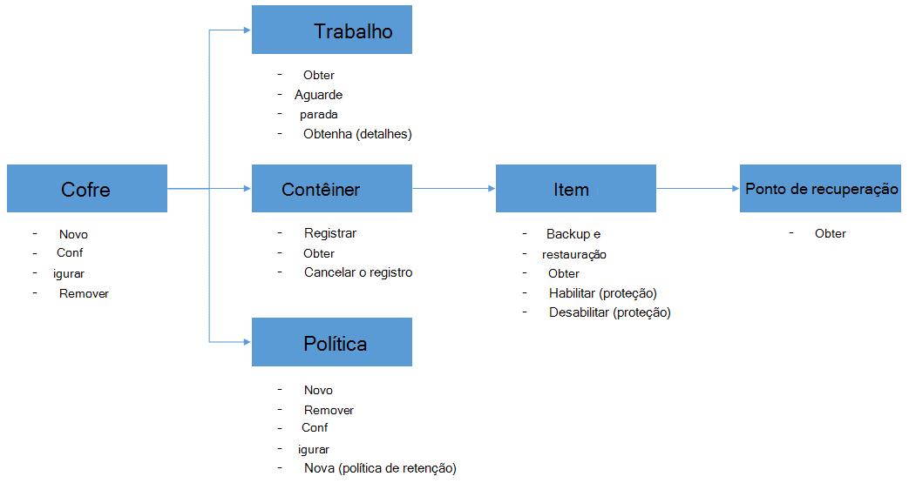

<properties
    pageTitle="Implantar e gerenciar o backup para VMs Azure usando o PowerShell | Microsoft Azure"
    description="Saiba como implantar e gerenciar o Backup do Azure usando o PowerShell"
    services="backup"
    documentationCenter=""
    authors="markgalioto"
    manager="cfreeman"
    editor=""/>

<tags
    ms.service="backup"
    ms.workload="storage-backup-recovery"
    ms.tgt_pltfrm="na"
    ms.devlang="na"
    ms.topic="article"
    ms.date="08/08/2016"
    ms.author="markgal;trinadhk;jimpark" />


# <a name="deploy-and-manage-backup-for-azure-vms-using-powershell"></a>Implantar e gerenciar o backup para VMs Azure usando o PowerShell

> [AZURE.SELECTOR]
- [Gerenciador de recursos](backup-azure-vms-automation.md)
- [Clássico](backup-azure-vms-classic-automation.md)

Este artigo mostra como usar o PowerShell do Azure para backup e recuperação de VMs do Azure. Azure tem dois modelos de implantação diferentes para criar e trabalhar com recursos: gerente de recurso e clássico. Este artigo aborda usando o modelo de implantação do clássico. Recomendamos que mais novas implantações de usam o modelo do Gerenciador de recursos.

## <a name="concepts"></a>Conceitos


Este artigo fornece informações específicas sobre cmdlets do PowerShell usado para fazer backup de máquinas virtuais. Para obter informações introdutórias sobre como proteger VMs do Azure, consulte [planejar sua infraestrutura de backup de máquina virtual no Azure](backup-azure-vms-introduction.md).

> [AZURE.NOTE] Antes de começar, leia os [pré-requisitos](backup-azure-vms-prepare.md) necessários para trabalhar com o Backup do Azure e as [limitações](backup-azure-vms-prepare.md#limitations) da solução backup máquina virtual atual.

Para usar o PowerShell efetivamente, demorar um pouco para entender a hierarquia de objetos e de onde começar.



Os dois fluxos mais importantes são ativar proteção para uma máquina virtual e restaurando dados de um ponto de recuperação. O foco deste artigo é para ajudá-lo a se tornar adeptos trabalhar com os cmdlets do PowerShell para habilitar esses dois cenários.


## <a name="setup-and-registration"></a>Instalação e registro
Para começar:

1. [Baixar o PowerShell mais recente](https://github.com/Azure/azure-powershell/releases) (versão mínima necessária é: 1.0.0)

2. Localize cmdlets do PowerShell de Backup do Azure disponível digitando o seguinte comando:

```
PS C:\> Get-Command *azurermbackup*

CommandType     Name                                               Version    Source
-----------     ----                                               -------    ------
Cmdlet          Backup-AzureRmBackupItem                           1.0.1      AzureRM.Backup
Cmdlet          Disable-AzureRmBackupProtection                    1.0.1      AzureRM.Backup
Cmdlet          Enable-AzureRmBackupContainerReregistration        1.0.1      AzureRM.Backup
Cmdlet          Enable-AzureRmBackupProtection                     1.0.1      AzureRM.Backup
Cmdlet          Get-AzureRmBackupContainer                         1.0.1      AzureRM.Backup
Cmdlet          Get-AzureRmBackupItem                              1.0.1      AzureRM.Backup
Cmdlet          Get-AzureRmBackupJob                               1.0.1      AzureRM.Backup
Cmdlet          Get-AzureRmBackupJobDetails                        1.0.1      AzureRM.Backup
Cmdlet          Get-AzureRmBackupProtectionPolicy                  1.0.1      AzureRM.Backup
Cmdlet          Get-AzureRmBackupRecoveryPoint                     1.0.1      AzureRM.Backup
Cmdlet          Get-AzureRmBackupVault                             1.0.1      AzureRM.Backup
Cmdlet          Get-AzureRmBackupVaultCredentials                  1.0.1      AzureRM.Backup
Cmdlet          New-AzureRmBackupProtectionPolicy                  1.0.1      AzureRM.Backup
Cmdlet          New-AzureRmBackupRetentionPolicyObject             1.0.1      AzureRM.Backup
Cmdlet          New-AzureRmBackupVault                             1.0.1      AzureRM.Backup
Cmdlet          Register-AzureRmBackupContainer                    1.0.1      AzureRM.Backup
Cmdlet          Remove-AzureRmBackupProtectionPolicy               1.0.1      AzureRM.Backup
Cmdlet          Remove-AzureRmBackupVault                          1.0.1      AzureRM.Backup
Cmdlet          Restore-AzureRmBackupItem                          1.0.1      AzureRM.Backup
Cmdlet          Set-AzureRmBackupProtectionPolicy                  1.0.1      AzureRM.Backup
Cmdlet          Set-AzureRmBackupVault                             1.0.1      AzureRM.Backup
Cmdlet          Stop-AzureRmBackupJob                              1.0.1      AzureRM.Backup
Cmdlet          Unregister-AzureRmBackupContainer                  1.0.1      AzureRM.Backup
Cmdlet          Wait-AzureRmBackupJob                              1.0.1      AzureRM.Backup
```

As seguintes tarefas de configuração e registro podem ser automatizadas com o PowerShell:

- Criar um backup cofre
- Registrando VMs com o serviço de Backup do Azure

### <a name="create-a-backup-vault"></a>Criar um backup cofre

> [AZURE.WARNING] Para clientes usando o Backup do Azure pela primeira vez, você precisa registrar o provedor de Backup do Azure para ser usado com sua assinatura. Isso pode ser feito executando o seguinte comando: Register-AzureRmResourceProvider - ProviderNamespace "Microsoft.Backup"

Você pode criar um novo cofre backup usando o cmdlet **New-AzureRmBackupVault** . O cofre backup é um recurso ARM, então você precisa colocá-lo dentro de um grupo de recursos. Em um console elevado do Azure PowerShell, execute os seguintes comandos:

```
PS C:\> New-AzureRmResourceGroup –Name “test-rg” –Location “West US”
PS C:\> $backupvault = New-AzureRmBackupVault –ResourceGroupName “test-rg” –Name “test-vault” –Region “West US” –Storage GeoRedundant
```

Você pode obter uma lista de todos os compartimentos de backup em uma determinada assinatura usando o cmdlet **Get-AzureRmBackupVault** .

> [AZURE.NOTE] É conveniente armazenar o objeto cofre backup em uma variável. O objeto de cofre é necessário como entrada para muitos cmdlets do Backup do Azure.


### <a name="registering-the-vms"></a>Registrando VMs
A primeira etapa para configurar o backup com o Backup do Azure é registrar sua máquina ou máquina virtual com um Backup do Azure cofre. O cmdlet **Register-AzureRmBackupContainer** leva as informações de entrada de uma máquina virtual de IaaS do Azure e registra-lo com o cofre especificado. A operação de registro associa a máquina virtual Azure Cofre de backup e rastreia a máquina virtual por meio de ciclo de vida do backup.

Registrar sua máquina virtual com o serviço de Backup do Azure cria um objeto de contêiner de nível superior. Um contêiner normalmente contém vários itens que podem ser feitos, mas no caso de VMs haverá apenas um item de backup para o contêiner.

```
PS C:\> $registerjob = Register-AzureRmBackupContainer -Vault $backupvault -Name "testvm" -ServiceName "testvm"
```

## <a name="backup-azure-vms"></a>Backup VMs Azure

### <a name="create-a-protection-policy"></a>Criar uma política de proteção
Não é obrigatório para criar uma nova política de proteção para iniciar o backup das suas VMs. O cofre vem com uma 'diretiva padrão' que podem ser usados para habilitar rapidamente a proteção e editadas com os detalhes da direita. Você pode obter uma lista das diretivas disponíveis no cofre usando o cmdlet **Get-AzureRmBackupProtectionPolicy** :

```
PS C:\> Get-AzureRmBackupProtectionPolicy -Vault $backupvault

Name                      Type               ScheduleType       BackupTime
----                      ----               ------------       ----------
DefaultPolicy             AzureVM            Daily              26-Aug-15 12:30:00 AM
```

> [AZURE.NOTE] O fuso horário do campo BackupTime no PowerShell é UTC. No entanto, quando o tempo de backup é mostrado no portal do Azure, o fuso horário é alinhado ao seu sistema local junto com o FUSO horário.

Uma política de backup está associada a pelo menos uma política de retenção. A política de retenção define quanto tempo um ponto de recuperação é mantido com Backup do Azure. O cmdlet **New-AzureRmBackupRetentionPolicy** cria objetos do PowerShell que armazenam informações de política de retenção. Esses objetos de política de retenção são usados como entradas para o cmdlet *New-AzureRmBackupProtectionPolicy* , ou diretamente com o cmdlet *Enable-AzureRmBackupProtection* .

Uma política de backup define quando e com que frequência é feito o backup de um item. O cmdlet **New-AzureRmBackupProtectionPolicy** cria um objeto do PowerShell que contém informações de política de backup. A política de backup é usada como entrada para o cmdlet *Enable-AzureRmBackupProtection* .

```
PS C:\> $Daily = New-AzureRmBackupRetentionPolicyObject -DailyRetention -Retention 30
PS C:\> $newpolicy = New-AzureRmBackupProtectionPolicy -Name DailyBackup01 -Type AzureVM -Daily -BackupTime ([datetime]"3:30 PM") -RetentionPolicy $Daily -Vault $backupvault

Name                      Type               ScheduleType       BackupTime
----                      ----               ------------       ----------
DailyBackup01             AzureVM            Daily              01-Sep-15 3:30:00 PM
```

### <a name="enable-protection"></a>Habilitar proteção
Ativar a proteção envolve dois objetos - o Item e a política, e ambos precisam pertencer ao mesmo cofre. Depois que a política foi associada ao item, o fluxo de trabalho de backup será iniciada no agendamento definido.

```
PS C:\> Get-AzureRmBackupContainer -Type AzureVM -Status Registered -Vault $backupvault | Get-AzureRmBackupItem | Enable-AzureRmBackupProtection -Policy $newpolicy
```

### <a name="initial-backup"></a>Backup inicial
O agendamento de backup executarão de fazer a cópia completa inicial para o item e a cópia incremental para backups subsequentes. No entanto, se você quiser forçar o backup inicial acontecer em um determinado tempo ou até mesmo imediatamente, em seguida, use o cmdlet **AzureRmBackupItem de Backup** :

```
PS C:\> $container = Get-AzureRmBackupContainer -Vault $backupvault -Type AzureVM -Name "testvm"
PS C:\> $backupjob = Get-AzureRmBackupItem -Container $container | Backup-AzureRmBackupItem
PS C:\> $backupjob

WorkloadName    Operation       Status          StartTime              EndTime
------------    ---------       ------          ---------              -------
testvm          Backup          InProgress      01-Sep-15 12:24:01 PM  01-Jan-01 12:00:00 AM
```

> [AZURE.NOTE] O fuso horário dos campos Hora de início e hora de término mostrado no PowerShell é UTC. No entanto, quando as informações semelhantes são mostradas no portal do Azure, o fuso horário é alinhado ao relógio do sistema local.

### <a name="monitoring-a-backup-job"></a>Monitoramento um trabalho de backup
A maioria das operações de execução demorada no Azure Backup são modelado como um trabalho. Isso torna mais fácil acompanhar o andamento sem precisar manter o portal do Azure aberta todas as vezes.

Para obter o status de um trabalho em andamento mais recente, use o cmdlet **Get-AzureRmBackupJob** .

```
PS C:\> $joblist = Get-AzureRmBackupJob -Vault $backupvault -Status InProgress
PS C:\> $joblist[0]

WorkloadName    Operation       Status          StartTime              EndTime
------------    ---------       ------          ---------              -------
testvm          Backup          InProgress      01-Sep-15 12:24:01 PM  01-Jan-01 12:00:00 AM
```

Em vez de sondagem esses trabalhos de conclusão - que é um código adicional desnecessário - é mais simples usar o cmdlet **Espera-AzureRmBackupJob** . Quando usada em um script, o cmdlet fará uma pausa a execução até que o trabalho for concluído ou o valor de tempo limite especificado é alcançado.

```
PS C:\> Wait-AzureRmBackupJob -Job $joblist[0] -Timeout 43200
```


## <a name="restore-an-azure-vm"></a>Restaurar uma máquina virtual Azure

Para restaurar os dados de backup, é necessário identificar o Item de backup e o ponto de recuperação que mantém os dados no momento. Essas informações são fornecidas para o cmdlet restauração AzureRmBackupItem para iniciar uma restauração de dados do cofre para a conta do cliente.

### <a name="select-the-vm"></a>Selecione a máquina virtual

Para obter o objeto do PowerShell que identifica o Item correta de backup, é necessário iniciar a partir do contêiner de no cofre e trabalhar sua maneira hierarquia de objeto. Para selecionar o recipiente que representa a máquina virtual, use o cmdlet **Get-AzureRmBackupContainer** e enviar que ao cmdlet **Get-AzureRmBackupItem** .

```
PS C:\> $backupitem = Get-AzureRmBackupContainer -Vault $backupvault -Type AzureVM -name "testvm" | Get-AzureRmBackupItem
```

### <a name="choose-a-recovery-point"></a>Escolha um ponto de recuperação

Agora você pode listar todos os pontos de recuperação para o item de backup usando o cmdlet **Get-AzureRmBackupRecoveryPoint** e escolha o ponto de recuperação para restaurar. Normalmente usuários selecionar do ponto de *AppConsistent* mais recente na lista.

```
PS C:\> $rp =  Get-AzureRmBackupRecoveryPoint -Item $backupitem
PS C:\> $rp

RecoveryPointId    RecoveryPointType  RecoveryPointTime      ContainerName
---------------    -----------------  -----------------      -------------
15273496567119     AppConsistent      01-Sep-15 12:27:38 PM  iaasvmcontainer;testvm;testv...
```

A variável ```$rp``` é uma matriz de pontos de recuperação para o backup selecionado item, classificados em ordem inversa de tempo, o último ponto de recuperação é no índice 0. Use a indexação de matriz padrão do PowerShell para escolher o ponto de recuperação. Por exemplo: ```$rp[0]``` selecionará o ponto de recuperação mais recente.

### <a name="restoring-disks"></a>Restaurando discos

Não há uma diferença importante entre as operações de restauração feitas por meio do portal do Azure e através do PowerShell do Azure. Com o PowerShell, a operação de restauração interrompe em restaurar os discos e informações de configuração do ponto de recuperação. Ele não cria uma máquina virtual.

> [AZURE.WARNING] A restauração-AzureRmBackupItem não cria uma máquina virtual. Ele restaura apenas os discos para a conta de armazenamento especificado. Isso não é o mesmo comportamento que você terá no portal do Azure.

```
PS C:\> $restorejob = Restore-AzureRmBackupItem -StorageAccountName "DestAccount" -RecoveryPoint $rp[0]
PS C:\> $restorejob

WorkloadName    Operation       Status          StartTime              EndTime
------------    ---------       ------          ---------              -------
testvm          Restore         InProgress      01-Sep-15 1:14:01 PM   01-Jan-01 12:00:00 AM
```

Você pode obter os detalhes da operação de restauração usando o cmdlet **Get-AzureRmBackupJobDetails** após o trabalho de restauração ter sido concluído. A propriedade *ErrorDetails* terá as informações necessárias para recriar a máquina virtual.

```
PS C:\> $restorejob = Get-AzureRmBackupJob -Job $restorejob
PS C:\> $details = Get-AzureRmBackupJobDetails -Job $restorejob
```

### <a name="build-the-vm"></a>Criar a máquina virtual

Criar a máquina virtual fora os discos restaurados pode ser feito usando cmdlets do PowerShell de gerenciamento de serviço do Azure mais antigo, os novos modelos do Gerenciador de recursos do Azure, ou até mesmo usando o portal do Azure. Um exemplo rápido, mostraremos como atingi-la usando os cmdlets de gerenciamento de serviço do Azure.

```
 $properties  = $details.Properties

 $storageAccountName = $properties["Target Storage Account Name"]
 $containerName = $properties["Config Blob Container Name"]
 $blobName = $properties["Config Blob Name"]

 $keys = Get-AzureStorageKey -StorageAccountName $storageAccountName
 $storageAccountKey = $keys.Primary
 $storageContext = New-AzureStorageContext -StorageAccountName $storageAccountName -StorageAccountKey $storageAccountKey


 $destination_path = "C:\Users\admin\Desktop\vmconfig.xml"
 Get-AzureStorageBlobContent -Container $containerName -Blob $blobName -Destination $destination_path -Context $storageContext


$obj = [xml](((Get-Content -Path $destination_path -Encoding UniCode)).TrimEnd([char]0x00))
 $pvr = $obj.PersistentVMRole
 $os = $pvr.OSVirtualHardDisk
 $dds = $pvr.DataVirtualHardDisks
 $osDisk = Add-AzureDisk -MediaLocation $os.MediaLink -OS $os.OS -DiskName "panbhaosdisk"
 $vm = New-AzureVMConfig -Name $pvr.RoleName -InstanceSize $pvr.RoleSize -DiskName $osDisk.DiskName

 if (!($dds -eq $null))
 {
     foreach($d in $dds.DataVirtualHardDisk)
     {
         $lun = 0
         if(!($d.Lun -eq $null))
         {
             $lun = $d.Lun
         }
         $name = "panbhadataDisk" + $lun
     Add-AzureDisk -DiskName $name -MediaLocation $d.MediaLink
     $vm | Add-AzureDataDisk -Import -DiskName $name -LUN $lun
    }
}

New-AzureVM -ServiceName "panbhasample" -Location "SouthEast Asia" -VM $vm
```

Para obter mais informações sobre como criar uma máquina virtual dos discos restaurados, leia sobre os seguintes cmdlets:

- [AzureDisk adicionar](https://msdn.microsoft.com/library/azure/dn495252.aspx)
- [Novo AzureVMConfig](https://msdn.microsoft.com/library/azure/dn495159.aspx)
- [Novo AzureVM](https://msdn.microsoft.com/library/azure/dn495254.aspx)

## <a name="code-samples"></a>Exemplos de código

### <a name="1-get-the-completion-status-of-job-sub-tasks"></a>1. obter o status de conclusão de trabalho subtarefas

Para controlar o status de conclusão de subtarefas individuais, você pode usar o cmdlet **Get-AzureRmBackupJobDetails** :

```
PS C:\> $details = Get-AzureRmBackupJobDetails -JobId $backupjob.InstanceId -Vault $backupvault
PS C:\> $details.SubTasks

Name                                                        Status
----                                                        ------
Take Snapshot                                               Completed
Transfer data to Backup vault                               InProgress
```

### <a name="2-create-a-dailyweekly-report-of-backup-jobs"></a>2. criar um relatório de diariamente, semanalmente trabalhos de backup

Os administradores normalmente gostaria de saber o que executou trabalhos de backup no últimas 24 horas, o status desses trabalhos de backup. Além disso, a quantidade de dados transferidos oferece aos administradores uma maneira de estimar seu uso de dados mensais. O script a seguir obtém os dados não processados do serviço de Backup do Azure e exibe as informações no console do PowerShell.

```
param(  [Parameter(Mandatory=$True,Position=1)]
        [string]$backupvaultname,

        [Parameter(Mandatory=$False,Position=2)]
        [int]$numberofdays = 7)


#Initialize variables
$DAILYBACKUPSTATS = @()
$backupvault = Get-AzureRmBackupVault -Name $backupvaultname
$enddate = ([datetime]::Today).AddDays(1)
$startdate = ([datetime]::Today)

for( $i = 1; $i -le $numberofdays; $i++ )
{
    # We query one day at a time because pulling 7 days of data might be too much
    $dailyjoblist = Get-AzureRmBackupJob -Vault $backupvault -From $startdate -To $enddate -Type AzureVM -Operation Backup
    Write-Progress -Activity "Getting job information for the last $numberofdays days" -Status "Day -$i" -PercentComplete ([int]([decimal]$i*100/$numberofdays))

    foreach( $job in $dailyjoblist )
    {
        #Extract the information for the reports
        $newstatsobj = New-Object System.Object
        $newstatsobj | Add-Member -Type NoteProperty -Name Date -Value $startdate
        $newstatsobj | Add-Member -Type NoteProperty -Name VMName -Value $job.WorkloadName
        $newstatsobj | Add-Member -Type NoteProperty -Name Duration -Value $job.Duration
        $newstatsobj | Add-Member -Type NoteProperty -Name Status -Value $job.Status

        $details = Get-AzureRmBackupJobDetails -Job $job
        $newstatsobj | Add-Member -Type NoteProperty -Name BackupSize -Value $details.Properties["Backup Size"]
        $DAILYBACKUPSTATS += $newstatsobj
    }

    $enddate = $enddate.AddDays(-1)
    $startdate = $startdate.AddDays(-1)
}

$DAILYBACKUPSTATS | Out-GridView
```

Se você quiser adicionar recursos gráficos a essa saída de relatório, aprender com a postagem de blog do TechNet [gráfico com o PowerShell](http://blogs.technet.com/b/richard_macdonald/archive/2009/04/28/3231887.aspx)

## <a name="next-steps"></a>Próximas etapas

Se você preferir usar o PowerShell para entre em contato com seus recursos Azure, confira o artigo do PowerShell para proteger o Windows Server, [implantar e gerenciar o Backup do Windows Server](./backup-client-automation-classic.md). Também há um artigo de PowerShell para gerenciar backups DPM, [implantar e gerenciar o Backup do DPM](./backup-dpm-automation-classic.md). Esses dois artigos tem uma versão para implantações do Gerenciador de recursos, bem como implantações de clássico.
