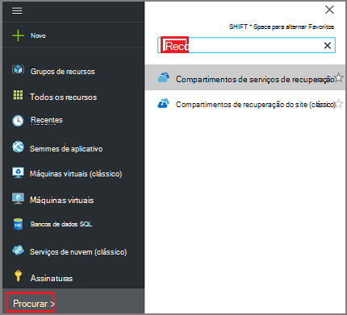
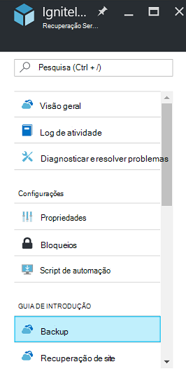
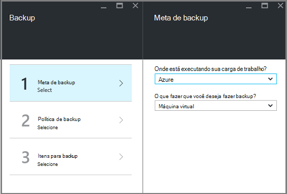
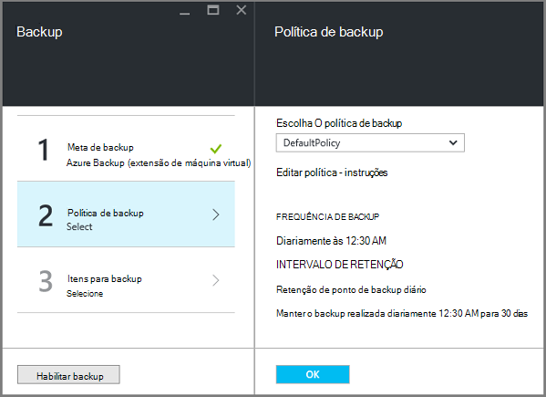
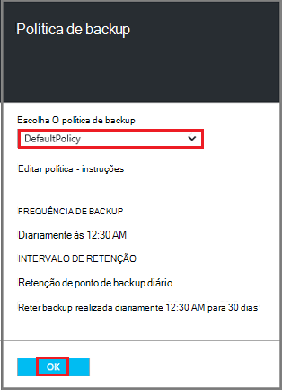
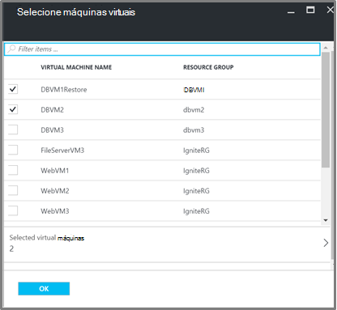
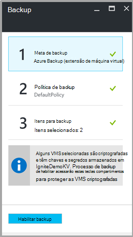

<properties
   pageTitle="Backup e restauração criptografados VMs usando o Backup do Azure"
   description="Este artigo fala sobre o backup e restauração experiência para VMs criptografadas usando criptografia de disco do Azure."
   services="backup"
   documentationCenter=""
   authors="JPallavi"
   manager="vijayts"
   editor=""/>
<tags
   ms.service="backup"
   ms.devlang="na"
   ms.topic="article"
   ms.tgt_pltfrm="na"
   ms.workload="storage-backup-recovery"
   ms.date="10/25/2016"
   ms.author="markgal; jimpark; trinadhk"/>

# Backup e restauração criptografados VMs usando o Backup do Azure

Este artigo fala sobre etapas para fazer backup e restaurar máquinas virtuais usando o Backup do Azure. Ele também fornece detalhes sobre cenários com suporte, pré-requisitos e etapas de solução de problemas para casos de erro.

## Cenários com suporte

> [AZURE.NOTE]
1.  Backup e restauração de VMs criptografadas tem suporte apenas para máquinas virtuais de gerente de recursos implantados. Ela não é suportada para máquinas virtuais de clássico.  
2.  Há suporte apenas para máquinas virtuais criptografadas usando a chave de criptografia e a chave de criptografia. Ela não é suportada para máquinas virtuais criptografadas usando a chave de criptografia BitLocker somente.  

## Pré-requisitos

1.  Máquina virtual tem foram criptografada usando [Criptografia de disco do Azure](../security/azure-security-disk-encryption.md). Ele deve ser criptografado usando a chave de criptografia e a chave de criptografia.
2.  Compartimento de serviços de recuperação tiver sido criado e replicação de armazenamento definir usando etapas mencionadas no artigo [preparar o ambiente para backup](backup-azure-arm-vms-prepare.md).

## Backup criptografado máquina virtual
Use as etapas a seguir para definir meta backup, defina política, configurar itens e backup de disparador.

### Configurar o backup

1. Se você já tiver um cofre de serviços de recuperação aberto, vá para a próxima etapa. Se você não tem um serviços de recuperação cofre aberto, mas no portal do Azure, no menu Hub, clique em **Procurar**.

  - Na lista de recursos, digite **Os serviços de recuperação**.
  - Conforme você começa a digitar, os filtros de lista com base na sua entrada. Quando você vir **compartimentos de serviços de recuperação**, clique nele.
  
        

    Na lista de serviços de recuperação compartimentos é exibida. Na lista de serviços de recuperação compartimentos, selecione um cofre.

    No painel Cofre selecionado é aberta.

2. Na lista de itens que aparece em cofre, clique em **Backup** para abrir a lâmina de Backup.

       
    
3. Na lâmina Backup, clique em **objetivo de Backup** para abrir a lâmina meta de Backup.

       
    
4.   Na lâmina meta Backup, definir **onde está a carga de trabalho em execução** no Azure e **o que fazer que você deseja fazer backup** Máquina Virtual, e então clique em **Okey**.

    A lâmina meta de Backup fecha e abre a lâmina de política de Backup.

       

5. Na lâmina política Backup, selecione a política de backup que você deseja aplicar ao Cofre e clique em **Okey**.

       

    Os detalhes da política padrão são listados na seção detalhes. Se você quiser criar uma política, selecione **Criar novo** do menu suspenso. Quando você clicar **Okey**, a política de backup está associada com o cofre.

    Em seguida, escolha as VMs para associar o cofre.
    
6. Escolha as máquinas virtuais criptografadas para associar à política especificada e clique em **Okey**.

      
   
7. Esta página mostra uma mensagem sobre cofre chave associado às VMs criptografadas selecionadas. Serviço de backup requer acesso somente leitura para as chaves e segredos no cofre de chave. Ele usa estas permissões a chave de backup e segredo, juntamente com as VMs associados. 

      

      Agora que você definiu todas as configurações para o cofre, na lâmina Backup clique em Habilitar Backup na parte inferior da página. Habilitar Backup implanta a política cofre e as VMs.

8. A próxima fase de preparação está instalando o agente de máquina virtual ou garantir que o agente de máquina virtual está instalado. Para fazer a mesma, use as etapas mencionadas no artigo [preparar o ambiente para backup](backup-azure-arm-vms-prepare.md). 

### Trabalho de backup disparo
Use as etapas mencionadas no artigo [Backup VMs Azure Cofre de serviços de recuperação](backup-azure-arm-vms.md) disparador no trabalho de backup.

## Restaurar máquina virtual criptografada
Experiência de restauração para máquinas virtuais criptografadas e não criptografado é a mesma. Use as etapas mencionadas em [restaurar máquinas virtuais no portal do Azure](backup-azure-arm-restore-vms.md) para restaurar a máquina virtual criptografada. Caso você precise restaurar chaves e senhas, você deve garantir que os principais restaurá-las já devem existir.

## Solucionando problemas de erros

| Operação | Detalhes do erro | Resolução |
| -------- | -------- | -------|
| Backup | Falha na validação como máquina virtual é criptografada com BEK sozinho. Backups podem ser habilitados apenas para máquinas virtuais criptografadas com BEK e KEK. | Máquina virtual devem ser criptografada usando BEK e KEK. Depois disso, o backup deve ser habilitada. |
| Restaurar | Você não pode restaurar esta máquina virtual criptografada desde cofre chave associado com esta máquina virtual não existe. | Crie chave cofre usando [Introdução ao Azure chave cofre](../key-vault/key-vault-get-started.md). Consulte o artigo [Restaurar chave cofre chave e segredo usando o Backup do Azure](backup-azure-restore-key-secret.md) para restaurar a chave e o segredo se não estiverem presentes. |
| Restaurar | Você não pode restaurar esta máquina virtual criptografada como chave e segredo associado a essa máquina virtual não existe. | Consulte o artigo [Restaurar chave cofre chave e segredo usando o Backup do Azure](backup-azure-restore-key-secret.md) para restaurar a chave e o segredo se não estiverem presentes. |
