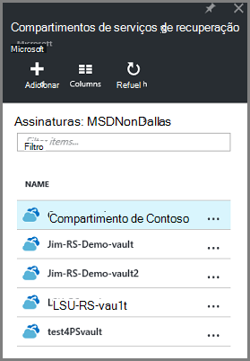
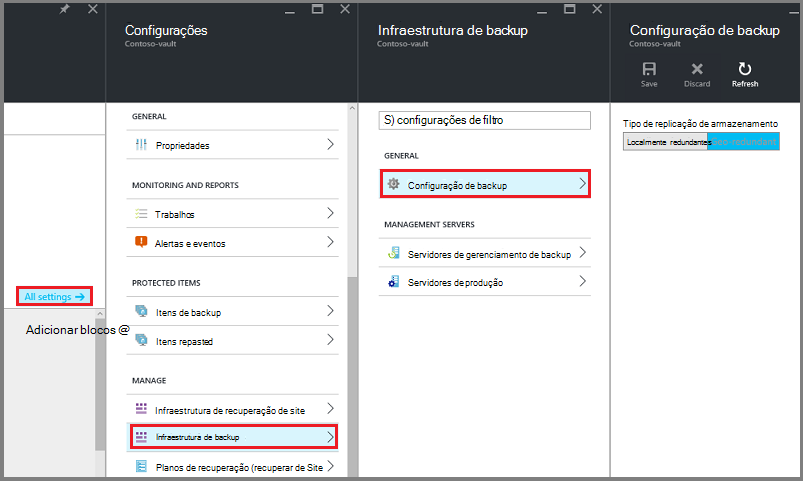
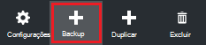
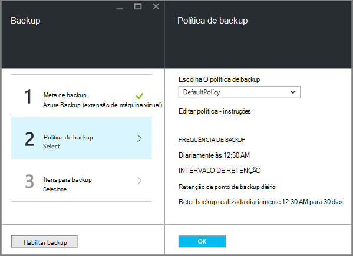
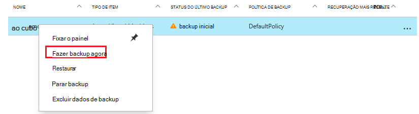
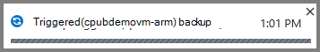
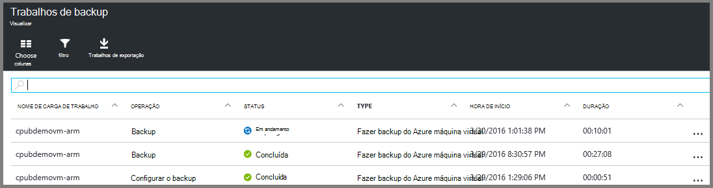

<properties
    pageTitle="Primeiro ver: proteger VMs Azure com um cofre de serviços de recuperação | Microsoft Azure"
    description="Proteja Azure VMs com um cofre de serviços de recuperação. Use backups do Gerenciador de recursos implantados VMs, VMs implantado clássico e Premium armazenamento VMs para proteger seus dados. Criar e registrar um cofre de serviços de recuperação. Registrar VMs, criar uma política e proteger VMs no Azure."
    services="backup"
    documentationCenter=""
    authors="markgalioto"
    manager="cfreeman"
    editor=""
    keyword="backups; vm backup"/>

<tags
    ms.service="backup"
    ms.workload="storage-backup-recovery"
    ms.tgt_pltfrm="na"
    ms.devlang="na"
    ms.topic="hero-article"
    ms.date="10/13/2016"
    ms.author="markgal; jimpark"/>

# Primeiro ver: proteger VMs Azure com um cofre de serviços de recuperação

> [AZURE.SELECTOR]
- [Proteger VMs com um cofre de serviços de recuperação](backup-azure-vms-first-look-arm.md)
- [Proteger VMs com um backup cofre](backup-azure-vms-first-look.md)

Este tutorial apresenta as etapas para criar um cofre de serviços de recuperação e backup uma Azure virtuais de máquina. Compartimentos de serviços de recuperação protegem:

- Azure VMs implantado Gerenciador de recursos
- VMs clássicas
- Armazenamento padrão VMs
- Armazenamento de Premium VMs
- VMs criptografadas usando criptografia de disco do Azure, com BEK e KEK

Para obter mais informações sobre como proteger o armazenamento de Premium VMs, consulte [fazer backup e restaurar VMs de armazenamento Premium](backup-introduction-to-azure-backup.md#back-up-and-restore-premium-storage-vms)

>[AZURE.NOTE] Este tutorial supõe que você já tem uma máquina virtual em sua assinatura do Azure e que fez medidas para permitir que o serviço de backup acessar a máquina virtual.

[AZURE.INCLUDE [learn-about-Azure-Backup-deployment-models](../../includes/backup-deployment-models.md)]

Em um alto nível, aqui estão as etapas que você concluirá.  

1. Crie um cofre de serviços de recuperação para uma máquina virtual.
2. Use o portal do Azure para selecionar um cenário, definir política e identificar os itens para proteger.
3. Execute o backup inicial.

## Criar um cofre de serviços de recuperação de uma máquina virtual

Um cofre de serviços de recuperação é uma entidade que armazena todos os backups e pontos de recuperação que foram criados ao longo do tempo. O Cofre de serviços de recuperação também contém a política de backup aplicada às VMs protegidas.

>[AZURE.NOTE] Fazendo backup de VMs é um processo local. Você não pode fazer backup VMs de um local em um cofre de serviços de recuperação em outro local. Portanto, para cada local Azure que tem VMs de backup, Cofre de serviços de recuperação de pelo menos um deve existir nesse local.

Para criar um cofre de serviços de recuperação:

1. Entrar no [portal do Azure](https://portal.azure.com/).

2. No menu Hub, clique em **Procurar** e na lista de recursos, digite **Os serviços de recuperação**. Conforme você começa a digitar, os filtros de lista com base na sua entrada. Clique em **Serviços de recuperação cofre**.

      

    Lista de compartimentos de serviços de recuperação são exibidas.

3. No menu **compartimentos de serviços de recuperação** , clique em **Adicionar**.

    

    A lâmina de Cofre de serviços de recuperação é aberta, solicitando que você forneça um **nome**, **assinatura**, **grupo de recursos**e **local**.

    

4. Para **nome**, digite um nome amigável para identificar o cofre. O nome deve ser exclusivo para a assinatura do Azure. Digite um nome que contenha entre 2 e 50 caracteres. Ele deve começar com uma letra e pode conter apenas letras, números e hifens.

5. Clique na **assinatura** para ver a lista de assinaturas disponíveis. Se você não tiver certeza de qual assinatura usar, use o padrão (ou sugeridos) assinatura. Há várias opções somente se sua conta organizacional está associada a várias assinaturas Azure.

6. Clique em **grupo de recursos** para ver a lista de grupos de recursos disponíveis, ou clique em **novo** para criar um grupo de recursos. Para obter informações completas sobre grupos de recursos, consulte [Visão geral do Gerenciador de recursos do Azure](../azure-resource-manager/resource-group-overview.md)

7. Clique em **local** para selecionar a região geográfica para o cofre. O cofre **deve** estar na mesma região como máquinas virtuais que você deseja proteger.

    >[AZURE.IMPORTANT] Se você não tiver certeza do local em que sua máquina virtual existe, feche a caixa de diálogo de criação de cofre e vá para a lista de máquinas virtuais no portal. Se você tiver máquinas virtuais em várias regiões, crie um cofre de serviços de recuperação em cada região. Crie o cofre no primeiro local antes de ir para o próximo local. Não é necessário para especificar contas de armazenamento para armazenar os dados de backup – o Cofre de serviços de recuperação e o serviço de Backup do Azure lidar com isso automaticamente.

8. Clique em **criar**. Pode levar alguns instantes para o Cofre de serviços de recuperação a ser criado. Monitore as notificações de status na área superior direita no portal. Depois que seu cofre é criado, ele aparece na lista de compartimentos de serviços de recuperação.

    

Agora que você criou seu cofre, Aprenda a configurar a replicação de armazenamento.

### Replicação de armazenamento de conjunto

A opção de replicação de armazenamento permite que você escolha entre armazenamento geográfica redundantes e localmente redundantes. Por padrão, seu cofre tem armazenamento redundante de localização geográfica. Deixe a opção definida como armazenamento geográfica redundante se esta for sua principal de backup. Escolha armazenamento localmente redundante se quiser que uma opção mais barata que não é tão durável. Leia mais sobre [geográfica redundantes](../storage/storage-redundancy.md#geo-redundant-storage) e opções de armazenamento [localmente redundantes](../storage/storage-redundancy.md#locally-redundant-storage) na [Visão geral de replicação de armazenamento do Azure](../storage/storage-redundancy.md).

Para editar a configuração de replicação de armazenamento:

1. Selecione seu cofre para abrir o painel Cofre e a lâmina de configurações. Se a lâmina **configurações** não abrir, clique em **todas as configurações** no painel Cofre.

2. Na lâmina **configurações** , clique em **Infraestrutura de Backup** > **Configuração de Backup** para abrir a lâmina de **Configuração de Backup** . Na lâmina **Configuração de Backup** , escolha a opção de replicação de armazenamento para seu cofre.

    

    Depois de escolher a opção de armazenamento de seu cofre, você está pronto para associar a máquina virtual do cofre. Para começar a associação, você deve descobrir e registrar as máquinas virtuais Azure.

## Selecione uma meta de backup, definir a política e definir itens proteger

Antes de registrar uma máquina virtual com um cofre, execute o processo de detecção para garantir que quaisquer novas máquinas virtuais que foram adicionadas à assinatura serão identificadas. As consultas de processo do Azure para a lista de máquinas virtuais na assinatura, juntamente com informações adicionais, como o nome do serviço de nuvem e a região. No portal do Azure, o cenário se refere ao qual você vai colocar em Cofre de serviços de recuperação. Política é o cronograma de frequência e quando os pontos de recuperação são feitos. Política também inclui o intervalo de retenção para os pontos de recuperação.

1. Se você já tiver um serviços de recuperação cofre abrir, vá para a etapa 2. Se você não tiver uma recuperação serviços cofre aberto, mas estão no portal do Azure, no menu Hub, clique em **Procurar**.

  - Na lista de recursos, digite **Os serviços de recuperação**.
  - Conforme você começa a digitar, os filtros de lista com base na sua entrada. Quando você vir **compartimentos de serviços de recuperação**, clique nele.

      

    Lista de compartimentos de serviços de recuperação é exibida.
  - Na lista de compartimentos de serviços de recuperação, selecione um cofre.

    No painel Cofre selecionado é aberta.

    

2. No menu de painel Cofre, clique em **Backup** para abrir a lâmina de Backup.

    

    Quando a lâmina é aberta, o serviço de Backup procura qualquer novas VMs na assinatura.

    

3. Na lâmina Backup, clique em **objetivo de Backup** para abrir a lâmina meta de Backup.

    

4. Na lâmina meta Backup, definir **onde está a carga de trabalho em execução** no Azure e **o que fazer que você deseja fazer backup** Máquina Virtual, e então clique em **Okey**.

    A lâmina meta de Backup fecha e abre a lâmina de política de Backup.

    

5. Na lâmina política Backup, selecione a política de backup que você deseja aplicar ao Cofre e clique em **Okey**.

    

    Os detalhes da política padrão são listados na seção detalhes. Se você quiser criar uma política, selecione **Criar novo** do menu suspenso. No menu suspenso também oferece uma opção para alternar a hora quando o instantâneo é feito, a 7 PM. Para obter instruções sobre como definir uma política de backup, consulte [definindo uma política de backup](backup-azure-vms-first-look-arm.md#defining-a-backup-policy). Quando você clicar **Okey**, a política de backup está associada com o cofre.

    Em seguida, escolha as VMs para associar o cofre.

6. Escolha as máquinas virtuais para associar à política especificada e clique em **Selecionar**.

    

    Se você não vir a máquina virtual desejada, verifique se ele existe no mesmo local Azure como o Cofre de serviços de recuperação.

7. Agora que você definiu todas as configurações para o cofre, na lâmina Backup clique em **Habilitar Backup** na parte inferior da página. Esse procedimento implanta a política para o cofre e VMs.

    

## Backup inicial

Depois que uma política de backup foi implantada na máquina virtual, que não significa que os dados foi feitos. Por padrão, o primeiro backup agendado (conforme definido na política de backup) é o backup inicial. Até que o backup inicial ocorra, o Status do último Backup na lâmina **Trabalhos de Backup** mostra como **aviso (backup inicial pendentes)**.

A menos que o backup inicial vencimento começar assim, é recomendável que você executar o **backup agora**.

Para executar o **backup agora**:

1. No painel Cofre no bloco **Backup** , clique em **máquinas virtuais do Azure**  
    

    Abre a lâmina de **Itens de Backup** .

2. Na lâmina **Itens de Backup** , o cofre que você deseja fazer backup de atalho e clique em **Backup agora**.

    

    O trabalho de Backup é disparado.  

    

3. Para ver que o backup inicial foi concluída, no painel Cofre no bloco **Trabalhos de Backup** , clique em **Azure máquinas virtuais**.

    

    Abre a lâmina de trabalhos de Backup.

4. Na lâmina de trabalhos de Backup, você pode ver o status de todos os trabalhos.

    

    >[AZURE.NOTE] Como parte da operação de backup, o serviço do Azure Backup emite um comando para a extensão de backup em cada máquina virtual para liberar todas as gravações e tirar um instantâneo consistente.

    Quando o trabalho de backup for concluído, o status é *concluído*.

[AZURE.INCLUDE [backup-create-backup-policy-for-vm](../../includes/backup-create-backup-policy-for-vm.md)]

## Instalar o agente de máquina virtual na máquina virtual

Essas informações são fornecidas em caso é necessária. O agente de máquina virtual do Azure deve ser instalado na máquina virtual Azure para a extensão de Backup trabalhar. No entanto, se sua máquina virtual foi criado da Galeria Azure, em seguida, o agente de máquina virtual já está presente na máquina virtual. VMs que são migradas do local dos data centers prefere não tenha o agente de máquina virtual instalado. Nesse caso, o agente de máquina virtual precisa estar instalado. Se você tiver problemas ao fazer backup a máquina virtual do Azure, verifique se o agente de máquina virtual do Azure está instalado corretamente na máquina virtual (consulte a tabela abaixo). Se você criar uma máquina virtual personalizada, [Certifique-se de que a caixa de seleção **instalar o agente de máquina virtual** está marcada](../virtual-machines/virtual-machines-windows-classic-agents-and-extensions.md) antes da máquina virtual está provisionado.

Saiba mais sobre o [Agente de máquina virtual](https://go.microsoft.com/fwLink/?LinkID=390493&clcid=0x409) e [como instalá-lo](../virtual-machines/virtual-machines-windows-classic-manage-extensions.md).

A tabela a seguir fornece informações adicionais sobre o agente de máquina virtual do Windows e VMs Linux.

| **Operação** | **Windows** | **Linux** |
| --- | --- | --- |
| Instalando o agente de máquina virtual | <li>Baixe e instale o [agente MSI](http://go.microsoft.com/fwlink/?LinkID=394789&clcid=0x409). Você precisa de privilégios de administrador para concluir a instalação. <li>[Atualizar a propriedade de máquina virtual](http://blogs.msdn.com/b/mast/archive/2014/04/08/install-the-vm-agent-on-an-existing-azure-vm.aspx) para indicar que o agente está instalado. | <li> Instale a versão mais recente [Linux agente](https://github.com/Azure/WALinuxAgent) do GitHub. Você precisa de privilégios de administrador para concluir a instalação. <li> [Atualizar a propriedade de máquina virtual](http://blogs.msdn.com/b/mast/archive/2014/04/08/install-the-vm-agent-on-an-existing-azure-vm.aspx) para indicar que o agente está instalado. |
| Atualizando o agente de máquina virtual | Atualizar o agente de máquina virtual é tão simple quanto reinstalando os [arquivos binários do agente de máquina virtual](http://go.microsoft.com/fwlink/?LinkID=394789&clcid=0x409).  Certifique-se de que nenhuma operação de backup está em execução enquanto o agente de máquina virtual está sendo atualizado. | Siga as instruções sobre como [atualizar o agente de máquina virtual Linux ](../virtual-machines-linux-update-agent.md).  Certifique-se de que nenhuma operação de backup está em execução enquanto o agente de máquina virtual está sendo atualizado. |
| Validando a instalação do agente de máquina virtual | <li>Navegue até a pasta *C:\WindowsAzure\Packages* na máquina virtual do Azure. <li>Você deve encontrar o arquivo de WaAppAgent.exe presente.<li> Clique com botão direito no arquivo, vá para **Propriedades**e selecione a guia **detalhes** . O campo de versão do produto deve ser 2.6.1198.718 ou superior. | N/D |

### Extensão de backup

Quando o agente de máquina virtual estiver instalado na máquina virtual, o serviço de Backup do Azure instala a extensão de backup para o agente de máquina virtual. O serviço de Backup do Azure diretamente atualizações e patches a extensão de backup sem intervenção do usuário adicionais.

A extensão de backup é instalada pelo serviço de Backup se a máquina virtual está em execução. Uma máquina virtual em execução fornece as maiores chances de marcar um ponto de recuperação consistente com aplicativos. No entanto, o serviço de Backup do Azure continua backup a máquina virtual, mesmo se ele está desativado e a extensão não pôde ser instalada. Isso é conhecido como Offline máquina virtual. Nesse caso, o ponto de recuperação será *falha consistente*.

## Informações de solução de problemas
Se você tiver problemas para realizar algumas das tarefas neste artigo, consulte o [guia de solução de problemas](backup-azure-vms-troubleshoot.md).

## Preços
Azure backup de máquina virtual será cobrado com base no modelo de instâncias protegido. Saiba mais sobre [Preços de Backup](https://azure.microsoft.com/pricing/details/backup/)

## Dúvidas?
Se você tiver dúvidas ou se houver algum recurso que você gostaria de ver incluídos, [envie-nos comentários](http://aka.ms/azurebackup_feedback).
