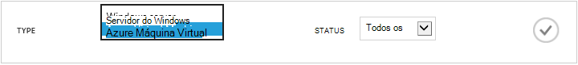
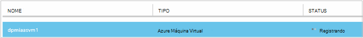
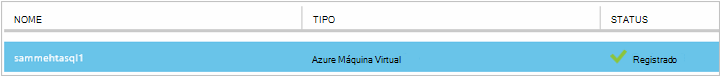
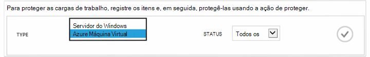

<properties
    pageTitle="Primeiro olhar: Proteger VMs Azure com um cofre backup | Microsoft Azure"
    description="Proteja Azure VMs com Cofre de Backup. Tutorial explica criar cofre, registrar VMs, criar uma política e proteger VMs no Azure."
    services="backup"
    documentationCenter=""
    authors="markgalioto"
    manager="cfreeman"
    editor=""/>

<tags
    ms.service="backup"
    ms.workload="storage-backup-recovery"
    ms.tgt_pltfrm="na"
    ms.devlang="na"
    ms.topic="hero-article"
    ms.date="09/15/2016"
    ms.author="markgal; jimpark"/>

# Primeiro ver: fazendo backup Azure máquinas virtuais

> [AZURE.SELECTOR]
- [Proteger VMs com um cofre de serviços de recuperação](backup-azure-vms-first-look-arm.md)
- [Proteger VMs Azure com um backup cofre](backup-azure-vms-first-look.md)

Este tutorial leva você pelas etapas para fazer backup de uma Azure virtuais de máquina para um backup cofre no Azure. Este artigo descreve o modelo clássico ou o modelo de implantação do Gerenciador de serviço, para fazer backup de VMs. Se você estiver interessado em backup uma máquina virtual para um cofre de serviços de recuperação que pertence a um grupo de recursos, consulte [primeiro ver: proteger VMs com um cofre de serviços de recuperação](backup-azure-vms-first-look-arm.md). Para concluir este tutorial, esses pré-requisitos devem existir:

- Você criou uma máquina virtual em sua assinatura do Azure.
- A máquina virtual tem conectividade com o Azure endereços IP públicos. Para obter informações adicionais, consulte [a conectividade de rede](./backup-azure-vms-prepare.md#network-connectivity).

Para fazer backup de uma máquina virtual, há cinco etapas principais:  

 criar um backup cofre ou identificar um cofre de backup existente.  
 usar o portal do Azure clássico para descobrir e registrar as máquinas virtuais.  
 instalar o agente de máquina virtual.  
 criar a política para proteger as máquinas virtuais.  
 executar o backup.

>[AZURE.NOTE] Azure tem dois modelos de implantação para criar e trabalhar com recursos: [Gerenciador de recursos e clássico](../resource-manager-deployment-model.md). Este tutorial destina-se com as VMs que podem ser criados no portal do Azure clássico. O serviço de Backup do Azure suporta VMs baseadas em Gerenciador de recursos. Para obter detalhes sobre como fazer backup VMs para um cofre de serviços de recuperação, consulte [aparência primeiro: proteger VMs com um cofre de serviços de recuperação](backup-azure-vms-first-look-arm.md).

## Etapa 1 - criar um backup cofre para uma máquina virtual

Um backup cofre é uma entidade que armazena todos os backups e pontos de recuperação que foram criados ao longo do tempo. O backup cofre também contém as políticas de backup que são aplicadas às máquinas virtuais sendo feitas backup.

1. Entrar no [portal do Azure clássico](http://manage.windowsazure.com/).

2. No canto inferior esquerdo do portal do Azure, clique em **novo**

    

3. No assistente criar rápida, clique em **Serviços de dados** > **Serviços de recuperação** > **Backup cofre** > **Criação rápida**.

    

    O assistente solicita o **nome** e a **região**. Se você administra mais de uma assinatura, uma caixa de diálogo para escolher a assinatura é exibida.

4. Para **nome**, digite um nome amigável para identificar o cofre. O nome deve ser exclusivo para a assinatura do Azure.

5. Na **região**, selecione a região geográfica para o cofre. O cofre **deve** estar na mesma região como máquinas virtuais protege.

    Se você não souber a região em que sua máquina virtual existe, fechar este assistente e clique em **máquinas virtuais** na lista de serviços do Azure. Coluna local fornece o nome da região. Se você tiver máquinas virtuais em várias regiões, crie um backup cofre em cada região.

6. Se não houver nenhuma caixa de diálogo de **assinatura** no assistente, pule para a próxima etapa. Se você trabalha com várias assinaturas, selecione uma assinatura para associar o novo cofre de backup.

    

7. Clique em **criar cofre**. Pode levar alguns instantes para o Cofre de backup a ser criado. Monitore as notificações de status na parte inferior do portal.

    

    Uma mensagem confirma que o cofre foi criado com êxito. Ele é listado na página **Serviços de recuperação** como **ativa**.

    

8. Na lista de compartimentos na página **Serviços de recuperação** , selecione o cofre que você criou para abrir a página de **Início rápido** .

    

9. Na página de **Início rápido** , clique em **Configurar** para abrir a opção de replicação de armazenamento.
    

10. A opção de **replicação de armazenamento** , escolha a opção de replicação de seu cofre.

    

    Por padrão, seu cofre tem armazenamento redundante de localização geográfica. Escolha armazenamento geográfica redundante se esta for sua principal de backup. Escolha armazenamento localmente redundante se quiser que uma opção mais barata que não é bastante tão durável. Leia mais sobre opções de armazenamento localmente redundantes e localização geográfica redundantes na [Visão geral de replicação de armazenamento do Azure](../storage/storage-redundancy.md).

Depois de escolher a opção de armazenamento de seu cofre, você está pronto para associar a máquina virtual do cofre. Para começar a associação, descobrir e registrar as máquinas virtuais Azure.

## Etapa 2: descobrir e máquinas virtuais do Azure registrar
Antes de registrar a máquina virtual com um cofre, execute o processo de descoberta para identificar quaisquer novas VMs. Isso retorna uma lista de máquinas virtuais na assinatura, juntamente com informações adicionais, como o nome do serviço de nuvem e a região.

1. Entre [portal do Azure clássico](http://manage.windowsazure.com/)

2. No portal do Azure clássico, clique em **Serviços de recuperação** para abrir a lista de compartimentos de serviços de recuperação.
    

3. Na lista de compartimentos, selecione o cofre para fazer backup de uma máquina virtual.

    Quando você seleciona seu cofre, ele abre na página de **Início rápido**

4. No menu do cofre, clique em **Itens registrados**.

    

5. No menu **tipo** , selecione **máquina de Virtual do Azure**.

    

6. Clique em **DESCOBRIR** na parte inferior da página.
    

    O processo de detecção pode levar alguns minutos, enquanto as máquinas virtuais estão sendo tabulação. Não há uma notificação na parte inferior da tela que permite saber que o processo está sendo executado.

    

    As alterações de notificação quando o processo for concluída.

    

7. Clique em **registrar** na parte inferior da página.
    

8. No menu de atalho **Registrar itens** , selecione as máquinas virtuais que você deseja registrar.

    >[AZURE.TIP] Várias máquinas virtuais pode ser registradas uma vez.

    Um trabalho é criado para cada máquina virtual que você selecionou.

9. Clique em **Exibir trabalho** na notificação para ir para a página de **trabalhos** .

    

    Na máquina virtual também é exibida na lista de itens registrados, juntamente com o status da operação de registro.

    

    Quando a operação for concluída, o status muda para refletir o estado *registrado* .

    

## Etapa 3 - instalar o agente de máquina virtual na máquina virtual

O agente de máquina virtual do Azure deve ser instalado na máquina virtual Azure para a extensão de Backup trabalhar. Se sua máquina virtual foi criado da Galeria Azure, o agente de máquina virtual já está presente na máquina virtual. Você pode pular para [proteger suas VMs](backup-azure-vms-first-look.md#step-4-protect-azure-virtual-machines).

Se sua máquina virtual migrada de um data center local, a máquina virtual provavelmente não tenha o agente de máquina virtual instalado. Você deve instalar o agente de máquina virtual na máquina virtual antes de prosseguir para proteger a máquina virtual. Para obter etapas detalhadas sobre como instalar o agente de máquina virtual, consulte a [seção do agente de máquina virtual do artigo VMs de Backup](backup-azure-vms-prepare.md#vm-agent).

## Etapa 4: criar a política de backup
Antes de você aciona o trabalho de backup inicial, defina o agendamento quando backup instantâneos são criados. A agenda quando backup instantâneos são criados, e o período de tempo esses instantâneos são mantidos, é a política de backup. As informações de retenção baseia-se no esquema de backup de rotação vovô-pai-filho.

1. Navegue até o cofre backup em **Serviços de recuperação** no portal do Azure clássico e clique em **Itens registrados**.
2. Selecione **Azure Virtual Machine** no menu suspenso.

    

3. Clique em **proteger** na parte inferior da página.
    

    O **Assistente de proteger itens** aparece e lista *somente* as máquinas virtuais registradas e não protegidas.

    

4. Selecione as máquinas virtuais que você deseja proteger.

    Se houver duas ou mais máquinas virtuais com o mesmo nome, use o serviço de nuvem para distinguir entre as máquinas virtuais.

5. No menu **Configurar proteção** selecione uma política existente ou crie uma nova política para proteger as máquinas virtuais que você identificou.

    Novo compartimentos de Backup têm uma política de padrão associada ao cofre. Essa política leva diária instantâneo cada noite e o instantâneo diário é mantido por 30 dias. Cada política de backup pode ter várias máquinas virtuais associadas a ele. No entanto, a máquina virtual só é possível associada a uma política de cada vez.

    

    >[AZURE.NOTE] Uma política de backup inclui um esquema de retenção para os backups agendados. Se você selecionar uma política de backup existente, não será possível modificar as opções de retenção na próxima etapa.

6. Em **Intervalo de retenção** defina o escopo diário, semanal, mensal e anual para os pontos de backup específico.

    

    Política de retenção Especifica o período de tempo para armazenar um backup. Você pode especificar diferentes políticas de retenção com base em quando o backup é feito.

7. Clique em **trabalhos** para exibir a lista de trabalhos de **Proteção de configurar** .

    

    Agora que você já estabeleceu a política, vá para a próxima etapa e execute o backup inicial.

## Etapa 5 - backup inicial

Depois que uma máquina virtual foi protegida com uma política, você pode exibir essa relação na guia **Itens protegidos** . Até que o backup inicial ocorra, o **Status de proteção** mostra como **protegido - (pendente backup inicial)**. Por padrão, o primeiro backup agendado é o *backup inicial*.

Para iniciar agora o backup inicial:

1. Na página **Itens protegido** , clique em **Fazer Backup agora** na parte inferior da página.
    

    O serviço do Azure Backup cria um trabalho de backup para a operação de backup inicial.

2. Clique na guia de **trabalhos** para exibir a lista de trabalhos.

    

    Quando backup inicial for concluída, o status da máquina virtual na guia **Itens protegido** é *protegido*.

    

    >[AZURE.NOTE] Fazer backup de máquinas virtuais é um processo local. Você não pode fazer backup máquinas virtuais de uma região em um cofre backup em outra região. Portanto, para cada região Azure com VMs que precisam ser feito backup, pelo menos um cofre backup deve ser criado nessa região.

## Próximas etapas
Agora que você tiver feito com êxito uma máquina virtual, há várias etapas próxima que poderiam ser de seu interesse. A etapa mais lógica é se familiarizar com restaurando dados para uma máquina virtual. No entanto, há tarefas de gerenciamento que ajudarão você a entender como manter seus dados seguros e minimizar os custos.

- [Gerenciar e monitorar suas máquinas virtuais](backup-azure-manage-vms.md)
- [Restaurar máquinas virtuais](backup-azure-restore-vms.md)
- [Guia de solução de problemas](backup-azure-vms-troubleshoot.md)

## Dúvidas?
Se você tiver dúvidas ou se houver algum recurso que você gostaria de ver incluídos, [envie-nos comentários](http://aka.ms/azurebackup_feedback).
