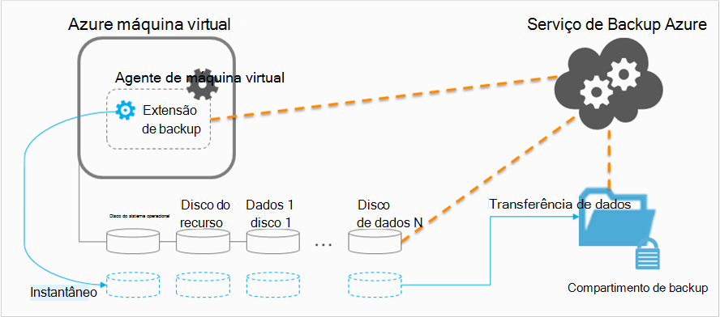

<properties
    pageTitle="Planejando sua infraestrutura de backup de máquina virtual no Azure | Microsoft Azure"
    description="Importantes considerações ao planejar fazer backup de máquinas virtuais no Azure"
    services="backup"
    documentationCenter=""
    authors="markgalioto"
    manager="cfreeman"
    editor=""
    keywords="vms de backup, fazer backup de máquinas virtuais"/>

<tags
    ms.service="backup"
    ms.workload="storage-backup-recovery"
    ms.tgt_pltfrm="na"
    ms.devlang="na"
    ms.topic="article"
    ms.date="10/19/2016"
    ms.author="trinadhk; jimpark; markgal;"/>

# <a name="plan-your-vm-backup-infrastructure-in-azure"></a>Planejar sua infraestrutura de backup de máquina virtual no Azure
Este artigo fornece desempenho e sugestões de recursos para ajudá-lo a planejar sua infraestrutura de backup de máquina virtual. Ele também define os principais aspectos do serviço Backup; Esses aspectos podem ser essenciais para determinar sua arquitetura, planejamento de capacidade e agendamento. Se você tiver [preparado seu ambiente](backup-azure-vms-prepare.md), esta é a próxima etapa antes de começar [a VMs backup](backup-azure-vms.md). Se precisar de mais informações sobre Azure máquinas virtuais, consulte a [documentação de máquinas virtuais](https://azure.microsoft.com/documentation/services/virtual-machines/).

## <a name="how-does-azure-back-up-virtual-machines"></a>Como funciona o Azure fazer backup de máquinas virtuais?
Quando o serviço de Backup do Azure inicia um trabalho de backup no horário agendado, ele aciona a extensão de backup para tirar um instantâneo no momento. Este instantâneo é feito em coordenação com o serviço de cópia do Volume Shadow (VSS) para obter um instantâneo consistente dos discos na máquina virtual sem ter que fechá-lo.

Após o instantâneo é feito, os dados são transferidos pelo serviço Azure Backup ao Cofre de backup. Para tornar o processo de backup mais eficiente, o serviço identifica e transfere apenas os blocos de dados que foram alterados desde o último backup.



Quando a transferência de dados estiver concluída, o instantâneo é removido, e um ponto de recuperação é criado.

### <a name="data-consistency"></a>Consistência de dados
Fazer backup e restaurar dados críticos são complicados pelo fato de que dados críticos de negócios devem ser feitos enquanto os aplicativos que produzem os dados de negócios estão em execução. Para resolver isso, o Backup do Azure fornece backups consistentes com o aplicativo para cargas de trabalho do Microsoft usando VSS para garantir que os dados sejam gravados corretamente ao armazenamento.

>[AZURE.NOTE] Para máquinas virtuais Linux apenas backups consistentes de arquivo são possíveis, como Linux não tem uma plataforma equivalente ao VSS.

Backup Azure leva backups completos VSS em VMs do Windows (Leia mais sobre o [backup completo de VSS](http://blogs.technet.com/b/filecab/archive/2008/05/21/what-is-the-difference-between-vss-full-backup-and-vss-copy-backup-in-windows-server-2008.aspx)). Para habilitar backups de cópia VSS, o abaixo do registro de chave precisa ser definido na máquina virtual.

```
[HKEY_LOCAL_MACHINE\SOFTWARE\MICROSOFT\BCDRAGENT]
"USEVSSCOPYBACKUP"="TRUE"
```


Esta tabela explica os tipos de consistência e as condições que ocorrem durante a máquina virtual do Azure em backup e restauração procedimentos.

| Consistência | Baseados em VSS | Explicação e detalhes |
|-------------|-----------|---------|
| Consistência de aplicativos | Sim | Este é o tipo de consistência ideal para cargas de trabalho do Microsoft pois garante que:<ol><li> Na máquina virtual *inicializado*. <li>Não há *nenhum dano*. <li>Não há *nenhuma perda de dados*.<li> Os dados forem consistentes com o aplicativo que usa os dados, por que envolvem o aplicativo no momento de backup--usando o VSS.</ol> A maioria das cargas de trabalho do Microsoft têm criadores VSS que realizar ações de carga de trabalho específica que estão relacionadas a consistência de dados. Por exemplo, o Microsoft SQL Server tem um gravador VSS que garante que as gravações para o arquivo de log de transação e o banco de dados tiver terminadas corretamente.<br><br> Para máquina virtual do Azure backups, obtendo um ponto de recuperação consistente com aplicativos significa que a extensão de backup pôde chamar o fluxo de trabalho VSS e concluí-la *corretamente* antes do instantâneo de máquina virtual foi criado. Naturalmente, isso significa que os autores VSS todos os aplicativos na VM Azure foi invocados também.<br><br>(Aprender os [conceitos básicos da VSS](http://blogs.technet.com/b/josebda/archive/2007/10/10/the-basics-of-the-volume-shadow-copy-service-vss.aspx) e aprofundar os detalhes de [como ele funciona](https://technet.microsoft.com/library/cc785914%28v=ws.10%29.aspx)). |
| Consistência do sistema de arquivos | Sim - para computadores baseados no Windows | Há dois cenários onde o ponto de recuperação pode ser o *sistema de arquivos consistente*:<ul><li>Backups das VMs Linux no Azure, como Linux não tem uma plataforma equivalente ao VSS.<li>Falha VSS durante o backup para Windows VMs no Azure.</li></ul> Os dois nesses casos, o que pode ser feito melhor é garantir que: <ol><li> Na máquina virtual *inicializado*. <li>Não há *nenhum dano*.<li>Não há *nenhuma perda de dados*.</ol> Aplicativos precisam implementar seu próprio mecanismo de "fix-up" nos dados restaurados.|
| Falha de consistência | Não | Essa situação é equivalente a uma máquina virtual enfrentando uma "Falha" (por meio de um dos redefinir suave ou sólida). Normalmente, isso acontece quando a máquina virtual Azure está desligada no momento do backup. Azure máquina virtual backups, obter um meio de ponto de recuperação consistente após falhas Backup Azure não fornece nenhuma garantia em torno a consistência dos dados na mídia de armazenamento – da perspectiva do sistema operacional ou da perspectiva do aplicativo. Apenas os dados que já existe no disco no momento do backup são o que é capturado e backup. <br/> <br/> Embora existam sem garantias, na maioria dos casos, o sistema operacional será inicializado. Isso geralmente é seguido por um procedimento de verificação de disco, como chkdsk, para corrigir os erros de corrupção. Todos os dados na memória ou gravações que não têm foi completamente limpo no disco serão perdidas. O aplicativo geralmente segue com seu próprio mecanismo de verificação no caso de reversão de dados precisa ser feito. <br><br>Como exemplo, se o log de transação tem entradas que não estão presentes no banco de dados, em seguida, o software de banco de dados não uma reversão até que os dados forem consistentes. Quando os dados são distribuídos em vários discos virtuais (como volumes estendidos), um ponto de recuperação consistente após falhas não fornece nenhuma garantia para a precisão dos dados.|


## <a name="performance-and-resource-utilization"></a>Desempenho e utilização de recursos
Como o software de backup que é implantado no local, você deve planejar capacidade e utilização do recurso necessidades ao fazer backup de VMs no Azure. Os [limites de armazenamento do Azure](azure-subscription-service-limits.md#storage-limits) definir como estruturar implantações de máquina virtual para obter o máximo de desempenho com o mínimo impacto sobre executando cargas de trabalho.

Observe os seguintes limites de armazenamento do Azure durante o planejamento de desempenho de backup:

- Egresso max por conta de armazenamento
- Taxa de solicitação total por conta de armazenamento

### <a name="storage-account-limits"></a>Limites de armazenamento de conta
Sempre que os dados de backup são copiados de uma conta de armazenamento, ele conta em direção as operações de entrada/saída por segundo (IOPS) e saída (ou produtividade) métricas da conta de armazenamento. Ao mesmo tempo, as máquinas virtuais são executando e consumindo IOPS e produtividade. O objetivo é garantir que o tráfego total - máquina virtual e backup - não excede os limites de conta de armazenamento.

### <a name="number-of-disks"></a>Número de discos
O processo de backup tenta concluir um trabalho de backup assim que possível. Fazer isso, ele consome quantos recursos possível. Entretanto, todas essas operações são limitadas pela *Taxa de transferência de destino para único Blob*, que tem um limite de 60 MB por segundo. Em uma tentativa de maximizar sua velocidade, o processo de backup tenta fazer backup de cada um dos discos *em paralelo da VM*. Portanto, se uma máquina virtual tem quatro discos, Azure Backup tenta fazer backup de todos os quatro discos em paralelo. Por isso, o fator mais importante determinando o tráfego de backup saindo de uma conta de armazenamento do cliente é o **número de discos** está sendo feito backup da conta de armazenamento.

### <a name="backup-schedule"></a>Agendamento de backup
Um fator adicional que afeta o desempenho é o **agendamento de backup**. Se você configurar as políticas para que todas as VMs backup ao mesmo tempo, você agendou uma retenção de tráfego. O processo de backup tentará fazer backup de todos os discos em paralelo. Uma maneira de reduzir o tráfego de backup de uma conta de armazenamento é - garantir que VMs diferentes são copiadas em momentos diferentes do dia, sem sobreposição.

## <a name="capacity-planning"></a>Planejamento da capacidade
Juntando todos esses fatores significa que o uso da conta de armazenamento precisa ser planejada corretamente. Baixe a [planilha de Excel de planejamento da capacidade de backup de máquina virtual](https://gallery.technet.microsoft.com/Azure-Backup-Storage-a46d7e33) para ver o impacto de seu disco e opções de agendamento de backup.

### <a name="backup-throughput"></a>Taxa de transferência de backup
Para cada disco backup, Azure Backup lê os blocos no disco e armazena apenas os dados alterados (backup incremental). Esta tabela mostra os valores de produtividade média que você pode esperar de Backup do Azure. Usando isso, você pode estimar a quantidade de tempo que levará para fazer backup de um disco de um determinado tamanho.

| Operação de backup | Melhor produtividade |
| ---------------- | ---------- |
| Backup inicial | 160 Mbps |
| Backup incremental (DR) | 640 Mbps <br><br> Este produtividade pode soltar significativamente se houver muitos rotatividade disperso no disco que precisa ser feito backup. |

## <a name="total-vm-backup-time"></a>Tempo total de backup de máquina virtual
Embora a maioria das vezes, backup é gasto em lendo e copiando dados, há outras operações que contribuem para o tempo total necessário para fazer backup de uma máquina virtual:

- Tempo necessário para [instalar ou atualizar a extensão de backup](backup-azure-vms.md#offline-vms).
- Tempo de instantâneo, que é o tempo levado para disparar um instantâneo. Instantâneos são disparados próximo horário de backup agendado.
- Tempo de espera de fila. Desde que o serviço de Backup está processando backups a partir de vários clientes, copiando dados de backup de instantâneo para o backup ou Cofre de serviços de recuperação pode não ser iniciado imediatamente. Em períodos de pico de carga, a espera pode alongar até 8 horas devido ao número de backups sendo processada. No entanto, o tempo total de backup da máquina virtual será menor que 24 horas para políticas de backup diariamente.

## <a name="best-practices"></a>Práticas recomendadas
Sugerimos seguindo estas práticas recomendadas ao configurar backups de máquinas virtuais:

- Não agende mais de quatro VMs clássicas do serviço de nuvem mesmo backup ao mesmo tempo. Sugerimos escalonamento horários de início de backup por uma hora, se você quiser fazer backup de várias VMs mesmo do serviço de nuvem.
- Não agende mais de 40 VMs implantado Gerenciador de recursos para fazer backup ao mesmo tempo.
- Agende backups de máquina virtual durante o horário de pico não para que o serviço de backup usa IOPS para transferir dados da conta de armazenamento do cliente para o backup ou os serviços de recuperação cofre.
- Certifique-se de que uma política de endereços VMs distribuídas entre contas de armazenamento diferentes. Sugerimos que não mais do que 20 discos totais de uma conta de armazenamento único ser protegidos por uma política. Se você tiver mais de 20 discos em uma conta de armazenamento, distribuir essas VMs por várias políticas para obter o IOPS necessário durante a fase de transferência do processo de backup.
- Não restaure uma máquina virtual em execução no armazenamento Premium a mesma conta de armazenamento. Se o processo de operação de restauração coincide com a operação de backup, reduz o IOPS disponível para backup.
- Recomendamos a execução de cada máquina virtual Premium em uma conta de armazenamento premium distintas para garantir o desempenho ideal de backup.

## <a name="data-encryption"></a>Criptografia de dados

Backup Azure não criptografa os dados como parte do processo de backup. No entanto, você pode criptografar dados dentro a máquina virtual e fazer backup de dados protegidos perfeitamente (Leia mais sobre o [backup dos dados criptografados](backup-azure-vms-encryption.md)).


## <a name="how-are-protected-instances-calculated"></a>Como são calculadas instâncias protegidas?
Azure máquinas virtuais que são copiadas por meio de Backup do Azure estão sujeitos a [preços de Backup do Azure](https://azure.microsoft.com/pricing/details/backup/). O cálculo de instâncias protegido é baseado no tamanho *real* da máquina virtual, que é a soma de todos os dados na máquina virtual – excluindo o "disco de recurso".

Você *não* é cobrado com base no tamanho máximo que tem suporte para cada disco de dados anexado à máquina virtual, mas nos dados reais armazenados no disco de dados. Da mesma forma, a fatura de armazenamento de backup é baseada na quantidade de dados que são armazenados com o Backup do Azure, que é a soma dos dados reais em cada ponto de recuperação.

Por exemplo, dê uma máquina virtual A2 padrão tamanho que tem dois discos de dados adicionais com um tamanho máximo de 1 TB. A tabela abaixo fornece os dados reais armazenados em cada um desses discos:

|Tipo de disco|Tamanho máximo|Apresentar os dados reais|
|---------|--------|------|
| Disco do sistema operacional | GB 1023 | 17 GB |
| Disco local / disco do recurso | 135 GB | 5 GB (não incluído para backup) |
| Disco de dados 1 | GB 1023 | 30 GB |
| Disco de dados 2 | GB 1023 | 0 GB |

Nesse caso, o tamanho *real* da máquina virtual é 17 GB + 30 GB + 0 GB = 47 GB. Este será o tamanho da instância protegido a cobrança mensal com base em. Como a quantidade de dados na máquina virtual cresce, o tamanho da instância protegido usado para cobrança também mudará adequadamente.

Cobrança não é iniciado até que o primeiro backup bem-sucedido seja concluído. Neste ponto, a cobrança de armazenamento e instâncias protegido começará. Cobrança continua enquanto há *quaisquer dados de backup armazenados com o Backup do Azure* para a máquina virtual. Executar a operação de parar proteção não interrompe a cobrança se os dados de backup são mantidos.

A cobrança de uma máquina virtual especificada será descontinuada somente se a proteção for interrompido *e* quaisquer dados de backup são excluídos. Quando não houver nenhuma trabalhos de backup ativos (quando proteção foi interrompida), o tamanho da máquina virtual no momento do último backup bem-sucedido se torna o tamanho de instância protegido a cobrança mensal com base em.

## <a name="questions"></a>Dúvidas?
Se você tiver dúvidas ou se houver algum recurso que você gostaria de ver incluídos, [envie-nos comentários](http://aka.ms/azurebackup_feedback).

## <a name="next-steps"></a>Próximas etapas

- [Fazer backup de máquinas virtuais](backup-azure-vms.md)
- [Gerenciar o backup de máquina virtual](backup-azure-manage-vms.md)
- [Restaurar máquinas virtuais](backup-azure-restore-vms.md)
- [Solucionar problemas de backup de máquina virtual](backup-azure-vms-troubleshoot.md)
