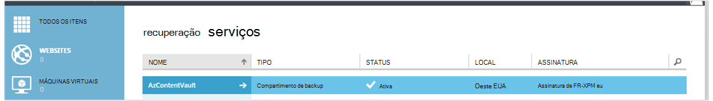

<properties
    pageTitle="Preparando seu ambiente para fazer backup Azure máquinas virtuais | Microsoft Azure"
    description="Certificar-se de que seu ambiente está preparado para fazer backup de máquinas virtuais no Azure"
    services="backup"
    documentationCenter=""
    authors="markgalioto"
    manager="cfreeman"
    editor=""
    keywords="backups; fazer backup;"/>

<tags
    ms.service="backup"
    ms.workload="storage-backup-recovery"
    ms.tgt_pltfrm="na"
    ms.devlang="na"
    ms.topic="article"
    ms.date="08/26/2016"
    ms.author="trinadhk; jimpark; markgal;"/>


# <a name="prepare-your-environment-to-back-up-azure-virtual-machines"></a>Preparar o ambiente para fazer backup Azure máquinas virtuais

> [AZURE.SELECTOR]
- [Modelo do Gerenciador de recursos](backup-azure-arm-vms-prepare.md)
- [Modelo clássico](backup-azure-vms-prepare.md)

Antes que você pode fazer backup de uma Azure virtuais de máquina, há três condições que devem existir.

- Você precisa criar um backup cofre ou identificar um backup cofre existente *na mesma região como sua máquina virtual*.
- Estabelece conectividade de rede entre os endereços de Internet públicos Azure e os pontos de extremidade de armazenamento do Azure.
- Instale o agente de máquina virtual na máquina virtual.

Se você souber que essas condições já existem no seu ambiente, em seguida, vá para [fazer backup de seu artigo de VMs](backup-azure-vms.md). Caso contrário, continue a ler, este artigo o guiará pelas etapas para preparar o ambiente para fazer backup de uma máquina virtual do Azure.


## <a name="limitations-when-backing-up-and-restoring-a-vm"></a>Limitações ao fazer backup e restaurar uma máquina virtual

>[AZURE.NOTE] Azure tem dois modelos de implantação para criar e trabalhar com recursos: [Gerenciador de recursos e clássico](../resource-manager-deployment-model.md). A lista a seguir fornece as limitações ao implantar no modelo clássico.

- Fazer backup de máquinas virtuais com mais de 16 discos de dados não é suportada.
- Não há suporte para fazer backup de máquinas virtuais com um endereço IP reservado e nenhum ponto de extremidade definido.
- Dados de backup não incluem unidades de rede montado anexadas à máquina virtual. 
- Não há suporte para a substituição de uma máquina virtual existente durante a restauração. Excluir primeiro a máquina virtual existente e qualquer disco associado e restaurar os dados de backup.
- Não há suporte para a região entre backup e restauração.
- Fazer backup de máquinas virtuais usando o serviço de Backup do Azure é suportado em todas as regiões públicas do Azure (consulte a [lista de verificação](https://azure.microsoft.com/regions/#services) de regiões com suporte). Se a região que você está procurando não tiver suporte hoje, ela não aparecerá na lista suspensa durante a criação de cofre.
- Fazer backup de máquinas virtuais usando o serviço de Backup do Azure é suportado apenas para versões selecione sistema operacional:
  - **Linux**: Backup Azure dá suporte a [uma lista de distribuições que contam com a aprovação por Azure](../virtual-machines/virtual-machines-linux-endorsed-distros.md) exceto Core SO Linux. Outras distribuições trazer-Your-proprietário-Linux também podem funcionar, desde que o agente de máquina virtual está disponível na máquina virtual e suporte para Python existe.
  - **Windows Server**: versões mais antigas do que o Windows Server 2008 R2 não são suportadas.
- Restaurar um controlador de domínio (DC) máquina virtual que faz parte de uma configuração de multi-DC só é suportado através do PowerShell. Leia mais sobre como [restaurar um controlador de domínio multi-DC](backup-azure-restore-vms.md#restoring-domain-controller-vms).
- Restaurar máquinas virtuais que ter as seguintes configurações de rede especial só é suportado através do PowerShell. VMs que você criar usando o fluxo de trabalho de restauração na interface de usuário não terá essas configurações de rede após a conclusão da operação de restauração. Para saber mais, consulte [Restaurando VMs com configurações de rede especial](backup-azure-restore-vms.md#restoring-vms-with-special-netwrok-configurations).
    - Máquinas virtuais em configuração de Balanceador de carga (interna e externa)
    - Máquinas virtuais com vários endereços IP reservados
    - Máquinas virtuais com vários adaptadores de rede

## <a name="create-a-backup-vault-for-a-vm"></a>Criar um backup cofre para uma máquina virtual

Um backup cofre é uma entidade que armazena todos os backups e pontos de recuperação que foram criados ao longo do tempo. O backup cofre também contém as políticas de backup que serão aplicadas às máquinas virtuais sendo feitas backup.

Esta imagem mostra as relações entre as várias entidades de Backup do Azure:     

Para criar um backup cofre:

1. Entrar no [portal do Azure](http://manage.windowsazure.com/).

2. No portal do Azure, clique em **novo** > **Híbrido integração** > **Backup**. Quando você clica em **Backup**, você alternará automaticamente para o portal clássico (mostrado após a anotação).

    

    >[AZURE.NOTE] Se sua assinatura foi usada por último no portal do clássico, sua assinatura pode ser aberto no portal do clássico. Nesse caso, para criar um cofre backup, clique em **novo** > **Serviços de dados** > **Serviços de recuperação** > **Backup cofre** > **Criação rápida** (consulte a imagem abaixo).

    

3. Para **nome**, digite um nome amigável para identificar o cofre. O nome deve ser exclusivo para a assinatura do Azure. Digite um nome que contenha entre 2 e 50 caracteres. Ele deve começar com uma letra e pode conter apenas letras, números e hifens.

4. Na **região**, selecione a região geográfica para o cofre. O cofre deve estar na mesma região como máquinas virtuais que você deseja proteger. Se você tiver máquinas virtuais em várias regiões, você deve criar um backup cofre em cada região. Não é necessário especificar contas de armazenamento para armazenar os dados de backup – Cofre de backup e o identificador do serviço Azure Backup isso automaticamente.

5. Em **assinatura** , selecione a assinatura que você deseja associar o backup cofre. Haverá várias opções somente se sua conta organizacional está associada a várias assinaturas Azure.

6. Clique em **criar cofre**. Pode levar alguns instantes para o Cofre de backup a ser criado. Monitore as notificações de status na parte inferior do portal.

    

7. Uma mensagem confirmará que o cofre foi criado com êxito. Ele será listado na página **Serviços de recuperação** como **ativa**. Certifique-se de escolher o direito de opção de redundância de armazenamento apropriado após o cofre foi criado. Leia mais sobre como [definir a opção de redundância de armazenamento no cofre de backup](backup-configure-vault.md#azure-backup---storage-redundancy-options).

    

8. Clique no cofre backup para ir para a página de **Início rápido** , onde as instruções para fazer backup Azure máquinas virtuais são mostradas.

    


## <a name="network-connectivity"></a>Conectividade de rede

Para gerenciar os instantâneos de máquina virtual, a extensão de backup precisa ter conectividade com os endereços IP públicos Azure. Sem a direita conectividade com a Internet, tempo limite de solicitações de HTTP da máquina virtual e a operação de backup falhará. Se sua implantação possui restrições de acesso no lugar (por meio de um grupo de segurança da rede (NSG), por exemplo), escolha uma destas opções para fornecer um caminho claro para tráfego de backup:

- [Intervalos de IP do data center Azure branca](http://www.microsoft.com/en-us/download/details.aspx?id=41653) - consulte o artigo para obter instruções sobre como à branca os endereços IP.
- Implante um servidor de proxy HTTP para rotear o tráfego.

Ao decidir qual opção usar, as compensações estão entre capacidade de gerenciamento, controle granular e custo.

|Opção|Vantagens|Desvantagens|
|------|----------|-------------|
|Intervalos de IP whitelists| Não há custos adicionais.<br><br>Para abrir o acesso em um NSG, use o cmdlet <i>Set-AzureNetworkSecurityRule</i> . | Complexa para gerenciar como os afetados intervalos IP alteram ao longo do tempo.<br><br>Fornece acesso a todo do Azure e não apenas armazenamento.|
|Proxy HTTP| Controle granular no proxy sobre as URLs de armazenamento permitido.<br>Único ponto de acesso à Internet em VMs.<br>Não sujeito às alterações de endereço IP do Azure.| Custos adicionais para executar uma máquina virtual com o software de proxy.|

### <a name="whitelist-the-azure-datacenter-ip-ranges"></a>Intervalos de IP do data center Azure branca

À branca os intervalos de IP do data center Azure, consulte o [site Azure](http://www.microsoft.com/en-us/download/details.aspx?id=41653) para obter detalhes sobre os intervalos de IP e instruções.

### <a name="using-an-http-proxy-for-vm-backups"></a>Usando um proxy HTTP para backups de máquina virtual
Ao fazer backup de uma máquina virtual, a extensão de backup na VM envia os comandos de gerenciamento de instantâneo ao armazenamento do Azure usando uma API de HTTPS. Rotear o tráfego de backup extensão através do proxy HTTP, pois é o único componente configurado para acesso à Internet pública.

>[AZURE.NOTE] Não há nenhuma recomendação para o software de proxy que deve ser usado. Certifique-se de que você escolha um proxy que seja compatível com as etapas de configuração abaixo.

A imagem de exemplo abaixo mostra as etapas de configuração de três necessário usar um proxy HTTP:

- Máquina virtual do aplicativo rotear todo o tráfego HTTP vinculado para a Internet pública por meio de máquina virtual do Proxy.
- Proxy máquina virtual permite que o tráfego de entrada do VMs da rede virtual.
- O grupo de segurança de rede (NSG) denominada NSF-bloqueio precisa de um segurança regra permitindo Internet tráfego de saída de máquina virtual do Proxy.


Para usar um proxy HTTP para comunicar-se à Internet pública, siga estas etapas:

#### <a name="step-1-configure-outgoing-network-connections"></a>Etapa 1. Configurar conexões de rede de saída
###### <a name="for-windows-machines"></a>Para máquinas do Windows
Isso irá configurar configuração do servidor proxy para a conta do sistema Local.

1. Baixar [PsExec](https://technet.microsoft.com/sysinternals/bb897553)
2. Execute o seguinte comando de prompt elevado,

     ```
     psexec -i -s "c:\Program Files\Internet Explorer\iexplore.exe"
     ```
     Ele será aberto a janela do internet explorer.
3. Vá para Ferramentas -> Opções da Internet -> conexões -> configurações da LAN.
4. Verifique as configurações de proxy de conta do sistema. Definir Proxy IP e porta.
5. Feche o Internet Explorer.

Isso irá configurar uma configuração de proxy de máquina e será usado qualquer tráfego de saída HTTP/HTTPS.

Se você tiver um servidor proxy de configuração em uma conta de usuário atual (não uma conta do sistema Local), use o seguinte script aplicá-las ao SYSTEMACCOUNT:

```
   $obj = Get-ItemProperty -Path Registry::”HKEY_CURRENT_USER\Software\Microsoft\Windows\CurrentVersion\Internet Settings\Connections"
   Set-ItemProperty -Path Registry::”HKEY_USERS\S-1-5-18\Software\Microsoft\Windows\CurrentVersion\Internet Settings\Connections" -Name DefaultConnectionSettings -Value $obj.DefaultConnectionSettings
   Set-ItemProperty -Path Registry::”HKEY_USERS\S-1-5-18\Software\Microsoft\Windows\CurrentVersion\Internet Settings\Connections" -Name SavedLegacySettings -Value $obj.SavedLegacySettings
   $obj = Get-ItemProperty -Path Registry::”HKEY_CURRENT_USER\Software\Microsoft\Windows\CurrentVersion\Internet Settings"
   Set-ItemProperty -Path Registry::”HKEY_USERS\S-1-5-18\Software\Microsoft\Windows\CurrentVersion\Internet Settings" -Name ProxyEnable -Value $obj.ProxyEnable
   Set-ItemProperty -Path Registry::”HKEY_USERS\S-1-5-18\Software\Microsoft\Windows\CurrentVersion\Internet Settings" -Name Proxyserver -Value $obj.Proxyserver
```

>[AZURE.NOTE] Se você observar "(407) autenticação de Proxy necessária" no log de servidor proxy, verifique sua authrntication está configurado corretamente.

######<a name="for-linux-machines"></a>Para máquinas Linux

Adicione a seguinte linha para o ```/etc/environment``` arquivo:

```
http_proxy=http://<proxy IP>:<proxy port>
```

Adicione as seguintes linhas para a ```/etc/waagent.conf``` arquivo:

```
HttpProxy.Host=<proxy IP>
HttpProxy.Port=<proxy port>
```

#### <a name="step-2-allow-incoming-connections-on-the-proxy-server"></a>Etapa 2. Permitir conexões de entrada no servidor proxy:

1. No servidor proxy, abra o Firewall do Windows. A maneira mais fácil para acessar o firewall é pesquisar pelo Firewall do Windows com segurança avançada.

    

2. Na caixa de diálogo Firewall do Windows, clique com botão direito **Regras de entrada** e clique em **Nova regra...**.

    

3. No **Assistente de nova entrada regra**, escolha a opção **personalizado** para o **Tipo de regra** e clique em **Avançar**.

4. Na página Selecionar o **programa**, escolha **Todos os programas** e clique em **Avançar**.

5. Na página **protocolo e portas** , insira as seguintes informações e clique em **Avançar**:

    

    - para o *tipo de protocolo* escolha *TCP*
    - para *porta Local* escolha *Portas específicas*, no campo abaixo especificar a ```<Proxy Port>``` que foi configurado.
    - para *porta remota* , selecione *Todas as portas*

    Para o restante do assistente, clique em totalmente até o final e dê um nome para esta regra.

#### <a name="step-3-add-an-exception-rule-to-the-nsg"></a>Etapa 3. Adicione uma regra de exceção para o NSG:

Em um prompt de comando do PowerShell do Azure, digite o seguinte comando:

O comando a seguir adiciona uma exceção para o NSG. Essa exceção permite tráfego TCP de qualquer porta no 10.0.0.5 qualquer endereço da Internet na porta 80 (HTTP) ou 443 (HTTPS). Se você solicitar uma porta específica da Internet pública, certifique-se de adicionar porta para o ```-DestinationPortRange``` também.

```
Get-AzureNetworkSecurityGroup -Name "NSG-lockdown" |
Set-AzureNetworkSecurityRule -Name "allow-proxy " -Action Allow -Protocol TCP -Type Outbound -Priority 200 -SourceAddressPrefix "10.0.0.5/32" -SourcePortRange "*" -DestinationAddressPrefix Internet -DestinationPortRange "80-443"
```

*Certifique-se de que você substituir os nomes no exemplo os detalhes apropriados para sua implantação.*


## <a name="vm-agent"></a>Agente de máquina virtual

Antes de você pode fazer backup da máquina virtual Azure, você deve garantir que o agente de máquina virtual do Azure está instalado corretamente na máquina virtual. Como o agente de máquina virtual é um componente opcional no momento em que a máquina virtual é criada, verifique se a caixa de seleção para o agente de máquina virtual está selecionada antes da máquina virtual está provisionada.

### <a name="manual-installation-and-update"></a>Instalação manual e atualização

O agente de máquina virtual já está presente em VMs que são criadas da Galeria Azure. No entanto, máquinas virtuais que são migradas do local dos data centers não teria o agente de máquina virtual instalado. Para tais VMs, o agente de máquina virtual precisa estar instalado explicitamente. Leia mais sobre como [instalar o agente de máquina virtual em uma máquina virtual existente](http://blogs.msdn.com/b/mast/archive/2014/04/08/install-the-vm-agent-on-an-existing-azure-vm.aspx).

| **Operação** | **Windows** | **Linux** |
| --- | --- | --- |
| Instalando o agente de máquina virtual | <li>Baixe e instale o [agente MSI](http://go.microsoft.com/fwlink/?LinkID=394789&clcid=0x409). Você precisará privilégios de administrador para concluir a instalação. <li>[Atualizar a propriedade de máquina virtual](http://blogs.msdn.com/b/mast/archive/2014/04/08/install-the-vm-agent-on-an-existing-azure-vm.aspx) para indicar que o agente está instalado. | <li> Instale a versão mais recente [Linux agente](https://github.com/Azure/WALinuxAgent) do GitHub. Você precisará privilégios de administrador para concluir a instalação. <li> [Atualizar a propriedade de máquina virtual](http://blogs.msdn.com/b/mast/archive/2014/04/08/install-the-vm-agent-on-an-existing-azure-vm.aspx) para indicar que o agente está instalado. |
| Atualizando o agente de máquina virtual | Atualizar o agente de máquina virtual é tão simple quanto reinstalar os [binários do agente de máquina virtual](http://go.microsoft.com/fwlink/?LinkID=394789&clcid=0x409). <br><br>Certifique-se de que nenhuma operação de backup está em execução enquanto o agente de máquina virtual está sendo atualizado. | Siga as instruções sobre como [atualizar o agente de máquina virtual Linux ](../virtual-machines-linux-update-agent.md). <br><br>Certifique-se de que nenhuma operação de backup está em execução enquanto o agente de máquina virtual está sendo atualizado. |
| Validando a instalação do agente de máquina virtual | <li>Navegue até a pasta *C:\WindowsAzure\Packages* na máquina virtual do Azure. <li>Você deve encontrar o arquivo de WaAppAgent.exe presente.<li> Clique com botão direito no arquivo, vá para **Propriedades**e selecione a guia **detalhes** . O campo de versão do produto deve ser 2.6.1198.718 ou superior. | N/D |


Saiba mais sobre o [agente de máquina virtual](https://go.microsoft.com/fwLink/?LinkID=390493&clcid=0x409) e [como instalá-lo](https://azure.microsoft.com/blog/2014/04/15/vm-agent-and-extensions-part-2/).

### <a name="backup-extension"></a>Extensão de backup

Para fazer backup da máquina virtual, o serviço de Backup do Azure instala uma extensão para o agente de máquina virtual. O serviço de Backup do Azure diretamente atualizações e patches a extensão de backup sem intervenção do usuário adicionais.

A extensão de backup é instalada se a máquina virtual está em execução. Uma máquina virtual em execução também fornece as maiores chances de marcar um ponto de recuperação consistente com aplicativos. No entanto, o Backup do Azure serviço continuará backup a máquina virtual, mesmo se ele está desativado e a extensão não pôde ser instalado (também conhecidos como Offline máquina virtual). Nesse caso, o ponto de recuperação será *falha consistente* , conforme discutido acima.


## <a name="questions"></a>Dúvidas?
Se você tiver dúvidas ou se houver algum recurso que você gostaria de ver incluídos, [envie-nos comentários](http://aka.ms/azurebackup_feedback).

## <a name="next-steps"></a>Próximas etapas
Agora que você preparar o ambiente para fazer backup de sua máquina virtual, sua próxima etapa lógica é criar um backup. O artigo planejamento fornece informações mais detalhadas sobre como fazer backup VMs.

- [Fazer backup de máquinas virtuais](backup-azure-vms.md)
- [Planejar sua infraestrutura de backup de máquina virtual](backup-azure-vms-introduction.md)
- [Gerenciar backups de máquina virtual](backup-azure-manage-vms.md)
