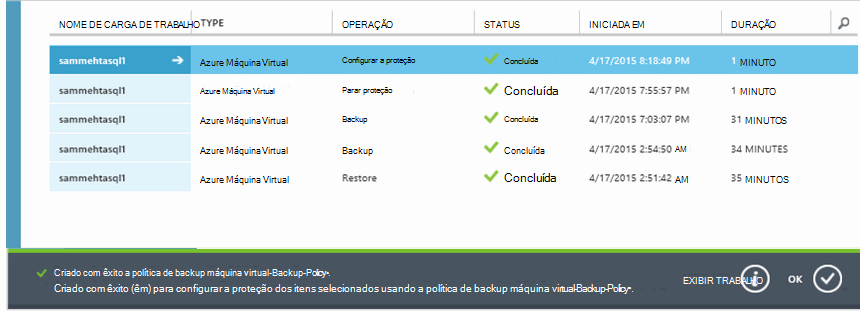

<properties
    pageTitle="Fazer backup Azure máquinas virtuais | Microsoft Azure"
    description="Descubra, registrar e fazer backup de suas máquinas virtuais com esses procedimentos para backup Azure máquina virtual."
    services="backup"
    documentationCenter=""
    authors="markgalioto"
    manager="jwhit"
    editor=""
    keywords="backup de máquina virtual; fazer backup de máquina virtual; backup e recuperação de desastres; backup de máquina virtual"/>

<tags
    ms.service="backup"
    ms.workload="storage-backup-recovery"
    ms.tgt_pltfrm="na"
    ms.devlang="na"
    ms.topic="article"
    ms.date="09/28/2016"
    ms.author="trinadhk; jimpark; markgal;"/>

# Fazer backup Azure máquinas virtuais

> [AZURE.SELECTOR]
- [Fazer backup de VMs Cofre de serviços de recuperação](backup-azure-arm-vms.md)
- [Fazer backup de VMs Cofre de Backup](backup-azure-vms.md)

Este artigo fornece os procedimentos para backup uma implantado clássico Azure máquina virtual (VM) para um cofre de Backup. Há algumas tarefas que você precisa cuidam da antes de você pode fazer backup de uma máquina virtual Azure. Se você ainda não fez isso, execute os [pré-requisitos](backup-azure-vms-prepare.md) para preparar o ambiente para fazer backup de suas VMs.

Para obter informações adicionais, consulte os artigos sobre o [planejamento de sua infraestrutura de backup de máquina virtual no Azure](backup-azure-vms-introduction.md) e [Azure máquinas virtuais](https://azure.microsoft.com/documentation/services/virtual-machines/).

>[AZURE.NOTE] Azure tem dois modelos de implantação para criar e trabalhar com recursos: [Gerenciador de recursos e clássico](../resource-manager-deployment-model.md). Um cofre de Backup só pode proteger VMs implantado clássico. Você não pode proteger VMs implantado Gerenciador de recursos com um cofre de Backup. Consulte [fazer backup de VMs Cofre de serviços de recuperação](backup-azure-arm-vms.md) para obter detalhes sobre como trabalhar com os serviços de recuperação compartimentos.

Fazendo backup Azure máquinas virtuais envolve três etapas principais:

>[AZURE.NOTE] Fazer backup de máquinas virtuais é um processo local. Você não pode fazer backup máquinas virtuais em uma região em um cofre backup em outra região. Então, você deve criar um backup cofre em cada região Azure, onde há VMs que serão feitas backup.

## Etapa 1 - Descubra o Azure máquinas virtuais
Para garantir que quaisquer novas máquinas virtuais (VMs) adicionadas à assinatura são identificadas antes de registrar, execute o processo de detecção. As consultas de processo do Azure para a lista de máquinas virtuais na assinatura, juntamente com informações adicionais, como o nome do serviço de nuvem e a região.

1. Entre [portal de clássico](http://manage.windowsazure.com/)

2. Na lista de serviços do Azure, clique em **Serviços de recuperação** para abrir a lista de compartimentos de Backup e recuperação do Site.
    

3. Na lista de compartimentos de Backup, selecione o cofre para fazer backup de uma máquina virtual.

    Se esse for um novo cofre o portal abre a página de **Início rápido** .

    

    Se o cofre foi configurado anteriormente, o portal abre o menu usado recentemente.

4. No menu do cofre (na parte superior da página), clique em **Itens registrados**.

    

5. No menu **tipo** , selecione **máquina de Virtual do Azure**.

    

6. Clique em **DESCOBRIR** na parte inferior da página.
    

    O processo de detecção pode levar alguns minutos, enquanto as máquinas virtuais estão sendo tabulação. Não há uma notificação na parte inferior da tela que permite saber que o processo está sendo executado.

    

    As alterações de notificação quando o processo for concluída. Se o processo de detecção não encontrou as máquinas virtuais, primeiro verifique as VMs existem. Se as VMs existirem, certifique-se de que as VMs estiverem na mesma região como backup cofre. Se as VMs existem e estão na mesma região, certifique-se de que as VMs ainda não estiverem registradas para um backup cofre. Se uma máquina virtual é atribuída a um backup cofre não está disponível para serem atribuídos a outros compartimentos de backup.

    

    Após escolher os novos itens, vá para a etapa 2 e registrar suas VMs.

##  Etapa 2: registrar Azure máquinas virtuais
Registrar uma máquina virtual Azure para associá-lo com o serviço de Backup do Azure. Normalmente, isso é uma atividade de uso única.

1. Navegue até o cofre backup em **Serviços de recuperação** no portal do Azure e clique em **Itens registrados**.

2. Selecione **Azure Virtual Machine** no menu suspenso.

    

3. Clique em **registrar** na parte inferior da página.
    

4. No menu de atalho **Registrar itens** , selecione as máquinas virtuais que você deseja registrar. Se houver duas ou mais máquinas virtuais com o mesmo nome, use o serviço de nuvem para diferenciá-los.

    >[AZURE.TIP] Várias máquinas virtuais pode ser registradas uma vez.

    Um trabalho é criado para cada máquina virtual que você selecionou.

5. Clique em **Exibir trabalho** na notificação para ir para a página de **trabalhos** .

    

    Na máquina virtual também é exibida na lista de itens registrados, juntamente com o status da operação de registro.

    

    Quando a operação for concluída, o status muda para refletir o estado *registrado* .

    

## Etapa 3 - proteger Azure máquinas virtuais
Agora você pode definir uma política de retenção e backup da máquina virtual. Várias máquinas virtuais podem ser protegidas usando um único proteger ação.

Azure compartimentos de Backup criados após maio de 2015 vêm com uma política padrão interna do cofre. Essa política padrão vem com uma retenção padrão de 30 dias e um agendamento de backup de uma vez por dia.

1. Navegue até o cofre backup em **Serviços de recuperação** no portal do Azure e clique em **Itens registrados**.
2. Selecione **Azure Virtual Machine** no menu suspenso.

    

3. Clique em **proteger** na parte inferior da página.

    O **Assistente de proteger itens** aparece. O assistente lista somente máquinas virtuais registradas e não protegidas. Selecione as máquinas virtuais que você deseja proteger.

    Se houver duas ou mais máquinas virtuais com o mesmo nome, use o serviço de nuvem para distinguir entre as máquinas virtuais.

    >[AZURE.TIP] Você pode proteger várias máquinas virtuais de uma só vez.

    

4. Escolha um **agendamento de backup** para fazer backup de máquinas virtuais que você selecionou. Você pode escolher de um conjunto existente de políticas de ou definir um novo.

    Cada política de backup pode ter várias máquinas virtuais associadas a ele. No entanto, a máquina virtual só é possível associada a uma política em qualquer ponto no tempo.

    

    >[AZURE.NOTE] Uma política de backup inclui um esquema de retenção para os backups agendados. Se você selecionar uma política de backup existente, você não pode modificar as opções de retenção na próxima etapa.

5. Escolha um **intervalo de retenção** para associar os backups.

    

    Política de retenção Especifica o período de tempo para armazenar um backup. Você pode especificar diferentes políticas de retenção com base em quando o backup é feito. Por exemplo, um ponto de backup tirado diariamente (que serve como ponto de recuperação operacional) pode ser preservado por 90 dias. Em comparação, um ponto de backup feito no final de cada trimestre (para fins de auditoria) talvez precise ser preservados por muitos meses ou anos.

    

    Nesta imagem de exemplo:

    - **Política de retenção diária**: Backups feitos diariamente são armazenados por 30 dias.
    - **Política de retenção semanal**: Backups feitos semanalmente no domingo são preservados para 104 semanas.
    - **Política de retenção mensal**: Backups feitos no último domingo de cada mês são preservados para 120 meses.
    - **Política de retenção anual**: Backups feitos no primeiro domingo de cada janeiro são preservados por 99 anos.

    Um trabalho é criado para configurar a política de proteção e associar as máquinas virtuais a essa política para cada máquina virtual que você selecionou.

6. Para exibir a lista de trabalhos de **Proteção de configurar** , no menu compartimentos, clique em **trabalhos** e selecione **Configurar proteção** do filtro de **operação** .

    

## Backup inicial
Depois que a máquina virtual estiver protegida com uma política, ele aparece na guia **Itens protegidos** com o status de *protegido - (pendente backup inicial)*. Por padrão, o primeiro backup agendado é o *backup inicial*.

Disparar o backup inicial imediatamente após a configuração de proteção:

1. Na parte inferior da página **Protegido itens** , clique em **Fazer Backup agora**.

    O serviço do Azure Backup cria um trabalho de backup para a operação de backup inicial.

2. Clique na guia de **trabalhos** para exibir a lista de trabalhos.

    

>[AZURE.NOTE] Durante a operação de backup, o serviço do Azure Backup emite um comando para a extensão de backup em cada máquina virtual liberar todos os trabalhos de gravação e tirar um instantâneo consistente.

Quando o backup inicial for concluído, o status da máquina virtual na guia **Itens protegido** é *protegido*.

## Exibir detalhes e status de backup
Após protegida, a contagem de máquina virtual também aumentará na página de **painel** resumo. Página de **painel** também mostra o número de trabalhos de últimas 24 horas que foram *bem-sucedidas*, ter *Falha*e estão *em andamento*. Na página de **trabalhos** , use o **Status**, **operação**ou menus **de** e **até** para filtrar os trabalhos.

Os valores no painel são atualizados uma vez a cada 24 horas.

## Solucionando problemas de erros
Se você enfrentar problemas durante a cópia backup sua máquina virtual, examine o [artigo de solução de problemas de máquina virtual](backup-azure-vms-troubleshoot.md) para obter ajuda.

## Próximas etapas

- [Gerenciar e monitorar suas máquinas virtuais](backup-azure-manage-vms.md)
- [Restaurar máquinas virtuais](backup-azure-restore-vms.md)
