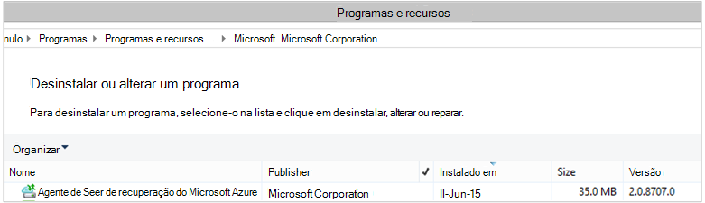

<properties
    pageTitle="Implantar e gerenciar o backup do cliente Windows Server/usando o PowerShell | Microsoft Azure"
    description="Saiba como implantar e gerenciar o Backup do Azure usando o PowerShell"
    services="backup"
    documentationCenter=""
    authors="saurabhsensharma"
    manager="shivamg"
    editor=""/>

<tags
    ms.service="backup"
    ms.workload="storage-backup-recovery"
    ms.tgt_pltfrm="na"
    ms.devlang="na"
    ms.topic="article"
    ms.date="09/01/2016"
    ms.author="saurabhsensharma;markgal;jimpark;nkolli;trinadhk"/>


# <a name="deploy-and-manage-backup-to-azure-for-windows-serverwindows-client-using-powershell"></a>Implantar e gerenciar o backup do Azure para Windows Server/Windows cliente usando o PowerShell

> [AZURE.SELECTOR]
- [BRAÇO](backup-client-automation.md)
- [Clássico](backup-client-automation-classic.md)

Este artigo mostra como usar o PowerShell para configuração do Azure Backup no Windows Server ou um cliente do Windows e o gerenciamento de recuperação e backup.

## <a name="install-azure-powershell"></a>Instale o PowerShell Azure

[AZURE.INCLUDE [learn-about-deployment-models](../../includes/learn-about-deployment-models-include.md)]

Em outubro de 2015, Azure PowerShell 1.0 foi lançado. Esta versão bem-sucedida a 0.9.8 liberar e colocado sobre algumas alterações significativas, especialmente no padrão de nomenclatura dos cmdlets. 1.0 cmdlets seguem o padrão de nomenclatura {verbo}-AzureRm {substantivo}; enquanto o 0.9.8 nomes não incluem **Rm** (por exemplo, New-AzureRmResourceGroup em vez de New-AzureResourceGroup). Ao usar o PowerShell Azure 0.9.8, primeiro você deve habilitar o modo do Gerenciador de recursos executando o comando **Alternar-AzureMode AzureResourceManager** . Este comando não é necessário em 1.0 ou posterior.

Se você deseja usar seus scripts escritos para o 0.9.8 ambiente, no ambiente 1.0 ou posterior, você deve cuidadosamente testar os scripts em um ambiente de pré-produção antes de usá-los em produção para evitar o impacto inesperado.

[Baixe a versão mais recente do PowerShell](https://github.com/Azure/azure-powershell/releases) (versão mínima necessária é: 1.0.0)


[AZURE.INCLUDE [arm-getting-setup-powershell](../../includes/arm-getting-setup-powershell.md)]


## <a name="create-a-backup-vault"></a>Criar um backup cofre

> [AZURE.WARNING] Para clientes usando o Backup do Azure pela primeira vez, você precisa registrar o provedor de Backup do Azure para ser usado com sua assinatura. Isso pode ser feito executando o seguinte comando: Register-AzureProvider - ProviderNamespace "Microsoft.Backup"

Você pode criar um novo cofre backup usando o cmdlet **New-AzureRMBackupVault** . O cofre backup é um recurso de BRAÇO, então você precisa colocá-lo dentro de um grupo de recursos. Em um console elevado do Azure PowerShell, execute os seguintes comandos:

```
PS C:\> New-AzureResourceGroup –Name “test-rg” -Region “West US”
PS C:\> $backupvault = New-AzureRMBackupVault –ResourceGroupName “test-rg” –Name “test-vault” –Region “West US” –Storage GeoRedundant
```

Use o cmdlet **Get-AzureRMBackupVault** para listar os compartimentos backup em uma assinatura.


## <a name="installing-the-azure-backup-agent"></a>Instalando o agente de Backup do Azure
Antes de instalar o agente de Backup do Azure, você precisa ter o instalador baixado e presente no Windows Server. Você pode obter a versão mais recente do instalador do [Centro de Download da Microsoft](http://aka.ms/azurebackup_agent) ou de página de painel do cofre backup. Salvar o instalador para um local acessível facilmente como * C:\Downloads\*.

Para instalar o agente, execute o seguinte comando em um console elevado do PowerShell:

```
PS C:\> MARSAgentInstaller.exe /q
```

Isso instala o agente com todas as opções padrão. A instalação leva alguns minutos no plano de fundo. Se você não especificar a opção de */nu* a janela **Windows Update** será aberto no final da instalação para verificar se há atualizações. Depois de instalado, o agente mostrará na lista de programas instalados.

Para ver a lista de programas instalados, vá para **Painel de controle** > **programas** > **programas e recursos**.



### <a name="installation-options"></a>Opções de instalação

Para ver todas as opções disponíveis por meio da linha de comando, use o seguinte comando:

```
PS C:\> MARSAgentInstaller.exe /?
```

As opções disponíveis incluem:

| Opção | Detalhes | Padrão |
| ---- | ----- | ----- |
| /q | Instalação silenciosa | - |
| /p: "local" | Caminho para a pasta de instalação para o agente de Backup do Azure. | Agente de serviços de recuperação Azure C:\Program Files\Microsoft |
| /s: "local" | Caminho da pasta de cache para o agente de Backup do Azure. | Agent\Scratch de serviços de recuperação Azure C:\Program Files\Microsoft |
| /m | Opt-in para o Microsoft Update | - |
| /nu | Não verificar se há atualizações após a conclusão da instalação | - |
| /d | Desinstalar o agente de serviços de recuperação do Microsoft Azure | - |
| /Ph | Endereço do Host de proxy | - |
| /po | Número da porta de Host de proxy | - |
| /Pu | Nome de usuário de Host de proxy | - |
| /pw | Senha de proxy | - |


## <a name="registering-with-the-azure-backup-service"></a>Registrando com o serviço de Backup do Azure
Antes de registrar com o serviço de Backup do Azure, é necessário garantir que os [pré-requisitos](backup-configure-vault.md) forem atendidos. Faça o seguinte:

- Tiver uma assinatura válida do Azure
- Ter um backup cofre

Para baixar as credenciais do cofre, execute o cmdlet **Get-AzureRMBackupVaultCredentials** em um console do PowerShell do Azure e armazená-la em um local conveniente como * C:\Downloads\*.

```
PS C:\> $credspath = "C:\"
PS C:\> $credsfilename = Get-AzureRMBackupVaultCredentials -Vault $backupvault -TargetLocation $credspath
PS C:\> $credsfilename
f5303a0b-fae4-4cdb-b44d-0e4c032dde26_backuprg_backuprn_2015-08-11--06-22-35.VaultCredentials
```

Registrando máquina com o cofre é feito usando o cmdlet [Start-OBRegistration](https://technet.microsoft.com/library/hh770398%28v=wps.630%29.aspx) :

```
PS C:\> $cred = $credspath + $credsfilename
PS C:\> Start-OBRegistration -VaultCredentials $cred -Confirm:$false

CertThumbprint      : 7a2ef2caa2e74b6ed1222a5e89288ddad438df2
SubscriptionID      : ef4ab577-c2c0-43e4-af80-af49f485f3d1
ServiceResourceName : test-vault
Region              : West US

Machine registration succeeded.
```

> [AZURE.IMPORTANT] Não use caminhos relativos para especificar o arquivo de credenciais do cofre. Você deve fornecer um caminho absoluto como entrada para o cmdlet.

## <a name="networking-settings"></a>Configurações de rede
Quando a conectividade da máquina Windows com a internet por meio de um servidor proxy, as configurações de proxy também podem ser fornecidas para o agente. Neste exemplo, não há nenhum servidor de proxy, para nós explicitamente estiver limpando quaisquer informações relacionadas ao proxy.

Uso de largura de banda também pode ser controlado com as opções de ```work hour bandwidth``` e ```non-work hour bandwidth``` para um determinado conjunto de dias da semana.

Configurar os detalhes de proxy e largura de banda é feita usando o cmdlet [Set-OBMachineSetting](https://technet.microsoft.com/library/hh770409%28v=wps.630%29.aspx) :

```
PS C:\> Set-OBMachineSetting -NoProxy
Server properties updated successfully.

PS C:\> Set-OBMachineSetting -NoThrottle
Server properties updated successfully.
```

## <a name="encryption-settings"></a>Configurações de criptografia
Os dados de backup enviados ao Azure Backup são criptografados para proteger a confidencialidade dos dados. A senha de criptografia está "senha" para descriptografar os dados no momento da restauração.

```
PS C:\> ConvertTo-SecureString -String "Complex!123_STRING" -AsPlainText -Force | Set-OBMachineSetting
Server properties updated successfully
```

> [AZURE.IMPORTANT] Manter as informações de senha segura e depois que ela é definida. Você não poderá restaurar os dados do Azure sem essa senha.

## <a name="back-up-files-and-folders"></a>Fazer backup de arquivos e pastas
Todos os seus backups de clientes e servidores do Windows Azure Backup são controlados por uma política. A política consiste em três partes:

1. **Agendamento de backup** que especifica quando os backups precisam ser feitas e sincronizados com o serviço.
2. **Agendamento de retenção** que especifica por quanto tempo para manter os pontos de recuperação no Azure.
3. Uma **especificação de inclusão/exclusão de arquivo** que determina o que deve ser feito backup.

Neste documento, desde que estamos estiver automatizar backup, vamos supor que nada foi configurado. Vamos começar criando uma nova política de backup usando o cmdlet [New-OBPolicy](https://technet.microsoft.com/library/hh770416.aspx) e usá-lo.

```
PS C:\> $newpolicy = New-OBPolicy
```

Neste momento a política está vazia e outros cmdlets são necessários para definir quais itens serão incluídos ou excluídos, quando backups será executada e onde os backups serão armazenados.

### <a name="configuring-the-backup-schedule"></a>Configurando o agendamento de backup
A primeira das 3 partes de uma política é o agendamento de backup, que é criado usando o cmdlet [New-OBSchedule](https://technet.microsoft.com/library/hh770401) . O agendamento de backup define quando backups precisam ser tomadas. Ao criar um cronograma, você precisa especificar 2 parâmetros de entrada:

- **Dias da semana em** que o backup deve executar. Você pode executar o trabalho de backup em apenas um dia ou todos os dias da semana, ou qualquer combinação entre.
- **Horas do dia** quando o backup deverá ser executado. Você pode definir até 3 horas diferentes do dia quando o backup será acionado.

Por exemplo, você pode configurar uma política de backup que é executado em 4 PM cada sábado e domingo.

```
PS C:\> $sched = New-OBSchedule -DaysofWeek Saturday, Sunday -TimesofDay 16:00
```

O agendamento de backup precisa ser associadas a uma política, e isso pode ser obtido usando o cmdlet [Set-OBSchedule](https://technet.microsoft.com/library/hh770407) .

```
PS C:> Set-OBSchedule -Policy $newpolicy -Schedule $sched
BackupSchedule : 4:00 PM Saturday, Sunday, Every 1 week(s) DsList : PolicyName : RetentionPolicy : State : New PolicyState : Valid
```
### <a name="configuring-a-retention-policy"></a>Configurando uma política de retenção
A política de retenção define por quanto tempo os pontos de recuperação criados a partir de trabalhos de backup são mantidos. Ao criar uma nova política de retenção usando o cmdlet [New-OBRetentionPolicy](https://technet.microsoft.com/library/hh770425) , você pode especificar o número de dias que os pontos de recuperação de backup precisam ser retidos com o Backup do Azure. O exemplo a seguir define uma política de retenção de 7 dias.

```
PS C:\> $retentionpolicy = New-OBRetentionPolicy -RetentionDays 7
```

A política de retenção deve ser associada com a política de principal usando o cmdlet [Set-OBRetentionPolicy](https://technet.microsoft.com/library/hh770405):

```
PS C:\> Set-OBRetentionPolicy -Policy $newpolicy -RetentionPolicy $retentionpolicy

BackupSchedule  : 4:00 PM
                  Saturday, Sunday,
                  Every 1 week(s)
DsList          :
PolicyName      :
RetentionPolicy : Retention Days : 7

                  WeeklyLTRSchedule :
                  Weekly schedule is not set

                  MonthlyLTRSchedule :
                  Monthly schedule is not set

                  YearlyLTRSchedule :
                  Yearly schedule is not set

State           : New
PolicyState     : Valid
```
### <a name="including-and-excluding-files-to-be-backed-up"></a>Incluir e excluir arquivos de backup
Um ```OBFileSpec``` objeto define os arquivos para ser incluídos ou excluídos em um backup. Este é um conjunto de regras de escopo check-out de arquivos protegidos e pastas em um computador. Você pode ter várias regras de inclusão ou exclusão conforme a necessidade de arquivo e associá-los a uma política. Ao criar um novo objeto de OBFileSpec, você pode:

- Especificar os arquivos e pastas a serem incluídos
- Especificar os arquivos e pastas que serão excluídos
- Especifica recursiva backup dos dados em uma pasta (ou) se somente os arquivos de nível superior na pasta especificada devem ser feitos backup.

O último é obtido usando o sinalizador - não recursiva no comando New-OBFileSpec.

No exemplo abaixo, vamos fazer backup de volume c e d: e excluir os binários do sistema operacional na pasta do Windows e quaisquer pastas temporárias. Para isso vamos criar dois especificações usando o cmdlet [New-OBFileSpec](https://technet.microsoft.com/library/hh770408) - uma para inclusão de arquivo e outro para exclusão. Depois que as especificações do arquivo foram criadas, eles são associados com a política usando o cmdlet [Add-OBFileSpec](https://technet.microsoft.com/library/hh770424) .

```
PS C:\> $inclusions = New-OBFileSpec -FileSpec @("C:\", "D:\")

PS C:\> $exclusions = New-OBFileSpec -FileSpec @("C:\windows", "C:\temp") -Exclude

PS C:\> Add-OBFileSpec -Policy $newpolicy -FileSpec $inclusions

BackupSchedule  : 4:00 PM
                  Saturday, Sunday,
                  Every 1 week(s)
DsList          : {DataSource
                  DatasourceId:0
                  Name:C:\
                  FileSpec:FileSpec
                  FileSpec:C:\
                  IsExclude:False
                  IsRecursive:True

                  , DataSource
                  DatasourceId:0
                  Name:D:\
                  FileSpec:FileSpec
                  FileSpec:D:\
                  IsExclude:False
                  IsRecursive:True

                  }
PolicyName      :
RetentionPolicy : Retention Days : 7

                  WeeklyLTRSchedule :
                  Weekly schedule is not set

                  MonthlyLTRSchedule :
                  Monthly schedule is not set

                  YearlyLTRSchedule :
                  Yearly schedule is not set

State           : New
PolicyState     : Valid


PS C:\> Add-OBFileSpec -Policy $newpolicy -FileSpec $exclusions

BackupSchedule  : 4:00 PM
                  Saturday, Sunday,
                  Every 1 week(s)
DsList          : {DataSource
                  DatasourceId:0
                  Name:C:\
                  FileSpec:FileSpec
                  FileSpec:C:\
                  IsExclude:False
                  IsRecursive:True
                  ,FileSpec
                  FileSpec:C:\windows
                  IsExclude:True
                  IsRecursive:True
                  ,FileSpec
                  FileSpec:C:\temp
                  IsExclude:True
                  IsRecursive:True

                  , DataSource
                  DatasourceId:0
                  Name:D:\
                  FileSpec:FileSpec
                  FileSpec:D:\
                  IsExclude:False
                  IsRecursive:True

                  }
PolicyName      :
RetentionPolicy : Retention Days : 7

                  WeeklyLTRSchedule :
                  Weekly schedule is not set

                  MonthlyLTRSchedule :
                  Monthly schedule is not set

                  YearlyLTRSchedule :
                  Yearly schedule is not set

State           : New
PolicyState     : Valid
```

### <a name="applying-the-policy"></a>Aplicar a política
Agora o objeto de política é concluído e tem um agendamento de backup associado, política de retenção e uma lista de inclusão/exclusão de arquivos. Agora pode ser confirmada para Backup do Azure usar essa política. Antes de aplicar a política recém-criado garantir que não há nenhum políticas de backup existentes associadas ao servidor usando o cmdlet [Remove-OBPolicy](https://technet.microsoft.com/library/hh770415) . Removendo a política solicitará confirmação. Para ignorar o uso de confirmação a ```-Confirm:$false``` sinalizador com o cmdlet.

```
PS C:> Get-OBPolicy | Remove-OBPolicy
Microsoft Azure Backup Are you sure you want to remove this backup policy? This will delete all the backed up data. [Y] Yes [A] Yes to All [N] No [L] No to All [S] Suspend [?] Help (default is "Y"):
```

Confirmar o objeto de política é feito usando o cmdlet [Set-OBPolicy](https://technet.microsoft.com/library/hh770421) . Isso também solicitará confirmação. Para ignorar o uso de confirmação a ```-Confirm:$false``` sinalizador com o cmdlet.

```
PS C:> Set-OBPolicy -Policy $newpolicy
Microsoft Azure Backup Do you want to save this backup policy ? [Y] Yes [A] Yes to All [N] No [L] No to All [S] Suspend [?] Help (default is "Y"):
BackupSchedule : 4:00 PM Saturday, Sunday, Every 1 week(s)
DsList : {DataSource
         DatasourceId:4508156004108672185
         Name:C:\
         FileSpec:FileSpec
         FileSpec:C:\
         IsExclude:False
         IsRecursive:True,

         FileSpec
         FileSpec:C:\windows
         IsExclude:True
         IsRecursive:True,

         FileSpec
         FileSpec:C:\temp
         IsExclude:True
         IsRecursive:True,

         DataSource
         DatasourceId:4508156005178868542
         Name:D:\
         FileSpec:FileSpec
         FileSpec:D:\
         IsExclude:False
         IsRecursive:True
    }
PolicyName : c2eb6568-8a06-49f4-a20e-3019ae411bac
RetentionPolicy : Retention Days : 7
              WeeklyLTRSchedule :
              Weekly schedule is not set

              MonthlyLTRSchedule :
              Monthly schedule is not set

              YearlyLTRSchedule :
              Yearly schedule is not set
State : Existing PolicyState : Valid
```

Você pode exibir os detalhes da política backup existente usando o cmdlet [Get-OBPolicy](https://technet.microsoft.com/library/hh770406) . Você pode drill down ainda mais usando o cmdlet [Get-OBSchedule](https://technet.microsoft.com/library/hh770423) para o agendamento de backup e o cmdlet [Get-OBRetentionPolicy](https://technet.microsoft.com/library/hh770427) para as políticas de retenção

```
PS C:> Get-OBPolicy | Get-OBSchedule
SchedulePolicyName : 71944081-9950-4f7e-841d-32f0a0a1359a
ScheduleRunDays : {Saturday, Sunday}
ScheduleRunTimes : {16:00:00}
State : Existing

PS C:> Get-OBPolicy | Get-OBRetentionPolicy
RetentionDays : 7
RetentionPolicyName : ca3574ec-8331-46fd-a605-c01743a5265e
State : Existing

PS C:> Get-OBPolicy | Get-OBFileSpec
FileName : *
FilePath : \?\Volume{b835d359-a1dd-11e2-be72-2016d8d89f0f}\
FileSpec : D:\
IsExclude : False
IsRecursive : True

FileName : *
FilePath : \?\Volume{cdd41007-a22f-11e2-be6c-806e6f6e6963}\
FileSpec : C:\
IsExclude : False
IsRecursive : True

FileName : *
FilePath : \?\Volume{cdd41007-a22f-11e2-be6c-806e6f6e6963}\windows
FileSpec : C:\windows
IsExclude : True
IsRecursive : True

FileName : *
FilePath : \?\Volume{cdd41007-a22f-11e2-be6c-806e6f6e6963}\temp
FileSpec : C:\temp
IsExclude : True
IsRecursive : True
```

### <a name="performing-an-ad-hoc-backup"></a>Executar um backup ad-hoc
Depois que uma política de backup foi definida, os backups ocorrerá pelo cronograma. Disparar um backup ad-hoc também é possível usar o cmdlet [Start-OBBackup](https://technet.microsoft.com/library/hh770426) :

```
PS C:> Get-OBPolicy | Start-OBBackup
Taking snapshot of volumes...
Preparing storage...
Estimating size of backup items...
Estimating size of backup items...
Transferring data...
Verifying backup...
Job completed.
The backup operation completed successfully.
```

## <a name="restore-data-from-azure-backup"></a>Restaurar dados de Backup do Azure
Esta seção o guiará pelas etapas para automatizar a recuperação de dados de Backup do Azure. Isso envolve as seguintes etapas:

1. Escolha o volume de origem
2. Escolha um ponto de backup para restaurar
3. Escolha um item para restaurar
4. Disparar o processo de restauração

### <a name="picking-the-source-volume"></a>O volume de origem de separação
Para restaurar um item de Backup do Azure, primeiro é necessário identificar a origem do item. Como podemos estiver executando os comandos no contexto de um servidor Windows ou um cliente do Windows, máquina já identificada. Identificando a origem a próxima etapa é identificar o volume que ele contém. Uma lista de volumes ou fontes de backup desta máquina pode ser recuperada executando o cmdlet [Get-OBRecoverableSource](https://technet.microsoft.com/library/hh770410) . Esse comando retorna uma matriz de todas as fontes de backup deste cliente/servidor.

```
PS C:> $source = Get-OBRecoverableSource
PS C:> $source
FriendlyName : C:\
RecoverySourceName : C:\
ServerName : myserver.microsoft.com

FriendlyName : D:\
RecoverySourceName : D:\
ServerName : myserver.microsoft.com
```

### <a name="choosing-a-backup-point-to-restore"></a>Escolhendo um ponto de backup para restaurar
Lista de pontos de backup pode ser recuperada executando o cmdlet [Get-OBRecoverableItem](https://technet.microsoft.com/library/hh770399.aspx) com parâmetros apropriados. Em nosso exemplo, estamos vai escolher o ponto de backup mais recente para o volume de origem *d:.* e usá-lo para recuperar um arquivo específico.

```
PS C:> $rps = Get-OBRecoverableItem -Source $source[1]
IsDir : False
ItemNameFriendly : D:\
ItemNameGuid : \?\Volume{b835d359-a1dd-11e2-be72-2016d8d89f0f}\
LocalMountPoint : D:\
MountPointName : D:\
Name : D:\
PointInTime : 18-Jun-15 6:41:52 AM
ServerName : myserver.microsoft.com
ItemSize :
ItemLastModifiedTime :

IsDir : False
ItemNameFriendly : D:\
ItemNameGuid : \?\Volume{b835d359-a1dd-11e2-be72-2016d8d89f0f}\
LocalMountPoint : D:\
MountPointName : D:\
Name : D:\
PointInTime : 17-Jun-15 6:31:31 AM
ServerName : myserver.microsoft.com
ItemSize :
ItemLastModifiedTime :
```
O objeto ```$rps``` é uma matriz de pontos de backup. O primeiro elemento é o ponto mais recente e enésimo elemento é o ponto mais antigo. Para escolher o ponto mais recente, usaremos ```$rps[0]```.

### <a name="choosing-an-item-to-restore"></a>Escolhendo um item para restaurar
Para identificar o exato do arquivo ou pasta a ser restaurada, repetidamente use o cmdlet [Get-OBRecoverableItem](https://technet.microsoft.com/library/hh770399.aspx) . Dessa forma a hierarquia de pastas pode ser acessada unicamente usando o ```Get-OBRecoverableItem```.

Neste exemplo, se quisermos restaurar o arquivo *finances.xls* nós pode fazer referência que usando o objeto ```$filesFolders[1]```.

```
PS C:> $filesFolders = Get-OBRecoverableItem $rps[0]
PS C:> $filesFolders
IsDir : True
ItemNameFriendly : D:\MyData\
ItemNameGuid : \?\Volume{b835d359-a1dd-11e2-be72-2016d8d89f0f}\MyData\
LocalMountPoint : D:\
MountPointName : D:\
Name : MyData
PointInTime : 18-Jun-15 6:41:52 AM
ServerName : myserver.microsoft.com
ItemSize :
ItemLastModifiedTime : 15-Jun-15 8:49:29 AM

PS C:> $filesFolders = Get-OBRecoverableItem $filesFolders[0]
PS C:> $filesFolders
IsDir : False
ItemNameFriendly : D:\MyData\screenshot.oxps
ItemNameGuid : \?\Volume{b835d359-a1dd-11e2-be72-2016d8d89f0f}\MyData\screenshot.oxps
LocalMountPoint : D:\
MountPointName : D:\
Name : screenshot.oxps
PointInTime : 18-Jun-15 6:41:52 AM
ServerName : myserver.microsoft.com
ItemSize : 228313
ItemLastModifiedTime : 21-Jun-14 6:45:09 AM

IsDir : False
ItemNameFriendly : D:\MyData\finances.xls
ItemNameGuid : \?\Volume{b835d359-a1dd-11e2-be72-2016d8d89f0f}\MyData\finances.xls
LocalMountPoint : D:\
MountPointName : D:\
Name : finances.xls
PointInTime : 18-Jun-15 6:41:52 AM
ServerName : myserver.microsoft.com
ItemSize : 96256
ItemLastModifiedTime : 21-Jun-14 6:43:02 AM
```

Você também pode pesquisar itens restaurar usando o ```Get-OBRecoverableItem``` cmdlet. Em nosso exemplo, para pesquisar *finances.xls* nós poderia obter uma alça no arquivo executando este comando:

```
PS C:\> $item = Get-OBRecoverableItem -RecoveryPoint $rps[0] -Location "D:\MyData" -SearchString "finance*"
```

### <a name="triggering-the-restore-process"></a>Disparar o processo de restauração
Para disparar o processo de restauração, primeiro precisamos especificar as opções de recuperação. Isso pode ser feito usando o cmdlet [New-OBRecoveryOption](https://technet.microsoft.com/library/hh770417.aspx) . Neste exemplo, vamos supor que queremos restaurar os arquivos *c:\Temp*. Também suponhamos que queremos ignorar arquivos que já existem na pasta de destino *C:\temp*. Para criar tal uma opção de recuperação, use o seguinte comando:

```
PS C:\> $recovery_option = New-OBRecoveryOption -DestinationPath "C:\temp" -OverwriteType Skip
```

Agora disparar restauração usando o comando [OBRecovery iniciar](https://technet.microsoft.com/library/hh770402.aspx) no selecionado ```$item``` da saída do ```Get-OBRecoverableItem``` cmdlet:

```
PS C:\> Start-OBRecovery -RecoverableItem $item -RecoveryOption $recover_option
Estimating size of backup items...
Estimating size of backup items...
Estimating size of backup items...
Estimating size of backup items...
Job completed.
The recovery operation completed successfully.
```


## <a name="uninstalling-the-azure-backup-agent"></a>Desinstalar o agente de Backup do Azure
Desinstalar o agente de Backup do Azure pode ser feito usando o seguinte comando:

```
PS C:\> .\MARSAgentInstaller.exe /d /q
```

Desinstalar os binários do agente da máquina tem algumas consequências a considerar:

- Ela remove o filtro de arquivo da máquina e controle de alterações é interrompido.
- Todas as informações de política são removidas da máquina, mas as informações de política continuará armazenada no serviço.
- Todos os agendamentos de backup são removidos e são realizados sem backups posterior.

No entanto, os dados armazenados no Azure permanece e são mantidos de acordo com a configuração de política de retenção por você. Pontos mais antigos automaticamente estão desatualizados.

## <a name="remote-management"></a>Gerenciamento remoto
Todo o gerenciamento em torno do agente Backup do Azure, políticas e fontes de dados pode ser feito remotamente através do PowerShell. O computador que será gerenciado remotamente precisa ser preparado corretamente.

Por padrão, o serviço WinRM é configurado para inicialização manual. O tipo de inicialização deve ser definido como *automático* e o serviço deve ser iniciado. Para verificar se o serviço WinRM está em execução, o valor da propriedade Status deve estar *executando*.

```
PS C:\> Get-Service WinRM

Status   Name               DisplayName
------   ----               -----------
Running  winrm              Windows Remote Management (WS-Manag...
```

PowerShell deve ser configurado para comunicação remota.

```
PS C:\> Enable-PSRemoting -force
WinRM is already set up to receive requests on this computer.
WinRM has been updated for remote management.
WinRM firewall exception enabled.

PS C:\> Set-ExecutionPolicy unrestricted -force
```

Máquina pode agora ser gerenciada remotamente - iniciando da instalação do agente. Por exemplo, o script a seguir copia o agente no computador remoto e instala.

```
PS C:\> $dloc = "\\REMOTESERVER01\c$\Windows\Temp"
PS C:\> $agent = "\\REMOTESERVER01\c$\Windows\Temp\MARSAgentInstaller.exe"
PS C:\> $args = "/q"
PS C:\> Copy-Item "C:\Downloads\MARSAgentInstaller.exe" -Destination $dloc - force

PS C:\> $s = New-PSSession -ComputerName REMOTESERVER01
PS C:\> Invoke-Command -Session $s -Script { param($d, $a) Start-Process -FilePath $d $a -Wait } -ArgumentList $agent $args
```

## <a name="next-steps"></a>Próximas etapas
Para obter mais informações sobre consulte do Azure para Windows Server/cliente de Backup

- [Introdução ao Azure Backup](backup-introduction-to-azure-backup.md)
- [Fazer backup de servidores do Windows](backup-configure-vault.md)
