<properties
    pageTitle="Fazer backup de um cliente Windows server ou no Azure usando o modelo clássico de implantação | Microsoft Azure"
    description="Backup servidores Windows ou clientes Azure criando um backup cofre, baixando credenciais, instalar o agente de backup e concluir um backup inicial dos seus arquivos e pastas."
    services="backup"
    documentationCenter=""
    authors="markgalioto"
    manager="cfreeman"
    editor=""
    keywords="cofre backup; fazer backup de um servidor do Windows; janelas de backup;"/>

<tags
    ms.service="backup"
    ms.workload="storage-backup-recovery"
    ms.tgt_pltfrm="na"
    ms.devlang="na"
    ms.topic="article"
    ms.date="08/08/2016"
    ms.author="jimpark; trinadhk; markgal"/>

# Fazer backup de um cliente Windows server ou no Azure usando o modelo clássico de implantação

> [AZURE.SELECTOR]
- [Portal clássico](backup-configure-vault-classic.md)
- [Portal do Azure](backup-configure-vault.md)

Este artigo aborda os procedimentos que você precisa acompanhar para preparar seu ambiente e fazer backup de um servidor do Windows (ou cliente) para o Azure. Ele também aborda considerações para implantar sua solução de backup. Se você estiver interessado em experimentar o Backup do Azure pela primeira vez, este artigo rapidamente orienta você no processo.

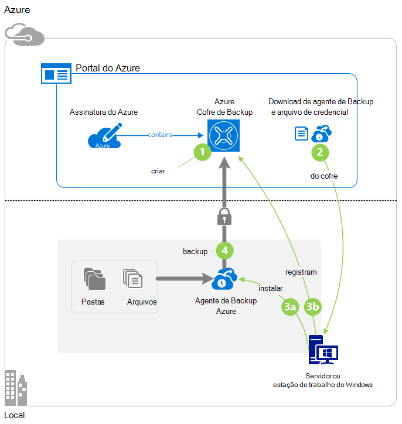

>[AZURE.IMPORTANT] Azure tem dois modelos de implantação diferentes para criar e trabalhar com recursos: Gerenciador de recursos e clássico. Este artigo aborda usando o modelo clássico de implantação. Recomendamos que mais novas implantações de usam o modelo do Gerenciador de recursos.

## Antes de começar
Para fazer backup de um servidor ou cliente no Azure, é necessário uma conta do Azure. Se você não tiver um, você pode criar uma [conta gratuita](https://azure.microsoft.com/free/) em apenas alguns minutos.

## Etapa 1: Criar um backup cofre
Para fazer backup de arquivos e pastas de um servidor ou cliente, você precisa criar um backup cofre na região geográfica onde você deseja armazenar os dados.

### Para criar um backup cofre

1. Entrar no [portal do clássico](https://manage.windowsazure.com/).

2. Clique em **novo** > **Serviços de dados** > **Serviços de recuperação** > **Cofre de Backup**e escolha **Criar rápida**.

3. Para o parâmetro de **nome** , digite um nome amigável para o backup cofre. Digite um nome que contenha entre 2 e 50 caracteres. Ele deve começar com uma letra e pode conter apenas letras, números e hifens. Esse nome deve ser exclusivo para cada assinatura.

4. Para o parâmetro de **região** , selecione a região geográfica para o backup cofre. Essa opção determina a região geográfica onde os seus dados de backup são enviados. Escolhendo uma região geográfica que for próximo do seu local, você pode reduzir a latência de rede, ao fazer backup em Azure.

5. Clique em **criar cofre**.

    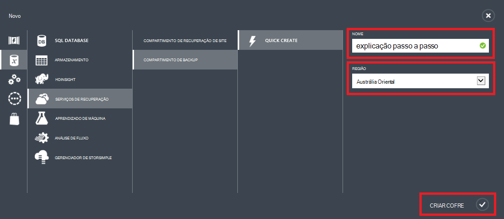

    Pode levar alguns instantes para o Cofre de backup a ser criado. Para verificar o status, monitore as notificações na parte inferior do portal do clássico.

    Depois que o backup cofre tiver sido criado, você verá uma mensagem informando que o cofre foi criado com êxito. Ele também é exibida como **ativa** na lista de **Serviços de recuperação de** recursos.

    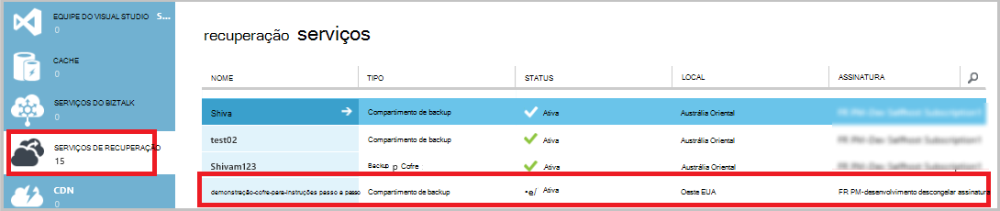

4. Selecione a opção de redundância de armazenamento seguindo as etapas descritas aqui.

    >[AZURE.IMPORTANT] O melhor horário para identificar sua opção de redundância de armazenamento é logo após a criação de cofre e antes de qualquer máquinas são registradas ao cofre. Depois que um item tiver sido registrado ao cofre, a opção de redundância de armazenamento está bloqueada e não pode ser modificada.

    Se você estiver usando o Azure como um ponto de extremidade de armazenamento de backup principal (por exemplo, você estiver fazendo backup para Azure de um Windows server), considere a opção de [armazenamento geográfica redundante](../storage/storage-redundancy.md#geo-redundant-storage) separação (padrão).

    Se você estiver usando o Azure como um ponto de extremidade de armazenamento de backup terceira (por exemplo, você está usando Gerenciador de proteção de dados do System Center para armazenar uma cópia de backup local no local e o uso do Azure para necessidades de retenção a longo prazo), considere escolhendo [armazenamento redundante localmente](../storage/storage-redundancy.md#locally-redundant-storage). Isto traz o custo de armazenamento de dados no Azure, fornecendo um nível inferior de durabilidade para seus dados que podem ser aceitáveis para a terceira cópias.

    **Para selecionar a opção de redundância de armazenamento:**

    a. Clique no cofre que você acabou de criar.

    b. Na página de início rápido, selecione **Configurar**.

    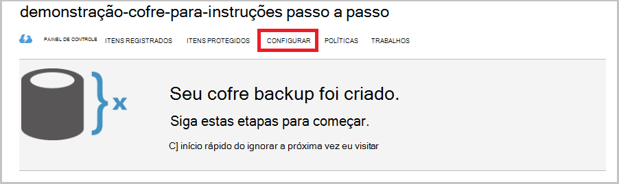

    c. Escolha a opção de redundância de armazenamento apropriado.

    Se você selecionar **Localmente redundantes**, é necessário clicar em **Salvar** (porque **Geográfica redundante** é a opção padrão).

    d. No painel de navegação esquerdo, clique em **Serviços de recuperação** para retornar à lista de recursos para serviços de recuperação.

## Etapa 2: Baixar o arquivo de credencial do cofre
Máquina local precisa ser autenticada com um cofre backup antes que ele pode fazer backup de dados no Azure. A autenticação é alcançada por meio de *credenciais do cofre*. O arquivo de credencial cofre é baixado por meio de um canal seguro a partir do portal clássico. Não se mantiver a chave privada do certificado no portal do ou o serviço.

Saiba mais sobre [usando cofre credenciais para autenticar com o serviço de Backup](backup-introduction-to-azure-backup.md#what-is-the-vault-credential-file).

### Para baixar o arquivo de credencial do cofre para um computador local

1. No painel de navegação esquerdo, clique em **Serviços de recuperação**e selecione o Cofre de backup que você criou.

    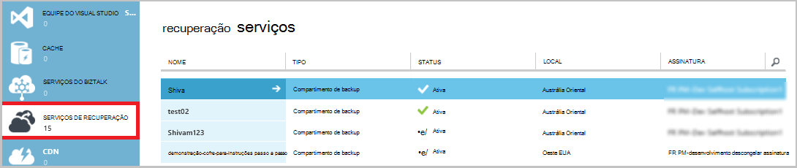

2.  Na página de início rápido, clique em **credenciais do Cofre de Download**.

    O portal de clássico gera uma credencial de cofre usando uma combinação do nome do cofre e a data atual. O arquivo de credenciais do cofre é usado somente durante o fluxo de trabalho de registro e expira após 48 horas.

    O arquivo de credencial cofre pode ser baixado a partir do portal.

3. Clique em **Salvar** para baixar o arquivo de credencial cofre na pasta Downloads da conta local. Você também pode selecionar **Salvar como** no menu **Salvar** para especificar um local para o arquivo de credencial do cofre.

    >[AZURE.NOTE] Verifique se que o arquivo de credencial cofre é salvo em um local que possa ser acessado do seu computador. Se ele estiver armazenado em um bloco de mensagem de compartilhamento ou servidor do arquivo, verifique se você tem as permissões para acessá-lo.

## Etapa 3: Baixar, instalar e registrar o agente de Backup
Depois de criar o cofre backup e baixar o arquivo de credencial cofre, um agente deve ser instalado em cada uma das suas máquinas do Windows.

### Para baixar, instalar e registrar o agente

1. Clique em **Serviços de recuperação**e selecione o Cofre de backup que você deseja registrar com um servidor.

2. Na página de início rápido, clique no agente de **agente para o Windows Server ou o Gerenciador de proteção de dados do System Center ou o cliente do Windows**. Clique em **Salvar**.

    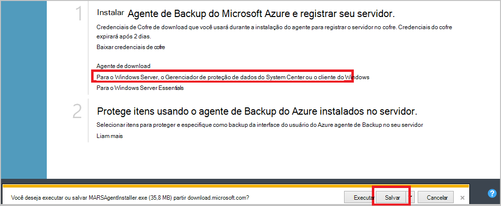

3. Depois de baixar o arquivo MARSagentinstaller.exe, clique em **Executar** (ou clique duas vezes em **MARSAgentInstaller.exe** do local salvo).

4. Escolha a pasta de instalação e a pasta de cache que são necessários para o agente e clique em **Avançar**. O local do cache especificado deve ter espaço livre igual a pelo menos 5% dos dados de backup.

5. Você pode continuar para se conectar à Internet por meio das configurações de proxy padrão.          Se você usar um servidor proxy para se conectar à Internet, na página de configuração de Proxy, marque a caixa de seleção **usar configurações personalizadas de proxy** e insira os detalhes do servidor de proxy. Se você usar um proxy autenticado, insira os detalhes de nome e senha do usuário e clique em **Avançar**.

7. Clique em **instalar** para iniciar a instalação do agente. O agente de Backup instala .NET Framework 4,5 e Windows PowerShell (se ele ainda não estiver instalado) para concluir a instalação.

8. Após a instalação do agente, clique em **Continuar para o registro** para continuar com o fluxo de trabalho.

9. Na página de identificação de cofre, procure e selecione o arquivo de credencial cofre que você baixou anteriormente.

    O arquivo de credencial cofre é válido para apenas 48 horas depois de baixado a partir do portal. Se você encontrar um erro nesta página (como "credenciais do cofre arquivo fornecido expirou"), entre portal e baixar o arquivo de credencial cofre novamente.

    Certifique-se de que o arquivo de credencial cofre está disponível em um local que possa ser acessado pelo aplicativo de instalação. Se você encontrar erros de acesso relacionadas, copie o arquivo de credencial do cofre para um local temporário na mesma máquina e repita a operação.

    Se você encontrar um erro de credencial cofre como "Cofre inválido credenciais fornecidas", o arquivo está danificado ou não tiver as credenciais mais recentes associado com o serviço de recuperação. Repita a operação após fazer o download de um novo arquivo de credencial do cofre a partir do portal. Esse erro também pode ocorrer se um usuário clicar na opção de **credencial de cofre Download** várias vezes sucessivamente rápida. Nesse caso, apenas o último arquivo de credencial de cofre é válido.

9. Na página Configuração de criptografia, você pode gerar uma senha ou fornecer uma senha (com um mínimo de 16 caracteres). Lembre-se de salvar a senha em um local seguro.

10. Clique em **Concluir**. O Assistente de servidor Register registra o servidor com Backup.

    >[AZURE.WARNING] Se você perder ou esquecer a senha, a Microsoft não pode ajudá-lo a recuperar os dados de backup. Você possui a senha de criptografia e a Microsoft não tem visibilidade a senha que você usa. Salve o arquivo em um local seguro porque será necessária durante uma operação de recuperação.

11. Depois que a chave de criptografia estiver definida, deixe a caixa de seleção **Iniciar a agente de serviços do Microsoft Azure recuperação** selecionada e clique em **Fechar**.

## Etapa 4: Conclua o backup inicial

O backup inicial inclui duas tarefas principais:

- Criando o agendamento de backup
- Fazer backup de arquivos e pastas pela primeira vez

Após a política de backup completa o backup inicial, ele cria pontos de backup que você pode usar se precisar recuperar os dados. A política de backup faz isso com base na agenda que você definir.

### Para agendar o backup

1. Abra o agente de Backup do Microsoft Azure. (Ele será aberto automaticamente se você deixou a caixa de seleção **Iniciar a agente de serviços do Microsoft Azure recuperação** selecionada quando você fechar o Assistente de servidor Register.) Você pode encontrá-lo, pesquisando sua máquina **Microsoft Azure Backup**.

    

2. No agente de Backup, clique em **Backup da agenda**.

    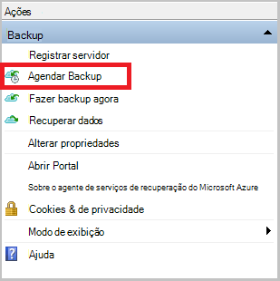

3. Na página de Introdução do Assistente de agendamento de Backup, clique em **Avançar**.

4. Em selecionar itens a página Backup, clique em **Adicionar itens**.

5. Selecione os arquivos e pastas que você deseja fazer backup e clique em **Okey**.

6. Clique em **Avançar**.

7. Na página **Especificar agenda de Backup** , especifique o **agendamento de backup** e clique em **Avançar**.

    Você pode programar backups semanais ou diariamente (a uma taxa máxima de três vezes por dia).

    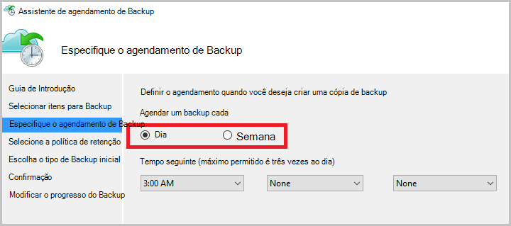

    >[AZURE.NOTE] Para obter mais informações sobre como especificar o agendamento de backup, consulte o artigo [Use Azure Backup para substituir sua infraestrutura de fita](backup-azure-backup-cloud-as-tape.md).

8. Na página **Selecionar política de retenção** , selecione a **Política de retenção** para a cópia de backup.

    A política de retenção Especifica a duração para a qual o backup será armazenado. Em vez de apenas especificando uma "política simples" para todos os pontos de backup, você pode especificar diferentes políticas de retenção com base em quando ocorre o backup. Você pode modificar as políticas de retenção de diário, semanal, mensal e anual para atender suas necessidades.

9. Na página Escolher tipo de Backup inicial, escolha o tipo de backup inicial. Deixe a opção **automaticamente pela rede** selecionada e clique em **Avançar**.

    Você pode fazer backup automaticamente pela rede, ou você pode fazer backup offline. O restante deste artigo descreve o processo de backup automaticamente. Se você preferir fazer um backup offline, examine o artigo [Offline fluxo de trabalho de backup no Azure Backup](backup-azure-backup-import-export.md) para obter informações adicionais.

10. Na página confirmação, examine as informações e clique em **Concluir**.

11. Depois que o assistente terminar de criar o agendamento de backup, clique em **Fechar**.

### Habilitar a otimização de rede (opcional)

O agente de Backup fornece a otimização de rede. A otimização de controles, como largura de banda de rede é usada durante a transferência de dados. Este controle pode ser útil se você precisar fazer backup de dados durante horas de trabalho, mas não quiser que o processo de backup interfira com outro tráfego de Internet. A limitação se aplica para fazer backup e restaurar atividades.

**Para habilitar a otimização de rede**

1. No agente de Backup, clique em **Alterar propriedades**.

    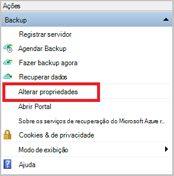

2. Na guia **Throttling** , marque a caixa de seleção **Habilitar o uso de largura de banda de internet a otimização para operações de backup** .

    

3. Depois que você habilitou a otimização, especifique a largura de banda permitida para transferir dados de backup durante o **horário de trabalho** e **horário de trabalho não**.

    Os valores de largura de banda começam a 512 kilobits por segundo (Kbps) e podem ir até 1.023 megabytes por segundo (). Você pode também designar o início e término para o **horário de trabalho**e quais dias da semana são dias de trabalho considerada. Horas fora do trabalho designado horas são consideradas não-trabalhar horas.

4. Clique em **Okey**.

### Para fazer backup agora

1. No agente de Backup, clique em **Fazer backup agora** para concluir a propagação inicial através da rede.

    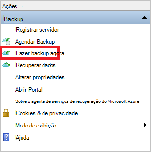

2. Na página confirmação, examine as configurações que o agora Assistente de backup usará para fazer backup de máquina. Clique em **Fazer backup**.

3. Clique em **Fechar** para fechar o assistente. Se você fizer isso, antes de concluir o processo de backup, o assistente continuará a ser executado em segundo plano.

Após o backup inicial for concluído, o status de **trabalho concluído** aparece no console de Backup.

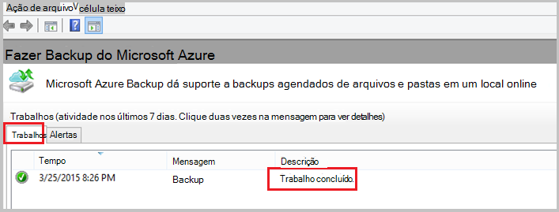

## Próximas etapas
- Inscreva-se para uma [conta gratuita do Azure](https://azure.microsoft.com/free/).

Para obter informações adicionais sobre como fazer backup VMs ou outras cargas de trabalho, consulte:

- [Fazer backup de VMs IaaS](backup-azure-vms-prepare.md)
- [Fazer backup de cargas de trabalho para o Azure com o servidor de Backup do Microsoft Azure](backup-azure-microsoft-azure-backup.md)
- [Fazer backup de cargas de trabalho para o Azure com o DPM](backup-azure-dpm-introduction.md)
