<properties
    pageTitle="Fazer backup de um cliente para o Azure com Backup Azure usando o modelo de implantação do Gerenciador de recursos ou o Windows Server | Microsoft Azure"
    description="Backup servidores Windows ou clientes Azure criando um backup cofre, baixando credenciais, instalar o agente de backup e concluir um backup inicial dos seus arquivos e pastas."
    services="backup"
    documentationCenter=""
    authors="markgalioto"
    manager="cfreeman"
    editor=""
    keywords="cofre backup; fazer backup de um servidor do Windows; janelas de backup;"/>

<tags
    ms.service="backup"
    ms.workload="storage-backup-recovery"
    ms.tgt_pltfrm="na"
    ms.devlang="na"
    ms.topic="article"
    ms.date="08/10/2016"
    ms.author="jimpark; trinadhk; markgal"/>

# Fazer backup de um cliente Windows Server ou no Azure usando o modelo de implantação do Gerenciador de recursos

> [AZURE.SELECTOR]
- [Portal do Azure](backup-configure-vault.md)
- [Portal clássico](backup-configure-vault-classic.md)

Este artigo explica como backup de seu Windows Server (ou cliente Windows) arquivos e pastas no Azure com Backup Azure usando o modelo de implantação do Gerenciador de recursos.

[AZURE.INCLUDE [learn-about-deployment-models](../../includes/backup-deployment-models.md)]

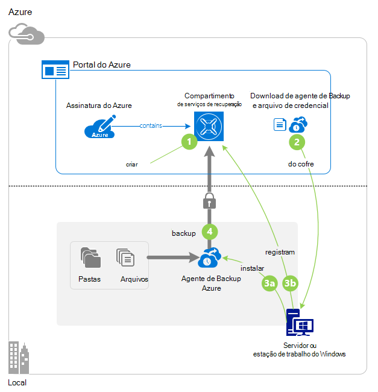

## Antes de começar
Para fazer backup de um servidor ou cliente no Azure, é necessário uma conta do Azure. Se você não tiver um, você pode criar uma [conta gratuita](https://azure.microsoft.com/free/) em apenas alguns minutos.

## Etapa 1: Criar um cofre de serviços de recuperação

Um cofre de serviços de recuperação é uma entidade que armazena todos os backups e pontos de recuperação que criar ao longo do tempo. O Cofre de serviços de recuperação também contém a política de backup aplicada às pastas e arquivos protegidos. Quando você cria um cofre de serviços de recuperação, você também deve selecionar a opção de redundância de armazenamento apropriado.

### Para criar um cofre de serviços de recuperação

1. Se você ainda não fez isso, entrar no [Portal do Azure](https://portal.azure.com/) usando sua assinatura do Azure.

2. No menu Hub, clique em **Procurar** e na lista de recursos, digite **Os serviços de recuperação**. Conforme você começa a digitar, filtre a lista com base na sua entrada. Clique em **compartimentos de serviços de recuperação**.

    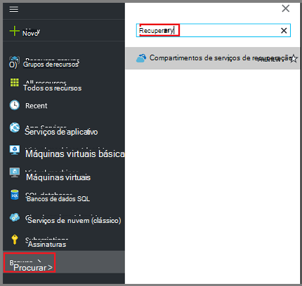  

    Na lista de serviços de recuperação compartimentos é exibida.

3. No menu **compartimentos de serviços de recuperação** , clique em **Adicionar**.

    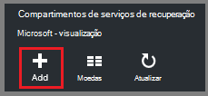

    A lâmina de Cofre de serviços de recuperação é aberta, solicitando que você forneça um **nome**, **assinatura**, **grupo de recursos**e **local**.

    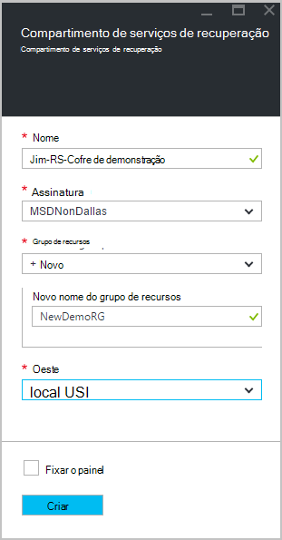

4. Para **nome**, digite um nome amigável para identificar o cofre. O nome deve ser exclusivo para a assinatura do Azure. Digite um nome que contenha entre 2 e 50 caracteres. Ele deve começar com uma letra e pode conter apenas letras, números e hifens.

5. Clique na **assinatura** para ver a lista de assinaturas disponíveis. Se você não tiver certeza de qual assinatura usar, use o padrão (ou sugeridos) assinatura. Haverá várias opções somente se sua conta organizacional está associada a várias assinaturas Azure.

6. Clique em **grupo de recursos** para ver a lista de grupos de recursos disponíveis, ou clique em **novo** para criar um novo grupo de recursos. Para obter informações completas sobre grupos de recursos, consulte [Visão geral do Gerenciador de recursos do Azure](../azure-resource-manager/resource-group-overview.md)

7. Clique em **local** para selecionar a região geográfica para o cofre. Essa opção determina a região geográfica onde os seus dados de backup são enviados. Escolhendo uma região geográfica que for próximo do seu local, você pode reduzir a latência de rede, ao fazer backup em Azure.

8. Clique em **criar**. Pode levar alguns instantes para o Cofre de serviços de recuperação a ser criado. Monitore as notificações de status na área superior direita no portal. Depois que seu cofre é criado, ele deve abrir no portal. Se você não vir seu cofre listado depois que ela foi concluída, clique em **Atualizar**. Quando a lista de atualizações, clique no nome do cofre.

### Para determinar a redundância de armazenamento
Quando você cria primeiro um cofre de serviços de recuperação é determinar como o armazenamento é replicado.

1. Na lâmina **configurações** , que é aberto automaticamente com seu painel Cofre, clique em **Infraestrutura de Backup**.

2. Na lâmina infraestrutura de Backup, clique em **Configuração de Backup** para exibir o **tipo de replicação de armazenamento**.

    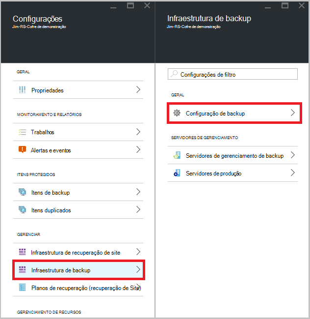

3. Escolha a opção de replicação de armazenamento para seu cofre.

    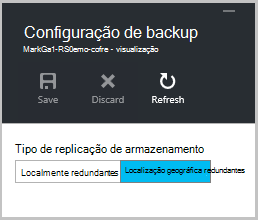

    Por padrão, seu cofre tem armazenamento redundante de localização geográfica. Se você estiver usando o Azure como um ponto de extremidade de armazenamento de backup principal, continue usando o armazenamento redundante de localização geográfica. Se você estiver usando o Azure como um ponto de extremidade de armazenamento de backup não principal, em seguida, escolha armazenamento localmente redundante, o que reduz o custo do armazenamento de dados no Azure. Leia mais sobre [geográfica redundantes](../storage/storage-redundancy.md#geo-redundant-storage) e opções de armazenamento [localmente redundantes](../storage/storage-redundancy.md#locally-redundant-storage) neste [Visão geral](../storage/storage-redundancy.md).

    Depois de escolher a opção de armazenamento de seu cofre, você está pronto para associar seus arquivos e pastas com o cofre.

Agora que você criou um cofre, você preparar sua infraestrutura de backup de arquivos e pastas baixando e instalando o agente de serviços de recuperação do Microsoft Azure, baixando cofre credenciais e, em seguida, usando as credenciais para registrar o agente cofre.

## Etapa 2: baixar arquivos

>[AZURE.NOTE] Habilitando backup por meio do portal Azure é em breve. No momento, você pode usar o agente de serviços de recuperação do Microsoft Azure local para fazer backup de seus arquivos e pastas.

1. Clique em **configurações** no painel Cofre serviços de recuperação.

    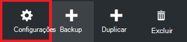

2. Clique em **Introdução > Backup** na lâmina configurações.

    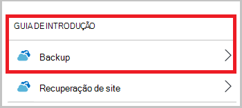

3. Clique em **objetivo de Backup** no blade Backup.

    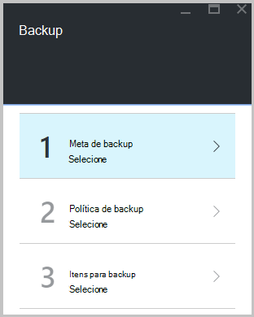

4. Selecione **local** de onde está a carga de trabalho em execução? menu.

5. Selecionar **arquivos e pastas** no que você deseja fazer backup? menu e clique em **Okey**.

#### Baixar o agente de serviços de recuperação

1. Clique em **Baixar agente do Windows Server ou Windows Client** na lâmina **Preparar infraestrutura** .

    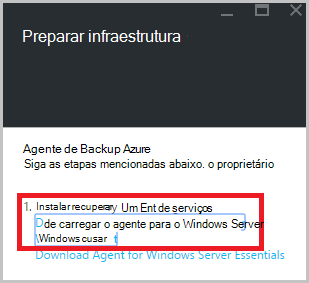

2. Clique em **Salvar** no pop-up download. Por padrão, o arquivo **MARSagentinstaller.exe** é salvo em sua pasta de Downloads.

#### Baixar credenciais de cofre

1. Clique em **Baixar > Salvar** na lâmina preparar infraestrutura.

    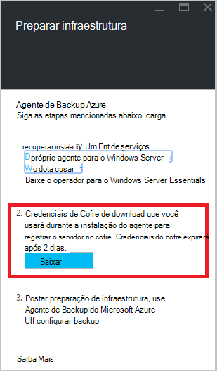

## Etapa 3 - instalar e registrar o agente

1. Localize e clique duas vezes na **MARSagentinstaller.exe** da pasta Downloads (ou outro local salvo).

2. Conclua o Assistente de configuração de agente do Microsoft Azure recuperação serviços. Para concluir o assistente, você precisa:

    - Escolha um local para a instalação e a pasta cache.
    - Forneça seu proxy informações do servidor, se você usar um servidor proxy para conectar à internet.
    - Fornece de usuário detalhes de nome e senha, se você usar um proxy autenticado.
    - Fornecer as credenciais de cofre baixado
    - Salve a senha de criptografia em um local seguro.

    >[AZURE.NOTE] Se você perder ou esquecer a senha, a Microsoft não poderá ajudá recuperar os dados de backup. Salve o arquivo em um local seguro. Ele é necessário para restaurar um backup.

O agente agora está instalado e seu computador está registrado ao cofre. Você está pronto para configurar e agendar o backup.

### Confirmar a instalação

Para confirmar que o agente foi instalado e registrado corretamente, você pode verificar os itens que backup na seção **Servidor de produção** do portal de gerenciamento. Para fazer isso:

1. Entrar no [Portal do Azure](https://portal.azure.com/) usando sua assinatura do Azure.

2. No menu Hub, clique em **Procurar** e na lista de recursos, digite **Os serviços de recuperação**. Conforme você começa a digitar, filtre a lista com base na sua entrada. Clique em **compartimentos de serviços de recuperação**.

      

    Na lista de serviços de recuperação compartimentos é exibida.

2. Selecione o nome do cofre que você criou.

    A lâmina de dashboard de Cofre de serviços de recuperação é aberta.

    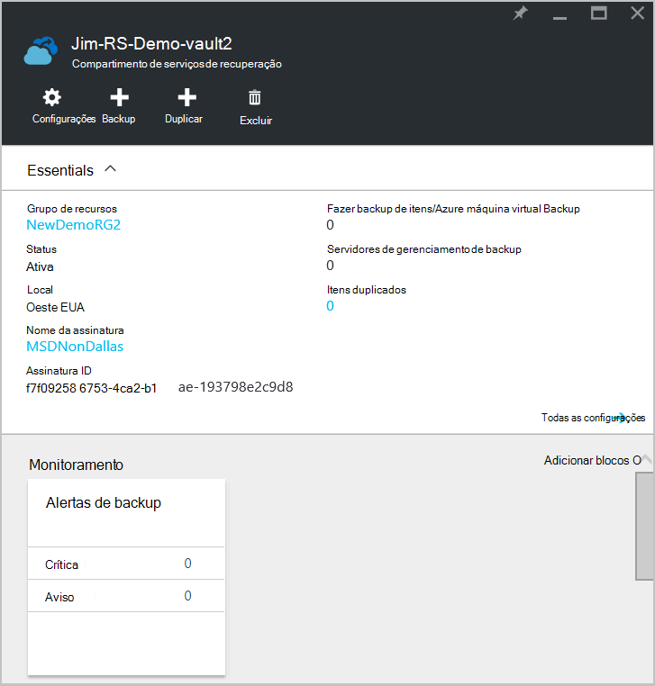  

3. Clique no botão **configurações** na parte superior da página.

4. Clique em **infraestrutura de Backup > servidores de produção**.

    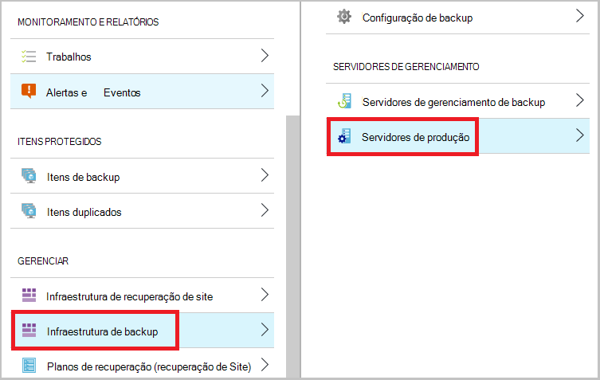

Se você vir seus servidores na lista, você tem a confirmação de que o agente foi instalado e registrado corretamente.

## Etapa 4: Conclua o backup inicial

O backup inicial inclui duas tarefas principais:

- Agendar o backup
- Fazer backup de arquivos e pastas pela primeira vez

Para concluir o backup inicial, você usa o agente de backup do Microsoft Azure.

### Para agendar o backup

1. Abra o agente de Backup do Microsoft Azure. Você pode encontrá-lo, pesquisando sua máquina **Microsoft Azure Backup**.

    

2. No agente de Backup, clique em **Backup da agenda**.

    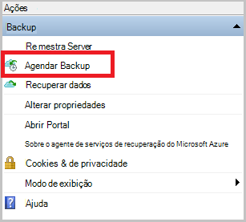

3. Na página de Introdução do Assistente de agendamento de Backup, clique em **Avançar**.

4. Em selecionar itens a página Backup, clique em **Adicionar itens**.

5. Selecione os arquivos e pastas que você deseja fazer backup e clique em **Okey**.

6. Clique em **Avançar**.

7. Na página **Especificar agenda de Backup** , especifique o **agendamento de backup** e clique em **Avançar**.

    Você pode programar backups semanais ou diariamente (a uma taxa máxima de três vezes por dia).

    

    >[AZURE.NOTE] Para obter mais informações sobre como especificar o agendamento de backup, consulte o artigo [Use Azure Backup para substituir sua infraestrutura de fita](backup-azure-backup-cloud-as-tape.md).

8. Na página **Selecionar política de retenção** , selecione a **Política de retenção** para a cópia de backup.

    A política de retenção Especifica a duração para a qual o backup será armazenado. Em vez de apenas especificando uma "política simples" para todos os pontos de backup, você pode especificar diferentes políticas de retenção com base em quando ocorre o backup. Você pode modificar as políticas de retenção de diário, semanal, mensal e anual para atender suas necessidades.

9. Na página Escolher tipo de Backup inicial, escolha o tipo de backup inicial. Deixe a opção **automaticamente pela rede** selecionada e clique em **Avançar**.

    Você pode fazer backup automaticamente pela rede, ou você pode fazer backup offline. O restante deste artigo descreve o processo de backup automaticamente. Se você preferir fazer um backup offline, examine o artigo [Offline fluxo de trabalho de backup no Azure Backup](backup-azure-backup-import-export.md) para obter informações adicionais.

10. Na página confirmação, examine as informações e clique em **Concluir**.

11. Depois que o assistente terminar de criar o agendamento de backup, clique em **Fechar**.

### Habilitar a otimização de rede (opcional)

O agente de backup fornece a otimização de rede. A otimização de controles, como largura de banda de rede é usada durante a transferência de dados. Este controle pode ser útil se você precisar fazer backup de dados durante horas de trabalho, mas não quiser que o processo de backup interfira com outro tráfego de Internet. A limitação se aplica para fazer backup e restaurar atividades.

>[AZURE.NOTE] Otimização de rede não está disponível no Windows Server 2008 R2 SP1, Windows Server 2008 SP2 ou no Windows 7 (com service packs). Recurso de otimização de rede do Azure Backup envolve a qualidade do serviço (QoS) no sistema operacional local. Embora o Backup do Azure pode proteger esses sistemas operacionais, a versão do QoS disponíveis nessas plataformas não funciona com a otimização de rede de Backup do Azure. Otimização de rede pode ser usada em todos os outros [sistemas operacionais suportados](backup-azure-backup-faq.md#installation-amp-configuration).

**Para habilitar a otimização de rede**

1. No agente de backup, clique em **Alterar propriedades**.

    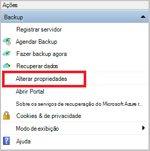

2. Na guia **Throttling** , marque a caixa de seleção **Habilitar o uso de largura de banda de internet a otimização para operações de backup** .

    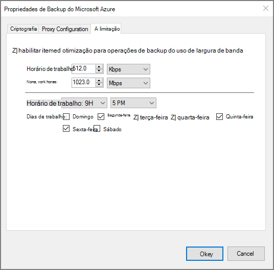

3. Depois que você habilitou a otimização, especifique a largura de banda permitida para transferir dados de backup durante o **horário de trabalho** e **horário de trabalho não**.

    Os valores de largura de banda começam a 512 kilobits por segundo (Kbps) e podem ir até 1.023 megabytes por segundo (). Você pode também designar o início e término para o **horário de trabalho**e quais dias da semana são dias de trabalho considerada. Horas fora do trabalho designado horas são consideradas não-trabalhar horas.

4. Clique em **Okey**.

### Para fazer backup de arquivos e pastas pela primeira vez

1. No agente de backup, clique em **Fazer backup agora** para concluir a propagação inicial através da rede.

    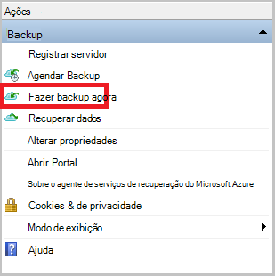

2. Na página confirmação, examine as configurações que o agora Assistente de backup usará para fazer backup de máquina. Clique em **Fazer backup**.

3. Clique em **Fechar** para fechar o assistente. Se você fizer isso, antes de concluir o processo de backup, o assistente continuará a ser executado em segundo plano.

Após o backup inicial for concluído, o status de **trabalho concluído** aparece no console de Backup.

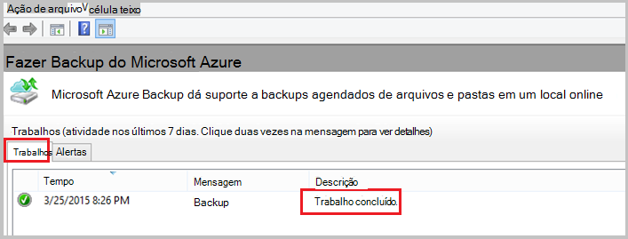

## Dúvidas?
Se você tiver dúvidas ou se houver algum recurso que você gostaria de ver incluídos, [envie-nos comentários](http://aka.ms/azurebackup_feedback).

## Próximas etapas
Para obter informações adicionais sobre como fazer backup VMs ou outras cargas de trabalho, consulte:

- Agora que você tiver feito backup de seus arquivos e pastas, você pode [gerenciar seus servidores e compartimentos](backup-azure-manage-windows-server.md).
- Se você precisar restaurar um backup, use este artigo para [restaurar os arquivos em um computador Windows](backup-azure-restore-windows-server.md).
