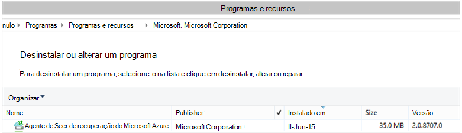

<properties
    pageTitle="Azure Backup - implantar e gerenciar novamente para DPM usando o PowerShell | Microsoft Azure"
    description="Saiba como implantar e gerenciar o Backup do Azure para Data Protection Manager (DPM) usando o PowerShell"
    services="backup"
    documentationCenter=""
    authors="Nkolli1"
    manager="shreeshd"
    editor=""/>

<tags
    ms.service="backup"
    ms.workload="storage-backup-recovery"
    ms.tgt_pltfrm="na"
    ms.devlang="na"
    ms.topic="article"
    ms.date="09/27/2016"
    ms.author="jimpark; trinadhk; anuragm; markgal"/>


# <a name="deploy-and-manage-backup-to-azure-for-data-protection-manager-dpm-servers-using-powershell"></a>Implantar e gerenciar o backup para Azure para servidores do Gerenciador de proteção de dados (DPM) usando o PowerShell

> [AZURE.SELECTOR]
- [BRAÇO](backup-dpm-automation.md)
- [Clássico](backup-dpm-automation-classic.md)

Este artigo mostra como usar o PowerShell para a configuração do Azure Backup em um servidor DPM e para gerenciar a recuperação e backup.

## <a name="setting-up-the-powershell-environment"></a>Configurar o ambiente do PowerShell

[AZURE.INCLUDE [learn-about-deployment-models](../../includes/learn-about-deployment-models-include.md)]

Antes de poder usar o PowerShell para gerenciar backups em Gerenciador de proteção de dados no Azure, você precisará ter o ambiente certo no PowerShell. No início da sessão do PowerShell, certifique-se de que você execute o seguinte comando para importar os módulos corretos e permitem que você referenciar corretamente os cmdlets DPM:

```
PS C:> & "C:\Program Files\Microsoft System Center 2012 R2\DPM\DPM\bin\DpmCliInitScript.ps1"

Welcome to the DPM Management Shell!

Full list of cmdlets: Get-Command
Only DPM cmdlets: Get-DPMCommand
Get general help: help
Get help for a cmdlet: help <cmdlet-name> or <cmdlet-name> -?
Get definition of a cmdlet: Get-Command <cmdlet-name> -Syntax
Sample DPM scripts: Get-DPMSampleScript
```

## <a name="setup-and-registration"></a>Instalação e registro
Para começar:

1. [Baixar o PowerShell mais recente](https://github.com/Azure/azure-powershell/releases) (versão mínima necessária é: 1.0.0)
2. Habilite o Backup do Azure commandlets alternando para o modo de *AzureResourceManager* usando o commandlet **Switch-AzureMode** :

```
PS C:\> Switch-AzureMode AzureResourceManager
```

As seguintes tarefas de configuração e registro podem ser automatizadas com o PowerShell:

- Criar um backup cofre
- Instalando o agente de Backup do Azure
- Registrando com o serviço de Backup do Azure
- Configurações de rede
- Configurações de criptografia

### <a name="create-a-backup-vault"></a>Criar um backup cofre

> [AZURE.WARNING] Para clientes usando o Backup do Azure pela primeira vez, você precisa registrar o provedor de Backup do Azure para ser usado com sua assinatura. Isso pode ser feito executando o seguinte comando: Register-AzureProvider - ProviderNamespace "Microsoft.Backup"

Você pode criar um novo cofre backup usando o commandlet **AzureRMBackupVault de novo** . O cofre backup é um recurso ARM, então você precisa colocá-lo dentro de um grupo de recursos. Em um console elevado do Azure PowerShell, execute os seguintes comandos:

```
PS C:\> New-AzureResourceGroup –Name “test-rg” -Region “West US”
PS C:\> $backupvault = New-AzureRMBackupVault –ResourceGroupName “test-rg” –Name “test-vault” –Region “West US” –Storage GRS
```

Você pode obter uma lista de todos os compartimentos de backup em uma determinada assinatura usando o commandlet **Get-AzureRMBackupVault** .


### <a name="installing-the-azure-backup-agent-on-a-dpm-server"></a>Instalando o agente de Backup do Azure em um servidor DPM
Antes de instalar o agente de Backup do Azure, você precisa ter o instalador baixado e presente no Windows Server. Você pode obter a versão mais recente do instalador do [Centro de Download da Microsoft](http://aka.ms/azurebackup_agent) ou de página de painel do cofre backup. Salvar o instalador para um local acessível facilmente como * C:\Downloads\*.

Para instalar o agente, execute o seguinte comando em um PowerShell elevados console outro **no servidor DPM**:

```
PS C:\> MARSAgentInstaller.exe /q
```

Isso instala o agente com todas as opções padrão. A instalação leva alguns minutos no plano de fundo. Se você não especificar a opção de */nu* a janela **Windows Update** será aberta no final da instalação para verificar se há alguma atualização.

O agente mostrará na lista de programas instalados. Para ver a lista de programas instalados, vá para **Painel de controle** > **programas** > **programas e recursos**.



#### <a name="installation-options"></a>Opções de instalação
Para ver todas as opções disponíveis por meio da linha de comando, use o seguinte comando:

```
PS C:\> MARSAgentInstaller.exe /?
```

As opções disponíveis incluem:

| Opção | Detalhes | Padrão |
| ---- | ----- | ----- |
| /q | Instalação silenciosa | - |
| /p: "local" | Caminho para a pasta de instalação para o agente de Backup do Azure. | Agente de serviços de recuperação Azure C:\Program Files\Microsoft |
| /s: "local" | Caminho da pasta de cache para o agente de Backup do Azure. | Agent\Scratch de serviços de recuperação Azure C:\Program Files\Microsoft |
| /m | Opt-in para o Microsoft Update | - |
| /nu | Não verificar se há atualizações após a conclusão da instalação | - |
| /d | Desinstalar o agente de serviços de recuperação do Microsoft Azure | - |
| /Ph | Endereço do Host de proxy | - |
| /po | Número da porta de Host de proxy | - |
| /Pu | Nome de usuário de Host de proxy | - |
| /pw | Senha de proxy | - |

### <a name="registering-with-the-azure-backup-service"></a>Registrando com o serviço de Backup do Azure
Antes de registrar com o serviço de Backup do Azure, é necessário garantir que os [pré-requisitos](backup-azure-dpm-introduction.md) forem atendidos. Faça o seguinte:

- Tiver uma assinatura válida do Azure
- Ter um backup cofre

Para baixar as credenciais do cofre, execute o commandlet **Get-AzureBackupVaultCredentials** em um console do PowerShell do Azure e armazená-la em um local conveniente como * C:\Downloads\*.

```
PS C:\> $credspath = "C:\"
PS C:\> $credsfilename = Get-AzureRMBackupVaultCredentials -Vault $backupvault -TargetLocation $credspath
PS C:\> $credsfilename
f5303a0b-fae4-4cdb-b44d-0e4c032dde26_backuprg_backuprn_2015-08-11--06-22-35.VaultCredentials
```

Registrando máquina com o cofre é feito usando o cmdlet [Start-DPMCloudRegistration](https://technet.microsoft.com/library/jj612787) :

```
PS C:\> $cred = $credspath + $credsfilename
PS C:\> Start-DPMCloudRegistration -DPMServerName "TestingServer" -VaultCredentialsFilePath $cred
```

Isso registrará o servidor DPM denominada "TestingServer" com o Microsoft Azure cofre usando as credenciais do cofre especificado.

> [AZURE.IMPORTANT] Não use caminhos relativos para especificar o arquivo de credenciais do cofre. Você deve fornecer um caminho absoluto como entrada para o cmdlet.

### <a name="initial-configuration-settings"></a>Definições de configuração inicial
Quando o servidor DPM estiver registrado com o cofre Azure Backup, ele será iniciado com configurações de assinatura padrão. Essas configurações de assinatura incluem rede, criptografia e a área de transferência. Para começar a alterar as configurações de assinatura, que você precisa primeiro obter uma alça as configurações de (padrão) existente usando o cmdlet [Get-DPMCloudSubscriptionSetting](https://technet.microsoft.com/library/jj612793) :

```
$setting = Get-DPMCloudSubscriptionSetting -DPMServerName "TestingServer"
```

Todas as modificações são feitas esse objeto local do PowerShell ```$setting``` e, em seguida, o objeto completo é confirmado Backup do Azure e DPM salvá-los usando o cmdlet [Set-DPMCloudSubscriptionSetting](https://technet.microsoft.com/library/jj612791) . Você precisa usar o ```–Commit``` sinalizador para garantir que as alterações são mantidas. As configurações não serão aplicadas e usadas pelo Backup do Azure, a menos que o compromisso.

```
PS C:\> Set-DPMCloudSubscriptionSetting -DPMServerName "TestingServer" -SubscriptionSetting $setting -Commit
```

### <a name="networking"></a>Rede
Se a conectividade da máquina DPM para o serviço de Backup do Azure na internet por meio de um servidor proxy, as configurações do servidor proxy devem ser fornecidas backups tenha êxito. Isso é feito usando o ```-ProxyServer```, ```-ProxyPort```, ```-ProxyUsername``` e o ```ProxyPassword``` parâmetros com o cmdlet [Set-DPMCloudSubscriptionSetting](https://technet.microsoft.com/library/jj612791) . Neste exemplo, não há nenhum servidor proxy para nós explicitamente estiver limpando quaisquer informações relacionadas ao proxy.

```
PS C:\> Set-DPMCloudSubscriptionSetting -DPMServerName "TestingServer" -SubscriptionSetting $setting -NoProxy
```

Uso de largura de banda também pode ser controlado com opções de ```-WorkHourBandwidth``` e ```-NonWorkHourBandwidth``` para um determinado conjunto de dias da semana. Neste exemplo não está definindo qualquer limitação.

```
PS C:\> Set-DPMCloudSubscriptionSetting -DPMServerName "TestingServer" -SubscriptionSetting $setting -NoThrottle
```

### <a name="configuring-the-staging-area"></a>Configurar a área de transferência
O agente de Backup do Azure em execução no servidor DPM precisa de armazenamento temporário para dados restaurados da nuvem (área de transferência local). Configurar a área de transferência usando o cmdlet [Set-DPMCloudSubscriptionSetting](https://technet.microsoft.com/library/jj612791) e o ```-StagingAreaPath``` parâmetro.

```
PS C:\> Set-DPMCloudSubscriptionSetting -DPMServerName "TestingServer" -SubscriptionSetting $setting -StagingAreaPath "C:\StagingArea"
```

No exemplo acima, a área temporária será definida como *C:\StagingArea* no objeto do PowerShell ```$setting```. Certifique-se de que a pasta especificada já existe ou então a confirmação final das configurações de assinatura falhará.


### <a name="encryption-settings"></a>Configurações de criptografia
Os dados de backup enviados ao Azure Backup são criptografados para proteger a confidencialidade dos dados. A senha de criptografia está "senha" para descriptografar os dados no momento da restauração. É importante manter essas informações seguro e depois que ela é definida.

No exemplo abaixo, o primeiro comando converte a cadeia de caracteres ```passphrase123456789``` para uma cadeia de segura e atribui a cadeia de caracteres segura à variável denominada ```$Passphrase```. o segundo comando define a cadeia de caracteres segura em ```$Passphrase``` como a senha para criptografar backups.

```
PS C:\> $Passphrase = ConvertTo-SecureString -string "passphrase123456789" -AsPlainText -Force

PS C:\> Set-DPMCloudSubscriptionSetting -DPMServerName "TestingServer" -SubscriptionSetting $setting -EncryptionPassphrase $Passphrase
```

> [AZURE.IMPORTANT] Manter as informações de senha segura e depois que ela é definida. Você não poderá restaurar os dados do Azure sem essa senha.

Neste ponto, você deve fez todas as alterações necessárias para o ```$setting``` objeto. Lembre-se confirmar as alterações.

```
PS C:\> Set-DPMCloudSubscriptionSetting -DPMServerName "TestingServer" -SubscriptionSetting $setting -Commit
```

## <a name="protect-data-to-azure-backup"></a>Proteger os dados de Backup do Azure
Nesta seção, você adicionará um servidor de produção DPM e, em seguida, proteger os dados para o armazenamento local do DPM e, em seguida, Backup do Azure. Nos exemplos demonstraremos como fazer backup de arquivos e pastas. A lógica pode ser facilmente estendida para fazer backup de qualquer fonte de dados com suporte DPM. Todos os seus backups DPM são controlados por uma proteção de grupo (Page) com quatro partes:

1. **Membros do grupo** é uma lista de todos os protectable objetos (também conhecidos como *fontes de dados* no DPM) que você deseja proteger no mesmo grupo de proteção. Por exemplo, você talvez queira proteger produção VMs em um grupo de proteção e bancos de dados do SQL Server em outro grupo de proteção, pois podem ter requisitos diferentes de backup. Antes de você pode fazer backup de qualquer fonte de dados em um servidor de produção que você precisa para garantir que o DPM Agent estiver instalado no servidor e é gerenciado pelo DPM. Siga as etapas para [instalar o DPM Agent](https://technet.microsoft.com/library/bb870935.aspx) e vinculá-lo ao servidor DPM apropriado.
2. **Método de proteção de dados** Especifica os locais de backup destino - fita, disco e nuvem. Em nosso exemplo podemos irá proteger os dados para o disco local e na nuvem.
3. **Agendamento de backup** que especifica quando backups precisam ser levadas e com que frequência os dados devem ser sincronizados entre o servidor DPM e o servidor de produção.
4. **Agendamento de retenção** que especifica por quanto tempo para manter os pontos de recuperação no Azure.

### <a name="creating-a-protection-group"></a>Criar um grupo de proteção
Comece criando um novo grupo de proteção usando o cmdlet [New-DPMProtectionGroup](https://technet.microsoft.com/library/hh881722) .

```
PS C:\> $PG = New-DPMProtectionGroup -DPMServerName " TestingServer " -Name "ProtectGroup01"
```

O cmdlet acima irá criar um grupo de proteção chamado *ProtectGroup01*. Um grupo de proteção existente também pode ser modificado posteriormente para adicionar o backup na nuvem Azure. No entanto, para fazer alterações ao grupo de proteção - nova ou existente - precisamos obter uma alça em um objeto *pode ser modificado* usando o cmdlet [Get-DPMModifiableProtectionGroup](https://technet.microsoft.com/library/hh881713) .

```
PS C:\> $MPG = Get-ModifiableProtectionGroup $PG
```

### <a name="adding-group-members-to-the-protection-group"></a>Adicionar membros de grupo ao grupo de proteção
Cada agente DPM sabe a lista de fontes de dados no servidor que ele está instalado. Para adicionar uma fonte de dados para o grupo de proteção, o DPM Agent precisa primeiro enviar uma lista das fontes de dados para o servidor DPM. Uma ou mais fontes de dados, em seguida, são selecionados e adicionados ao grupo de proteção. As etapas do PowerShell necessárias para obtê-obter isso são:

1. Busca uma lista de todos os servidores gerenciados pelo DPM através do agente DPM.
2. Escolha um servidor específico.
3. Busca uma lista de todas as fontes de dados no servidor.
4. Escolha uma ou mais fontes de dados e adicioná-los ao grupo de proteção

A lista de servidores na qual o DPM Agent é instalado e está sendo gerenciado pelo servidor DPM é adquirida com o cmdlet [Get-DPMProductionServer](https://technet.microsoft.com/library/hh881600) . Neste exemplo abordaremos filtrar e configurar somente PS com o nome *productionserver01* para backup.

```
PS C:\> $server = Get-ProductionServer -DPMServerName "TestingServer" | where {($_.servername) –contains “productionserver01”
```

Buscar agora na lista de fontes de dados em ```$server``` usando o cmdlet [Get-DPMDatasource](https://technet.microsoft.com/library/hh881605) . Neste exemplo, podemos está filtrando para o volume *d:\* que queremos configurar para backup. Essa fonte de dados é adicionado ao grupo de proteção usando o cmdlet [Add-DPMChildDatasource](https://technet.microsoft.com/library/hh881732) . Lembre-se de usar o *objeto de grupo de proteção modifable * ```$MPG``` para fazer as adições.

```
PS C:\> $DS = Get-Datasource -ProductionServer $server -Inquire | where { $_.Name -contains “D:\” }

PS C:\> Add-DPMChildDatasource -ProtectionGroup $MPG -ChildDatasource $DS
```

Repita esta etapa quantas vezes conforme necessário, até que tenha adicionado todas as fontes de dados escolhidos para o grupo de proteção. Você também pode iniciar com apenas uma fonte de dados e concluir o fluxo de trabalho para criar o grupo de proteção e posteriormente adicionar mais fontes de dados para o grupo de proteção.

### <a name="selecting-the-data-protection-method"></a>Selecionar o método de proteção de dados
Depois que as fontes de dados foram adicionados ao grupo de proteção, a próxima etapa é especificar o método de proteção usando o cmdlet [Set-DPMProtectionType](https://technet.microsoft.com/library/hh881725) . Neste exemplo, o grupo de proteção será configuração para disco local e backup de nuvem. Você também precisa especificar a fonte de dados que você deseja proteger nuvem usando o cmdlet [Add-DPMChildDatasource](https://technet.microsoft.com/library/hh881732.aspx) com - sinalizador Online.

```
PS C:\> Set-DPMProtectionType -ProtectionGroup $MPG -ShortTerm Disk –LongTerm Online
PS C:\> Add-DPMChildDatasource -ProtectionGroup $MPG -ChildDatasource $DS –Online
```

### <a name="setting-the-retention-range"></a>Configuração do intervalo de retenção
Defina a retenção para os pontos de backup usando o cmdlet [Set-DPMPolicyObjective](https://technet.microsoft.com/library/hh881762) . Enquanto pode parecer estranho defina a retenção antes do agendamento de backup tiver sido definido, usando o ```Set-DPMPolicyObjective``` cmdlet define automaticamente um agendamento de backup padrão que pode ser modificado. Sempre é possível definir o backup agendar primeiro e a política de retenção após.

No exemplo abaixo, o cmdlet define os parâmetros de retenção de backups em disco. Isso manterá backups para 10 dias e sincronizar dados cada 6 horas entre o servidor de produção e o servidor DPM. O ```SynchronizationFrequencyMinutes``` não define com que frequência um ponto de backup é criado, mas como dados com frequência são copiados para o servidor DPM; Isso impede que backups ficando grande demais.

```
PS C:\> Set-DPMPolicyObjective –ProtectionGroup $MPG -RetentionRangeInDays 10 -SynchronizationFrequencyMinutes 360
```

Backups indo ao Azure (DPM se refere a essas áreas como backups on-line) os intervalos de retenção podem ser configurados para [usar um esquema de vovô-pai-filho (GFS) de retenção de longo prazo](backup-azure-backup-cloud-as-tape.md). Isto é, você pode definir uma política de retenção combinado envolvendo diária, semanal, mensal e anualmente políticas de retenção. Neste exemplo, criamos uma matriz que representa o esquema de retenção complexas que queremos e, em seguida, configure o intervalo de retenção usando o cmdlet [Set-DPMPolicyObjective](https://technet.microsoft.com/library/hh881762) .

```
PS C:\> $RRlist = @()
PS C:\> $RRList += (New-Object -TypeName Microsoft.Internal.EnterpriseStorage.Dls.UI.ObjectModel.OMCommon.RetentionRange -ArgumentList 180, Days)
PS C:\> $RRList += (New-Object -TypeName Microsoft.Internal.EnterpriseStorage.Dls.UI.ObjectModel.OMCommon.RetentionRange -ArgumentList 104, Weeks)
PS C:\> $RRList += (New-Object -TypeName Microsoft.Internal.EnterpriseStorage.Dls.UI.ObjectModel.OMCommon.RetentionRange -ArgumentList 60, Month)
PS C:\> $RRList += (New-Object -TypeName Microsoft.Internal.EnterpriseStorage.Dls.UI.ObjectModel.OMCommon.RetentionRange -ArgumentList 10, Years)
PS C:\> Set-DPMPolicyObjective –ProtectionGroup $MPG -OnlineRetentionRangeList $RRlist
```

### <a name="set-the-backup-schedule"></a>Defina o agendamento de backup
DPM define um agendamento de backup padrão automaticamente se você especificar o objetivo de proteção usando o ```Set-DPMPolicyObjective``` cmdlet. Para alterar os agendamentos padrão, use o cmdlet [Get-DPMPolicySchedule](https://technet.microsoft.com/library/hh881749) seguido o cmdlet [Set-DPMPolicySchedule](https://technet.microsoft.com/library/hh881723) .

```
PS C:\> $onlineSch = Get-DPMPolicySchedule -ProtectionGroup $mpg -LongTerm Online
PS C:\> Set-DPMPolicySchedule -ProtectionGroup $MPG -Schedule $onlineSch[0] -TimesOfDay 02:00
PS C:\> Set-DPMPolicySchedule -ProtectionGroup $MPG -Schedule $onlineSch[1] -TimesOfDay 02:00 -DaysOfWeek Sa,Su –Interval 1
PS C:\> Set-DPMPolicySchedule -ProtectionGroup $MPG -Schedule $onlineSch[2] -TimesOfDay 02:00 -RelativeIntervals First,Third –DaysOfWeek Sa
PS C:\> Set-DPMPolicySchedule -ProtectionGroup $MPG -Schedule $onlineSch[3] -TimesOfDay 02:00 -DaysOfMonth 2,5,8,9 -Months Jan,Jul
PS C:\> Set-DPMProtectionGroup -ProtectionGroup $MPG
```

No exemplo acima, ```$onlineSch``` é uma matriz com quatro elementos que contém o cronograma de proteção on-line existente para o grupo de proteção no esquema de GFS:

1. ```$onlineSch[0]```conterá a agenda diária
2. ```$onlineSch[1]```conterá a agenda semanal
3. ```$onlineSch[2]```conterá a agenda mensal
4. ```$onlineSch[3]```conterá o cronograma anual

Se você precisar modificar a agenda semanal, você precisa se referir ao ```$onlineSch[1]```.

### <a name="initial-backup"></a>Backup inicial
Quando o backup de uma fonte de dados pela primeira vez, DPM precisa criar uma réplica inicial que criará uma cópia da fonte de dados a serem protegidos em volume de réplica do DPM. Esta atividade ou pode ser agendada para uma hora específica ou pode ser acionada de manualmente, usando o cmdlet [Set-DPMReplicaCreationMethod](https://technet.microsoft.com/library/hh881715) com o parâmetro ```-NOW```.

```
PS C:\> Set-DPMReplicaCreationMethod -ProtectionGroup $MPG -NOW
```
### <a name="changing-the-size-of-dpm-replica--recovery-point-volume"></a>Alterar o tamanho da réplica DPM & volume de ponto de recuperação
Você também pode alterar o tamanho do volume de réplica do DPM, bem como o volume de cópia de sombra usando o cmdlet [Set-DPMDatasourceDiskAllocation](https://technet.microsoft.com/library/hh881618.aspx) como no exemplo abaixo: Get-DatasourceDiskAllocation - Datasource $DS Set-DatasourceDiskAllocation - Datasource $DS - ProtectionGroup $MPG-manual - ReplicaArea (2 gb) - ShadowCopyArea (2 gb)

### <a name="committing-the-changes-to-the-protection-group"></a>Confirmar as alterações para o grupo de proteção
Por fim, as alterações precisam ser confirmado antes DPM pode realizar o backup pela nova configuração de grupo de proteção. Isso é feito usando o cmdlet [Set-DPMProtectionGroup](https://technet.microsoft.com/library/hh881758) .

```
PS C:\> Set-DPMProtectionGroup -ProtectionGroup $MPG
```
## <a name="view-the-backup-points"></a>Ver os pontos de backup
Você pode usar o cmdlet [Get-DPMRecoveryPoint](https://technet.microsoft.com/library/hh881746) para obter uma lista de todos os pontos de recuperação de uma fonte de dados. Neste exemplo, podemos irá:
- Buscar todas as páginas no servidor DPM que será armazenado em uma matriz```$PG```
- acessar as fontes de dados correspondente a```$PG[0]```
- Obtenha todos os pontos de recuperação para uma fonte de dados.

```
PS C:\> $PG = Get-DPMProtectionGroup –DPMServerName "TestingServer"
PS C:\> $DS = Get-DPMDatasource -ProtectionGroup $PG[0]
PS C:\> $RecoveryPoints = Get-DPMRecoverypoint -Datasource $DS[0] -Online
```

## <a name="restore-data-protected-on-azure"></a>Restaurar dados protegidos no Azure
Restaurando dados é uma combinação de um ```RecoverableItem``` objeto e um ```RecoveryOption``` objeto. Na seção anterior, obtivemos uma lista dos pontos de backup para uma fonte de dados.

No exemplo abaixo, demonstraremos como restaurar uma máquina virtual Hyper-V de Backup do Azure combinando pontos de backup com o destino de recuperação. Isso inclui:

- Criando uma opção de recuperação usando o cmdlet [New-DPMRecoveryOption](https://technet.microsoft.com/library/hh881592) .
- Buscar a matriz de pontos de backup usando o ```Get-DPMRecoveryPoint``` cmdlet.
- Escolhendo um ponto de backup para restaurar a partir de.

```
PS C:\> $RecoveryOption = New-DPMRecoveryOption -HyperVDatasource -TargetServer "HVDCenter02" -RecoveryLocation AlternateHyperVServer -RecoveryType Recover -TargetLocation “C:\VMRecovery”

PS C:\> $PG = Get-DPMProtectionGroup –DPMServerName "TestingServer"
PS C:\> $DS = Get-DPMDatasource -ProtectionGroup $PG[0]
PS C:\> $RecoveryPoints = Get-DPMRecoverypoint -Datasource $DS[0] -Online

PS C:\> Restore-DPMRecoverableItem -RecoverableItem $RecoveryPoints[0] -RecoveryOption $RecoveryOption
```

Os comandos podem ser facilmente estendidos para qualquer tipo de fonte de dados.

## <a name="next-steps"></a>Próximas etapas

- Para obter mais informações sobre o Backup do Azure para DPM, consulte [Introdução ao DPM Backup](backup-azure-dpm-introduction.md)
