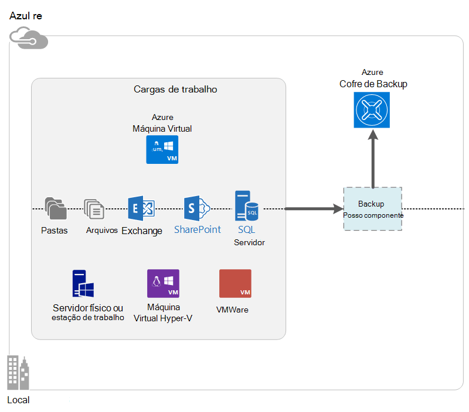

<properties
    pageTitle="O que é Azure Backup? | Microsoft Azure"
    description="Usando os serviços de recuperação e Backup do Azure, você pode fazer backup e restaurar os dados e aplicativos de servidores do Windows, máquinas cliente Windows, System Center DPM e Azure máquinas virtuais."
    services="backup"
    documentationCenter=""
    authors="markgalioto"
    manager="cfreeman"
    editor="tysonn"
    keywords="backup e restauração; Serviços de recuperação; soluções de backup"/>

<tags
    ms.service="backup"
    ms.workload="storage-backup-recovery"
    ms.tgt_pltfrm="na"
    ms.devlang="na"
    ms.topic="get-started-article"
    ms.date="10/19/2016"
    ms.author="jimpark; trinadhk"/>

# O que é Azure Backup?
Backup Azure é o serviço que você usa para fazer backup e restaurar seus dados em nuvem da Microsoft. Ela substitui o seu local existente ou a solução de backup externo com uma solução baseada em nuvem que é confiável, seguro e custo competitiva. Ele também ajuda a proteger os ativos que são executadas na nuvem. Backup Azure fornece serviços de recuperação criados em uma infraestrutura extraordinária scalable, durável e altamente disponível.

[Assista a uma visão geral em vídeo de Backup do Azure](https://azure.microsoft.com/documentation/videos/what-is-azure-backup/)

## Por que usar o Backup do Azure?
Soluções tradicionais de backup têm desenvolvido para tratar de nuvem como um ponto de extremidade semelhante a discos ou fita. Embora essa abordagem seja simple, também é limitado. Ele não tirar proveito de uma plataforma de nuvem subjacente e traduz para uma solução cara ineficaz.
Em contraste, Azure Backup oferece todas as vantagens de uma solução de backup de nuvem poderosos e acessível. Aqui estão alguns dos principais benefícios que o Backup do Azure fornece.

| Recurso | Benefício |
| ------- | ------- |
| Gerenciamento de armazenamento automático | Não há gastos de capital é necessária para dispositivos de armazenamento local. Backup Azure automaticamente aloca e gerencia o armazenamento de backup e usa um modelo de consumo de pagamento como você-uso. |
| Dimensionamento ilimitado | Aproveite as garantias de alta disponibilidade sem a sobrecarga de manutenção e monitoramento. Backup Azure usa o subjacente power e escala da nuvem Azure, com seus recursos autoscaling não intrusivo. |
| Várias opções de armazenamento | Escolha seu armazenamento de backup com base em necessidade:<li>Um blob de bloco de armazenamento localmente redundante é ideal para clientes de preço voltada e ainda ajuda a proteger dados contra falhas de hardware local. <li>Um blob de bloco de armazenamento de replicação geográfica fornece três mais cópias em um data center par. Essas cópias adicionais ajudam a garantir que seus dados de backup são altamente disponíveis, mesmo se ocorrer um desastre Azure do nível do site. |
| Transferência de dados ilimitado | Não há nenhuma cobrança para qualquer transferência de dados (saída) de egresso durante uma operação de restauração do cofre Backup. Dados de entrada para Azure também é gratuito. Funciona com o serviço de importação onde ele está disponível. |
| Criptografia de dados | Criptografia de dados permite transmissão segura e armazenamento de dados do cliente na nuvem pública. A senha de criptografia é armazenada na origem e nunca é transmitida ou armazenado no Azure. A chave de criptografia é necessária para restaurar os dados e somente o cliente tem acesso completo aos dados no serviço. |  
| Backup consistente com o aplicativo | Backups consistentes com o aplicativo no Windows ajudam a garantir que as correções não são necessárias no momento da restauração, o que reduz o objetivo de tempo de recuperação. Isso permite que clientes retornar ao estado de execução mais rapidamente. |
| Retenção de longo prazo | Em vez de remuneração por soluções de backup externo em fita, cliente pode até o Azure, que fornece uma solução atraente de fita semelhante a um custo baixo. |

## Azure componentes de Backup
Como Backup é uma solução de backup híbridos, ele consiste em vários componentes que trabalham juntos para habilitar o backup de ponta a ponta e restaurar fluxos de trabalho.

### Cenários de implantação

| Componente | Pode ser implantado no Azure? | Pode ser implantado no local? | Armazenamento de destino com suporte|
| --- | --- | --- | --- |
| Agente de Backup Azure | 
**Sim**
 
O agente de Backup do Azure pode ser implantado em qualquer máquina Windows servidor virtual executado no Azure.
 | 
**Sim**
 
O agente de Backup pode ser implantado em qualquer máquina virtual do Windows Server ou máquina física.
 | 
Azure Cofre de Backup
 |
| Gerenciador de proteção de dados do System Center (DPM) | 
**Sim**

Saiba mais sobre [como proteger cargas de trabalho no Azure usando o System Center DPM](http://blogs.technet.com/b/dpm/archive/2014/09/02/azure-iaas-workload-protection-using-data-protection-manager.aspx).
 | 
**Sim**
 
Saiba mais sobre [como proteger cargas de trabalho e VMs em seu data center](https://technet.microsoft.com/library/hh758173.aspx).
 | 
Disco conectado localmente,
 
Azure Cofre de Backup,
 
fita (local somente)
 |
| Servidor de Backup Azure | 
**Sim**

Saiba mais sobre [como proteger cargas de trabalho no Azure usando o servidor de Backup do Azure](backup-azure-microsoft-azure-backup.md).
 | 
**Sim**
 
Saiba mais sobre [como proteger cargas de trabalho no Azure usando o servidor de Backup do Azure](backup-azure-microsoft-azure-backup.md).
 | 
Disco conectado localmente,
 
Azure Cofre de Backup
 |
| Azure Backup (extensão de máquina virtual) | 
**Sim**

Parte da estrutura Azure

Especializadas para [backup de infraestrutura Azure como um máquinas virtuais de serviço (IaaS)](backup-azure-vms-introduction.md).
 | 
**Não**
 
Use System Center DPM para fazer backup de máquinas virtuais em seu data center.
 | 
Azure Cofre de Backup
 |

### Limitações e benefícios de nível de componente

| Componente | Benefícios | Limitações | Detalhamento de recuperação |
| --- | --- | --- | --- |
| Agente de Backup (MARTE) Azure | <li>Pode fazer backup de arquivos e pastas em uma máquina do sistema operacional Windows, seja físico ou virtual (VMs podem estar em qualquer lugar no local ou Azure)<li>Nenhum servidor de backup separado obrigatório<li>Usa o Azure Cofre de Backup | <li>Restaurar três vezes um dia/arquivo de backup nível<li>Restauração no nível de volume/de pasta de arquivo única, o aplicativo não cientes<li>Não há suporte para Linux | volumes/de pastas de arquivos |
| Gerenciador de proteção de dados do System Center | <li>Instantâneos cientes de aplicativo (VSS)<li>Flexibilidade completa para quando fazer backups<li>Detalhamento de recuperação (todos)<li>Pode usar o Cofre de Backup do Azure<li>Suporte a Linux (se hospedado no Hyper-V) | <li>Falta de suporte heterogêneo (VMware máquina virtual backup, carga de trabalho Oracle fazer backup).  | volumes/de pastas de arquivos / VMs/aplicativos |
| Servidor de Backup do Microsoft Azure | <li>Instantâneos cientes de aplicativo (VSS)<li>Flexibilidade completa para quando fazer backups<li>Detalhamento de recuperação (todos)<li>Pode usar o Cofre de Backup do Azure<li>Suporte a Linux (se hospedado no Hyper-V)<li>Não requer uma licença do System Center | <li>Falta de suporte heterogêneo (VMware máquina virtual backup, carga de trabalho Oracle fazer backup).<li>Sempre requer assinatura Azure ao vivo<li>Não há suporte para backup de fita | volumes/de pastas de arquivos / VMs/aplicativos |
| Backup de máquina virtual de IaaS Azure | <li>Backups nativos para Windows/Linux<li>Sem necessidade de instalação do agente específico<li>Backup de nível de tecidos com nenhuma infraestrutura de backup necessária | <li>Uma vez ao dia back up/disco restauração nível<li>Não é possível fazer backup local | VMs Todos os discos (usando o PowerShell) |

## Quais aplicativos e cargas de trabalho podem ser feitas backup?

| Carga de trabalho | Máquina de origem | Solução de Backup Azure |
| --- | --- |---|
| Arquivos e pastas | Windows Server | 
[Agente de Backup do azure](backup-configure-vault.md),
 
[System Center DPM](backup-azure-dpm-introduction.md) (+ o agente de Backup do Azure),
 
[Servidor de Backup Azure](backup-azure-microsoft-azure-backup.md) (inclui o agente de Backup do Azure)
  |
| Arquivos e pastas | Cliente do Windows | 
[Agente de Backup do azure](backup-configure-vault.md),
 
[System Center DPM](backup-azure-dpm-introduction.md) (+ o agente de Backup do Azure),
 
[Servidor de Backup Azure](backup-azure-microsoft-azure-backup.md) (inclui o agente de Backup do Azure)
  |
| Máquina virtual de Hyper-V (Windows) | Windows Server | 
[System Center DPM](backup-azure-backup-sql.md) (+ o agente de Backup do Azure),
 
[Servidor de Backup Azure](backup-azure-microsoft-azure-backup.md) (inclui o agente de Backup do Azure)
 |
| Máquina virtual de Hyper-V (Linux) | Windows Server | 
[System Center DPM](backup-azure-backup-sql.md) (+ o agente de Backup do Azure),
 
[Servidor de Backup Azure](backup-azure-microsoft-azure-backup.md) (inclui o agente de Backup do Azure)
  |
| Microsoft SQL Server | Windows Server | 
[System Center DPM](backup-azure-backup-sql.md) (+ o agente de Backup do Azure),
 
[Servidor de Backup Azure](backup-azure-microsoft-azure-backup.md) (inclui o agente de Backup do Azure)
  |
| Microsoft SharePoint | Windows Server | 
[System Center DPM](backup-azure-backup-sql.md) (+ o agente de Backup do Azure),
 
[Servidor de Backup Azure](backup-azure-microsoft-azure-backup.md) (inclui o agente de Backup do Azure)
   |
| Microsoft Exchange |  Windows Server | 
[System Center DPM](backup-azure-backup-sql.md) (+ o agente de Backup do Azure),
 
[Servidor de Backup Azure](backup-azure-microsoft-azure-backup.md) (inclui o agente de Backup do Azure)
   |
| Azure IaaS VMs (Windows) | - | [Azure Backup (extensão de máquina virtual)](backup-azure-vms-introduction.md) |
| Azure IaaS VMs (Linux) | - | [Azure Backup (extensão de máquina virtual)](backup-azure-vms-introduction.md) |

## Suporte de BRAÇO e Linux

| Componente | Suporte de BRAÇO | Linux (Azure aprovado) suporte |
| --- | --- | --- |
| Agente de Backup (MARTE) Azure | Sim | Não (somente baseado em agente do Windows) |
| Gerenciador de proteção de dados do System Center | Sim (agente em convidado) | Somente backup somente arquivo consistente Hyper-V (não Azure máquina virtual) é possível |
| Servidor de Backup Azure (MABS) | Sim (agente em convidado) | Somente backup somente arquivo consistente Hyper-V (não Azure máquina virtual) é possível (mesmo DPM) |
| Backup de máquina virtual de IaaS Azure | Sim | Sim |

[AZURE.INCLUDE [learn-about-deployment-models](../../includes/learn-about-deployment-models-include.md)]

## Fazer backup e restaurar VMs de armazenamento Premium

O serviço de Backup do Azure agora protege VMs de armazenamento Premium.

### Fazer backup de VMs de armazenamento Premium

Ao fazer o backup VMs de armazenamento Premium, o serviço de Backup cria um local de preparação temporário na conta de armazenamento Premium. Local temporário, denominado "AzureBackup-", é igual ao tamanho total de dados dos discos premium anexado a máquina virtual.

>[AZURE.NOTE] Não modifique ou editar o local de teste.

Depois de concluir o trabalho de backup, local temporário é excluído. O preço de armazenamento usada para o local de preparação é consistente com todos os [preços de armazenamento Premium](../storage/storage-premium-storage.md#pricing-and-billing).

### Restaurar Premium armazenamento VMs

Máquina virtual do armazenamento Premium podem ser restaurado para o armazenamento de Premium ou armazenamento normal. Restaurar um ponto de recuperação de máquina virtual do armazenamento Premium volta ao armazenamento de Premium é o processo típico de restauração. No entanto, pode ser econômico para restaurar um ponto de recuperação de máquina virtual do armazenamento Premium para armazenamento padrão. Esse tipo de restauração pode ser usado se você precisar de um subconjunto dos arquivos da máquina virtual.

## Funcionalidade
Estas cinco tabelas resumem funcionalidade como backup é tratado em cada componente.

### Armazenamento

| Recurso | Agente de Backup Azure | System Center DPM | Servidor de Backup Azure | Azure Backup (extensão de máquina virtual) |
| ------- | --- | --- | --- | ---- |
| Azure Cofre de Backup | ![Sim][green] | ![Sim][green] | ![Sim][green] | ![Sim][green] |
| Armazenamento em disco | | ![Sim][green] | ![Sim][green] |  |
| Armazenamento de fita | | ![Sim][green] |  | |
| Compactação (em backup cofre) | ![Sim][green] | ![Sim][green]| ![Sim][green] | |
| Backup incremental | ![Sim][green] | ![Sim][green] | ![Sim][green] | ![Sim][green] |
| Duplicação de disco | | ![Parcialmente][yellow] | ![Parcialmente][yellow]| | |

O Cofre de Backup é o destino de armazenamento preferencial em todos os componentes. Servidor de Backup e System Center DPM também oferecem a opção para ter uma cópia de disco local. No entanto, somente o System Center DPM fornece a opção para gravar dados em um dispositivo de armazenamento de fita.

#### Backup incremental
Cada componente compatível com backup incremental, independentemente do armazenamento de destino (disco, fita, backup cofre). Backup incremental garante que backups armazenamento e tempo eficiente, transferindo apenas as alterações feitas desde o último backup.

#### Compactação
Os backups são compactados para reduzir o espaço de armazenamento necessária. O único componente que não usa compactação é a extensão de máquina virtual. Com extensão de máquina virtual, todos os dados de backup é copiada da conta de armazenamento do cliente para o backup cofre na mesma região sem compactá-lo. Enquanto indo sem compactação ligeiramente infla o armazenamento usado, armazenar os dados sem compactação permite tempos de restauração.

#### Duplicação
Duplicação tem suporte do servidor de Backup e System Center DPM quando for [implantado em uma máquina virtual Hyper-V](http://blogs.technet.com/b/dpm/archive/2015/01/06/deduplication-of-dpm-storage-reduce-dpm-storage-consumption.aspx). Duplicação é executada no nível do host por meio da duplicação do Windows Server em discos virtuais (VHDs) que estejam anexados na máquina virtual como armazenamento de backup.

>[AZURE.WARNING] Duplicação não está disponível no Azure para qualquer um dos componentes do Backup. Quando o servidor de Backup e System Center DPM são implantados no Azure, os discos de armazenamento anexados a máquina virtual não podem ter eliminação de duplicação.

### Segurança

| Recurso | Agente de Backup Azure | System Center DPM | Servidor de Backup Azure | Azure Backup (extensão de máquina virtual) |
| ------- | --- | --- | --- | ---- |
| Segurança da rede (Azure) | ![Sim][green] |![Sim][green] | ![Sim][green] | ![Parcialmente][yellow]|
| Segurança de dados (no Azure) | ![Sim][green] |![Sim][green] | ![Sim][green] | ![Parcialmente][yellow]|

Todo o tráfego backup dos seus servidores para o Cofre de Backup está criptografado usando o 256 de padrão de criptografia avançada. Os dados são enviados por um link HTTPS seguro. Os dados de backup também são armazenados no cofre de Backup no formato criptografado. Somente o cliente mantém a senha para desbloquear esses dados. Microsoft não poderá descriptografar os dados de backup a qualquer momento.

>[AZURE.WARNING] A chave usada para criptografar os dados de backup está presente apenas com o cliente. A Microsoft não mantém uma cópia no Azure e não tem nenhum acesso à chave. Se a chave é no local incorreto, a Microsoft não poderá recuperar os dados de backup.

Fazendo backup de VMs Azure requer configuração de criptografia *dentro* da máquina virtual. Use o BitLocker em máquinas virtuais do Windows e **dm crypt** em máquinas virtuais Linux. Backup Azure não criptografa automaticamente os dados de backup fornecido por esse caminho.

### Cargas de trabalho com suporte

| Recurso | Agente de Backup Azure | System Center DPM | Servidor de Backup Azure | Azure Backup (extensão de máquina virtual) |
| ------- | --- | --- | --- | ---- |
| Máquina Windows Server--arquivos e pastas | ![Sim][green] | ![Sim][green] | ![Sim][green] | |
| Máquina de cliente do Windows, arquivos e pastas | ![Sim][green] | ![Sim][green] | ![Sim][green] | |
| Máquina virtual de Hyper-V (Windows) | | ![Sim][green] | ![Sim][green] | |
| Máquina virtual de Hyper-V (Linux) | | ![Sim][green] | ![Sim][green] | |
| Microsoft SQL Server | | ![Sim][green] | ![Sim][green] | |
| Microsoft SharePoint | | ![Sim][green] | ![Sim][green] | |
| Microsoft Exchange  | | ![Sim][green] | ![Sim][green] | |
| Azure máquina virtual (Windows) | | | | ![Sim][green] |
| Azure máquina virtual (Linux) | | | | ![Sim][green] |

### Rede

| Recurso | Agente de Backup Azure | System Center DPM | Servidor de Backup Azure | Azure Backup (extensão de máquina virtual) |
| ------- | --- | --- | --- | ---- |
| Compactação de rede (para o servidor de backup) | | ![Sim][green] | ![Sim][green] | |
| Compactação de rede (ao Cofre de backup) | ![Sim][green] | ![Sim][green] | ![Sim][green] | |
| Protocolo de rede (para o servidor de backup) | | TCP | TCP | |
| Protocolo de rede (ao Cofre de backup) | HTTPS | HTTPS | HTTPS | HTTPS |

Porque a extensão de máquina virtual lê os dados diretamente da conta de armazenamento do Azure pela rede de armazenamento, não é necessário otimizar esse tráfego. O tráfego é através da rede de armazenamento local no Azure data center, então não há pouco necessidade de compactação devido a considerações de largura de banda.

Se você estiver fazendo backup de seus dados em um servidor de backup (DPM ou servidor de Backup), o tráfego do servidor primário para o servidor de backup pode ser compactado para salvar na largura de banda.

#### Otimização de rede
O agente de Backup do Azure fornece capacidade de limitação, que permite que você controle como a largura de banda de rede é usada durante a transferência de dados. A otimização pode ser útil se você precisar fazer backup de dados durante horas de trabalho, mas não quiser que o processo de backup interfira com outro tráfego de internet. Transferência de otimização para dados aplica para fazer backup e restaurar atividades.

### Fazer backup e retenção

|  | Agente de Backup Azure | System Center DPM | Servidor de Backup Azure | Azure Backup (extensão de máquina virtual) |
| --- | --- | --- | --- | --- |
| Frequência de backup (ao Cofre de backup) | Três backups por dia | Dois backups por dia |Dois backups por dia | Um backup por dia |
| Frequência de backup (em disco) | Não aplicável | 
A cada 15 minutos para o SQL Server
 
Cada hora por outras cargas de trabalho
 | 
A cada 15 minutos para o SQL Server
 
Cada hora por outras cargas de trabalho
 |Não aplicável |
| Opções de retenção | Diária, semanal, mensal, anual | Diária, semanal, mensal, anual | Diária, semanal, mensal, anual |Diária, semanal, mensal, anual |
| Período de retenção | Até 99 anos | Até 99 anos | Até 99 anos | Até 99 anos |
| Pontos de recuperação em Cofre de Backup | Ilimitado | Ilimitado | Ilimitado | Ilimitado |
| Pontos de recuperação no disco local | Não aplicável | 64 para servidores de arquivos  448 para servidores de aplicativo | 64 para servidores de arquivos  448 para servidores de aplicativo |Não aplicável |
| Pontos de recuperação em fita | Não aplicável | Ilimitado | Não aplicável | Não aplicável |

## O que é o arquivo de credencial cofre?

O arquivo de credenciais do cofre é um certificado gerado pelo portal para cada compartimento backup. O portal carrega a chave pública para o serviço de controle de acesso (ACS). A chave privada é fornecida para o usuário quando baixando as credenciais e, em seguida, inserida durante o registro de máquina. A chave privada autentica a máquina para enviar dados de backup para um cofre identificado no serviço do Azure Backup.

A credencial cofre é usada somente durante o fluxo de trabalho de registro. É sua responsabilidade assegurar que o arquivo de credenciais do Cofre não seja comprometido. Se ela estiver em mãos de qualquer usuário autorizado, o arquivo de credenciais do cofre pode ser usado para registrar outras máquinas contra o mesmo cofre. No entanto, desde que os dados de backup são criptografados usando uma senha pertencentes somente para o cliente, dados de backup existentes não podem ser comprometidos. Para atenuar esse problema, cofre credenciais são definidas para expirar em 48 horas. Enquanto você pode baixar as credenciais de Cofre de um backup cofre qualquer número de vezes, apenas o arquivo mais recente é aplicável durante o fluxo de trabalho de registro.

## Como o Backup do Azure que difere do Azure recuperação de Site?
Muitos clientes confunda backup, recuperação e recuperação de dados. Capturar dados tanto fornecer restauração semântica, mas seus principais propostas de valor são diferentes.

Backup Azure faz backup de dados locais e na nuvem. Recuperação de Site Azure coordenadas failback, failover e replicação máquina virtual e servidor físico. Ambos os serviços são importantes porque sua solução de recuperação precisa manter seus dados seguros e recuperáveis (Backup) *e* manter suas cargas de trabalho disponíveis (recuperação de Site) quando ocorrem interrupções.

Os seguintes conceitos ajudarão-lo a tomar decisões importantes em torno de backup e recuperação de desastres.

| Conceito | Detalhes | Backup | Recuperação de dados (DR) |
| ------- | ------- | ------ | ----------------- |
| Objetivo de ponto de recuperação (RPO) | O grau de perda de dados aceitável se uma recuperação precisa ser feito. | Soluções de backup têm grande variabilidade no seu RPO aceitável. Backups de máquina virtual geralmente têm um RPO de um dia, enquanto backups de banco de dados têm RPOs baixas como 15 minutos. | Soluções de recuperação de desastres tem RPOs baixos. A cópia de DR pode estar atrás por alguns segundos ou alguns minutos. |
| Objetivo de tempo de recuperação (RTO) | A quantidade de tempo que demora para concluir uma recuperação ou restaurar. | Devido o RPO maior, a quantidade de dados que precisa de uma solução de backup para processar é geralmente muito maior, que leva a mais RTOs. Por exemplo, pode levar dias para restaurar os dados de fitas dependendo o tempo de transporte a fita de um local fora da empresa. | Soluções de recuperação de desastres tem menores RTOs porque eles são mais em sincronia com a fonte. Menos alterações precisam ser processada. |
| Retenção | Por quanto tempo dados precisam ser armazenado | Cenários que exigem recuperação operacional (corrupção de dados, exclusão acidental de arquivos, falha do sistema operacional), os dados de backup normalmente são mantidos por 30 dias ou menos. Do ponto de vista de conformidade, dados talvez precise ser armazenada por meses ou mesmo anos. Dados de backup é ideal para arquivamento nesses casos. | Recuperação de dados precisa apenas dados de recuperação operacional, que normalmente leva algumas horas ou até um dia. Devido a captura de dados refinadas usada em soluções de DR, não é recomendável usar dados de DR retenção de longo prazo. |

## Próximas etapas

Experimente um Backup simples do Azure. Para obter instruções, consulte um desses tutoriais:

- [Tente Backup Azure](backup-try-azure-backup-in-10-mins.md)
- [Tente Backup de máquina virtual Azure](backup-azure-vms-first-look.md)

Porque esses tutoriais ajudarão-lo a fazer backup rapidamente, eles mostram somente o caminho mais direto para fazer backup de seus dados. Para obter informações adicionais sobre o tipo de backup que você deseja fazer, consulte:

- [Fazer backup de máquina Windows](backup-configure-vault.md)
- [Fazer backup de cargas de trabalho do aplicativo](backup-azure-microsoft-azure-backup.md)
- [VMs de backup IaaS Azure](backup-azure-vms-prepare.md)

[green]: ./media/backup-introduction-to-azure-backup/green.png
[yellow]: ./media/backup-introduction-to-azure-backup/yellow.png
[red]: ./media/backup-introduction-to-azure-backup/red.png
