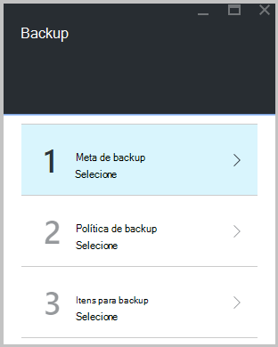

<properties
   pageTitle="Saiba como fazer backup de arquivos e pastas do Windows para o Azure com Backup Azure usando o modelo de implantação do Gerenciador de recursos | Microsoft Azure"
   description="Saiba como fazer backup de dados do Windows Server, criando um cofre, instalando o agente de serviços de recuperação e backup de seus arquivos e pastas para Azure."
   services="backup"
   documentationCenter=""
   authors="markgalioto"
   manager="cfreeman"
   editor=""
   keywords="como backup; como fazer backup"/>

<tags
   ms.service="backup"
   ms.workload="storage-backup-recovery"
   ms.tgt_pltfrm="na"
   ms.devlang="na"
   ms.topic="hero-article"
   ms.date="09/27/2016"
   ms.author="markgal;"/>

# Primeiro ver: fazer backup de arquivos e pastas com Backup de Azure usando o modelo de implantação do Gerenciador de recursos

Este artigo explica como backup de seu Windows Server (ou cliente Windows) arquivos e pastas no Azure com Backup Azure usando o Gerenciador de recursos. É um tutorial pretendido orientam as Noções básicas. Se você quiser começar a usar o Backup do Azure, você está no lugar certo.

Se você quiser saber mais sobre o Backup do Azure, leia esta [Visão geral](backup-introduction-to-azure-backup.md).

Fazendo backup de arquivos e pastas no Azure requer essas atividades:

 obter uma assinatura do Azure (se ainda não tiver uma). 
 criar um cofre de serviços de recuperação. 
 baixar os arquivos necessários. 
 instalar e registrar o agente de serviços de recuperação. 
 fazer backup de seus arquivos e pastas.

## Etapa 1: Obter uma assinatura do Azure

Se você não tiver uma assinatura do Azure, crie uma [conta gratuita](https://azure.microsoft.com/free/) que permite que você acesse qualquer serviço Azure.

## Etapa 2: Criar um cofre de serviços de recuperação

Para fazer backup de seus arquivos e pastas, você precisa criar um cofre de serviços de recuperação na região onde você deseja armazenar os dados. Você também precisa determinar como deseja que o seu armazenamento replicado.

### Para criar um cofre de serviços de recuperação

1. Se você ainda não fez isso, entrar no [Portal do Azure](https://portal.azure.com/) usando sua assinatura do Azure.

2. No menu Hub, clique em **Procurar** e na lista de recursos, digite **Os serviços de recuperação** e clique em **compartimentos de serviços de recuperação**.

      

3. No menu **compartimentos de serviços de recuperação** , clique em **Adicionar**.

    

    A lâmina de Cofre de serviços de recuperação é aberta, solicitando que você forneça um **nome**, **assinatura**, **grupo de recursos**e **local**.

    

4. Para **nome**, digite um nome amigável para identificar o cofre.

5. Clique na **assinatura** para ver a lista de assinaturas disponíveis.

6. Clique em **grupo de recursos** para ver a lista de grupos de recursos disponíveis, ou clique em **novo** para criar um novo grupo de recursos.

7. Clique em **local** para selecionar a região geográfica para o cofre. Essa opção determina a região geográfica onde os seus dados de backup são enviados.

8. Clique em **criar**.

    Se você não vir seu cofre listado depois que ela foi concluída, clique em **Atualizar**. Quando a lista de atualizações, clique no nome do cofre.

### Para determinar a redundância de armazenamento
Quando você cria primeiro um cofre de serviços de recuperação é determinar como o armazenamento é replicado.

1. Clique em novo cofre para abrir o painel de controle.

2. Na lâmina **configurações** , que é aberto automaticamente com seu painel Cofre, clique em **Infraestrutura de Backup**.

3. Na lâmina infraestrutura de Backup, clique em **Configuração de Backup** para exibir o **tipo de replicação de armazenamento**.

    

4. Escolha a opção de replicação de armazenamento adequado para seu cofre.

    

    Por padrão, seu cofre tem armazenamento redundante de localização geográfica. Se você estiver usando o Azure como um ponto de extremidade de armazenamento de backup principal, continue usando o armazenamento redundante de localização geográfica. Se você estiver usando o Azure como um ponto de extremidade de armazenamento de backup não principal, em seguida, escolha armazenamento localmente redundante, o que reduz o custo do armazenamento de dados no Azure. Leia mais sobre [geográfica redundantes](../storage/storage-redundancy.md#geo-redundant-storage) e opções de armazenamento [localmente redundantes](../storage/storage-redundancy.md#locally-redundant-storage) neste [Visão geral](../storage/storage-redundancy.md).

Agora que você criou um cofre, você preparar sua infraestrutura de backup de arquivos e pastas baixando as credenciais de compartimento e agente de serviços de recuperação do Microsoft Azure.

## Etapa 3 - Download de arquivos

1. Clique em **configurações** no painel Cofre serviços de recuperação.

    

2. Clique em **Introdução > Backup** na lâmina configurações.

    

3. Clique em **objetivo de Backup** no blade Backup.

    

4. Selecione **local** de onde está a carga de trabalho em execução? menu.

5. Selecionar **arquivos e pastas** no que você deseja fazer backup? menu e clique em **Okey**.

### Baixar o agente de serviços de recuperação

1. Clique em **Baixar agente do Windows Server ou Windows Client** na lâmina **Preparar infraestrutura** .

    

2. Clique em **Salvar** no pop-up download. Por padrão, o arquivo **MARSagentinstaller.exe** é salvo em sua pasta de Downloads.

### Baixar credenciais de cofre

1. Clique em **Baixar > Salvar** na lâmina preparar infraestrutura.

    

## Etapa 4 - instalar e registrar o agente

>[AZURE.NOTE] Habilitando backup por meio do portal Azure é em breve. No momento, você pode usar o agente de serviços de recuperação do Microsoft Azure local para fazer backup de seus arquivos e pastas.

1. Localize e clique duas vezes na **MARSagentinstaller.exe** da pasta Downloads (ou outro local salvo).

2. Conclua o Assistente de configuração de agente do Microsoft Azure recuperação serviços. Para concluir o assistente, você precisa:

    - Escolha um local para a instalação e a pasta cache.
    - Forneça seu proxy informações do servidor, se você usar um servidor proxy para conectar à internet.
    - Fornece de usuário detalhes de nome e senha, se você usar um proxy autenticado.
    - Fornecer as credenciais de cofre baixado
    - Salve a senha de criptografia em um local seguro.

    >[AZURE.NOTE] Se você perder ou esquecer a senha, a Microsoft não poderá ajudá recuperar os dados de backup. Salve o arquivo em um local seguro. Ele é necessário para restaurar um backup.

O agente agora está instalado e seu computador está registrado ao cofre. Você está pronto para configurar e agendar o backup.

## Etapa 5: Fazer backup de seus arquivos e pastas

O backup inicial inclui duas tarefas principais:

- Agendar o backup
- Fazer backup de arquivos e pastas pela primeira vez

Para concluir o backup inicial, você usa o agente de serviços de recuperação do Microsoft Azure.

### Para agendar o backup

1. Abra o agente de serviços de recuperação do Microsoft Azure. Você pode encontrá-lo, pesquisando sua máquina **Microsoft Azure Backup**.

    

2. No agente de serviços de recuperação, clique em **Backup da agenda**.

    

3. Na página de Introdução do Assistente de agendamento de Backup, clique em **Avançar**.

4. Em selecionar itens a página Backup, clique em **Adicionar itens**.

5. Selecione os arquivos e pastas que você deseja fazer backup e clique em **Okey**.

6. Clique em **Avançar**.

7. Na página **Especificar agenda de Backup** , especifique o **agendamento de backup** e clique em **Avançar**.

    Você pode programar backups semanais ou diariamente (a uma taxa máxima de três vezes por dia).

    

    >[AZURE.NOTE] Para obter mais informações sobre como especificar o agendamento de backup, consulte o artigo [Use Azure Backup para substituir sua infraestrutura de fita](backup-azure-backup-cloud-as-tape.md).

8. Na página **Selecionar política de retenção** , selecione a **Política de retenção** para a cópia de backup.

    A política de retenção Especifica a duração para a qual o backup será armazenado. Em vez de apenas especificando uma "política simples" para todos os pontos de backup, você pode especificar diferentes políticas de retenção com base em quando ocorre o backup. Você pode modificar as políticas de retenção de diário, semanal, mensal e anual para atender suas necessidades.

9. Na página Escolher tipo de Backup inicial, escolha o tipo de backup inicial. Deixe a opção **automaticamente pela rede** selecionada e clique em **Avançar**.

    Você pode fazer backup automaticamente pela rede, ou você pode fazer backup offline. O restante deste artigo descreve o processo de backup automaticamente. Se você preferir fazer um backup offline, examine o artigo [Offline fluxo de trabalho de backup no Azure Backup](backup-azure-backup-import-export.md) para obter informações adicionais.

10. Na página confirmação, examine as informações e clique em **Concluir**.

11. Depois que o assistente terminar de criar o agendamento de backup, clique em **Fechar**.

### Para fazer backup de arquivos e pastas pela primeira vez

1. No agente de serviços de recuperação, clique em **Fazer backup agora** para concluir a propagação inicial através da rede.

    

2. Na página confirmação, examine as configurações que o agora Assistente de backup usará para fazer backup de máquina. Clique em **Fazer backup**.

3. Clique em **Fechar** para fechar o assistente. Se você fizer isso, antes de concluir o processo de backup, o assistente continuará a ser executado em segundo plano.

Após o backup inicial for concluído, o status de **trabalho concluído** aparece no console de Backup.

## Dúvidas?
Se você tiver dúvidas ou se houver algum recurso que você gostaria de ver incluídos, [envie-nos comentários](http://aka.ms/azurebackup_feedback).

## Próximas etapas
- Obtenha mais detalhes sobre [como fazer backup máquinas do Windows](backup-configure-vault.md).
- Agora que você tiver feito backup de seus arquivos e pastas, você pode [gerenciar seus servidores e compartimentos](backup-azure-manage-windows-server.md).
- Se você precisar restaurar um backup, use este artigo para [restaurar os arquivos em um computador Windows](backup-azure-restore-windows-server.md).
