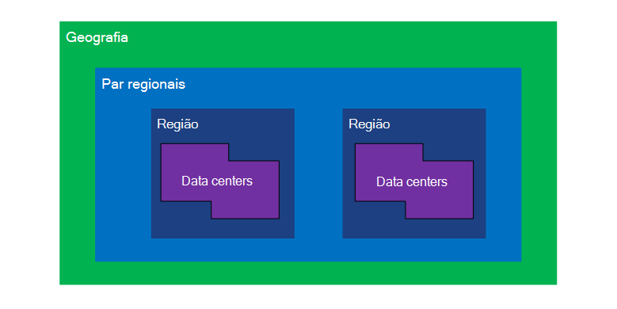
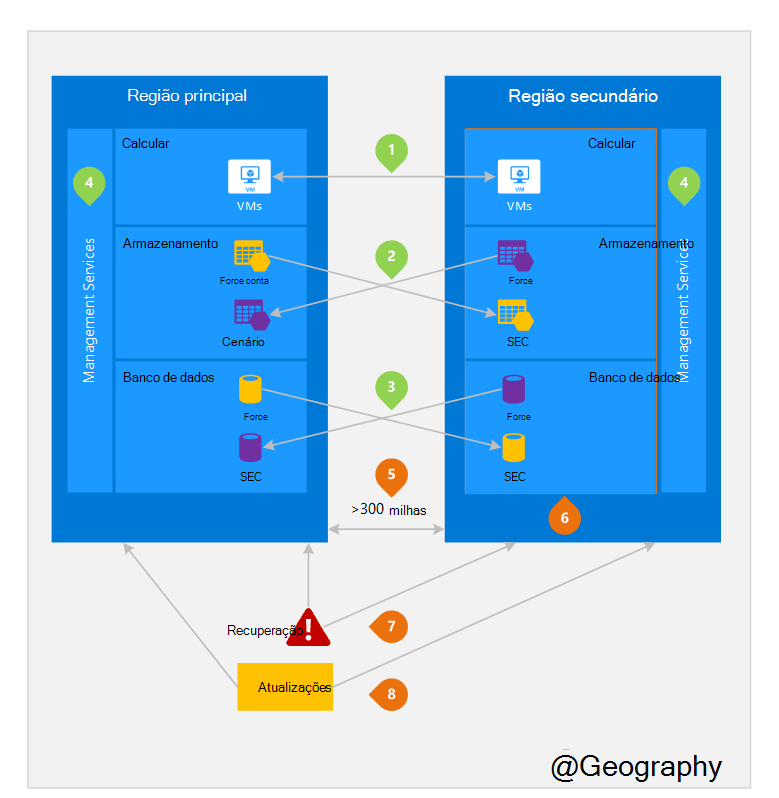

<properties
    pageTitle="Desastre e continuidade de negócios recuperação (BCDR): Azure par regiões | Microsoft Azure"
    description="Azure pares regionais garantir que os aplicativos sejam flexíveis durante falhas de centro de dados."
    services="site-recovery"
    documentationCenter=""
    authors="rayne-wiselman"
    manager="jwhit"
    editor=""/>

<tags
    ms.service="site-recovery"
    ms.workload="storage-backup-recovery"
    ms.tgt_pltfrm="na"
    ms.devlang="na"
    ms.topic="article"
    ms.date="08/23/2016"
    ms.author="raynew"/>

# Desastre e continuidade de negócios recuperação (BCDR): regiões par do Azure

## O que são combinados regiões?

Azure opera em várias regiões do mundo. Uma Azure geografia é uma área definida do mundo que contém pelo menos uma região do Azure. Uma região Azure é uma área dentro de uma geografia contendo um ou mais dos data centers.

Cada região Azure é combinado com outra região dentro a mesma geografia, juntos fazendo um par regional. A exceção é Sul Brasil que é associado a uma região fora de sua Geografia.

Figura 1 – diagrama Azure par regionais

| Geografia     |  Regiões pares  |                     |
| :-------------| :-------------   | :-------------      |
| América do Norte | Centro Norte dos EUA | Centro Sul dos EUA    |
| América do Norte | Leste EUA          | Oeste EUA             |
| América do Norte | Leste dos EUA 2        | Centro dos EUA          |
| América do Norte | Oeste EUA 2        | Centro-Oeste dos EUA     |
| Europa        | Norte da Europa     | Europa Ocidental         |
| Ásia          | Sudeste da Ásia  | Da Ásia Oriental           |
| China         | China Leste       | Norte da China         |
| Japão         | Japão Leste       | Japão Oeste          |
| Brasil        | Brasil Sul (1) | Centro Sul dos EUA    |
| Austrália     | Austrália Oriental   | Austrália Sudeste |
| Governo dos EUA | EUA Gov Iowa      | EUA Gov Virgínia     |
| Índia         | Índia central    | Índia Sul         |
| Canadá        | Canadá Central   | Canadá Leste         |
| REINO UNIDO            | Oeste do Reino Unido          | Sul do Reino Unido            |

Tabela 1 - mapeamento de azure pares regionais

> (1) Sul Brasil é exclusivo porque ele é combinado com uma região fora da sua própria Geografia. Região secundário do Sul Brasil é Centro Sul dos EUA mas da Centro Sul dos EUA região secundário não Brasil Sul.

Recomendamos que você replicar cargas de trabalho entre pares regionais para usufruir dos benefícios de políticas de isolamento e disponibilidade do Azure. Por exemplo, atualizações de sistema Azure planejadas são implantadas sequencialmente (não ao mesmo tempo) em todas as regiões pares. Isso significa que mesmo no caso de uma atualização com defeito, ambas as regiões não serão afetadas simultaneamente. Além disso, na eventual hipótese de uma ampla interrupção, recuperação de pelo menos uma região fora cada par é priorizamos.

## Um exemplo de regiões pares
Figura 2 a seguir mostra um aplicativo hipotético que usa o par regional para recuperação de dados. Os números verdes realçam as atividades de cruz região de três serviços Azure (computação Azure, armazenamento e banco de dados) e como eles são configurados para replicar entre regiões. Os benefícios exclusivos de implantar em pares regiões são realçados pelos números Laranjas.

Figura 2 – hipotética par regionais Azure

## Atividades de região cruzado
Como conhecidas na Figura 2.

 **(PaaS) de computação do Azure** – você deve provisionar recursos de computação adicionais com antecedência para garantir que recursos estão disponíveis em outra região durante um desastre. Para obter mais informações, consulte [orientações técnicas resiliência Azure](./resiliency/resiliency-technical-guidance.md).

 o **Armazenamento do Azure** - armazenamento geográfica redundantes (GRS) está configurado por padrão quando uma conta de armazenamento do Azure é criada. Com GRS, seus dados são replicados automaticamente três vezes dentro da região primária e três vezes na região par. Para obter mais informações, consulte [Opções de redundância de armazenamento do Azure](storage/storage-redundancy.md).

 **Bancos de dados do SQL Azure** – com o Azure SQL geográfica-replicação padrão, você pode configurar replicação assíncrona das transações para uma região par. Com a localização geográfica Premium-replicação, você pode configurar a replicação para qualquer região do mundo; No entanto, recomendamos que você implantar esses recursos em uma região par para a maioria dos cenários de recuperação de desastres. Para obter mais informações, consulte [Replicação geográfica no Azure SQL Database](./sql-database/sql-database-geo-replication-overview.md).

 **Azure Resource Manager (ARM)** - BRAÇO naturalmente fornece isolamento lógico dos componentes do gerenciamento de serviço entre regiões. Isso significa falhas lógicas em uma região são menos probabilidade de afetar a outra.

## Benefícios das regiões pares
Como conhecidas na Figura 2.  

**isolamento físico** – quando possível, o Azure prefere pelo menos 300 milhas de separação entre data centers em um par regional, embora esse não for prático ou possível em todas as regiões. Data center físico separação reduz a probabilidade de desastres naturais, tumultos civil, interrupções de energia ou interrupções de rede física afetando ambas as regiões de uma só vez. Isolamento está sujeito às restrições dentro a geografia (tamanho de Geografia disponibilidade de infraestrutura de energia/rede, normas, etc.).  

**replicação fornecida pela plataforma** - alguns serviços como o armazenamento geográfica redundante fornecem duplicação automática para a região par.

**ordem de recuperação de região** – em caso de falta de ampla, recuperação de uma região é priorizamos fora cada par. Aplicativos que são implantados em pares regiões garante ter uma das regiões recuperadas com prioridade. Se um aplicativo for implantado em regiões que não são combinados, recuperação pode ser atrasada – no pior caso que as regiões escolhidas podem ser os dois últimos sejam recuperados.

**sequencial atualiza** – planejado Azure sistema atualizações são implementadas em pares regiões sequencialmente (não ao mesmo tempo) para minimizar o tempo de inatividade, o efeito de bugs e lógicas falhas no caso de uma atualização incorreta.

**residência de dados** – uma região reside dentro a mesma geografia como seu par (excepto Brasil Sul) para atender aos requisitos de residência de dados para fins de impostos e lei imposição jurisdição.

