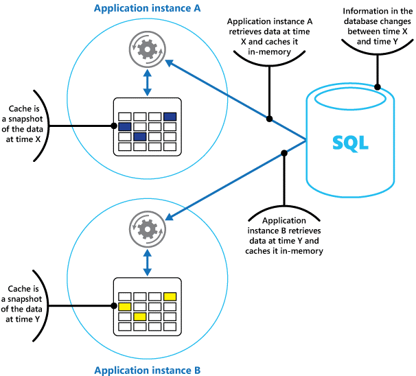

<properties
   pageTitle="Cache orientações | Microsoft Azure"
   description="Orientação sobre armazenamento em cache para melhorar o desempenho e escalabilidade."
   services=""
   documentationCenter="na"
   authors="dragon119"
   manager="christb"
   editor=""
   tags=""/>

<tags
   ms.service="best-practice"
   ms.devlang="na"
   ms.topic="article"
   ms.tgt_pltfrm="na"
   ms.workload="na"
   ms.date="07/14/2016"
   ms.author="masashin"/>


# <a name="caching-guidance"></a>Diretrizes de cache

[AZURE.INCLUDE [pnp-header](../includes/guidance-pnp-header-include.md)]

O cache é uma técnica comum que pretende melhorar o desempenho e escalabilidade de um sistema. Ele faz isso copiando temporariamente dados acessados para armazenamento rápido que encontra-se fechar para o aplicativo. Se esse armazenamento de dados rápida estiver localizado perto do aplicativo que a fonte original, então cache pode melhorar significativamente tempos de resposta para aplicativos cliente, atendendo dados mais rapidamente.

Armazenamento em cache é mais eficaz quando uma instância do cliente lê repetidamente os mesmos dados, especialmente se todas as seguintes condições se aplicam ao armazenamento de dados original:
- Ela permanecerá relativamente estática.
- Ele está lento em comparação com a velocidade do cache.
- Ele está sujeito a um alto nível de disputa.
- É mais longe quando latência de rede pode causar acesso seja lenta.

## <a name="caching-in-distributed-applications"></a>Armazenamento em cache em aplicativos distribuídos

Aplicativos distribuídos normalmente implementam uma ou ambas das seguintes estratégias quando o cache de dados:

- Usando um cache particular, onde os dados são mantidos localmente no computador que está executando uma instância de um aplicativo ou serviço.
- Usando um cache compartilhado, servindo como uma fonte comum que pode ser acessada por vários processos e/ou máquinas.

Em ambos os casos, o cache pode ser executado no lado do cliente e/ou servidor. Cache do cliente é feito pelo processo que fornece a interface de usuário para um sistema, como um navegador da web ou o aplicativo da área de trabalho.
Cache do lado do servidor é feito pelo processo que fornece os serviços de negócios que executam remotamente.

### <a name="private-caching"></a>Cache particular

O tipo mais básico de cache é uma loja de memória. Ela tem contidos em espaço de endereço de um único processo e acessadas diretamente pelo código que é executado no processo. Esse tipo de cache é muito rápido acessar. Ele também pode fornecer um meio muito eficiente para armazenar moderadas quantidades de dados estáticos, desde que o tamanho de um cache é normalmente restrito pelo volume de memória que está disponível na máquina o processo de hospedagem.

Se você precisar de mais informações do que é possível física na memória em cache, você pode escrever dados armazenados em cache para o sistema de arquivo local. Isso será mais lento acessar de dados que são mantidos na memória, mas ainda deve ser mais rápido e mais confiável do que a recuperação de dados em uma rede.

Se você tiver várias instâncias de um aplicativo que usa esse modelo executando simultaneamente, cada instância do aplicativo tem seu próprio cache independente mantém sua própria cópia dos dados.

Pense um cache como um instantâneo dos dados originais em algum momento no passado. Se esses dados não são estáticos, é provável que instâncias de aplicativo diferente manter versões diferentes dos dados nos seus caches. Portanto, a mesma consulta realizada por essas instâncias pode retornar resultados diferentes, conforme mostrado na Figura 1.



_Figura 1: Usando um cache de memória em diferentes instâncias de um aplicativo_

### <a name="shared-caching"></a>Compartilhado em cache

Usar um cache compartilhado pode ajudar a minimizar preocupações que dados podem diferir em cada cache, que pode ocorrer com o cache de memória. Cache compartilhado garante que instâncias de aplicativo diferente vejam o mesmo modo de exibição de dados armazenados em cache. Ele faz isso localizando o cache em um local separado, normalmente hospedado como parte de um serviço separado, como mostrado na Figura 2.


_Figura 2: Usando um cache compartilhado_

Uma vantagem importante da abordagem de cache compartilhada é a escalabilidade que ele oferece. Muitos serviços de cache compartilhado são implementados usando um cluster de servidores e utilizam o software que distribui os dados em cluster de maneira transparente. Uma instância do aplicativo simplesmente envia uma solicitação para o serviço de cache.
A infraestrutura subjacente é responsável por determinar o local dos dados armazenados em cache no cluster. Você pode facilmente dimensionar o cache, adicionando mais servidores.

Há duas desvantagens principais da abordagem cache compartilhada:
- O cache é mais lento ao acessar porque não é mantida localmente para cada instância do aplicativo.
- O requisito de implementar um serviço de cache separado pode adicionar complexidade à solução.

## <a name="considerations-for-using-caching"></a>Considerações para usar o armazenamento em cache

As seções a seguir descrevem mais detalhadamente as considerações para criar e usar um cache.

### <a name="decide-when-to-cache-data"></a>Decidir quando dados em cache

Armazenamento em cache pode melhorar drasticamente o desempenho, escalabilidade e disponibilidade. Quanto mais dados que você tem e quanto maior o número de usuários que precisam acessar esses dados, maiores as vantagens do cache se tornam. Isso ocorre porque o cache reduz a latência e disputa associado ao lidar com grandes volumes de solicitações simultâneas no armazenamento de dados original.

Por exemplo, um banco de dados pode oferecer suporte a um número limitado de conexões simultâneas. Recuperando dados de um cache compartilhado, no entanto, em vez de banco de dados subjacente, possibilita para um aplicativo cliente acessar esses dados mesmo se o número de conexões disponíveis atualmente acabar. Além disso, se o banco de dados ficar indisponível, aplicativos cliente poderá continuar usando os dados que são mantidos no cache.

Considere a possibilidade de cache de dados que é lido com frequência, mas modificados raramente (por exemplo, dados que tem uma proporção maior de operações de leitura de operações de gravação). No entanto, não recomendamos que você use o cache de como o armazenamento autoritativo das informações críticas. Em vez disso, certifique-se de que todas as alterações que seu aplicativo não pode ser perdidas sempre são salvos em um repositório de dados persistentes. Isso significa que, se o cache estiver indisponível, seu aplicativo pode continuar a operar usando o armazenamento de dados e você não perderá informações importantes.

### <a name="determine-how-to-cache-data-effectively"></a>Determinar como cache de dados com eficiência

A chave para utilizar um cache efetivamente reside em determinar os dados mais adequados para cache e armazenamento em cache no momento apropriado. Os dados podem ser adicionados ao cache sob demanda na primeira vez que recuperá-la por um aplicativo. Isso significa que o aplicativo precisa buscar os dados apenas uma vez o armazenamento de dados e que o acesso subsequente pode ser obedecido usando o cache.

Como alternativa, um cache pode ser parcialmente ou totalmente preenchido com dados de antecedência, normalmente quando o aplicativo é iniciado (uma abordagem conhecida como propagação). No entanto, talvez não seja aconselhável implementar propagação para um grande cache, pois essa abordagem pode impor uma carga súbita, alta no repositório de dados original quando o aplicativo começa a ser executado.

Muitas vezes uma análise de padrões de uso pode ajudá-lo a decidir se total ou parcialmente preencher um cache e escolha os dados em cache. Por exemplo, ele pode ser útil propagar o cache com os dados de perfil de usuário estático para clientes que usam o aplicativo regularmente (talvez cada dia), mas não para clientes que usam o aplicativo apenas uma vez por semana.

Cache geralmente funciona bem com dados que é imutável ou que são alterados com frequência. Alguns exemplos incluem informações sobre preços e informações de referência como produto em um aplicativo de comércio ou recursos compartilhados de estáticos que estão caros construir. Alguns ou todos esses dados podem ser carregados no cache na inicialização do aplicativo para minimizar a demanda por recursos e melhorar o desempenho. Ele também pode ser apropriado tenham um processo de plano de fundo que atualiza periodicamente referência dados no cache para garantir que ela estão atualizados ou que atualiza o cache quando faz referência a dados alterações.

Armazenamento em cache é menos útil para dados dinâmicos, embora existam algumas exceções a essa consideração (consulte a seção Cache altamente dinâmicos dados mais adiante neste artigo para obter mais informações). Quando os dados originais alteram regularmente, as informações armazenadas em cache rapidamente se tornam obsoletas ou a sobrecarga de sincronizar o cache com o armazenamento de dados original reduz a eficiência do cache.

Observe que um cache não precisa incluir os dados concluídos para uma entidade. Por exemplo, se um item de dados representa um objeto de múltiplos valores como um cliente bancário com um nome, endereço e saldo da conta, alguns desses elementos podem permanecer estáticas (como o nome e endereço), enquanto outras pessoas (como o saldo da conta) podem ser mais dinâmicas. Nesses casos, ele pode ser útil para as partes estáticas dos dados de cache e recuperar (ou calcular) somente as informações restantes quando for necessário.

Recomendamos que você executa análise de teste e o uso de desempenho para determinar se o carregamento de população de pré-lançamento ou sob demanda de cache ou uma combinação de ambos, é apropriado. A decisão deve se basear a volatilidade e o padrão de uso dos dados. Análise de desempenho e utilização do cache é particularmente importante em aplicativos que encontrar sobrecarga e devem ser altamente escaláveis. Por exemplo, em cenários altamente escaláveis pode fazer sentido para propagar o cache para reduzir a carga no repositório de dados em horários de pico.

Armazenamento em cache também pode ser usado para evitar a repetição cálculos enquanto o aplicativo está em execução. Se uma operação transforma dados ou executa um cálculo complicado, ele poderá salvar os resultados da operação no cache. Se o mesmo cálculo for necessário posteriormente, o aplicativo pode simplesmente recuperar os resultados do cache.

Um aplicativo pode modificar dados que são mantidos em cache. No entanto, é recomendável raciocínio do cache como um armazenamento de dados temporárias que poderia desaparecer a qualquer momento. Não armazenar dados valiosos somente; no cache Certifique-se de manter as informações do armazenamento de dados original. Isso significa que, se o cache ficar indisponível, você minimizar a possibilidade de perda de dados.

### <a name="cache-highly-dynamic-data"></a>Altamente dinâmico de cache de dados

Quando você armazena informações mudam rapidamente em um repositório de dados persistentes, ele pode impor uma sobrecarga no sistema. Por exemplo, considere um dispositivo que continuamente relatórios de status ou alguns outra medida. Se um aplicativo decidir não esses dados na base que as informações armazenadas em cache quase sempre será desatualizadas em cache, a mesma consideração pode ser verdadeira quando armazenar e recuperar essas informações do armazenamento de dados. No tempo necessário para salvar e pegar esses dados, ele pode ter alterado.

Em uma situação como esta, considere as vantagens de armazenar as informações dinâmicas diretamente no cache em vez de no armazenamento de dados persistentes. Se os dados são não-críticos e não exige auditoria e, em seguida, não importa se a alteração eventual é perdida.

### <a name="manage-data-expiration-in-a-cache"></a>Gerenciar a expiração de dados em um cache

Na maioria dos casos, os dados que são mantidos em um cache são uma cópia dos dados que são mantidos no armazenamento de dados original. Os dados no armazenamento de dados original pode ser alterada após o foi cache, fazendo com que os dados armazenados em cache se tornar obsoletos. Muitos sistemas de cache permitem que você configurar o cache para expirar dados e reduzir o período para o qual os dados podem estar desatualizados.

Quando dados armazenados em cache expirem, ele será removido do cache e o aplicativo deve recuperar os dados do armazenamento de dados original (ele pode colocar as informações obtidas recentemente novamente no cache). Você pode definir uma política de expiração padrão quando você configura o cache. Em muitos serviços de cache, pode também determinar o período de expiração para objetos individuais quando você armazená-los programaticamente no cache.
Alguns caches permitem que você especifique o período de expiração como um valor absoluto ou como um valor deslizante que faz com que o item a ser removido do cache se ele não for acessado no tempo especificado. Esta configuração substitui qualquer política de expiração de todo o cache, mas somente para os objetos especificados.

> [AZURE.NOTE] Considere o período de expiração para o cache e os objetos que ela contém cuidadosamente. Se você fizer muito curta, objetos expirará muito rapidamente e você irá reduzir os benefícios de usar o cache. Se você fizer o período muito longo, risco os dados obsoletos.

Também é possível que o cache pode preencher se dados for permitidos permaneça residente por um longo tempo. Nesse caso, todas as solicitações para adicionar novos itens para o cache podem causar alguns itens a serem removidas de modo forçado em um processo conhecido como remoção. Serviços de cache normalmente remover dados de forma menos utilizado recentemente (LRU), mas você geralmente pode substituir essa política e impedir que os itens que estiver sendo removido. No entanto, se você adotam essa abordagem, o risco ultrapassando a memória que está disponível no cache. Um aplicativo que tenta adicionar um item para o cache falhará com uma exceção.

Algumas implementações de cache podem fornecer políticas de remoção adicionais. Há vários tipos de políticas de remoção. Eles incluem:
- Uma política usados mais recentemente (nas expectativas que os dados não será necessários novamente).
- Uma política de primeiro-na-primeira-out (dados mais antigos são removidos primeiro).
- Uma política de remoção explícita com base em um evento de disparo (como os dados sejam modificados).

### <a name="invalidate-data-in-a-client-side-cache"></a>Invalidar dados em um cache do lado do cliente

Dados que são mantidos em um cache do lado do cliente geralmente são considerados fora a responsabilidade do serviço que fornece os dados para o cliente. Um serviço diretamente não pode forçar um cliente para adicionar ou remover informações de um cache do lado do cliente.

Isso significa que é possível para um cliente que usa um cache mal configurado para continuar a usar informações desatualizadas. Por exemplo, se as políticas de expiração do cache não implementadas corretamente, um cliente pode usar informações desatualizadas armazenados em cache localmente quando as informações na fonte de dados original foi alterado.

Se você estiver criando um aplicativo web que serve dados sobre uma conexão HTTP, você pode forçar implicitamente um cliente da web (como um navegador ou proxy da web) para buscar as informações mais recentes. Você pode fazer isso se um recurso for atualizado por uma alteração no URI do recurso. Clientes de Web normalmente usam o URI de um recurso como a chave no cache do lado do cliente, portanto se o URI mudar, o cliente de web ignora qualquer anteriormente versões de um recurso de cache e busca a nova versão em vez disso.

## <a name="managing-concurrency-in-a-cache"></a>Gerenciando concorrência em cache

Caches geralmente foram projetados para serem compartilhados por várias instâncias de um aplicativo. Cada instância do aplicativo pode ler e modificar dados no cache. Consequentemente, os mesmos problemas de concorrência que surgem com qualquer armazenamento de dados compartilhado também se aplicam a um cache. Em uma situação onde um aplicativo precisa modificar dados que são mantidos no cache, talvez seja necessário garantir que as atualizações feitas por uma instância do aplicativo não substituirá as alterações feitas por outra instância.

Dependendo da natureza dos dados e a probabilidade de conflitos, você pode adotar uma das duas abordagens para concorrência:

- __Otimista.__ Imediatamente antes de atualizar os dados, o aplicativo verifica se os dados no cache foi alterado desde que foi recuperada. Se os dados ainda são as mesmas, pode ser feita a alteração. Caso contrário, o aplicativo tem decidir atualizá-lo. (A lógica de negócios que orienta essa decisão será específicos do aplicativo). Essa abordagem é adequada para situações em que as atualizações são frequentes ou onde conflitos são prováveis.
- __Pessimista.__ Quando ele recupera os dados, o aplicativo bloqueia-o no cache para impedir que outra instância alterá-la. Esse processo garante que não podem ocorrer conflitos, mas elas também podem bloquear outras instâncias que precisam para processar os mesmos dados. Concorrência pessimista é recomendada somente para operações de curta duração e pode afetar a escalabilidade de uma solução. Essa abordagem pode ser apropriada para situações onde conflitos serão mais prováveis, especialmente se um aplicativo atualiza vários itens no cache e deve garantir que essas alterações sejam aplicadas consistentemente.

### <a name="implement-high-availability-and-scalability-and-improve-performance"></a>Implementar escalabilidade e alta disponibilidade e melhorar o desempenho

Evitar o uso de um cache como o principal repositório dos dados; Essa é a função de armazenamento de dados original do qual o cache é preenchido. O armazenamento de dados original é responsável por garantir a persistência dos dados.

Tenha cuidado para não introduzir dependências críticas sobre a disponibilidade de um serviço de cache compartilhado em suas soluções. Um aplicativo deve ser capaz de continuar funcionando se o serviço que fornece o cache compartilhado não estiver disponível. O aplicativo não deve travar ou falhar enquanto aguarda o serviço de cache continuar.

Portanto, o aplicativo deve estar preparado para detectar a disponibilidade do serviço de cache e voltar para o armazenamento de dados original se o cache está inacessível. O [separador de circuito padrão](http://msdn.microsoft.com/library/dn589784.aspx) é útil para lidar com esse cenário. O serviço que fornece o cache pode ser recuperado e depois que ela se tornar disponível, o cache possa ser preenchido novamente como dados são lidos o armazenamento de dados original, seguindo uma estratégia de como o [padrão de Cache-aside](http://msdn.microsoft.com/library/dn589799.aspx)de formulário.

No entanto, pode haver um impacto de escalabilidade no sistema se o aplicativo de volta para o armazenamento de dados original quando o cache está temporariamente indisponível.
Enquanto o armazenamento de dados está sendo recuperado, o armazenamento de dados original poderia ser superestimado com solicitações de dados, resultando em tempos limite e conexões com falha.

Considere implementar um cache local, privado em cada instância de um aplicativo, junto com o cache compartilhado que acessar todas as instâncias do aplicativo. Quando o aplicativo recupera um item, ele pode verificar primeiro em seu cache local, em compartilhado em cache e por fim nos dados originais armazenar. O cache local pode ser preenchido usando os dados no cache de compartilhado ou no banco de dados se o cache compartilhado não estiver disponível.

Essa abordagem requer configuração cuidadosa para impedir que o cache local muito obsoletos relacionadas com o cache compartilhado. No entanto, o cache local atua como buffer se o cache compartilhado está inacessível. Figura 3 mostra essa estrutura.


_Figura 3: usar um cache local, privado com um cache compartilhado_

Para dar suporte caches grandes que contêm dados vida relativamente longa, alguns serviços de cache fornecem uma opção de alta disponibilidade que implementa failover automático se o cache ficar indisponível. Essa abordagem geralmente envolve replicar os dados armazenados em cache que estão armazenados em um servidor de cache primário para um servidor de cache secundário e alternar para o servidor secundário se o servidor primário falhar ou conectividade é perdida.

Para reduzir a latência associado ao escrever para vários destinos, a replicação para o servidor secundário pode ocorrer assíncrona quando os dados são gravados no cache no servidor primário. Essa abordagem leva à possibilidade de que algumas informações armazenadas em cache poderão se perder em caso de uma falha, mas a proporção de dados deve ser pequena em comparação com o tamanho geral do cache.

Se um cache compartilhado for grande, talvez seja útil partição os dados armazenados em cache em nós para reduzir as chances de disputa e melhorar a escalabilidade. Vários caches compartilhados a capacidade de adicionar dinamicamente (e remover) nós de suporte e elimine os dados em partições. Essa abordagem pode envolver clusters, no qual a coleção de nós é apresentada em aplicativos clientes como um cache perfeito, único. Internamente, no entanto, os dados é disperso entre nós seguindo uma estratégia de distribuição predefinido que equilibra a carga de maneira uniforme. O [documento de orientação de partição de dados](http://msdn.microsoft.com/library/dn589795.aspx) no site da Microsoft fornece mais informações sobre possíveis estratégias partição.

Agrupamento também pode aumentar a disponibilidade do cache. Se um nó falhar, o resto do cache é ainda acessível.
Agrupamento é frequentemente usado em conjunto com replicação e failover. Cada nó pode ser replicado e a réplica pode ser rapidamente colocada online se o nó falhar.

Muitos ler e as operações de gravação provavelmente envolvem valores de dados simples ou objetos. No entanto, às vezes pode ser necessário armazenar ou recuperar grandes volumes de dados rapidamente.
Por exemplo, um cache de propagação pode envolver a escrever centenas ou milhares de itens para o cache. Um aplicativo também pode precisar recuperar um grande número de itens relacionados do cache como parte da mesma solicitação.

Vários caches grande escala fornecem operações de lote para esses fins. Isso permite que um aplicativo cliente empacotar um grande volume de itens em uma única solicitação e reduz a sobrecarga associado ao realizar um grande número de solicitações de pequenas.

## <a name="caching-and-eventual-consistency"></a>Consistência de cache e eventual

Para o padrão de cache-aside trabalhar, a instância do aplicativo que preenche o cache deve ter acesso a versão mais recente e consistente dos dados. Em um sistema que implementa consistência eventual (como um repositório de dados replicados), isso pode não ser o caso.

Uma instância de um aplicativo pode modificar um item de dados e invalidar a versão em cache desse item. Outra instância do aplicativo pode tentar ler este item de um cache, o que causa um erro de cache, portanto, ele lê os dados do armazenamento de dados e adiciona-lo para o cache. No entanto, se o armazenamento de dados não foi totalmente sincronizado com outras réplicas, instância do aplicativo pode ler e preencher o cache com o valor antigo.

Para obter mais informações sobre como lidar com consistência de dados, consulte a página de [Introdução de consistência de dados](http://msdn.microsoft.com/library/dn589800.aspx) no site da Microsoft.

### <a name="protect-cached-data"></a>Proteger os dados armazenados em cache

Independentemente do serviço de cache que você usar, considere como proteger os dados que são mantidos no cache contra acesso não autorizado. Há dois principais preocupações:

- A privacidade dos dados no cache
- A privacidade dos dados como ela flui entre o cache e o aplicativo que está usando o cache

Para proteger os dados no cache, o serviço de cache pode implementar um mecanismo de autenticação que requer que aplicativos especificam o seguinte:
- Quais identidades podem acessar dados no cache.
- Quais operações (leitura e gravação) que essas identidades têm permissão para executar.

Para reduzir a sobrecarga que associado ao ler e gravar dados, após uma identidade recebeu gravação e/ou acesso de leitura no cache, que identidade pode usar todos os dados no cache.

Se você precisar restringir o acesso subconjuntos dos dados armazenados em cache, você pode fazer um destes procedimentos:

- Dividir o cache em partições (usando servidores de cache diferentes) e somente conceder acesso a identidades para as partições que eles devem ser permitidos para usar.
- Criptografar os dados em cada subconjunto usando chaves diferentes e forneça as chaves de criptografia somente a identidades que devem ter acesso a cada subconjunto. Um aplicativo cliente ainda poderá recuperar todos os dados no cache, mas só será capaz de descriptografar os dados para os quais possui as teclas.

Você também deve proteger os dados enquanto estão fluindo e sair do cache. Para fazer isso, você depende os recursos de segurança fornecidos pelo infraestrutura de rede que aplicativos cliente usam para se conectar ao cache. Se o cache é implementado usando um servidor local na mesma organização que hospeda os aplicativos cliente, em seguida, o isolamento da rede em si pode não exigir que você executar etapas adicionais. Se o cache está localizado remotamente e requer uma conexão TCP ou HTTP em uma rede pública (como a Internet), considere a implementação SSL.

## <a name="considerations-for-implementing-caching-with-microsoft-azure"></a>Considerações para implementar o cache com o Microsoft Azure

Azure fornece o Cache do Azure relacionada. Esta é uma implementação da fonte de abrir cache relacionada que é executado como um serviço em um data center Azure. Ele fornece um serviço de cache que possa ser acessado de qualquer aplicativo do Azure, se o aplicativo é implementado como um serviço de nuvem, um site, ou dentro de uma máquina virtual Azure. Caches podem ser compartilhados por aplicativos cliente que possuem a chave de acesso apropriado.

Cache Azure relacionada é uma solução de cache de alto desempenho que fornece disponibilidade, escalabilidade e segurança. Normalmente é executado como um serviço difundir através de uma ou mais máquinas dedicadas. Ele tenta armazenar quantas informações ela poderá na memória para garantir o acesso rápido. Essa arquitetura destina-se a oferecer baixa latência e alta taxa de transferência, reduzindo a necessidade de executar operações de e/s lentas.

 Cache Azure relacionada é compatível com muitos das diversas APIs que são usadas pelos aplicativos cliente. Se você tiver aplicativos existentes que já utilizam o Cache de relacionada de Azure em execução no local, o Cache de relacionada do Azure fornece um caminho de migração rápida para armazenamento em cache na nuvem.

> [AZURE.NOTE] Azure também fornece o serviço de Cache gerenciado. Esse serviço se baseia o mecanismo de Cache de estrutura de serviço do Azure. Ele permite que você crie um cache distribuído que pode ser compartilhado por aplicativos flexíveis. O cache estiver hospedado em servidores de alto desempenho que executam em um data center Azure.
No entanto, essa opção não é recomendável e é fornecida apenas para dar suporte a aplicativos existentes que foram criados para usá-lo. Para desenvolvimento de novos todos, use Azure relacionada Cache.
>
> Além disso, o Azure suporta cache na função. Esse recurso permite que você crie um cache que é específico a um serviço de nuvem.
O cache está hospedado por instâncias de uma função da web ou colega e só pode ser acessado por funções que estão funcionando como parte da mesma unidade de implantação de serviço de nuvem. (Uma unidade de implantação é o conjunto de instâncias de função que são implantados como um serviço de nuvem para uma área específica.) O cache é agrupado e todas as instâncias da função dentro da mesma unidade de implantação que hospeda o cache tornam-se parte do mesmo cluster cache. No entanto, essa opção não é recomendável e é fornecida apenas para dar suporte a aplicativos existentes que foram criados para usá-lo. Para desenvolvimento de novos todos, use Azure relacionada Cache.
>
> Serviço de Cache do Azure gerenciado e Cache do Azure na função estão atualmente programado para aposentadoria em 16 de novembro de 2016.
É recomendável que você migrar para o Cache do Azure relacionada em preparação para este aposentadoria. Para obter mais informações, visite a página   [qual é a oferta de Cache relacionada do Azure e qual o tamanho devo usar?](redis-cache/cache-faq.md#what-redis-cache-offering-and-size-should-i-use) no site da Microsoft.


### <a name="features-of-redis"></a>Recursos do relacionada

 Relacionada é mais que um servidor de cache simples. Ele fornece um banco de dados na memória distribuído com um conjunto de comando extensa que dá suporte a muitos cenários comuns. Estes são descritas posteriormente neste documento, na seção usando relacionada cache. Esta seção resume alguns dos principais recursos que fornece relacionada.

### <a name="redis-as-an-in-memory-database"></a>Relacionada como um banco de dados na memória

Relacionada suporta operações leitura e gravação. No relacionada, gravações podem ser protegidas de falha do sistema pelo sendo armazenada periodicamente em um arquivo de instantâneo local ou em um arquivo de log somente acréscimo. Isso não é o caso em vários caches (que devem ser consideradas armazenamentos de dados transitório).

 Todas as gravações são assíncronas e não bloqueie os clientes de ler e gravar dados. Quando relacionada começa a executar, ele lê os dados a partir do arquivo de log ou instantâneo e usa para construir o cache de memória. Para obter mais informações, consulte [relacionada persistência](http://redis.io/topics/persistence) no site relacionada.

> [AZURE.NOTE] Relacionada não garante que todas as gravações serão salvas em caso de uma falha grave, mas no pior caso, você pode perder apenas alguns segundos patrimônio dos dados. Lembre-se de que um cache não é destinado para agir como uma fonte de dados autoritativas e é responsabilidade dos aplicativos usando o cache para garantir que os dados críticos sejam salvos com êxito um repositório de dados apropriado. Para obter mais informações, consulte o [cache-aside padrão](http://msdn.microsoft.com/library/dn589799.aspx).

#### <a name="redis-data-types"></a>Relacionada tipos de dados

Relacionada é um armazenamento de chave-valor, onde os valores podem conter tipos simples ou estruturas de dados complexas como hash, listas e define. Ele oferece suporte a um conjunto de operações atômicas nesses tipos de dados. Chaves podem ser permanente ou marcadas com um limitado à vida, ponto em que a chave e seu valor correspondente são automaticamente removidos do cache. Para obter mais informações sobre chaves relacionada e valores, visite a página [introdutório para relacionada abstrações e tipos de dados](http://redis.io/topics/data-types-intro) no site relacionada.

#### <a name="redis-replication-and-clustering"></a>Replicação relacionada e agrupamento

Relacionada oferece suporte para replicação de principal/subordinada para ajudar a garantir a disponibilidade e manter a produtividade. Escreva as operações de um nó mestre relacionada são replicadas para um ou mais nós subordinadas. Operações de leitura podem ser servidas por mestre ou em qualquer um dos subordinados.

Em caso de uma partição de rede, subordinados podem continuar a atender dados e transparente sincronize novamente com o mestre quando a conexão for restabelecida. Para obter mais detalhes, visite a página de [replicação](http://redis.io/topics/replication) no site relacionada.

Relacionada também fornece clusters, que permite a transparente partição dados em fragmentos entre servidores e distribuir a carga. Esse recurso melhora a escalabilidade, porque novos servidores relacionada podem ser adicionados e aumentam os dados reparticionados como o tamanho do cache.

Além disso, cada servidor no cluster pode ser replicado usando replicação de mestre/subordinado. Isso garante disponibilidade em cada nó no cluster. Para obter mais informações sobre agrupamento e fragmentação, visite o [relacionada página tutorial cluster](http://redis.io/topics/cluster-tutorial) no site relacionada.

### <a name="redis-memory-use"></a>Relacionada o uso da memória

Um cache relacionada tem um tamanho finito que depende dos recursos disponíveis no computador host. Quando você configura um servidor relacionada, você pode especificar a quantidade máxima de memória que ele pode usar. Você também pode configurar uma chave em um cache relacionada ter um tempo de expiração, após o qual ele é automaticamente removido do cache. Esse recurso pode ajudar a impedir que o cache de memória preenchimento com dados antigos ou obsoletos.

Conforme memória preenchida, relacionada pode automaticamente remover chaves e seus valores seguindo um número de diretivas. O padrão é LRU (recentemente menos usado), mas você também pode selecionar outras diretivas como remover chaves aleatoriamente ou desativando a remoção totalmente (em que, caso tenta adicionar itens a falhas o cache se ele estiver cheia). A página [Usando relacionada como um cache LRU](http://redis.io/topics/lru-cache) fornece mais informações.

### <a name="redis-transactions-and-batches"></a>Relacionada transações e lotes

Relacionada permite que um aplicativo cliente para enviar uma série de operações que ler e gravar dados no cache como uma transação atômica. Todos os comandos na transação garante que sejam executados sequencialmente e nenhum comandos emitidos por outros clientes simultâneas vai ser interwoven entre elas.

No entanto, esses não são verdadeiras transações, como um banco de dados relacional seria executá-las. Processamento de transações consiste em dois estágios – a primeira é quando os comandos estão na fila e o segundo é quando os comandos são executados. Durante o estágio de filas de comando, os comandos que compõem a transação são enviados pelo cliente. Se algum tipo de erro ocorre neste ponto (como um erro de sintaxe, ou o número incorreto de parâmetros) relacionada, em seguida, se recusa a processar a transação inteira e descarta.

Durante a fase de execução, relacionada executa cada comando na fila em sequência. Se um comando falhar durante esta fase, relacionada continua com o próximo comando enfileirado e não reverter os efeitos de todos os comandos que já foram executados. Este formulário simplificado da transação ajuda a manter o desempenho e evitar problemas de desempenho causados por disputa.

Relacionada implementar um formulário de bloqueio otimista para ajudar a manter a consistência. Para obter informações detalhadas sobre transações e bloqueio com relacionada, visite a [página transações](http://redis.io/topics/transactions) no site relacionada.

Relacionada também suporta lotes não transações de solicitações. O protocolo relacionada que os clientes usam para enviar comandos para um servidor relacionada permite que um cliente enviar uma série de operações como parte da mesma solicitação. Isso pode ajudar a reduzir a fragmentação de pacotes na rede. Quando o lote é processado, cada comando é executado. Se qualquer um desses comandos estiver incorreta, eles serão rejeitados (que não acontece com uma transação), mas os comandos remanescentes serão executados. Também não há nenhuma garantia sobre a ordem na qual os comandos no lote serão processados.

### <a name="redis-security"></a>Relacionada a segurança

Relacionada se concentra puramente em fornecer acesso rápido aos dados e é projetado para funcionar dentro de um ambiente confiável que pode ser acessado apenas por clientes confiáveis. Relacionada é compatível com um modelo de segurança limitados com base em autenticação de senha. (É possível remover autenticação completamente, embora não recomendamos isso.)

Todos os clientes autenticados compartilhem a mesma senha global e tem acesso aos mesmos recursos. Se precisar de segurança mais abrangente de entrada, você deve implementar sua própria camada de segurança na frente do servidor relacionada e todas as solicitações de cliente devem passar por essa camada adicional. Relacionada não deve ser diretamente exposta aos clientes não confiáveis ou não autenticados.

Você pode restringir o acesso a comandos desativando-los ou renomeá-las (e fornecendo somente privilegiados clientes com os novos nomes).

Relacionada não diretamente suporta qualquer forma de criptografia de dados, para que todos os codificação deve ser realizado por aplicativos cliente. Além disso, relacionada não oferece qualquer forma de segurança de transporte. Se você precisar proteger os dados conforme ela flui através da rede, é recomendável implementar um proxy SSL.

Para obter mais informações, visite a página [relacionada a segurança](http://redis.io/topics/security) no site relacionada.

> [AZURE.NOTE] Cache de relacionada Azure fornece sua própria camada de segurança por meio da qual os clientes se conectam. Os servidores de relacionada subjacentes não são expostos à rede pública.

### <a name="using-the-azure-redis-cache"></a>Usando o cache Azure relacionada

O Cache de relacionada do Azure fornece acesso aos servidores relacionada executados em servidores hospedados em um data center Azure; ele funciona como uma fachada que fornece controle de acesso e segurança. Você pode provisionar um cache usando o portal de gerenciamento do Azure. O portal fornece um número de configurações predefinidas, variando de um cache de 53GB executado como um serviço dedicado que suporta SSL comunicações (privacidade) e principal/subordinada replicação com um SLA de disponibilidade de 99,9%, para baixo até um 250 MB em cache sem replicação (nenhuma garantia de disponibilidade) em execução no hardware compartilhado.

Usando o portal de gerenciamento do Azure, você pode também configurar a política de remoção do cache e controlar o acesso ao cache ao adicionar usuários às funções fornecidas; Proprietário, colaborador, leitor. Essas funções definem as operações que os membros podem executar. Por exemplo, os membros da função proprietário tem controle total sobre o cache (incluindo segurança) e seu conteúdo, os membros da função Colaborador podem ler e gravar informações no cache e os membros da função Leitor só podem recuperar dados do cache.

A maioria das tarefas administrativas são executadas por meio do portal de gerenciamento do Azure e por isso que muitos dos comandos administrativos disponíveis na versão padrão do relacionada não estão disponíveis, incluindo a capacidade de modificar a configuração programaticamente, desligue o servidor relacionada, configurar escrava adicionais ou obrigatoriamente salvar dados em disco.

O portal de gerenciamento Azure inclui uma exibição gráfica conveniente que permite monitorar o desempenho do cache. Por exemplo, você pode exibir o número de conexões sendo feita, o número de solicitações executadas, o volume de leituras e gravações, e o número do cache visitas versus erros de cache. Usando essas informações, você pode determinar a eficiência do cache e, se necessário alterna para uma configuração diferente ou alterar a política de remoção. Além disso, você pode criar alertas que enviam mensagens de email para um administrador se uma ou mais métricas críticas estejam fora de um intervalo esperado. Por exemplo, se o número de erros de cache exceder um valor especificado na última hora, um administrador pode ser alertado sobre como o cache pode ser muito pequeno ou dados podem ser estiver sendo removidos muito rapidamente.

Você também pode monitorar CPU, memória e uso de rede para o cache.

Para obter mais informações e exemplos mostrando como criar e configurar um Cache de relacionada do Azure, visite a página [passeio pelo Azure relacionada Cache](https://azure.microsoft.com/blog/2014/06/04/lap-around-azure-redis-cache-preview/) no blog do Azure.

## <a name="caching-session-state-and-html-output"></a>Cache de estado de sessão e saída HTML

Se você Criando ASP.NET aplicativos da web que executar usando funções da web Azure, você pode salvar informações de estado de sessão e saída HTML em um Cache do Azure relacionada. O provedor de estado de sessão para Azure relacionada Cache permite que você compartilhe informações de sessão entre diferentes instâncias de um aplicativo web ASP.NET e é muito útil em situações de farm de web onde afinidade de cliente e servidor não está disponível e dados de sessão em memória cache não seria apropriado.

Usando o provedor de estado de sessão com Azure relacionada Cache oferece vários benefícios, incluindo:

- Ela pode compartilhar o estado de sessão entre um grande número de instâncias de um aplicativo web do ASP.NET, fornecendo melhor escalabilidade,
- Ele dá suporte a controlado, simultânea acessem os mesmos dados de estado de sessão de vários leitores e um único gravador, e
- Ele pode usar compactação para economizar memória e melhorar o desempenho de rede.

Para obter mais informações visite a página do [Provedor de estado de sessão do ASP.NET para Azure relacionada Cache](redis-cache/cache-aspnet-session-state-provider.md) no site da Microsoft.

> [AZURE.NOTE] Não use o provedor de estado de sessão para Azure relacionada Cache para aplicativos ASP.NET que são executadas fora do ambiente do Azure. A latência de acessando o cache de fora do Azure pode eliminar os benefícios de desempenho do cache de dados.

Da mesma forma, o provedor de Cache de saída para o Azure relacionada Cache permite salvar as respostas HTTP geradas por um aplicativo web ASP.NET. Usando o provedor de Cache de saída com Azure relacionada Cache pode melhorar os tempos de resposta de aplicativos que processam saída HTML complexa; instâncias do aplicativo gerando respostas semelhantes podem fazer usam dos fragmentos de saída compartilhado em cache em vez de gerar este HTML afresh de saída.  Para obter mais informações visite a página do [Provedor de Cache de saída do ASP.NET para Azure relacionada Cache](redis-cache/cache-aspnet-output-cache-provider.md) no site da Microsoft.

### <a name="azure-redis-cache"></a>Cache Azure relacionada

Cache de relacionada Azure fornece acesso aos servidores relacionada que são hospedados em um centro de dados do Azure. Ele funciona como uma fachada que fornece controle de acesso e segurança. Você pode provisionar um cache usando o portal do Azure.

O portal fornece um número de configurações predefinidas. Elas variam de um cache de GB 53 executado como um serviço dedicado que suporta comunicações SSL (para privacidade) e principal/subordinada replicação com um SLA de disponibilidade de 99,9%, para baixo até um cache de 0 MB 25 sem replicação (nenhuma garantia de disponibilidade) em execução no hardware compartilhado.

Usando o portal do Azure, você pode também configurar a política de remoção do cache e controlar o acesso ao cache ao adicionar usuários às funções fornecidas.  Essas funções, que definem as operações que os membros podem executar, incluem proprietário, Colaborador e Reader. Por exemplo, os membros da função proprietário tem controle total sobre o cache (incluindo segurança) e seu conteúdo, os membros da função Colaborador podem ler e gravar informações no cache e os membros da função Leitor só podem recuperar dados do cache.

A maioria das tarefas administrativas são executadas por meio do portal Azure. Por esse motivo, muitos dos comandos administrativos disponíveis na versão padrão do relacionada não estão disponíveis, incluindo a capacidade de modificar a configuração programaticamente, desligar o servidor relacionada, configurar subordinados adicionais ou obrigatoriamente salvar dados em disco.

O portal do Azure inclui uma exibição gráfica conveniente que permite monitorar o desempenho do cache. Por exemplo, você pode exibir o número de conexões feitas, o número de solicitações sendo executada, o volume de leituras e gravações e o número de ocorrências de cache versus erros de cache. Usando essas informações, você pode determinar a eficiência do cache e se necessário, alterne para uma configuração diferente ou alterar a política de remoção.

Além disso, você pode criar alertas que enviam mensagens de email para um administrador se uma ou mais métricas críticas estejam fora de um intervalo esperado. Por exemplo, talvez você queira alertar um administrador se o número de erros de cache exceder um valor especificado na última hora, pois isso significa que o cache pode ser pequeno demais ou dados podem ser estiver sendo removidos muito rapidamente.

Você também pode monitorar a CPU, a memória e o uso de rede para o cache.

Para obter mais informações e exemplos mostrando como criar e configurar um Cache de relacionada do Azure, visite a página [passeio pelo Azure relacionada Cache](https://azure.microsoft.com/blog/2014/06/04/lap-around-azure-redis-cache-preview/) no blog do Azure.

## <a name="caching-session-state-and-html-output"></a>Cache de estado de sessão e saída HTML

Se você está construindo aplicativos ASP.NET que executar usando funções da web Azure, você pode salvar sessão estado informações e saída HTML em um Cache do Azure relacionada. O provedor de estado de sessão para Azure relacionada Cache permite que você compartilhe informações de sessão entre diferentes instâncias de um aplicativo web ASP.NET e é muito útil em situações de farm de web onde afinidade de cliente e servidor não está disponível e dados de sessão em memória cache não seria apropriado.

Usando o provedor de estado de sessão com Azure relacionada Cache oferece vários benefícios, incluindo:

- Estado de sessão de compartilhamento com um grande número de instâncias de aplicativos da web ASP.NET.
- Fornecendo melhor escalabilidade.
- Controlado, simultânea acessem os mesmos dados de estado de sessão de suporte para vários leitores e um único gravador.
- Usando a compactação para economizar memória e melhorar o desempenho de rede.

Para obter mais informações, visite a página do [provedor de estado de sessão do ASP.NET para Azure relacionada Cache](redis-cache/cache-aspnet-session-state-provider.md) no site da Microsoft.

> [AZURE.NOTE] Não use o provedor de estado de sessão para Azure relacionada Cache com aplicativos ASP.NET que executar fora do ambiente do Azure. A latência de acessando o cache de fora do Azure pode eliminar os benefícios de desempenho do cache de dados.

Da mesma forma, o provedor de cache de saída para o Azure relacionada Cache permite salvar as respostas HTTP geradas por um aplicativo web ASP.NET. Usando o provedor de cache de saída com Azure relacionada Cache pode melhorar os tempos de resposta de aplicativos que processam saída HTML complexa. Instâncias de aplicativo que geram respostas semelhantes podem fazer uso dos fragmentos saída compartilhado em cache em vez de gerar este HTML afresh de saída. Para obter mais informações, visite a página do [provedor de cache de saída do ASP.NET para Azure relacionada Cache](redis-cache/cache-aspnet-output-cache-provider.md) no site da Microsoft.

## <a name="building-a-custom-redis-cache"></a>Criando um cache relacionada personalizado

Cache de relacionada Azure atua como uma fachada para os servidores de relacionada subjacentes. Atualmente ele dá suporte a um conjunto fixo de configurações, mas não oferece para relacionada cluster. Se você precisar de uma configuração avançada que não é coberta pelo cache do Azure relacionada (como um cache maior que 53 GB) você pode criar e hospedar seus próprios servidores relacionada usando Azure máquinas virtuais.

Esse é um processo potencialmente complexo porque talvez você precise criar várias VMs para agir como nós mestres e subordinados se você quiser implementar a replicação. Além disso, se desejar criar um cluster, em seguida, você precisará vários mestres e servidores subordinados. Uma topologia de replicação agrupada mínimo que fornece um alto grau de disponibilidade e escalabilidade abrange pelo menos seis VMs organizadas como três pares de servidores mestre/subordinado (um cluster deve conter pelo menos três nós mestres).

Cada par de principal/subordinada deve estar localizado próximos uns dos outros para minimizar a latência. No entanto, cada conjunto de pares pode ser executado em diferentes Azure dos data centers localizados em regiões diferentes, se desejar localizar os dados armazenados em cache Fechar para os aplicativos que provavelmente usá-lo. A página [Executando relacionada em uma máquina virtual Linux de CentOS no Azure](http://blogs.msdn.com/b/tconte/archive/2012/06/08/running-redis-on-a-centos-linux-vm-in-windows-azure.aspx) no site da Microsoft percorre um exemplo que mostra como criar e configurar um nó relacionada executado como uma máquina virtual do Azure.

[AZURE.NOTE] Observe que, se você implementar seu próprio cache relacionada dessa maneira, você é responsável pelo monitoramento, gerenciar e proteger o serviço.

## <a name="partitioning-a-redis-cache"></a>Partição um cache relacionada

Partição o cache envolve dividindo o cache em vários computadores. Essa estrutura oferece várias vantagens usando um servidor de cache único, incluindo:

- Criando um cache que é muito maior que podem ser armazenados em um único servidor.
- Distribuição de dados entre servidores, melhora a disponibilidade. Se um servidor falha ou fica inacessível, os dados que mantém não estiver disponível, mas os dados nos servidores restantes ainda podem ser acessados. Para um cache, isso não é essencial porque os dados armazenados em cache são apenas uma cópia temporária dos dados que são mantidos em um banco de dados. Dados armazenados em cache em um servidor que torna-se inacessível podem ser armazenados em cache em um servidor diferente, em vez disso.
- Ampliando a carga entre servidores, que melhora o desempenho e escalabilidade.
- Dados de Geolocating, feche aos usuários acessá-lo, reduzindo a latência.

Para um cache, a forma mais comum de partição é fragmentação. Nessa estratégia, cada partição (ou fragmentar) é um cache relacionada no seu próprio direito. Dados são direcionados para uma partição específica usando fragmentação lógica, que pode usar uma variedade de abordagens para distribuir os dados. O [padrão de fragmentação](http://msdn.microsoft.com/library/dn589797.aspx) fornece mais informações sobre como implementar fragmentação.

Para implementar partição em um cache relacionada, você poderá executar uma das seguintes abordagens:

- _Consulta de servidor de roteamento._ Nesta técnica, um aplicativo cliente envia uma solicitação para qualquer um dos servidores relacionada que compõem o cache (provavelmente o servidor mais próximo). Cada servidor relacionada armazena metadados que descreva a partição que detém e também contém informações sobre quais partições estão localizadas em outros servidores. O servidor relacionada examina a solicitação do cliente. Se ele pode ser resolvido localmente, ele executará a operação solicitada. Caso contrário, ele encaminhará a solicitação para o servidor apropriado. Este modelo é implementado por relacionada clusters e é descrito em mais detalhes na página [relacionada tutorial de cluster](http://redis.io/topics/cluster-tutorial) no site relacionada. Relacionada cluster é transparente para aplicativos cliente e servidores relacionada adicionais podem ser adicionados para cluster (e os dados novamente particionados) sem exigir que você reconfigurar os clientes.

- _Partição do lado do cliente._ Nesse modelo, o aplicativo cliente contém lógica (possivelmente no formulário de uma biblioteca) que direcione solicitações ao servidor apropriado relacionada. Essa abordagem pode ser usada com o Azure relacionada Cache. Criar várias Azure relacionada Caches (uma para cada partição de dados) e implementar a lógica do lado do cliente que roteia as solicitações para o cache correto. Se o esquema de partição mudar (se Caches adicionais do Azure relacionada são criados, por exemplo), talvez seja necessário aplicativos cliente possível reconfigurar.

- _Proxy-assistido partição._ Nesse esquema, o cliente aplicativos enviar solicitações a um serviço de proxy intermediários que entende como os dados são particionados e encaminha a solicitação ao apropriado relacionada server. Essa abordagem também pode ser usada com o Azure relacionada Cache; o serviço de proxy pode ser implementado como um serviço de nuvem Azure. Essa abordagem requer um nível adicional de complexidade para implementar o serviço e solicitações, podem levar mais tempo para executar que usando partição do lado do cliente.

A página [Partitioning: como dividir dados entre várias instâncias relacionada](http://redis.io/topics/partitioning) sobre o relacionada site fornece mais informações sobre como implementar partição com relacionada.

### <a name="implement-redis-cache-client-applications"></a>Implementar aplicativos de cliente do cache relacionada

Relacionada suporta aplicativos de cliente escritos em várias linguagens de programação. Se você estiver criando novos aplicativos usando o .NET Framework, a abordagem recomendada é usar a biblioteca de cliente StackExchange.Redis. Esta biblioteca fornece um modelo de objeto do .NET Framework que abstrai os detalhes para conectar a um servidor relacionada, enviando comandos e receber respostas. Ele está disponível no Visual Studio como um pacote do NuGet. Você pode usar esta biblioteca mesma se conectar a um Cache do Azure relacionada ou um cache de relacionada personalizado hospedado em uma máquina virtual.

Para se conectar a um servidor relacionada que você use estática `Connect` método do `ConnectionMultiplexer` classe. A conexão que esse método cria destina-se a ser usado em todo o ciclo de vida do aplicativo cliente e a mesma conexão pode ser usado por vários threads simultâneos. Não se reconectar e desconectar sempre que você executar uma operação relacionada porque isso pode prejudicar o desempenho.

Você pode especificar os parâmetros de conexão, como o endereço do host relacionada e a senha. Se você estiver usando o Azure relacionada Cache, a senha é qualquer chave primária ou secundária que é gerado para Cache relacionada do Azure usando o portal de gerenciamento do Azure.

Depois que você tiver conectado no servidor relacionada, você pode obter uma alça do banco de dados relacionada que atua como o cache. Fornece a conexão relacionada a `GetDatabase` método para fazer isso. Você pode recuperar itens do cache e armazenar dados no cache usando o `StringGet` e `StringSet` métodos. Esses métodos esperar uma chave como um parâmetro e retornar o item no cache do que tem um valor coincidente (`StringGet`) ou adicionar o item para o cache com esta chave (`StringSet`).

Dependendo da localização do servidor relacionada, muitas operações podem provoca alguns latência enquanto uma solicitação é transmitida para o servidor e uma resposta é retornada ao cliente. A biblioteca de StackExchange fornece versões assíncronas de muitos dos métodos que ele expõe para ajudar aplicativos cliente continuem respondendo. Esses métodos suportam o [Padrão assíncrono baseado em tarefas](http://msdn.microsoft.com/library/hh873175.aspx) no .NET Framework.

O trecho de código a seguir mostra um método chamado `RetrieveItem`. Ele ilustra uma implementação do cache-aside padrão com base em relacionada e a biblioteca de StackExchange. O método usa um valor de chave de cadeia de caracteres e tentar recuperar o item correspondente do cache relacionada chamando a `StringGetAsync` método (a versão assíncrona do `StringGet`).

Se o item não for encontrado, ele é buscado no subjacente fonte de dados usando o `GetItemFromDataSourceAsync` método (que é um método local e não faz parte da biblioteca StackExchange). Ele é adicionado ao cache usando o `StringSetAsync` método para que ele possa ser recuperado mais rapidamente próxima vez.

```csharp
// Connect to the Azure Redis cache
ConfigurationOptions config = new ConfigurationOptions();
config.EndPoints.Add("<your DNS name>.redis.cache.windows.net");
config.Password = "<Redis cache key from management portal>";
ConnectionMultiplexer redisHostConnection = ConnectionMultiplexer.Connect(config);
IDatabase cache = redisHostConnection.GetDatabase();
...
private async Task<string> RetrieveItem(string itemKey)
{
    // Attempt to retrieve the item from the Redis cache
    string itemValue = await cache.StringGetAsync(itemKey);

    // If the value returned is null, the item was not found in the cache
    // So retrieve the item from the data source and add it to the cache
    if (itemValue == null)
    {
        itemValue = await GetItemFromDataSourceAsync(itemKey);
        await cache.StringSetAsync(itemKey, itemValue);
    }

    // Return the item
    return itemValue;
}
```

O `StringGet` e `StringSet` métodos não são restritos para recuperar ou armazenar valores de cadeia de caracteres. Elas podem tomar qualquer item que é serializada como uma matriz de bytes. Se você precisar salvar um objeto .NET, você pode serializá-lo como um fluxo de bytes e usar o `StringSet` método para gravar-o cache.

Da mesma forma, você pode ler um objeto do cache usando o `StringGet` método e desserializando-lo como um objeto .NET. O código a seguir mostra um conjunto de métodos de extensão para a interface de IDatabase (o `GetDatabase` método de uma conexão relacionada retorna um `IDatabase` objeto) e alguns códigos de exemplo que usa esses métodos para ler e gravar um `BlogPost` objeto no cache:

```csharp
public static class RedisCacheExtensions
{
    public static async Task<T> GetAsync<T>(this IDatabase cache, string key)
    {
        return Deserialize<T>(await cache.StringGetAsync(key));
    }

    public static async Task<object> GetAsync(this IDatabase cache, string key)
    {
        return Deserialize<object>(await cache.StringGetAsync(key));
    }

    public static async Task SetAsync(this IDatabase cache, string key, object value)
    {
        await cache.StringSetAsync(key, Serialize(value));
    }

    static byte[] Serialize(object o)
    {
        byte[] objectDataAsStream = null;

        if (o != null)
        {
            BinaryFormatter binaryFormatter = new BinaryFormatter();
            using (MemoryStream memoryStream = new MemoryStream())
            {
                binaryFormatter.Serialize(memoryStream, o);
                objectDataAsStream = memoryStream.ToArray();
            }
        }

        return objectDataAsStream;
    }

    static T Deserialize<T>(byte[] stream)
    {
        T result = default(T);

        if (stream != null)
        {
            BinaryFormatter binaryFormatter = new BinaryFormatter();
            using (MemoryStream memoryStream = new MemoryStream(stream))
            {
                result = (T)binaryFormatter.Deserialize(memoryStream);
            }
        }

        return result;
    }
}
```

O código a seguir ilustra um método chamado `RetrieveBlogPost` que usa esses métodos de extensão para ler e gravar um serializável `BlogPost` objeto no cache seguindo o padrão de cache-aside:

```csharp
// The BlogPost type
[Serializable]
private class BlogPost
{
    private HashSet<string> tags = new HashSet<string>();

    public BlogPost(int id, string title, int score, IEnumerable<string> tags)
    {
        this.Id = id;
        this.Title = title;
        this.Score = score;
        this.tags = new HashSet<string>(tags);
    }

    public int Id { get; set; }
    public string Title { get; set; }
    public int Score { get; set; }
    public ICollection<string> Tags { get { return this.tags; } }
}
...
private async Task<BlogPost> RetrieveBlogPost(string blogPostKey)
{
    BlogPost blogPost = await cache.GetAsync<BlogPost>(blogPostKey);
    if (blogPost == null)
    {
        blogPost = await GetBlogPostFromDataSourceAsync(blogPostKey);
        await cache.SetAsync(blogPostKey, blogPost);
    }

    return blogPost;
}
```

Relacionada suporta o comando canalização se um aplicativo cliente enviar múltiplas solicitações assíncronas. Relacionada pode multiplexar as solicitações usando a mesma conexão em vez de receber e responder a comandos em uma sequência estrito.

Essa abordagem ajuda a reduzir a latência fazendo uso mais eficiente da rede. O trecho de código a seguir mostra um exemplo que recupera os detalhes de dois clientes simultaneamente. O código envia duas solicitações e, em seguida, realiza algumas outro processamento (não mostrado) antes de aguardar para receber os resultados. O `Wait` método do objeto de cache é semelhante ao .NET Framework `Task.Wait` método:

```csharp
ConnectionMultiplexer redisHostConnection = ...;
IDatabase cache = redisHostConnection.GetDatabase();
...
var task1 = cache.StringGetAsync("customer:1");
var task2 = cache.StringGetAsync("customer:2");
...
var customer1 = cache.Wait(task1);
var customer2 = cache.Wait(task2);
```

A [documentação do Azure relacionada Cache](https://azure.microsoft.com/documentation/services/cache/) de página no site da Microsoft fornece mais informações sobre como escrever aplicativos cliente que podem usar o Cache do Azure relacionada. Informações adicionais estão disponíveis na [página de uso básico](https://github.com/StackExchange/StackExchange.Redis/blob/master/Docs/Basics.md) no site StackExchange.Redis.

A página [canais e multiplexers](https://github.com/StackExchange/StackExchange.Redis/blob/master/Docs/PipelinesMultiplexers.md) no mesmo site fornece mais informações sobre operações assíncronas e canalização com relacionada e a biblioteca de StackExchange.  A próxima seção neste artigo, usando relacionada em cache, fornece exemplos de algumas das técnicas mais avançadas que você pode aplicar aos dados que são mantidos em um cache relacionada.

## <a name="using-redis-caching"></a>Uso do cache de relacionada

O uso mais simples de relacionada para armazenamento em cache preocupações é pares chave-valor onde o valor é uma cadeia de caracteres não interpretada de tamanho aleatório que pode conter qualquer dado binário. (É essencialmente uma matriz de bytes que pode ser tratado como uma cadeia de caracteres). Este cenário foi ilustrado nos aplicativos de cliente do Cache de relacionada implementar seção neste artigo.

Observe que as chaves também contêm dados não interpretados, assim você pode usar qualquer informação binária como chave. A chave é mais tempo, no entanto, mais espaço levará para armazenar e mais tempo levará para executar operações de pesquisa. Para usabilidade e facilidade de manutenção, projetar seu keyspace cuidadosamente e use as teclas significativas (mas não detalhado).

Por exemplo, use as teclas de estruturados como "cliente: 100" para representar a chave para o cliente com ID 100 em vez de simplesmente "100". Este esquema permite que você facilmente distinção entre os valores que armazenam diferentes tipos de dados. Por exemplo, você também pode usar a tecla "pedidos: 100" para representar a chave para a ordem com 100 de ID.

Além de cadeias de caracteres binárias unidimensionais, um valor em um par de chave-valor relacionada também pode manter mais estruturado informações, incluindo listas, define (classificada e não classificado) e realiza hash. Relacionada fornece um conjunto abrangente de comando que pode manipular esses tipos e muitos desses comandos estão disponíveis para aplicativos do .NET Framework por meio de uma biblioteca de cliente como StackExchange. A página [introdutório para relacionada abstrações e tipos de dados](http://redis.io/topics/data-types-intro) no site relacionada fornece uma visão detalhada desses tipos e os comandos que você pode usar para manipulá-los.

Esta seção resume alguns casos comuns de uso para esses tipos de dados e comandos.

### <a name="perform-atomic-and-batch-operations"></a>Realizar atômica e operações em lotes

Relacionada é compatível com uma série de operações get-e-set atômicas em valores de cadeia de caracteres. Essas operações remover os riscos de corrida possíveis que podem ocorrer ao usar separada `GET` e `SET` comandos. As operações que estão disponíveis incluem:

- `INCR`, `INCRBY`, `DECR`, e `DECRBY`, que realizam operações atômicas de incremento e diminuição em valores de dados numéricos de inteiros. A biblioteca de StackExchange fornece sobrecarregadas versões dos `IDatabase.StringIncrementAsync` e `IDatabase.StringDecrementAsync` métodos para executar essas operações e retornar o valor resultante que é armazenado em cache. O trecho de código a seguir ilustra como usar esses métodos:

  ```csharp
  ConnectionMultiplexer redisHostConnection = ...;
  IDatabase cache = redisHostConnection.GetDatabase();
  ...
  await cache.StringSetAsync("data:counter", 99);
  ...
  long oldValue = await cache.StringIncrementAsync("data:counter");
  // Increment by 1 (the default)
  // oldValue should be 100

  long newValue = await cache.StringDecrementAsync("data:counter", 50);
  // Decrement by 50
  // newValue should be 50
  ```

- `GETSET`, que recupera o valor que está associada a uma tecla e altera para um novo valor. A biblioteca de StackExchange disponibiliza essa operação através do `IDatabase.StringGetSetAsync` método. O trecho de código a seguir mostra um exemplo desse método. Este código retornará o valor atual associado com a chave "dados: contador" do exemplo anterior. Ele redefine o valor para essa chave voltar para zero, todas como parte da mesma operação:

  ```csharp
  ConnectionMultiplexer redisHostConnection = ...;
  IDatabase cache = redisHostConnection.GetDatabase();
  ...
  string oldValue = await cache.StringGetSetAsync("data:counter", 0);
  ```

- `MGET`e `MSET`, que pode retornar ou alterar um conjunto de valores de cadeia de caracteres como uma única operação. O `IDatabase.StringGetAsync` e `IDatabase.StringSetAsync` métodos são sobrecarregados para oferecer suporte a essa funcionalidade, conforme mostrado no exemplo a seguir:

  ```csharp
  ConnectionMultiplexer redisHostConnection = ...;
  IDatabase cache = redisHostConnection.GetDatabase();
  ...
  // Create a list of key-value pairs
  var keysAndValues =
      new List<KeyValuePair<RedisKey, RedisValue>>()
      {
          new KeyValuePair<RedisKey, RedisValue>("data:key1", "value1"),
          new KeyValuePair<RedisKey, RedisValue>("data:key99", "value2"),
          new KeyValuePair<RedisKey, RedisValue>("data:key322", "value3")
      };

  // Store the list of key-value pairs in the cache
  cache.StringSet(keysAndValues.ToArray());
  ...
  // Find all values that match a list of keys
  RedisKey[] keys = { "data:key1", "data:key99", "data:key322"};
  RedisValue[] values = null;
  values = cache.StringGet(keys);
  // values should contain { "value1", "value2", "value3" }
  ```

Você também pode combinar várias operações em uma única transação relacionada conforme descrito na relacionada transações e lotes seção neste artigo. A biblioteca de StackExchange oferece suporte para as transações por meio do `ITransaction` interface.

Criar um `ITransaction` objeto usando o `IDatabase.CreateTransaction` método. Você chama comandos à transação usando os métodos fornecidos pelo `ITransaction` objeto.

O `ITransaction` interface fornece acesso a um conjunto de métodos semelhante aos acessados pela `IDatabase` interface, exceto que todos os métodos são assíncronos. Isso significa que eles estão apenas executada quando o `ITransaction.Execute` método é invocado. O valor retornado pela `ITransaction.Execute` método indica se a transação foi criada com êxito (verdadeiro) ou se não conseguiram (false).

O trecho de código a seguir mostra um exemplo que dois contadores incrementos e diminui como parte da mesma transação:

```csharp
ConnectionMultiplexer redisHostConnection = ...;
IDatabase cache = redisHostConnection.GetDatabase();
...
ITransaction transaction = cache.CreateTransaction();
var tx1 = transaction.StringIncrementAsync("data:counter1");
var tx2 = transaction.StringDecrementAsync("data:counter2");
bool result = transaction.Execute();
Console.WriteLine("Transaction {0}", result ? "succeeded" : "failed");
Console.WriteLine("Result of increment: {0}", tx1.Result);
Console.WriteLine("Result of decrement: {0}", tx2.Result);
```

Lembre-se de que as transações relacionada são diferentemente transações em bancos de dados relacionais. O `Execute` método simplesmente filas todos os comandos que compõem a transação a ser executado e se qualquer uma delas está mal formado transação for interrompida. Se todos os comandos foram enfileirados com êxito, cada comando executa assíncrona.

Se qualquer comando falhar, os outros ainda continuam processamento. Se você precisar verificar que um comando foi concluída com êxito, você deve buscar os resultados do comando usando a propriedade de **resultado** da tarefa correspondente, conforme mostrado no exemplo acima. Ler a propriedade de **resultado** bloqueará o segmento de chamada até que a tarefa foi concluída.

Para obter mais informações, consulte a página de [transações em relacionada](https://github.com/StackExchange/StackExchange.Redis/blob/master/Docs/Transactions.md) no site StackExchange.Redis.

Ao executar operações de lote, você pode usar o `IBatch` interface da biblioteca StackExchange. Essa interface fornece acesso a um conjunto de métodos semelhantes aos acessados pela `IDatabase` interface, exceto que todos os métodos são assíncronos.

Criar um `IBatch` objeto usando o `IDatabase.CreateBatch` método e execute o lote usando o `IBatch.Execute` método, conforme mostrado no exemplo a seguir. Este código simplesmente define um valor de cadeia de caracteres, incrementos e diminui os mesmo contadores usados no exemplo anterior e exibe os resultados:

```csharp
ConnectionMultiplexer redisHostConnection = ...;
IDatabase cache = redisHostConnection.GetDatabase();
...
IBatch batch = cache.CreateBatch();
batch.StringSetAsync("data:key1", 11);
var t1 = batch.StringIncrementAsync("data:counter1");
var t2 = batch.StringDecrementAsync("data:counter2");
batch.Execute();
Console.WriteLine("{0}", t1.Result);
Console.WriteLine("{0}", t2.Result);
```

É importante entender que ao contrário de uma transação, se um comando em um lote falha porque ele é mal formado, os outros comandos podem ainda executar. O `IBatch.Execute` método não retornar qualquer indicação de sucesso ou falha.

### <a name="perform-fire-and-forget-cache-operations"></a>Realizar fire e esquecer operações de cache

Relacionada suporta fire e esquecer operações usando sinalizadores de comando. Nessa situação, o cliente simplesmente inicia uma operação, mas não tem interesse no resultado e não aguarda o comando para ser concluída. O exemplo a seguir mostra como executar o comando incrementais como um fire e esquecer operação:

```csharp
ConnectionMultiplexer redisHostConnection = ...;
IDatabase cache = redisHostConnection.GetDatabase();
...
await cache.StringSetAsync("data:key1", 99);
...
cache.StringIncrement("data:key1", flags: CommandFlags.FireAndForget);
```

### <a name="specify-automatically-expiring-keys"></a>Especificar teclas automaticamente expirando

Quando você armazena um item em um cache relacionada, você pode especificar um tempo limite após o qual o item será removido automaticamente do cache. Você também pode consultar mais quanto tempo uma chave tem antes que ela expire usando o `TTL` comando. Esse comando está disponível para aplicativos de StackExchange usando o `IDatabase.KeyTimeToLive` método.

O trecho de código a seguir mostra como configurar um tempo de expiração de 20 segundos em uma chave e o tempo de vida restante da chave de consulta:

```csharp
ConnectionMultiplexer redisHostConnection = ...;
IDatabase cache = redisHostConnection.GetDatabase();
...
// Add a key with an expiration time of 20 seconds
await cache.StringSetAsync("data:key1", 99, TimeSpan.FromSeconds(20));
...
// Query how much time a key has left to live
// If the key has already expired, the KeyTimeToLive function returns a null
TimeSpan? expiry = cache.KeyTimeToLive("data:key1");
```

Você também pode definir o tempo de expiração para uma data e hora específicas usando o comando expirar, que está disponível na biblioteca de StackExchange como o `KeyExpireAsync` método:

```csharp
ConnectionMultiplexer redisHostConnection = ...;
IDatabase cache = redisHostConnection.GetDatabase();
...
// Add a key with an expiration date of midnight on 1st January 2015
await cache.StringSetAsync("data:key1", 99);
await cache.KeyExpireAsync("data:key1",
    new DateTime(2015, 1, 1, 0, 0, 0, DateTimeKind.Utc));
...
```

> _Dica:_ Você pode remover manualmente um item do cache, usando o comando DEL, que está disponível por meio da biblioteca de StackExchange como o `IDatabase.KeyDeleteAsync` método.

### <a name="use-tags-to-cross-correlate-cached-items"></a>Usar marcas para entre-correlacionar itens armazenados em cache

Um conjunto relacionada é uma coleção de vários itens que compartilham uma única chave. Você pode criar um conjunto usando o comando SADD. Você pode recuperar os itens em um conjunto usando o comando SMEMBERS. A biblioteca StackExchange implementa o comando SADD com a `IDatabase.SetAddAsync` método e o SMEMBERS comando com a `IDatabase.SetMembersAsync` método.

Você também pode combinar conjuntos existentes para criar novos conjuntos usando os comandos SUNION (conjunto união), SINTER (conjunto interseção) e SDIFF (diferença de conjunto). A biblioteca de StackExchange unifica essas operações na `IDatabase.SetCombineAsync` método. O primeiro parâmetro para este método Especifica a operação de conjunto para executar.

Os trechos de código a seguir mostram como conjuntos podem ser útil para armazenar rapidamente e recuperar conjuntos de itens relacionados. Este código usa a `BlogPost` tipo que foi descrito na seção implementar aplicativos de cliente de Cache relacionada neste artigo.

A `BlogPost` objeto contém quatro campos — uma ID, um título, uma pontuação de classificação e uma coleção de marcas. O primeiro trecho de código abaixo mostra os dados de exemplo que são usados para preencher uma lista c# de `BlogPost` objetos:

```csharp
List<string[]> tags = new List<string[]>()
{
    new string[] { "iot","csharp" },
    new string[] { "iot","azure","csharp" },
    new string[] { "csharp","git","big data" },
    new string[] { "iot","git","database" },
    new string[] { "database","git" },
    new string[] { "csharp","database" },
    new string[] { "iot" },
    new string[] { "iot","database","git" },
    new string[] { "azure","database","big data","git","csharp" },
    new string[] { "azure" }
};

List<BlogPost> posts = new List<BlogPost>();
int blogKey = 0;
int blogPostId = 0;
int numberOfPosts = 20;
Random random = new Random();
for (int i = 0; i < numberOfPosts; i++)
{
    blogPostId = blogKey++;
    posts.Add(new BlogPost(
        blogPostId,               // Blog post ID
        string.Format(CultureInfo.InvariantCulture, "Blog Post #{0}",
            blogPostId),          // Blog post title
        random.Next(100, 10000),  // Ranking score
        tags[i % tags.Count]));   // Tags--assigned from a collection
                                  // in the tags list
}
```

Você pode armazenar as marcas para cada `BlogPost` objeto como um conjunto em um cache relacionada e associar cada conjunto com a ID do `BlogPost`. Isso permite que um aplicativo localizar rapidamente todas as marcas que pertencem a uma postagem de blog específica. Para habilitar a pesquisa na direção oposta e localizar todas as postagens de blog que compartilham uma marca específica, você pode criar outro conjunto que detém postagens de blog fazendo referência a ID de etiqueta na chave:

```csharp
ConnectionMultiplexer redisHostConnection = ...;
IDatabase cache = redisHostConnection.GetDatabase();
...
// Tags are easily represented as Redis Sets
foreach (BlogPost post in posts)
{
    string redisKey = string.Format(CultureInfo.InvariantCulture,
        "blog:posts:{0}:tags", post.Id);
    // Add tags to the blog post in Redis
    await cache.SetAddAsync(
        redisKey, post.Tags.Select(s => (RedisValue)s).ToArray());

    // Now do the inverse so we can figure how which blog posts have a given tag
    foreach (var tag in post.Tags)
    {
        await cache.SetAddAsync(string.Format(CultureInfo.InvariantCulture,
            "tag:{0}:blog:posts", tag), post.Id);
    }
}
```

Essas estruturas permitem realizar muitas consultas comuns muito eficiente. Por exemplo, você pode encontrar e exibir todas as marcas de postagem de blog 1 assim:

```csharp
// Show the tags for blog post #1
foreach (var value in await cache.SetMembersAsync("blog:posts:1:tags"))
{
    Console.WriteLine(value);
}
```

Você pode encontrar todas as marcas que são comuns no blog postam postagem de blog e 1 2 executando uma operação de interseção conjunto, da seguinte maneira:

```csharp
// Show the tags in common for blog posts #1 and #2
foreach (var value in await cache.SetCombineAsync(SetOperation.Intersect, new RedisKey[]
    { "blog:posts:1:tags", "blog:posts:2:tags" }))
{
    Console.WriteLine(value);
}
```

E você pode encontrar todas as postagens de blog que contêm uma marca específica:

```csharp
// Show the ids of the blog posts that have the tag "iot".
foreach (var value in await cache.SetMembersAsync("tag:iot:blog:posts"))
{
    Console.WriteLine(value);
}
```

### <a name="find-recently-accessed-items"></a>Localizar itens acessados recentemente

Uma tarefa comum obrigatório de muitos aplicativos é encontrar mais itens acessados recentemente. Por exemplo, um site de blog talvez queira exibir informações sobre as postagens de blog lidas mais recentemente.

Você pode implementar essa funcionalidade usando uma lista relacionada. Uma lista relacionada contém vários itens que compartilham a mesma chave. Na lista atua como uma fila de duas pontas. Você pode enviar itens para o final da lista usando o LPUSH (push esquerdo) e comandos do RPUSH (push direita). Você pode recuperar itens de uma das extremidades da lista usando os comandos LPOP e RPOP. Você também pode retornar um conjunto de elementos, usando os comandos LRANGE e RGANIZAR.

Os trechos de código abaixo mostram como você pode executar essas operações usando a biblioteca de StackExchange. Este código usa a `BlogPost` tipo dos exemplos anteriores. Como uma postagem de blog é lido por um usuário, o `IDatabase.ListLeftPushAsync` método envia o título da postagem de blog em uma lista associado com a chave "blog:recent_posts" no cache relacionada.

```csharp
ConnectionMultiplexer redisHostConnection = ...;
IDatabase cache = redisHostConnection.GetDatabase();
...
string redisKey = "blog:recent_posts";
BlogPost blogPost = ...; // Reference to the blog post that has just been read
await cache.ListLeftPushAsync(
    redisKey, blogPost.Title); // Push the blog post onto the list
```

Como são lidos mais postagens no blog, seus títulos são enviados na mesma lista. A lista é ordenada pela sequência na qual os títulos foram adicionados. As postagens de blog lidas mais recentemente são em direção a extremidade esquerda da lista. (Se a postagem no blog mesmo é lido mais de uma vez, ele terá várias entradas na lista.)

Você pode exibir os títulos das postagens lidos mais recentemente usando o `IDatabase.ListRange` método. Este método leva a chave que contém a lista, um ponto de partida e um ponto final. O seguinte código recupera os títulos das postagens de blog (itens de 0 a 9) 10 na extremidade mais à esquerda da lista:

```csharp
// Show latest ten posts
foreach (string postTitle in await cache.ListRangeAsync(redisKey, 0, 9))
{
    Console.WriteLine(postTitle);
}
```

Observe que o `ListRangeAsync` método não remover itens da lista. Para fazer isso, você pode usar o `IDatabase.ListLeftPopAsync` e `IDatabase.ListRightPopAsync` métodos.

Para impedir que a lista de crescimento indefinidamente, você pode analisar periodicamente itens cortando na lista. As cinco mais à esquerda itens da lista, mas o trecho de código a seguir mostra como remover tudo:

```csharp
await cache.ListTrimAsync(redisKey, 0, 5);
```

### <a name="implement-a-leader-board"></a>Implementar um quadro de preenchimento

Por padrão, os itens em um conjunto não são apresentados em nenhuma ordem específica. Você pode criar um conjunto ordenado usando o comando ZADD (o `IDatabase.SortedSetAdd` método na biblioteca de StackExchange). Os itens são classificados usando um valor numérico chamado uma pontuação, que é fornecida como um parâmetro para o comando.

O trecho de código a seguir adiciona o título de uma postagem de blog em uma lista ordenada. Neste exemplo, cada postagem de blog também tem um campo de pontuação que contém a classificação da postagem no blog.

```csharp
ConnectionMultiplexer redisHostConnection = ...;
IDatabase cache = redisHostConnection.GetDatabase();
...
string redisKey = "blog:post_rankings";
BlogPost blogPost = ...; // Reference to a blog post that has just been rated
await cache.SortedSetAddAsync(redisKey, blogPost.Title, blogpost.Score);
```

Você pode recuperar os títulos de postagem de blog e a pontuação em ordem de pontuação crescente usando o `IDatabase.SortedSetRangeByRankWithScores` método:

```csharp
foreach (var post in await cache.SortedSetRangeByRankWithScoresAsync(redisKey))
{
    Console.WriteLine(post);
}
```

> [AZURE.NOTE] A biblioteca de StackExchange também fornece o `IDatabase.SortedSetRangeByRankAsync` método, que retorna os dados na ordem de pontuação, mas não retornar os resultados.

Você também pode recuperar itens em ordem decrescente de pontuações e limitar o número de itens que são retornados, fornecendo parâmetros adicionais para o `IDatabase.SortedSetRangeByRankWithScoresAsync` método. O próximo exemplo exibe os títulos e pontuações das postagens de blog classificados 10 superior:

```csharp
foreach (var post in await cache.SortedSetRangeByRankWithScoresAsync(
                               redisKey, 0, 9, Order.Descending))
{
    Console.WriteLine(post);
}
```

O próximo exemplo utiliza a `IDatabase.SortedSetRangeByScoreWithScoresAsync` método, que você pode usar para limitar os itens que são retornados para aqueles que estão dentro de uma pontuação de determinado intervalo:

```csharp
// Blog posts with scores between 5000 and 100000
foreach (var post in await cache.SortedSetRangeByScoreWithScoresAsync(
                               redisKey, 5000, 100000))
{
    Console.WriteLine(post);
}
```

### <a name="message-by-using-channels"></a>Mensagem usando canais

Além de atuando como um cache de dados, um servidor relacionada fornece mensagens através de um mecanismo de alto desempenho publisher/assinante. Aplicativos cliente podem se inscrever em um canal e outros aplicativos ou serviços podem publicar mensagens para o canal. Aplicativos inscritos receberão essas mensagens e podem processá-los.

Relacionada fornece o comando de inscrever-se para aplicativos cliente usar para se inscrever em canais. Este comando espera o nome de um ou mais canais no qual o aplicativo aceitará mensagens. A biblioteca de StackExchange inclui as `ISubscription` interface, permitindo que um aplicativo do .NET Framework assinar e publicar para canais.

Criar um `ISubscription` objeto usando o `GetSubscriber` método da conexão com o servidor relacionada. Ouça para mensagens em um canal usando o `SubscribeAsync` método deste objeto. O exemplo de código a seguir mostra como assinar um canal denominado "mensagens: blogPosts":

```csharp
ConnectionMultiplexer redisHostConnection = ...;
ISubscriber subscriber = redisHostConnection.GetSubscriber();
...
await subscriber.SubscribeAsync("messages:blogPosts", (channel, message) =>
{
    Console.WriteLine("Title is: {0}", message);
});
```

O primeiro parâmetro para o `Subscribe` método é o nome do canal. Esse nome segue as mesmas convenções que são usadas por chaves no cache. O nome pode conter qualquer dados binários, embora seja recomendável usar cadeias de caracteres relativamente curtas e significativas para ajudar a garantir bom desempenho e manutenção.

Observe também que o namespace usado por canais é separado do que usado por chaves. Isso significa que você pode ter canais e chaves que tenham o mesmo nome, embora isso pode tornar o código de aplicativo mais difícil manter.

O segundo parâmetro é um representante de ação. Este delegado assíncrona executa sempre que uma nova mensagem é exibida no canal. Este exemplo simplesmente exibe a mensagem no console (a mensagem conterá o título de uma postagem de blog).

Para publicar em um canal, um aplicativo pode usar o comando relacionada publicação. A biblioteca de StackExchange fornece a `IServer.PublishAsync` método para executar essa operação. O próximo trecho de código mostra como publicar uma mensagem para o canal de "mensagens: blogPosts":

```csharp
ConnectionMultiplexer redisHostConnection = ...;
ISubscriber subscriber = redisHostConnection.GetSubscriber();
...
BlogPost blogpost = ...;
subscriber.PublishAsync("messages:blogPosts", blogPost.Title);
```

Há vários pontos que você deve compreender sobre o mecanismo de publicação/assinatura:

- Vários assinantes podem se inscrever para o mesmo canal e todos receberão as mensagens que são publicadas no canal.
- Assinantes só recebem mensagens que foram publicadas depois que eles se inscreveu. Não estão em buffer canais e depois que uma mensagem é publicada, a infraestrutura de relacionada envia a mensagem para cada assinante e remove-lo.
- Por padrão, as mensagens são recebidas por assinantes na ordem em que eles são enviados. Em um sistema altamente ativo com um grande número de mensagens e muitos assinantes e fornecedores, garantia sequencial entrega de mensagens pode diminuir o desempenho do sistema. Se cada mensagem é independente e a ordem não é importante, você pode habilitar o processamento simultâneo pelo sistema relacionada, que pode ajudar a melhorar a capacidade de resposta. Você pode obter isso em um cliente de StackExchange definindo a PreserveAsyncOrder da conexão usada pelo assinante para Falso:

```csharp
ConnectionMultiplexer redisHostConnection = ...;
redisHostConnection.PreserveAsyncOrder = false;
ISubscriber subscriber = redisHostConnection.GetSubscriber();
```

## <a name="related-patterns-and-guidance"></a>Orientação e padrões relacionados

O seguinte padrão também pode ser relevante para seu cenário ao implementar o armazenamento em cache em seus aplicativos:

- [Cache-aside padrão](http://msdn.microsoft.com/library/dn589799.aspx): este padrão descreve como carregar dados sob demanda em um cache de um armazenamento de dados. Esse padrão também ajuda a manter a consistência entre os dados que são mantidos no cache e os dados de armazenamento de dados original.
- O [padrão de fragmentação](http://msdn.microsoft.com/library/dn589797.aspx) fornece informações sobre como implementar partição horizontal para ajudar a melhorar a escalabilidade quando armazenar e acessar grandes volumes de dados.

## <a name="more-information"></a>Mais informações

- A página da [classe de MemoryCache](http://msdn.microsoft.com/library/system.runtime.caching.memorycache.aspx) no site da Microsoft
- A página de [documentação do Azure relacionada Cache](https://azure.microsoft.com/documentation/services/cache/) no site da Microsoft
- A página de [FAQ de Cache do Azure relacionada](redis-cache/cache-faq.md) no site da Microsoft
- [Modelo de configuração de](http://msdn.microsoft.com/library/windowsazure/hh914149.aspx) página no site da Microsoft
- A página [Padrão assíncrono baseado em tarefas](http://msdn.microsoft.com/library/hh873175.aspx) no site da Microsoft
- A página de [canais e multiplexers](https://github.com/StackExchange/StackExchange.Redis/blob/master/Docs/PipelinesMultiplexers.md) em repo o StackExchange.Redis GitHub
- A página [relacionada persistência](http://redis.io/topics/persistence) no site relacionada
- A [página de replicação](http://redis.io/topics/replication) no site relacionada
- A página [relacionada tutorial de cluster](http://redis.io/topics/cluster-tutorial) no site relacionada
- O [Partitioning: como dividir dados entre várias instâncias relacionada](http://redis.io/topics/partitioning) página no site relacionada
- A página [Usando relacionada como um Cache LRU](http://redis.io/topics/lru-cache) no site relacionada
- A página de [transações](http://redis.io/topics/transactions) no site relacionada
- A página [relacionada a segurança](http://redis.io/topics/security) no site relacionada
- A página de [passeio pelo Azure relacionada Cache](https://azure.microsoft.com/blog/2014/06/04/lap-around-azure-redis-cache-preview/) no blog do Azure
- A página [Executando relacionada em uma máquina virtual Linux de CentOS no Azure](http://blogs.msdn.com/b/tconte/archive/2012/06/08/running-redis-on-a-centos-linux-vm-in-windows-azure.aspx) no site da Microsoft
- A página do [provedor de estado de sessão do ASP.NET para Azure relacionada Cache](redis-cache/cache-aspnet-session-state-provider.md) no site da Microsoft
- A página do [provedor de cache de saída do ASP.NET para Azure relacionada Cache](redis-cache/cache-aspnet-output-cache-provider.md) no site da Microsoft
- A página de [Uma introdução ao relacionada abstrações e tipos de dados](http://redis.io/topics/data-types-intro) no site relacionada
- A página de [uso básico](https://github.com/StackExchange/StackExchange.Redis/blob/master/Docs/Basics.md) no site StackExchange.Redis
- A página [transações em relacionada](https://github.com/StackExchange/StackExchange.Redis/blob/master/Docs/Transactions.md) a repo StackExchange.Redis
- O [guia de partição de dados](http://msdn.microsoft.com/library/dn589795.aspx) no site da Microsoft
