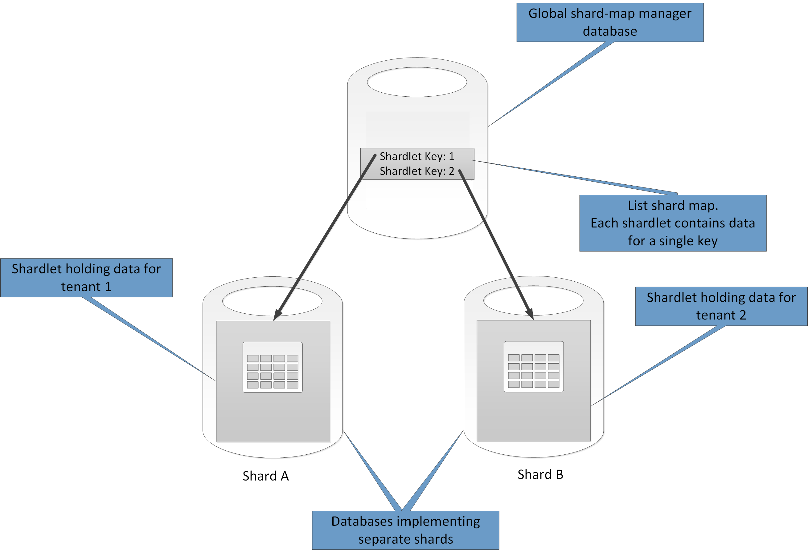
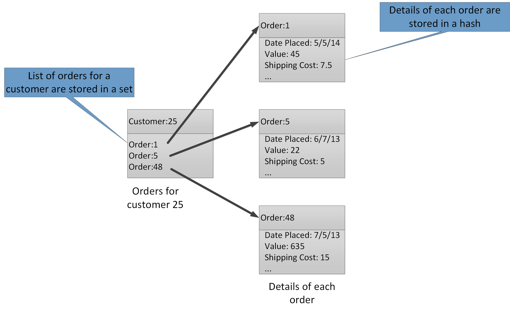

<properties
   pageTitle="Dados partição orientações | Microsoft Azure"
   description="Orientação para como separar partições para ser gerenciado e acessado separadamente."
   services=""
   documentationCenter="na"
   authors="dragon119"
   manager="christb"
   editor=""
   tags=""/>

<tags
   ms.service="best-practice"
   ms.devlang="na"
   ms.topic="article"
   ms.tgt_pltfrm="na"
   ms.workload="na"
   ms.date="07/14/2016"
   ms.author="masashin"/>

# Orientação de partição de dados

[AZURE.INCLUDE [pnp-header](../includes/guidance-pnp-header-include.md)]

## Visão geral

Em muitas soluções de grande escala, os dados são divididos em partições separadas que podem ser gerenciadas e acessadas separadamente. A estratégia de partição deve ser escolhida cuidadosamente para maximizar os benefícios minimizando efeitos negativos. Partição pode ajudar a melhorar a escalabilidade, reduzir disputa e otimizar o desempenho. Outro benefício de partição é que ele pode fornecer um mecanismo para dividir dados pelo padrão de uso. Por exemplo, você pode arquivar dados (frio) antigos e menos ativos mais barato armazenamento de dados.

## Por que partição dados?

A maioria dos serviços e aplicativos de nuvem armazenam e recuperar dados como parte de suas operações. O design dos armazenamentos de dados que usa um aplicativo pode ter uma influência significativa no desempenho, produtividade e escalabilidade de um sistema. Uma técnica que normalmente é aplicada em sistemas de grande porte é dividir os dados em partições separadas.

> O termo _partição_ usada neste guia refere-se ao processo de física dividindo dados em armazenamentos de dados separado. Isso não é a mesma que partição de tabela do SQL Server, que é um conceito diferente.

Partição de dados pode oferecer uma série de benefícios. Por exemplo, ele pode ser aplicado para:

- **Escalabilidade de melhorar**. Quando você dimensionar um sistema de banco de dados único, eventualmente alcançar um limite de hardware físico. Se você dividir dados em várias partições, cada uma delas estiver hospedada em um servidor separado, você pode dimensionar o sistema quase indefinidamente.
- **Melhorar o desempenho**. Operações de acesso de dados em cada partição assumir menor volume de dados local. Desde que os dados são particionados de forma adequada, partição pode tornar seu sistema mais eficiente. As operações que afetam mais de uma partição podem ser executados em paralelo. Cada partição pode ser localizada perto o aplicativo que usa para minimizar a latência de rede.
- **Disponibilidade de melhorar**. Separando dados em vários servidores evita um ponto único de falha. Se um servidor falhar, ou está na manutenção planejada, somente os dados nessa partição não está disponível. Operações em outras partições podem continuar. Aumentar o número de partições reduz o impacto relativo de uma falha de servidor único, reduzindo a porcentagem de dados que ficarão indisponíveis. Replicar cada partição pode reduzir ainda mais a chance de uma falha de partição única afetar as operações. Ele também possibilita separar dados críticos que devem ser continuamente e altamente disponíveis nos dados de valor baixo que tem requisitos de disponibilidade inferiores (arquivos de log, por exemplo).
- **Aumentar a segurança**. Dependendo da natureza dos dados e como ele é particionado, talvez seja possível separar dados confidenciais e não confidenciais em diferentes partições e, portanto, em diferentes servidores ou dados armazena. Segurança, em seguida, pode ser otimizada especificamente para os dados confidenciais.
- **Fornecer a flexibilidade operacional**. Partição oferece várias oportunidades para ajuste operações, maximizar a eficiência administrativa e minimizar os custos. Por exemplo, você pode definir diferentes estratégias para gerenciamento, monitoramento, backup e restauração e outras tarefas administrativas com base na importância dos dados em cada partição.
- **O armazenamento de dados no padrão de uso de correspondência**. Partição permite que cada partição ser implantado em um tipo diferente de armazenamento de dados, com base no custo e os recursos internos que dados armazenam ofertas. Por exemplo, dados binários grandes podem ser armazenados em um armazenamento de dados blob, enquanto mais dados estruturados podem ser mantidos em um banco de dados do documento. Para obter mais informações, consulte [criar uma solução polyglot] no guia padrões e práticas e [acesso a dados para soluções altamente escaláveis: usando SQL, NoSQL e persistência polyglot] no site da Microsoft.

Alguns sistemas não implemente partição porque ele é considerado um custo em vez de uma vantagem. Motivos comuns para esse raciocínio incluem:

- Muitos sistemas de armazenamento de dados não oferece suporte a junções em partições e pode ser difícil manter a integridade referencial em um sistema particionado. Frequentemente, é necessário implementar junções e verificações de integridade no código de aplicativo (na camada partição), que pode resultar em e/s adicional e a complexidade do aplicativo.
- Manutenção de partições nem sempre é uma tarefa simples. Em um sistema onde os dados são voláteis, talvez seja necessário rebalancear partições periodicamente para reduzir disputa e pontos.
- Algumas ferramentas comuns não funcionam naturalmente com dados particionados.

## Criação de partições

Dados podem ser particionados de maneiras diferentes: horizontalmente, verticalmente ou funcionalidade. A estratégia escolhida depende do motivo para separar os dados e os requisitos dos aplicativos e serviços que utilizarão os dados.

> [AZURE.NOTE] Os esquemas de partição descritos neste guia são explicados de uma maneira independente da tecnologia de armazenamento de dados subjacente. Elas podem ser aplicadas a vários tipos de fontes de dados, inclusive relacionais e bancos de dados NoSQL.

### Estratégias de partição

As três estratégias típicas para a partição de dados são:

- **Partição horizontal** (muitas vezes chamado de _fragmentação_). Nessa estratégia, cada partição é um armazenamento de dados no seu próprio direito, mas todas as partições têm o mesmo esquema. Cada partição é conhecida como um _Fragmentar_ e mantém um subconjunto específico de dados, como todos os pedidos para um conjunto específico de clientes em um aplicativo de comércio.
- **Partição vertical**. Nessa estratégia, cada partição contém um subconjunto dos campos de itens no repositório de dados. Os campos são divididos de acordo com o seu padrão de uso. Por exemplo, acessados campos podem ser colocados em uma partição vertical e menos campos acessados em outro.
- **Partição funcional**. Nessa estratégia, os dados são agregados acordo com como ele é usado por cada contexto limitado no sistema. Por exemplo, um sistema de comércio eletrônico que implementa separar funções de negócios para faturamento e gerenciar inventário de produto pode armazenar dados de fatura em uma partição e produto estoque dados em outra.

É importante observar que os três estratégias descritas aqui podem ser combinadas. Eles não são mutuamente exclusivos e recomendamos que você considere todas elas quando você cria um esquema de partição. Por exemplo, você pode dividir dados em fragmentos e depois use partição vertical para subdividir mais os dados em cada fragmentar. Da mesma forma, os dados em uma partição funcional podem ser divididos em fragmentos (que podem também ser verticalmente particionados).

No entanto, os requisitos diferentes de cada estratégia podem elevar um número de problemas em conflito. Você deve avaliar e saldo todas essas ao criar um esquema de partição que atenda os destinos de desempenho geral de processamento de dados para o seu sistema. As seções a seguir exploram cada uma das estratégias mais detalhadamente.

### Horizontal partição (fragmentação)

Figura 1 mostra uma visão geral de partição horizontal ou fragmentação. Neste exemplo, os dados de inventário de produto são divididos em fragmentos com base na chave do produto. Cada fragmentar mantém os dados para um intervalo contíguo de chaves fragmentar (A G e H-Z), organizados em ordem alfabética.

_Figura 1. Partição horizontalmente dados (fragmentação) com base em uma chave de partição_

Fragmentação ajuda você a distribuir a carga em mais computadores, que reduz disputa e melhora o desempenho. Você pode dimensionar o sistema de check-out, adicionando ainda mais fragmentos executados em servidores adicionais.

O fator mais importante ao implementar essa estratégia partição é a opção de chave de fragmentação. Pode ser difícil alterar a chave após o sistema em operação. A tecla deve garantir que os dados são particionados para que a carga de trabalho como ainda seja possível entre os fragmentos.

Observe que diferentes fragmentos não precisa conter semelhantes volumes de dados. Em vez disso, a consideração mais importante é equilíbrio entre o número de solicitações. Alguns fragmentos podem ser muito grandes, mas cada item é o assunto de um número baixo de operações de acesso. Outros fragmentos podem ser menores, mas cada item é acessado muito mais frequência. Também é importante garantir que um único fragmentar não excede os limites de escala (em termos de capacidade e os recursos de processamento) do armazenamento de dados que está sendo usado para hospedar esse fragmentar.

Se você usar um esquema de fragmentação, evitar a criação de pontos de acesso (ou partições quente) que podem afetar o desempenho e a disponibilidade. Por exemplo, se você usar um hash de um identificador de cliente em vez da primeira letra do nome de um cliente, você impedir a distribuição equilibrada que resulta da letras iniciais comuns e menos comuns. Essa é uma técnica típica que ajuda a distribuir dados mais uniforme entre partições.

Escolha uma chave de fragmentação que minimiza necessidades futuras dividir grandes fragmentos em partes menores, pequenos fragmentos de união em partições maiores ou alterar o esquema que descreve os dados armazenados em um conjunto de partições. Essas operações podem ser muito demoradas e podem exigir levando um ou mais fragmentos offline enquanto eles são executados.

Se fragmentos são replicados, talvez seja possível manter algumas das réplicas online enquanto outras pessoas estão dividir, mescladas ou reconfigurar. No entanto, o sistema talvez precise limitar as operações que podem ser realizadas nos dados esses fragmentos enquanto a reconfiguração está ocorrendo. Por exemplo, os dados a duplicações podem ser marcados como somente leitura para limitar o escopo de inconsistences que podem ocorrer enquanto estão sendo reestruturar fragmentos.

> Para obter informações mais detalhadas e orientações sobre muitas dessas considerações e técnicas de prática ideal para projetar armazenamentos de dados que implementar partição horizontal, consulte [padrão de fragmentação].

### Partição vertical

O uso mais comum para partição vertical é reduzir a e/s e custos de desempenho associados buscar os itens que são acessados com mais frequência. Figura 2 mostra um exemplo de partição vertical. Neste exemplo, propriedades diferentes para cada item de dados são mantidas em partições diferentes. Uma partição contém dados que são acessados com mais frequência, incluindo o nome, descrição e informações de preço para produtos. Outro detém o volume no papel e a última data ordenada.

_Figura 2. Dados verticalmente partição por seu padrão de uso_

Neste exemplo, o aplicativo regularmente consulta o nome do produto, descrição e preço ao exibir os detalhes do produto aos clientes. O nível de estoque e a data quando o produto foi última solicitado do fabricante são apresentadas em uma partição separada, porque esses dois itens são comumente usados juntos.

Esse esquema de partição tem a vantagem adicional que os dados relativamente lento-movendo (nome do produto, descrição e preço) são separados dos dados mais dinâmicos (nível de estoque e última data ordenada). Um aplicativo pode achar útil em cache os dados movendo lenta na memória, se ele for acessado com frequência.

Outro cenário típico para essa estratégia partição é maximizar a segurança de dados confidenciais. Por exemplo, você pode fazer isso armazenando números de cartão de crédito e os números de verificação de segurança de cartão correspondente em partições separadas.

Partição vertical também pode reduzir a quantidade de acesso simultâneo necessários para os dados.

> Partição vertical opera no nível de entidade em um armazenamento de dados, parcialmente normalizando uma entidade para dividi-la de um item de _ampla_ para um conjunto de itens _restringir_ . Ele é ideal para armazenamentos de dados orientada por colunas como HBase e Cassandra. Se não forem provavelmente não alterar os dados em uma coleção de colunas, você também pode considerar usando lojas de coluna no SQL Server.

### Partição funcional

Para sistemas de onde é possível identificar um contexto limitado para cada área comercial distintas ou serviço no aplicativo, partição funcional fornece uma técnica para melhorar o desempenho de acesso de dados e isolamento. Outro uso comum da partição funcional é separar os dados de leitura e gravação de dados de somente leitura que são usados para fins de relatório. Figura 3 mostra uma visão geral de partição funcional onde os dados de inventário são separados de dados do cliente.

_Figura 3. Funcionalidade partição dados por contexto limitado ou subdomínio_

Essa estratégia partição pode ajudar a reduzir disputa de acesso de dados em diferentes partes de um sistema.

## Criação de partições para escalabilidade

É fundamental considerar o tamanho e a carga de trabalho para cada partição e saldo-las para que os dados são distribuídos para atingir escalabilidade máxima. No entanto, você também deve partição os dados, para que ela não excede os limites de dimensionamento de uma loja de partição única.

Ao criar partições para escalabilidade, siga estas etapas:

1. Analisar o aplicativo para entender os padrões de acesso de dados, como o tamanho do conjunto de resultados retornado por cada consulta, a frequência de acesso, a latência inerente e o servidor calcular requisitos de processamento. Em muitos casos, algumas entidades principais solicitará maioria dos recursos de processamento.
2. Use essa análise para determinar os destinos de escalabilidade atuais e futuras, como o tamanho dos dados e a carga de trabalho. Em seguida, distribua os dados entre as partições para cumprir o destino de escalabilidade. A estratégia de partição horizontal, escolhendo a tecla fragmentar apropriado é importante para garantir que a distribuição é mesmo. Para obter mais informações, consulte o [padrão de fragmentação].
3. Certifique-se de que os recursos disponíveis para cada partição são suficientes para lidar com os requisitos de escalabilidade em termos de tamanho de dados e a produtividade. Por exemplo, o nó que estiver hospedando uma partição pode impor um limite rígido na quantidade de espaço de armazenamento, processamento de energia ou largura de banda de rede que ele oferece. Se os requisitos de processamento e armazenamento de dados serão provavelmente exceder esses limites, talvez seja necessário refinar sua estratégia de partição ou dividir dados ainda mais. Por exemplo, uma abordagem de escalabilidade pode ser separar os dados de log dos recursos principais do aplicativo. Você pode fazer isso usando armazenamentos de dados separado para impedir que os requisitos de armazenamento de dados total exceda o limite de dimensionamento do nó. Se o número total de armazenamento de dados exceder o limite de nó, talvez seja necessário usar nós de armazenamento separado.
4. Monitore o sistema em usar para verificar se os dados são distribuídos conforme o esperado e que as partições podem manipular a carga de imposto sobre eles. É possível que o uso não coincidir com o uso previsto pela análise. Nesse caso, talvez seja possível rebalancear as partições. Caso de falha, talvez seja necessário recriar algumas partes do sistema para obter o saldo necessário.

Observe que alguns ambientes de nuvem alocar recursos em termos de limites de infraestrutura. Certifique-se de que os limites do seu limite selecionado fornecem espaço suficiente para qualquer crescimento antecipado do volume de dados, em termos de armazenamento de dados, capacidade de processamento e largura de banda.

Por exemplo, se você usa o armazenamento de tabela do Microsoft Azure, um fragmentar ocupado pode exigir mais recursos que estão disponíveis para uma única partição para lidar com solicitações. (Há um limite para o volume de solicitações que pode ser tratado por uma única partição em um determinado período de tempo. Consulte a página [destinos de desempenho e escalabilidade de armazenamento do Azure] no site da Microsoft para obter mais detalhes.)

 Se esse for o caso, talvez seja necessário a fragmentar ser reparticionado para distribuir a carga. Se o tamanho total ou produtividade dessas tabelas excede a capacidade de uma conta de armazenamento, talvez seja necessário criar contas de armazenamento adicional e distribuídos as tabelas nessas contas. Se o número de contas de armazenamento exceder o número de contas que estão disponíveis para uma assinatura, em seguida, talvez seja necessário usar várias assinaturas.

## Criação de partições para desempenho de consulta

Muitas vezes pode ser aumentou o desempenho da consulta usando conjuntos de dados menores e executando consultas em paralelo. Cada partição deve conter uma pequena proporção de todo o conjunto de dados. Essa redução no volume pode melhorar o desempenho das consultas. No entanto, partição não é uma alternativa para criar e configurar um banco de dados adequadamente. Por exemplo, certifique-se de que você tenha os índices necessários no lugar, se você estiver usando um banco de dados relacional.

Ao criar partições para desempenho de consulta, siga estas etapas:

1. Examine os requisitos do aplicativo e o desempenho:
    - Use os requisitos de negócios para determinar as consultas críticas que sempre devem executar rapidamente.
    - Monitore o sistema para identificar todas as consultas que executam lentamente.
    - Estabelece quais consultas são realizadas com mais frequência. Uma única instância de cada consulta pode ter um custo mínimo, mas o consumo acumulado de recursos pode ser significativo. Talvez seja útil separar os dados que são recuperados por essas consultas em uma partição distinta ou até mesmo um cache.
2. Partição os dados que está causando o desempenho lento:
    - Limite o tamanho de cada partição para que o tempo de resposta de consulta está dentro de destino.
    - Projetar a tecla fragmentar para que o aplicativo pode localizar facilmente a partição se você estiver implementando partição horizontal. Isso impede que a consulta está tendo que examinar cada partição.
    - Considere a localização de uma partição. Se possível, tente manter dados em partições geograficamente Fechar para os aplicativos e os usuários que acessá-lo.
3. Se uma entidade tem requisitos de desempenho de produtividade e consulta, use partição funcional com base na entidade. Se isso ainda não atender aos requisitos, aplique também partição horizontal. Na maioria dos casos uma estratégia de partição única será suficiente, mas em alguns casos é mais eficiente para combinar as duas estratégias.
4. Considere usar consultas assíncronas que executam em paralelo em partições para melhorar o desempenho.

## Criação de partições para disponibilidade

Partição de dados pode melhorar a disponibilidade de aplicativos, garantindo que o conjunto de dados inteiro não constitui um único ponto de falha e subconjuntos individuais do conjunto de dados podem ser gerenciados independentemente. Replicação de partições que contêm dados críticos também pode melhorar a disponibilidade.

Ao criar e implementar partições, considere os seguintes fatores que afetam a disponibilidade:

- **Os dados como críticas são operações de negócios**. Alguns dados podem conter informações de negócios essenciais como detalhes da fatura ou transações bancárias. Outros dados podem conter dados operacionais menos essenciais, como arquivos de log, rastreamentos de desempenho e assim por diante. Depois de identificar cada tipo de dados, considere:
    - Armazenar dados críticos em partições altamente disponível com um plano de backup apropriado.
    - Estabelecer gerenciamento separada e monitoramento mecanismos ou procedimentos para os criticalities diferentes de cada conjunto de dados. Colocar dados que tem o mesmo nível de importância na mesma partição, para que ele possa ser feito backup juntos em uma frequência apropriada. Por exemplo, partições que armazenam dados para transações bancárias talvez seja necessário fazer backup mais de partições que armazenam log ou informações de rastreamento.
- **Como partições individuais podem ser gerenciadas**. Criação de partições para dar suporte a manutenção e gerenciamento independente oferece várias vantagens. Por exemplo:
    - Se uma partição falhar, ela pode ser recuperada independentemente sem afetar as instâncias de aplicativos que acessam dados em outras partições.
    - Partição dados pela área geográfica permite que as tarefas de manutenção agendada ocorrer em horários para cada local. Certifique-se de que as partições não são muito grandes para impedir que qualquer manutenção planejada sendo concluída durante esse período.
- **Se deseja duplicar dados críticos em partições**. Essa estratégia pode melhorar disponibilidade e desempenho, embora ele também pode introduzir problemas de consistência. Demora para alterações feitas nos dados em uma partição a ser sincronizado com cada réplica. Durante esse período, partições diferentes irá conter valores de dados diferentes.

## Noções básicas sobre como partição afeta o design e desenvolvimento

Usar partição adiciona complexidade ao design e desenvolvimento do seu sistema. Considere a possibilidade de partição como uma parte fundamental da mesmo se de design de sistema do sistema inicialmente contém apenas uma única partição. Se você enfrentar partição em segundo plano, quando o sistema inicia sofrer problemas de desempenho e escalabilidade, a complexidade aumenta porque você já tem um sistema live para manter.

Se você atualizar o sistema para incorporar partição nesse ambiente, ele necessita modificando a lógica de acesso de dados. Ele também pode envolver migrando grandes quantidades de dados existentes para distribuí-lo pelas partições, muitas vezes enquanto os usuários esperam que possam continuar a usar o sistema.

Em alguns casos, partição não é considerada importante porque o conjunto de dados inicial é pequeno e pode ser facilmente tratado por um único servidor. Isso pode ser verdadeiro em um sistema que não é esperado dimensionar além do seu tamanho inicial, mas muitos sistemas comerciais precisam expandir como o número de usuários aumenta. Essa expansão normalmente é acompanhado por um crescimento do volume de dados.

Também é importante entender que partição nem sempre é uma função de armazenamentos de dados grande. Por exemplo, um armazenamento de dados pequeno pode ser muito acessado por centenas de clientes simultâneos. Partição os dados nessa situação pode ajudar a reduzir disputa e melhorar a produtividade.

Quando você cria um esquema de partição de dados, considere os seguintes pontos:

- **Sempre que possível, manter dados das operações de banco de dados mais comuns juntos em cada partição para minimizar o operações de acesso de dados entre-partição**. Consultando partições pode ser mais demorado que consultando apenas dentro de uma única partição, mas otimizar partições para um conjunto de consultas pode afetar outros conjuntos de consultas. Quando você não pode evitar consultando partições, minimize o tempo de consulta executando consultas em paralelo e agregar os resultados dentro do aplicativo. Essa abordagem talvez não seja possível em alguns casos, como quando é necessário obter um resultado de uma consulta e usá-lo na próxima consulta.
- **Se as consultas tornar o uso de dados de referência relativamente estática, como tabelas de código postal ou listas de produto, considere replicar esses dados em todas as partições para reduzir a necessidade de operações de pesquisa separados em partições diferentes**. Essa abordagem também pode reduzir a probabilidade dos dados de referência se tornar um dataset "quente" que está sujeito tráfego de pesado em todo o sistema. No entanto, há um custo adicional associado ao sincronizar as alterações que podem ocorrer com esses dados de referência.
- **Sempre que possível, minimizar requisitos para a integridade referencial em partições verticais e funcionais**. Nesses esquemas, o próprio aplicativo é responsável por manter a integridade referencial entre partições quando os dados são atualizados e consumidos. Consultas que devem participar de dados em várias partições executado mais lentamente que consultas que ingressar dados apenas dentro da mesma partição porque o aplicativo geralmente precisa executar consultas consecutivas com base em uma chave e, em seguida, em uma chave estrangeira. Em vez disso, considere duplicar ou eliminação normalizando os dados relevantes. Para minimizar o tempo de consulta onde associações de cruz partição são necessárias, executar consultas em paralelo sobre as partições e associar os dados dentro do aplicativo.
- **Considere o efeito que o esquema de partição pode ter na consistência de dados em partições.** Avalie se consistência forte é realmente um requisito. Em vez disso, uma abordagem comum na nuvem é implementar consistência eventual. Os dados em cada partição são atualizados separadamente e a lógica do aplicativo garante que as atualizações são todos concluídas com êxito. Também trata as inconsistências que podem surgir de consultando dados enquanto uma operação eventualmente consistente está em execução. Para obter mais informações sobre como implementar consistência eventual, consulte a [Introdução de consistência de dados].
- **Considere como consultas localizam a partição correta**. Se uma consulta deve examinar todas as partições para localizar os dados necessários, há um impacto significativo no desempenho, mesmo quando estiver executando o várias consultas em paralelo. Consultas que são usadas com estratégias de partição verticais e funcionais naturalmente podem especificar as partições. No entanto, o particionamento horizontal (fragmentação) pode fazer localização um item difícil porque cada fragmentar tem o mesmo esquema. Uma solução típica para fragmentação é mantêm um mapa que pode ser usado para procurar o local de fragmentar para itens específicos de dados. Este mapa pode ser implementado a lógica de fragmentação do aplicativo ou mantido pelo armazenamento de dados se ele dá suporte a fragmentação transparente.
- **Ao usar uma estratégia de partição horizontal, considere a possibilidade de redistribuição periodicamente os fragmentos**. Isso ajuda a distribuir os dados uniformemente por tamanho e por carga de trabalho para minimizar pontos de acesso, maximizar o desempenho da consulta e contornar limitações de armazenamento físico. Entretanto, isso é uma tarefa complexa que geralmente requer o uso de uma ferramenta personalizada ou um processo.
- **Se você replica cada partição, ele oferece proteção adicional contra falha**. Se uma única réplica falhar, as consultas podem ser dirigidas a uma cópia de trabalho.
- **Se você atingir os limites físicos de uma estratégia de partição, talvez seja necessário estender a escalabilidade para um nível diferente**. Por exemplo, se for partição no nível do banco de dados, talvez seja necessário localizar ou replicar partições em vários bancos de dados. Se partição já está no nível do banco de dados e limitações físicas são um problema, ele pode significa que você precisa localizar ou replicar partições em várias contas de hospedagem.
- **Evitar transações que acessam dados em várias partições**. Alguns dados armazena implementar transações consistência e a integridade para operações que modificar dados, mas somente quando os dados estão localizados em uma única partição. Se precisar de suporte transações em várias partições, você provavelmente precisará implementar isso como parte da lógica do aplicativo porque mais partição sistemas não fornecem suporte nativo.

Todos os armazenamentos de dados requerem alguns gerenciamento operacional e monitorar a atividade. As tarefas podem variar de carregamento de dados, fazendo backup e restaurando dados, reorganizar dados e garantir que o sistema está executando corretamente e eficiente.

Considere os seguintes fatores que afetam o gerenciamento operacional:

- **Como implementar gerenciamento apropriado e tarefas operacionais quando os dados são particionados**. Essas tarefas podem incluir backup e restauração, arquivamento de dados, monitoramento do sistema e outras tarefas administrativas. Por exemplo, manter consistência lógica durante as operações de backup e restauração pode ser um desafio.
- **Como carregar os dados em várias partições e adicionar novos dados que estão chegando de outras fontes**. Algumas ferramentas e utilitários podem não suportar operações de dados sharded como carregar dados para a partição correta. Isso significa que talvez você precise criar ou obter utilitários e novas ferramentas.
- **Como arquivar e excluir os dados regularmente**. Para impedir que o crescimento excessivo de partições, você precisa arquivar e excluir dados regularmente (talvez mensalmente). Talvez seja necessário transformar os dados para coincidir com um esquema de arquivamento diferente.
- **Como localizar problemas de integridade de dados**. Considere a possibilidade de executando um processo periódico para localizar qualquer problema de integridade de dados como dados em uma partição que referencia informações ausentes em outro. O processo pode tentar corrigir esses problemas automaticamente ou elevar um alerta para um operador para corrigir os problemas manualmente. Por exemplo, em um aplicativo de comércio, informações de ordem poderão ser mantidas em uma partição, mas os itens de linha que constituem cada pedido poderá ser mantidos em outro. O processo de colocar um pedido precisa adicionar dados a outras partições. Se esse processo falhar, lá podem estar itens de linha armazenados para o qual há uma ordem correspondente.

Tecnologias de armazenamento de dados diferentes normalmente fornecem seus próprios recursos para oferecer suporte a partição. As seções a seguir resumem as opções que são implementadas por armazenamentos de dados usados por aplicativos do Azure. Eles também descrevem considerações para projetar aplicativos que podem melhor aproveitar esses recursos.

## Estratégias partição para banco de dados do SQL Azure

Banco de dados do SQL Azure é um relacional banco de dados-como um serviço que é executado na nuvem. Ele se baseia no Microsoft SQL Server. Um banco de dados relacional divide informações em tabelas e cada tabela contém informações sobre entidades como uma série de linhas. Cada linha contém colunas que contêm os dados para os campos individuais de uma entidade. A página [o que é o banco de dados do SQL Azure?] no Microsoft site fornece documentação detalhada sobre como criar e utilizar bancos de dados do SQL.

## Partição horizontal com elástica banco de dados

Um único banco de dados do SQL tem um limite para o volume de dados que ele pode conter. Produtividade é restringida por fatores arquitetônicos e o número de conexões simultâneas que ele oferece suporte. O recurso de banco de dados elástica do banco de dados SQL oferece suporte ao dimensionamento horizontal para um banco de dados do SQL. Usando o banco de dados elástica, você pode partição seus dados em fragmentos que são distribuídos entre vários bancos de dados do SQL. Você também pode adicionar ou remover fragmentos conforme o volume de dados que você precisa para lidar com cresce e reduzido. Usar o banco de dados elástica também pode ajudar a reduzir disputa distribuindo a carga entre bancos de dados.

> [AZURE.NOTE] Elástico banco de dados é uma substituição para o recurso de agrupamentos do Azure SQL Database. Federação de banco de dados do SQL instalações podem ser migradas para elástica banco de dados usando o utilitário de migração de agrupamentos de existentes. Como alternativa, você pode implementar seu próprio mecanismo de fragmentação se seu cenário não emprestar próprio naturalmente aos recursos que são fornecidos pelo elástica banco de dados.

Cada fragmentar é implementado como um banco de dados do SQL. Um fragmentar pode conter mais de um conjunto de dados (referido como um _shardlet_). Cada banco de dados mantém metadados que descrevem a shardlets que ela contém. Um shardlet pode ser um único item de dados, ou pode ser um grupo de itens que compartilham a mesma chave shardlet. Por exemplo, se estiver fragmentação dados em um aplicativo de vários locatários, a chave de shardlet pode ser a identificação de locatário e todos os dados para um determinado locatário podem ser mantidos como parte do shardlet mesmo. Dados para outros locatários seriam mantidos no shardlets diferentes.

É responsabilidade do programador para associar um conjunto de dados com uma chave de shardlet. Um banco de dados SQL separado atua como gerente de mapa fragmentar global. Este banco de dados contém uma lista de todos os fragmentos e shardlets no sistema. Um aplicativo cliente que acessa dados primeiro se conecta ao fragmentar global mapa manager banco de dados para obter uma cópia do mapa fragmentar (listando fragmentos e shardlets), que ele armazena em cache localmente.

O aplicativo usa essas informações para rotear solicitações de dados para o fragmentar apropriado. Esta funcionalidade está oculta atrás de uma série de APIs que estão contidos no Azure SQL banco de dados elástica banco de dados biblioteca do cliente, que está disponível como um pacote do NuGet. A página [Visão geral dos recursos de banco de dados elástica] no site da Microsoft fornece uma introdução mais abrangente elástica banco de dados.

> [AZURE.NOTE] Você pode replicar o banco de dados do Gerenciador de mapa fragmentar global para reduzir a latência e melhorar a disponibilidade. Se você implementar o banco de dados usando uma das camadas preços Premium, você pode configurar replicação geográfica ativa para continuamente copiar dados para bancos de dados em diferentes regiões. Crie uma cópia do banco de dados em cada região em que os usuários estejam baseados. Em seguida, configure seu aplicativo para se conectar a essa cópia para obter o mapa de fragmentar.

> Uma abordagem alternativa é usar a sincronização de dados do SQL Azure ou um pipeline de fábrica de dados do Azure para replicar o banco de dados do Gerenciador de mapa fragmentar em regiões. Essa forma de replicação é executado periodicamente e é mais adequada se o mapa de fragmentar alterados com frequência. Além disso, o banco de dados do Gerenciador de mapa fragmentar não precisa ser criado usando um Premium preços camada.

Banco de dados Elástico fornece dois esquemas de mapeamento de dados para shardlets e armazená-los em fragmentos:

- Um **mapa de fragmentar lista** descreve uma associação entre uma única chave e um shardlet. Por exemplo, em um sistema de vários locatários, os dados para cada locatário podem ser associados com uma chave exclusiva e armazenados em seu próprio shardlet. Para garantir a privacidade e isolamento (ou seja, para impedir que um locatário esgotamento dos recursos de armazenamento de dados disponíveis para outras pessoas), cada shardlet pode ser mantida dentro de sua própria fragmentar.

_Figura 4. Usando um mapa de fragmentar lista para armazenar dados de locatário em fragmentos separados_

- Um **mapa de fragmentar intervalo** descreve uma associação entre um conjunto de valores-chave contíguos e um shardlet. No exemplo vários locatários descrito anteriormente, como uma alternativa para implementar shardlets dedicada, você pode agrupar os dados para um conjunto de locatários (cada um com sua própria chave) dentro do mesmo shardlet. Este esquema é mais barata do que o primeiro (porque locatários compartilham recursos de armazenamento de dados), mas ele também cria um risco de privacidade dos dados reduzida e isolamento.

_Figura 5. Usando um mapa de fragmentar intervalo para armazenar dados para um intervalo de locatários em um fragmentar_

Observe que um único fragmentar pode conter os dados de várias shardlets. Por exemplo, você pode usar a lista shardlets para armazenar dados para diferentes não-contíguas locatários no fragmentar mesmo. Você também pode misturar shardlets de intervalo e shardlets de lista no fragmentar mesmo, embora eles serão abordados por meio de mapas diferentes do banco de dados do Gerenciador de mapa fragmentar global. (O banco de dados do Gerenciador de mapa fragmentar global pode conter vários mapas de fragmentar). Figura 6 ilustra essa abordagem.

_Figura 6. Implementar fragmentar vários mapas_

O esquema de partição que você implementar pode ter uma influência significativa no desempenho do seu sistema. Ele também pode afetar a taxa na qual fragmentos precisam ser adicionado ou removido ou a taxa em que os dados devem ser reparticionados em fragmentos. Considere os seguintes pontos quando você usa o banco de dados elástica para dados de partição:

- Agrupar dados que são usados em conjunto na mesma fragmentar e evitar operações de que precisa para acessar os dados que são mantidos em vários fragmentos. Tenha em mente que com o banco de dados elástica, um fragmentar é um banco de dados do SQL no seu próprio direito e Azure SQL Database não suporta junções entre bancos de dados (que precisam ser executada no lado do cliente). Lembre-se também de que no banco de dados do SQL Azure, restrições de integridade referencial, disparadores e procedimentos armazenados em um banco de dados não podem referenciar objetos em outro. Portanto, não crie um sistema que tenha dependências entre fragmentos. Um banco de dados do SQL no entanto, pode conter tabelas que contêm cópias de dados de referência usados por consultas e outras operações. Estas tabelas não tem pertençam a qualquer shardlet específico. Replicação de dados em fragmentos pode ajudar a remover a necessidade de dados de junção que abrange bancos de dados. Ideal seria esses dados devem ser estático ou lento-movendo para minimizar o esforço de replicação e reduzir as chances de se tornar obsoletos.

    > [AZURE.NOTE] Embora o banco de dados SQL não oferece suporte a junções entre bancos de dados, você pode executar consultas de cruz fragmentar com a API elástica do banco de dados. Essas consultas transparente podem percorrer os dados contidos em todos os shardlets que são referenciadas por um mapa fragmentar. A API de banco de dados elástica quebras entre-fragmentar consultas para baixo em uma série de consultas individuais (uma para cada banco de dados) e, em seguida, mescla os resultados. Para obter mais informações, consulte a página [Fragmentar vários consultando] no site da Microsoft.

- Os dados armazenados em shardlets pertencentes ao mesmo mapa fragmentar devem ter o mesmo esquema. Por exemplo, não crie um mapa de fragmentar de lista que aponta para alguns shardlets que contém os dados de locatário e outros shardlets que contém informações de produto. Essa regra não é aplicada por elástica banco de dados, mas o gerenciamento de dados e consultar se torna muito complexo se cada shardlet tem um esquema diferente. No exemplo apenas citado, uma boa é a solução é criar dois mapas de fragmentar de lista: um que faz referência a dados de locatário e outro que aponta para informações de produto. Lembre-se de que os dados pertencentes ao shardlets diferentes podem ser armazenados na mesma fragmentar.

    > [AZURE.NOTE] A funcionalidade de consulta de cruz fragmentar da API do banco de dados elástica depende de cada shardlet no mapa fragmentar contendo o mesmo esquema.

- Operações de transações só há suporte para dados que são mantidos dentro do mesmo fragmentar e não entre fragmentos. Transações podem abranger shardlets desde que elas fazem parte da mesma fragmentar. Portanto, se sua lógica comercial precisa executar transações, ou armazenar os dados afetados na mesma fragmentar ou implementar consistência eventual. Para obter mais informações, consulte a [última palavra de consistência de dados].
- Coloque fragmentos Fechar para os usuários que acessam os dados nesses fragmentos (em outras palavras, localização geográfica-Localize os fragmentos). Essa estratégia ajuda a reduzir a latência.
- Evitar ter uma mistura de altamente ativo (pontos de acesso) e fragmentos relativamente inativos. Tente difundir a carga de maneira uniforme em fragmentos. Isso pode requerer hash as teclas shardlet.
- Se você estiver fragmentos de localização geográfica, certifique-se de que as teclas de hash mapeiam para shardlets contidos em fragmentos armazenados Fechar para os usuários que acessam os dados.
- Atualmente, apenas um conjunto limitado de dados do SQL tipos são suportados como chaves de shardlet; _int, bigint, varbinary_ e o _identificador exclusivo_. Os tipos de _int_ e _bigint_ SQL correspondem aos tipos de dados _int_ e _longo_ em c# e tem os mesmos intervalos. O tipo de _varbinary_ SQL pode ser tratado usando uma matriz de _bytes_ em c# e o tipo de _uniqueidentier_ SQL corresponde à classe _Guid_ no .NET Framework.

Como o nome indica, banco de dados elástica possibilita para um sistema adicionar e remover fragmentos conforme o volume de dados reduz e aumenta. As APIs na biblioteca de cliente do banco de dados de SQL Azure Database elástica habilitar um aplicativo criar e excluir fragmentos dinamicamente (e transparente atualize o Gerenciador de mapa de fragmentar). Entretanto, remover um fragmentar é uma operação destrutiva que também requer a exclusão de todos os dados que fragmentar.

Se um aplicativo precisa dividir um fragmentar em dois fragmentos separados ou combinar fragmentos, elástica banco de dados fornece um serviço de divisão direta separado. Este serviço é executado em um serviço hospedado na nuvem (que deve ser criado pelo desenvolvedor) e migra dados com segurança entre fragmentos. Para obter mais informações, consulte o tópico [escala usando a ferramenta de divisão direta elástica banco de dados] no site da Microsoft.

## Estratégias partição para armazenamento do Azure

Armazenamento do Azure fornece três abstrações de gerenciamento de dados:

- Armazenamento de tabela, que implementa armazenamento scalable estrutura. Uma tabela contém uma coleção de entidades, cada um dos quais pode incluir um conjunto de propriedades e valores.
- Armazenamento de blob, que fornece armazenamento de objetos grandes e arquivos.
- Filas de armazenamento, que oferece suporte a mensagens assíncronas confiável entre aplicativos.

Armazenamento de tabela e armazenamento de blob são lojas essencialmente chave-valor que são otimizadas para armazenar dados estruturados e não estruturados respectivamente. Filas de armazenamento fornecem um mecanismo para criar aplicativos flexíveis, escaláveis. Armazenamento de tabela, armazenamento de blob e filas de armazenamento são criadas dentro do contexto de uma conta de armazenamento do Azure. Três formas de redundância de suporte de contas de armazenamento:

- **Armazenamento localmente redundante**, que mantém três cópias de dados dentro de um único data center. Este formulário de redundância protege contra falhas de hardware, mas não contra um desastre que abrange data center inteiro.
- Armazenamento **zone-redundante**, que mantém três cópias de dados distribuídos em diferentes dos data centers dentro da região mesmo (ou em duas regiões geograficamente fechar). Este formulário de redundância pode proteger contra desastres que ocorrem em um único data center, mas não podem proteger contra rede grande escala desconecta que afetam toda a região. Observe que armazenamento redundante de zona somente no momento está disponível atualmente para blobs de bloco.
- **Armazenamento redundante de localização geográfica**, que mantém seis cópias de dados: três cópias em uma região (sua região local) e outra três em uma região remota. Esse formulário de redundância fornece o mais alto nível de proteção de desastres.

A Microsoft publicou destinos de escalabilidade de armazenamento do Azure. Para obter mais informações, consulte a página [destinos de desempenho e escalabilidade de armazenamento do Azure] no site da Microsoft. Atualmente, a capacidade de conta de armazenamento total não pode exceder 500 TB. (Isso inclui o tamanho dos dados que são mantidos no armazenamento de tabela e armazenamento de blob, bem como mensagens pendentes que são mantidas na fila do armazenamento).

A taxa de solicitação máxima (presumindo que uma entidade de 1 KB, blob ou tamanho da mensagem) é 20 KBps. Se seu sistema for provável exceda esses limites, considere a possibilidade de partição a carga em várias contas de armazenamento. Uma única assinatura Azure pode criar até 100 contas de armazenamento. Entretanto, observe que esses limites podem mudar ao longo do tempo.

## Armazenamento de tabela do Microsoft Azure partição

Armazenamento de tabela Azure é um armazenamento de chave-valor que destina-se ao redor de partição. Todas as entidades são armazenadas em uma partição e partições são gerenciadas internamente pelo armazenamento de tabela do Microsoft Azure. Cada entidade que está armazenada em uma tabela deve fornecer uma chave de duas partes que inclui:

- **A chave da partição**. Este é um valor de cadeia de caracteres que determina em qual partição o armazenamento de tabela Azure colocará a entidade. Todas as entidades com a mesma chave de partição serão armazenadas na mesma partição.
- **A chave de linha**. Este é outro valor de cadeia de caracteres que identifica a entidade dentro da partição. Todas as entidades dentro de uma partição são lexicalmente, classificadas em ordem crescente, por esta tecla. A combinação de teclas de chave/linha partição deve ser exclusiva para cada entidade e não pode exceder 1 KB de comprimento.

O restante dos dados para uma entidade consiste em campos definidos pelo aplicativo. Nenhum esquema específica é imposta e cada linha pode conter um conjunto diferente de campos definidos pelo aplicativo. A única limitação é o tamanho máximo de uma entidade (incluindo as teclas de partição e linha) atualmente 1 MB. O tamanho máximo de uma tabela é 200 TB, embora esses números podem mudar no futuro. (Consulte a página [destinos de desempenho e escalabilidade de armazenamento do Azure] no site da Microsoft para obter as informações mais recentes sobre esses limites.)

Se você estiver tentando armazenar entidades que ultrapassar esse capacidade, considere dividindo-os em várias tabelas. Use a partição vertical para dividir os campos nos grupos que provavelmente a serem acessados juntos.

Figura 7 mostra a estrutura lógica de uma conta de armazenamento de exemplo (dados de Contoso) para um aplicativo de comércio fictício. A conta de armazenamento contém três tabelas: Customer Info, informações de produto e informações de pedido. Cada tabela tem várias partições.

Na tabela Customer Info, os dados são particionados acordo com a cidade na qual o cliente está localizado e a chave de linha contém a ID de cliente. Na tabela de informações do produto, os produtos são particionados por categoria de produto e a chave de linha contém o número do produto. Na tabela de informações de pedido, os pedidos são particionados pela data em que eles foram colocados e a chave de linha especifica a hora que a ordem foi recebida. Observe que todos os dados são ordenados pela chave de linha em cada partição.

_Figura 7. As tabelas e partições em uma conta de armazenamento de exemplo_

> [AZURE.NOTE] Armazenamento de tabela Azure também adiciona um campo de carimbo de hora a cada entidade. O campo de carimbo de hora é mantido pelo armazenamento de tabela e é atualizado sempre que a entidade é modificada e gravada uma partição. O serviço de armazenamento de tabela usa esse campo para implementar concorrência otimista. (Sempre que um aplicativo grava uma entidade volta ao armazenamento de tabela, o serviço de armazenamento de tabela compara o valor do carimbo de hora na entidade que está sendo gravado com o valor que é mantido no armazenamento de tabela. Se os valores são diferentes, isso significa que outro aplicativo deve modificaram a entidade desde a última foi recuperá-la e a operação de gravação falhar. Não modifique este campo em seu próprio código e não especificar um valor para esse campo quando você cria uma nova entidade.

Armazenamento de tabela Azure usa a chave de partição para determinar como armazenar os dados. Se uma entidade é adicionada a uma tabela com uma chave de partição não utilizados anteriormente, o armazenamento de tabela do Microsoft Azure cria uma nova partição para esta entidade. Outras entidades com a mesma chave de partição serão armazenadas na mesma partição.

Esse mecanismo efetivamente implementa uma estratégia de dimensionamento automática. Cada partição é armazenada em um único servidor em um data center Azure para ajudar a garantir que consultas que recuperar dados de uma única partição executadas rapidamente. No entanto, partições diferentes podem ser distribuídas em vários servidores. Além disso, um único servidor pode hospedar várias partições se essas partições são limitadas em tamanho.

Considere os seguintes pontos ao criar suas entidades para armazenamento de tabela do Microsoft Azure:

- A seleção de valores-chave chave e linha partição deve ser controlado pelo empenho aliás no qual os dados são acessados. Escolha uma combinação de teclas de chave/linha de partição que ofereça suporte a maioria das suas consultas. As consultas mais eficientes recuperam dados, especificando a chave de partição e a linha. Consultas que especificam uma chave de partição e um intervalo de chaves de linha podem ser concluídas examinando uma única partição. Isso é relativamente rápido porque os dados são mantidos na ordem de chave de linha. Se consultas não especificar qual partição para digitalizar, a chave da partição pode exigir armazenamento de tabela do Microsoft Azure para examinar cada partição para seus dados.

    > [AZURE.TIP] Se uma entidade tem uma chave natural, usá-la como a chave da partição e especifique uma cadeia de caracteres vazia como a chave de linha. Se uma entidade tem uma chave composta que consiste em duas propriedades, selecione a propriedade slowest alterar como a chave da partição e o outro como a chave de linha. Se uma entidade tem mais de duas propriedades chaves, use uma concatenação das propriedades para fornecer as teclas partição e linha.

- Se você executar regularmente consultas que pesquisar dados usando campos diferentes as teclas partição e linha, considere a possibilidade de implementar o [padrão de índice de tabela].
- Se você gera chaves de partição usando um monotônico crescentes ou decrescentes sequência (como "0001", "0002", "0003" e assim por diante) e cada partição contém apenas uma quantidade limitada de dados, armazenamento de tabela Azure física pode agrupar essas partições juntos no mesmo servidor. Esse mecanismo pressupõe que o aplicativo é mais provável executar consultas em um intervalo contíguo de partições (consultas de intervalo) e é otimizado para esse caso. No entanto, essa abordagem pode levar a pontos de acesso com foco em um único servidor porque todas as inserções de novas entidades são provavelmente será concentrado em uma extremidade ou outra dos intervalos contíguos. Ele também pode reduzir escalabilidade. Para distribuir a carga mais uniforme entre servidores, considere a possibilidade de hash a chave da partição para tornar a sequência mais aleatória.
- Armazenamento de tabela Azure suporta operações transações para entidades que pertencem à mesma partição. Isso significa que um aplicativo pode executar várias inserir, atualizar, excluir, substituir ou operações de mesclagem como uma unidade atômica (desde que a transação não inclui mais de 100 entidades e a carga da solicitação não excede 4 MB). Operações que se estendem por várias partições não são transações e podem exigir que você implementar consistência eventual conforme descrito pela [última palavra de consistência de dados]. Para obter mais informações sobre o armazenamento de tabela e transações, acesse a página [transações de grupo de entidade realizando] no site da Microsoft.
- Dar atenção para o detalhamento da chave de partição pelos seguintes motivos:
    - Usando a mesma chave de partição para cada entidade faz com que o serviço de armazenamento de tabela criar uma única partição grande é mantida em um servidor. Isso impede de dimensionamento e se concentra a carga em um único servidor. Como resultado, essa abordagem só é adequada para sistemas de gerenciamento de um pequeno número de entidades. No entanto, essa abordagem garante que todas as entidades podem participar de transações de grupo de entidade.
    - Usando uma chave de partição exclusivo para cada entidade faz com que o serviço de armazenamento de tabela criar uma partição separada para cada entidade, possivelmente, resultando em um grande número de partições pequenas (dependendo do tamanho das entidades). Essa abordagem é mais escalável que usar uma chave de partição única, mas transações de grupo de entidade não são possíveis. Além disso, consultas que buscam mais de uma entidade podem envolver a leitura de mais de um servidor. No entanto, se o aplicativo executa consultas de intervalo, usando uma sequência monotônico para gerar as chaves de partição pode ajudar a otimizar essas consultas.
    - Compartilhando a chave da partição em um subconjunto de entidades possibilita agrupar entidades na mesma partição relacionadas. Operações que envolvem entidades relacionadas podem ser realizadas usando transações de grupo de entidade e consultas que buscam um conjunto de entidades relacionadas podem ser obedecidas acessando um único servidor.

Para obter informações adicionais sobre dados partição em armazenamento de tabela do Microsoft Azure, consulte o artigo [guia de design de tabela de armazenamento do Azure] no site da Microsoft.

## Armazenamento de blob do Microsoft Azure partição

Armazenamento de blob do Microsoft Azure possibilita manter objetos binários grandes – no momento até 200 GB de tamanho para blobs de bloco ou 1 TB para blobs de página. (Para obter as informações mais recentes, vá para a página de [destinos de desempenho e escalabilidade de armazenamento do Azure] no site da Microsoft.) Use bloco blobs em cenários como streaming onde você precisa para carregar ou baixar grandes volumes de dados rapidamente. Use blobs de página para aplicativos que exigem aleatórias em vez de acesso serial a partes dos dados.

Cada blob (bloco ou página) é mantido em um contêiner em uma conta de armazenamento do Azure. Você pode usar contêineres de agrupar bolhas relacionadas que tenham os mesmos requisitos de segurança, embora esse agrupamento é lógico em vez de física. Dentro de um contêiner, cada blob tem um nome exclusivo.

Armazenamento de blob é particionado automaticamente com base no nome do blob. Cada blob é mantido em sua própria partição. BLOBs no mesmo contêiner não compartilham uma partição. Essa arquitetura ajuda armazenamento de blob do Microsoft Azure equilibrando a carga entre servidores transparente porque blobs diferentes no mesmo contêiner podem ser distribuídas entre servidores diferentes.

As ações de escrever um único bloco (bloco blob) ou uma página (página blob) são atômicas, mas não operações que se estendem blocos, páginas ou blobs. Se você precisar garantir a consistência quando executar operações de gravação em blocos, páginas e blobs, retirar um bloqueio de gravação usando uma concessão blob.

Armazenamento de blob do Microsoft Azure suporta taxas de transferência de até 60 MB por segunda ou 500 solicitações por segundo para cada blob. Se você prevê ultrapassando esses limites e os dados de blob forem relativamente estáticos, considere replicar blobs usando a rede de distribuição de conteúdo do Azure. Para obter mais informações, consulte a página [usando conteúdo rede de distribuição para Azure] no site da Microsoft. Para diretrizes adicionais e considerações, consulte [usando conteúdo rede de distribuição para Azure].

## Partição filas de armazenamento do Azure

Filas de armazenamento do Azure permitem implementar mensagens assíncronas entre processos. Uma conta de armazenamento do Azure pode conter qualquer número de filas e cada fila pode conter qualquer número de mensagens. A única limitação é o espaço disponível na conta de armazenamento. O tamanho máximo de uma mensagem individual é 64 KB. Se você precisar mensagens maiores do que isso, em seguida, considere usar filas de barramento de serviço do Azure.

Cada fila de armazenamento tem um nome exclusivo dentro da conta de armazenamento que o contém. Azure partições filas com base no nome. Todas as mensagens para a mesma fila são armazenadas na mesma partição, que é controlada por um único servidor. Filas diferentes podem ser gerenciadas por servidores diferentes para ajudar a saldo a carga. A alocação de filas para servidores é transparente para aplicativos e usuários.

 Em um aplicativo em grande escala, não use a mesma fila de armazenamento para todas as instâncias do aplicativo porque essa abordagem pode fazer com que o servidor que hospeda a fila para se tornar um ponto de acesso. Em vez disso, use filas diferentes para diferentes áreas funcionais do aplicativo. Filas de armazenamento do Azure não oferecem suporte a transações, portanto direcionar mensagens para filas diferentes deve ter pouco impacto sobre a consistência de mensagens.

Uma fila de armazenamento do Azure pode lidar com até 2.000 mensagens por segundo.  Se você precisar processar mensagens em um ritmo maior do que isso, considere a criação de várias filas. Por exemplo, em um aplicativo global, crie filas de armazenamento separado em contas de armazenamento separado para lidar com instâncias do aplicativo que estejam em execução em cada região.

## Estratégias partição para barramento de serviço do Azure

Barramento de serviço do Azure usa um agente de mensagem para lidar com as mensagens enviadas para uma fila de barramento de serviço ou tópico. Por padrão, todas as mensagens enviadas para uma fila ou tópico são tratadas pelo mesmo processo de agente de mensagem. Essa arquitetura pode colocar uma limitação a produtividade geral da fila de mensagens. No entanto, você também pode partição a uma fila ou tópico quando ele é criado. Você pode fazer isso definindo a propriedade _EnablePartitioning_ da descrição fila ou tópico como _true_.

Uma fila particionada ou tópico é dividido em vários fragmentos, cada um dos quais é feita por um repositório de mensagem separada e agente de mensagem. Barramento de serviço leva responsabilidade para criar e gerenciar esses fragmentos. Quando um aplicativo envia uma mensagem para uma fila particionada ou tópico, barramento de serviço atribui à mensagem um fragmento para essa fila ou tópico. Quando um aplicativo recebe uma mensagem de uma assinatura ou fila, barramento de serviço verifica cada fragmento para a próxima mensagem disponível e, em seguida, passa para o aplicativo para processamento.

Essa estrutura ajuda a distribuir a carga entre agentes de mensagens e armazenamentos de mensagem, aumentando escalabilidade e melhorando a disponibilidade. Se o armazenamento de corretor ou mensagem de mensagem para um fragmento está temporariamente indisponível, barramento de serviço pode recuperar mensagens de um dos fragmentos disponíveis restantes.

Barramento de serviço atribui uma mensagem para um fragmento da seguinte maneira:

- Se a mensagem pertence a uma sessão, todas as mensagens com o mesmo valor para a propriedade _SessionId_ são enviadas ao mesmo fragmento.
- Se a mensagem não pertence a uma sessão, mas o remetente tiver especificado um valor para a propriedade _PartitionKey_ , todas as mensagens com o mesmo valor de _PartitionKey_ são enviadas ao mesmo fragmento.

    > [AZURE.NOTE] Se as propriedades de _identificação de sessão_ e _PartitionKey_ forem especificados, depois, devem ser definidas para o mesmo valor ou a mensagem será rejeitada.
- Se as propriedades de _identificação de sessão_ e _PartitionKey_ para uma mensagem não forem especificadas, mas a detecção duplicada está habilitada, a propriedade _MessageId_ será usada. Todas as mensagens com a mesma _MessageId_ serão direcionadas para o mesmo fragmento.
- Se as mensagens não incluir uma propriedade _ID da sessão, PartitionKey,_ ou _MessageId_ , barramento de serviço atribui mensagens para fragmentos sequencialmente. Se um fragmento não estiver disponível, barramento de serviço passará para o próximo. Isso significa que uma falha temporária na infraestrutura de mensagens não causa a operação de envio de mensagem falha.

Considere os seguintes pontos ao decidir se ou como uma fila de mensagem do barramento de serviço ou o tópico de partição:

- Tópicos e filas de barramento de serviço são criados dentro do escopo de um namespace barramento de serviço. Barramento de serviço atualmente permite até 100 filas particionadas ou tópicos por namespace.
- Cada namespace barramento de serviço impõe cotas nos recursos disponíveis, como o número de inscrições por tópico, o número de simultânea enviar e receber solicitações por segundo e o número máximo de conexões simultâneas que podem ser estabelecidas. Essas cotas estão documentadas no site da Microsoft na página [cotas de barramento de serviço]. Se você espera exceda esses valores, em seguida, criar namespaces adicionais com seus próprios tópicos e filas e difundir o trabalho através esses namespaces. Por exemplo, em um aplicativo global, criar namespaces separada em cada região e configurar instâncias do aplicativo para usar as filas e os tópicos no namespace mais próximo.
- Mensagens que são enviadas como parte de uma transação devem especificar uma chave de partição. Isso pode ser uma propriedade de _identificação de sessão_, _PartitionKey_ou _MessageId_ . Todas as mensagens que são enviadas como parte da mesma transação, especifique a mesma chave de partição porque ele devem ser tratados pelo mesmo processo de agente de mensagem. Você não pode enviar mensagens para filas diferentes ou tópicos dentro da mesma transação.
- Tópicos e filas particionadas não podem ser configurados para automaticamente excluídos quando elas ficam ociosas.
- Tópicos e filas particionadas não podem atualmente ser usados com o protocolo de fila de mensagem de avançadas (AMQP) se você estiver criando soluções entre plataformas ou híbrido.

## Partição estratégias para bancos de dados do Azure DocumentDB

DocumentDB Azure é um banco de dados NoSQL pode armazenar documentos. Um documento em um banco de dados de DocumentDB é uma representação JSON serializada de um objeto ou outra informação de dados. Nenhum esquemas fixos são impostos, exceto que cada documento deve conter uma ID exclusiva.

Documentos são organizados em coleções. Você pode agrupar documentos relacionados juntos em um conjunto. Por exemplo, em um sistema que mantém postagens de blog, você pode armazenar o conteúdo de cada postagem de blog como um documento em um conjunto. Você também pode criar conjuntos de cada tipo de assunto. Como alternativa, em um aplicativo de vários locatários, como um sistema onde os autores diferentes controlam e gerenciar seus próprios postagens de blog, você pode partição blogs por autor e crie coleções separadas para cada autor. O espaço de armazenamento alocado para conjuntos é Elástico e pode reduzir ou aumentar conforme necessário.

Conjuntos de documento fornecem um mecanismo natural para a partição de dados dentro de um banco de dados. Internamente, um banco de dados de DocumentDB pode abranger vários servidores e pode tentar distribuir a carga distribuindo coleções entre servidores. A maneira mais simples para implementar fragmentação é criar uma coleção para cada fragmentar.

> [AZURE.NOTE] Cada banco de dados DocumentDB tem um _nível de desempenho_ que determina a quantidade de recursos que ele obtém. Um nível de desempenho está associado um limite de taxa de _unidade de solicitação_ (RU). O limite de taxa RU Especifica o volume de recursos é exclusivo reservado e disponível para uso por esse conjunto. O custo de um conjunto depende o nível de desempenho que está marcado para esse conjunto. O desempenho maior nível (e o limite de taxa de RU) maior encargo. Você pode ajustar o nível de desempenho de um conjunto usando o portal do Azure. Para obter mais informações, consulte a página [níveis de desempenho em DocumentDB] no site da Microsoft.

Todos os bancos de dados são criados no contexto de uma conta de DocumentDB. Uma única conta de DocumentDB pode conter vários bancos de dados, e especifica em que região os bancos de dados são criados. Cada conta DocumentDB também impõe seu próprio controle de acesso. Você pode usar contas de DocumentDB a localização geográfica-Localize fragmentos (coleções em bancos de dados) fechar para os usuários que precisam acessá-los e impor restrições para que somente os usuários podem se conectar a elas.

Cada conta DocumentDB tem uma cota que limita o número de bancos de dados e conjuntos de que ele pode conter e a quantidade de armazenamento de documento que está disponível. Esses limites estão sujeitos a mudança, mas são descritos na página [cotas e limites de DocumentDB] no site da Microsoft. É teoricamente possível que se você implementar um sistema onde todos os fragmentos pertencem mesmo banco de dados, você pode atingir o limite de capacidade de armazenamento da conta.

Nesse caso, você precisará criar bancos de dados e outras contas de DocumentDB e distribuir os fragmentos entre esses bancos de dados. No entanto, mesmo se você provavelmente não alcançar a capacidade de armazenamento de um banco de dados, é recomendável usar vários bancos de dados. Isso ocorre porque cada banco de dados tem seu próprio conjunto de usuários e permissões, e você pode usar esse mecanismo para isolar o acesso a conjuntos em uma base por banco de dados.

Figura 8 ilustra a estrutura de alto nível da arquitetura DocumentDB.

_Figura 8.  A estrutura da arquitetura DocumentDB_

É a tarefa do aplicativo cliente para direcionar solicitações para o fragmentar apropriado, geralmente implementando o seu próprio mecanismo de mapeamento com base em alguns atributos dos dados que definem a chave fragmentar. Figura 9 mostra dois bancos de dados de DocumentDB, cada um contendo duas coleções que estão atuando como fragmentos. Os dados são sharded por uma ID de locatário e contém os dados para um locatário específico. Os bancos de dados são criados em contas de DocumentDB separadas. Essas contas estão localizadas na mesma região como os locatários para os quais eles contêm dados. A lógica de roteamento no aplicativo cliente usa a identificação de locatário como chave fragmentar.

_Figura 9. Implementando fragmentação usando um banco de dados do Azure DocumentDB_

Considere os seguintes pontos ao decidir como partição de dados com um banco de dados de DocumentDB:

- **Os recursos disponíveis para um banco de dados do DocumentDB estão sujeitos às limitações de cota da conta DocumentDB**. Cada banco de dados pode conter um número de conjuntos de (novamente, há um limite), e cada conjunto está associado um nível de desempenho que controla o limite de taxa de RU (taxa de transferência reservada) para esse conjunto. Para obter mais informações, vá para a página [cotas e limites de DocumentDB] no site da Microsoft.
- **Cada documento deve ter um atributo que pode ser usado para identificar exclusivamente esse documento dentro do conjunto no qual ele é mantido**. Esse atributo é diferente da chave fragmentar, que define a coleção que detém o documento. Uma coleção pode conter um grande número de documentos. Em teoria, ele é limitado apenas pelo comprimento máximo da ID do documento. A ID do documento pode ter até 255 caracteres.
- **Todas as operações em relação a um documento são executadas dentro do contexto de uma transação. Transações em bancos de dados de DocumentDB têm como escopo o conjunto em que o documento está contido.** Se uma operação falhar, o trabalho que tem realizada é revertido. Enquanto um documento está sujeito a uma operação, quaisquer alterações feitas estão sujeitos instantâneo nível isolamento. Esse mecanismo garante que se, por exemplo, uma solicitação para criar um novo documento falhar, outro usuário que está consultando o banco de dados simultaneamente não verá um documento parcial que é removido.
- **Consultas de banco de dados de DocumentDB também têm como escopo o nível do conjunto**. Uma única consulta pode recuperar dados de apenas uma coleção. Se você precisar recuperar dados de vários conjuntos, você deve consultar cada coleção individualmente e mesclar os resultados em seu código de aplicativo.
- **Bancos de dados de DocumentDB suporta programáveis itens que podem ser todas armazenadas em um conjunto junto com documentos**. Eles incluem procedimentos armazenados, funções definidas pelo usuário e disparadores (escritos em JavaScript). Esses itens podem acessar qualquer documento no mesmo conjunto. Além disso, esses itens executar dentro do escopo da transação ambiente (no caso de um disparador que aciona como resultado de um criar, excluir ou substituir operação executada em relação a um documento), ou iniciando uma nova transação (no caso de um procedimento armazenado que é executado como resultado de uma solicitação de cliente explícita). Se o código em um item programável lançar uma exceção, a transação será revertida. Você pode usar procedimentos armazenados e disparadores para manter a integridade e a consistência entre os documentos, mas esses documentos devem ser todos parte do mesmo conjunto.
- **As coleções de arquivos que você pretende mantenha nos bancos de dados em uma conta de DocumentDB devem ser provavelmente não excede os limites de produtividade definidos pelos níveis de desempenho dos conjuntos de**. Esses limites são descritos na página [necessidades de capacidade de gerenciar DocumentDB] no site da Microsoft. Se você prevê contatar esses limites, considere a possibilidade de divisão coleções entre bancos de dados de diferentes contas de DocumentDB para reduzir a carga por conjunto.

## Estratégias de partição para pesquisa do Azure

A capacidade para procurar dados com frequência é o principal método de navegação e exploração fornecidos pelo muitos aplicativos da web. Ele ajuda os usuários localizar recursos rapidamente (por exemplo, produtos em um aplicativo de comércio) com base nas combinações de critérios de pesquisa. O serviço de pesquisa do Azure fornece recursos de pesquisa de texto completo sobre conteúdo da web e inclui recursos como consultas com previsão de escrita, sugeridos com base no próximo correspondências e navegação com faceta. Uma descrição completa desses recursos está disponível na página [o que é Azure pesquisa?] no site da Microsoft.

Pesquisa Azure armazena conteúdo pesquisável como documentos JSON em um banco de dados. Você definir índices que especificam os campos pesquisáveis esses documentos e fornecem essas definições para pesquisa do Azure. Quando um usuário envia uma solicitação de pesquisa, o Azure pesquisa usa os índices apropriados para localizar itens correspondentes.

Para reduzir disputa, o armazenamento que é usado pela pesquisa do Azure pode ser dividido em 1, 2, 3, 4, 6 ou 12 partições e cada partição pode ser replicada até 6 vezes. O produto do número de partições multiplicado pelo número de réplicas denomina-se a _unidade de pesquisa_ (SO). Uma única instância do Azure pesquisa pode conter um máximo de 36 SUs (um banco de dados com 12 partições suporta somente a um máximo de 3 réplicas).

Você será cobrado por cada SO alocado ao seu serviço. Como o volume de aumento de conteúdo pesquisável ou a taxa de solicitações de pesquisa cresce, você pode adicionar SUs a uma instância existente de pesquisa do Azure para lidar com a carga extra. Própria pesquisa Azure distribui os documentos uniformemente entre as partições. Nenhum estratégias partição manuais são aceitos atualmente.

Cada partição pode conter no máximo 15 milhões de documentos ou ocupar 300 GB de espaço de armazenamento (o que for menor). Você pode criar até 50 índices. O desempenho do serviço varia e depende da complexidade de documentos, os índices disponíveis e os efeitos de latência de rede. Em média, uma única réplica (1 SO) deve ser capaz de lidar com 15 consultas por segundo (QPS), embora recomendamos realizando avaliações de desempenho com seus próprios dados para obter uma medida mais precisa de produtividade. Para obter mais informações, consulte a página [limites de serviço do Azure pesquisa] no site da Microsoft.

> [AZURE.NOTE] Você pode armazenar um conjunto limitado de tipos de dados nos documentos pesquisáveis, incluindo cadeias de caracteres, booleanos, dados numéricos, dados datetime e alguns dados geográficos. Para obter mais detalhes, consulte a página [tipos de dados com suporte (Azure Pesquisar)] no site da Microsoft.

Você tem controle limitado sobre como pesquisar Azure partições dados para cada instância do serviço. No entanto, em um ambiente global você poderá melhorar o desempenho e reduzir a latência e ainda mais disputa Particionando o serviço em si usando qualquer uma das seguintes estratégias:

- Criar uma instância de pesquisa do Azure em cada região geográfica e certifique-se de que os aplicativos cliente são dirigidos ao mais próximo de instância disponível. Essa estratégia requer que todas as atualizações feitas conteúdo pesquisável são duplicadas em tempo hábil em todas as instâncias do serviço.

- Crie dois níveis de pesquisa do Azure:
    - Um serviço local em cada região que contém os dados com mais frequência é acessados por usuários na região. Usuários podem direcionar solicitações aqui para resultados rápidos mas limitados.
    - Um serviço global que abrange todos os dados. Usuários podem direcionar solicitações aqui para obter resultados mais lentos, mas mais completas.

Essa abordagem é mais adequada quando há uma variação significativa regional dos dados que está sendo pesquisado.

## Estratégias partição para Cache relacionada do Azure

Cache de relacionada Azure fornece um serviço de cache compartilhado na nuvem que baseia-se no repositório de dados do valor de chave relacionada. Como seu nome indica, Azure relacionada Cache serve como uma solução de cache. Usá-lo somente de retenção de dados temporárias e não como um armazenamento de dados permanentes. Aplicativos que utilizam Azure relacionada Cache devem ser capazes de continuar funcionando se o cache estiver indisponível. Cache relacionada Azure suporta replicação de primário e secundário para oferecer alta disponibilidade, mas atualmente limita o tamanho máximo do cache a 53 GB. Se precisar de mais espaço do que isso, você deve criar caches adicionais. Para obter mais informações, vá para a página [Azure relacionada Cache] no site da Microsoft.

Partição um armazenamento de dados relacionada envolve a divisão dos dados entre instâncias do serviço relacionada. Cada instância constitui uma única partição. Cache Azure relacionada abstrai os serviços relacionada atrás uma fachada e não expô-las diretamente. A maneira mais simples para implementar partição é criar várias instâncias de Cache relacionada do Azure e difundir os dados entre eles.

Você pode associar cada item de dados um identificador (uma chave de partição) que especifica qual cache armazena o item de dados. A lógica do aplicativo cliente, em seguida, pode usar esse identificador para rotear solicitações para a partição apropriada. Este esquema é muito simple, mas se o esquema de partição mudar (por exemplo, se forem criadas instâncias adicionais do Azure relacionada Cache), aplicativos cliente talvez precise ser necessário reconfigurar.

Nativo relacionada (não a Cache relacionada Azure) dá suporte à partição de servidor com base em relacionada cluster. Nesta abordagem, você pode dividir os dados uniformemente entre servidores usando um mecanismo de hash. Cada servidor relacionada armazena metadados que descreve o intervalo de chaves de hash que contém a partição, e também contém informações sobre quais hash teclas estão localizadas nas partições em outros servidores.

Aplicativos cliente simplesmente enviam solicitações para qualquer um dos participantes servidores relacionada (provavelmente aquele mais próximo). O servidor relacionada examina a solicitação do cliente. Se ele pode ser resolvido localmente, ele executa a operação solicitada. Caso contrário, ele encaminha a solicitação para o servidor apropriado.

Este modelo é implementado usando relacionada clusters e é descrito em mais detalhes na página [relacionada tutorial de cluster] no site relacionada. Relacionada cluster é transparente para aplicativos cliente. Servidores de relacionada adicionais podem ser adicionados ao cluster (e os dados podem ser particionados novamente) sem exigir que você reconfigurar os clientes.

> [AZURE.IMPORTANT] Cache Azure relacionada não suportamos relacionada cluster. Se você quiser implementar essa abordagem com o Azure, você deve implementar seus próprios servidores relacionada instalando relacionada em um conjunto de Azure máquinas virtuais e configurando-los manualmente. A página [Executando relacionada em uma máquina virtual Linux de CentOS no Azure] no site da Microsoft percorre um exemplo que mostra como criar e configurar um nó relacionada executado como uma máquina virtual do Azure.

A página [Partitioning: como dividir dados entre várias instâncias relacionada] na relacionada site fornece mais informações sobre como implementar partição com relacionada. O resto desta seção pressupõe que você está implementando o lado do cliente ou proxy-assistido partição.

Considere os seguintes pontos ao decidir como partição de dados com o Azure relacionada Cache:

- Cache Azure relacionada não se destina a atuar como um repositório de dados permanentes, portanto qualquer esquema de partição implementar, seu código de aplicativo deve ser capaz de recuperar dados de um local que não é o cache.
- Dados acessados mais frequentemente juntos devem ser mantidos na mesma partição. Relacionada é um poderoso armazenamento de chave-valor que fornece vários mecanismos altamente otimizados para estruturar os dados. Esses mecanismos podem ser um destes procedimentos:
    - Cadeias de caracteres simples (dados binários até 512 MB de comprimento)
    - Tipos de agregação como listas (que podem atuar como filas e pilhas)
    - Define (ordenada e não ordenada)
    - Hash (que pode agrupar campos relacionados, tais como os itens que representa os campos em um objeto)

- Os tipos de agregação permitem associar vários valores relacionados com a mesma chave. Uma chave relacionada identifica uma lista, conjunto, ou hash em vez dos itens de dados que ela contém. Esses tipos estão disponíveis com Cache relacionada do Azure e descritos pela página de [tipos de dados] no site relacionada. Por exemplo, em parte de um sistema de comércio que controla as ordens que são colocadas pelo clientes, os detalhes de cada cliente podem ser armazenados em um hash relacionada que é configurado usando o ID de cliente. Cada hash pode conter um conjunto de identificações de pedidos do cliente. Um conjunto de relacionada separado pode conter os pedidos, novamente estruturados como hash e alinhados usando a ID do pedido. Figura 10 mostra essa estrutura. Observe que relacionada não implementar qualquer forma de integridade referencial, portanto, é responsabilidade do desenvolvedor para manter as relações entre clientes e pedidos.

_Figura 10. Estrutura sugerida no armazenamento relacionada para pedidos de clientes e seus detalhes de gravação_

> [AZURE.NOTE] Em relacionada, todas as chaves são valores de dados binários (como cadeias de caracteres relacionada) em podem conter até 512 MB de dados. Em teoria, uma chave pode conter quase qualquer informação. No entanto, é recomendável adotando uma convenção de nomenclatura consistente para chaves descritivo do tipo de dados e que identifica a entidade, mas não é longo demais. Uma abordagem comum é usar teclas do formulário "entity_type:ID". Por exemplo, você pode usar "cliente: 99" para indicar a chave para um cliente com a 99 ID.

- Você pode implementar partição vertical armazenando informações relacionadas em agregações diferentes no mesmo banco de dados. Por exemplo, em um aplicativo de comércio, você pode armazenar informações comumente acessadas sobre produtos em um hash relacionada e menos usadas com frequência informações detalhadas em outro.
Os dois hash pode usar a mesma identificação de produto como parte da chave. Por exemplo, você pode usar "produto: _nn_" (onde _nn_ é a ID do produto) para as informações do produto e "product_details: _nn_" para os dados detalhados. Essa estratégia pode ajudar a reduzir o volume de dados que a maioria das consultas provavelmente recuperar.
- Você pode reparticionar uma relacionada dados armazenam, mas lembre-se que ele é uma tarefa complexa e demorada. Relacionada cluster automaticamente é possível reparticionar a dados, mas esse recurso não está disponível com o Azure relacionada Cache. Portanto, quando você cria o esquema de partição, tente deixar espaço suficiente em cada partição para permitir o crescimento de dados esperados ao longo do tempo. No entanto, lembre-se de que Azure relacionada Cache destina-se aos dados de cache temporariamente e que os dados mantidos no cache podem ter uma vida útil limitada especificada como valor time to live (TTL). Para dados relativamente voláteis, o TTL pode ser pequeno, mas para dados estáticos o TTL pode ser muito mais. Evite armazenar grandes quantidades de dados vida longa em cache se o volume de dados é provavelmente o cache de preenchimento. Você pode especificar uma política de remoção que faz com que o Azure relacionada Cache remover dados se espaço é um premium.

    > [AZURE.NOTE] Quando você usa o cache do Azure relacionada, você especifica o tamanho máximo do cache (de 250 MB GB 53) selecionando o nível adequado de preços. No entanto, depois de um Cache do Azure relacionada tiver sido criado, você não pode aumentar (ou diminuir) seu tamanho.

- Lotes relacionada e transações não podem abranger várias conexões, portanto, todos os dados que são afetados por um lote ou transação devem ser mantidos no mesmo banco de dados (fragmentar).

    > [AZURE.NOTE] Uma sequência de operações em uma transação relacionada não é necessariamente atômica. Os comandos que compõem uma transação são verificados e enfileirados antes que eles são executados. Se ocorrer um erro durante esta fase, fila inteira é descartada. Entretanto, após a transação tiver sido enviada com êxito, os comandos enfileirados executam em sequência. Se qualquer comando falhar, somente esse comando interrompe a execução. Todos os comandos anteriores e subsequentes na fila são executados. Para obter mais informações, vá para a página [transações] no site relacionada.

- Relacionada é compatível com um número limitado de operações atômicas. As operações somente desse tipo que suportam várias chaves e valores são operações MGET e MSET. Operações de MGET retornam um conjunto de valores para uma lista especificada de chaves e operações de MSET armazenam uma coleção de valores para uma lista especificada de teclas. Se você precisar usar essas operações, os pares de chave-valor referenciadas pelos comandos MSET e MGET devem ser armazenados no mesmo banco de dados.

## Partições de redistribuição

Como um sistema amadurece e entender melhor os padrões de uso, talvez seja necessário ajustar o esquema de partição. Por exemplo, partições individuais podem começar a atrair um volume desproporcional de tráfego e ficar quentes, levam a disputa excessiva. Além disso, você pode ter subestimado o volume de dados em alguns partições, causando abordar os limites da capacidade de armazenamento nessas partições. Qualquer a causa, às vezes, é necessário rebalancear partições para distribuir a carga mais uniforme.

Em alguns casos, sistemas de armazenamento de dados que não expõem publicamente como os dados são alocados para os servidores podem rebalancear automaticamente partições dentro dos limites dos recursos disponíveis. Em outras situações, redistribuição é uma tarefa administrativa que consiste em duas etapas:

1. Determinando a nova estratégia de partição para verificar:
    - Quais partições talvez precise ser dividir (ou possivelmente combinados).
    - Como alocar dados para essas novas partições criando novas chaves de partição.
2. Migrando os dados afetados do esquema de partição antigo para o novo conjunto de partições.

> [AZURE.NOTE] O mapeamento de DocumentDB conjuntos de banco de dados para os servidores é transparente, mas você ainda pode alcançar a capacidade de armazenamento e limites de produtividade de uma conta de DocumentDB. Se isso acontecer, você talvez seja necessário recriar o esquema de partição e migrar os dados.

Dependendo da tecnologia de armazenamento de dados e o design do seu sistema de armazenamento de dados, você poderá migrar dados entre partições enquanto estiverem em uso (migração on-line). Se isso não for possível, talvez seja necessário fazer as partições afetadas temporariamente indisponível enquanto os dados são realocada (migração offline).

## Migração off-line

Migração off-line possivelmente é a abordagem mais simples porque reduz as chances de disputa ocorrendo. Não faça qualquer alteração aos dados enquanto ele está sendo movido e reestruturar.

Forma conceitual, esse processo inclui as seguintes etapas:

1. Marca o fragmentar offline.
2. Dividir direta e mover os dados para os novos fragmentos.
3. Verifique se os dados.
4. Exiba os novos fragmentos online.
5. Remova o antigo fragmentar.

Para manter alguns disponibilidade, você pode marcar o fragmentar original como somente leitura na etapa 1 em vez de torná-la indisponível. Isso permite que aplicativos para ler os dados enquanto ele está sendo movido, mas não para alterá-lo.

## Migração on-line

Migração on-line é mais complexa para realizar mas menos interrupções aos usuários porque os dados permanecem disponíveis durante todo o procedimento. O processo é semelhante à usada pela migração off-line, exceto que a fragmentar original não está marcado como offline (etapa 1). Dependendo do detalhamento do processo de migração (por exemplo, se ele é feito item por item ou fragmentar por fragmentar), o código de acesso de dados nos aplicativos cliente talvez precise tratar ler e gravar dados que são mantidos em dois locais (o fragmentar original e a nova fragmentar).

Para obter um exemplo de uma solução que ofereça suporte a migração on-line, consulte o artigo [escala usando a ferramenta de divisão direta elástica banco de dados] no site da Microsoft.

## Orientação e padrões relacionados

Ao considerar estratégias para implementar a consistência dos dados, os seguintes padrões também podem ser relevantes ao seu cenário:

- A página de [Introdução de consistência de dados] no site da Microsoft descreve estratégias para manter a consistência em um ambiente distribuído como a nuvem.
- A página de [orientação de partição de dados] no site da Microsoft fornece uma visão geral de como criar partições para atender a vários critérios em uma solução distribuído.
- O [padrão de fragmentação] conforme descrito no site da Microsoft resume algumas estratégias comuns para dados de fragmentação.
- O [padrão de índice de tabela] conforme descrito no site da Microsoft ilustra como criar índices secundários de dados. Um aplicativo rapidamente pode recuperar dados com essa abordagem, usando consultas que não fazem referência a chave primária de um conjunto.
- O [materializada padrão de exibição] conforme descrito no site da Microsoft descreve como gerar previamente preenchidos modos de exibição que resumem dados para oferecer suporte a operações de consulta rápida. Essa abordagem pode ser útil em um repositório de dados particionados se as partições que contêm os dados que está sendo resumidos são distribuídas em vários locais.
- O artigo [Usando Azure conteúdo rede de distribuição] no site da Microsoft fornece orientações sobre como configurar e usar rede de distribuição de conteúdo com o Azure.

## Mais informações

- A página [o que é o banco de dados do SQL Azure?] no Microsoft site fornece documentação detalhada que descreve como criar e usar bancos de dados SQL.
- A página [Visão geral dos recursos de banco de dados elástica] no site da Microsoft fornece uma introdução abrangente elástica banco de dados.
- A página [escala usando a ferramenta de divisão direta elástica banco de dados] no site da Microsoft contém informações sobre como usar o serviço de divisão direta para gerenciar fragmentos elástica banco de dados.
- A página [destinos de desempenho e escalabilidade de armazenamento do Azure](https://msdn.microsoft.com/library/azure/dn249410.aspx) no site da Microsoft documentos dos limites de dimensionamento e produtividade atuais do armazenamento do Azure.
- A página [transações de grupo de entidade realizando] no site da Microsoft fornece informações detalhadas sobre Implementando operações de transações sobre entidades que estão armazenadas em armazenamento de tabela do Microsoft Azure.
- O artigo [guia de design de tabela de armazenamento do Azure] no site da Microsoft contém informações detalhadas sobre dados partição no armazenamento de tabela do Microsoft Azure.
- A página [Usando o Azure conteúdo rede de distribuição] no site da Microsoft descreve como duplicar dados que são mantidos em armazenamento de blob do Microsoft Azure usando a rede de distribuição de conteúdo do Azure.
- A página [necessidades de capacidade de gerenciar DocumentDB] no site da Microsoft contém informações sobre como bancos de dados do Azure DocumentDB alocam recursos.
- A página [o que é Azure pesquisa?] no Microsoft site fornece uma descrição completa dos recursos que estão disponíveis na pesquisa do Azure.
- A página [limites de serviço do Azure pesquisa] no site da Microsoft contém informações sobre a capacidade de cada instância do Azure pesquisa.
- Na página [tipos de dados com suporte (Azure Pesquisar)] no site da Microsoft resume os tipos de dados que você pode usar em índices e documentos pesquisáveis.
- A página [Azure relacionada Cache] no site da Microsoft fornece uma introdução ao Azure relacionada Cache.
- O [Partitioning: como dividir dados entre várias instâncias relacionada] página no site relacionada fornece informações sobre como implementar partição com relacionada.
- A página [Executando relacionada em uma máquina virtual Linux de CentOS no Azure] no site da Microsoft percorre um exemplo que mostra como criar e configurar um nó relacionada executado como uma máquina virtual do Azure.
- A página de [tipos de dados] no site relacionada descreve os tipos de dados que estão disponíveis com relacionada e Azure relacionada Cache.

[Cache relacionada Azure]: http://azure.microsoft.com/services/cache/
[Metas de desempenho e escalabilidade de armazenamento do Azure]: storage/storage-scalability-targets.md
[Guia de Design de tabela de armazenamento do Azure]: storage/storage-table-design-guide.md
[Criar uma solução Polyglot]: https://msdn.microsoft.com/library/dn313279.aspx
[Acesso a dados para soluções altamente escaláveis: usando SQL, NoSQL e persistência Polyglot]: https://msdn.microsoft.com/library/dn271399.aspx
[Introdução de consistência de dados]: http://aka.ms/Data-Consistency-Primer
[Orientação de partição de dados]: https://msdn.microsoft.com/library/dn589795.aspx
[Tipos de dados]: http://redis.io/topics/data-types
[Cotas e limites de DocumentDB]: documentdb/documentdb-limits.md
[Visão geral dos recursos de banco de dados elástica]: sql-database/sql-database-elastic-scale-introduction.md
[Federations Migration Utility]: https://code.msdn.microsoft.com/vstudio/Federations-Migration-ce61e9c1
[Padrão de índice de tabela]: http://aka.ms/Index-Table-Pattern
[Gerenciar as necessidades de capacidade de DocumentDB]: documentdb/documentdb-manage.md
[Modo de exibição materializado padrão]: http://aka.ms/Materialized-View-Pattern
[Vários fragmentar consultando]: sql-database/sql-database-elastic-scale-multishard-querying.md
[Partição: como dividir dados entre várias instâncias relacionada]: http://redis.io/topics/partitioning
[Níveis de desempenho em DocumentDB]: documentdb/documentdb-performance-levels.md
[Executando transações de grupo de entidades]: https://msdn.microsoft.com/library/azure/dd894038.aspx
[Relacionada tutorial de cluster]: http://redis.io/topics/cluster-tutorial
[Executando relacionada em uma máquina virtual Linux de CentOS no Azure]: http://blogs.msdn.com/b/tconte/archive/2012/06/08/running-redis-on-a-centos-linux-vm-in-windows-azure.aspx
[Dimensionamento usando a ferramenta de mesclagem de divisão de banco de dados elástica]: sql-database/sql-database-elastic-scale-overview-split-and-merge.md
[Usando rede de distribuição de conteúdo Azure]: cdn/cdn-create-new-endpoint.md
[Cotas de barramento de serviço]: service-bus/service-bus-quotas.md
[Limites de serviço na pesquisa do Azure]:  search/search-limits-quotas-capacity.md
[Padrão de fragmentação]: http://aka.ms/Sharding-Pattern
[Tipos de dados compatíveis (pesquisa Azure)]:  https://msdn.microsoft.com/library/azure/dn798938.aspx
[Transações]: http://redis.io/topics/transactions
[O que é Azure pesquisa?]: search/search-what-is-azure-search.md
[O que é Azure SQL Database?]: sql-database/sql-database-technical-overview.md
