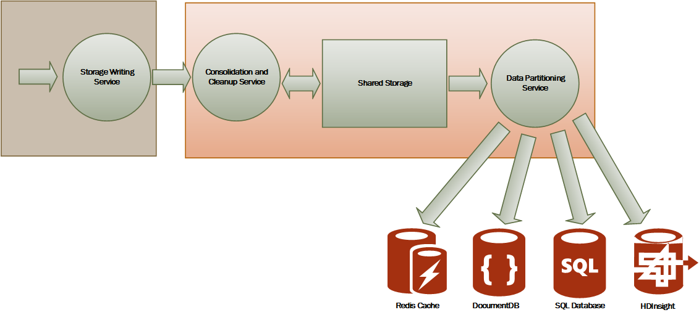

<properties
   pageTitle="Orientação de monitoramento e diagnóstico | Microsoft Azure"
   description="Práticas recomendadas para monitoramento aplicativos distribuídos na nuvem."
   services=""
   documentationCenter="na"
   authors="dragon119"
   manager="christb"
   editor=""
   tags=""/>

<tags
   ms.service="best-practice"
   ms.devlang="na"
   ms.topic="article"
   ms.tgt_pltfrm="na"
   ms.workload="na"
   ms.date="07/13/2016"
   ms.author="masashin"/>

# <a name="monitoring-and-diagnostics-guidance"></a>Orientação de monitoramento e diagnóstico

[AZURE.INCLUDE [pnp-header](../includes/guidance-pnp-header-include.md)]

## <a name="overview"></a>Visão geral
Aplicativos e serviços em execução na nuvem distribuídos são, por sua natureza, partes complexas de software que compõem muitas partes móveis. Em um ambiente de produção, é importante ser capaz de controlar a maneira em que os usuários utilizam o seu sistema, a utilização de recursos de rastreamento e geralmente monitorar a integridade e o desempenho do sistema. Você pode usar essas informações como um auxílio de diagnóstico para detectar e corrigir problemas e também para ajudar a identificar possíveis problemas e impedir que ocorra.

## <a name="monitoring-and-diagnostics-scenarios"></a>Cenários de monitoramento e diagnóstico
Você pode usar o monitoramento para obter uma visão geral de como um sistema está funcionando. Monitoramento é uma parte essencial de manter destinos de qualidade de serviço. Cenários comuns para coletar dados de monitoramento incluem:

- Garantir que o sistema continua íntegro.
- Controlando a disponibilidade do sistema e seus elementos de componente.
- Manter o desempenho para garantir que a taxa de transferência do sistema não diminui inesperadamente como o volume de trabalho aumenta.
- Garantindo que o sistema atende aos qualquer nível de serviço contratos de estabelecida com os clientes.
- Protegendo a privacidade e segurança do sistema, usuários e seus dados.
- As operações que são executadas para fins de auditoria ou regulamentares de controle.
- Monitorar o uso da diário do sistema e descobrir tendências que podem causar problemas de se eles não estiverem solucionados.
- Problemas que ocorrem, do relatório inicial através da análise de causas possíveis, retificação, atualizações de software resultante e implantação de controle.
- Operações de rastreamento e depuração de versões do software.

> [AZURE.NOTE] Esta lista não se destina a ser abrangente. Este documento se concentra nesses cenários como as situações mais comuns para realizar o monitoramento. Pode haver outras pessoas que são menos comum específicas para seu ambiente.

As seções a seguir descrevem esses cenários mais detalhadamente. As informações para cada cenário são discutidas no seguinte formato:

1. Uma breve visão geral do cenário
2. Os requisitos típicos desse cenário
3. Os dados de instrumentação bruto necessário para o cenário e possíveis fontes dessas informações de suporte
4. Como esses dados brutos podem ser analisados e combinados para gerar informações de diagnóstico significativas

## <a name="health-monitoring"></a>Monitoramento de integridade
Um sistema é eficaz, se for capaz de processar solicitações e em execução. A finalidade de monitoramento de integridade é gerar um instantâneo da integridade atual do sistema para que você possa verificar que todos os componentes do sistema estão funcionando conforme esperado.

### <a name="requirements-for-health-monitoring"></a>Requisitos para monitoramento de integridade
Um operador deve ser alertado rapidamente (em questão de segundos) se qualquer parte do sistema é considerada não íntegra. O operador deve ser capaz de determinar quais partes do sistema estão funcionando normalmente e quais partes estiver enfrentando problemas. Saúde do sistema pode ser realçada através de um sistema de semáforo:

- Vermelho para não íntegra (o sistema parou)
- Amarelo para parcialmente íntegra (o sistema está sendo executado com funcionalidade reduzida)
- Verde para completamente eficaz,

Um sistema de monitoramento de integridade abrangente habilita um operador para fazer drill down através do sistema para exibir o status de integridade de subsistemas e componentes. Por exemplo, se o sistema geral é representado como parcialmente íntegra, o operador deve ser capaz de ampliar e determinar qual funcionalidade está disponível no momento.

### <a name="data-sources-instrumentation-and-data-collection-requirements"></a>Requisitos de coleta de dados, instrumentação e fontes de dados
Os dados não processados necessário para oferecer suporte a monitoramento de integridade podem ser gerados como resultado de:

- Rastreamento execução de solicitações de usuário. Essas informações podem ser usadas para determinar quais solicitações tiveram êxito, que falhou e quanto tempo leva de cada solicitação.
- Usuário sintético monitoramento. Esse processo simula as etapas executadas por um usuário e segue uma série predefinida de etapas. Os resultados de cada etapa devem ser capturados.
- Registrando exceções, falhas e avisos. Essas informações podem ser capturadas como resultado de instruções de rastreamento incorporado o código do aplicativo, bem como recuperar informações de logs de eventos de todos os serviços que o sistema faz referência.
- Monitorar a integridade de quaisquer serviços de terceiros que usa o sistema. Este monitoramento pode exigir recuperando e analisando dados de integridade que fornecem esses serviços. Essas informações, podem levar uma variedade de formatos.
- Monitoramento de ponto de extremidade. Esse mecanismo é descrito mais detalhadamente na seção "Monitoramento de disponibilidade".
- Coletar informações de desempenho de ambiente, como plano de fundo da CPU ou atividade e/s (incluindo a rede).

### <a name="analyzing-health-data"></a>Analisar dados de integridade
O foco principal de monitoramento de integridade é rapidamente indicar se o sistema está em execução. Quente análise dos dados imediatas poderá disparar um alerta se um componente crítico for detectado como não íntegra. (Falhar ao responder a uma série consecutiva de ping, por exemplo). O operador, em seguida, pode levar a corretivas apropriada.

Um sistema mais avançado pode conter um elemento de previsão que realiza uma análise fria sobre cargas de trabalho recentes e atuais. Uma análise fria pode identifique tendências e determine se o sistema está provavelmente permanecerão eficaz, ou se o sistema terá recursos adicionais. Este elemento de previsão deve ser baseado em métricas de desempenho crítico, tais como:

- A taxa de solicitações dirigidas a cada serviço ou subsistema.
- Os tempos de resposta dessas solicitações.
- O volume de dados fluindo dentro e fora de cada serviço.

Se o valor de qualquer métrica exceder um limite definido, o sistema pode elevar um alerta para habilitar um operador ou autoscaling (se disponível) para executar as ações de prevenção necessárias para manter a integridade do sistema. Essas ações podem envolver a adição de recursos, reiniciar um ou mais serviços que estão falhando ou aplicando a limitação às solicitações de prioridade mais baixa.

## <a name="availability-monitoring"></a>Monitoramento de disponibilidade
Um sistema realmente integridade exige que os componentes e subsistemas que compõem o sistema estão disponíveis. Monitoramento da disponibilidade está relacionada ao monitoramento de integridade. Mas, enquanto o monitoramento de integridade fornece uma visão imediata da integridade atual do sistema, monitoramento da disponibilidade diz respeito a disponibilidade do sistema e seus componentes para gerar estatísticas sobre o tempo de atividade do sistema de rastreamento.

Em muitos sistemas, alguns componentes (como um banco de dados) são configurados com redundância interna para permitir failover rápido em caso de uma falha grave ou perda de conectividade. Ideal, os usuários não devem estar cientes de que ocorreu uma falha. Mas, de uma perspectiva de monitoramento da disponibilidade, é necessário obter o máximo possível de informações sobre essas falhas para determinar a causa e tomar ações corretivas para impedir que recorrente.

Os dados necessário para acompanhar a disponibilidade podem depender de vários fatores de nível inferior. Muitos desses fatores podem ser específicos para o aplicativo, sistema e ambiente. Um sistema de monitoramento eficaz captura os dados de disponibilidade que corresponde a esses fatores raio e, em seguida, agrega-os para dar uma visão geral do sistema. Por exemplo, um sistema de comércio, a funcionalidade de negócios que permite que um cliente para pedidos pode depender o repositório onde são armazenados os detalhes do pedido e o sistema de pagamento que trata as transações monetárias pagando por essas ordens. A disponibilidade da parte de inserção de pedidos do sistema, portanto, é uma função da disponibilidade de repositório e o subsistema de pagamento.

### <a name="requirements-for-availability-monitoring"></a>Requisitos para monitoramento de disponibilidade
Um operador também deve ser capaz de exibir a disponibilidade de histórica de cada sistema e subsistema e usar essas informações para identifique qualquer tendências que possam causar um ou mais subsistemas periodicamente falha. (Serviços Iniciar falha em um determinado horário do dia que corresponde ao processamento de pico?)

Uma solução de monitoramento deve fornecer uma exibição imediata e histórica da disponibilidade ou indisponibilidade de cada subsistema. Ele também deve ser capaz de alerta rapidamente um operador quando um ou mais serviços falhas ou quando os usuários não podem se conectar aos serviços. Isso é uma questão de não apenas monitoramento de cada serviço, mas também examinando as ações que cada usuário executa se essas ações falham quando tentam se comunicar com um serviço. Até certo ponto, um grau de falha de conectividade é normal e pode haver erros temporárias. Mas pode ser útil permitir que o sistema disparar um alerta para o número de falhas de conectividade para um subsistema especificado que ocorrem durante um período específico.

### <a name="data-sources-instrumentation-and-data-collection-requirements"></a>Requisitos de coleta de dados, instrumentação e fontes de dados
Como com monitoramento da integridade, os dados não processados necessário para oferecer suporte a disponibilidade de monitoramento podem ser gerados como resultado de usuário sintético monitoramento e registro em log qualquer exceções, falhas e avisos que podem ocorrer. Além disso, os dados de disponibilidade podem ser obtidos executando o monitoramento de ponto de extremidade. O aplicativo pode expor pontos de extremidade de integridade de um ou mais, cada teste acesso a uma área funcional dentro do sistema. O sistema de monitoramento pode ping cada ponto de extremidade seguindo um agendamento definido e coletar os resultados (sucesso ou falha).

Todos os tempos limite, falhas de conectividade de rede e tentativas de repetição de conexão devem ser registradas. Todos os dados devem ser a data e hora do.

<a name="analyzing-availability-data"></a>
### <a name="analyzing-availability-data"></a>Analisar dados de disponibilidade
Os dados de instrumentação devem ser agregados e correlacionados para os seguintes tipos de análise de suporte:

- A disponibilidade imediata do sistema e subsistemas.
- As taxas de falha de disponibilidade do sistema e subsistemas. Ideal seria um operador deve ser capaz de correlação falhas com atividades específicas: o que estava acontecendo quando o sistema Falha?
- Uma exibição do histórico de taxas de falha do sistema ou qualquer subsistemas em qualquer especificado período e a carga do sistema (número de solicitações de usuário, por exemplo) quando ocorreu uma falha.
- Os motivos para indisponibilidade do sistema ou qualquer subsistemas. Por exemplo, os motivos podem ser conectados não está em execução, conectividade perdida, mas conectados, mas retornando erros e tempo limite.

Você pode calcular a porcentagem de disponibilidade de um serviço durante um período de tempo usando a seguinte fórmula:

```
%Availability =  ((Total Time – Total Downtime) / Total Time ) * 100
```

Isso é útil para fins de SLA. ([SLA monitoramento](#SLA-monitoring) é descrita mais detalhadamente mais adiante neste guia.) A definição de _tempo de inatividade_ depende do serviço. Por exemplo, Visual Studio equipe construir serviços define o tempo de inatividade como o período (totais acumulados minutos) durante o qual construir serviço está indisponível. Um minuto é considerado indisponível se todas as contínuas solicitações HTTP para Build Service para executar operações iniciada pelo cliente em todo o minuto resultam em um código de erro ou não retornam uma resposta.

## <a name="performance-monitoring"></a>Monitoramento do desempenho
Como o sistema é colocado em mais sobrecarga (aumentando o volume de usuários), o tamanho dos conjuntos de dados que esses usuários acesso crescimento e a possibilidade de falha de componentes de uma ou mais se torna mais provável. Frequentemente, falha de componente é precedida de uma queda no desempenho. Se conseguir detectar queda, você pode tomar medidas proativas para remediar a situação.

Desempenho do sistema depende de vários fatores. Cada fator normalmente é medido por meio de indicadores de desempenho principais (KPIs), como o número de transações de banco de dados por segundo ou o volume de solicitações de rede que são atendidos com êxito em um período especificado. Alguns desses KPIs podem estar disponíveis como medidas de desempenho específico, enquanto outras pessoas podem ser derivadas de uma combinação de métricas.

> [AZURE.NOTE] Determinar o desempenho ruim ou boa requer que você entenda o nível de desempenho em que o sistema deve ser capaz de executar. Isso requer observando o sistema enquanto ele está funcionando em uma carga típica e capturando os dados para cada KPI durante um período de tempo. Isso pode envolver executando o sistema sob uma carga simulada em um ambiente de teste e coletar os dados apropriados antes de implantar o sistema para um ambiente de produção.

> Você também deve garantir que a monitoramento para fins de desempenho não se tornar uma carga no sistema. Você talvez consiga dinamicamente ajustar o nível de detalhes para os dados que reúne o processo de monitoramento de desempenho.

### <a name="requirements-for-performance-monitoring"></a>Requisitos para monitoramento do desempenho
Para examinar o desempenho do sistema, um operador normalmente precisa ver informações que inclui:

- As taxas de resposta para solicitações de usuário.
- O número de solicitações de usuário simultâneas.
- O volume de tráfego de rede.
- As taxas em quais comercial transações estão sendo concluídas.
- O tempo médio de processamento para solicitações.

Ele também pode ser útil fornecer ferramentas que permitem um operador para ajudá-lo correlações especiais, como:

- O número de usuários simultâneos versus latência de solicitação vezes (quanto tempo leva para iniciar uma solicitação de processamento depois que o usuário tenha enviado-lo).
- O número de usuários simultâneos versus o tempo de resposta médio (quanto tempo leva para concluir uma solicitação depois de ter começado processamento).
- O volume de solicitações versus o número de erros de processamento.

Junto com essas informações funcionais de alto nível, um operador deve ser capaz de obter uma visão detalhada do desempenho para cada componente do sistema. Esses dados geralmente são fornecidos por meio de contadores de desempenho de baixo nível que controlar informações, como:

- Utilização de memória.
- Número de threads.
- Tempo de processamento de CPU.
- Comprimento da fila.
- Taxas de e/s de disco ou de rede e erros.
- Número de bytes gravados ou lidos.
- Indicadores de middleware, como comprimento da fila.

Todas as visualizações devem permitir que um operador especificar um período de tempo. Os dados exibidos podem ser um instantâneo da situação atual e/ou em um modo de exibição de histórico de desempenho.

Um operador deve ser capaz de acionar um alerta com base em qualquer medida de desempenho para qualquer valor especificado durante qualquer intervalo de tempo especificado.

### <a name="data-sources-instrumentation-and-data-collection-requirements"></a>Requisitos de coleta de dados, instrumentação e fontes de dados
Você pode coletar dados de desempenho de alto nível (produtividade, número de usuários simultâneos, número de transações comerciais, taxas de erro e assim por diante) por monitorar o andamento de solicitações de usuários conforme chegarem e passar pelo sistema. Isso envolve incorporando instruções de rastreamento em pontos-chave no código do aplicativo, juntamente com informações de tempo. Todas as falhas, exceções e avisos devem ser capturados com dados suficientes para correlação-los com as solicitações que causaram-los. O log de serviços de informações da Internet (IIS) é outra fonte útil.

Se possível, você também deve capturar dados de desempenho para qualquer sistemas externos que o aplicativo usa. Desses sistemas externos podem fornecer seus próprios contadores de desempenho ou outros recursos para solicitar dados de desempenho. Se isso não for possíveis, gravar informações como hora de início e hora de término de cada solicitação feita para um sistema externo, junto com o status (sucesso, falha ou aviso) da operação. Por exemplo, você pode usar uma abordagem de cronômetro para solicitações de tempo: iniciar um timer quando a solicitação for iniciado e parar o timer quando termina a solicitação.

Dados de desempenho de baixo nível para componentes individuais em um sistema podem estar disponíveis por meio de recursos e serviços, como contadores de desempenho do Windows e o diagnóstico do Azure.

### <a name="analyzing-performance-data"></a>Analisar dados de desempenho
Muito do trabalho análise consiste em agregar dados de desempenho pelo tipo de solicitação de usuário e/ou subsistema ou serviço para o qual cada solicitação é enviada. Um exemplo de uma solicitação de usuário está adicionando um item a um carrinho de compras ou executar o processo de check-out em um sistema de comércio.

Outro requisito comum é resumir dados de desempenho em percentuais selecionados. Por exemplo, um operador pode determinar os tempos de resposta de 99% das solicitações, 95% de solicitações e 70% das solicitações. Pode haver destinos SLA ou outras metas definido para cada percentil. Os resultados em andamento devem ser relatados em quase em tempo real para ajudar a detectar problemas imediatos. Os resultados também devem ser agregados ao longo do tempo mais tempo para fins estatísticos.

No caso de problemas de latência afetar o desempenho, um operador deve ser capaz de identificar rapidamente a causa do gargalo examinando a latência de cada etapa que executa cada solicitação. Os dados de desempenho, portanto, devem fornecer um meio de correlação medidas de desempenho para cada etapa associá-los a uma solicitação específica.

Dependendo dos requisitos de visualização, talvez seja útil gerar e armazenar um cubo de dados que contém modos de exibição dos dados processados. Este cubo de dados pode permitir análise das informações de desempenho e consultas ad hoc complexas.

## <a name="security-monitoring"></a>Monitoramento de segurança
Todos os sistemas comerciais que incluem dados confidenciais devem implementar uma estrutura de segurança. A complexidade do mecanismo de segurança é geralmente uma função da sensibilidade dos dados. Em um sistema que exige que os usuários autenticados, você deve gravar:

- Todas as tentativas de entrada, se ele falha ou êxito.
- Todas as operações executadas por – e os detalhes de todos os recursos acessados por – um usuário autenticado.
- Quando um usuário termina uma sessão e sair.

Monitoramento talvez consiga ajudar a detectar ataques no sistema. Por exemplo, um grande número de tentativas de entrar com falha pode indicar um ataque de força bruta. Um aumento inesperado do solicitações pode ser o resultado de um ataque de (DDoS) negação de serviço distribuído. Você deve estar preparado para monitorar todas as solicitações para todos os recursos, independentemente da origem dessas solicitações. Um sistema que tem uma vulnerabilidade entrar acidentalmente pode expor recursos para o mundo exterior sem a necessidade de um usuário realmente entrar.

### <a name="requirements-for-security-monitoring"></a>Requisitos para monitoramento de segurança
Os aspectos mais importantes de monitoramento de segurança devem habilitar rapidamente um operador para:

- Detecte frustadas por uma entidade não autenticada.
- Identifica tentativas por entidades para executar operações de dados para os quais eles não possui acesso.
- Determine se o sistema ou parte do sistema, está sob ataque de fora ou para dentro. (Por exemplo, um usuário autenticado mal-intencionado pode estar tentando trazer o sistema para baixo.)

Para oferecer suporte a esses requisitos, um operador deve ser notificado:

- Se uma conta torna repetida tentativas entrar dentro de um período especificado.
- Se uma conta autenticada repetidamente tentar acessar um recurso proibido durante um período especificado.
- Se um grande número de solicitações não autenticados ou não autorizados ocorrer durante um período especificado.

As informações que são fornecidas para um operador devem incluir o endereço do host de origem para cada solicitação. Se regularmente surgirem violações de segurança de um intervalo específico de endereços, esses hosts podem ser bloqueados.

Uma parte fundamental nos mantendo a segurança de um sistema está sendo capaz de detectar rapidamente as ações que desviarem do padrão normal. Informações como o número de falhas e/ou bem-sucedida solicitações de entrada podem ser exibidas visualmente para ajudar a detectar se há um aumento na atividade um momento incomuns. (Um exemplo dessa atividade é usuários entrar pelo 3:00 AM e executando um grande número de operações quando seu dia de trabalho começa em 9:00 AM). Essas informações também podem ser usadas para ajudar a configurar auto-escala baseada no tempo. Por exemplo, se um operador observará que um grande número de usuários regularmente entra em uma hora específica do dia, o operador pode organizar iniciar os serviços de autenticação adicionais para lidar com o volume de trabalho e, em seguida, desligue esses serviços adicionais quando o pico passou.

### <a name="data-sources-instrumentation-and-data-collection-requirements"></a>Requisitos de coleta de dados, instrumentação e fontes de dados
Segurança é um aspecto completa de sistemas mais distribuídos. Os dados pertinentes provavelmente será gerado em vários pontos em um sistema. Você deve considerar a adoção de uma abordagem de gerenciamento de evento (SIEM) e informações de segurança para reunir as informações relacionadas à segurança que resulta da eventos gerados pelo aplicativo, equipamento de rede, servidores, firewalls, software antivírus e outros elementos de prevenção de intrusos.

Monitoramento de segurança pode incorporar dados de ferramentas que não fazem parte de seu aplicativo. Essas ferramentas podem incluir utilitários que identificam as atividades de verificação de porta por agências externas ou filtros de rede que detectar tenta obter acesso não autenticado ao seu aplicativo e dados.

Em todos os casos, os dados coletados devem habilitar um administrador determinar a natureza de qualquer ataque e tomar as contramedidas apropriadas.

### <a name="analyzing-security-data"></a>Análise de dados de segurança
Um recurso de monitoramento de segurança é a variedade de fontes do qual os dados surgem. Os formatos diferentes e o nível de detalhes geralmente exigem análise complexa dos dados capturados uni-lo em um segmento coerente de informações. Exceto o mais simples dos casos (como detectar um grande número de entrada falhou-ins ou várias tentativas de acesso não autorizado aos recursos essenciais), talvez não seja possível realizar qualquer complexo processamento automatizado de dados de segurança. Em vez disso, talvez seja preferível gravar esses dados, data e hora do mas caso contrário, em seu formato original, um repositório seguro para permitir especialista análise manual.

<a name="SLA-monitoring"></a>

## <a name="sla-monitoring"></a>Monitoramento de SLA
Muitos sistemas comerciais que oferecem suporte a clientes pagamento faça garantias sobre o desempenho do sistema no formulário de SLAs. Essencialmente, SLAs declare que o sistema pode manipular um volume definido de trabalho em um período combinado e sem perder informações críticas. Monitoramento de SLA trata garantindo que o sistema pode cumprir SLAs mensuráveis.

> [AZURE.NOTE] Monitoramento de SLA está relacionada à monitoramento do desempenho. Mas, enquanto o monitoramento do desempenho trata garantindo que o sistema funções _ideal_, monitoramento de SLA é regulamentada por uma obrigação contratual que define quais _ideal_ realmente significa.

SLAs muitas vezes são definidos em termos de:

- Disponibilidade geral do sistema. Por exemplo, uma organização pode garantir que o sistema estará disponível para 99,9 por cento das vezes. Isso equivale a não mais do que 9 horas de inatividade por ano ou aproximadamente 10 minutos por semana.
- Produtividade operacional. Esse aspecto geralmente é expresso como um ou mais limites máximos, como garantir que o sistema pode oferecer suporte a até 100.000 solicitações de usuário simultâneas ou tratar 10.000 transações de negócios simultâneas.
- Tempo de resposta operacional. O sistema também pode fazer garantias para a taxa na qual as solicitações são processadas. Um exemplo é que 99% de todas as transações de negócios terminará em 2 segundos e nenhuma transação única levará mais de 10 segundos.

> [AZURE.NOTE] Alguns contratos para sistemas comerciais também podem conter SLAs para suporte ao cliente. Um exemplo é que todas as solicitações de suporte técnico serão extrair uma resposta dentro de 5 minutos e que 99% de todos os problemas será totalmente endereçada dentro de 1 dia de trabalho. Eficaz de [controle de questões](#issue-tracking) (descrita posteriormente nesta seção) é fundamental para atender aos SLAs como essas.

### <a name="requirements-for-sla-monitoring"></a>Requisitos para monitoramento de SLA
No nível mais alto, um operador deve ser capaz de determinar rapidamente se o sistema atende os SLAs combinados ou não. E se não, o operador deve ser capaz de fazer drill para baixo e examine os fatores subjacentes para determinar as razões para as de desempenho.

Indicadores de alto nível típicos que podem ser representados visualmente incluem:

- A porcentagem de tempo de atividade de serviço.
- A taxa de transferência de aplicativo (medida em termos de transações com êxito e/ou operações por segundo).
- O número de solicitações de aplicativo com êxito/falha.
- O número de falhas de aplicativo e do sistema, exceções e avisos.

Todos esses indicadores devem ser capazes de sendo filtrado por um período de tempo especificado.

Um aplicativo em nuvem provavelmente representará um número de subsistemas e componentes. Um operador deve ser capaz de selecionar um indicador de alto nível e ver como ele é composto da integridade dos elementos subjacentes. Por exemplo, se o tempo de atividade geral do sistema ficar abaixo de um valor aceitável, um operador deve ser capaz de ampliar e determinar quais elementos são contribuem para essa falha.

> [AZURE.NOTE] Atividade do sistema precisa ser definido com cuidado. Em um sistema que usa redundância para garantir o máximo de disponibilidade, instâncias individuais de elementos podem falhar, mas o sistema pode permanecer funcional. Atividade conforme apresentado pelo monitoramento de integridade do sistema deve indicar o tempo de atividade de agregação de cada elemento e não necessariamente se o sistema realmente foi interrompida. Além disso, falhas podem ser isoladas. Assim mesmo se um sistema específico não estiver disponível, o resto do sistema pode permanecem disponível, embora com funcionalidade reduzida. (Em um sistema de comércio, uma falha no sistema pode impedir a um cliente colocando pedidos, mas o cliente ainda poderá pesquisar o catálogo de produtos.)

Para fins de alerta, o sistema deve ser capaz de gerar um evento se qualquer um dos indicadores de alto nível exceder um limite especificado. Os detalhes de nível inferior dos diversos fatores que compõem o indicador de alto nível devem estar disponíveis como dados contextuais para o sistema de alertas.

### <a name="data-sources-instrumentation-and-data-collection-requirements"></a>Requisitos de coleta de dados, instrumentação e fontes de dados
Os dados não processados necessário para oferecer suporte a SLA monitoramento são semelhantes aos dados não processados necessário para o monitoramento do desempenho, junto com alguns aspectos de saúde e monitoramento de disponibilidade. (Consulte essas seções para obter mais detalhes). Você pode capturar dados por:

- Executando o monitoramento de ponto de extremidade.
- Registrando exceções, falhas e avisos.
- Rastreamento a execução de solicitações de usuário.
- A disponibilidade de quaisquer serviços de terceiros que usa o sistema de monitoramento.
- Usando contadores e métricas de desempenho.

Todos os dados devem ser sincronizou e carimbo de data / hora.

### <a name="analyzing-sla-data"></a>Analisar dados de SLA
Os dados de instrumentação devem ser agregados para gerar uma imagem do desempenho geral do sistema. Dados agregados também devem suportar drill down para habilitar exame do desempenho dos subsistemas subjacentes. Por exemplo, você deve ser capaz de:

- Calcular o número total de solicitações de usuário durante um período especificado e determine a taxa de sucesso e falha dessas solicitações.
- Combine os tempos de resposta de solicitações de usuário para gerar uma visão geral de tempos de resposta do sistema.
- Analise o andamento das solicitações de usuário para dividir o tempo de resposta geral de uma solicitação para os tempos de resposta dos itens de trabalho individuais na solicitação.  
- Determine a disponibilidade geral do sistema como uma porcentagem de atividade para qualquer período específico.
- Analise a porcentagem de disponibilidade de horário dos serviços e componentes individuais do sistema. Isso pode envolver a análise logs que geraram serviços de terceiros.

Muitos sistemas comerciais são necessárias para relatar estimativas de desempenho real em relação a SLAs combinados para um período especificado, normalmente um mês. Essas informações podem ser usadas para calcular créditos ou outras formas de reembolso para clientes que se os SLAs não forem atendidos durante esse período. Você pode calcular a disponibilidade de um serviço usando a técnica descrita na seção [Analisando dados de disponibilidade](#analyzing-availability-data).

Para fins internos, uma organização também pode controlar o número e a natureza de ocorrências que causou serviços falha. Aprender como resolver esses problemas rapidamente ou eliminá-las completamente, ajudará a reduzir o tempo de inatividade e atender aos SLAs.

## <a name="auditing"></a>Auditoria
Dependendo da natureza do aplicativo, talvez haja ESTATUTÁRIAS ou outras normas legais que especificam os requisitos para auditoria operações de usuários e o acesso a todos os dados de gravação. Auditoria pode fornecer evidências que clientes de links solicitações específicas. Não repúdio é um fator importante em muitos sistemas de negócios e para ajudar a manter a confiança entre um cliente e a organização responsável pelo aplicativo ou serviço.

### <a name="requirements-for-auditing"></a>Requisitos para auditoria
Analista deve ser capaz de rastrear a sequência das operações de negócios que os usuários estão realizando para que você pode reconstruir ações dos usuários. Isso pode ser necessário simplesmente como uma questão de registro ou como parte de uma investigação jurídica.

Informações de auditoria são altamente confidenciais. Ela provavelmente incluirá dados que identifica os usuários do sistema, junto com as tarefas que ele estão executando. Por esse motivo, informações de auditoria provavelmente levará o formulário de relatórios que estão disponíveis apenas para os analistas confiáveis em vez de como um sistema interativo que ofereça suporte a busca detalhada das operações gráficas. Analista deve ser capaz de gerar uma variedade de relatórios. Por exemplo, relatórios podem listar atividades de todos os usuários que ocorrem durante um período especificado, a cronograma de atividade para um único usuário de detalhe ou a sequência de operações executadas em relação a um ou mais recursos de lista.

### <a name="data-sources-instrumentation-and-data-collection-requirements"></a>Requisitos de coleta de dados, instrumentação e fontes de dados
As principais fontes de informações de auditoria podem incluir:

- O sistema de segurança que gerencia a autenticação de usuário.
- Logs de rastreamento que registrar a atividade de usuário.
- Logs de segurança que acompanham todas as solicitações de rede identificáveis e não identificado.

O formato dos dados de auditoria e a maneira em que ele está armazenado pode ser controlado por requisitos regulatórios. Por exemplo, ela não poderá limpar os dados de forma alguma. (Ele deve ser registrado em seu formato original.) Acesso ao repositório onde é mantida deve ser protegido para impedir a adulteração.

### <a name="analyzing-audit-data"></a>Analisar dados de auditoria
Analista deve ser capaz de acessar os dados brutos integralmente, em seu formato original. Além do requisito para gerar relatórios de auditoria comuns, as ferramentas para analisar dados são provavelmente ser especializadas e mantido externo ao sistema.

## <a name="usage-monitoring"></a>Monitoramento de uso
Monitoramento de uso controla como os recursos e componentes de um aplicativo são usadas. Um operador pode usar os dados coletados para:

- Determine quais recursos são usados e qualquer possíveis pontos de acesso no sistema. Elementos de alto tráfego podem se beneficiar partição funcional ou até mesmo replicação para distribuir a carga mais uniforme. Um operador também pode usar essas informações para determinar quais recursos raramente são usados e são possíveis candidatos para aposentadoria ou substituição em uma versão futura do sistema.
- Obter informações sobre os eventos operacionais do sistema em uso normal. Por exemplo, em um site de comércio, você pode gravar as informações de estatísticas sobre o número de transações e o volume dos clientes que são responsáveis por eles. Essas informações podem ser usadas para planejamento de capacidade conforme aumenta o número de clientes.
- Detecte (possivelmente indiretamente) satisfação do usuário com o desempenho ou a funcionalidade do sistema. Por exemplo, se um grande número de clientes em um sistema de comércio regularmente abandonar seus carrinhos de compras, isso pode ser devido a um problema com a funcionalidade de check-out.
- Gere informações de cobrança. Um aplicativo comercial ou serviço vários locatários pode cobrar clientes para os recursos que eles usam.
- Impor cotas. Se um usuário em um sistema de vários locatários exceder suas cotas paga de uso de hora ou o recurso de processamento durante um período especificado, seu acesso pode ser limitado ou processamento pode ser limitado.

### <a name="requirements-for-usage-monitoring"></a>Requisitos para monitoramento de uso
Para examinar o uso do sistema, um operador normalmente precisa ver informações que inclui:

- O número de solicitações que são processados por cada subsistema e direcionado para cada recurso.
- O trabalho que cada usuário está executando.
- O volume de armazenamento de dados que ocupa de cada usuário.
- Os recursos que cada usuário está acessando.

Um operador também deve ser capaz de gerar gráficos. Por exemplo, um gráfico pode exibir os usuários com mais necessidade de recursos ou acessados com mais frequência recursos ou recursos do sistema.

### <a name="data-sources-instrumentation-and-data-collection-requirements"></a>Requisitos de coleta de dados, instrumentação e fontes de dados
Uso de rastreamento pode ser executado em um nível relativamente alto. Ele pode observar os tempos de início e término de cada solicitação e a natureza da solicitação (ler, gravar e assim por diante, dependendo do recurso em questão). Você pode obter essas informações por:

- Atividade de usuário de rastreamento.
- Capturando contadores de desempenho que medem a utilização de cada recurso.
- Monitorar o consumo de recursos por cada usuário.

Para fins de medição, você também precisa ser capaz de identificar quais usuários são responsáveis por executar as operações e os recursos que utilizam essas operações. As informações coletadas devem ser detalhadas suficiente para habilitar cobrança precisa.

<a name="issue-tracking"></a>
## <a name="issue-tracking"></a>Acompanhamento de questões
Clientes e outros usuários podem relatar problemas caso comportamento ou eventos inesperados no sistema. Acompanhamento de questões trata gerenciar esses problemas, associá-las a esforços para resolver os problemas subjacentes do sistema e informando clientes de possíveis resoluções.

### <a name="requirements-for-issue-tracking"></a>Requisitos para acompanhamento
Operadores realizam muitas vezes acompanhamento usando um sistema separado que permite que eles para gravar e relatório de detalhes de problemas relatório usuários. Estes detalhes podem incluir as tarefas que o usuário estava tentando executar, sintomas do problema, a sequência de eventos e qualquer erro ou mensagens de aviso que foram emitidas.

### <a name="data-sources-instrumentation-and-data-collection-requirements"></a>Requisitos de coleta de dados, instrumentação e fontes de dados
A fonte de dados inicial para os dados de acompanhamento de questões é o usuário que relatado o problema em primeiro lugar. O usuário pode ser capaz de fornecer dados adicionais, tais como:

- Um despejo (se o aplicativo inclui um componente que é executado na área de trabalho do usuário).
- Um instantâneo da tela.
- A data e hora quando o erro ocorreu, junto com qualquer outra informação ambiental como o local do usuário.

Essas informações podem ser usadas para ajudar o esforço depuração e ajudar a construir um registro posterior para lançamentos futuros do software.

### <a name="analyzing-issue-tracking-data"></a>Analisar dados de acompanhamento de questões
Usuários diferentes podem relatar o mesmo problema. O sistema de acompanhamento de questões deve associar relatórios comuns.

O andamento do esforço de depuração deve ser registrado em relação a cada relatório de problema. Quando o problema for resolvido, o cliente pode ser informado da solução.

Se um usuário reportar um problema que tem uma solução conhecida no sistema de acompanhamento de questões, o operador deve ser capaz de informar ao usuário da solução imediatamente.

## <a name="tracing-operations-and-debugging-software-releases"></a>Operações de rastreamento e depuração de versões do software
Quando um usuário relata um problema, o usuário é geralmente somente atento o impacto imediato que possui em suas operações. O usuário só pode reportar os resultados de sua própria experiência novamente um operador quem é responsável por manter o sistema. Normalmente, essas experiências estão apenas um sintoma visível de um ou mais problemas fundamentais. Em muitos casos, será necessário um analista aprofundar através da cronograma das operações subjacentes estabelecer a causa do problema. Esse processo é chamado de _análise de causas_.

> [AZURE.NOTE] Análise de causas pode descobrir deficiências no design de um aplicativo. Nesses casos, talvez seja possível refazer os elementos afetados e implantá-los como parte de uma versão subsequente. Esse processo requer controle atento e os componentes atualizados devem ser monitorados de perto.

### <a name="requirements-for-tracing-and-debugging"></a>Requisitos para o rastreamento e depuração
Para rastrear eventos inesperados e outros problemas, é vital que os dados de monitoramento fornecem informações suficientes para habilitar um analista rastrear as origens desses problemas e reconstruir a sequência de eventos que ocorreram. Esta informação deve ser suficiente para habilitar um analista diagnosticar a causa de problemas. Um desenvolvedor pode faça as modificações necessárias para impedir que recorrente.

### <a name="data-sources-instrumentation-and-data-collection-requirements"></a>Requisitos de coleta de dados, instrumentação e fontes de dados
Solução de problemas pode envolver rastreamento todos os métodos (e seus parâmetros) chamados como parte de uma operação para construir uma árvore que representa o fluxo lógico por meio do sistema quando um cliente faz uma solicitação específica. Exceções e avisos que o sistema gera como resultado deste fluxo precisam ser capturado e registrada.

Para dar suporte a depuração, o sistema pode fornecer conexões que permitem um operador capturar informações de estado em pontos importantes do sistema. Ou, o sistema pode fornecer informações detalhadas como progresso de operações selecionadas. Captura dados nesse nível de detalhes podem impor uma carga adicional no sistema e devem ser um processo temporário. Um operador usa esse processo principalmente quando uma série altamente incomuns de eventos ocorre e é difícil replicar, ou quando uma nova versão de um ou mais elementos em um sistema requer monitoramento cuidado para garantir que a função de elementos conforme esperado.

## <a name="the-monitoring-and-diagnostics-pipeline"></a>O pipeline de monitoramento e diagnóstico
Monitorar um sistema distribuído em larga escala representa um desafio significativo. Cada um dos cenários descritos na seção anterior não deve necessariamente ser considerada em isolamento. É provável que seja uma sobreposição significativa nos dados de diagnóstico e monitoramento necessário para cada situação, embora esses dados talvez precise ser processada e apresentados de maneiras diferentes. Por esses motivos, você deve tomar uma exibição abrangente de monitoramento e diagnóstico.

Você pode envisage o processo de diagnóstico e monitoramento inteiro como um pipeline que abrange os estágios mostrados na Figura 1.


_Figura 1. Os estágios no pipeline de monitoramento e diagnóstico_

Figura 1 destaca como os dados de monitoramento e diagnóstico podem vir de uma variedade de fontes de dados. Os estágios de coleta e instrumentação se preocupam com a identificação de origens de onde os dados precisam ser capturado, determinar quais dados para capturar, como capturá-lo e como formatar esses dados para que ele pode ser facilmente analisado. O estágio de análise/diagnóstico leva os dados processados e usa para gerar informações significativas que um operador pode usar para determinar o estado do sistema. O operador pode usar essas informações para tomar decisões sobre ações possíveis para tirar e, em seguida, alimentar os resultados novamente os estágios de coleta e instrumentação. A fase de estágio visualização/alerta apresenta um modo de exibição de consumo do estado do sistema. Ela pode exibir informações em quase em tempo real utilizando uma série de painéis. E pode gerar relatórios, gráficos e gráficos para fornecer uma exibição histórica dos dados que podem ajudar a identificar tendências de longo prazo. Se informações indicam que um KPI é provavelmente exceda o limite aceitável, deste estágio também pode disparar um alerta para um operador. Em alguns casos, um alerta também pode ser usado para acionar um processo automatizado que tenta realizar ações corretivas, como autoscaling.

Observe que essas etapas constituem um processo de fluxo contínuo onde os estágios estão acontecendo em paralelo. Ideal seria todas as fases devem ser dinamicamente configuráveis. Em alguns pontos, especialmente quando um sistema foi recentemente implantado ou está tendo problemas, talvez seja necessário coletar dados estendido com mais frequência. Em outros momentos, ele deve ser possível reverter para capturar um nível básico de informações essenciais para verificar se o sistema está funcionando corretamente.

Além disso, todo o processo de monitoramento deve ser considerado uma solução ao vivo em andamento que está sujeito ajuste fino e aprimoramentos como resultado de comentários. Por exemplo, você pode começar com medir muitos fatores para determinar a saúde do sistema. Análise ao longo do tempo pode levar a um refinamento conforme você descartar medidas que não são relevantes, permitindo que você enfocar mais precisamente os dados que você precisa minimizando o ruído de fundo.

## <a name="sources-of-monitoring-and-diagnostic-data"></a>Fontes de dados de diagnósticos e monitoramento
As informações que usa o processo de monitoramento podem vir de várias fontes, conforme ilustrado na Figura 1. No nível do aplicativo, informações é proveniente de logs de rastreamento incorporados o código do sistema. Os desenvolvedores devem seguir uma abordagem padrão para controlar o fluxo de controle por meio de seu código. Por exemplo, uma entrada para um método pode emitir uma mensagem de rastreamento que especifica o nome do método, a hora atual, o valor de cada parâmetro e outras informações pertinentes. Os tempos de entrada e saída de gravação também pode ser úteis.

Você deve registrar todas as exceções e avisos e certifique-se de que você mantenha um rastreamento completo de qualquer exceção aninhada e avisos. Ideal, você também deve capturar informações que identifica o usuário que está executando o código, juntamente com informações de correlação de atividade (para acompanhar as solicitações de medida que eles passam pelo sistema). E você deve fazer logon tenta acessar todos os recursos como filas de mensagens, bancos de dados, arquivos e outros serviços dependentes. Essas informações podem ser usadas para monitoração e fins de auditoria.

Muitos aplicativos faça uso das bibliotecas e estruturas para realizar tarefas comuns, como acessar um armazenamento de dados ou comunicar-se através de uma rede. Essas estruturas podem ser configuráveis para fornecer suas próprias mensagens de rastreamento e informações de diagnósticos brutas, como taxas de transação e êxitos de transmissão de dados e falhas.

> [AZURE.NOTE] Muitas estruturas modernas publicar automaticamente eventos de desempenho e de rastreamento. Capturar essas informações é simplesmente uma questão de fornecer um meio para recuperar e armazená-la onde podem ser processado e analisado.

O sistema operacional onde o aplicativo está sendo executado pode ser uma fonte de informação de todo o sistema de baixo nível, como contadores de desempenho que indicam taxas de e/s, utilização de memória e uso da CPU. Erros do sistema operacional (como a falha ao abrir um arquivo corretamente) também podem ser relatados.

Você também deve considerar a infraestrutura e componentes em que seu sistema seja executado subjacente. Máquinas virtuais, redes virtuais e serviços de armazenamento podem todos ser fontes de contadores de desempenho de nível de infraestrutura importantes e outros dados de diagnóstico.

Se o aplicativo usa outros serviços externos, como um servidor web ou um sistema de gerenciamento de banco de dados, esses serviços podem publicar suas próprias informações de rastreamento, logs e contadores de desempenho. Alguns exemplos incluem exibições de gerenciamento dinâmico do SQL Server para controlar operações executadas em relação a um banco de dados do SQL Server e os logs de rastreamento IIS para registrar solicitações feitas a um servidor web.

Como os componentes de um sistema de serem modificados e novas versões são implantadas, é importante sejam capazes de problemas de atributo, eventos e métricas para cada versão. Essas informações devem ser vinculadas voltar para o pipeline de lançamento para que podem ser controlados rapidamente e corrigidos problemas com uma versão específica de um componente.

Problemas de segurança podem ocorrer em qualquer ponto do sistema. Por exemplo, um usuário pode tentar entrar com uma ID de usuário inválida ou senha. Um usuário autenticado pode tentar obter acesso não autorizado a um recurso. Ou um usuário pode fornecer uma chave inválida ou desatualizada para acessar informações criptografadas. Informações relacionadas a segurança para solicitações bem-sucedida e falhas sempre devem ser registradas.

A seção [instrumentação um aplicativo](#instrumenting-an-application) contém obter mais orientações sobre as informações que você deve capturar. Mas você pode usar uma variedade de estratégias para coletar essas informações:

- **Monitoramento do aplicativo/sistema**. Essa estratégia usa fontes internas dentro do aplicativo, estruturas de aplicativo, sistema operacional e infraestrutura. O código do aplicativo pode gerar seus próprios dados em pontos importantes de monitoramento durante o ciclo de vida de uma solicitação de cliente. O aplicativo pode incluir instruções de rastreamento que podem ser ativadas ou desabilitadas como circunstâncias ditam seletivamente. Ele também pode ser possível inserir diagnóstico dinamicamente usando uma estrutura de diagnóstico. Normalmente, essas estruturas fornecem plug-ins que pode anexar a vários pontos de instrumentação no seu código e capturar dados de rastreamento nesses pontos.

    Além disso, seu código e/ou a infraestrutura subjacente pode disparar eventos em pontos críticos. Monitoramento agentes que são configurados para escutar para esses eventos pode registrar as informações do evento.

- **Monitoramento de usuário real**. Essa abordagem registra as interações entre um usuário e o aplicativo e observará o fluxo de cada solicitação e resposta. Essas informações podem ter um objetivo de dupla: pode ser usado para uso de medição por cada usuário e pode ser usado para determinar se os usuários estão recebendo uma qualidade adequada de serviço (por exemplo, tempos de resposta rápidos, baixa latência e erros mínimo). Você pode usar os dados capturados para identificar áreas de interesse em falhas ocorrem com mais frequência. Você também pode usar os dados para identificar elementos onde o sistema está lento, possivelmente devido a pontos de acesso no aplicativo ou alguma outra forma de afunilamento. Se você implementar essa abordagem cuidadosamente, poderá reconstruí fluxos de usuários por meio do aplicativo para fins de teste e depuração.

    > [AZURE.IMPORTANT] Você deve considerar os dados que são capturados monitorando usuários reais para ser altamente confidenciais porque ele pode incluir material confidencial. Se você salvar dados capturados, armazená-lo com segurança. Se você quiser usar os dados de desempenho monitoramento ou fins de depuração, retirar todas as informações pessoalmente identificáveis primeiro.

- **Usuário sintético monitoramento**. Essa abordagem, você escreve seu próprio cliente de teste que simula um usuário e executa uma série de configurável mas típica de operações. Você pode controlar o desempenho do cliente do teste para ajudar a determinar o estado do sistema. Você também pode usar várias instâncias do cliente teste como parte de uma operação de teste de carga estabelecer como o sistema responde em sobrecarga e que tipo de monitoramento saída é gerado nessas condições.

    > [AZURE.NOTE] Você pode implementar o monitoramento de usuários real e sintéticos, incluindo o código que rastreia e atinge o tempo de execução de chamadas de método e outras partes essenciais de um aplicativo.

- **Criação de perfil**. Essa abordagem é direcionada principalmente monitorar e melhorar o desempenho do aplicativo. Em vez de operando no nível do usuário real e sintético monitoramento funcional, ele captura informações de nível inferior como do aplicativo ser executado. Você pode implementar o perfil usando amostragem periódica o estado de execução de um aplicativo (determinar quais trecho de código que o aplicativo é executado em um determinado ponto no tempo). Você também pode usar instrumentação que insere testes o código no junctures importantes (como o início e fim de uma chamada de método) e registra quais métodos foram invocados, o horário, e quanto tempo demorou de cada chamada. Você pode analisar esses dados para determinar quais partes do aplicativo podem causar problemas de desempenho.

- **Monitoramento de ponto de extremidade**. Esta técnica usa um ou mais diagnósticos pontos de extremidade de que o aplicativo expõe especificamente para permitir o monitoramento. Um ponto de extremidade fornece um caminho para o código do aplicativo e pode retornar informações sobre a integridade do sistema. Pontos de extremidade diferentes podem se concentrar em vários aspectos da funcionalidade. Você pode escrever seu próprio cliente de diagnóstico que envia solicitações periódicas para esses pontos de extremidade e assimilar as respostas. Essa abordagem é descrita mais no [Padrão de monitoramento de ponto de extremidade de integridade](https://msdn.microsoft.com/library/dn589789.aspx) no site da Microsoft.

Para cobertura máxima, você deve usar uma combinação dessas técnicas.

<a name="instrumenting-an-application"></a>
## <a name="instrumenting-an-application"></a>Instrumentação um aplicativo
Instrumentação é uma parte essencial do processo de monitoramento. Você pode tomar decisões significativas sobre o desempenho e a integridade de um sistema somente se você primeiro capturar os dados que permite que você faça essas decisões. As informações que você coleta usando instrumentação devem ser suficientes para que você possa avaliar o desempenho, diagnosticar problemas e tomar decisões sem exigir que você entrar em um servidor de produção remoto para executar o rastreamento (e depuração) manualmente. Dados de instrumentação normalmente compreendem métricas e informações que são gravadas logs de rastreamento.

O conteúdo de um log de rastreamento pode ser o resultado de dados textuais escrito pelo aplicativo ou dados binários que são criados como resultado de um evento de rastreamento (se o aplicativo está usando o rastreamento de eventos do Windows – ETW). Também podem ser geradas de logs do sistema que registrem eventos decorrente do partes da infraestrutura, como um servidor web. Mensagens de log textual geralmente são projetadas para serem legível, mas eles também devem ser escritos em um formato que permite que um sistema automatizado analisá-los facilmente.

Você também deve categorizar logs. Não escreva todos os dados de rastreamento para um único log, mas usar logs separados para gravar a saída de rastreamento de diferentes aspectos operacionais do sistema. Em seguida, você pode filtrar rapidamente mensagens de log pelo modo de leitura do log de apropriado em vez de ter um único arquivo longo de processo. Nunca gravar as informações que tem requisitos de segurança diferentes (como informações de auditoria e depuração de dados) para o mesmo log.

> [AZURE.NOTE] Um log pode ser implementado como um arquivo no sistema de arquivos, ou pode acontecer em algum outro formato, como um blob no armazenamento de blob. Informações de log também podem ser apresentadas no armazenamento mais estruturado, como linhas em uma tabela.

Métricas geralmente será uma medida ou a contagem de algum aspecto ou recurso do sistema em um momento específico, com uma ou mais marcas associadas ou dimensões (às vezes chamadas de uma _amostra_). Uma única instância de uma métrica geralmente não é útil em isolamento. Em vez disso, métricas precisam ser capturado ao longo do tempo. A principal questão a considerar é que métricas você deve gravar e frequência. Geração de dados para métricas muitas vezes pode impor uma carga significativa adicional no sistema, enquanto captura métricas raramente podem causar a perca as circunstâncias que levam a um evento significativo. As considerações variará métrica para métrica. Por exemplo, em um servidor da CPU pode variar significativamente segundo em segundo, mas alta utilização se torna um problema somente se ele for longa vida ao longo de um número de minutos.

<a name="information-for-correlating-data"></a>
### <a name="information-for-correlating-data"></a>Informações de correlação de dados
Você pode facilmente monitorar contadores de desempenho de nível de sistema individual, capturar métricas para recursos e obter informações de rastreamento de aplicativo de vários arquivos de log. Mas algumas formas de monitoramento exigem o estágio de análise e o diagnóstico no pipeline de monitoramento para correlação os dados que são recuperados de várias fontes. Esses dados podem demorar vários formulários dos dados processados e o processo de análise deve ser fornecido com dados de instrumentação suficientes para poder mapear esses formulários diferentes. Por exemplo, no nível de estrutura do aplicativo, uma tarefa pode ser identificada por uma identificação de segmento. Dentro de um aplicativo, o mesmo trabalho pode ser associado com a ID de usuário para o usuário que está executando essa tarefa.

Além disso, há provavelmente não ser um mapeamento 1:1 entre threads e solicitações de usuário, porque operações assíncronas podem reutilizar os mesmos threads para executar operações em nome de mais de um usuário. Para complicar ainda mais, uma única solicitação pode ser tratada por mais de um segmento como fluxos de execução por meio do sistema. Se possível, associe cada solicitação com uma identificação de atividade exclusivo que é propagada por meio do sistema como parte do contexto de solicitação. (A técnica para gerar e incluindo atividade IDs em informações de rastreamento depende da tecnologia que é usada para capturar os dados de rastreamento.)

Todos os dados de monitoramento devem ser a data e hora da mesma maneira. Para obter consistência, registre todas as datas e horas usando o tempo Universal Coordenado. Isso ajudará com mais facilidade sequências de rastreamento de eventos.

> [AZURE.NOTE] Computadores operando em fusos horários diferentes e redes podem não ser sincronizados. Não dependem de usando carimbos de hora sozinhos para dados de instrumentação que abrange várias máquinas de correlação.

### <a name="information-to-include-in-the-instrumentation-data"></a>Informações para incluir os dados de instrumentação
Considere os seguintes pontos quando estiver decidindo quais dados de instrumentação que você precisa coletar:

- Certifique-se de que informações capturadas por eventos de rastreamento são máquina e legível. Adote esquemas bem definidos para essas informações para facilitar o processamento automatizado de dados de registro em sistemas e fornecer consistência para os logs de leitura a equipe de engenharia e de operações. Inclua informações ambientais, como o ambiente de implantação, o computador no qual o processo é executado, os detalhes do processo e a pilha de chamadas.  
- Habilite o perfil somente quando necessário, porque ele pode impor uma sobrecarga significativa no sistema. Perfil usando instrumentação de registros um evento (como uma chamada de método) sempre que ele ocorre, enquanto eventos somente amostragem registros selecionados. A seleção pode ser baseada no tempo (uma vez a cada *n* segundos), ou frequência baseado (uma vez que cada *n* solicitações). Se eventos ocorrerem muito frequentemente, perfil por instrumentação pode causar muita uma carga e próprio afetar o desempenho geral. Nesse caso, a abordagem de amostragem pode ser preferível. No entanto, se a frequência de eventos for baixa, amostragem pode perdê-los. Nesse caso, instrumentação pode ser a melhor abordagem.
- Fornece contexto suficiente para permitir que um desenvolvedor ou administrador determinar a origem de cada solicitação. Isso pode incluir alguma forma de identificação de atividade que identifica uma instância específica de uma solicitação. Ele também pode conter informações que podem ser usadas para correlação esta atividade com o trabalho de computação realizado e os recursos usados. Observe que esse trabalho poderá ultrapassar os limites do processos e máquina. Para monitoração, o contexto também deve incluir (direta ou indiretamente por meio de outros correlacionadas informações) uma referência para o cliente que causou a solicitação para ser feita. Neste contexto fornece informações importantes sobre o estado de aplicativo no momento em que os dados de monitoramento foi capturados.
- Registre todas as solicitações e os locais ou as regiões do qual essas solicitações são feitas. Essas informações podem ajudar a determinar se há qualquer pontos de acesso local específico. Essas informações também podem ser úteis para determinar se reparticionar um aplicativo ou os dados que ele usa.
- Gravar e capturar os detalhes de exceções cuidadosamente. Muitas vezes, informações de depuração críticas são perdidas como resultado de manipulação de exceção deficiente. Capture os detalhes completos de exceções que o aplicativo gera, incluindo as exceções internas e outras informações de contexto. Inclua a pilha de chamadas se possível.
- Ser consistente dos dados que os diferentes elementos do seu aplicativo capturar, pois isso pode ajudar na análise de eventos e correlação-los com solicitações de usuário. Considere usar um pacote de log abrangente e configurável para coletar informações, ao invés de dependendo dos desenvolvedores adotem a mesma abordagem conforme eles implementam diferentes partes do sistema. Colete dados de contadores de chave de desempenho, como o volume de i/o sendo executada, utilização de rede, o número de solicitações, uso de memória e utilização da CPU. Alguns serviços de infraestrutura podem fornecer seus próprios contadores de desempenho específicos, como o número de conexões para um banco de dados, a taxa em que as transações estão sendo executadas e o número de transações que tenha êxito ou falha. Aplicativos também podem definir seus próprios contadores de desempenho específicos.
- Faça todas as chamadas feitas para serviços externos, como sistemas de banco de dados, serviços da web ou outros serviços de nível de sistema que fazem parte da infraestrutura. Registrar informações sobre o tempo necessário para executar cada chamada e o sucesso ou falha da chamada. Se possível, capture informações sobre todas as tentativas de repetição e falhas para qualquer temporárias erros que ocorrem.

### <a name="ensuring-compatibility-with-telemetry-systems"></a>Garantindo compatibilidade com sistemas de telemetria
Em muitos casos, as informações que produz instrumentação são geradas como uma série de eventos e passadas para um sistema de telemetria separada para análise e processamento. Um sistema de telemetria é geralmente independente de qualquer aplicativo específico ou tecnologia, mas ele espera informações para acompanhar um formato específico que geralmente é definido por um esquema. O esquema efetivamente Especifica um contrato que define os campos de dados e tipos de que o sistema de telemetria pode incluir. O esquema deve ser generalizado para permitir dados chegando em uma variedade de dispositivos e plataformas.

Um esquema comum deve incluir campos que são comuns a todos os eventos de instrumentação, como o nome do evento, a hora do evento, o endereço IP do remetente e os detalhes necessários para correlação com outros eventos (como uma ID de usuário, um ID de dispositivo e uma ID de aplicativo). Lembre-se de que qualquer número de dispositivos pode disparar eventos, para que o esquema não deve dependem do tipo de dispositivo. Além disso, vários dispositivos podem disparar eventos para o mesmo aplicativo; o aplicativo pode oferecer suporte móvel ou outro formulário da distribuição entre dispositivos.

O esquema também pode conter campos de domínio relevantes para um determinado cenário é comum em diferentes aplicativos. Isso pode ser informações sobre exceções, Iniciar aplicativo e eventos de fim e sucesso e/ou falha de chamadas de API do serviço web. Todos os aplicativos que usam o mesmo conjunto de campos de domínio devem emitir o mesmo conjunto de eventos, permitindo que um conjunto de relatórios e análises para ser construído comuns.

Finalmente, um esquema pode conter campos personalizados para capturar os detalhes de eventos específicos do aplicativo.

### <a name="best-practices-for-instrumenting-applications"></a>Práticas recomendadas para instrumentação de aplicativos
A lista a seguir resume as práticas recomendadas para instrumentação um aplicativo distribuído em execução na nuvem.

- Faça logs de fácil leitura e fácil analisar. Usar estruturada log sempre que possível. Ser conciso e descritivo em mensagens de log.
- Em todos os logs, identificar a origem e fornecer contexto e informações de intervalo como cada registro de log é escrito.
- Use o mesmo fuso horário e formato para todos os carimbos de hora. Isso ajudará a correlação eventos para as operações que se estendem por hardware e serviços em execução em regiões geográficas diferentes.
- Categorizar logs e escrever mensagens para o arquivo de log apropriado.
- Não divulgar informações confidenciais sobre o sistema ou informações pessoais sobre usuários. Movimente essas informações antes que ele está conectado, mas certifique-se de que os detalhes relevantes são mantidos. Por exemplo, remova a identificação e senha as cadeias de caracteres de conexão de banco de dados, mas gravar as informações restantes no log para que um analista pode determinar que o sistema está acessando o banco de dados correto. Registrar todas as exceções críticas, mas permitem que o administrador ativar e desativar o registro em log para níveis inferiores de exceções e avisos. Além disso, capture e registrar todas as informações de lógica de repetição. Esses dados podem ser úteis no monitoramento a integridade temporária do sistema.
- Rastrear ausência chamadas de processo, como solicitações para serviços web externos ou bancos de dados.
- Não combinar as mensagens de log com os requisitos de segurança diferentes no mesmo arquivo de log. Por exemplo, não escreva depuração e informações para o mesmo log de auditoria.
- Com exceção de auditoria de eventos, certifique-se de que todas as chamadas de log são operações disparar e esquecer que não bloqueiem o progresso das operações de negócios. Eventos de auditoria são excepcionais porque eles são essenciais para os negócios e podem ser classificados como uma parte fundamental das operações de negócios.
- Certifique-se de que o registro em log é extensível e não tem quaisquer dependências diretas em um destino concreto. Por exemplo, em vez de gravar informações usando _System.Diagnostics.Trace_, defina uma interface abstrata (como _ILogger_) que expõe métodos de log e que pode ser implementado por meio de qualquer meio apropriado.
- Certifique-se de que todos log é sem falhas e nunca aciona erros em cascata. Registro em log não deve lançar as exceções.
- Trate instrumentação como um processo repetitivo em andamento e examine os logs regularmente, não apenas quando há um problema.

## <a name="collecting-and-storing-data"></a>Coletar e armazenar dados
O estágio de conjunto do processo de monitoramento trata recuperando as informações de instrumentação gera, formatação esses dados para tornar mais fácil para o estágio de análise/diagnóstico consumir e salvar os dados transformados em armazenamento confiável. Os dados de instrumentação que reunir de diferentes partes de um sistema distribuído podem ser mantidos em uma variedade de locais e com vários formatos. Por exemplo, o código do seu aplicativo pode gerar arquivos de log de rastreamento e gerar dados de log de eventos do aplicativo, enquanto contadores de desempenho que monitorar os principais aspectos da infraestrutura que o aplicativo usa podem ser capturados através de outras tecnologias. Qualquer serviços e componentes de terceiros que o aplicativo usa pode fornecer informações de instrumentação em formatos diferentes, usando arquivos de rastreamento separado, blob storage ou até mesmo um armazenamento de dados personalizado.

Coleta de dados com frequência é executada por meio de um serviço de conjunto que pode ser executados de forma autônoma do aplicativo que gera os dados de instrumentação. Figura 2 ilustra um exemplo de arquitetura, realce o subsistema de coleta de dados de instrumentação.


_Figura 2. Coleta de dados de instrumentação_

Observe que este é um modo de exibição simplificado. O serviço de conjunto não é necessariamente um único processo e talvez compreendem várias partes componentes em execução em máquinas diferentes, conforme descrito nas seções a seguir. Além disso, se a análise de alguns dados de telemetria deve ser executada rapidamente (quente análise, conforme descrito na seção [suporte quente, análise quente / fria](#supporting-hot-warm-and-cold-analysis) mais adiante neste documento), componentes locais que operam fora o serviço conjunto podem realizar as tarefas de análise imediatamente. Figura 2 representa essa situação para eventos selecionados. Após o processamento analítico, os resultados podem ser enviados diretamente para a visualização e subsistema de alerta. Dados que está sujeito a análise quente ou fria são mantidos em armazenamento enquanto aguarda processamento.

Para serviços e aplicativos do Azure, o diagnóstico do Azure fornece uma solução possível para capturar dados. Diagnóstico do Azure reúne dados das seguintes fontes para cada nó de computação, agrega- e carrega o armazenamento do Azure:

- Logs do IIS
- Logs de IIS falha na solicitação
- Logs de eventos do Windows
- Contadores de desempenho
- Despejos
- Azure logs de infraestrutura de diagnóstico  
- Logs de erro personalizada
- EventSource .NET
- Baseada em manifesto ETW

Para obter mais informações, consulte o artigo [Azure: Noções básicas de telemetria e solução de problemas](http://social.technet.microsoft.com/wiki/contents/articles/18146.windows-azure-telemetry-basics-and-troubleshooting.aspx).

### <a name="strategies-for-collecting-instrumentation-data"></a>Estratégias para coletar dados de instrumentação
Considerando a natureza elástica da nuvem e para evitar a necessidade de recuperação de dados de telemetria manualmente de cada nó do sistema, você deve organizar os dados sejam transferidas para um local central e consolidados. Em um sistema que se expande por vários data centers, talvez seja útil para coletar primeiro, consolidar e armazenar dados em uma base de região por região e, em seguida, agregar os dados regionais em um único sistema central.

Para otimizar o uso de largura de banda, você pode optar por transferir dados menos urgentes em partes, como lotes. No entanto, os dados devem não ser atrasados indefinidamente, especialmente se contiver informações sensíveis ao tempo.

#### <a name="pulling-and-pushing-instrumentation-data"></a>_Extraindo e insistem dados de instrumentação_
O subsistema de coleta de dados de instrumentação ativamente pode recuperar dados de instrumentação dos vários logs e outras fontes para cada instância do aplicativo (o _modelo de pull_). Ou, ele pode atuar como um receptor passivo que aguarda os dados sejam enviados a partir dos componentes que constituem cada instância do aplicativo (o _modelo de envio_).

Uma abordagem para implementar o modelo de pull é usar agentes de monitoramento executados localmente com cada instância do aplicativo. Um agente de monitoramento é um processo separado que periodicamente (recebe) recupera dados de telemetria coletados no nó local e grava essas informações diretamente para o armazenamento centralizado que compartilham de todas as instâncias do aplicativo. Este é o mecanismo que implementa diagnóstico do Azure. Cada instância de uma função de web ou colega Azure pode ser configurada para captura diagnóstico e outras informações de rastreamento que são armazenadas localmente. O agente de monitoramento que é executado junto com cada instância copia os dados especificados ao armazenamento do Azure. O artigo [Habilitando diagnóstico nos serviços de nuvem do Azure e máquinas virtuais](./cloud-services/cloud-services-dotnet-diagnostics.md) fornece mais detalhes sobre esse processo. Alguns elementos, como IIS logs, despejos e logs de erro personalizada, são gravados ao armazenamento de blob. Dados do log de eventos do Windows, eventos ETW e contadores de desempenho são registrados no armazenamento de tabela. Figura 3 ilustra esse mecanismo.


_Figura 3. Usando um agente de monitoramento para extrair informações e gravar armazenamento compartilhado_

> [AZURE.NOTE] Usar um agente de monitoramento é ideal para capturar dados de instrumentação que serão puxados naturalmente de uma fonte de dados. Um exemplo é informações de exibições de gerenciamento dinâmico do SQL Server ou o comprimento de uma fila de barramento de serviço do Azure.


É possível usar a abordagem descrita apenas para armazenar dados de telemetria para um aplicativo pequena em execução em um número limitado de nós em um único local. No entanto, um aplicativo em nuvem complexas, altamente escaláveis, globais pode gerar grandes volumes de dados de centenas de funções da web e trabalhador, fragmentos de banco de dados e outros serviços. Esse fluxo de dados pode sobrecarregar facilmente a largura de banda de e/s disponível com um único local central. Portanto, sua solução de telemetria deve ser escalável para impedir que ele atuando como um gargalo conforme o sistema expande. Ideal seria sua solução deve incorporar um grau de redundância para reduzir os riscos de perda de informações importantes de monitoramento (como dados de auditoria ou de cobrança) se parte do sistema falhar.

Para resolver esses problemas, você pode implementar fila, conforme mostrado na Figura 4. Nessa arquitetura, o agente de monitoramento local (se ele pode ser configurado adequadamente) ou coleta de dados personalizada serviço (se não) dados de postagens para uma fila. Um processo separado executando de maneira assíncrona (o armazenamento escrever serviço na Figura 4) leva os dados nesta fila e grava armazenamento compartilhado. Uma fila de mensagens é adequada para esse cenário porque ele "pelo menos uma vez" fornece semântica que ajudam a garantir que os dados na fila não serão perdidos após a postagem. Você pode implementar o armazenamento escrever serviço usando uma função de trabalho separada.


_Figura 4. Usando uma fila para dados de instrumentação de buffer_

O serviço de coleta de dados local pode adicionar dados a uma fila imediatamente após for recebida. Fila atua como buffer, e o armazenamento escrever serviço pode recuperar e gravar os dados no seu próprio ritmo. Por padrão, uma fila opera numa base primeiro-in, First. Mas você pode priorizar mensagens para acelerá-las por meio de fila se eles contêm dados que devem ser tratados mais rapidamente. Para obter mais informações, consulte o padrão de [Fila de prioridade](https://msdn.microsoft.com/library/dn589794.aspx) . Como alternativa, você pode usar canais diferentes (como tópicos de barramento de serviço) para direcionar dados para diferentes destinos dependendo da forma de processamento analítico necessário.

Para escalabilidade, você pode executar várias instâncias do armazenamento escrever serviço. Se houver um alto volume de eventos, você pode usar um hub de evento ao expedir os dados para os recursos de computação diferente para o processamento e armazenamento.

<a name="consolidating-instrumentation-data"></a>
#### <a name="consolidating-instrumentation-data"></a>_Consolidar dados de instrumentação_
Os dados de instrumentação que recupera o serviço de coleta de dados de uma única instância de um aplicativo proporciona um modo de exibição localizado da integridade e desempenho dessa instância. Para avaliar a integridade geral do sistema, é necessário consolidar alguns aspectos dos dados nos modos de exibição locais. Você pode executar isso depois que os dados foram armazenados, mas em alguns casos, você pode também obtê-lo como os dados são coletados. Em vez de sendo gravado diretamente para o armazenamento compartilhado, os dados de instrumentação podem passar através de um serviço de consolidação de dados separado que combina dados e atua como um processo de filtro e limpeza. Por exemplo, dados de instrumentação que inclui as mesmas informações de correlação como uma ID de atividade podem ser mesclados. (É possível que um usuário começa a executar uma operação de negócios em um nó e, em seguida, é transferido para outro nó em caso de falha de nó ou dependendo de como o balanceamento de carga estiver configurado). Esse processo também pode detectar e remover quaisquer dados duplicados (sempre uma possibilidade se o serviço de telemetria usa filas de mensagens para envio instrumentação dados com armazenamento). Figura 5 ilustra um exemplo dessa estrutura.


_Figura 5. Usando um serviço separado para consolidar e limpar dados de instrumentação_

### <a name="storing-instrumentation-data"></a>Armazenar dados de instrumentação
As discussões anterior tiveram representados um modo de exibição simples em vez da maneira em que os dados de instrumentação estão armazenados. Na verdade, ele pode fazer sentido para armazenar os diferentes tipos de informações usando tecnologias mais apropriadas para a maneira em que cada tipo é provavelmente a ser usado.

Por exemplo, o armazenamento de blob e tabela Azure ter algumas semelhanças da forma em que eles são acessados. Mas eles têm limitações nas operações que você pode executar usando-os e o detalhamento dos dados que eles mantenha é bem diferente. Se você precisar executar mais operações analíticas ou exigir recursos de pesquisa de texto completo nos dados, talvez seja mais apropriado usar o armazenamento de dados que fornece recursos que são otimizados para tipos específicos de consultas e acesso a dados. Por exemplo:

- Dados de contador de desempenho podem ser armazenados em um banco de dados SQL para habilitar análise ad hoc.
- Logs de rastreamento podem estar armazenados melhor no Azure DocumentDB.
- Informações de segurança podem ser gravadas em HDFS.
- Informações que requer pesquisa de texto completo podem ser armazenadas por meio de Elasticsearch (que também pode acelerar pesquisas usando o recurso de indexação avançada).

Você pode implementar um serviço adicional que periodicamente recupera os dados de armazenamento compartilhado, partições e filtra os dados de acordo com a sua finalidade e, em seguida, grava um conjunto apropriado de armazenamentos de dados conforme mostrado na Figura 6. Uma abordagem alternativa é incluir essa funcionalidade no processo de consolidação e limpeza e gravar os dados diretamente para esses armazenamentos como ele foi recuperado em vez de salvá-lo em um intermediário compartilhados área de armazenamento. Cada abordagem tem suas vantagens e desvantagens. Implementação de um serviço de partição separado diminui a carga a consolidação e o serviço de limpeza, e ela permite pelo menos alguns dos dados particionados ser gerados novamente se necessário (dependendo da quantidade de dados é mantido em armazenamento compartilhado). No entanto, ele consome recursos adicionais. Além disso, pode haver um atraso entre o recebimento de dados de instrumentação de cada instância do aplicativo e a conversão de dados em informações acionáveis.



_Figura 6. Partição requisitos de armazenamento e dados de acordo com analítico_

Os mesmos dados de instrumentação podem ser necessários para mais de um objetivo. Por exemplo, contadores de desempenho podem ser usados para fornecer uma exibição histórica de desempenho do sistema ao longo do tempo. Essas informações podem ser combinadas com outros dados de uso para gerar informações de cobrança do cliente. Nesses casos, os mesmos dados podem ser enviados para mais de um destino, como um banco de dados do documento que pode atuar como um armazenamento de longo prazo de retenção de informações de cobrança e um armazenamento multidimensional para lidar com a análise de desempenho complexas.

Você também deve considerar como urgente os dados são necessários. Dados que fornece informações para o alerta devem ser acessados rapidamente, para que ele deve ser mantido em armazenamento de dados rápida e indexado ou estruturado para otimizar as consultas que executa o sistema de alertas. Em alguns casos, talvez seja necessário para o serviço de telemetria que reúne os dados em cada nó para formatar e salvar dados localmente para que uma instância local do sistema alerta rapidamente pode notificá-lo dos problemas. Os mesmos dados poderá ser enviados para o armazenamento escrever serviço mostrados nos diagramas anteriores e armazenados centralmente se ela também é necessária para outros fins.

Informações que são usadas para obter mais consideradas análise, para relatar e para descobrir tendências históricas são menos urgentes e podem ser armazenadas em uma forma que ofereça suporte a mineração de dados e consultas ad hoc. Para obter mais informações, consulte a seção [análise de suporte, quente / fria](#supporting-hot-warm-and-cold-analysis) mais adiante neste documento.

#### <a name="log-rotation-and-data-retention"></a>_Rotação de log e retenção de dados_
Instrumentação pode gerar consideráveis volumes de dados. Esses dados podem ser mantidos em vários lugares, começando com os arquivos de log não processados, arquivos de rastreamento, e outras informações capturadas em cada nó para consolidada, limpo e modo de exibição de dados contidos em armazenamento compartilhado particionado. Em alguns casos, depois os dados foi processados e transferidos, os dados de origem bruto original poderá ser removidos de cada nó. Em outros casos, talvez seja necessário ou simplesmente útil para salvar as informações brutas. Por exemplo, os dados que são gerados para fins de depuração podem ser melhor deixados disponíveis na sua forma bruta, mas podem, em seguida, ser descartados rapidamente depois quaisquer erros tiveram sido corrigidos.

Dados de desempenho frequentemente tem uma duração mais longa para que ele pode ser usado para descobrir tendências de desempenho e planejamento de capacidade. O modo de exibição consolidado de dados geralmente é mantido online para um determinado período habilitar o acesso rápido. Depois disso, ele pode ser arquivado ou descartado. Dados coletados para monitoração e cobranças clientes talvez precisem ser salvas indefinidamente. Além disso, a requisitos regulatórios poderia ordenar que informações coletadas para fins de auditoria e segurança também deve ser arquivado e salvos. Esses dados também são sensíveis e talvez precise ser criptografado ou protegido, caso contrário, para impedir a adulteração. Você nunca deve gravar senhas dos usuários ou outras informações que podem ser usadas em fraudes de identidade. Detalhes devem ser apagados dos dados antes de ser armazenado.

#### <a name="down-sampling"></a>_Amostragem para baixo_
É útil armazenar dados históricos para que você possa identifique tendências de longo prazo. Em vez de salvar dados antigos integralmente, talvez seja possível amostra busca os dados para reduzir a resolução e economizar custos de armazenamento. Como exemplo, em vez de salvar indicadores de desempenho de minuto por minuto, você pode consolidar dados que seja mais de um mês antigo para formar um modo de exibição de hora a hora.

### <a name="best-practices-for-collecting-and-storing-logging-information"></a>Práticas recomendadas para coletar e armazenar informações de log
A lista a seguir resume as práticas recomendadas para capturar e armazenar informações de registro:

- O agente de monitoramento ou serviço de coleta de dados deve ser executado como um serviço de fora do processo e deve ser simple de implantar.
- Todos os saída do agente de monitoramento ou serviço de coleta de dados deve ser um formato independente que seja independente da máquina, sistema operacional ou protocolo de rede. Por exemplo, emita informações em um formato de descrição automática como JSON, MessagePack, ou Protobuf em vez de ETL/ETW. Usando um formato padrão permite que o sistema construir canais de processamento; componentes que leiam, transformam e enviar dados no formato combinado podem ser facilmente integrados.
- O processo de monitoramento e coleta de dados deve ser sem falhas e não deve disparar quaisquer condições de erro em cascata.
- Em caso de falha temporária no envio de informações para um receptor de dados, o agente de monitoramento ou serviço de coleta de dados deve estar preparado para reorganizar dados de telemetria para que as informações mais recentes são enviadas primeiro. (O serviço de coleta de dados/agente de monitoramento pode optar por descartar os dados mais antigos, ou salvá-lo localmente e transmiti-lo mais tarde para acompanhar, seu próprio critério).

## <a name="analyzing-data-and-diagnosing-issues"></a>Analisar dados e diagnosticar problemas
Uma parte importante do processo de monitoramento e diagnóstico está analisando os dados coletados para obter uma imagem do geral bem-estar do sistema. Você deve ter definido seus próprios KPIs e métricas de desempenho e é importante entender como você pode estruturar os dados que foram reunidos para atender às suas necessidades de análise. Também é importante entender como os dados que são capturados em arquivos de log e métricas diferentes são correlacionados, porque essas informações podem ser chave para uma sequência de eventos de rastreamento e ajudar a diagnosticar problemas que podem surgir.

Conforme descrito na seção de [dados de instrumentação de consolidação](#consolidating-instrumentation-data), os dados de cada parte do sistema normalmente são capturados localmente, mas geralmente precisa ser combinado com dados gerados em outros sites que participam do sistema. Esta informação requer correlação cuidadosa para garantir que os dados são combinados com precisão. Por exemplo, os dados de uso de uma operação podem abranger um nó que hospeda um site ao qual um usuário se conecta, um nó que executa um serviço separado acessado como parte dessa operação e armazenamento de dados contidos em outro nó. Essas informações precisam ser vinculados juntos para fornecer uma visão geral do uso do recurso e de processamento para a operação. Podem ocorrer alguns pré-processamento e filtragem de dados no nó no qual os dados são capturados, enquanto agregação e formatação são mais prováveis em um nó central.

<a name="supporting-hot-warm-and-cold-analysis"></a>
### <a name="supporting-hot-warm-and-cold-analysis"></a>Análise, quente, / fria de suporte
Análise e reformatação dados para visualização, relatórios e alertas fins podem ser um processo complexo que consome seu próprio conjunto de recursos. Algumas formas de monitoramento são tempo crítico e exigem imediata análise de dados para ser eficaz. Isso é conhecido como _análise quente_. Alguns exemplos incluem as análises necessários para alertas e alguns aspectos de monitoramento de segurança (como detectar um ataque no sistema). Dados necessário para esses fins devem ser estruturadas para processamento eficiente e rapidamente disponíveis. Em alguns casos, talvez seja necessário mover a análise de processamento em nós individuais onde os dados são mantidos.

Outras formas de análise são menos tempo crítico e podem exigir algumas computação e agregação após os dados processados foi recebidos. Isso é chamado _análise quente_. Análise de desempenho geralmente se encaixam nesta categoria. Nesse caso, um evento de desempenho isolada, único é provavelmente não ser estatística significativo. (Isso pode ser causado por um especial súbita ou falha.) Os dados de uma série de eventos devem fornecer uma imagem mais confiável do desempenho do sistema.

Análise quente também pode ser usado para ajudar a diagnosticar problemas de integridade. Um evento de integridade normalmente é processado por meio da análise quente e pode disparar um alerta imediatamente. Um operador deve ser capaz de analisar os motivos para o evento de integridade examinando os dados do caminho quente. Esses dados devem conter informações sobre os eventos que levaram ao problema que causou o evento de integridade.

Alguns tipos de monitoramento geram dados mais a longo prazo. Essa análise pode ser executada em uma data posterior, possivelmente acordo com uma programação predefinida. Em alguns casos, talvez seja necessário realizar a filtragem complexa de grandes volumes de dados capturados durante um período de tempo a análise. Isso é chamado _análise fria_. O requisito de chave é que os dados são armazenados com segurança depois que ele foi capturado. Por exemplo, uso de monitoramento e auditoria exige um quadro preciso do estado do sistema em pontos regulares em tempo, mas essas informações de estado não precisam estar disponível para processamento imediatamente após ela reuniu.

Um operador também pode usar a análise fria para fornecer os dados para análise de saúde de previsão. O operador pode coletar informações históricas durante um período especificado e usá-lo em conjunto com os dados de integridade atual (recuperados do caminho quente) identificar tendências que assim pode causar problemas de integridade. Nesses casos, talvez seja necessário disparar um alerta para que podem ser executada corretivas.

### <a name="correlating-data"></a>Dados de correlação
Os dados que instrumentação captura podem fornecer um instantâneo do estado do sistema, mas o objetivo da análise é tornar esses dados acionáveis. Por exemplo:

- O que causou uma e/s intenso carregando no nível do sistema em um momento específico?
- É o resultado de um grande número de operações de banco de dados?
- É isso refletidas na banco de dados tempos de resposta, o número de transações por segundo e o tempo de resposta do aplicativo na junção mesma?

Em caso afirmativo, uma ação corretiva que pode reduzir a carga pode ser fragmentar os dados sobre mais servidores. Além disso, exceções podem surgir como resultado de uma falha em qualquer nível do sistema. Uma exceção em um nível muitas vezes aciona outra falha no nível acima.

Por esses motivos, você precisa ser capaz de correlação os diferentes tipos de monitoramento de dados em cada nível para produzir uma visão geral do estado do sistema e os aplicativos que estão em execução. Em seguida, você pode usar essas informações para tomar decisões sobre se o sistema está funcionando aceitável ou não e determinar que pode ser feito para melhorar a qualidade do sistema.

Conforme descrito na seção [informações de correlação de dados](#information-for-correlating-data), você deve garantir que os dados de instrumentação bruto incluem informações suficientes de ID de contexto e atividade para oferecer suporte as agregações necessárias para correlação de eventos. Além disso, esses dados podem ser contidos em diferentes formatos e pode ser necessário analisar essas informações para convertê-la em um formato padronizado para análise.

### <a name="troubleshooting-and-diagnosing-issues"></a>Solução de problemas e diagnosticar problemas
Diagnóstico requer a capacidade de determinar a causa de falhas ou um comportamento inesperado, incluindo executar análise de causas. As informações necessário normalmente incluem:

- Informações detalhadas de logs de eventos e rastreamentos, para todo o sistema ou para um subsistema especificado durante uma janela de tempo especificado.
- Conclua rastreamentos de pilha resultante de exceções e falhas de qualquer nível especificado que ocorrem dentro do sistema ou um subsistema especificado durante um período especificado.
- Falha descarta para qualquer processos falhas em qualquer lugar no sistema ou para um subsistema especificado durante uma janela de tempo especificado.
- Logs de atividades gravando as operações que são executadas por todos os usuários ou para usuários selecionados durante um período especificado.

Análise de dados para fins de solução de problemas geralmente requer uma compreensão técnica aprofundada da arquitetura do sistema e os vários componentes que compõem a solução. Como resultado, um alto grau de intervenção manual geralmente é necessário para interpretar os dados, estabelecer a causa de problemas e recomendar uma estratégia apropriada para corrigi-los. Talvez seja apropriado simplesmente armazenar uma cópia dessas informações em seu formato original e disponibilizá-lo para uma análise fria por um especialista.

## <a name="visualizing-data-and-raising-alerts"></a>Visualização de dados e geração de alertas
Um aspecto importante de qualquer sistema de monitoramento é a capacidade para apresentar os dados de forma que um operador pode identificar rapidamente as tendências ou problemas. Também é importante a capacidade de rapidamente informar um operador se ocorreu um evento significativo que pode exigir atenção.

Apresentação de dados pode tomar vários formulários, incluindo visualização usando painéis, alertas e relatórios.

### <a name="visualization-by-using-dashboards"></a>Visualização usando painéis
A maneira mais comum para visualizar dados é usar painéis que podem exibir informações como uma série de gráficos, gráficos ou alguns outra ilustração. Esses itens podem ser parametrizados, e um analista deve ser capaz de selecionar os parâmetros importantes (como o período de tempo) para qualquer situação específica.

Painéis podem ser organizados hierarquicamente. Painéis de nível superior podem dar uma visão geral de cada aspecto do sistema, mas habilitar um operador para fazer drill down os detalhes. Por exemplo, um painel que representa o disco geral i/o para o sistema deve permitir uma analista para exibir as taxas de e/s para cada disco individual determinar se um ou mais específicos dispositivos conta para um volume desproporcional de tráfego. Ideal seria o painel também deverá exibir informações relacionadas, como a origem de cada solicitação (o usuário ou atividade) que está gerando essa e/s. Essas informações, em seguida, podem ser usadas para determinar se (e como) para distribuir a carga mais uniforme em todos os dispositivos, e se o sistema deve executar melhor se mais dispositivos foram adicionados.

Um painel também pode usar a codificação de cores ou outro visual algumas dicas para indicar valores que aparecem anômalos ou que estão fora de um intervalo esperado. Usando o exemplo anterior:

- Um disco com uma taxa de i/o que está se aproximando de sua capacidade máxima durante um longo período (um disco quente) pode ser realçado em vermelho.
- Um disco com uma taxa de i/o que é executado periodicamente no seu limite máximo sobre períodos curtos (um disco quente) pode ser realçado em amarelo.
- Um disco que está apresentando uso normal pode ser exibido em verde.

Observe que, para um sistema de dashboard trabalhar de forma eficaz, ele deve ter os dados não processados para trabalhar com. Se você estiver criando seu próprio sistema de painel ou usar um painel desenvolvido por outra organização, você deve compreender quais dados de instrumentação que você precisa coletar, nos quais níveis de detalhamento e como ele deve ser formatado para o painel consumir.

Um painel BOM não exibir apenas as informações, ele também permite uma analista para representar ad-hoc perguntas sobre essas informações. Alguns sistemas fornecem ferramentas de gerenciamento que um operador pode usar para realizar estas tarefas e explorar os dados subjacentes. Como alternativa, dependendo do repositório que é usado para armazenar essas informações, talvez seja possível consultar esses dados diretamente ou importá-lo para ferramentas como o Microsoft Excel para análise posterior e relatórios.

> [AZURE.NOTE] Você deve restringir o acesso aos painéis a pessoal autorizado, porque essas informações podem estar comercialmente confidenciais. Você também deve proteger os dados subjacentes por painéis impedir que usuários alterem.

### <a name="raising-alerts"></a>Disparar alertas
Alerta é o processo de analisar os dados de monitoramento e instrumentação e gerar uma notificação se um evento significativo for detectado.

Alerta ajuda a garantir que o sistema continua íntegra, responde e seguro. É uma parte importante de qualquer sistema que garante desempenho, disponibilidade e privacidade aos usuários onde os dados podem precisar ser adotadas imediatamente. Um operador talvez precise ser notificado sobre o evento que disparou o alerta. Alerta também pode ser usado para chamar funções de sistema como autoscaling.

Alerta geralmente depende dos dados de instrumentação a seguir:

- Eventos de segurança. Se os logs de eventos indicar que repetido autenticação e/ou estão ocorrendo falhas de autorização, o sistema pode estar sob ataque e um operador deve ser informado.
- Métricas de desempenho. O sistema deve responder rapidamente se uma métrica de desempenho específico excede um limite especificado.
- Informações de disponibilidade. Se uma falha for detectada, talvez seja necessário reiniciar um ou mais subsistemas rapidamente ou alternar para um recurso de backup. Falhas repetidas em um subsistema podem indicar preocupações mais sérias.

Operadores podem receber informações de alerta usando vários canais de entrega como email, um dispositivo de pager ou uma mensagem de texto SMS. Um alerta também pode conter uma indicação de uma situação é como críticas. Muitos sistemas de alertas dá suporte a grupos de assinante, e todos os operadores que são membros do mesmo grupo podem receber o mesmo conjunto de alertas.

Um sistema de alertas deve ser personalizável, e os valores adequados dos dados subjacentes instrumentação podem ser fornecidos como parâmetros. Essa abordagem habilita um operador para filtrar dados e o foco nesses limites ou combinações de valores que são de interesse. Observe que em alguns casos, os dados de instrumentação bruto podem ser fornecidos para o sistema de alertas. Em outras situações, talvez seja mais apropriado fornecer dados agregados. (Por exemplo, um alerta pode ser disparado se a utilização de CPU de um nó excedeu 90 por cento sobre últimos 10 minutos). Os detalhes fornecidos com o sistema de alerta também devem incluir qualquer informação de resumo e contexto apropriada. Esses dados podem ajudar a reduzir a possibilidade de que eventos de falsos positivos serão viagem de ida volta um alerta.

### <a name="reporting"></a>Relatório
Relatório é usado para gerar uma visão geral do sistema. Ele pode incorporar dados históricos além das informações atuais. Relatar próprios requisitos recaem em duas categorias: relatórios operacionais e relatórios de segurança.

Relatórios operacionais normalmente incluem os seguintes aspectos:

- Agregar estatísticas que você pode usar para compreender a utilização de recursos do sistema geral ou subsistemas especificados durante uma janela de tempo especificado
- Identificando tendências no uso de recursos do sistema geral ou subsistemas especificados durante um período especificado
- Monitorar as exceções que ocorreu em todo o sistema ou em especificado subsistemas durante um período especificado
- Determinando a eficiência do aplicativo em termos de recursos implantados e compreender se o volume de recursos (e os custos associados) podem ser reduzidas sem afetar o desempenho desnecessariamente

Relatório de segurança trata o uso dos clientes do sistema de rastreamento. Ele pode incluir:

- Operações de usuário de auditoria. Isso requer que as solicitações individuais que cada usuário realiza, junto com datas e horas de gravação. Os dados devem ser estruturados para permitir que um administrador reconstruir rapidamente a sequência de operações que um usuário executa durante um período especificado.
- Controlando o uso do recurso pelo usuário. Isso requer gravação como cada solicitação para um usuário acessa os vários recursos que compõem o sistema e por quanto tempo. Um administrador deve ser capaz de usar estes dados para gerar um relatório de utilização pelo usuário durante um período especificado, possivelmente para fins de cobranças.

Em muitos casos, processos em lotes podem gerar relatórios de acordo com um agendamento definido. (Latência normalmente não é um problema.) Mas eles também devem estar disponíveis para geração de forma ad-hoc, se necessário. Como exemplo, se você estiver armazenando dados em um banco de dados relacional, como o banco de dados do SQL Azure, você pode usar uma ferramenta como o SQL Server Reporting Services para extrair e formatar dados e apresentá-lo como um conjunto de relatórios.

## <a name="related-patterns-and-guidance"></a>Orientação e padrões relacionados
- [Orientação de AutoScaling](best-practices-auto-scaling.md) descreve como diminuir gerenciamento sobrecarga, reduzindo a necessidade de um operador monitorar o desempenho de um sistema continuamente e tomar decisões sobre como adicionar ou remover recursos.
- [Padrão de monitoramento de ponto de extremidade de integridade](https://msdn.microsoft.com/library/dn589789.aspx) descreve como implementar funcionais verificações em um aplicativo que ferramentas externas podem acessar através de pontos de extremidade expostos em intervalos regulares.
- [Padrão de fila de prioridade](https://msdn.microsoft.com/library/dn589794.aspx) mostra como priorizar mensagens enfileiradas para que as solicitações de urgentes são recebidas e podem ser processadas antes que as mensagens menos urgentes.

## <a name="more-information"></a>Mais informações
- [Monitorar, diagnosticar e solucionar problemas de armazenamento do Microsoft Azure](./storage/storage-monitoring-diagnosing-troubleshooting.md)
- [Azure: Noções básicas de telemetria e solução de problemas](http://social.technet.microsoft.com/wiki/contents/articles/18146.windows-azure-telemetry-basics-and-troubleshooting.aspx)
- [Habilitar o diagnóstico em serviços de nuvem Azure e máquinas virtuais](./cloud-services/cloud-services-dotnet-diagnostics.md)
- [Azure relacionada Cache](https://azure.microsoft.com/services/cache/) [Azure DocumentDB](https://azure.microsoft.com/services/documentdb/)e [HDInsight](https://azure.microsoft.com/services/hdinsight/)
- [Como usar filas de barramento de serviço](./service-bus-messaging/service-bus-dotnet-get-started-with-queues.md)
- [Inteligência de negócios do SQL Server em máquinas virtuais do Azure](./virtual-machines/virtual-machines-windows-classic-ps-sql-bi.md)
- [Integridade do serviço de controle](./monitoring-and-diagnostics/insights-service-health.md) e [receber notificações de alerta](./monitoring-and-diagnostics/insights-receive-alert-notifications.md)
- [Obtenção de informações de aplicativo](./application-insights/app-insights-overview.md)
