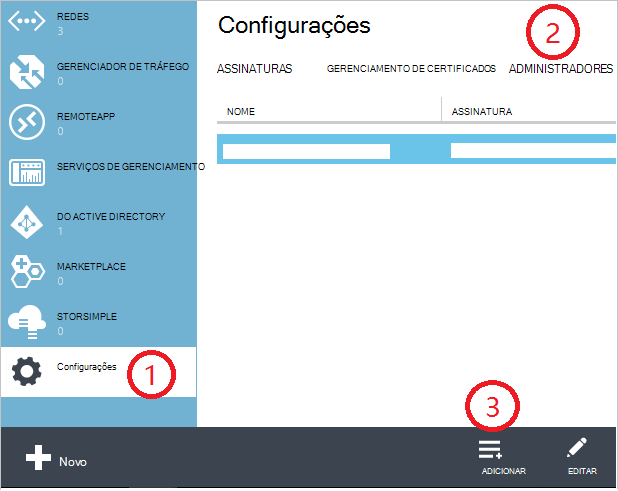

<properties
    pageTitle="Como adicionar ou alterar as funções de administrador Azure | Microsoft Azure"
    description="Descreve como adicionar ou alterar o administrador de colegas do Azure, o administrador do serviço e o administrador de conta"
    services=""
    documentationCenter=""
    authors="genlin"
    manager="mbaldwin"
    editor=""
    tags="billing"/>

<tags
    ms.service="billing"
    ms.workload="na"
    ms.tgt_pltfrm="na"
    ms.devlang="na"
    ms.topic="article"
    ms.date="08/17/2016"
    ms.author="genli"/>

# Como adicionar ou alterar as funções de administrador do Azure

Há três tipos de funções de administrador no Microsoft Azure:

| Função administrativa   | Limite  | Descrição
| ------------- | ------------- |---------------|
|Administrador de conta (AA)  | 1 por conta do Azure  |Esta é a pessoa que assinou ou comprou assinaturas do Azure e está autorizada a acessar o [Centro de conta](https://account.windowsazure.com/Home/Index) e realizar várias tarefas de gerenciamento. Eles incluem poder criar assinaturas, cancelar inscrições, altere a cobrança para uma assinatura e alterar o administrador do serviço.
| Administrador do serviço (SA) | 1 por assinatura do Azure  |Esta função está autorizada a gerenciar serviços no [portal do Azure](https://portal.azure.com). Por padrão, para uma nova assinatura, o administrador da conta também é o administrador do serviço.|
|Co (CA) de administrador no [portal clássico Azure](https://manage.windowsazure.com)|200 por assinatura| Esta função tem os mesmos privilégios de acesso como administrador do serviço, mas não pode alterar a associação de assinaturas para diretórios Azure. |

> [AZURE.NOTE] Azure controle de acesso baseado em função do Active Directory (RBAC) permite que os usuários a serem adicionados a várias funções. Para obter mais informações, consulte [Controle de acesso baseado em função do Azure Active Directory](./active-directory/role-based-access-control-configure.md).

> [AZURE.NOTE] Se precisar de mais ajuda a qualquer momento neste artigo, por favor, [contate o suporte](https://portal.azure.com/?#blade/Microsoft_Azure_Support/HelpAndSupportBlade) para obter o problema resolvido rapidamente.

## Como adicionar um administrador para uma assinatura

**Portal do Azure**

1. Entrar no [portal do Azure](https://portal.azure.com).

2. No menu Hub, selecione **assinatura** > *a assinatura que deseja que o administrador para acessar*.

    

3. A lâmina de assinatura, selecione **configurações de**> **usuários**.

    
4. Na lâmina usuários, selecione **Adicionar**>**Selecionar uma função** > **proprietário**.

    

    **Observação**
    - A função de proprietário tem os mesmos privilégios de acesso como administrador colegas. Esta função não tem privilégios de acesso para o [Centro de contas do Azure](https://account.windowsazure.com/subscriptions).
    - Os proprietários que você adicionou por meio do [portal do Azure](https://portal.azure.com) não podem gerenciar serviços no [Azure portal clássico](https://manage.windowsazure.com).  

5. Digite o endereço de email do usuário que você deseja adicionar como proprietário, clique no usuário e, em seguida, clique em **Selecionar**.

    

**Azure portal clássico**

1. Entrar no [portal clássico Azure](https://manage.windowsazure.com/).

2. No painel de navegação, selecione **configurações**> **administradores**> **Adicionar**.  

    

3. Digite o endereço de email da pessoa que você deseja adicionar como colega administrador e, em seguida, selecione a assinatura que deseja que o administrador co para acessar. 

     

O endereço de email a seguir pode ser adicionado como um administrador de colegas:

* **Conta da Microsoft** (antigo Windows Live ID)  
 Você pode usar uma Account da Microsoft para entrar todos os produtos da Microsoft orientados a clientes e serviços, como o Outlook (Hotmail), Skype (MSN), OneDrive, Windows Phone e Xbox LIVE em nuvem.
* **Conta institucional** 
 Uma conta organizacional é uma conta criada no Active Directory do Azure. O endereço de uma conta organizacional semelhante ao seguinte: user@ &lt;seu domínio&gt;. onmicrosoft.com

### Restrições e limitações

 * Cada assinatura está associada um diretório do Azure AD (também conhecido como o diretório padrão). Para localizar o diretório padrão a assinatura está associada, acesse o [portal clássico Azure](https://manage.windowsazure.com/), selecione **configurações** > **assinaturas**. Verifique a identificação de assinatura para localizar o diretório padrão.

 * Se você estiver conectado com um Account da Microsoft, você só pode adicionar outros Accounts da Microsoft ou usuários dentro do diretório padrão como administrador colegas.

 * Se você estiver conectado com uma conta institucional, você pode adicionar outras contas organizacionais em sua organização como administrador colegas. Por exemplo, abby@contoso.com pode adicionar bob@contoso.com como administrador de serviço ou colegas, mas não é possível adicionar john@notcontoso.com , a menos que john@noncontoso.com é o usuário no diretório padrão. Usuários conectados com contas organizacionais podem continuar a adicionar usuários do Microsoft Account como administrador de serviço ou colegas.

 * Agora que é possível fazer login no Azure com uma conta institucional, aqui estão as alterações em requisitos de conta de administrador de serviço e colegas administrador:

    Método login| Adicionar usuários dentro do diretório padrão ou Account Microsoft como autoridade de certificação ou SA?  |Adicionar uma conta organizacional na mesma organização como autoridade de certificação ou SA? |Adicionar uma conta organizacional em organização diferente como autoridade de certificação ou SA?
    ------------- | ------------- |---------------|---------------
    Conta da Microsoft |Sim|Não|Não
    Conta institucional|Sim|Sim|Não

## Como alterar o administrador do serviço para uma assinatura

Somente o administrador de conta pode alterar o administrador do serviço para uma assinatura.

1. Faça logon no [Centro de conta do Azure](https://account.windowsazure.com/subscriptions) usando o administrador de conta.

2. Selecione a assinatura que você deseja alterar.

3. No lado direito, clique em **Editar assinatura** detalhes.  

    

4. Na caixa **Administrador de serviço** , insira o endereço de email do administrador do serviço novo.  

    

## Como alterar o administrador de conta

Para transferir a propriedade da conta do Azure para outra conta, consulte [Transferindo posse de uma assinatura do Azure](billing-subscription-transfer.md).

## Próximas etapas

* Para saber mais sobre como acessar recursos é controlada no Microsoft Azure, consulte [Noções básicas sobre o acesso de recurso no Azure](./active-directory/active-directory-understanding-resource-access.md)

* Para saber mais sobre como o Active Directory do Azure se relaciona a sua assinatura do Azure, consulte [como Azure assinaturas são associadas com o Active Directory do Azure](./active-directory/active-directory-how-subscriptions-associated-directory.md)

* Para obter mais informações sobre como o Active Directory do Azure se relaciona a sua assinatura do Azure, consulte [Atribuindo funções de administrador no Active Directory do Azure](./active-directory/active-directory-assign-admin-roles.md)

> [AZURE.NOTE] Se você ainda tiver mais perguntas, por favor [contate o suporte](https://portal.azure.com/?#blade/Microsoft_Azure_Support/HelpAndSupportBlade) para obter o problema resolvido rapidamente.
