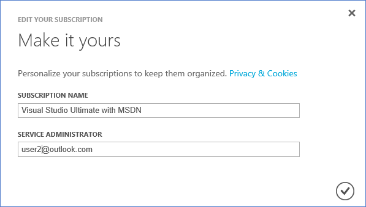
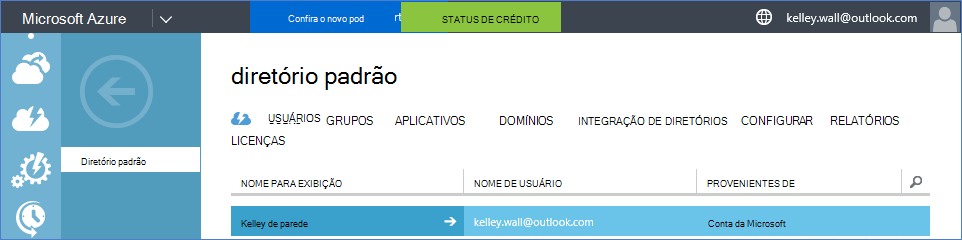
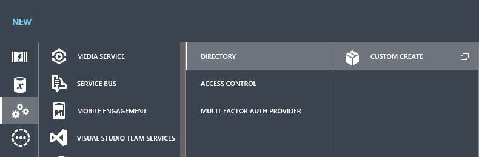
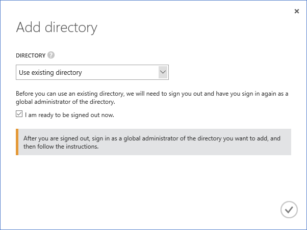
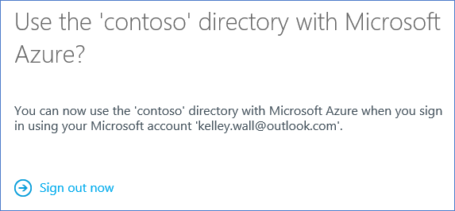

<properties
    pageTitle="Usar um locatário do Office 365 com uma assinatura do Azure | Microsoft Azure"
    description="Saiba como adicionar um diretório do Office 365 (Locatário) uma assinatura do Azure para fazer a associação."
    services=""
    documentationCenter=""
    authors="JiangChen79"
    manager="mbaldwin"
    editor=""
    tags="billing,top-support-issue"/>

<tags
    ms.service="billing"
    ms.workload="na"
    ms.tgt_pltfrm="ibiza"
    ms.devlang="na"
    ms.topic="article"
    ms.date="09/16/2016"
    ms.author="cjiang"/>

# Associar um locatário do Office 365 com uma assinatura do Azure
Se você tiver adquirido assinaturas do Azure e o Office 365 separadamente no passado e agora você deseja poder acessar o locatário do Office 365 da assinatura Azure, é fácil fazer isso. Este artigo mostra como fazer isso.

> [AZURE.NOTE] Este artigo não se aplica aos clientes Enterprise Agreement (EA).

## Guia rápido
Para associar seu locatário do Office 365 com sua assinatura do Azure, use sua conta do Azure para adicionar seu locatário do Office 365 e associar sua assinatura do Azure o locatário do Office 365.

## Etapas detalhadas
Neste cenário, Kelley Wall é um usuário que tenha uma assinatura do Azure sob a conta kelley.wall@outlook.com. Kelley também tem uma assinatura do Office 365 sob a conta kelley.wall@contoso.onmicrosoft.com. Kelley quiser acessar o locatário do Office 365 com a assinatura do Azure.

### Pré-requisitos
Para que a associação funcione corretamente, os seguintes pré-requisitos são necessários:

- Você precisa as credenciais de administrador do serviço da assinatura do Azure. Coadministradores não é possível executar um subconjunto das etapas.
- Você precisa as credenciais de um administrador global do Office 365 locatário.
- O endereço de email do administrador do serviço não deve estar contido no locatário Office 365.
- O endereço de email do administrador do serviço não deve corresponder de qualquer administrador global do Office 365 locatário.
- Se você estiver usando um endereço de email que é uma conta da Microsoft e uma conta organizacional, altere temporariamente o administrador de serviço da sua assinatura do Azure para usar outra conta da Microsoft. Você pode criar uma nova conta do Microsoft na [página de inscrição de conta Microsoft](https://signup.live.com/).

Para alterar o administrador do serviço, siga estas etapas:

1. Entrar no [portal de gerenciamento de conta](https://account.windowsazure.com/subscriptions).
2. Selecione a assinatura que você deseja alterar.
3. Selecione **Editar detalhes da assinatura**.

    

4. Na caixa **Administrador de serviço** , insira o endereço de email do administrador do serviço novo.

    

### Associar o locatário do Office 365 com a assinatura do Azure
Para associar a assinatura do Azure o locatário do Office 365, siga estas etapas:

1.  Entrar no [portal de gerenciamento de conta](https://account.windowsazure.com/subscriptions) com as credenciais de administrador de serviço.
2.  No painel esquerdo, selecione **ACTIVE DIRECTORY**.

    

    > [AZURE.NOTE] Você não verá o locatário do Office 365. Se você vir, ignore a próxima etapa.

    

3. Adicione o locatário do Office 365 à sua assinatura do Azure.

    a. Selecione **novo** > **diretório** > **Criar personalizada**.

    

    b. Na página **Adicionar diretório** , em **diretório**, selecione **usar o diretório existente**. Selecione **estou pronto para ser assinado agora**e selecione **completa** .

    

    c. Depois que você está desconectado, entre com as credenciais do administrador global do seu locatário do Office 365.

    

    d. Selecione **continuar**.

    

    e. Selecione **sair agora**.

    

    f. Entrar no [portal de gerenciamento de conta](https://account.windowsazure.com/subscriptions) com as credenciais de administrador de serviço.

    

    g. Você deve ver seu locatário do Office 365 no painel de controle.

    

4. Altere o diretório associado a assinatura do Azure.

    a. Selecione **configurações**.

    

    b. Selecione a sua assinatura do Azure e selecione **Editar diretório**.
    

    c. Selecione **Avançar** .

    

    > [AZURE.WARNING] Você receberá um aviso de que todos os administradores de colegas serão removidos.

    

    >[AZURE.WARNING] Além disso, todos os usuários de [controle de acesso baseado em função (RBAC)](./active-directory/role-based-access-control-configure.md) com acesso atribuído nos grupos de recursos existentes também serão removidos. No entanto, o aviso recebido apenas menciona a remoção da coadministradores.

    

    d. Selecione **completa** .

5. Agora você pode adicionar suas contas organizacionais do Office 365 como coadministradores locatários Azure Active Directory.

    a. Selecione a guia **administradores** e selecione **Adicionar**.

    

    b. Insira uma conta organizacional do seu locatário do Office 365, selecione a assinatura do Azure e, em seguida, selecione **completa** .

    

    c. Volte para a guia de **administradores** . Você deve ver a conta organizacional exibida como administrador colegas.

    

6. Em seguida você pode testar o acesso com o administrador de colegas.

    a. Saia do portal de gerenciamento de conta.

    b. Abra o [portal de gerenciamento de conta](https://account.windowsazure.com/subscriptions) ou o [portal do Azure](https://portal.azure.com/).

    c. Se a página de entrada Azure tem um link de **entrar com sua conta de organização**, selecione o link. Caso contrário, pule esta etapa.

    

    d. Insira as credenciais do administrador colegas e selecione **entrar**.

    

## Próximas etapas
Cenários relacionados incluem:

- Você já tiver uma assinatura do Office 365 e está pronto para uma assinatura do Azure, mas que você deseja usar as contas de usuário existentes do Office 365 para sua assinatura do Azure.
- Você é um assinante do Azure e deseja obter uma assinatura do Office 365 para os usuários na sua instância do Active Directory do Azure existente.

Para aprender a realizar essas tarefas, consulte [usar de conta existente do Office 365 com sua assinatura do Azure, ou vice-versa](billing-use-existing-office-365-account-azure-subscription.md).
