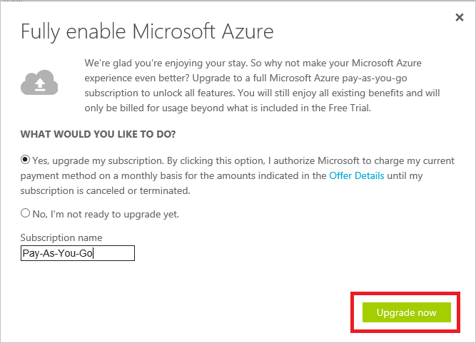

<properties
    pageTitle="Como se inscrever no, comprar, atualizar ou ativar uma assinatura do Azure | Microsoft Azure"
    description="Descreve como comprar ou inscrever-se para uma assinatura do Azure"
    services=""
    documentationCenter=""
    authors="genlin"
    manager="mbaldwin"
    editor=""
    tags="billing,top-support-issue"
    />

<tags
    ms.service="billing"
    ms.workload="na"
    ms.tgt_pltfrm="na"
    ms.devlang="na"
    ms.topic="article"
    ms.date="09/23/2016"
    ms.author="genli"/>

# Como se inscrever, comprar, atualizar ou ativar o Azure

> [AZURE.NOTE] Se precisar de mais ajuda a qualquer momento neste artigo, por favor, [contate o suporte](https://portal.azure.com/?#blade/Microsoft_Azure_Support/HelpAndSupportBlade) para obter o problema resolvido rapidamente.

Azure fornece diversas ofertas para atender às suas necessidades de negócios e começar a usar o Azure. Visite [Azure oferece](https://azure.microsoft.com/support/legal/offer-details/) para uma listagem completa de todas as ofertas de ativas com detalhes sobre cada oferta sobre o que eles folha de rosto, benefícios e disponibilidade por países/região.

## Azure oferece - benefícios e limites

A tabela a seguir fornece detalhes sobre ofertas comuns:

| Oferta                                                                              | Detalhes |
|--------------------------------------------------------------------------------------|---------|
| Avaliação gratuita                                                                           |• [Guia de inscrição e passo a passo](billing-buy-sign-up-azure-subscription.md#SignupFreeTrial) • [Benefícios](https://azure.microsoft.com/pricing/free-trial/) • [Perguntas Frequentes](https://azure.microsoft.com/pricing/free-trial-faq/) • [Avaliação gratuita para pré-pago de atualização](billing-buy-sign-up-azure-subscription.md#UpgradeFreeToPYG)     |
| Pré-pago                                                                        | • [Inscrição](https://azure.microsoft.com/pricing/purchase-options/) • [Preços](https://azure.microsoft.com/pricing/)   |
| MPN (Microsoft Partner Network) - os membros receberão mensais créditos Azure sem nenhum custo | • [Benefícios do azure para parceiros](https://azure.microsoft.com/offers/ms-azr-0025p/) • [Registrar como um parceiro](http://go.microsoft.com/fwlink/?linkid=309258&clcid=0x409) ou [inscrever-se Microsoft Action pack](http://go.microsoft.com/fwlink/?linkid=525768&clcid=0x409) • Use créditos Azure - acessar o [portal MPN](https://partner.microsoft.com) e verificar seu status de qualificação e siga as etapas em chaves de Software e benefícios. Se você não consegue confirmar sua qualificação, contate [MPN oferece suporte](https://partner.microsoft.com/Support/).   |
| Assinante MSDN & Visual Studio                                                      |• [Benefícios de desenvolvimento/teste do MSDN](https://azure.microsoft.com/offers/ms-azr-0023p/) • [Benefícios de assinante do visual Studio](https://azure.microsoft.com/pricing/member-offers/msdn-benefits-details/) • [Ativar Visual Studio assinante crédito Azure](https://azure.microsoft.com/pricing/member-offers/msdn-benefits-details/) • [Ativar MSDN Azure benefícios em três etapas simples](https://www.youtube.com/watch?v=SN2CA71uOEI&feature=youtu.be):  Logon para [a página de conta MSDN](https://msdn.microsoft.com/subscriptions/manage/default.aspx) e confirmar qualificação, clique em 'Ativar Azure benefício'. Se você não consegue confirmar sua qualificação, contate os [Centros de serviço de cliente de assinaturas do MSDN](https://msdn.microsoft.com/subscriptions/contactus.aspx).|
| BizSpark                                                                             | • [Benefícios BizSpark](https://www.microsoft.com/bizspark/default.aspx#start-two). Para obter mais detalhes, consulte [crédito Azure mensal para Visual Studio Enterprise](https://azure.microsoft.com/offers/ms-azr-0064p/) • [Ingressar BizSpark](https://www.microsoft.com/bizspark/signup/default.aspx). Se você encontrar problemas, entre em contato com a [Equipe de BizSpark](mailto:bizspark@microsoft.com?subject=BizSpark%20Support&body=Thank%20you%20for%20contacting%20BizSpark.%20Please%20provide%20as%20much%20of%20the%20following%20information%20as%20possible,%20as%20it%20will%20help%20expedite%20our%20response%20to%20you.%0aContact%20name:%0aStartup%20name:%0aMicrosoft%20Account/Live%20ID:%0aSpecific%20description%20of%20issue%20experienced%20or%20question:%0a%0aThank%20you,%0a%0aThe%20BizSpark%20Team).      |
| Sinal de mais de BizSpark                                                                        |• [Saiba mais sobre a adição de BizSpark](https://www.microsoft.com/bizspark/plus/default.aspx). Para obter mais detalhes, consulte [Os benefícios de Plus BizSpark](https://azure.microsoft.com/offers/ms-azr-0149p/) • [BizSpark ingressar](https://www.microsoft.com/bizspark/signup/default.aspx) e trabalhe com seu parceiro contato para atualizar para o sinal de mais de BizSpark. Se você encontrar problemas, entre em contato com a [Equipe de BizSpark](mailto:bizspark@microsoft.com?subject=BizSpark%20Support&body=Thank%20you%20for%20contacting%20BizSpark.%20Please%20provide%20as%20much%20of%20the%20following%20information%20as%20possible,%20as%20it%20will%20help%20expedite%20our%20response%20to%20you.%0aContact%20name:%0aStartup%20name:%0aMicrosoft%20Account/Live%20ID:%0aSpecific%20description%20of%20issue%20experienced%20or%20question:%0a%0aThank%20you,%0a%0aThe%20BizSpark%20Team).     |
| Revendedores (programas de licenciamento por Volume aberto)                                             |• [Serviço ativar Online chave - guia passo a passo](billing-buy-sign-up-azure-subscription.md#activateKey) • [Compra, benefícios, ativar](https://azure.microsoft.com/offers/ms-azr-0111p/)        |
| EA (contrato Enterprise)                                                            |• [Licenciamento do Azure para a empresa](https://azure.microsoft.com/pricing/enterprise-agreement/) • Para ativar, entre em contato com seu gerente de conta da Microsoft ou o revendedor começar hoje     |

## Inscrever-se para uma assinatura de avaliação gratuita do Azure

Para inscrever-se para uma assinatura de avaliação gratuita do Azure, você deve fornecer um número de telefone, um cartão de crédito e uma Account da Microsoft. Sua conta da Microsoft é o endereço de email que você usa, juntamente com sua senha para entrar em qualquer programa do Windows Live ou serviço, como o Outlook, Hotmail ou OneDrive. Você pode configurar uma conta da Microsoft usando qualquer endereço de email que pertencem a você, incluindo seu email da empresa. Consulte [Perguntas frequentes sobre conta da Microsoft](https://www.microsoft.com/account/faq.aspx) para obter mais detalhes.

Se você encontrar problemas, consulte [Solucionar problemas de inscrição do Azure](billing-troubleshoot-azure-sign-up-issues.md) .

>[AZURE.NOTE] Os detalhes de cartões de crédito e número de telefone são usados apenas para verificar sua identidade. Apesar de não ser cobrado seu cartão de crédito, o Microsoft colocará um bloqueio de autorização em uma quantidade mínima verificar se o cartão de crédito é válido. A suspensão será lançada dentro de 3 a 5 dias úteis, dependendo das políticas da sua instituição financeira.

1. Abra a [página de avaliação gratuita Azure](https://azure.microsoft.com/pricing/free-trial/)e selecione **Iniciar agora**.

2. Entrar com sua conta da Microsoft ou conta organizacional.

3. Na seção **sobre você** , insira suas informações pessoais. [Saiba mais](billing-troubleshoot-azure-sign-up-issues.md#i-am-getting-an-error-when-entering-my-information-to-sign-up) sobre a inserção de suas informações pessoais com precisão.

    

    >[AZURE.NOTE] As informações de endereço e país de email que você fornecer ao se inscrever para uma assinatura do Azure sempre será associadas à assinatura e não podem ser alteradas posteriormente.

4. Na seção **verificação por telefone** , você deve fornecer um número de telefone para receber um código de verificação que você pode fornecer para concluir o processo de verificação.

    Você pode optar por receber o código de verificação, como uma mensagem de texto ou através de uma chamada de voz. Faça sua escolha selecionando **Enviar mensagem de texto** ou **telefonar para mim**. Selecione o código de discagem internacional para seu país na primeira caixa e insira seu número de telefone na segunda caixa. Depois de receber o código de verificação, insira-o na terceira caixa e selecione o botão **Verificar código** . [Consulte este artigo para obter mais detalhes](billing-troubleshoot-azure-sign-up-issues.md#i-am-not-getting-text-messages-or-calls-during-account-verification-when-i-try-to-sign-up).

    >[AZURE.NOTE] Você não pode usar um número de telefone VOIP para o processo de verificação de telefone.

    

    Se você não receber uma mensagem de texto ou uma chamada, tente usar um número de telefone diferente ou contate o [Suporte do Azure](https://portal.azure.com/#blade/Microsoft_Azure_Support/HelpAndSupportBlade) para obter ajuda.

5. Na seção **verificação por cartão** , insira os detalhes de um cartão de crédito válido. Essas informações são coletadas somente para verificar sua identidade.

    Se você receber um erro após enviar suas informações de cartão de crédito, consulte o artigo [Meu cartão de crédito não dar uma olhada ao tentar se inscrever no Azure](billing-credit-card-fails-during-azure-sign-up.md).

    

6. Na seção de **contrato** , marque a caixa se você concordar com o contrato de assinatura, detalhes de oferta e política de privacidade. Selecione **inscrever-se**. O formulário de contrato pode variar por país.

    

    Pode levar alguns minutos para configurar a sua assinatura. Se a configuração de assinatura não for concluída em 15 minutos, contate o [Suporte do Azure](https://portal.azure.com/#blade/Microsoft_Azure_Support/HelpAndSupportBlade) para obter assistência.

    > [AZURE.NOTE] Se você receber uma mensagem de erro, siga as etapas na mensagem para resolver o problema. Uma mensagem de erro típica é:

    > **Desculpe, que não foi possível concluir a operação. Tente novamente mais tarde ou recarregar a página da web**

    > Nesse caso, tente usar outro navegador para concluir o processo de inscrição. Se o problema persistir, contate o [Suporte do Azure](https://portal.azure.com/#blade/Microsoft_Azure_Support/HelpAndSupportBlade) para obter ajuda.

7. Quando a assinatura está pronta, selecione **Iniciar gerenciamento meu serviço** para começar.

    

### Recursos adicionais

- [Não é possível ativar o uma avaliação gratuita do Azure](billing-troubleshoot-azure-sign-up-issues.md#i-cant-activate-an-azure-free-trial)
- [Avaliação gratuita azure perguntas Frequentes](https://azure.microsoft.com/pricing/free-trial-faq/).

## Atualizar Azure avaliação gratuita para pré-pago

1. Faça logon no [Portal de conta do Azure](https://account.windowsazure.com/subscriptions) usando a conta da Microsoft ou sua conta organizacional que você usou para inscrever-se para a avaliação gratuita.

2. Selecione a assinatura e selecione **Atualizar**

    

3. Selecione **Sim**e selecione **Atualizar agora**.

    

Quando você atualiza de uma assinatura de avaliação gratuita para uma assinatura de pré-pago, qualquer benefícios esquerda ao longo de sua avaliação gratuita como o limite de 30 dias ou o crédito de r $200 usar em serviços do Azure continuará até que um deles acabar. A atualização de assinatura acontecerá posteriormente.

## Ativar usando uma chave de ativação de serviço Online

Se você comprou o **Azure aberto em** créditos de um revendedor e você tem uma chave de ativação (chave de 5 x 5), siga estas etapas para ativar sua assinatura:

1. Vá para a [página de resumo de assinatura](https://account.windowsazure.com/subscriptions).

2. Selecione **Azure em Abrir**. Na página do [Azure na chave de licença aberta](https://azure.microsoft.com/offers/ms-azr-0111p/) , selecione **Ativar uma nova assinatura ou assinatura existente**.

3. Insira a chave do produto e, em seguida, marque a opção de contrato.

> [AZURE.NOTE] Se você ainda tiver mais perguntas, por favor, [contate o suporte](https://portal.azure.com/?#blade/Microsoft_Azure_Support/HelpAndSupportBlade) para obter o problema resolvido rapidamente.
