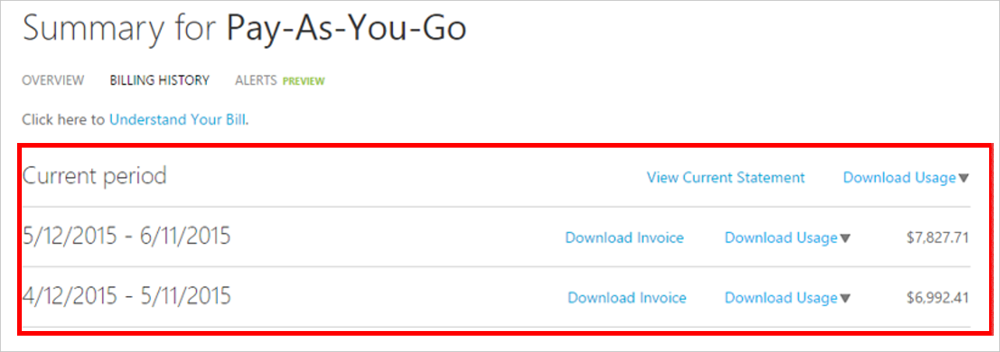

<properties
    pageTitle="Como baixar o Azure dados de uso diariamente e de nota fiscal de cobrança | Microsoft Azure"
    description="Descreve como baixar sua fatura de cobrança Azure e dados de uso diárias"
    services=""
    documentationCenter=""
    authors="genlin"
    manager="mbaldwin"
    editor=""
    tags="billing"
    />

<tags
    ms.service="billing"
    ms.workload="na"
    ms.tgt_pltfrm="na"
    ms.devlang="na"
    ms.topic="article"
    ms.date="10/10/2016"
    ms.author="genli"/>

# Como baixar o Azure dados de uso diariamente e de nota fiscal de cobrança

> [AZURE.NOTE] Se precisar de mais ajuda a qualquer momento neste artigo, por favor, [contate o suporte](https://portal.azure.com/?#blade/Microsoft_Azure_Support/HelpAndSupportBlade) para obter o problema resolvido rapidamente.

Como o administrador de conta do Azure, você pode exibir a fatura de cobrança e os dados para uso diárias do [portal do Azure](https://portal.azure.com) ou o [Centro de contas do Azure](https://account.windowsazure.com/subscriptions). Veja como:

## Portal do Azure

1. Entre no [portal do Azure](https://portal.azure.com) como o administrador da conta.

    >[AZURE.NOTE] Somente o administrador de conta tem permissão para acessar os dados de cobranças. Para obter mais informações sobre como descubro quem é o administrador de conta da assinatura, consulte as [Perguntas frequentes](billing-subscription-transfer.md#faq).

2. No menu Hub, selecione a **cobrança**. Na lâmina **de cobrança** , você pode encontrar algumas informações úteis, como a próxima data de cobrança.

    
3. Na seção de **custos de assinatura** , selecione a assinatura que você deseja exibir.

    
4. Clique em **cobrança e uso**.

    

5. Na lâmina **histórico de cobrança** , clique em **Baixar fatura** para exibir uma cópia da sua fatura. Clique em um período de cobrança para exibir os dados de uso diário.

    

## Centro de contas do Azure

1. Entre no [Centro de contas do Azure](https://account.windowsazure.com/subscriptions) como o administrador da conta.
2. Selecione a assinatura à qual você deseja que as informações de fatura e o uso.
3. Selecione **histórico de cobrança**.  
4. Você pode ver suas instruções para os últimos seis períodos de cobranças e o período não cobrado atual.   
5. Selecione **Exibir a declaração atual** para ver uma estimativa das taxas no momento em que a estimativa foi gerada. Essas informações só são atualizadas diariamente e podem não incluir todos os seu uso. Sua fatura mensal pode diferir essa estimativa.   
6. Selecione **Baixar fatura** para ver uma cópia da sua última fatura.  
7. Selecione o **Uso de Download** para baixar os dados de uso diário, como um arquivo CSV. 

> [AZURE.NOTE] Se você ainda tiver mais perguntas, por favor, [contate o suporte](https://portal.azure.com/?#blade/Microsoft_Azure_Support/HelpAndSupportBlade) para obter o problema resolvido rapidamente.
