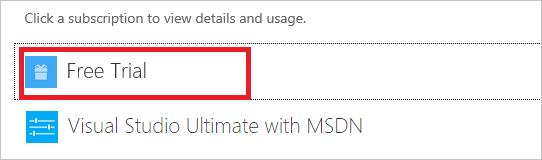
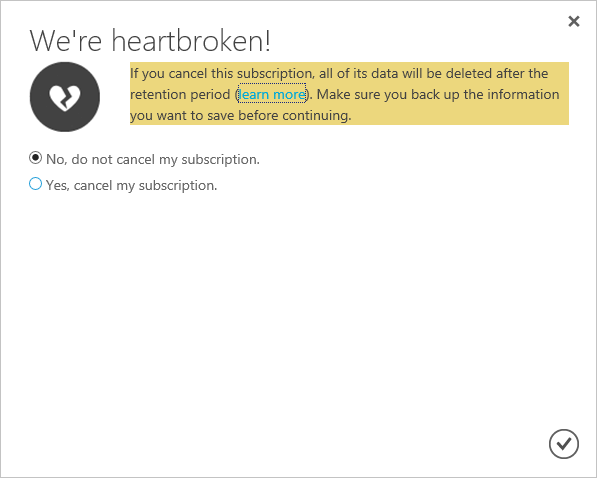

<properties
    pageTitle="Cancelar sua assinatura do Azure | Microsoft Azure"
    description="Descreve como cancelar sua assinatura do Azure, como a assinatura de avaliação gratuita"
    services=""
    documentationCenter=""
    authors="genlin"
    manager="mbaldwin"
    editor=""
    tags="billing"
    />

<tags
    ms.service="billing"
    ms.workload="na"
    ms.tgt_pltfrm="na"
    ms.devlang="na"
    ms.topic="article"
    ms.date="09/26/2016"
    ms.author="genli"/>

# Cancelar sua assinatura do Azure

Cancele sua assinatura Azure no [Centro de contas do Azure](https://account.windowsazure.com/subscriptions). Depois que você cancelar a assinatura, seu acesso a serviços Azure e recursos terminará.

Antes de cancelar sua assinatura:

- Fazer backup de seus dados. Por exemplo, se você está armazenando dados no armazenamento do Azure ou SQL, baixe uma cópia. Se você tiver uma máquina virtual, salve uma imagem dele localmente.

- Desligar seus serviços. Vá para a [página de recursos no portal de gerenciamento](https://ms.portal.azure.com/?flight=1#blade/HubsExtension/Resources/resourceType/Microsoft.Resources%2Fresources)e **Parar** qualquer máquinas virtuais em execução, aplicativos ou outros serviços.

Se você cancelar um paga [plano de suporte do Azure](https://azure.microsoft.com/support/plans/), você ainda será cobrado mensalmente para o restante do termo 6 meses.

## Cancelar assinatura

1. Faça logon no [Centro de contas do Azure](https://account.windowsazure.com/subscriptions) como o administrador de conta.

2. Em **clique em uma assinatura para exibir detalhes e uso**, selecione a assinatura que você deseja cancelar. 

    

3. No lado direito da página, selecione **Cancelar assinatura**.
    
    

4. Selecione **Sim, cancelar minha assinatura**.
    
    

5. Clique em  para fechar a janela da caixa de diálogo e retornar à página de inscrição.

Depois que você cancelar sua assinatura, podemos esperar 90 dias antes de excluir permanentemente os seus dados caso você precise acessá-lo ou mudar de ideia. Para obter mais informações, consulte [Microsoft Trust Center - como podemos gerenciar seus dados](https://go.microsoft.com/fwLink/p/?LinkID=822930&clcid=0x409).

## Reativar assinatura

Se você cancelou sua assinatura flexível acidentalmente, você poderá [reativá-la no Centro de contas](billing-subscription-become-disable.md#how-to-re-enable-non-pay-as-you-go-subscriptions).

## Precisa de ajuda? Contate o suporte.

Se você ainda tiver mais perguntas, por favor, [contate o suporte](https://portal.azure.com/?#blade/Microsoft_Azure_Support/HelpAndSupportBlade) para obter o problema resolvido rapidamente.
