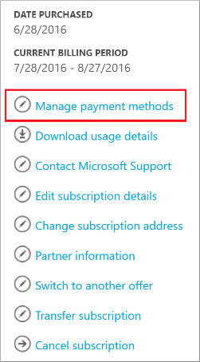

<properties
    pageTitle="Como alterar o cartão de crédito usado para pagar uma assinatura do Azure | Microsoft Azure"
    description="Descreve como alterar o cartão de crédito usado para pagar uma assinatura do Azure"
    services=""
    documentationCenter=""
    authors="genlin"
    manager="mbaldwin"
    editor=""
    tags="billing"
    />

<tags
    ms.service="billing"
    ms.workload="na"
    ms.tgt_pltfrm="na"
    ms.devlang="na"
    ms.topic="article"
    ms.date="08/24/2016"
    ms.author="genli"/>

# Como alterar o cartão de crédito usado para pagar uma assinatura do Azure

Às vezes, talvez seja necessário atualizar os detalhes do cartão de crédito suas informações de conta ou alterar o cartão usado para pagar sua fatura.

Se seu cartão de crédito obtém renovado e o número permanece o mesmo, você pode simplesmente atualizar os detalhes do cartão de crédito existente, como data de expiração.

Se seu número de cartão de crédito mudar, devido a sendo perdido, roubado ou expirado, você precisa adicionar o novo cartão de crédito à sua conta. Isso ocorre porque o código de segurança CVV no cartão é alterado quando altera o número de cartão de crédito.

> [AZURE.NOTE] Se precisar de mais ajuda a qualquer momento neste artigo, por favor, [contate o suporte](https://portal.azure.com/?#blade/Microsoft_Azure_Support/HelpAndSupportBlade) para obter o problema resolvido rapidamente.

## Editar informações de pagamento para um cartão de crédito existente
1. Faça logon para o [Centro de contas do Azure](https://account.windowsazure.com/Subscriptions) como o administrador da conta. No [portal do Azure](https://portal.azure.com), você pode acessar o Centro de conta selecionando **assinatura**>*o nome da assinatura*>**Gerenciar**.

    > [AZURE.NOTE] Somente o administrador de conta tem permissão para acessar o Centro de conta. Para obter mais informações sobre o administrador de conta, veja [como adicionar ou alterar funções de administrador Azure](billing-add-change-azure-subscription-administrator.md).

2. Em **clique em uma assinatura para exibir detalhes e uso**, selecione a assinatura que esteja vinculada ao cartão de crédito.  
3. No lado direito da página, selecione **Gerenciar métodos de pagamento**.  
4. Na página **Gerenciar métodos de pagamento** , selecione **Editar** ao lado do número de cartão de crédito.  
5. Na página **Editar** , verifique se você selecionou o número de tipo e cartão de cartão de crédito correto.
6. Faça as alterações que necessárias para os detalhes do cartão e selecione **Avançar** para a página de **método de pagamento de escolha** .

## Adicionar um novo cartão de crédito como um método de pagamento
1. Faça logon no [Centro de contas do Azure](https://account.windowsazure.com/Subscriptions) como o administrador de conta.
2. Em **clique em uma assinatura para exibir detalhes e uso**, selecione a assinatura à qual você deseja adicionar um novo método de pagamento.
3. No lado direito da página, selecione **Gerenciar métodos de pagamento**.
4. Na página **Gerenciar métodos de pagamento** , selecione "+" para adicionar um novo cartão de crédito.
5. Escolha um tipo de cartão de crédito e forneça todas as informações necessárias.
6. Selecione **Avançar** para retornar à página **Gerenciar métodos de pagamento** . Se o cartão adicionado for válido, ele será adicionado à lista de métodos de pagamento disponíveis.

## Alterar o cartão de crédito que você usa para pagar uma fatura Azure
1. Faça logon no [Centro de contas do Azure](https://account.windowsazure.com/Subscriptions) como o administrador de conta.
2. Em **clique em uma assinatura para exibir detalhes e uso**, selecione a assinatura à qual você deseja atualizar o método de pagamento.
3. No lado direito da página, selecione **Gerenciar métodos de pagamento**.
4. Na página **Gerenciar métodos de pagamento** , clique em **Usar em vez disso,** para selecionar o cartão de crédito que você deseja usar.

## Remover um cartão de crédito da conta
1. Faça logon no [Centro de contas do Azure](https://account.windowsazure.com/Subscriptions) como o administrador de conta.
2. Em **clique em uma assinatura para exibir detalhes e uso**, selecione a assinatura à qual você deseja atualizar o método de pagamento.
3. No lado direito da página, selecione **Gerenciar métodos de pagamento**.
4. Na página **Gerenciar métodos de pagamento** , clique em **Excluir** para selecionar o cartão de crédito que você deseja excluir.

    > [AZURE.NOTE] Você não poderá excluir um cartão de crédito, se ele está associado a outras assinaturas do Microsoft active. Se você receber um erro que o cartão está em uso, certifique-se de que ele seja desassociado todas as assinaturas ativas que você tem com a Microsoft.

> [AZURE.NOTE] Se você ainda tiver mais perguntas, por favor, [contate o suporte](https://portal.azure.com/?#blade/Microsoft_Azure_Support/HelpAndSupportBlade) para obter o problema resolvido rapidamente.
