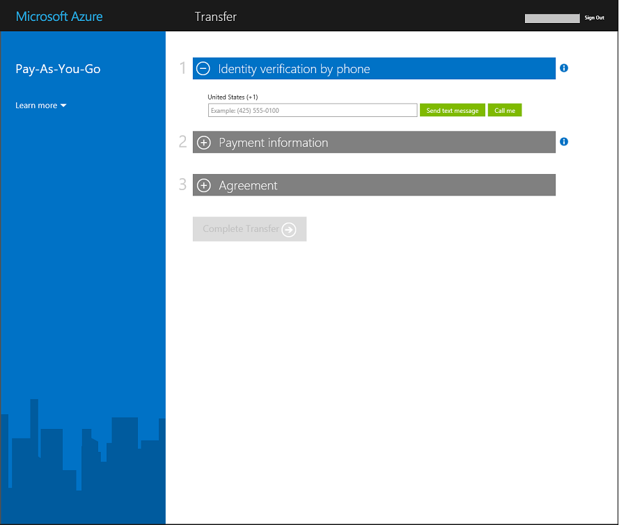

<properties
   pageTitle="Transferindo a propriedade de uma assinatura do Azure | Microsoft Azure"
   description="Como transferir uma assinatura do Azure para outro usuário e algumas perguntas frequentes (FAQ) sobre o processo"
   services=""
   documentationCenter=""
   authors="genlin"
   manager="stevenpo"
   editor=""
   tags="billing,top-support-issue"/>

<tags
   ms.service="billing"
   ms.workload="na"
   ms.tgt_pltfrm="na"
   ms.devlang="na"
   ms.topic="article"
   ms.date="10/10/2016"
   ms.author="genli"/>

# Transferindo a propriedade de uma assinatura do Azure

Faça você:

- Você precisa passar cobrança a propriedade da sua assinatura do Azure para outra pessoa?
- Deseja alterar a conta usada para se inscrever no Azure? Talvez você utilizado sua Account da Microsoft, mas deve usar o seu trabalho ou escola conta, em vez disso?
- Deseja mover sua assinatura do Azure de um diretório para outro?
- Ter Azure e o Office 365 em diferentes locatários e deseja consolidar?

Você pode agora fazer isso facilmente no Microsoft Azure conta centro - para pré-pago, MSDN, pacote de ação ou BizSpark assinaturas.  Adicionamos a capacidade de transferir sua assinatura a outro usuário. Em outras palavras, agora você pode alterar o administrador de conta em qualquer pré-pago, MSDN, pacote de ação ou BizSpark assinatura que você possui, não importa qual país operar em. Agora oferecemos suporte a transferência de compras do Azure Marketplace para esses tipos de assinatura também.

> [AZURE.NOTE] Para alterar sua assinatura para uma oferta de diferentes, consulte [mudar sua assinatura do Azure para outra oferta](billing-how-to-switch-azure-offer.md) para obter mais informações. Se precisar de mais ajuda a qualquer momento neste artigo, por favor, [contate o suporte](https://portal.azure.com/?#blade/Microsoft_Azure_Support/HelpAndSupportBlade) para obter o problema resolvido rapidamente.

## Como transferir a propriedade de uma assinatura do Azure

> [AZURE.VIDEO transfer-an-azure-subscription]

1.  Entrar em <https://account.windowsazure.com/Subscriptions>. Você precisa ser o administrador de conta para executar uma transferência de propriedade. Para obter mais informações sobre como descubro quem é o administrador de conta da assinatura, consulte as [Perguntas frequentes](#faq).

2.  Selecione a assinatura transferir.

3.  Clique na opção de **Assinatura de transferência** .

    

4.  Siga os prompts para especificar o destinatário.

    

5.  Os destinatários receberão automaticamente um email com um link de aceitação.

    

6.  O destinatário clica no link e segue as instruções, inclusive a inserção de suas informações de pagamento.

    

    

7. Sucesso! A assinatura agora é transferida.

## Perguntas frequentes (FAQ)

-   **Como saber quem é o administrador de conta da assinatura?**

    Você pode confirmar quem é o administrador de conta da assinatura da seguinte maneira:

    1. Entrar no [portal do Azure](https://portal.azure.com).
    2. No menu Hub, selecione a **assinatura**.
    3. Selecione a assinatura que você deseja verificar e, em seguida, selecione **configurações**.
    4. Selecione **Propriedades**. O administrador de conta da assinatura será exibido na caixa **Conta de administrador** .  

-   **Uma transferência de assinatura resulta em qualquer tempo de inatividade do serviço?**

    Não há nenhum impacto no serviço. Isso efetivamente cancela a inscrição em conta administrador atual e cria uma nova conta do destinatário, mas associa os serviços do Azure subjacentes a nova assinatura. A ID da assinatura permanece o mesmo.

-   **Como para usar esse mecanismo para alterar o diretório para assinatura?**-   
    Uma assinatura do Azure é criada no diretório que o administrador de conta pertence. Portanto, para alterar o diretório, basta transferi a assinatura a uma conta de usuário no diretório de destino. Quando o usuário conclui as etapas para aceitar transferência, a assinatura se moverá automaticamente para a pasta de destino.

-   **Se eu assumir a propriedade de cobrança de uma assinatura de outra organização, elas continuarão a ter acesso aos meus recursos?**

    Se a assinatura é transferida para outro, os usuários associados locatário anterior perderá acesso à assinatura. Mesmo que um usuário não é um serviço de administrador ou Co mais, elas ainda podem ter acesso à assinatura por meio de outros mecanismos de segurança. Eles incluem:
    - Certificados de gerenciamento que conceder ao usuário direitos de administrador para os recursos de assinatura. Para obter mais informações, consulte [criar e carregar um certificado de gerenciamento do Azure](https://msdn.microsoft.com/library/azure/gg551722.aspx)
    -   Teclas de acesso para serviços como o armazenamento. Para obter mais informações, consulte [Exibir, copiar e as teclas de acesso do armazenamento gerar](storage-create-storage-account.md#view-copy-and-regenerate-storage-access-keys)
    -   Credenciais de acesso remotas para os serviços, como máquinas virtuais do Azure

    Isso não é uma lista completa. O destinatário deve considerar atualizando qualquer segredos associados ao serviço se eles precisam restringir o acesso aos seus recursos. A maioria dos recursos pode ser atualizado da seguinte maneira:

    1.   Acesse o portal do Azure: [ *https://portal.azure.com*](https://portal.azure.com)

    2.    Clique em Procurar tudo -&gt; todos os recursos

    3.    Selecione o recurso. Isso abre a lâmina de recurso.

    4.    Na lâmina recurso, clique em **configurações**. Aqui você pode exibir e atualizar segredos existentes.

-   **Se eu transferir a inscrição no meio do ciclo de cobrança, o destinatário pagamento para a cobrança inteira circular?**

    O remetente é responsável pelo pagamento para qualquer uso que foi relatado para cima até o ponto que a transferência for concluída. O destinatário é responsável pelo uso relatado desde a hora da transferência em diante. Pode haver algumas uso que ocorreu antes da transferência, mas foi relatado posteriormente. Isso será incluído na fatura do destinatário.

-   **O destinatário tem acesso ao uso e histórico de cobrança?**

    No momento, a única informação exibida para o destinatário é a quantidade da última fatura (ou o saldo atual, se a assinatura foi transferida antes que a primeira fatura foi gerada). O restante do histórico de cobrança e uso não transferir com a assinatura.

-   **A oferta pode ser alterada durante uma transferência?**

    A oferta deve permanecer a mesma. Para alterar sua oferta, você deve [contatar o suporte](http://go.microsoft.com/fwlink/?LinkID=619338).

-   **Posso transferir uma assinatura a uma conta de usuário em outro país?**

    Não, neste momento, não há suporte para isso. Conta de usuário do destinatário deve ser no mesmo país.

-   **O destinatário pode usar um mecanismo de pagamento diferente?**

    Sim. Há limitações aqui: agora a histórico de cobrança da assinatura seja dividida entre duas contas. Mas a vantagem é que você pode fazer isso sem precisar [contatar o suporte](http://go.microsoft.com/fwlink/?LinkID=619338).

-   **Serão o método de pagamento afetado após eu transferidas uma assinatura do Azure?**

    Para aceitar uma transferência de assinatura, um cartão de crédito ou o método de pagamento semelhante deve ser fornecido para pagar a assinatura. Por exemplo, se Paulo transfere uma assinatura para Laura e Laura aceita a transferência, Laura também deve fornecer um método de pagamento que ela usará para pagar a assinatura. Depois que a transferência for concluída, Paulo não mais será cobrado para a assinatura que ele transferidas para Laura.

## Próximas etapas depois de aceita a propriedade de uma assinatura

1. Agora, você é o administrador de conta. Revisar e atualizar o administrador do serviço e Coadministradores. Gerencie administradores no [Azure portal clássico](https://manage.windowsazure.com) , em configurações. [Saiba mais](http://go.microsoft.com/fwlink/?LinkID=533293).
2. Você também pode usar o controle de acesso baseado em função (RBAC) para sua assinatura e serviços. Visite o [portal do Azure](https://portal.azure.com) [Saiba mais sobre RBAC](http://go.microsoft.com/fwlink/?LinkID=544802)
3. Atualize credenciais associadas aos serviços dessa assinatura. Eles incluem:
    - Certificados de gerenciamento que conceder ao usuário direitos de administrador para os recursos de assinatura. Para obter mais informações, consulte [criar e carregar um gerenciamento de certificado do Azure](https://msdn.microsoft.com/library/azure/gg551722.aspx)
    -   Teclas de acesso para serviços como o armazenamento. Para obter mais informações, consulte [Exibir, copiar e as teclas de acesso do armazenamento gerar](storage-create-storage-account.md#view-copy-and-regenerate-storage-access-keys)
    -   Credenciais de acesso remotas para os serviços, como máquinas virtuais do Azure
4. Atualizar alertas de cobranças para essa assinatura, o [Centro de contas do Azure](https://account.windowsazure.com/Subscriptions)  [Saiba mais](http://go.microsoft.com/fwlink/?LinkID=533292)
5.  Se você estiver trabalhando com um parceiro, considere a possibilidade de atualizar a ID de parceiro nessa assinatura. Você pode fazer isso no [Centro de contas do Azure](https://account.windowsazure.com/Subscriptions).

> [AZURE.NOTE] Se você ainda tiver mais perguntas, por favor, [contate o suporte](https://portal.azure.com/?#blade/Microsoft_Azure_Support/HelpAndSupportBlade) para obter o problema resolvido rapidamente.
