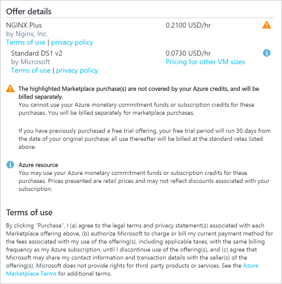
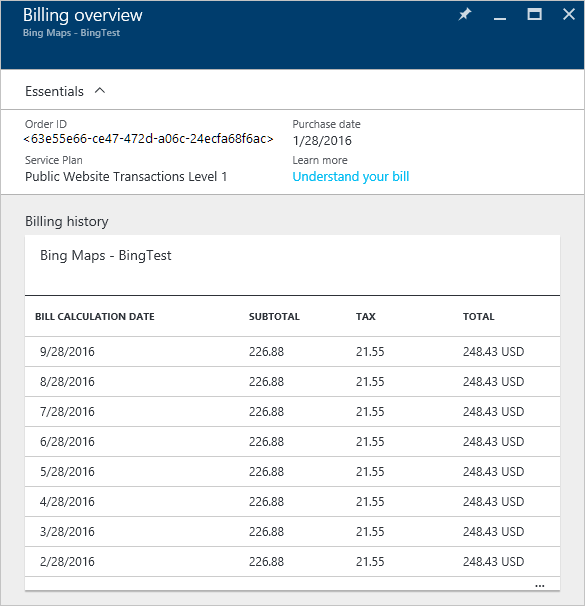

<properties
    pageTitle="Compreender as taxas de serviço externas Azure | Microsoft Azure"
    description="Saiba mais sobre cobrança de serviços externos, conhecido anteriormente como Marketplace, encargos no Azure."
    services=""
    documentationCenter=""
    authors="adpick"
    manager="felixwu"
    editor=""
    tags="billing"
    />

<tags
    ms.service="billing"
    ms.workload="na"
    ms.tgt_pltfrm="na"
    ms.devlang="na"
    ms.topic="article"
    ms.date="10/12/2016"
    ms.author="adpick"/>

# Compreender as taxas de serviço externas Azure

Este artigo explica a cobrança de serviços externos no Azure. Serviços externos costumava ser chamado pedidos de Marketplace. Serviços externos são fornecidos por fornecedores independentes de serviços, mas são integrados completamente ecossistema do Azure. Saiba como:

- Identificar serviços externos
- Compreender como a cobrança difere outros recursos Azure
- Exibir e controlar os custos que você acumula do uso de serviços externos
- Gerenciar ordens de serviço externo e como você pagá-los

## O que são serviços externos Azure?

Serviços externos costumava ser chamado Azure Marketplace. Em geral, elas são serviços publicados por terceiros disponíveis para o Azure. Por exemplo, ClearDB e SendGrid são serviços externos que você pode adquirir no Azure, mas não é publicadas pela Microsoft.

### Identificar serviços externos

Quando você provisionar um novo serviço externo ou recurso, um aviso é exibido:

>[AZURE.NOTE] Serviços externos são publicados por empresas que não são Microsoft, mas, às vezes, os produtos da Microsoft também são categorizados como serviços externos.

### Serviços externos são cobrados separadamente

Serviços externos são tratados como ordens individuais dentro de sua assinatura do Azure. O período de cobrança para cada serviço está definido quando você compra o serviço. Não confunda com o período de cobrança da assinatura em que você comprou. Você também receberá faturas separadas e seu cartão de crédito é cobrado separadamente.

### Cada serviço externo tem um modelo de cobrança diferente

Alguns serviços são cobrados de maneira flexível enquanto outros usam um modelo de pagamento com base mensal. Você precisa de um cartão de crédito para Azure serviços externos, você não pode comprar serviços externos com o pagamento de fatura.

### Você não pode usar mensais créditos gratuitos para serviços externos

Se você estiver usando uma assinatura do Azure que inclui [créditos gratuitos](https://azure.microsoft.com/pricing/spending-limits/), elas não podem ser aplicadas a faturas de serviço externo. Use um cartão de crédito para comprar serviços externos.

## Exibir serviço externo gastos e histórico

Você pode exibir uma lista dos serviços externos que estão em cada assinatura dentro do [Azure portal](https://portal.azure.com/): 

1. Acesse o [portal do Azure](https://portal.azure.com/) e [Navegue até a lâmina de **cobrança** ](https://portal.azure.com/?flight=1#blade/Microsoft_Azure_Billing/BillingBlade).

     
  
2. Na seção de **custos de assinatura** , selecione a assinatura que você deseja exibir. 
   
    

3. Clique em **serviços externos**.

    

4. Você deve ver cada um dos seus pedidos de serviço externo, o nome do fornecedor, nível de serviço que você comprou, nome que você deu o recurso e o status atual do pedido. Selecione um serviço externo para ver passaram faturas.

    

5. A partir daqui, você pode exibir anteriores valores de fatura, incluindo o detalhamento de imposto.

    

## Gerenciar os métodos de pagamento para ordens de serviço externo

Atualize seus métodos de pagamento para ordens de serviço externo no [Centro de conta](https://account.windowsazure.com/).

> [AZURE.NOTE] Se você adquiriu sua assinatura com uma conta de trabalho ou escola, você deve [contatar o suporte](https://portal.azure.com/?#blade/Microsoft_Azure_Support/HelpAndSupportBlade) para fazer alterações em seu método de pagamento.

1. Acesse o [Centro de conta](https://account.windowsazure.com/) e [Navegue até a guia **marketplace** ](https://account.windowsazure.com/Store)

    

2. Selecione o serviço externo que você deseja gerenciar

    

3. Clique em **método de pagamento de alteração** no lado direito da página. Esse link oferece um portal diferentes para gerenciar seu método de pagamento.
    
    

4. Clique em **Editar informações** e siga as instruções para atualizar suas informações de pagamento.

    
    
## Cancelar uma ordem de serviço externo

Se você quiser cancelar seu pedido de serviço externo, você precisa excluir o recurso no [portal do Azure](https://portal.azure.com).

## Precisa de ajuda? Contate o suporte.

Se você ainda tiver mais perguntas, por favor, [contate o suporte](https://portal.azure.com/?#blade/Microsoft_Azure_Support/HelpAndSupportBlade) para obter o problema resolvido rapidamente.
