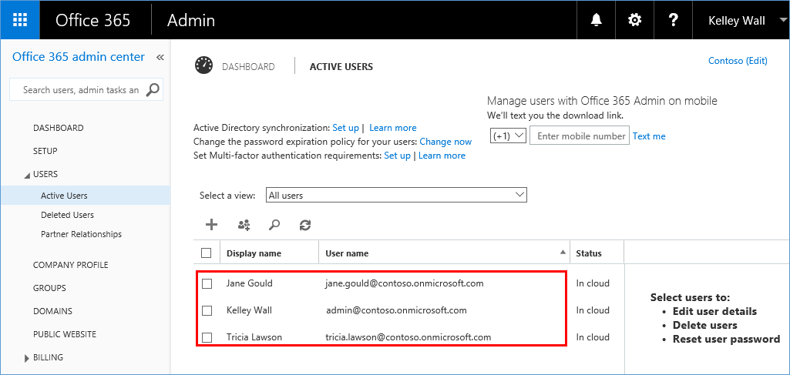
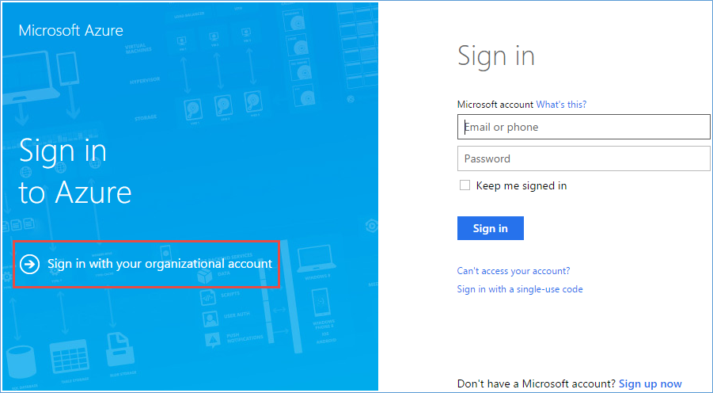
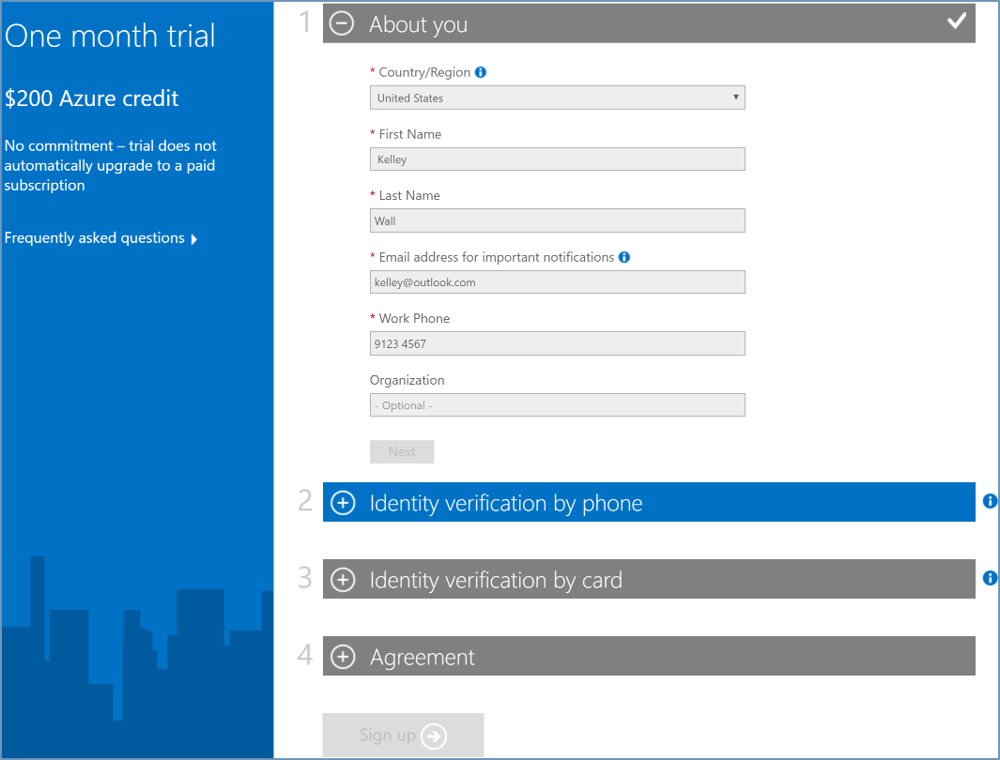
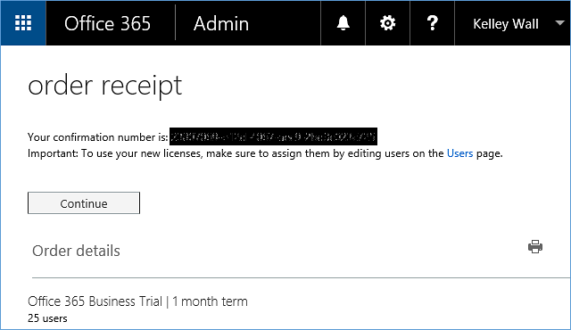

<properties
    pageTitle="Compartilhar um único locatário Azure AD em assinaturas do Office 365 e Azure | Microsoft Azure"
    description="Saiba como compartilhar seu locatário do Office 365 Azure AD e seus usuários com sua assinatura do Azure, ou vice-versa"
    services=""
    documentationCenter=""
    authors="JiangChen79"
    manager="mbaldwin"
    editor=""
    tags="billing,top-support-issue"/>

<tags
    ms.service="billing"
    ms.workload="na"
    ms.tgt_pltfrm="ibiza"
    ms.devlang="na"
    ms.topic="article"
    ms.date="08/17/2016"
    ms.author="cjiang"/>

# Usar uma conta existente do Office 365 com sua assinatura do Azure ou vice-versa
Cenário: Você já tiver uma assinatura do Office 365 e está pronto para uma assinatura do Azure, mas que você deseja usar as contas de usuário existentes do Office 365 para sua assinatura do Azure. Como alternativa, você é um assinante do Azure e deseja obter uma assinatura do Office 365 para os usuários no seu Azure Active Directory existente. Este artigo mostra como é fácil atingir ambos.

> [AZURE.NOTE] Este artigo não se aplica aos clientes Enterprise Agreement (EA). Se precisar de mais ajuda a qualquer momento neste artigo, [contate o suporte](https://portal.azure.com/?#blade/Microsoft_Azure_Support/HelpAndSupportBlade) para resolver seu problema rapidamente.

## Guia rápido

- Se você já tiver uma assinatura do Office 365 e deseja se inscrever no Azure, use a opção de **entrar com sua conta organizacional** . Depois, continue o processo de inscrição Azure com sua conta do Office 365. Consulte [as etapas detalhadas neste artigo](#s1).

- Se você já tiver uma assinatura do Azure e deseja obter uma assinatura do Office 365, entre no Office 365 com sua conta do Azure. Em seguida, continue com as etapas de inscrição. Depois de concluir a inscrição, a assinatura do Office 365 é adicionada à mesma instância do Active Directory do Azure que sua assinatura do Azure pertence. Para obter mais informações, consulte a seção [etapas detalhadas posteriormente neste artigo](#s2).

>[AZURE.NOTE] Para obter uma assinatura do Office 365, a conta que você usa para inscrição deve ser membro da função de directory de Administrador Global ou administrador de cobrança no seu locatário do Active Directory do Azure. [Saiba como determinar a função do Azure Active Directory](#how-to-know-your-role-in-your-azure-active-directory).

Para entender o que acontece quando você adiciona uma assinatura a uma conta, consulte as [informações de plano de fundo posteriormente neste artigo](#background-information).

## Etapas detalhadas

### Cenário 1: Os usuários do Office 365 que planeja compram Azure
Neste cenário, vamos supor que Kelley Wall é um usuário que tem uma assinatura do Office 365 e está planejando assinar Azure. Há duas adicionais usuários ativos, Laura e Tricia. Conta de Kelley é admin@contoso.onmicrosoft.com.

Para inscrever-se para o Azure, siga estas etapas:

1. Inscreva-se no Azure em [Azure.com](https://azure.microsoft.com/). Clique em **Experimente gratuitamente**. Na próxima página, clique em **Iniciar agora**.

    

2. Clique em **entrar com sua conta organizacional**.

    

3. Entre com sua conta do Office 365. Nesse caso, é conta do Office 365 de Kelley.

    

4. Preencha as informações e conclua o processo de inscrição.

    

    

Agora você está tudo pronto. No portal do Azure, você deve ver os mesmos usuários que aparecem. Para verificar isso, siga estas etapas:

1. Clique em **Iniciar meu serviço de gerenciamento** na tela mostrada anteriormente.
2. Clique em **Procurar**e, em seguida, clique em **Active Directory**.

    

3. Clique em **usuários**.

    

4. Todos os usuários, inclusive Kelley, estão listados conforme esperado.

    

### Cenário 2: Usuários Azure que planeja compram o Office 365

Neste cenário, Kelley Wall é um usuário que tenha uma assinatura do Azure sob a conta admin@contoso.onmicrosoft.com. Kelley deseja se inscrever para o Office 365 e usar o mesmo diretório em que ela já tenha com o Azure.

>[AZURE.NOTE] Para obter uma assinatura do Office 365, a conta que você usa para entrar no deve ser um membro da função de directory de Administrador Global ou administrador de cobrança no seu locatário do Active Directory do Azure. [Saiba como saber a função no Active Directory do Azure](#how-to-know-your-role-in-your-azure-active-directory).

Para se inscrever para o Office 365, siga estas etapas:

1. Vá para a [página de produto do Office 365](https://products.office.com/business)e selecione um plano que é adequado para você.
2. Após selecionar o plano, a seguinte página é exibida. Não preencha o formulário. No canto superior direito da página, clique em **entrar** .

    

3. Entrar com suas credenciais de conta. Neste exemplo, é conta de Kelley.

    

4. Clique em **Experimente agora**.

    

5. Na página de confirmação do pedido, clique em **continuar**.

    

Agora você está tudo pronto. No Centro de administração do Office 365, você deve ver os usuários do diretório Contoso aparecendo como usuários ativos. Para verificar isso, siga estas etapas:

1. Abra o Centro de administração do Office 365.
2. Expanda **usuários**e clique em **Usuários ativos**.

    

### Como saber sua função no seu Azure Active Directory

1. Entrar no [portal do Azure](https://portal.azure.com/).
2. Clique em **Procurar**e, em seguida, clique em **Active Directory**.

    

3. Clique em **usuários**.

    

4. Clique no usuário. Neste exemplo, o usuário é Kelley Wall.

    Observe que o campo da **Função ORGANIZACIONAL**.

    

## Informações básicas sobre assinaturas do Azure e o Office 365
Office 365 e Azure usam o serviço do Active Directory do Azure para gerenciar usuários e assinaturas. Considere um diretório Azure como um contêiner no qual você pode agrupar usuários e assinaturas. Para usar a mesma conta de usuário para suas assinaturas do Azure e o Office 365, você precisa certificar-se de que as assinaturas são criadas na mesma pasta. Tenha em mente os seguintes pontos:

- Uma assinatura é criada em um diretório, não o contrário.
- Usuários pertencem a diretórios, não o contrário.
- Uma assinatura chega no diretório do usuário que cria a inscrição. Como resultado, sua assinatura do Office 365 está vinculada à mesma conta como sua assinatura do Azure, quando você usa essa conta para criar a assinatura do Office 365.

Para obter mais informações, consulte [como Azure assinaturas são associadas com o Active Directory do Azure](./active-directory/active-directory-how-subscriptions-associated-directory.md).

>[AZURE.NOTE] Assinaturas do Azure pertencem usuários individuais no diretório.

>[AZURE.NOTE] Assinaturas do Office 365 pertencem o próprio diretório. Se os usuários dentro do diretório tiverem as permissões necessárias, eles podem operar em destas assinaturas.

## Próximas etapas
Se você tiver adquirido o Azure e o Office 365 assinaturas separadamente no passado e você deseja poder acessar o locatário do Office 365 da assinatura Azure, consulte [associar um locatário do Office 365 com uma assinatura do Azure](billing-add-office-365-tenant-to-azure-subscription.md).

> [AZURE.NOTE] Se você ainda tiver dúvidas, [contate o suporte](https://portal.azure.com/?#blade/Microsoft_Azure_Support/HelpAndSupportBlade) para resolver seu problema rapidamente.
