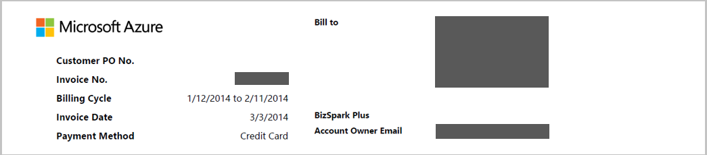

<properties
   pageTitle="Noções básicas sobre sua fatura | Microsoft Azure"
   description="Saiba como ler e entender o uso e a fatura para sua assinatura do Azure"
   services=""
   documentationCenter=""
   authors="genlin"
   manager="stevenpo"
   editor=""
   tags="billing"/>

<tags
   ms.service="billing"
   ms.devlang="na"
   ms.topic="article"
   ms.tgt_pltfrm="na"
   ms.workload="na"
   ms.date="10/31/2016"
   ms.author="erihur;genli"/>

# Entenda sua fatura do Microsoft Azure

> [AZURE.NOTE] Se precisar de mais ajuda a qualquer momento neste artigo, por favor, [contate o suporte](https://portal.azure.com/?#blade/Microsoft_Azure_Support/HelpAndSupportBlade) para obter o problema resolvido rapidamente.

Os encargos para assinaturas do Microsoft Azure variam pelo plano de taxa. Alguns planos de taxa, como os assinantes do Visual Studio Enterprise (MPN), incluem mensais créditos que você pode usar qualquer serviço Azure com base nas suas necessidades.

Observe que o 24 horas de uso latente do seu período de cobrança anterior pode ser informado no seu período de faturamento atual.

Para obter mais informações sobre planos de taxa e consumo, consulte a [página de opções de compra do Microsoft Azure](https://azure.microsoft.com/pricing/purchase-options/).

<!-- The below links cover a complete list of all Microsoft Azure services.

<!-- - [Service Details list (csv1)](https://azurepricing.blob.core.windows.net/supplemental/MOSPServices_csv1.xlsx)
<!-- - [Service Details list (csv2)](https://azurepricing.blob.core.windows.net/supplemental/MOSPServices_csv2.xlsx)

<!-- *NOTE: The **csv1** link refers to the column header names for csv version 1 and **csv2** link refers to the new column header names for csv version 2.  These files are updated monthly.*-->

### Exibir ou fazer o download de uma lista do Microsoft Azure:

1. Entre no [Centro de conta](https://account.windowsazure.com/subscriptions) usando seu Account da Microsoft ou a ID organizacional.

2. Clique na assinatura na qual você gostaria de ver detalhes e uso.

3. Clique em **histórico de cobrança**

    

4. A seção **Histórico de cobrança** lista suas instruções para períodos de faturamento anteriores além do período não cobrado atual. A instrução para o período atual é uma estimativa das taxas no momento que a estimativa foi gerada. Essas informações só são atualizadas diariamente e podem não incluir todos os uso incorrido a data. Sua fatura mensal pode diferir essa estimativa.  

    

5. Clique em **Exibir a declaração atual** para exibir uma estimativa das taxas no momento que a estimativa foi gerada. Essas informações só são atualizadas diariamente e podem não incluir todos os uso incorrido a data. Sua fatura mensal pode diferir essa estimativa.

    

    

6. Clique em **Baixar fatura** para exibir uma cópia da fatura anterior.

    

> [AZURE.NOTE] Encargos listados na cobrança instruções para clientes internacionais são para fins de estimativa somente como bancos com custos diferentes para as taxas de conversão.

A seguir estão algumas declarações de amostra para duas ofertas diferentes disponíveis na Microsoft Azure.

 Tipo de oferta | Descrição | Baixar |
 :--------- |:-------- | :-------|
Pré-pago | Pagar com atraso de pagamento mensal | [Exemplo de arquivo](https://azurepricing.blob.core.windows.net/sampleinvoices/Microsoft_Azure_ccinvoice_Sample.pdf)
Oferta de compromisso | Passam deduzida do seu compromisso pré-paga | [Exemplo de arquivo](https://azurepricing.blob.core.windows.net/sampleinvoices/Microsoft_Azure_invoice_Sample.pdf)

## Informações da conta

A seção de informações de conta identifica informações pertinentes com relação ao seu uso e no perfil.

| Termo                | Descrição                                                                                         |
|---------------------|-----------------------------------------------------------------------------------------------------|
| N º da fatura         | Um identificador de fatura exclusivos para fins de acompanhamento                                                   |
| Ciclo de cobrança       | O período de tempo em que uso ocorreu                                                       |
| Data da fatura        | Data em que a fatura foi gerada                                                                 |
| Método de pagamento      | Tipo de pagamento usado na conta (fatura ou cartão de crédito)                                   |
| Para cobrança             | Endereço de pagamentos do Microsoft Azure                                                                    |
| Oferta de assinatura  | Tipo de oferta de assinatura que foi comprado (pré-pago BizSpark Plus, Azure Pass, etc.) |
| Email de proprietário de conta | O endereço de email de conta a conta do Microsoft Azure registrado em                      |

## Compreender o resumo de fatura

A seção de **Resumo de fatura** da lista resume transações desde sua última fatura e as taxas de uso atual.

O saldo anterior, pagamentos e saldo pendente seção da lista resume transações desde sua última fatura.

| Termo                                              | Descrição                                                                              |
|---------------------------------------------------|------------------------------------------------------------------------------------------|
| Saldo anterior                                  | O valor total devido da última fatura                                                 |
| Pagamentos                                          | Total de pagamentos aplicado a sua última fatura                                                 |
| Saldo pendente (a partir do ciclo de cobrança anterior) | Fatura ajustes (créditos ou saldos) aplicados à sua conta desde sua última fatura  |

## Entender os encargos atuais
A seção de encargos atuais da lista contém detalhes sobre suas cobranças mensais. Os links são organizados em subseções a seguir.

| Termo          | Descrição                                                                                                                                                                                                                                                                                                                                                                                                                                            |
|---------------|--------------------------------------------------------------------------------------------------------------------------------------------------------------------------------------------------------------------------------------------------------------------------------------------------------------------------------------------------------------------------------------------------------------------------------------------------------|
| Encargos de uso | Encargos de uso são total de encargos mensais em uma assinatura. Você será cobrado com atraso de pagamento para uso do seu mês passado.                                                                                                                                                                                                                                                                                                                                       |
| Descontos     | Descontos de serviço aplicados a sua fatura atual seriam sejam refletidos neste item de linha.                                                                                                                                                                                                                                                                                                                                              |
| Ajustes   | Diversos ajustes são créditos diversos ou pendentes encargos aplicados à sua fatura atual. Por exemplo, se você tiver o Visual Studio Enterprise com oferta MSDN, você verá um crédito mensal nesse item de linha. Se você cancelar sua assinatura, você verá encargos de uso mensal maior que o crédito mensal incluído em sua oferta desde o início do seu período de faturamento atual para a sua data de cancelamento de assinatura.|

## Informações de rodapé

## Compreender as informações adicionais
A página de informações adicionais fornece referências para outros recursos para compreender sua fatura e links para exibir seu uso e outras informações relevantes para sua fatura.

### Uso detalhado
Um link na descrição em **Uso detalhado** direciona o Centro de conta onde você pode exibir seu uso detalhado para essa assinatura.  Agora há duas versões disponíveis para download: **versão 1 do. csv** contém os campos de uso e convenção de nomenclatura antiga e **versão 2 do. csv** contém nomes amigáveis de cliente para cada uma das categorias, além de campos adicionais que ajudarão você a entender quais serviços que você estão usando no Microsoft Azure. Observe que na versão de arquivo. csv 1 que não há nenhum detalhe do Gerenciador de recursos do Azure. Azure informações do Gerenciador de recursos podem ser encontradas na versão de arquivo. csv 2.

### Informações adicionais e recursos úteis
Esta seção contém links para perguntas simples sobre computação instância tamanhos, tarifas de banco de dados do SQL e links úteis para ajudá-lo a responder a perguntas.

| Termo                 | Descrição                                                                                                                            |
|----------------------|----------------------------------------------------------------------------------------------------------------------------------------|
| Vendido para              | Isso será preenchido com o endereço de perfil da conta                                                                           |
| Instruções de pagamento | Esta seção é as instruções de pagamento de onde enviar verificações, transferências ou cheques expresso se seu método de pagamento é fatura |

## Entender os encargos de uso detalhado

Como parte do nosso compromisso contínuo para ajudar os clientes a gerenciar facilmente o seu uso Azure, podemos já aprimorado o arquivo de uso de download que relatórios no seu uso de serviços Azure e custos.  O link de download contém duas versões do arquivo de uso:

- **Versão 1** usa o formato preexistente

- **Versão 2** inclui informações adicionais e atualizadas nomes de coluna na seção de uso diário.  

Encargos de uso são encargos total **mensal** em uma assinatura menos qualquer crédito ou desconto. Você será cobrado com atraso de pagamento para uso do seu mês passado.  A seção superior do arquivo exibe os detalhes sobre os serviços que você está sendo cobrado por durante o ciclo de cobrança do mês anterior.  A tabela anterior lista os nomes das colunas para cada um dos arquivos de versão do arquivo. csv.

Versão 1 |  Versão 2  |  Descrição|
:---------------| :---------------- | --------|
Período de cobrança | Período de cobrança | O período de faturamento quando o recurso foi consumido.
Nome | Medidor de categoria | Identifica o serviço de nível superior para a qual esse uso pertence.
Tipo | Medidor de subcategoria | Serviço Azure pode ser definido ainda mais por tipo nesta coluna, o que pode afetar a taxa.
Recurso | Nome do medidor | Identifica a unidade de medida para o recurso consumida.
Região | Medidor de região | Identifica a localização do data center para determinados serviços que têm o preço com base no local do data center.
SKU | SKU | Identifica o identificador de sistema exclusivo para cada recurso Azure.
Unidade | Unidade | Identifica a unidade em que o serviço é cobrado. Por exemplo, GB, horas, 10,000s.
Consumidas | Quantidade consumida | Contém o valor do recurso consumida durante o período de cobrança.
Incluído | Quantidade incluída | Contém o valor do recurso que está incluído sem nenhum custo em seu período de faturamento atual.
Faturáveis | Quantidade de excesso. | Se a quantidade de consumida excede o valor incluído, esta coluna exibe a diferença. Você será cobrado para esse valor. Para ofertas de pré-pago com nenhum valor incluídos com a oferta, esse total será a mesma que a quantidade de consumida.
Dentro de compromisso | Dentro de compromisso | Contém os encargos de recursos que são diminuídos de sua quantidade de compromisso associada a sua oferta de mês 6 ou 12. As taxas do recurso são diminuídas em relação à quantidade compromisso em ordem cronológica.
Moeda | Moeda | Identifica a moeda refletida no seu período de faturamento atual.
Excedente | Excedente | Contém os encargos de recurso que excedeu sua quantidade de compromisso associada a sua oferta de mês 6 ou 12.
Taxa de compromisso | Taxa de compromisso | Contém a taxa de compromisso com base em sua quantidade total compromisso associada a sua oferta de mês 6 ou 12.
Taxa | Taxa | Taxa exibe a taxa cobrado por unidade faturável.
Valor | Valor | Exibe o resultado da multiplicação na coluna faturável pela coluna taxa. Não se a quantidade de consumida não exceda a quantidade incluída, haverá nenhum custo nesta coluna.

## Analisar dados de uso diárias
Dependendo do seu uso, pode haver milhares de linhas de dados de uso diário. Se você quiser analisar dados, clique em **Baixar uso** e escolha uma versão de arquivo variáveis separados por vírgulas (. csv) para ver seus dados de uso diária para o período de faturamento apropriado.  Para referência, você pode baixar um arquivo. csv de exemplo para cada versão abaixo.

 Nome | Baixar |
 :----------:| :-------: |
  Uso detalhado. csv versão 1|  [Exemplo de arquivo](https://azurepricing.blob.core.windows.net/supplemental/MOSPServices_csv1.xlsx)
  Uso detalhado. csv versão 2 | [Exemplo de arquivo](https://azurepricing.blob.core.windows.net/supplemental/MOSPServices_csv2.xlsx)

No arquivo. csv, os itens são divididos para exibir uma lista de quanto de cada recurso foi consumida dentro do período de faturamento atual.

As seguintes colunas exibem detalhes que afetam as taxas no início do período de faturamento:

Versão 1 |   Versão 2   |  Descrição |
:---------------| :----------------| -----|
Data de uso | Data de uso | A data em que o recurso foi emitido.
Nome | Medidor de categoria | Identifica o serviço de nível superior para a qual esse uso pertence.
GUID de recursos | ID do medidor | O identificador de medidor cobrados.  Isso é usado como o identificador usado para uso de cobrança de preços.
Tipo | Medidor de subcategoria | Serviço Azure pode ser definido ainda mais por tipo nesta coluna, o que pode afetar a taxa.
Recurso | Nome do medidor | Identifica a unidade de medida para o recurso consumida.
Região | Medidor de região | Identifica a localização do data center para determinados serviços que têm o preço com base no local do data center.
Unidade | Unidade | Identifica a unidade em que o serviço é cobrado. Por exemplo, GB, horas, 10,000s.
Consumidas | Quantidade consumida | Contém o valor do recurso consumida para esse dia.
Região de sub | Localização do recurso | Identifica o Data Center onde o recurso está sendo executado.
Serviço | Serviço consumido | Esta coluna é utilizada para controlar o serviço de plataforma Windows Azure individuais que não pode ser identificado especificamente na coluna nome. Esse serviço coluna indica o uso do serviço de quais específicos pertence.
N/D | Grupo de recursos | _**Nova inclusão de coluna.**_ O grupo de recursos no qual o recurso implantado é executado em. Consulte [Visão geral do Gerenciador de recursos do Azure](../azure-resource-manager/resource-group-overview.md)
Componente | ID da instância | O identificador para o recurso em execução. O identificador contém o nome que você especificar para o recurso quando ele foi criado.
N/D | Marcas | _**Nova inclusão de coluna.**_ Novos tipos de recursos no Azure permitem recursos de marca. Consulte organizar [seus recursos Azure com marcas](http://azure.microsoft.com/updates/organize-your-azure-resources-with-tags/)
Informações adicionais | Informações adicionais | Metadados adicionais relacionados ao serviço.
Informações de serviço 1 | Informações de serviço 1 | Esta coluna fornece o nome de projeto para o qual o serviço pertence na sua assinatura.
Informações de serviço 2 | Informações de serviço 2 | Este é um campo legado que captura opcional específicas do serviço de metadados.

Além de alguns novos campos e alterações de nomes para csv versão 2, lá vai ser padronizadas formatação para os dados na abaixo dos campos:

- **ID da instância**: campo representa a identificação de instância que o usuário especificado identificador do serviço provisionado. Atualmente, existem dois formatos no qual a ID de instância é representada: é o nome do recurso ou a identificação do recurso totalmente qualificado. Os serviços do Microsoft Azure estiver fazendo uma transição para representar o ID de instância em um formato de identificação do recurso totalmente qualificado padronizado _**(/subscriptions/<subscription id>/resourcegroups/<resourcegroupname>/providers/<providername>/<resourcename>)**_. Como a transição para o novo formato de serviços você verá o campo de dados de ID da instância alterar de apenas o nome do recurso para identificação do recurso. A identificação do recurso é o formato usado pela [API do Gerenciador de recursos do Azure](https://msdn.microsoft.com/library/azure/dn790567.aspx) para identificar recursos em uma assinatura.

- **Informações adicionais**: coluna a informações adicionais no arquivo. csv uso especifica metadados específicos do serviço. Por exemplo, um tipo de imagem para uma máquina virtual. Atualmente, um serviço emite específico do serviço de metadados em várias colunas: campos informações adicionais, Info1 de serviço e 2 de informações de serviço. Os serviços do Microsoft Azure serão ser padronizar emitir específicas do serviço de metadados no apenas a coluna de informações adicionais.  Veja a seguir instantâneo do formato padronizado:

- **Marcas**: esta coluna contenha o usuário especificado marcas de recurso. As marcas podem ser usadas para agrupar registros de cobranças. Por exemplo, você pode usar marcas para distribuir custos por departamento usando o serviço. Saiba mais sobre como [usar marcas para organizar recursos do Azure](../resource-group-using-tags.md). Serviços que oferecem suporte a marcas emissão são:  

    - Máquinas virtuais

    - Armazenamento e

    - Serviços de rede provisionados usando a [API do Gerenciador de recursos do Azure](https://msdn.microsoft.com/library/azure/dn790567.aspx)

## Próximas etapas

- [Configurar alertas de cobrança](../billing-set-up-alerts.md)

- [Gerenciar seus métodos de pagamento](../billing-how-to-change-credit-card.md)

- [Entender as taxas do Azure Marketplace](../billing-understand-your-azure-marketplace-charges.md)

- [Perguntas Frequentes do Azure cobrança e assinatura](../billing-subscription-faq.md)

> [AZURE.NOTE] Se você ainda tiver mais perguntas, por favor, [contate o suporte](https://portal.azure.com/?#blade/Microsoft_Azure_Support/HelpAndSupportBlade) para obter o problema resolvido rapidamente.

<!--
OLD MSDN Articles
- [What do I do if my Azure subscription become disabled?](https://msdn.microsoft.com/library/azure/dn736049.aspx)
- [Edit payment information for an existing credit card](https://msdn.microsoft.com/library/azure/dn736053.aspx)
- [Add a new credit card to use as a payment method](https://msdn.microsoft.com/library/azure/dn736057.aspx)
- [Change the credit card on your Microsoft Azure account](https://msdn.microsoft.com/library/azure/dn736050.aspx)
- [Manage your payment method](https://msdn.microsoft.com/library/azure/dn736054.aspx)
-->

<!--Image references-->
