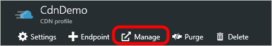
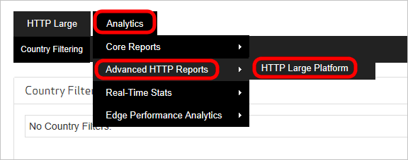

<properties
    pageTitle="Azure CDN avançadas relatórios HTTP | Microsoft Azure"
    description="Relatórios HTTP avançados no Microsoft Azure CDN. Esses relatórios fornecem informações detalhadas sobre a atividade CDN."
    services="cdn"
    documentationCenter=""
    authors="camsoper"
    manager="erikre"
    editor=""/>

<tags
    ms.service="cdn"
    ms.workload="tbd"
    ms.tgt_pltfrm="na"
    ms.devlang="na"
    ms.topic="article"
    ms.date="07/28/2016"
    ms.author="casoper"/>

# Relatórios HTTP avançados no Microsoft Azure CDN

## Visão geral

Este documento explica avançadas de relatório de HTTP no Microsoft Azure CDN. Esses relatórios fornecem informações detalhadas sobre a atividade CDN.

[AZURE.INCLUDE [cdn-premium-feature](../../includes/cdn-premium-feature.md)]

## Acessar relatórios HTTP avançados

1. Da lâmina CDN perfil, clique no botão **Gerenciar** .

    

    O portal de gerenciamento de CDN é aberta.

2. Passe o mouse sobre a guia de **análise** , em seguida, passe o mouse sobre o submenu **Relatórios de HTTP avançadas** .  Clique na **plataforma de grande de HTTP**.

    

    Opções de relatório são exibidas.

## Relatórios de Geografia (baseados em mapas)

Há cinco relatórios que tirar proveito de um mapa para indicar as regiões do qual seu conteúdo está sendo solicitado. Esses relatórios estão World Map, mapa dos Estados Unidos, Canadá mapa, mapa da Europa e Ásia Pacífico mapa.

Cada relatório baseados em mapas classifica entidades geográficas (ou seja, países/regiões, Estados e regiões) de acordo com a porcentagem de visitas que originou da região. Além disso, um mapa é fornecido para ajudá-lo a visualizar os locais do qual seu conteúdo está sendo solicitado. É capaz de fazer isso codificando cada região de acordo com a quantidade de demanda experiente nessa região. Mais clara sombreados regiões indicam demanda inferior para seu conteúdo, enquanto regiões mais escuras indicam altos níveis de demanda para o seu conteúdo.

Informações detalhadas de tráfego e largura de banda para cada região são fornecidas diretamente abaixo do mapa. Isso permite exibir o número total de visitas, a porcentagem de visitas, a quantidade total de dados transferidos (em gigabytes) e a porcentagem de dados transferidos para cada região. Exiba uma descrição para cada um dos seguintes métricas. Finalmente, quando você focaliza uma região (ou seja, país, estado ou província), o nome e a porcentagem de visitas que ocorreram na região serão exibidos como uma dica de ferramenta.

Uma breve descrição é fornecida abaixo para cada tipo de relatório baseados em mapas geográficos.

Nome do relatório | Descrição
------------|------------
Mapa do mundo | Este relatório permite que você exiba a demanda em todo o mundo para o seu conteúdo CDN. Cada país é codificada por cor no mapa-múndi para indicar a porcentagem de ocorrências se originou de região.
Mapa de Estados Unidos | Este relatório permite que você exiba a demanda por seu conteúdo CDN nos Estados Unidos. Cada estado está codificado com cores nesse mapa para indicar a porcentagem de ocorrências se originou de região.
Mapa de Canadá | Este relatório permite que você exiba a demanda por seu conteúdo CDN no Canadá. Cada província está codificado com cores nesse mapa para indicar a porcentagem de ocorrências se originou de região.
Mapa da Europa | Este relatório permite que você exiba a demanda por seu conteúdo CDN na Europa. Cada país está codificado com cores nesse mapa para indicar a porcentagem de ocorrências se originou de região.
Mapa do Pacífico Asiático | Este relatório permite que você exiba a demanda por seu conteúdo CDN na Ásia. Cada país está codificado com cores nesse mapa para indicar a porcentagem de ocorrências se originou de região.

## Relatórios de Geografia (gráficos de barras)

Há dois relatórios adicionais que fornecem informações estatísticas de acordo com dados geográficos, que são início cidades e países do início. Esses relatórios classificam cidades e países, respectivamente, de acordo com o número de ocorrências essas regiões se originou. Ao gerar nesse tipo de relatório, um gráfico de barras indicará o superiores 10 cidades ou países/regiões que solicitada conteúdo sobre uma plataforma específica. Este gráfico de barras permite avaliar rapidamente as regiões que geram o maior número de solicitações de seu conteúdo.

O lado esquerdo do gráfico (eixo y) indica quantas ocorrências ocorreram na região especificada. Diretamente abaixo do gráfico (eixo x), você encontrará um rótulo para cada uma das 10 regiões superiores.

### Usando os gráficos de barra

* Quando você focaliza uma barra, o nome e o número total de visitas que ocorreram na região serão exibidos como uma dica de ferramenta.
* A dica de ferramenta para o relatório de cidades início identifica uma cidade por seu nome, estado/província e abreviação de país.
* Se não pôde ser determinada cidade ou região (ou seja, estado/província) origem de uma solicitação, em seguida, ela indicará que são desconhecidas. Se o país for desconhecido, dois pontos de interrogação (isto é,??), será exibida.
* Um relatório pode incluir métricas para "Europa" ou "Região da Ásia/Pacífico." Esses itens não foram criados para fornecer informações estatísticas sobre todos os endereços IP nessas áreas. Em vez disso, elas se aplicam apenas às solicitações que se originam de endereços IP que estão distribuídos sobre Europa ou/Pacífico, em vez de para uma cidade específica ou país.

Os dados que foi usados para gerar o gráfico de barras podem ser visualizados abaixo dela. Lá, você encontrará o número total de visitas, a porcentagem de visitas, a quantidade de dados transferidos (em gigabytes) e a porcentagem de dados transferidos para as regiões de início 250. Exiba uma descrição para cada um dos seguintes métricas.

Uma breve descrição é fornecida para os dois tipos de relatórios abaixo.

Nome do relatório | Descrição
------------|------------
Cidades de início | Este relatório classifica cidades de acordo com o número de visitas que originou da região.
Primeiros países | Este relatório classifica países de acordo com o número de visitas que originou da região.

## Resumo diário

O relatório de resumo diário permite que você exiba o número total de visitas e dados transferidos uma plataforma específica diariamente. Essas informações podem ser usadas para distinguir rapidamente os padrões de atividade CDN. Por exemplo, este relatório pode ajudá-lo a detectar quais dias experientes maior ou menores que o tráfego esperado.

Ao gerar nesse tipo de relatório, um gráfico de barras fornecerá uma indicação visual como para a quantidade de plataforma específica demanda experiente diariamente durante o período coberto pelo relatório. Ele fará isso exibindo uma barra para cada dia no relatório. Por exemplo, selecionar o período de tempo chamado "Semana passada" irá gerar um gráfico de barras com barras de sete. Cada barra indicará o número total de visitas experientes em dia.

O lado esquerdo do gráfico (eixo y) indica quantas ocorrências ocorreram na data especificada. Diretamente abaixo do gráfico (eixo x), você encontrará um rótulo que indica a data (formato: AAAA-MM-DD) para cada dia incluído no relatório.

> [AZURE.TIP] Quando você focaliza uma barra, o número total de visitas que ocorreram na data será exibido como uma dica de ferramenta.

Os dados que foi usados para gerar o gráfico de barras podem ser visualizados abaixo dela. Lá você encontrará o número total de visitas e a quantidade de dados transferidos (em gigabytes) para cada dia coberto pelo relatório.

## Por hora

O relatório por hora permite que você exiba o número total de visitas e dados transferidos uma plataforma específica em uma base por hora. Essas informações podem ser usadas para distinguir rapidamente os padrões de atividade CDN. Por exemplo, este relatório pode ajudá-lo a detectar os períodos de tempo durante o dia que enfrentar maior ou menor do que o tráfego esperado.

Ao gerar nesse tipo de relatório, um gráfico de barras fornecerá uma indicação visual como para a quantidade de demanda específico da plataforma com experiência em hora durante o período coberto pelo relatório. Ele fará isso exibindo uma barra para cada hora coberta pelo relatório. Por exemplo, selecionando uma 24 horas período irá gerar um gráfico de barras com barras de vinte quatro. Cada barra indicará o número total de visitas experientes durante tal hora.

O lado esquerdo do gráfico (eixo y) indica quantas ocorrências ocorreram na hora especificada. Diretamente abaixo do gráfico (eixo x), você encontrará um rótulo que indica a data/hora (formato: AAAA-MM-DD HH: mm) para cada hora incluída no relatório. Tempo é informado usando o formato de 24 horas e é especificado usando o fuso horário UTC/GMT.

> [AZURE.TIP] Quando você focaliza uma barra, o número total de visitas ocorridas durante tal hora será exibido como uma dica de ferramenta.

Os dados que foi usados para gerar o gráfico de barras podem ser visualizados abaixo dela. Lá você encontrará o número total de visitas e a quantidade de dados transferidos (em gigabytes) para cada hora coberta pelo relatório.

## Ao lado do arquivo

O relatório por arquivo permite que você veja a quantidade de demanda e o tráfego incorridos sobre uma plataforma específica para os ativos mais solicitados. Ao gerar nesse tipo de relatório, um gráfico de barras será gerado nos ativos mais solicitados 10 principais ao longo do período de tempo especificado.

> [AZURE.NOTE] Para os fins deste relatório, borda CNAME URLs são convertidas em seus equivalentes URLs de CDN. Isso permite uma contagem precisa do número total de visitas associado a um ativo independentemente da CDN ou borda CNAME URL usada para solicitá-lo.

O lado esquerdo do gráfico (eixo y) indica o número de solicitações para cada ativo durante o período de tempo especificado. Diretamente abaixo do gráfico (eixo x), você encontrará um rótulo que indica o nome de arquivo para cada um dos principais 10 ativos solicitados.

Os dados que foi usados para gerar o gráfico de barras podem ser visualizados abaixo dela. Lá você encontrará as informações a seguir para cada um dos principais 250 ativos solicitados: caminho relativo, o número total de visitas, a porcentagem de visitas, a quantidade de dados transferidos (em gigabytes) e a porcentagem de dados transferidos.

## Por detalhe de arquivo

O relatório de detalhes de arquivo por permite que você veja a quantidade de demanda e o tráfego incorridos sobre uma plataforma específica de um ativo específico. Na parte superior deste relatório é a opção de detalhes de arquivo para. Essa opção fornece uma lista dos seus ativos mais solicitados na plataforma selecionada. Para gerar um relatório por detalhes de arquivo, você precisará selecionar o ativo desejado da opção de detalhes de arquivo para. Após o qual um gráfico de barras indicará a quantidade de demanda diária que ele gerado durante o período de tempo especificado.

O lado esquerdo do gráfico (eixo y) indica o número total de solicitações de que um ativo com experiência em um determinado dia. Diretamente abaixo do gráfico (eixo x), você encontrará um rótulo que indica a data (formato: AAAA-MM-DD) para qual CDN demanda para o ativo foi relatada.

Os dados que foi usados para gerar o gráfico de barras podem ser visualizados abaixo dela. Lá você encontrará o número total de visitas e a quantidade de dados transferidos (em gigabytes) para cada dia coberto pelo relatório.

## Por tipo de arquivo

O relatório por tipo de arquivo permite que você veja a quantidade de demanda e o tráfego incorridos por tipo de arquivo. Ao gerar nesse tipo de relatório, um gráfico de rosca indicará a porcentagem de visitas gerados pelos tipos de 10 arquivo superior.

> [AZURE.TIP] Quando você focaliza uma fatia do gráfico de rosca, a Internet tipo de mídia de que tipo de arquivo será exibido como uma dica de ferramenta.

Os dados que foi usados para gerar o gráfico de rosca podem ser visualizados abaixo dela. Lá você encontrará o tipo de mídia de Internet/extensão de nome de arquivo, o número total de visitas, a porcentagem de visitas, a quantidade de dados transferidos (em gigabytes) e a porcentagem de dados transferidos para cada um dos tipos de arquivo superior 250.

## Pelo diretório

O relatório por diretório permite que você veja a quantidade de demanda e o tráfego incorridos sobre uma plataforma específica para o conteúdo de um diretório específico. Ao gerar nesse tipo de relatório, um gráfico de barras indicará o número total de visitas gerados pelo conteúdo nos 10 diretórios superiores.

### Usando o gráfico de barras

* Passe o mouse sobre uma barra para exibir o caminho relativo ao diretório correspondente.
* O conteúdo armazenado em uma subpasta de um diretório não contar ao calcular demanda pelo diretório. Esse cálculo depende exclusivamente o número de solicitações gerado para o conteúdo armazenado no diretório real.
* Para os fins deste relatório, borda CNAME URLs são convertidas em seus equivalentes URLs de CDN. Isso permite uma contagem precisa para todas as estatísticas associadas a um ativo, independentemente da borda CNAME URL usada para solicitá-lo ou CDN.

O lado esquerdo do gráfico (eixo y) indica o número total de solicitações para o conteúdo armazenado em seus diretórios de 10 primeiros. Cada barra do gráfico representa um diretório. Use o esquema de codificação a correspondência de uma barra em um diretório listado na seção superior 250 completo diretórios.

Os dados que foi usados para gerar o gráfico de barras podem ser visualizados abaixo dela. Lá você encontrará as informações a seguir para cada um dos diretórios início 250: caminho relativo, o número total de visitas, a porcentagem de visitas, a quantidade de dados transferidos (em gigabytes) e a porcentagem de dados transferidos.

## Pelo navegador

O relatório pelo navegador permite que você veja quais navegadores foram usados para solicitar o conteúdo. Ao gerar nesse tipo de relatório, um gráfico de pizza indicará a porcentagem de solicitações tratado pelos primeiros 10 navegadores.

### Usando o gráfico de pizza

* Passe o mouse sobre uma fatia no gráfico de pizza para exibir o nome e a versão de um navegador.
* Para os fins deste relatório, cada combinação exclusiva/versão do navegador é considerada um navegador diferente.
* A fatia chamada "Outros" indica a porcentagem de solicitações feitas por todos os outros navegadores e versões.

Os dados que foi usados para gerar o gráfico de pizza podem ser visualizados abaixo dela. Lá você encontrará o número de versão do tipo de navegador, o número total de visitas e a porcentagem de visitas para cada um dos navegadores início 250.

## Por referência

O relatório por referência permite que você exiba os principais referenciadores ao conteúdo na plataforma selecionada. Uma referência indica o nome do host do qual uma solicitação foi gerada. Ao gerar nesse tipo de relatório, um gráfico de barras indicará a quantidade de demanda (ou seja, visitas) gerada pelos 10 principais referenciadores.

O lado esquerdo do gráfico (eixo y) indica o número total de solicitações de que um ativo com experiência para cada referência. Cada barra do gráfico representa uma referência. Use o esquema de codificação a correspondência de uma barra para uma referência listada na seção superior 250 referência.

Os dados que foi usados para gerar o gráfico de barras podem ser visualizados abaixo dela. Lá, você encontrará a URL, o número total de acessos e a porcentagem de visitas geradas de cada uma dos principais 250 Referenciadores.

## Para download

O relatório ao baixar permite analisar padrões de download para o seu conteúdo mais solicitado. A parte superior do relatório contém um gráfico de barras que compara tentado downloads com downloads de concluída para os principais ativos solicitados 10. Cada barra é codificada por cor de acordo com seja um tentativa de download (azul) ou um download concluído (verde).

> [AZURE.NOTE] Para os fins deste relatório, borda CNAME URLs são convertidas em seus equivalentes URLs de CDN. Isso permite uma contagem precisa para todas as estatísticas associadas a um ativo independentemente da CDN ou borda CNAME URL usada para solicitá-lo.

O lado esquerdo do gráfico (eixo y) indica o nome de arquivo para cada um dos principais 10 ativos solicitados. Diretamente abaixo do gráfico (eixo x), você encontrará rótulos que indica o número total de downloads uma tentativa/concluída.

Diretamente abaixo do gráfico de barras, as seguintes informações serão listadas para os principais ativos solicitados 250: caminho relativo (incluindo o nome do arquivo), o número de vezes que ele foi baixado para conclusão, o número de vezes que ele foi solicitado e a porcentagem de solicitações que resultou em um download concluído.

> [AZURE.TIP] Nossa CDN não é informado pelo cliente de HTTP (ou seja, navegador) quando um ativo foi baixado completamente. Como resultado, temos que calcular se um ativo já foi completamente baixado de acordo com códigos de status e intervalo de bytes solicitações. A primeira coisa que podemos esperar quando fazer esse cálculo é se a solicitação resulta em um código de status Okey 200. Em caso afirmativo, em seguida, examinaremos solicitações de intervalo de bytes para garantir que eles cobrir todo ativo. Por fim, podemos comparar a quantidade de dados transferidos para o tamanho do ativo solicitado. Se os dados transferidos são igual ou maior que o tamanho do arquivo e as solicitações de intervalo de bytes são apropriadas para esse ativo, em seguida, o impacto será contado como um download concluído.
>
>Devido à natureza autorização interpretativa deste relatório, você deve ter em mente os seguintes pontos que podem alterar a consistência e a precisão deste relatório.
>
>* Padrões de tráfego não podem ser previstos precisamente quando agentes de usuário se comportam de forma diferente. Isso pode produzir resultados de download concluído maiores que 100%.
>* Ativos de tirar proveito de Download progressivo HTTP não podem ser precisamente representados por este relatório. Isso é devido a usuários que buscam posições diferentes em um vídeo.

## Por 404 erros

O relatório por 404 erros permite que você identifique o tipo de conteúdo que gera o maior número de 404 não encontrado códigos de status. A parte superior do relatório contém um gráfico de barras para os ativos de 10 principais para o qual foi retornado um código de status 404 não encontrado. Este gráfico de barras compara o número total de solicitações com solicitações que resultaram em código de status um 404 não encontrado para esses ativos. Cada barra é codificada por cor. Uma barra amarela é usada para indicar que a solicitação resultou em um código de status 404 não encontrado. Uma barra vermelha é usada para indicar o número total de solicitações de ativo.

> [AZURE.NOTE] Para os fins deste relatório, observe o seguinte:
>
>* Uma ocorrência representa qualquer solicitação de um ativo, independentemente de código de status.
>* Borda CNAME URLs são convertidas em seus equivalentes URLs de CDN. Isso permite uma contagem precisa para todas as estatísticas associadas a um ativo, independentemente da borda CNAME URL usada para solicitá-lo ou CDN.

O lado esquerdo do gráfico (eixo y) indica o nome de arquivo para cada um dos principais 10 solicitados ativos que resultou em um código de status 404 não encontrado. Diretamente abaixo do gráfico (eixo x), você encontrará rótulos que indica o número total de solicitações e o número de solicitações que resultou em um código de status 404 não encontrado.

Diretamente abaixo do gráfico de barras, as seguintes informações serão listadas para os principais ativos solicitados 250: caminho relativo (incluindo o nome do arquivo), o número de solicitações que resultou em um código de status 404 não encontrado, o número total de vezes que o ativo foi solicitado e a porcentagem de solicitações que resultou em um código de status 404 não encontrado.

## Consulte também
* [Visão geral do Azure CDN](cdn-overview.md)
* [Estatísticas em tempo real no Microsoft Azure CDN](cdn-real-time-stats.md)
* [Substituindo o comportamento HTTP padrão usando o mecanismo de regras](cdn-rules-engine.md)
* [Analisar desempenho de borda](cdn-edge-performance.md)
