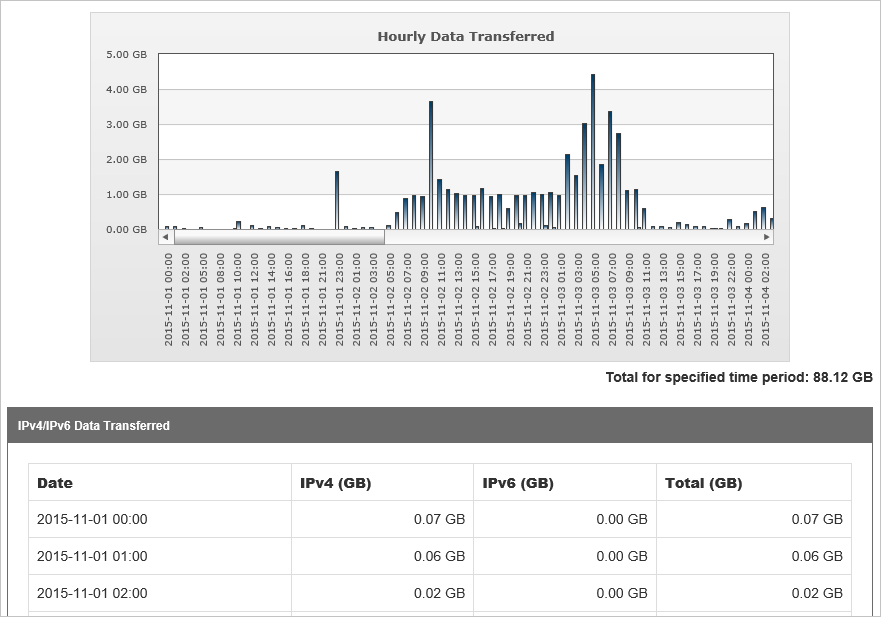

<properties
    pageTitle="Analisar padrões de uso do Azure CDN | Microsoft Azure"
    description="Você pode exibir os padrões de uso para sua CDN usando os seguintes relatórios: largura de banda, dados transferidos, ocorrências, status do Cache, a taxa de visitas de Cache, IPV4/IPV6 dados transferidos."
    services="cdn"
    documentationCenter=""
    authors="camsoper"
    manager="erikre"
    editor=""/>

<tags
    ms.service="cdn"
    ms.workload="tbd"
    ms.tgt_pltfrm="na"
    ms.devlang="na"
    ms.topic="article"
    ms.date="07/28/2016"
    ms.author="casoper"/>

# Analisar padrões de uso do Azure CDN

[AZURE.INCLUDE [cdn-verizon-only](../../includes/cdn-verizon-only.md)]

Você pode exibir os padrões de uso para sua CDN usando os seguintes relatórios:

- Largura de banda
- Dados transferidos
- Visitas
- Status de cache
- Taxa de acessos do cache
- Dados de IPv4/IPV6 transferidos

## Acessar relatórios HTTP avançados

1. Da lâmina CDN perfil, clique no botão **Gerenciar** .

    

    O portal de gerenciamento de CDN é aberta.

2. Passe o mouse sobre a guia de **análise** , em seguida, passe o mouse sobre o submenu **Core relatórios** .  Clique no relatório desejado no menu.

    

## Largura de banda

O relatório de largura de banda consiste em uma tabela de dados e gráfico indicando o uso de largura de banda para HTTP e HTTPS sobre um determinado período. Você pode exibir o uso de largura de banda em um POP específico ou todos os CDN aparece. Isso permite que você exiba o tráfego picos e a distribuição entre CDN aparece em Mbps.

- Selecione todos os nós de borda para ver o tráfego de todos os nós ou escolha um região/nó específico na lista suspensa.
- Selecione o intervalo de datas para exibir dados para hoje/esta semana/mês, etc. ou insira datas personalizadas, clique em "Ir" para certificar-se de que sua seleção for atualizada.
- Você pode exportar e baixar os dados clicando no ícone de planilha do excel localizado ao lado de "Ir".

O relatório é atualizado a cada 5 minutos.

## Dados transferidos

Este relatório consiste em uma tabela de dados e gráfico indicando a utilização de tráfego de HTTP e HTTPS sobre um determinado período. Você pode exibir o uso de tráfego em um POP específico ou todos os CDN aparece. Isso permite que você exiba o tráfego picos e a distribuição entre CDN aparece em GB.

- Selecione todos os nós de borda para ver o tráfego de todas as anotações ou escolha um região/nó específico na lista suspensa.
- Selecione o intervalo de datas para exibir dados para hoje/esta semana/mês, etc. ou insira datas personalizadas, clique em "Ir" para certificar-se de que sua seleção for atualizada.
- Você pode exportar e baixar os dados clicando no ícone de planilha do excel localizado ao lado de "Ir".

O relatório é atualizado a cada 5 minutos.

## Visitas (códigos de status)

Este relatório descreve a distribuição dos códigos de status da solicitação para o seu conteúdo. Cada solicitação de conteúdo irá gerar um código de status HTTP. O código de status descreve como borda aparece tratados a solicitação. Por exemplo, códigos de status de 2xx indicam que a solicitação foi fornecida com êxito para um cliente, enquanto um código de status 4xx indica que ocorreu um erro. Para obter mais detalhes sobre o código de status HTTP, consulte [códigos de status](https://en.wikipedia.org/wiki/List_of_HTTP_status_codes).

- Selecione o intervalo de datas para exibir dados para hoje/esta semana/mês, etc. ou insira datas personalizadas, clique em "Ir" para certificar-se de que sua seleção for atualizada.
- Você pode exportar e baixar os dados clicando em planilha do excel localizada ao lado de "Ir".

## Status de cache

Este relatório descreve a distribuição de visitas de cache e erros de cache de solicitação de cliente. Como o desempenho mais rápido for proveniente de ocorrências do cache, você pode otimizar velocidades de entrega de dados por minimizar erros de cache e ocorrências de cache expirada. Erros de cache podem ser reduzidos configurando seu servidor de origem para evitar a atribuição de cabeçalhos de resposta "no-cache", evitando o cache de cadeia de caracteres de consulta, exceto onde terminantemente necessário e evitando códigos de resposta não armazenável em cache. Cache expirado ocorrências podem ser evitar fazendo um ativo é idade máxima contanto que possível, para minimizar o número de solicitações para o servidor de origem.

### Status de cache principal incluem:

- TCP_HIT: Served da borda. O objeto estava em cache e não tinha excedido sua idade máx.
- TCP_MISS: Served da origem. O objeto não era no cache e a resposta foi para a origem.
- TCP_EXPIRED _MISS: Served da origem após revalidação com origem. O objeto estava em cache, mas tinha excedido sua idade máx. Uma revalidação com origem resultou no objeto do cache sendo substituído por uma nova resposta de origem.
- TCP_EXPIRED _HIT: Served da borda Após revalidação com origem. O objeto estava em cache, mas tinha excedido sua idade máx. Uma revalidação com o servidor de origem resultou no objeto do cache sendo inalterado.

- Selecione o intervalo de datas para exibir dados para hoje/esta semana/mês, etc. ou insira datas personalizadas, clique em "Ir" para certificar-se de que sua seleção for atualizada.
- Você pode exportar e baixar os dados clicando no ícone de planilha do excel localizado ao lado de "Ir".

### Lista completa de status de cache

- TCP_HIT - esse status é relatado quando uma solicitação for servida diretamente do POP para o cliente. Um ativo é atendido imediatamente de POP quando ele está em cache no POP mais próximo ao cliente e tem um válido time to live ou TTL. TTL é determinado pelos seguintes cabeçalhos de resposta:

    - Controle de cache: s-maxage
    - Controle de cache: idade máxima
    - Expirar

- TCP_MISS - este status indica que uma versão em cache do ativo solicitada não foi encontrada no POP mais próximo ao cliente. O ativo será solicitado de um servidor de origem ou de um servidor de proteção de origem. Se o servidor de origem ou o servidor de proteção de origem retorna um ativo, ele será served ao cliente e armazenados em cache no cliente e servidor de borda. Caso contrário, um código de status de não-200 (por exemplo, 403 Proibido, 404 não encontrado, etc.) será retornado.

- TCP_EXPIRED _HIT - esse status é relatado quando uma solicitação de que o destino de um ativo com um TTL expirado, como quando idade do ativo máxima expirou, foi fornecida diretamente do POP para o cliente.

    Uma solicitação de expirado normalmente resulta em uma solicitação de revalidação no servidor de origem. Em ordem para uma _HIT TCP_EXPIRED ocorra, o servidor de origem deve indicar que não existe uma versão mais recente do ativo. Esse tipo de situação normalmente atualizará esse ativo Cache-Control e expira.

- TCP_EXPIRED _MISS - esse status é relatado quando uma versão mais recente de um ativo em cache expirado é atendida de POP para o cliente. Isso ocorre quando o valor TTL de um ativo em cache expirou (por exemplo, expirado idade máxima) e o servidor de origem retorna uma versão mais recente do que ativo. Essa nova versão do ativo será disponibilizado para o cliente em vez da versão em cache. Além disso, ele será ser armazenadas em cache o servidor de borda e o cliente.

- CONFIG_NOCACHE - este status indica que uma configuração de cliente específicos na nossa borda POP impedido o ativo de sejam armazenados em cache.

- Nenhum - esse status indica que uma verificação de atualização de conteúdo de cache não foi executada.

- TCP_ CLIENT_REFRESH _MISS - esse status é relatado quando um cliente HTTP (por exemplo, navegador) força uma borda POP para recuperar uma nova versão de um ativo obsoleto do servidor de origem.

    Por padrão, nossos servidores impedem um cliente HTTP forçando nossos servidores de borda para recuperar uma nova versão do ativo do servidor de origem.

- TCP_ PARTIAL_HIT - esse status é relatado quando uma solicitação de intervalo de bytes resulta em uma ocorrência de um ativo parcialmente armazenadas em cache. O intervalo de bytes requisitado é atendido imediatamente de POP para o cliente.

- UNCACHEABLE - esse status é relatado quando cabeçalhos de Cache-Control e vencimento de um ativo indicam que ele deve não ser armazenados em cache em um POP ou por cliente HTTP. Esses tipos de solicitações são atendidos do servidor de origem

## Taxa de acessos do cache

Este relatório indica a porcentagem de solicitações de cache que foram atendidas diretamente do cache.

O relatório fornece os seguintes detalhes:

- O conteúdo solicitado foi cache em POP mais próximo ao solicitante.
- A solicitação foi served diretamente da borda da nossa rede.
- A solicitação não exigia revalidação com o servidor de origem.

O relatório não inclui:

- Solicitações negado devido às opções de filtragem de país/região.
- Solicitações de ativos cujos cabeçalhos indicam que eles devem não ser armazenados em cache. Por exemplo, Cache-Control: particular, Cache-Control: sem cache ou Pragma: sem cache cabeçalhos impedirá que um ativo sejam armazenados em cache.
- Solicitações de intervalo de bytes para conteúdo parcialmente em cache.

A fórmula é: (TCP_ SUCESSOS / (TCP_ SUCESSOS + TCP_MISS)) * 100

- Selecione o intervalo de datas para exibir dados para hoje/esta semana/mês, etc. ou insira datas personalizadas, clique em "Ir" para certificar-se de que sua seleção for atualizada.
- Você pode exportar e baixar os dados clicando no ícone de planilha do excel localizado ao lado de "Ir".

## Dados de IPv4/IPV6 transferidos

Esse relatório mostra a distribuição de uso de tráfego no IPV4 vs IPV6.

- Selecione o intervalo de datas para exibir dados para hoje/esta semana/mês, etc., ou insira datas personalizadas.
- Em seguida, clique em "Ir" para garantir que sua seleção é atualizada.

## Considerações

Relatórios só podem ser gerados nos últimos 18 meses.
