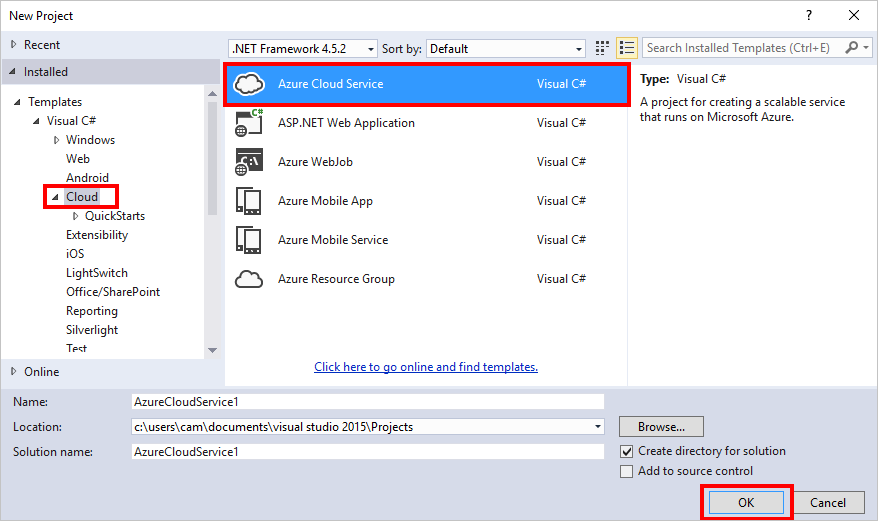
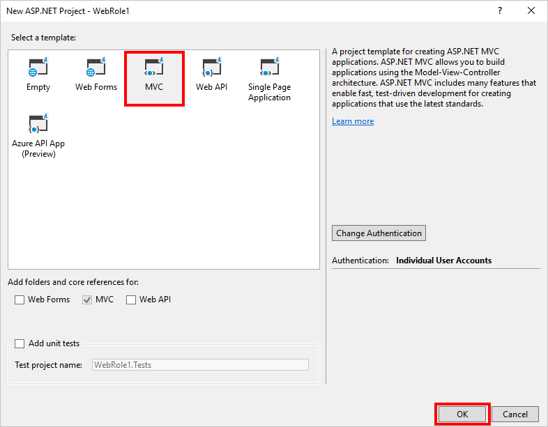
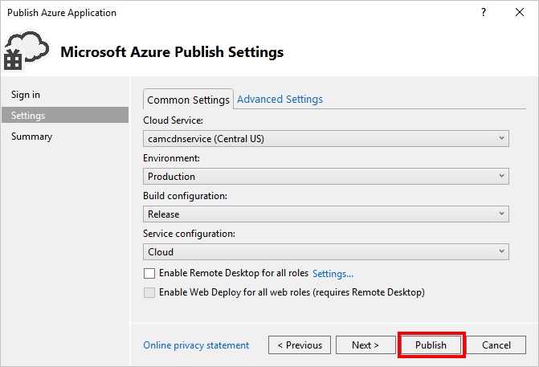

<properties
    pageTitle="Integrar um serviço na nuvem com o Azure CDN | Microsoft Azure"
    description="Um tutorial que ensina como implantar um serviço de nuvem que serve o conteúdo de um ponto de extremidade do Azure CDN integrado"
    services="cdn, cloud-services"
    documentationCenter=".net"
    authors="camsoper"
    manager="erikre"
    editor="tysonn"/>

<tags
    ms.service="cdn"
    ms.workload="tbd"
    ms.tgt_pltfrm="na"
    ms.devlang="dotnet"
    ms.topic="article"
    ms.date="07/28/2016"
    ms.author="casoper"/>

# Integrar um serviço na nuvem com o Azure CDN

Um serviço de nuvem pode ser integrado com o Azure CDN, servindo qualquer conteúdo de local do serviço na nuvem. Essa abordagem oferece as seguintes vantagens:

- Facilmente implantar e atualizar imagens, scripts e folhas de estilo em diretórios de projeto do seu serviço de nuvem
- Atualizar facilmente os pacotes NuGet no seu serviço de nuvem, como jQuery ou versões de inicialização
- Gerenciar seu aplicativo da Web e seu todos conteúdo served CDN da mesma interface Visual Studio
- Fluxo de trabalho de implantação unificado de seu aplicativo da Web e seu conteúdo served CDN
- Integrar ASP.NET empacotamento e minimização CDN do Azure

## O que você aprenderá ##

Neste tutorial, você aprenderá como:

-   [Integrar um ponto de extremidade do Azure CDN com o seu serviço de nuvem e servir conteúdo estático nas páginas da Web do Azure CDN](#deploy)
-   [Definir configurações de cache para conteúdo estático no seu serviço de nuvem](#caching)
-   [Servir o conteúdo das ações de controlador por meio de CDN do Azure](#controller)
-   [Servir agrupados e minified conteúdo por meio do Azure CDN preservando o experiência no Visual Studio de depuração de script](#bundling)
-   [Configurar fallback seus scripts e CSS quando seu CDN Azure está offline](#fallback)

## O que você criará ##

Você implantar uma função de Web de serviço de nuvem usando o modelo do ASP.NET MVC padrão, adicionar código para servir o conteúdo de uma CDN integrado do Azure, como uma imagem, resultados de ação de controlador e os arquivos de JavaScript e CSS padrão e também escrever código para configurar o mecanismo de fallback para pacotes servida que a CDN está offline.

## O que você vai precisar ##

Este tutorial tem os seguintes pré-requisitos:

-   Uma [conta do Microsoft Azure](/account/) de ativa
-   Visual Studio de 2015 com o [SDK do Azure](http://go.microsoft.com/fwlink/?linkid=518003&clcid=0x409)

> [AZURE.NOTE] Você precisará de uma conta do Azure para concluir este tutorial:
> + Você pode [Abrir uma conta do Azure gratuitamente](/pricing/free-trial/) - obtenha créditos que você pode usar para experimentar serviços Azure pagos e até mesmo depois que eles são usados até você pode manter a conta e uso livre Azure serviços, como sites.
> + Você pode [Ativar benefícios do assinante MSDN](/pricing/member-offers/msdn-benefits-details/) - assinatura MSDN Your lhe créditos todo mês que você pode usar para serviços do Azure pagos.

## Implantar um serviço de nuvem ##

Nesta seção, você irá implantar o modelo de aplicativo do ASP.NET MVC no Visual Studio 2015 padrão para uma função de Web de serviço de nuvem e integrar-o com um novo ponto de extremidade CDN. Siga as instruções abaixo:

1. No Visual Studio de 2015, criar um novo serviço de nuvem Azure na barra de menu indo para **arquivo > Novo > projeto > nuvem > serviço de nuvem do Azure**. Dê um nome e clique em **Okey**.

    

2. Selecione a **Função de Web do ASP.NET** e clique no **>** botão. Clique em Okey.

    

3. Selecione **MVC** e clique **Okey**.

    

4. Agora, publica esta função da Web em um serviço de nuvem Azure. O projeto de serviço de nuvem de atalho e selecione **Publicar**.

    

5. Se você não tiver entrado ainda no Microsoft Azure, clique na lista suspensa de **Adicionar uma conta …** e clique no item de menu **Adicionar uma conta** .

    

6. Na página entrar, entre com a conta da Microsoft usada para ativar sua conta do Azure.
7. Quando você estiver conectado, clique em **Avançar**.

    

8. Presumindo que você ainda não tiver criado uma conta de armazenamento ou serviço de nuvem, Visual Studio o ajudará a criar ambos. Na caixa de diálogo **Criar serviço de nuvem e conta** , digite o nome do serviço desejado e selecione a região desejada. Em seguida, clique em **criar**.

    

9. Na página de configurações de publicação, verifique a configuração e clique em **Publicar**.

    

    >[AZURE.NOTE] O processo de publicação para serviços de nuvem leva muito tempo. O habilitar Web implantar para opção de todas as funções pode tornar a depuração seu serviço de nuvem muito mais rápido, fornecendo atualizações rápidas (mas temporário) às funções da Web. Para obter mais informações sobre essa opção, consulte a [publicação de um serviço de nuvem usando as ferramentas do Azure](http://msdn.microsoft.com/library/ff683672.aspx).

    Quando o **Log de atividade do Microsoft Azure** mostra que o status da publicação é **concluída**, você irá criar um ponto de extremidade CDN integrada com esse serviço de nuvem.

    >[AZURE.WARNING] Se, após a publicação, o serviço de nuvem implantado exibe uma tela de erro, provavelmente é porque o serviço de nuvem que você já implantou está usando um [sistema operacional que não inclui o .NET 4.5.2 convidado](../cloud-services/cloud-services-guestos-update-matrix.md#news-updates).  Você pode contornar esse problema Implantando o [.NET 4.5.2 como uma tarefa de inicialização](../cloud-services/cloud-services-dotnet-install-dotnet.md).

## Criar um novo perfil CDN

Um perfil CDN é um conjunto de pontos de extremidade CDN.  Cada perfil contém um ou mais pontos de extremidade CDN.  Talvez você queira usar vários perfis para organizar seus pontos de extremidade CDN por domínio internet, aplicativo web ou algum outro critério.

> [AZURE.TIP] Se você já tiver um perfil CDN que você deseja usar para este tutorial, vá para [criar um novo ponto de extremidade CDN](#create-a-new-cdn-endpoint).

[AZURE.INCLUDE [cdn-create-profile](../../includes/cdn-create-profile.md)]

## Criar um novo ponto de extremidade CDN

**Para criar um novo ponto de extremidade CDN para sua conta de armazenamento**

1. No [Portal de gerenciamento do Azure](https://portal.azure.com), navegue até seu perfil CDN.  Você pode ter fixada ao painel na etapa anterior.  Se você não, você pode encontrá-lo clicando em **Procurar**, em seguida **perfis CDN**e, em seguida, clicando no perfil que você planeja adicionar seu ponto de extremidade para.

    A lâmina de perfil CDN é exibida.

    ![Perfil CDN][cdn-profile-settings]

2. Clique no botão **Adicionar ponto de extremidade** .

    ![Adicionar botão de ponto de extremidade][cdn-new-endpoint-button]

    A lâmina de **Adicionar um ponto de extremidade** é exibida.

    ![Adicionar blade de ponto de extremidade][cdn-add-endpoint]

3. Insira um **nome** para este ponto de extremidade CDN.  Esse nome será usado para acessar os recursos armazenados em cache no domínio `<EndpointName>.azureedge.net`.

4. Na lista suspensa **tipo de origem** , selecione o *serviço de nuvem*.  

5. Na lista suspensa **nome do host de origem** , selecione seu serviço de nuvem.

6. Deixe os padrões para o **caminho de origem**, **cabeçalho do host de origem**e **porta de protocolo/origem**.  Você deve especificar pelo menos um protocolo (HTTP ou HTTPS).

7. Clique no botão **Adicionar** para criar o novo ponto de extremidade.

8. Depois que o ponto de extremidade é criado, ele aparece em uma lista de pontos de extremidade para o perfil. O modo de exibição de lista mostra o URL usar para acessar o conteúdo em cache, bem como o domínio de origem.

    ![Ponto de extremidade CDN][cdn-endpoint-success]

    > [AZURE.NOTE] O ponto de extremidade não estará disponível imediatamente para uso.  Pode levar até 90 minutos para o registro a se propagar através da rede CDN. Os usuários que tentarem usar o nome de domínio CDN imediatamente podem receber o código de status 404 até que o conteúdo está disponível via a CDN.

## Testar o ponto de extremidade CDN

Quando o status da publicação estiver **concluído**, abra uma janela do navegador e navegue até * *http://<cdnName>*.azureedge.net/Content/bootstrap.css**. Na minha instalação, essa URL é:

    http://camservice.azureedge.net/Content/bootstrap.css

Que corresponde a seguinte URL de origem no ponto de extremidade CDN:

    http://camcdnservice.cloudapp.net/Content/bootstrap.css

Quando você navegar para * *http://*&lt;cdnName >*.azureedge.net/Content/bootstrap.css**, dependendo do seu navegador, você será solicitado baixar ou abrir o bootstrap.css que vieram do seu aplicativo Web publicado.

Da mesma forma, você pode acessar qualquer URL acessível publicamente em * *http://*&lt;serviceName >*.cloudapp.net/**, diretamente do seu ponto de extremidade CDN. Por exemplo:

-   Um arquivo. js do caminho /Script
-   Qualquer arquivo de conteúdo do /Content caminho
-   Qualquer controlador/ação
-   Se a cadeia de caracteres de consulta estiver habilitada seu ponto de extremidade de CDN, qualquer URL com cadeias de caracteres de consulta

Na verdade, com a configuração acima, você pode hospedar o serviço de nuvem inteira do * *http://*&lt;cdnName >*.azureedge.net/**. Se eu navegar até **http://camservice.azureedge.net/ * *, posso obter o resultado de ação de Home/índice.

Isso não significa, no entanto, que é sempre uma boa ideia (ou geralmente uma boa ideia) para servir um serviço de nuvem inteira por meio de CDN do Azure. Alguns das condições são:

-   Essa abordagem requer todo o seu site para ser público, pois CDN Azure não pode servir qualquer conteúdo particular neste momento.
-   Se o ponto de extremidade CDN ficar offline por algum motivo, se manutenção agendada ou erro de usuário, seu serviço de nuvem inteira fica offline, a menos que os clientes podem ser redirecionados para a URL de origem * *http://*&lt;serviceName >*.cloudapp.net/**.
-   Mesmo com as configurações de Cache-Control personalizadas (consulte [Configurar opções de cache para arquivos estáticos em seu serviço de nuvem](#caching)), um ponto de extremidade CDN não melhorar o desempenho de conteúdo altamente dinâmicos. Se você tentou carregar a home page do seu ponto de extremidade CDN como mostrado acima, observe que levou pelo menos 5 segundos para carregar a home page padrão na primeira vez, o que é uma página bastante simple. Imagine o que poderia acontecer para a experiência do cliente se esta página contém conteúdo dinâmico que deve atualizar a cada minuto. Servir conteúdo dinâmico de um ponto de extremidade CDN requer expiração de cache pequeno, o que resulta em erros de cache frequente o ponto de extremidade de CDN. Isso afeta o desempenho do seu serviço de nuvem e anule a finalidade de uma CDN.

A alternativa é determinar qual conteúdo para servir de CDN Azure em uma base por caso em seu serviço de nuvem. Para esse fim, você já viu como acessar arquivos de conteúdo individual do ponto de extremidade CDN. Para mostrar como servir uma ação de controlador específico por meio do ponto de extremidade CDN em [servir o conteúdo das ações de controlador por meio de CDN do Azure](#controller).

## Configurar opções de cache para arquivos estáticos no seu serviço de nuvem ##

Com a integração de CDN Azure em seu serviço de nuvem, você pode especificar como deseja que o conteúdo estático sejam armazenadas em cache no ponto de extremidade CDN. Para fazer isso, abra *Web. config* do seu projeto de função Web (por exemplo, WebRole1) e adicione um `<staticContent>` elemento `<system.webServer>`. O XML abaixo configura o cache para expirar em 3 dias.  

    <system.webServer>
      <staticContent>
        <clientCache cacheControlMode="UseMaxAge" cacheControlMaxAge="3.00:00:00"/>
      </staticContent>
      ...
    </system.webServer>

Depois de fazer isso, todos os arquivos estáticos no seu serviço de nuvem irá observar a mesma regra em seu cache CDN. Para um controle mais granular das configurações de cache, adicione um arquivo *Web. config* em uma pasta e suas configurações de lá. Por exemplo, adicionar um arquivo *Web. config* à pasta *\Content* e substituir o conteúdo com o seguinte XML:

    <?xml version="1.0"?>
    <configuration>
      <system.webServer>
        <staticContent>
          <clientCache cacheControlMode="UseMaxAge" cacheControlMaxAge="15.00:00:00"/>
        </staticContent>
      </system.webServer>
    </configuration>

Esta configuração faz com que todos os arquivos estáticos da pasta *\Content* sejam armazenadas em cache por 15 dias.

Para obter mais informações sobre como configurar o `<clientCache>` elemento, consulte [Cache cliente &lt;clientCache >](http://www.iis.net/configreference/system.webserver/staticcontent/clientcache).

Em [servir o conteúdo das ações de controlador por meio de CDN do Azure](#controller), eu também mostrará você como você pode definir configurações de cache para resultados de ação do controlador no cache CDN.

## Servir o conteúdo das ações de controlador por meio de CDN do Azure ##

Quando você integra uma função de Web de serviço de nuvem com CDN Azure, é relativamente fácil servir o conteúdo das ações de controlador por meio de CDN o Azure. Diferente de servindo seu serviço de nuvem diretamente por meio do Azure CDN (demonstrou acima), [Maarten Balliauw](https://twitter.com/maartenballiauw) mostra como fazer isso com uma diversão controlador de MemeGenerator na [latência reduzindo na web com o CDN do Azure](http://channel9.msdn.com/events/TechDays/Techdays-2014-the-Netherlands/Reducing-latency-on-the-web-with-the-Windows-Azure-CDN). Posso será simplesmente reproduzi-lo aqui.

Suponha que no seu serviço de nuvem que você deseja gerar memes com base em uma imagem de Chuck Norris novato (foto pelo [Antonio Light](http://www.flickr.com/photos/alan-light/218493788/)) como esta:

Você tem um simples `Index` ação que permite que os clientes especificar os superlativos na imagem, em seguida, gera o meme depois que eles postarem a ação. Como é Chuck Norris, esperado nesta página se tornar totalmente populares globalmente. Este é um bom exemplo de servir conteúdo dinâmico semiestruturados com CDN do Azure.

Siga as etapas acima para esta ação do controlador de instalação:

1. Na pasta *\Controllers* , crie um novo arquivo. cs chamado *MemeGeneratorController.cs* e substitua o conteúdo com o seguinte código. Certifique-se de substituir a parte realçada com seu nome CDN.  

        using System;
        using System.Collections.Generic;
        using System.Diagnostics;
        using System.Drawing;
        using System.IO;
        using System.Net;
        using System.Web.Hosting;
        using System.Web.Mvc;
        using System.Web.UI;

        namespace WebRole1.Controllers
        {
            public class MemeGeneratorController : Controller
            {
                static readonly Dictionary<string, Tuple<string ,string>> Memes = new Dictionary<string, Tuple<string, string>>();

                public ActionResult Index()
                {
                    return View();
                }

                [HttpPost, ActionName("Index")]
                public ActionResult Index_Post(string top, string bottom)
                {
                    var identifier = Guid.NewGuid().ToString();
                    if (!Memes.ContainsKey(identifier))
                    {
                        Memes.Add(identifier, new Tuple<string, string>(top, bottom));
                    }

                    return Content("<a href=\"" + Url.Action("Show", new {id = identifier}) + "\">here's your meme</a>");
                }

                [OutputCache(VaryByParam = "*", Duration = 1, Location = OutputCacheLocation.Downstream)]
                public ActionResult Show(string id)
                {
                    Tuple<string, string> data = null;
                    if (!Memes.TryGetValue(id, out data))
                    {
                        return new HttpStatusCodeResult(HttpStatusCode.NotFound);
                    }

                    if (Debugger.IsAttached) // Preserve the debug experience
                    {
                        return Redirect(string.Format("/MemeGenerator/Generate?top={0}&bottom={1}", data.Item1, data.Item2));
                    }
                    else // Get content from Azure CDN
                    {
                        return Redirect(string.Format("http://<yourCdnName>.azureedge.net/MemeGenerator/Generate?top={0}&bottom={1}", data.Item1, data.Item2));
                    }
                }

                [OutputCache(VaryByParam = "*", Duration = 3600, Location = OutputCacheLocation.Downstream)]
                public ActionResult Generate(string top, string bottom)
                {
                    string imageFilePath = HostingEnvironment.MapPath("~/Content/chuck.bmp");
                    Bitmap bitmap = (Bitmap)Image.FromFile(imageFilePath);

                    using (Graphics graphics = Graphics.FromImage(bitmap))
                    {
                        SizeF size = new SizeF();
                        using (Font arialFont = FindBestFitFont(bitmap, graphics, top.ToUpperInvariant(), new Font("Arial Narrow", 100), out size))
                        {
                            graphics.DrawString(top.ToUpperInvariant(), arialFont, Brushes.White, new PointF(((bitmap.Width - size.Width) / 2), 10f));
                        }
                        using (Font arialFont = FindBestFitFont(bitmap, graphics, bottom.ToUpperInvariant(), new Font("Arial Narrow", 100), out size))
                        {
                            graphics.DrawString(bottom.ToUpperInvariant(), arialFont, Brushes.White, new PointF(((bitmap.Width - size.Width) / 2), bitmap.Height - 10f - arialFont.Height));
                        }
                    }

                    MemoryStream ms = new MemoryStream();
                    bitmap.Save(ms, System.Drawing.Imaging.ImageFormat.Png);
                    return File(ms.ToArray(), "image/png");
                }

                private Font FindBestFitFont(Image i, Graphics g, String text, Font font, out SizeF size)
                {
                    // Compute actual size, shrink if needed
                    while (true)
                    {
                        size = g.MeasureString(text, font);

                        // It fits, back out
                        if (size.Height < i.Height &&
                             size.Width < i.Width) { return font; }

                        // Try a smaller font (90% of old size)
                        Font oldFont = font;
                        font = new Font(font.Name, (float)(font.Size * .9), font.Style);
                        oldFont.Dispose();
                    }
                }
            }
        }

2. Clique com botão direito no padrão `Index()` ação e selecione **Adicionar modo de exibição**.

    

3.  Aceite as configurações a seguir e clique em **Adicionar**.

    

4. Abra o novo *Views\MemeGenerator\Index.cshtml* e substitua o conteúdo com o seguinte HTML simple para enviar os superlativos:

        <h2>Meme Generator</h2>

        <form action="" method="post">
            <input type="text" name="top" placeholder="Enter top text here" />
             
            <input type="text" name="bottom" placeholder="Enter bottom text here" />
             
            <input class="btn" type="submit" value="Generate meme" />
        </form>

5. Publicar o serviço de nuvem novamente e navegue até * *http://*&lt;serviceName >*.cloudapp.net/MemeGenerator/Index** no seu navegador.

Quando você envia os valores de formulário para `/MemeGenerator/Index`, o `Index_Post` método de ação retorna um link para o `Show` método de ação com o respectivo identificador de entrada. Quando você clica no link, atingir o seguinte código:  

    [OutputCache(VaryByParam = "*", Duration = 1, Location = OutputCacheLocation.Downstream)]
    public ActionResult Show(string id)
    {
        Tuple<string, string> data = null;
        if (!Memes.TryGetValue(id, out data))
        {
            return new HttpStatusCodeResult(HttpStatusCode.NotFound);
        }

        if (Debugger.IsAttached) // Preserve the debug experience
        {
            return Redirect(string.Format("/MemeGenerator/Generate?top={0}&bottom={1}", data.Item1, data.Item2));
        }
        else // Get content from Azure CDN
        {
            return Redirect(string.Format("http://<yourCDNName>.azureedge.net/MemeGenerator/Generate?top={0}&bottom={1}", data.Item1, data.Item2));
        }
    }

Se seu local depurador estiver conectado, você obterá a experiência de depuração regular com um local redirecionamento. Se ele estiver em execução no serviço de nuvem, ele irá redirecioná para:

    http://<yourCDNName>.azureedge.net/MemeGenerator/Generate?top=<formInput>&bottom=<formInput>

Que corresponde a seguinte URL de origem seu ponto de extremidade de CDN:

    http://<youCloudServiceName>.cloudapp.net/MemeGenerator/Generate?top=<formInput>&bottom=<formInput>

Você pode usar o `OutputCacheAttribute` atributo na `Generate` método para especificar como o resultado de ação deve ser armazenados em cache, qual CDN Azure manterá. O código a seguir especificam uma expiração de cache de 1 hora (3.600 segundos).

    [OutputCache(VaryByParam = "*", Duration = 3600, Location = OutputCacheLocation.Downstream)]

Da mesma forma, você pode servir o conteúdo de qualquer ação de controlador em seu serviço de nuvem por meio de seu CDN do Azure, com a opção de cache desejada.

A próxima seção, para mostrar como servir o scripts agrupados e minified e CSS por meio de CDN do Azure.

## Integrar ASP.NET empacotamento e minimização CDN do Azure ##

Folhas de estilo CSS e scripts alterar raramente e são fortes candidatos para o cache de CDN do Azure. Atendendo a função Web inteira por meio de seu CDN Azure é a maneira mais fácil para integrar empacotamento e minimização CDN do Azure. No entanto, talvez não quiser fazer isso, eu mostrará como fazê-lo enquanto preserva a experiência de develper desejado do ASP.NET empacotamento e minimização, tais como:

-   Experiência de modo de depuração excelentes
-   Implantação simplificada
-   Atualizações de imediatas para clientes para atualizações de versão de script/CSS
-   Mecanismo de fallback quando o ponto de extremidade de CDN falhar
-   Minimizar a modificação de código

No projeto **WebRole1** que você criou no [integrar um ponto de extremidade do Azure CDN com o Azure conteúdo de estático site e servir em suas páginas da Web do Azure CDN](#deploy), abra *App_Start\BundleConfig.cs* e dê uma olhada na `bundles.Add()` chamadas de método.

    public static void RegisterBundles(BundleCollection bundles)
    {
        bundles.Add(new ScriptBundle("~/bundles/jquery").Include(
                    "~/Scripts/jquery-{version}.js"));
        ...
    }

O primeiro `bundles.Add()` instrução adiciona um pacote de script no diretório virtual `~/bundles/jquery`. Em seguida, abra *Views\Shared\_Layout.cshtml* para ver como a marca de pacote de script é renderizada. Você deve ser capaz de localizar a seguinte linha de código do Razor:

    @Scripts.Render("~/bundles/jquery")

Quando este código Razor é executado na função Web Azure, ele processará um `

No entanto, quando ele é executado no Visual Studio digitando `F5`, ele processará cada arquivo de script no pacote individualmente (no caso acima, apenas um arquivo de script está no pacote):

    

Isso permite depurar o código JavaScript no seu ambiente de desenvolvimento enquanto reduzindo conexões de cliente simultâneas (agrupamento) e melhorando o arquivo de desempenho (minimização) de download em produção. É um ótimo recurso para preservar com integração de CDN do Azure. Além disso, como o pacote renderizado já contém uma cadeia de caracteres de versão gerado automaticamente, você deseja duplicar essa funcionalidade portanto o sempre que você atualiza sua versão do jQuery por meio do NuGet, ele pode ser atualizado no lado do cliente assim que possível.

Siga as etapas abaixo para integração ASP.NET agrupando e minimização com seu ponto de extremidade CDN.

1. De volta ao *App_Start\BundleConfig.cs*, modificar o `bundles.Add()` métodos para usar um outro [Construtor de pacote](http://msdn.microsoft.com/library/jj646464.aspx), que especifica um endereço CDN. Para fazer isso, substitua o `RegisterBundles` definição de método com o seguinte código:  

        public static void RegisterBundles(BundleCollection bundles)
        {
            bundles.UseCdn = true;
            var version = System.Reflection.Assembly.GetAssembly(typeof(Controllers.HomeController))
                .GetName().Version.ToString();
            var cdnUrl = "http://<yourCDNName>.azureedge.net/{0}?v=" + version;

            bundles.Add(new ScriptBundle("~/bundles/jquery", string.Format(cdnUrl, "bundles/jquery")).Include(
                        "~/Scripts/jquery-{version}.js"));

            bundles.Add(new ScriptBundle("~/bundles/jqueryval", string.Format(cdnUrl, "bundles/jqueryval")).Include(
                        "~/Scripts/jquery.validate*"));

            // Use the development version of Modernizr to develop with and learn from. Then, when you're
            // ready for production, use the build tool at http://modernizr.com to pick only the tests you need.
            bundles.Add(new ScriptBundle("~/bundles/modernizr", string.Format(cdnUrl, "bundles/modernizer")).Include(
                        "~/Scripts/modernizr-*"));

            bundles.Add(new ScriptBundle("~/bundles/bootstrap", string.Format(cdnUrl, "bundles/bootstrap")).Include(
                        "~/Scripts/bootstrap.js",
                        "~/Scripts/respond.js"));

            bundles.Add(new StyleBundle("~/Content/css", string.Format(cdnUrl, "Content/css")).Include(
                        "~/Content/bootstrap.css",
                        "~/Content/site.css"));
        }

    Certifique-se de substituir `<yourCDNName>` com o nome do seu CDN do Azure.

    Em palavras simples, você está definindo `bundles.UseCdn = true` e adicionou uma URL de CDN elaborada com cuidado para cada conjunto. Por exemplo, o primeiro construtor no código:

        new ScriptBundle("~/bundles/jquery", string.Format(cdnUrl, "bundles/jquery"))

    é a mesma que:

        new ScriptBundle("~/bundles/jquery", string.Format(cdnUrl, "http://<yourCDNName>.azureedge.net/bundles/jquery?v=<W.X.Y.Z>"))

    Este construtor informa ASP.NET empacotamento e minimização para processar arquivos de script individuais quando depurado localmente, mas use o endereço CDN especificado para acessar o script em questão. No entanto, observe duas características importantes com esta URL CDN elaborada com cuidado:

    -   A origem para esta URL CDN é `http://<yourCloudService>.cloudapp.net/bundles/jquery?v=<W.X.Y.Z>`, que é realmente o diretório virtual do pacote de script em seu serviço de nuvem.
    -   Como você está usando o construtor CDN, a marca de script CDN para o pacote não contém mais a cadeia de caracteres de versão gerado automaticamente na URL processada. Você deve gerar manualmente uma cadeia de caracteres de versão exclusivo sempre que o pacote de script é modificado para forçar um erro de cache em seu CDN do Azure. Ao mesmo tempo, essa cadeia de caracteres de versão exclusivo deve permanecer constante durante toda a vida da implantação maximizar ocorrências de cache em seu CDN Azure após o pacote de implantação.
    -   A cadeia de caracteres de consulta v = < w.x.y. z > recebe de *Properties\AssemblyInfo.cs* no seu projeto de função Web. Você pode ter um fluxo de trabalho de implantação que inclui incrementar a versão do assembly toda vez que você publica no Azure. Ou, você pode modificar apenas *Properties\AssemblyInfo.cs* em seu projeto para incrementar automaticamente a cadeia de caracteres de versão sempre que você criar, usar o caractere curinga ' *'. Por exemplo:

            [assembly: AssemblyVersion("1.0.0.*")]

        Qualquer outra estratégia para simplificar gerando uma cadeia de caracteres exclusiva para a vida de uma implantação funcionará aqui.

3. Republicar o serviço de nuvem e acessar a home page.

4. Exiba o código HTML para a página. Você deve ser capaz de ver a URL de CDN processada, com uma cadeia de caracteres de versão exclusivo sempre que você republicar alterações ao seu serviço de nuvem. Por exemplo:  

        ...

        <link href="http://camservice.azureedge.net/Content/css?v=1.0.0.25449" rel="stylesheet"/>

        

        ...

        

        

        ...

5. No Visual Studio, depurar o serviço de nuvem no Visual Studio digitando `F5`.,

6. Exiba o código HTML para a página. Você ainda verá cada arquivo de script processado individualmente para que você possa ter uma depuração consistente experiência no Visual Studio.  

        ...

            <link href="/Content/bootstrap.css" rel="stylesheet"/>
        <link href="/Content/site.css" rel="stylesheet"/>

            

        ...

            

            
        

        ...   

## Mecanismo de fallback para URLs de CDN ##

Quando o ponto de extremidade do Azure CDN falha por algum motivo, desejar que sua página da Web para ser inteligente o suficiente para acessar o seu servidor de Web de origem como a opção de fallback para carregar JavaScript ou inicialização. É grave o suficiente para perder imagens em seu site devido a indisponibilidade CDN, mas muito mais grave perder funcionalidade de página fundamentais fornecida pelo seu scripts e folhas de estilo.

A classe de [pacote](http://msdn.microsoft.com/library/system.web.optimization.bundle.aspx) contém uma propriedade chamada [CdnFallbackExpression](http://msdn.microsoft.com/library/system.web.optimization.bundle.cdnfallbackexpression.aspx) que permite que você configure o mecanismo de fallback para falha CDN. Para usar essa propriedade, siga as etapas abaixo:

1. Em seu projeto de função Web, abra *App_Start\BundleConfig.cs*, onde você adicionou uma URL de CDN em cada [Construtor de pacote](http://msdn.microsoft.com/library/jj646464.aspx)e faça as seguintes alterações realçadas para adicionar o mecanismo de fallback para os pacotes de padrão:  

        public static void RegisterBundles(BundleCollection bundles)
        {
            var version = System.Reflection.Assembly.GetAssembly(typeof(BundleConfig))
                .GetName().Version.ToString();
            var cdnUrl = "http://cdnurl.azureedge.net/.../{0}?" + version;
            bundles.UseCdn = true;

            bundles.Add(new ScriptBundle("~/bundles/jquery", string.Format(cdnUrl, "bundles/jquery"))
                        { CdnFallbackExpression = "window.jquery" }
                        .Include("~/Scripts/jquery-{version}.js"));

            bundles.Add(new ScriptBundle("~/bundles/jqueryval", string.Format(cdnUrl, "bundles/jqueryval"))
                        { CdnFallbackExpression = "$.validator" }
                        .Include("~/Scripts/jquery.validate*"));

            // Use the development version of Modernizr to develop with and learn from. Then, when you&#39;re
            // ready for production, use the build tool at http://modernizr.com to pick only the tests you need.
            bundles.Add(new ScriptBundle("~/bundles/modernizr", string.Format(cdnUrl, "bundles/modernizer"))
                        { CdnFallbackExpression = "window.Modernizr" }
                        .Include("~/Scripts/modernizr-*"));

            bundles.Add(new ScriptBundle("~/bundles/bootstrap", string.Format(cdnUrl, "bundles/bootstrap"))     
                        { CdnFallbackExpression = "$.fn.modal" }
                        .Include(
                                "~/Scripts/bootstrap.js",
                                "~/Scripts/respond.js"));

            bundles.Add(new StyleBundle("~/Content/css", string.Format(cdnUrl, "Content/css")).Include(
                        "~/Content/bootstrap.css",
                        "~/Content/site.css"));
        }

    Quando `CdnFallbackExpression` é não nulo, script é inserido no HTML para testar se o pacote é carregado com êxito e, caso contrário, acessar o pacote diretamente do servidor de Web de origem. Essa propriedade deve ser definida como uma expressão de JavaScript que testa se o pacote CDN respectivo é carregado corretamente. A expressão necessária para testar cada pacote difere de acordo com o conteúdo. Para os pacotes de padrão acima:

    -   `window.jquery`é definido em jquery-{version}. js
    -   `$.validator`é definido em jquery.validate.js
    -   `window.Modernizr`é definido em modernizer-{version}. js
    -   `$.fn.modal`é definido em bootstrap.js

    Você deve ter notado que eu não definiu CdnFallbackExpression para o `~/Cointent/css` pacote. Isso ocorre porque atualmente não há um [erro no System.Web.Optimization](https://aspnetoptimization.codeplex.com/workitem/104) que insere um `

            
        

        ...

            
        

            
        

        ...

    Observe que o script inserido para o pacote CSS ainda contém o excedente errôneo do `CdnFallbackExpression` propriedade na linha:

        }())||document.write('

    Mas desde a primeira parte do | | expressão sempre retornará true (na linha diretamente acima), a função Document nunca será executada.

## Mais informações ##
- [Visão geral da rede Azure fornecimento de conteúdo (CDN)](http://msdn.microsoft.com/library/azure/ff919703.aspx)
- [Usando o Azure CDN](cdn-create-new-endpoint.md)
- [Empacotamento do ASP.NET e minimização](http://www.asp.net/mvc/tutorials/mvc-4/bundling-and-minification)

[new-cdn-profile]: ./media/cdn-cloud-service-with-cdn/cdn-new-profile.png
[cdn-profile-settings]: ./media/cdn-cloud-service-with-cdn/cdn-profile-settings.png
[cdn-new-endpoint-button]: ./media/cdn-cloud-service-with-cdn/cdn-new-endpoint-button.png
[cdn-add-endpoint]: ./media/cdn-cloud-service-with-cdn/cdn-add-endpoint.png
[cdn-endpoint-success]: ./media/cdn-cloud-service-with-cdn/cdn-endpoint-success.png
